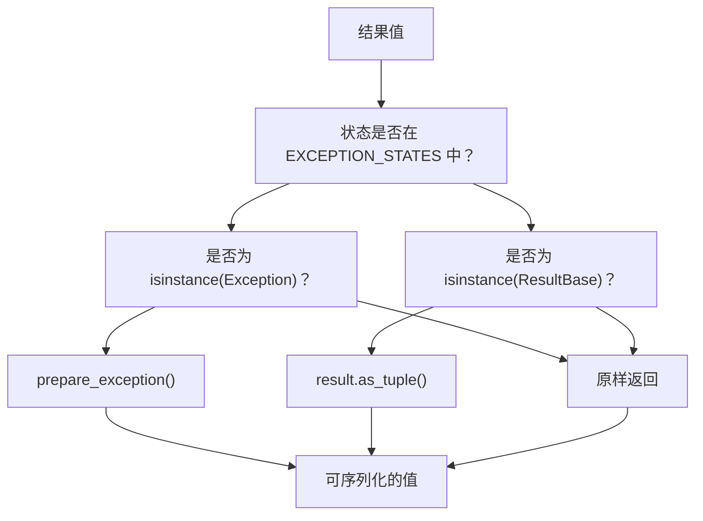
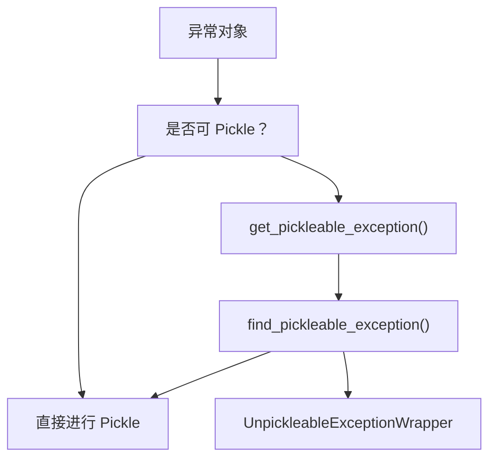
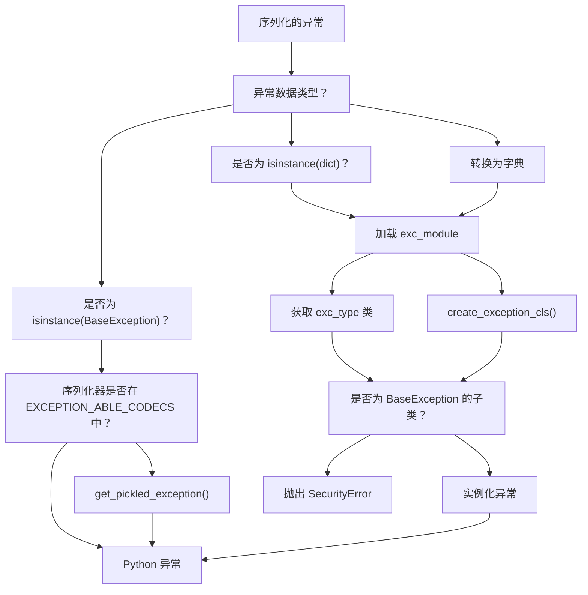
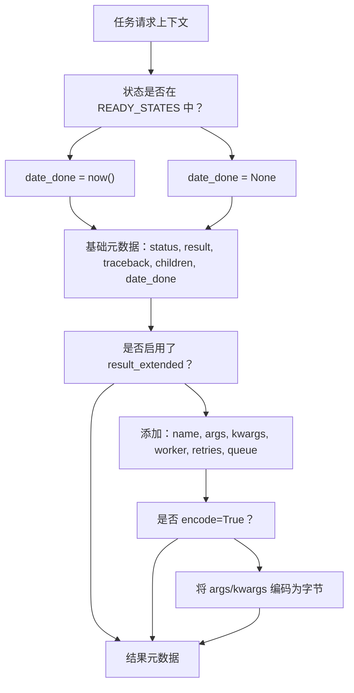
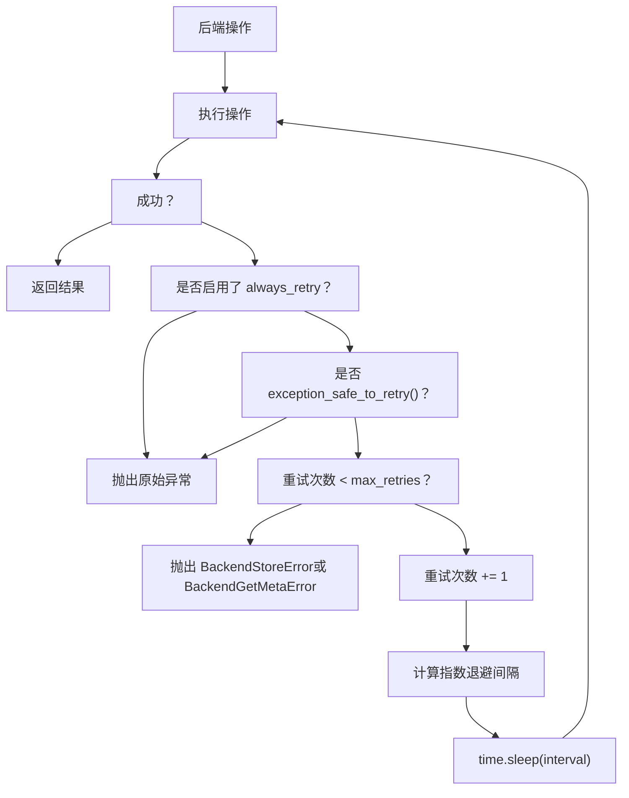
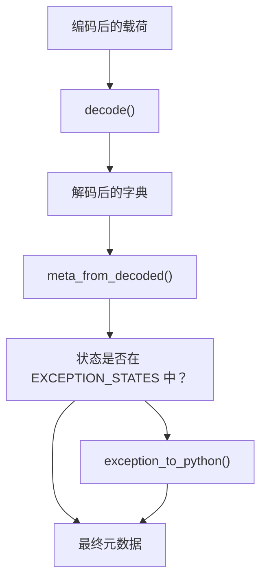

# 结果序列化与检索

相关源文件

-   [celery/app/builtins.py](https://github.com/celery/celery/blob/4d068b56/celery/app/builtins.py)
-   [celery/backends/base.py](https://github.com/celery/celery/blob/4d068b56/celery/backends/base.py)
-   [celery/backends/redis.py](https://github.com/celery/celery/blob/4d068b56/celery/backends/redis.py)
-   [celery/result.py](https://github.com/celery/celery/blob/4d068b56/celery/result.py)
-   [docs/userguide/configuration.rst](https://github.com/celery/celery/blob/4d068b56/docs/userguide/configuration.rst)
-   [t/unit/backends/test\_base.py](https://github.com/celery/celery/blob/4d068b56/t/unit/backends/test_base.py)
-   [t/unit/backends/test\_redis.py](https://github.com/celery/celery/blob/4d068b56/t/unit/backends/test_redis.py)
-   [t/unit/tasks/test\_chord.py](https://github.com/celery/celery/blob/4d068b56/t/unit/tasks/test_chord.py)
-   [t/unit/tasks/test\_result.py](https://github.com/celery/celery/blob/4d068b56/t/unit/tasks/test_result.py)

本页面描述了任务结果在存储到后端时如何进行序列化，以及在被客户端检索时如何进行反序列化。它涵盖了结果的编码/解码、异常处理、安全检查以及 `AsyncResult.get()` 所使用的轮询机制。有关后端架构和实现的信息，请参阅[后端架构](/celery/celery/6.1-backend-architecture)。有关特定后端特性的详情，请参阅[后端实现](/celery/celery/6.2-backend-implementations)。

## 结果生命周期概览 (Overview of Result Lifecycle)

当任务完成时，其返回值必须被序列化并存储。当客户端检索该结果时，它必须被反序列化回 Python 对象。此过程涉及多个步骤，以处理不同的数据类型、异常和安全问题。

> **[Mermaid sequence]**
> *(图表结构无法解析)*

来源：[celery/backends/base.py176-187](https://github.com/celery/celery/blob/4d068b56/celery/backends/base.py#L176-L187) [celery/backends/base.py550-607](https://github.com/celery/celery/blob/4d068b56/celery/backends/base.py#L550-L607) [celery/result.py190-261](https://github.com/celery/celery/blob/4d068b56/celery/result.py#L190-L261)

## 结果编码 (Result Encoding)

### 核心编码方法

`Backend` 类提供了一个多阶段的编码流水线：

| 方法 | 目的 | 位置 |
| --- | --- | --- |
| `prepare_value()` | 将结果对象转换为可序列化形式 | [celery/backends/base.py505-509](https://github.com/celery/celery/blob/4d068b56/celery/backends/base.py#L505-L509) |
| `encode_result()` | 根据状态准备结果/异常 | [celery/backends/base.py550-553](https://github.com/celery/celery/blob/4d068b56/celery/backends/base.py#L550-L553) |
| `encode()` | 使用配置的序列化器序列化数据 | [celery/backends/base.py511-513](https://github.com/celery/celery/blob/4d068b56/celery/backends/base.py#L511-L513) |
| `_encode()` | 对 kombu 的底层序列化调用 | [celery/backends/base.py515-516](https://github.com/celery/celery/blob/4d068b56/celery/backends/base.py#L515-L516) |

#### 结果值准备 (Result Value Preparation)


**结果值准备逻辑**

`prepare_value()` 方法处理特殊情况：

-   如果 `serializer != 'pickle'` 且结果是一个 `ResultBase`（AsyncResult, GroupResult），它会通过 `as_tuple()` 转换为元组表现形式，以避免循环引用。
-   否则，返回未修改的结果以便直接序列化。

`encode_result()` 方法根据任务状态进行路由：

-   如果状态在 `EXCEPTION_STATES` 中且结果是一个 `Exception`，则调用 `prepare_exception()`。
-   否则，调用 `prepare_value()`。

来源：[celery/backends/base.py505-509](https://github.com/celery/celery/blob/4d068b56/celery/backends/base.py#L505-L509) [celery/backends/base.py550-553](https://github.com/celery/celery/blob/4d068b56/celery/backends/base.py#L550-L553)

#### 序列化格式 (Serialization Format)

后端使用在 `app.conf.result_serializer` 中配置的序列化器（默认：'json'）。序列化器决定了：

-   **Content-Type**：序列化数据的 MIME 类型（例如 'application/json'）
-   **Content-Encoding**：所使用的编码（例如 'utf-8'）
-   **编码函数 (Encoder function)**：来自 `kombu.serialization` 的实际序列化函数

来源：[celery/backends/base.py143-146](https://github.com/celery/celery/blob/4d068b56/celery/backends/base.py#L143-L146)

## 异常序列化

异常处理是结果序列化中最复杂的方面之一，因为异常必须在客户端重建，且可能跨越不同的 Python 环境。

### 序列化策略

序列化异常的策略取决于所配置的序列化器：

#### 基于 Pickle 的序列化器

对于 `EXCEPTION_ABLE_CODECS` 中的序列化器（目前仅有 `'pickle'`）：


**Pickle 序列化过程**

1.  `prepare_exception()` 调用 `get_pickleable_exception(exc)` [celery/backends/base.py428](https://github.com/celery/celery/blob/4d068b56/celery/backends/base.py#L428-L428)。
2.  如果异常是可 pickle 的，则直接返回。
3.  如果不可 pickle，`find_pickleable_exception()` 会搜索最近的可 pickle 基类。
4.  如果未找到可 pickle 的基类，则封装在 `UnpickleableExceptionWrapper` 中。

来源：[celery/backends/base.py424-432](https://github.com/celery/celery/blob/4d068b56/celery/backends/base.py#L424-L432) [celery/utils/serialization.py](https://github.com/celery/celery/blob/4d068b56/celery/utils/serialization.py)

#### JSON/非 Pickle 序列化器

对于 JSON 和其他无法序列化任意 Python 对象的序列化器，异常会被转换为字典：

```
{
    'exc_type': 'KeyError',           # 异常类名（或限定名）
    'exc_module': 'builtins',         # 包含异常类的模块
    'exc_message': ('key not found',) # 作为元组的异常参数
}
```
**异常元数据提取**

`prepare_exception()` 方法提取：

-   `exc_type`：优先使用 `__qualname__`（针对嵌套类），回退到 `__name__`。
-   `exc_module`：定义异常类的模块路径。
-   `exc_message`：异常参数，通过 `ensure_serializable()` 变为可序列化。

来源：[celery/backends/base.py429-432](https://github.com/celery/celery/blob/4d068b56/celery/backends/base.py#L429-L432)

### 反序列化与重构

#### 异常重构流 (Exception Reconstruction Flow)


**异常重构过程**

`exception_to_python()` 方法处理重构 [celery/backends/base.py434-503](https://github.com/celery/celery/blob/4d068b56/celery/backends/base.py#L434-L503)：

1.  **处理 None/空值**：为空数据返回 `None`。
2.  **处理 BaseException 实例**：如果已经是异常对象：
    -   对于 pickle 序列化器，调用 `get_pickled_exception()` 进行拆封。
    -   否则原样返回。
3.  **处理字典格式**：提取 `exc_type`, `exc_module` 和 `exc_message`。
4.  **类查找**：
    -   尝试导入 `exc_module` 并按 `exc_type` 查找类。
    -   如果未找到模块，通过 `create_exception_cls()` 动态创建异常类。
5.  **安全校验**：验证重构的类确实是 `BaseException` 的子类。
6.  **实例化**：使用 `exc_message` 参数创建异常实例。

来源：[celery/backends/base.py434-503](https://github.com/celery/celery/blob/4d068b56/celery/backends/base.py#L434-L503)

## 安全考量

### 防止异常注入

一项关键的安全检查防止了通过恶意异常数据执行任意代码：

```
# exception_to_python() 中的安全检查
if not isinstance(cls, type) or not issubclass(cls, BaseException):
    fake_exc_type = exc_type if exc_module is None else f'{exc_module}.{exc_type}'
    raise SecurityError(
        f"期望一个异常类，实际得到 {fake_exc_type}，载荷为 {exc_msg}")
```
**攻击向量示例**

如果没有此项检查，攻击者可以存储如下任务结果：

```
{
    "exc_module": "os",
    "exc_type": "system",
    "exc_message": "rm -rf /重要/数据"
}
```
这将导致在重构异常时执行 `os.system("rm -rf /重要/数据")`。

安全检查确保了只有真实的异常类才能被实例化，从而防止了此项攻击。

来源：[celery/backends/base.py487-490](https://github.com/celery/celery/blob/4d068b56/celery/backends/base.py#L487-L490) 以及 [celery/backends/base.py472-486](https://github.com/celery/celery/blob/4d068b56/celery/backends/base.py#L472-L486) 处的注释。

### 接受内容过滤 (Accept Content Filtering)

后端强制执行接受的内容类型，以防止反序列化攻击：

```
# 接受内容的优先级
self.accept = conf.result_accept_content if accept is None else accept
self.accept = conf.accept_content if self.accept is None else self.accept
self.accept = prepare_accept_content(self.accept)
```
这防止了接受不受信任的序列化格式。配置优先级：

1.  传递给后端构造函数的显式 `accept` 参数。
2.  `result_accept_content` 配置。
3.  `accept_content` 配置（全局回退）。

来源：[celery/backends/base.py152-155](https://github.com/celery/celery/blob/4d068b56/celery/backends/base.py#L152-L155)

## 结果元数据结构 (Result Metadata Structure)

当结果被存储时，它包含了关于任务执行的广泛元数据：

### 基础元数据字段

| 字段 | 类型 | 描述 |
| --- | --- | --- |
| `status` | str | 任务状态 (SUCCESS, FAILURE 等) |
| `result` | any | 实际的返回值或异常 |
| `traceback` | str | 失败时的回溯字符串 |
| `children` | list | 子任务结果（用于任务追踪） |
| `date_done` | datetime | 完成时间戳 |

### 扩展元数据 (Extended Metadata)

当 `app.conf.result_extended = True` 时，会包含额外字段：

| 字段 | 类型 | 描述 |
| --- | --- | --- |
| `name` | str | 任务名称 |
| `args` | list | 任务位置参数 |
| `kwargs` | dict | 任务关键字参数 |
| `worker` | str | 工作者主机名 |
| `retries` | int | 重试尝试次数 |
| `queue` | str | 队列名称 |
| `stamped_headers` | dict | 自定义盖章标头 |

来源：[celery/backends/base.py558-606](https://github.com/celery/celery/blob/4d068b56/celery/backends/base.py#L558-L606)

#### 元数据生成 (Metadata Generation)


来源：[celery/backends/base.py558-607](https://github.com/celery/celery/blob/4d068b56/celery/backends/base.py#L558-L607)

## 结果检索

### AsyncResult.get() 方法

检索任务结果的主要方法是 `AsyncResult.get()`。该方法会阻塞直到任务完成或超时。

#### Get 方法签名

```
def get(self, timeout=None, propagate=True, interval=0.5,
        no_ack=True, follow_parents=True, callback=None, on_message=None,
        on_interval=None, disable_sync_subtasks=True)
```
**关键参数：**

| 参数 | 默认值 | 目的 |
| --- | --- | --- |
| `timeout` | None | 等待的最大秒数 (None = 无限) |
| `propagate` | True | 重新抛出失败任务的异常 |
| `interval` | 0.5 | 轮询间隔（秒） |
| `follow_parents` | True | 在链中检查父任务 |
| `disable_sync_subtasks` | True | 防止嵌套的 .get() 调用导致死锁 |
| `callback` | None | 完成时以 (task\_id, value) 调用 |

来源：[celery/result.py190-234](https://github.com/celery/celery/blob/4d068b56/celery/result.py#L190-L234)

### 检索流 (Retrieval Flow)

> **[Mermaid sequence]**
> *(图表结构无法解析)*

来源：[celery/result.py190-261](https://github.com/celery/celery/blob/4d068b56/celery/result.py#L190-L261) [celery/backends/base.py846-890](https://github.com/celery/celery/blob/4d068b56/celery/backends/base.py#L846-L890)

### 缓存策略 (Caching Strategy)

结果会被缓存以避免重复的后端查询：

**缓存实现：**

-   使用具有可配置大小 (`result_cache_max`) 的 `LRUCache`。
-   当 `result_cache_max = -1`（禁用缓存）时使用特殊的 `_nulldict` 实现。
-   仅 SUCCESS 状态会被永久缓存。
-   缓存键是任务 ID。

**缓存填充：**

```
def _maybe_set_cache(self, meta):
    if meta:
        state = meta['status']
        if state in states.READY_STATES:
            d = self._set_cache(self.backend.meta_from_decoded(meta))
            self.on_ready(self)
            return d
    return meta
```
来源：[celery/backends/base.py148](https://github.com/celery/celery/blob/4d068b56/celery/backends/base.py#L148-L148) [celery/result.py433-440](https://github.com/celery/celery/blob/4d068b56/celery/result.py#L433-L440)

### 轮询机制

对于不支持原生结果通知的后端（除了 AMQP/Redis 发布/订阅之外的大多数后端），通过轮询检索结果：

#### SyncBackendMixin.wait\_for()

```
def wait_for(self, task_id, timeout=None, interval=0.5, no_ack=True, on_interval=None):
    self._ensure_not_eager()
    time_elapsed = 0.0

    while 1:
        meta = self.get_task_meta(task_id)
        if meta['status'] in states.READY_STATES:
            return meta
        if on_interval:
            on_interval()
        time.sleep(interval)
        time_elapsed += interval
        if timeout and time_elapsed >= timeout:
            raise TimeoutError('操作超时。')
```
**轮询特性：**

-   默认间隔：0.5 秒。
-   通过 `interval` 参数进行配置。
-   追踪流逝时间以执行超时。
-   每次迭代调用 `on_interval` 回调（对进度更新有用）。

来源：[celery/backends/base.py864-890](https://github.com/celery/celery/blob/4d068b56/celery/backends/base.py#L864-L890)

### 父级错误传播 (Parent Error Propagation)

当 `follow_parents=True` 时，结果会检查链中的父任务是否存在错误：

```
def _maybe_reraise_parent_error(self):
    for node in reversed(list(self._parents())):
        node.maybe_throw()
```
这确保了即使子任务成功，父任务中的错误也会被传播。

来源：[celery/result.py264-272](https://github.com/celery/celery/blob/4d068b56/celery/result.py#L264-L272)

## 后端操作的重试逻辑

当 `result_backend_always_retry` 启用时，存储和检索操作都支持带有指数退避的自动重试。

### 重试配置

| 设置项 | 默认值 | 目的 |
| --- | --- | --- |
| `result_backend_always_retry` | False | 启用自动重试 |
| `result_backend_max_retries` | inf | 最大重试尝试次数 |
| `result_backend_base_sleep_between_retries_ms` | 10 | 初始退避（毫秒） |
| `result_backend_max_sleep_between_retries_ms` | 10000 | 最大退避（毫秒） |

来源：[celery/backends/base.py157-161](https://github.com/celery/celery/blob/4d068b56/celery/backends/base.py#L157-L161)

### 重试流 (Retry Flow)


**指数退避计算：**

休眠间隔随每次重试呈指数增长：

```
sleep_amount = get_exponential_backoff_interval(
    self.base_sleep_between_retries_ms,
    retries,
    self.max_sleep_between_retries_ms,
    True
) / 1000
```
来源：[celery/backends/base.py612-644](https://github.com/celery/celery/blob/4d068b56/celery/backends/base.py#L612-L644) [celery/backends/base.py692-729](https://github.com/celery/celery/blob/4d068b56/celery/backends/base.py#L692-L729)

### 异常安全性检查 (Exception Safety Check)

后端必须实现 `exception_safe_to_retry()` 来识别可重试的异常：

```
def exception_safe_to_retry(self, exc):
    """检查异常是否可以安全地进行重试。

    后端必须重写此方法，并使用处理其特定异常的正确谓词。

    默认情况下，没有任何异常是安全可重试的，由后端实现来定义哪些异常是安全的。
    """
    return False
```
后端实现会重写此方法以识别瞬态错误（连接超时、临时不可用等）与永久性错误（认证失败等）。

来源：[celery/backends/base.py682-690](https://github.com/celery/celery/blob/4d068b56/celery/backends/base.py#L682-L690)

## 解码与元数据处理

### 解码流水线 (Decode Pipeline)


**解码方法：**

1.  **decode()**：使用 kombu 序列化对原始载荷进行反序列化。
    -   处理 None/空载荷。
    -   使用配置的 content\_type 和 content\_encoding。
    -   遵循接受内容过滤 (accept content filtering)。
2.  **meta\_from\_decoded()**：对解码后的元数据进行后期处理。
    -   通过 `exception_to_python()` 将异常字典转换为 Python 异常。
    -   返回完整的元数据结构。
3.  **decode\_result()**：结合上述两步的便捷方法。


来源：[celery/backends/base.py518-533](https://github.com/celery/celery/blob/4d068b56/celery/backends/base.py#L518-L533)

## 结果访问属性

`AsyncResult` 类提供了访问结果元数据的便捷属性：

```
@property
def result(self):
    """任务返回值或异常。"""
    return self._get_task_meta()['result']

@property
def traceback(self):
    """失败任务的回溯。"""
    return self._get_task_meta().get('traceback')

@property
def state(self):
    """当前任务状态。"""
    return self._get_task_meta()['status']
```
额外的扩展属性（当 `result_extended=True` 时）：

```
@property
def name(self):
    return self._get_task_meta().get('name')

@property
def args(self):
    return self._get_task_meta().get('args')

@property
def kwargs(self):
    return self._get_task_meta().get('kwargs')

@property
def worker(self):
    return self._get_task_meta().get('worker')

@property
def date_done(self):
    date_done = self._get_task_meta().get('date_done')
    if date_done and not isinstance(date_done, datetime.datetime):
        return isoparse(date_done)
    return date_done
```
这些属性在首次访问时触发元数据检索并进行缓存。

来源：[celery/result.py459-547](https://github.com/celery/celery/blob/4d068b56/celery/result.py#L459-L547)

## 后端特定序列化 (Backend-Specific Serialization)

不同的后端具有特定的序列化要求：

### MongoDB 后端

**特殊处理：**

-   为二进制编解码器（pickle, msgpack）使用 `Binary` 包装器。
-   当 `serializer='bson'` 时支持原生 BSON 序列化。
-   针对 BSON 绕过标准的编码/解码。

```
def encode(self, data):
    if self.serializer == 'bson':
        return data  # MongoDB 处理序列化
    payload = super().encode(data)
    if self.serializer in BINARY_CODECS:
        payload = Binary(payload)
    return payload
```
来源：[celery/backends/mongodb.py166-180](https://github.com/celery/celery/blob/4d068b56/celery/backends/mongodb.py#L166-L180)

### Cassandra 后端

**二进制编码：**

-   所有载荷均作为 blob 存储。
-   使用 `buf_t()` 将编码后的数据转换为字节。
-   将结果、回溯和子任务存储为二进制 blob。

来源：[celery/backends/cassandra.py214-226](https://github.com/celery/celery/blob/4d068b56/celery/backends/cassandra.py#L214-L226)

## 检索期间的错误处理

### 异常重新抛出 (Exception Re-raising)

`maybe_throw()` 方法处理异常传播：

```
def maybe_throw(self, propagate=True, callback=None):
    cache = self._get_task_meta() if self._cache is None else self._cache
    state, value, tb = (
        cache['status'], cache['result'], cache.get('traceback'))
    if state in states.PROPAGATE_STATES and propagate:
        self.throw(value, self._to_remote_traceback(tb))
    if callback is not None:
        callback(self.id, value)
    return value
```
**PROPAGATE\_STATES**：当 `propagate=True` 时应抛出异常的状态。

-   FAILURE
-   RETRY
-   REVOKED（在某些语境下）

来源：[celery/result.py362-371](https://github.com/celery/celery/blob/4d068b56/celery/result.py#L362-L371) [celery/states.py](https://github.com/celery/celery/blob/4d068b56/celery/states.py)

### 远程回溯重构 (Remote Traceback Reconstruction)

当 `task_remote_tracebacks=True` 且安装了 `tblib` 时，来自工作者的原始回溯会在客户端重构：

```
def _to_remote_traceback(self, tb):
    if tb and tblib is not None and self.app.conf.task_remote_tracebacks:
        return tblib.Traceback.from_string(tb).as_traceback()
```
这使得可以使用发生异常时的实际堆栈跟踪进行调试，而不仅仅是检索点。

来源：[celery/result.py373-375](https://github.com/celery/celery/blob/4d068b56/celery/result.py#L373-L375)

## 性能考量

### 原生 Join 支持 (Native Join Support)

某些后端支持原生 join 操作，以实现高效的结果检索：

```
@property
def supports_native_join(self):
    return self.backend.supports_native_join
```
**支持原生 Join 的后端：**

-   RPC/AMQP：使用响应队列。
-   Redis：使用发布/订阅进行通知。
-   Cache：高效的基于内存的查找。

不支持原生 join 的后端会回退到通过 `wait_for()` 进行轮询。

来源：[celery/backends/base.py120-121](https://github.com/celery/celery/blob/4d068b56/celery/backends/base.py#L120-L121) [celery/result.py426-427](https://github.com/celery/celery/blob/4d068b56/celery/result.py#L426-L427)

### 线程安全 (Thread Safety)

可以将后端配置为线程安全运行：

```
self.thread_safe = conf.get('result_backend_thread_safe', False)
```
启用后，后端必须确保对连接和缓存的线程安全访问。这对于使用相同后端实例的多线程应用程序尤为重要。

来源：[celery/backends/base.py161](https://github.com/celery/celery/blob/4d068b56/celery/backends/base.py#L161-L161)

### 缓存效率 (Cache Efficiency)

LRU 缓存防止了冗余的后端查询：

-   最大大小通过 `result_cache_max` 配置。
-   默认限制防止了无限的内存增长。
-   设置为 `-1` 以完全禁用缓存。
-   仅缓存 READY 状态以避免陈旧数据。

来源：[celery/backends/base.py147-148](https://github.com/celery/celery/blob/4d068b56/celery/backends/base.py#L147-L148) [celery/backends/base.py727-729](https://github.com/celery/celery/blob/4d068b56/celery/backends/base.py#L727-L729)
