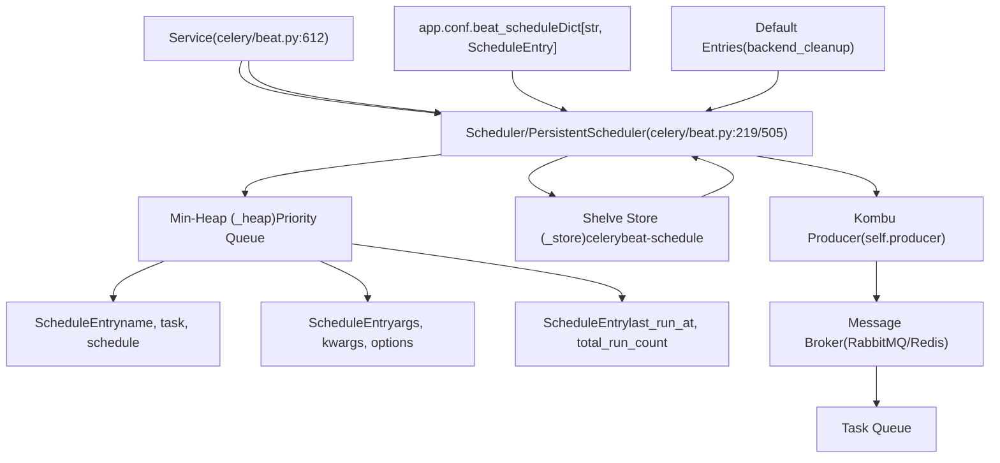
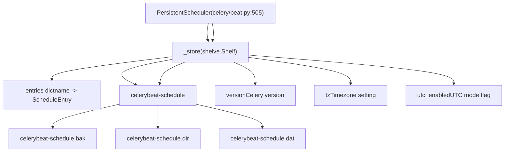
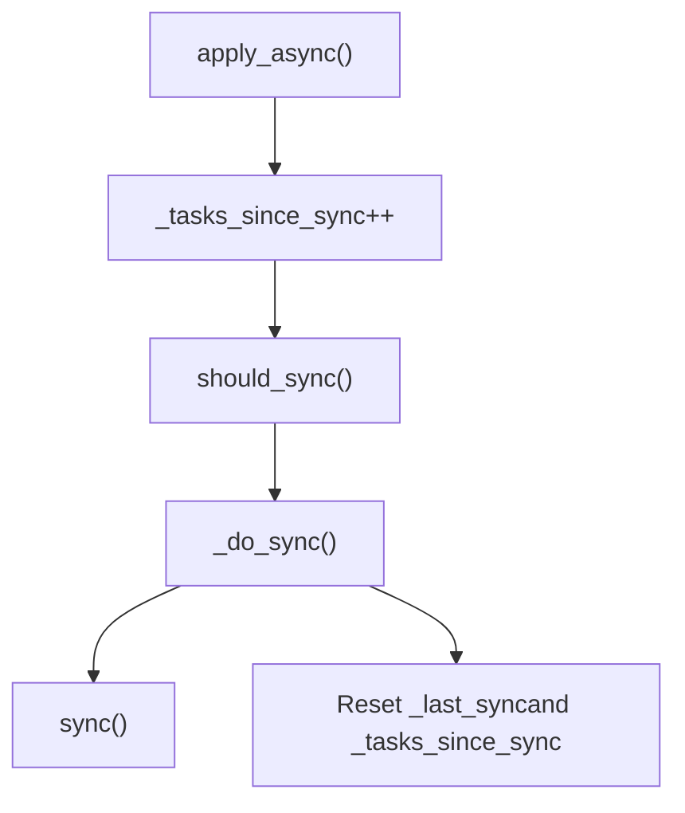
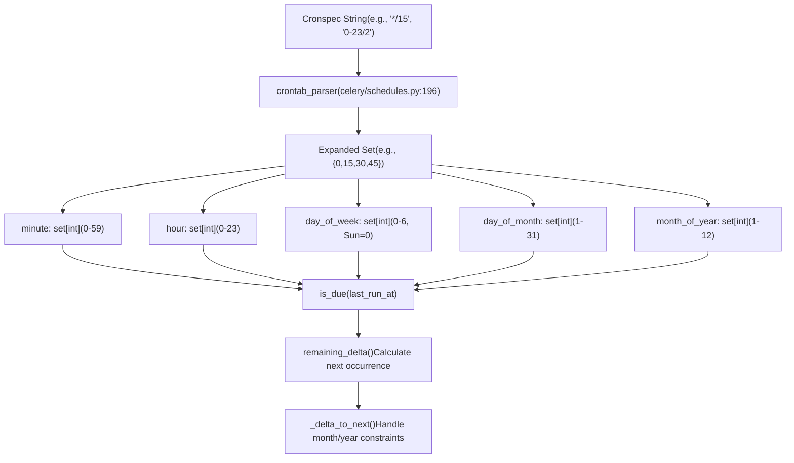
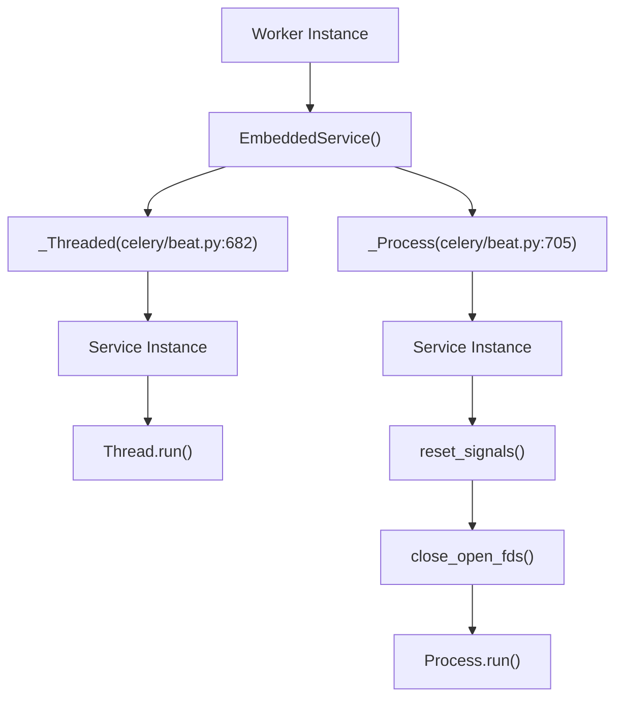
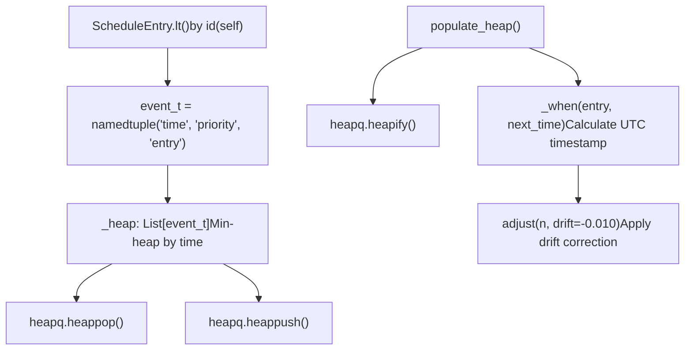
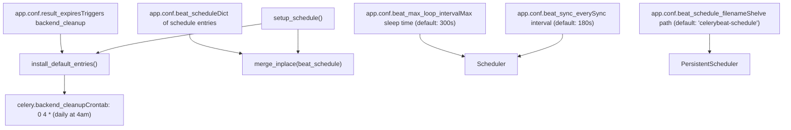
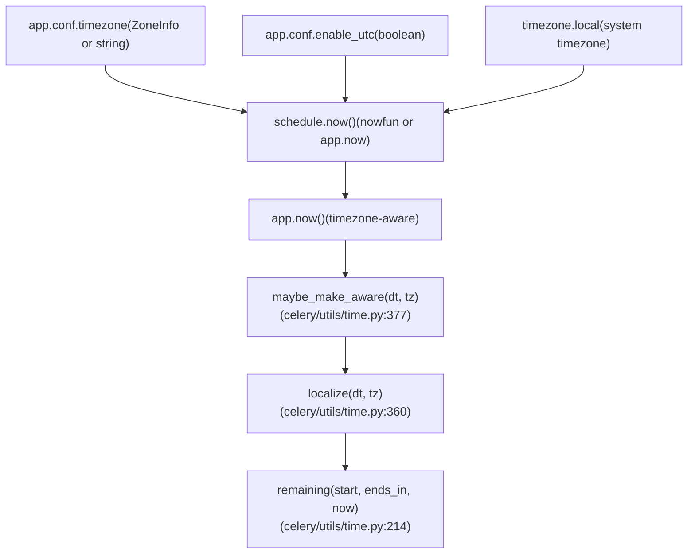

# 周期性任务 (Beat)

相关源文件

-   [CONTRIBUTORS.txt](https://github.com/celery/celery/blob/4d068b56/CONTRIBUTORS.txt)
-   [celery/beat.py](https://github.com/celery/celery/blob/4d068b56/celery/beat.py)
-   [celery/schedules.py](https://github.com/celery/celery/blob/4d068b56/celery/schedules.py)
-   [celery/utils/iso8601.py](https://github.com/celery/celery/blob/4d068b56/celery/utils/iso8601.py)
-   [celery/utils/time.py](https://github.com/celery/celery/blob/4d068b56/celery/utils/time.py)
-   [docs/AUTHORS.txt](https://github.com/celery/celery/blob/4d068b56/docs/AUTHORS.txt)
-   [t/unit/app/test\_beat.py](https://github.com/celery/celery/blob/4d068b56/t/unit/app/test_beat.py)
-   [t/unit/app/test\_schedules.py](https://github.com/celery/celery/blob/4d068b56/t/unit/app/test_schedules.py)
-   [t/unit/backends/test\_cache.py](https://github.com/celery/celery/blob/4d068b56/t/unit/backends/test_cache.py)
-   [t/unit/utils/test\_serialization.py](https://github.com/celery/celery/blob/4d068b56/t/unit/utils/test_serialization.py)
-   [t/unit/utils/test\_time.py](https://github.com/celery/celery/blob/4d068b56/t/unit/utils/test_time.py)

本文档描述了 Beat 调度器系统，该系统实现了 Celery 中的周期性任务执行。Beat 是一个独立的服务，它读取调度的任务定义，确定它们何时应该运行，并在适当的时间将任务消息发布到代理（broker）。

有关任务定义和执行的信息，请参阅[任务 (Tasks)](/celery/celery/3-tasks)。有关消费这些任务的工作者的信息，请参阅[工作者 (Workers)](/celery/celery/5-workers)。有关调度配置语法的信息，请参阅[调度类型](/celery/celery/7.2-schedule-types)。

---

## 概述

Beat 调度器作为一个独立的进程运行，维护着一个周期性任务的调度表。它使用一种基于滴答（tick）的架构，在每次迭代中检查到期的任务，将其发布到消息代理，并确定下一次唤醒的时间。该调度器支持多种调度类型（固定间隔、cron 表达式、太阳事件），并可以在重启后保持其状态。

**核心组件：**

-   **Service** ([celery/beat.py612-680](https://github.com/celery/celery/blob/4d068b56/celery/beat.py#L612-L680))：管理调度器的生命周期和滴答循环
-   **Scheduler** ([celery/beat.py219-503](https://github.com/celery/celery/blob/4d068b56/celery/beat.py#L219-L503))：维护调度条目并确定任务何时到期
-   **ScheduleEntry** ([celery/beat.py82-199](https://github.com/celery/celery/blob/4d068b56/celery/beat.py#L82-L199))：封装了带有调度和执行元数据的任务
-   **Schedule Types** ([celery/schedules.py](https://github.com/celery/celery/blob/4d068b56/celery/schedules.py))：定义任务何时应该运行（间隔、crontab、太阳事件）

---

## Beat 服务架构


**来源：** [celery/beat.py612-680](https://github.com/celery/celery/blob/4d068b56/celery/beat.py#L612-L680) [celery/beat.py219-503](https://github.com/celery/celery/blob/4d068b56/celery/beat.py#L219-L503) [celery/beat.py82-199](https://github.com/celery/celery/blob/4d068b56/celery/beat.py#L82-L199)

---

## 滴答循环机制 (Tick Loop Mechanism)

调度器的 `tick()` 方法是 Beat 系统的核心。它实现了一个非阻塞的事件循环，每次迭代处理一个到期的任务。

> **[Mermaid sequence]**
> *(图表结构无法解析)*

**关键方法：**

-   `Scheduler.tick()` ([celery/beat.py326-364](https://github.com/celery/celery/blob/4d068b56/celery/beat.py#L326-L364))：主迭代，检查并应用一个到期条目
-   `Scheduler.populate_heap()` ([celery/beat.py310-323](https://github.com/celery/celery/blob/4d068b56/celery/beat.py#L310-L323))：从调度条目构建最小堆（min-heap）
-   `Scheduler.apply_entry()` ([celery/beat.py279-290](https://github.com/celery/celery/blob/4d068b56/celery/beat.py#L279-L290))：将任务消息发布到代理
-   `Scheduler.reserve()` ([celery/beat.py389-391](https://github.com/celery/celery/blob/4d068b56/celery/beat.py#L389-L391))：使用新的 last\_run\_at 更新条目并递增计数器

**来源：** [celery/beat.py326-364](https://github.com/celery/celery/blob/4d068b56/celery/beat.py#L326-L364) [celery/beat.py310-323](https://github.com/celery/celery/blob/4d068b56/celery/beat.py#L310-L323) [celery/beat.py279-290](https://github.com/celery/celery/blob/4d068b56/celery/beat.py#L279-L290)

---

## ScheduleEntry 数据结构

`ScheduleEntry` 封装了执行周期性任务所需的所有信息。

| 字段 | 类型 | 描述 |
| --- | --- | --- |
| `name` | str | 调度条目的唯一标识符 |
| `task` | str | 任务名称（例如 `'myapp.tasks.cleanup'`） |
| `schedule` | BaseSchedule | 调度实例（schedule, crontab, solar） |
| `args` | tuple | 任务的位置参数 |
| `kwargs` | dict | 任务的关键字参数（支持 BeatLazyFunc） |
| `options` | dict | 任务执行选项（routing\_key, expires 等） |
| `last_run_at` | datetime | 上次执行的时间戳（时区感知） |
| `total_run_count` | int | 任务已执行的次数 |

**BeatLazyFunc 支持：**

参数可以封装在 `BeatLazyFunc` 中，以便在执行时进行延迟求值 ([celery/beat.py50-78](https://github.com/celery/celery/blob/4d068b56/celery/beat.py#L50-L78))：

```python
# 在应用任务时求值，而不是在加载调度时求值
beat_schedule = {
    'example': {
        'task': 'myapp.tasks.process',
        'schedule': 300,
        'kwargs': {
            'timestamp': BeatLazyFunc(datetime.now)
        }
    }
}
```
**来源：** [celery/beat.py82-199](https://github.com/celery/celery/blob/4d068b56/celery/beat.py#L82-L199) [celery/beat.py50-78](https://github.com/celery/celery/blob/4d068b56/celery/beat.py#L50-L78) [celery/beat.py201-216](https://github.com/celery/celery/blob/4d068b56/celery/beat.py#L201-L216)

---

## 持久化调度器 (Persistent Scheduler)

`PersistentScheduler` 扩展了基础 `Scheduler`，使用 Python 的 `shelve` 模块实现持久化。


**持久化操作：**

-   **setup\_schedule()** ([celery/beat.py531-567](https://github.com/celery/celery/blob/4d068b56/celery/beat.py#L531-L567))：打开 shelve，处理损坏，检查时区/UTC 更改
-   **sync()** ([celery/beat.py599-601](https://github.com/celery/celery/blob/4d068b56/celery/beat.py#L599-L601))：通过 `_store.sync()` 将更改刷新到磁盘
-   **\_create\_schedule()** ([celery/beat.py569-590](https://github.com/celery/celery/blob/4d068b56/celery/beat.py#L569-L590))：初始化空调度或从旧版本迁移
-   **\_destroy\_open\_corrupted\_schedule()** ([celery/beat.py525-529](https://github.com/celery/celery/blob/4d068b56/celery/beat.py#L525-L529))：移除损坏的数据库文件并重新创建

**时区/版本迁移：**

当事区或 UTC 设置更改时，PersistentScheduler 会清除调度以避免不正确的执行时间 ([celery/beat.py545-556](https://github.com/celery/celery/blob/4d068b56/celery/beat.py#L545-L556))：

```python
# 检测到时区更改
if stored_tz is not None and stored_tz != tz:
    warning('Reset: Timezone changed from %r to %r', stored_tz, tz)
    self._store.clear()  # 重置数据库

# 检测到 UTC 模式更改
if stored_utc is not None and stored_utc != utc:
    warning('Reset: UTC changed from %s to %s', choices[stored_utc], choices[utc])
    self._store.clear()
```
**来源：** [celery/beat.py505-610](https://github.com/celery/celery/blob/4d068b56/celery/beat.py#L505-L610) [celery/beat.py531-567](https://github.com/celery/celery/blob/4d068b56/celery/beat.py#L531-L567)

---

## 调度同步 (Schedule Synchronization)

调度器根据两个条件定期同步其状态：

1.  **基于时间**：经过 `beat_sync_every` 秒（默认：180 秒）
2.  **基于任务**：应用了 `beat_sync_every_tasks` 个任务后


**关键方法：**

-   `Scheduler.should_sync()` ([celery/beat.py381-387](https://github.com/celery/celery/blob/4d068b56/celery/beat.py#L381-L387))：检查是否需要同步
-   `Scheduler._do_sync()` ([celery/beat.py427-433](https://github.com/celery/celery/blob/4d068b56/celery/beat.py#L427-L433))：调用 `sync()` 并重置计数器
-   `PersistentScheduler.sync()` ([celery/beat.py599-601](https://github.com/celery/celery/blob/4d068b56/celery/beat.py#L599-L601))：将 shelve 写入磁盘

**配置：**

-   `beat_sync_every`：同步间隔秒数（默认：180）
-   `beat_sync_every_tasks`：每应用 N 个任务后同步（默认：None）

**来源：** [celery/beat.py381-387](https://github.com/celery/celery/blob/4d068b56/celery/beat.py#L381-L387) [celery/beat.py427-433](https://github.com/celery/celery/blob/4d068b56/celery/beat.py#L427-L433) [celery/beat.py393-418](https://github.com/celery/celery/blob/4d068b56/celery/beat.py#L393-L418)

---

## 调度类型与 is\_due 实现

每种调度类型都实现了 `is_due(last_run_at)`，它返回 `(is_due, next_time_to_check)`。

### 固定间隔 (schedule)

```python
# celery/schedules.py:111-194
class schedule(BaseSchedule):
    def __init__(self, run_every, relative=False):
        self.run_every = maybe_timedelta(run_every)  # 转换为 timedelta
        self.relative = relative  # 取整到间隔分辨率

    def is_due(self, last_run_at):
        rem_delta = self.remaining_estimate(last_run_at)
        remaining_s = max(rem_delta.total_seconds(), 0)
        if remaining_s == 0:
            return schedstate(is_due=True, next=self.seconds)
        return schedstate(is_due=False, next=remaining_s)
```
**示例：**

```python
# 每 30 秒运行一次
schedule(run_every=30.0)
# 每 5 分钟运行一次
schedule(run_every=timedelta(minutes=5))
```
**来源：** [celery/schedules.py111-194](https://github.com/celery/celery/blob/4d068b56/celery/schedules.py#L111-L194)

### Crontab (crontab)

`crontab` 类支持标准的 cron 语法，包含 minute, hour, day\_of\_week, day\_of\_month, 和 month\_of\_year 字段。


**Crontab 解析器：**

`crontab_parser` 类 ([celery/schedules.py196-321](https://github.com/celery/celery/blob/4d068b56/celery/schedules.py#L196-L321)) 使用正则表达式模式解析 cron 表达式：

| 模式 | 示例 | 结果 |
| --- | --- | --- |
| `*` | `*` | 所有值（对于分钟为 0-59） |
| 范围 (Range) | `10-15` | {10, 11, 12, 13, 14, 15} |
| 步长 (Steps) | `*/5` | {0, 5, 10, 15, ...} |
| 范围+步长 | `10-30/5` | {10, 15, 20, 25, 30} |
| 列表 | `1,5,10` | {1, 5, 10} |
| 星期名称 | `mon-fri` | {1, 2, 3, 4, 5} |
| 月份名称 | `jan,feb` | {1, 2} |

**Crontab 示例：**

```python
# 每 15 分钟
crontab(minute='*/15')

# 每天 00:00
crontab(minute=0, hour=0)

# 每周一 08:30
crontab(minute=30, hour=8, day_of_week='mon')

# 每个月的第一天午夜
crontab(minute=0, hour=0, day_of_month=1)

# 使用 from_string() 工厂方法
crontab.from_string('0 8 * * MON')  # 每周一 08:00
```
**Crontab 到期逻辑：**

`crontab.is_due()` 方法 ([celery/schedules.py641-688](https://github.com/celery/celery/blob/4d068b56/celery/schedules.py#L641-L688)) 确定任务是否应该运行：

1.  计算 `remaining_estimate()` - 距离下次执行的时间
2.  如果剩余时间为 0，则任务到期
3.  检查 `beat_cron_starting_deadline` 以防止延迟运行
4.  返回 `(is_due, seconds_until_next_check)`

**来源：** [celery/schedules.py323-701](https://github.com/celery/celery/blob/4d068b56/celery/schedules.py#L323-L701) [celery/schedules.py196-321](https://github.com/celery/celery/blob/4d068b56/celery/schedules.py#L196-L321)

### 太阳事件 (solar)

太阳事件调度使用 `ephem` 库根据天文事件触发任务。

**支持的事件：**

-   `dawn_astronomical`, `dawn_nautical`, `dawn_civil` (天文/航海/民用黎明)
-   `sunrise`, `solar_noon`, `sunset` (日出/正午/日落)
-   `dusk_civil`, `dusk_nautical`, `dusk_astronomical` (民用/航海/天文薄暮)

**示例：**

```python
# 纽约（纬度 40.7，经度 -74.0）日出时运行
solar('sunrise', lat=40.7, lon=-74.0)

# 日落时运行
solar('sunset', lat=40.7, lon=-74.0)
```
**实现：**

`solar` 类 ([celery/schedules.py717-857](https://github.com/celery/celery/blob/4d068b56/celery/schedules.py#L717-L857)) 使用 `ephem.Observer` 根据纬度、经度和每个事件特有的地平线角度计算事件时间。

**来源：** [celery/schedules.py717-857](https://github.com/celery/celery/blob/4d068b56/celery/schedules.py#L717-L857)

---

## 服务生命周期

`Service` 类管理调度器从初始化到关机的生命周期。

> **[Mermaid stateDiagram]**
> *(图表结构无法解析)*

**Service 方法：**

-   **`__init__(app, max_interval, schedule_filename, scheduler_cls)`** ([celery/beat.py617-625](https://github.com/celery/celery/blob/4d068b56/celery/beat.py#L617-L625))：使用配置初始化
-   **`start(embedded_process=False)`** ([celery/beat.py633-655](https://github.com/celery/celery/blob/4d068b56/celery/beat.py#L633-L655))：开始滴答循环，发送 `beat_init` 信号
-   **`stop(wait=False)`** ([celery/beat.py661-664](https://github.com/celery/celery/blob/4d068b56/celery/beat.py#L661-L664))：设置停止标志，可选等待完成
-   **`get_scheduler(lazy=False)`** ([celery/beat.py666-675](https://github.com/celery/celery/blob/4d068b56/celery/beat.py#L666-L675))：使用扩展命名空间创建调度器实例
-   **`sync()`** ([celery/beat.py657-659](https://github.com/celery/celery/blob/4d068b56/celery/beat.py#L657-L659))：关闭调度器（触发同步）并设置已停止标志

**信号：**

-   `signals.beat_init`：在 beat 启动时发送
-   `signals.beat_embedded_init`：在内嵌 beat 启动时发送

**来源：** [celery/beat.py612-680](https://github.com/celery/celery/blob/4d068b56/celery/beat.py#L612-L680)

---

## 内嵌 Beat (Embedded Beat)

Celery 支持使用线程或多进程在工作者进程内运行 Beat。


**工厂函数：**

`EmbeddedService(app, max_interval, thread=False)` ([celery/beat.py727-738](https://github.com/celery/celery/blob/4d068b56/celery/beat.py#L727-L738)) 返回以下之一：

-   `_Threaded`：在守护线程中运行 Beat（max\_interval 强制为 1 秒以便快速关机）
-   `_Process`：在单独的进程中运行 Beat（如果多进程可用）

**线程实现：**

```python
class _Threaded(Thread):
    def __init__(self, app, **kwargs):
        self.service = Service(app, **kwargs)
        self.daemon = True
        self.name = 'Beat'

    def run(self):
        self.app.set_current()
        self.service.start()
```
**进程实现：**

```python
class _Process(Process):
    def run(self):
        reset_signals(full=False)  # 重置信号处理程序
        platforms.close_open_fds([...])  # 关闭继承的文件描述符
        self.app.set_default()
        self.app.set_current()
        self.service.start(embedded_process=True)
```
**来源：** [celery/beat.py682-738](https://github.com/celery/celery/blob/4d068b56/celery/beat.py#L682-L738)

---

## 调度条目比较与堆管理

调度器使用最小堆来高效地跟踪下一个要执行的任务。堆条目是 `(time, priority, entry)` 的元组。


**关键实现细节：**

**`_when(entry, next_time_to_run)` ([celery/beat.py300-308](https://github.com/celery/celery/blob/4d068b56/celery/beat.py#L300-L308))**：

-   将条目的 `last_run_at` 转换为 UTC 时间戳
-   加上 `next_time_to_run`（以秒为单位）
-   应用微秒级精度
-   返回用于堆排序的 UTC 时间戳

**`adjust(n, drift=-0.010)` ([celery/beat.py292-295](https://github.com/celery/celery/blob/4d068b56/celery/beat.py#L292-L295))**：

-   应用 -10ms 的漂移以防止忙等待（busy-wait）
-   确保微小的延迟不会导致立即重新执行

**`ScheduleEntry.__lt__(other)` ([celery/beat.py175-184](https://github.com/celery/celery/blob/4d068b56/celery/beat.py#L175-L184))**：

-   按 `id(self)`（内存地址）比较条目
-   当时间相等时作为决胜项（tiebreaker）使用
-   防止比较实际条目的内容

**堆重建：**

当调度发生变化时重建堆 ([celery/beat.py338-341](https://github.com/celery/celery/blob/4d068b56/celery/beat.py#L338-L341))：

```python
if (self._heap is None or
    not self.schedules_equal(self.old_schedulers, self.schedule)):
    self.old_schedulers = copy.copy(self.schedule)
    self.populate_heap()
```
**来源：** [celery/beat.py300-308](https://github.com/celery/celery/blob/4d068b56/celery/beat.py#L300-L308) [celery/beat.py292-295](https://github.com/celery/celery/blob/4d068b56/celery/beat.py#L292-L295) [celery/beat.py310-323](https://github.com/celery/celery/blob/4d068b56/celery/beat.py#L310-L323) [celery/beat.py175-184](https://github.com/celery/celery/blob/4d068b56/celery/beat.py#L175-L184)

---

## 配置集成

Beat 从 Celery 应用程序的配置中读取调度配置。


**调度条目格式：**

```python
app.conf.beat_schedule = {
    'task-name': {
        'task': 'myapp.tasks.add',           # 必填
        'schedule': 30.0,                     # 必填：秒数、timedelta 或调度对象
        'args': (16, 16),                     # 可选：位置参数
        'kwargs': {'callback': 'process'},    # 可选：关键字参数
        'options': {                          # 可选：apply_async 选项
            'queue': 'priority',
            'routing_key': 'high',
            'expires': 60,
        },
    },
}
```
**内置任务：**

如果满足以下条件，调度器会自动添加 `celery.backend_cleanup`：

-   设置了 `result_expires`（结果具有过期时间）
-   后端不支持自动过期 (`supports_autoexpire=False`)

**调度更新：**

当 `beat_schedule` 在运行时发生变化时：

1.  `merge_inplace()` 比较旧调度和新调度 ([celery/beat.py458-472](https://github.com/celery/celery/blob/4d068b56/celery/beat.py#L458-L472))
2.  移除不在新调度中的条目
3.  使用新值更新现有条目
4.  添加新条目
5.  如果检测到变化，在下一次 `tick()` 时重建堆

**来源：** [celery/beat.py268-277](https://github.com/celery/celery/blob/4d068b56/celery/beat.py#L268-L277) [celery/beat.py423-425](https://github.com/celery/celery/blob/4d068b56/celery/beat.py#L423-L425) [celery/beat.py458-472](https://github.com/celery/celery/blob/4d068b56/celery/beat.py#L458-L472)

---

## 时间与时区处理

Beat 贯穿始终使用时区感知的 datetime，以确保在夏令时 (DST) 转换和时区更改期间调度正确。


**关键时区函数：**

**`maybe_make_aware(dt, tz, naive_as_utc=True)` ([celery/utils/time.py377-386](https://github.com/celery/celery/blob/4d068b56/celery/utils/time.py#L377-L386))**：

-   将无时区 (naive) 的 datetime 转换为时区感知的
-   如果已经是感知的，则原样返回
-   默认假设无时区的 datetime 为 UTC

**`remaining(start, ends_in, now, relative=False)` ([celery/utils/time.py214-250](https://github.com/celery/celery/blob/4d068b56/celery/utils/time.py#L214-L250))**：

-   计算距离 `start + ends_in` 的剩余时间
-   使用 UTC 进行计算以正确处理 DST
-   如果 `relative=True`，则按调度分辨率取整

**`ffwd` 类 ([celery/utils/time.py389-431](https://github.com/celery/celery/blob/4d068b56/celery/utils/time.py#L389-L431))**：

-   类似于 `dateutil.relativedelta` 的日期算术类
-   被 crontab 用于计算下次执行时间
-   处理月份边界和星期位置

**时区持久化：**

PersistentScheduler 存储时区信息 ([celery/beat.py545-556](https://github.com/celery/celery/blob/4d068b56/celery/beat.py#L545-L556))：

-   `_store['tz']`：当前时区字符串
-   `_store['utc_enabled']`：当前 UTC 模式
-   如果其中任何一项发生变化，则清除调度以防止调度错误

**来源：** [celery/utils/time.py377-386](https://github.com/celery/celery/blob/4d068b56/celery/utils/time.py#L377-L386) [celery/utils/time.py214-250](https://github.com/celery/celery/blob/4d068b56/celery/utils/time.py#L214-L250) [celery/utils/time.py389-431](https://github.com/celery/celery/blob/4d068b56/celery/utils/time.py#L389-L431) [celery/beat.py545-556](https://github.com/celery/celery/blob/4d068b56/celery/beat.py#L545-L556)

---

## CLI 集成

Beat 可以使用 `celery beat` 命令启动，该命令在 CLI 系统中实现。

**命令结构：**

```bash
celery -A myapp beat [OPTIONS]

选项：
  --detach              作为守护进程运行
  -s, --schedule FILE   调度数据库的路径
  -S, --scheduler CLS   调度器类
  --max-interval SEC    检查之间的最大休眠时间
  -l, --loglevel LEVEL  日志级别
```
**调度器类解析：**

`Service.get_scheduler()` 方法 ([celery/beat.py666-675](https://github.com/celery/celery/blob/4d068b56/celery/beat.py#L666-L675)) 解析调度器类：

1.  从 `celery.beat_schedulers` 入口点加载扩展类
2.  使用 `symbol_by_name()` 从字符串解析类
3.  支持内置别名（例如 `'default'` → `PersistentScheduler`）

**自定义调度器示例：**

```python
# 定义自定义调度器
class MyScheduler(PersistentScheduler):
    def setup_schedule(self):
        # 自定义初始化
        super().setup_schedule()

# 通过 CLI 使用
celery -A myapp beat -S myapp.schedulers:MyScheduler
```
**来源：** [celery/beat.py666-675](https://github.com/celery/celery/blob/4d068b56/celery/beat.py#L666-L675)

---

## 测试与 Mocking

测试套件提供了为测试周期性任务而 mocking 调度器的示例。

**Mock 调度器模式：**

```python
# t/unit/app/test_beat.py:133-145
class mScheduler(beat.Scheduler):
    def __init__(self, *args, **kwargs):
        self.sent = []  # 跟踪发送的任务
        super().__init__(*args, **kwargs)

    def send_task(self, name=None, args=None, kwargs=None, **options):
        self.sent.append({'name': name, 'args': args,
                         'kwargs': kwargs, 'options': options})
        return self.app.AsyncResult(uuid())
```
**Mock 调度模式：**

```python
# t/unit/app/test_beat.py:159-177
class mocked_schedule(schedule):
    def __init__(self, is_due, next_run_at):
        self._is_due = is_due
        self._next_run_at = next_run_at
        self.run_every = timedelta(seconds=1)

    def is_due(self, last_run_at):
        return self._is_due, self._next_run_at

# 创建测试调度
always_due = mocked_schedule(True, 1)
always_pending = mocked_schedule(False, 60)
```
**测试滴答行为：**

```python
# 向调度器添加条目
scheduler.add(
    name='test_task',
    schedule=always_due,
    args=(1, 2),
    kwargs={'foo': 'bar'}
)

# 执行滴答
interval = scheduler.tick()

# 验证任务已发送
assert len(scheduler.sent) == 1
assert scheduler.sent[0]['name'] == 'test_task'
assert interval == 0  # 到期的任务返回 0
```
**来源：** [t/unit/app/test\_beat.py133-145](https://github.com/celery/celery/blob/4d068b56/t/unit/app/test_beat.py#L133-L145) [t/unit/app/test\_beat.py159-177](https://github.com/celery/celery/blob/4d068b56/t/unit/app/test_beat.py#L159-L177) [t/unit/app/test\_beat.py371-377](https://github.com/celery/celery/blob/4d068b56/t/unit/app/test_beat.py#L371-L377)
