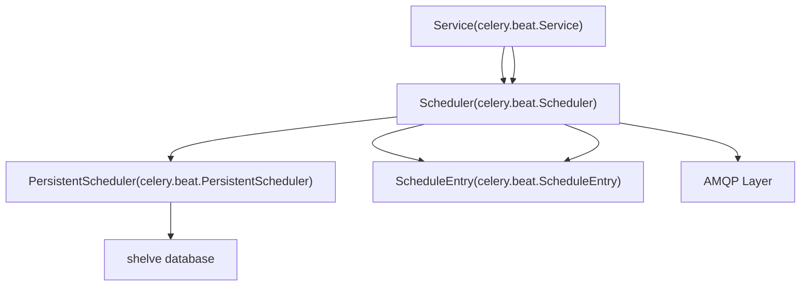
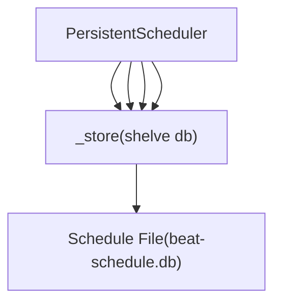
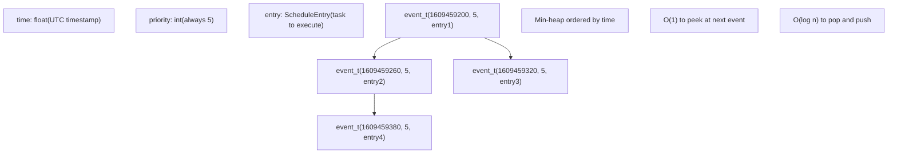
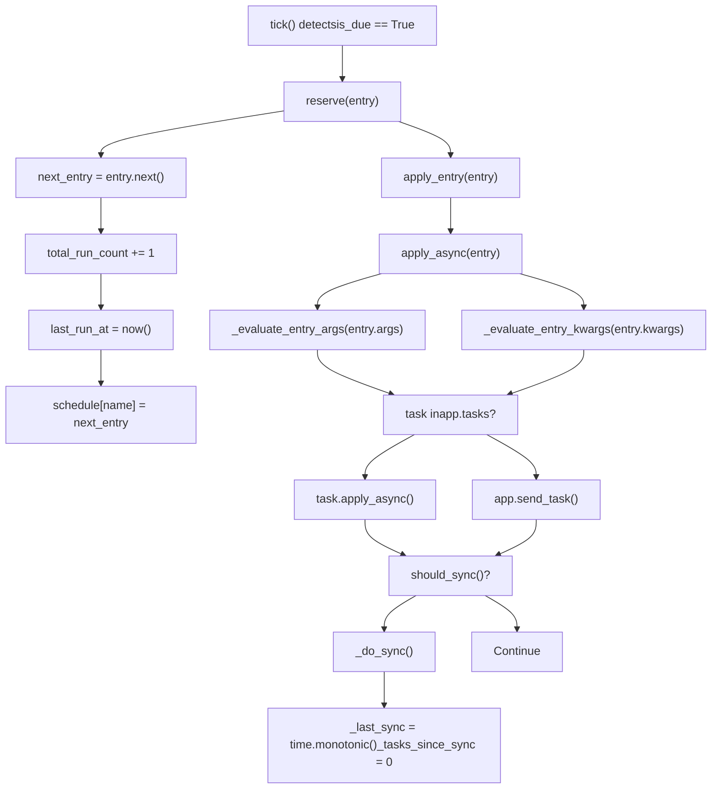
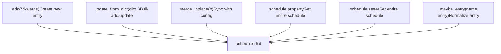
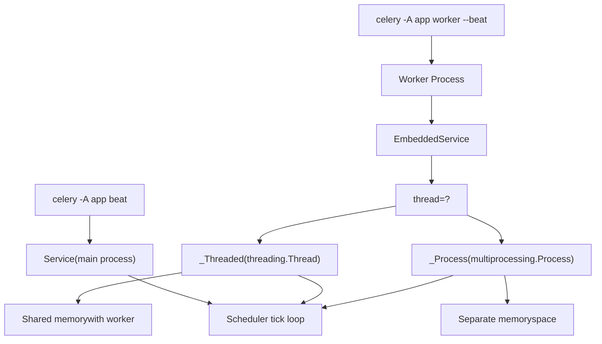
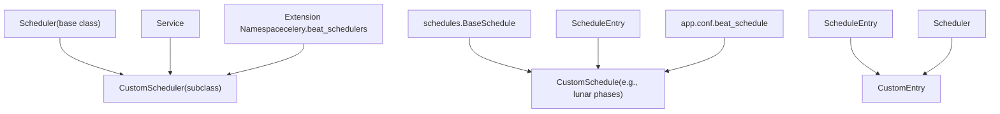
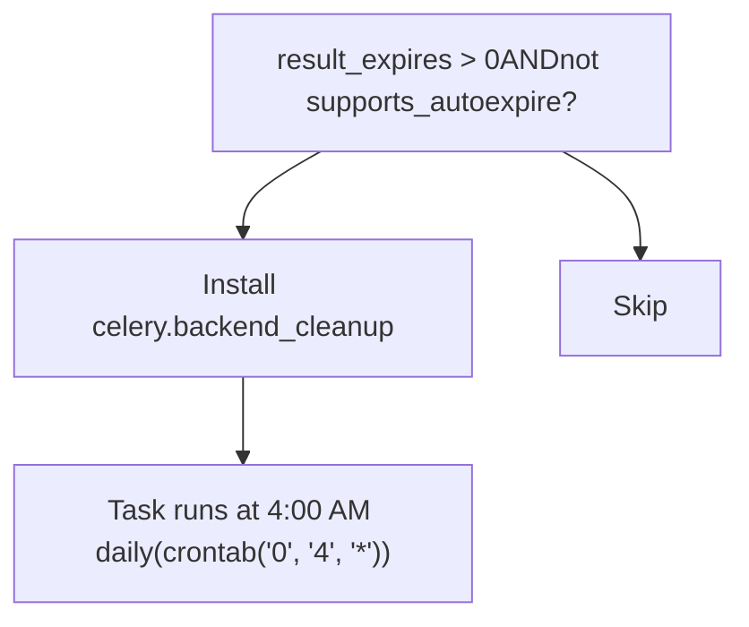

# Beat 调度器架构

相关源文件

-   [CONTRIBUTORS.txt](https://github.com/celery/celery/blob/4d068b56/CONTRIBUTORS.txt)
-   [celery/beat.py](https://github.com/celery/celery/blob/4d068b56/celery/beat.py)
-   [celery/schedules.py](https://github.com/celery/celery/blob/4d068b56/celery/schedules.py)
-   [celery/utils/iso8601.py](https://github.com/celery/celery/blob/4d068b56/celery/utils/iso8601.py)
-   [celery/utils/time.py](https://github.com/celery/celery/blob/4d068b56/celery/utils/time.py)
-   [docs/AUTHORS.txt](https://github.com/celery/celery/blob/4d068b56/docs/AUTHORS.txt)
-   [t/unit/app/test_beat.py](https://github.com/celery/celery/blob/4d068b56/t/unit/app/test_beat.py)
-   [t/unit/app/test_schedules.py](https://github.com/celery/celery/blob/4d068b56/t/unit/app/test_schedules.py)
-   [t/unit/backends/test_cache.py](https://github.com/celery/celery/blob/4d068b56/t/unit/backends/test_cache.py)
-   [t/unit/utils/test_serialization.py](https://github.com/celery/celery/blob/4d068b56/t/unit/utils/test_serialization.py)
-   [t/unit/utils/test_time.py](https://github.com/celery/celery/blob/4d068b56/t/unit/utils/test_time.py)

## 目的与范围

本文档解释了 Celery 的 Beat 调度器系统的架构，该系统处理周期性任务的执行。它涵盖了主要组件（`Service`、`Scheduler`、`PersistentScheduler`、`ScheduleEntry`）、基于滴答（tick）的调度循环、堆（heap）管理以及任务分发机制。

有关特定调度类型（固定间隔、crontab、太阳事件）的信息，请参阅[调度类型](/celery/celery/7.2-schedule-types)。有关时区处理和时间计算的详细信息，请参阅[时间与时区处理](/celery/celery/7.3-time-and-timezone-handling)。有关持久化机制和存储详情，请参阅[持久化存储](/celery/celery/7.4-persistent-storage)。

---

## 核心组件架构

Beat 调度器由四个主要组件组成，它们协同工作以管理周期性任务的执行：


**来源：** [celery/beat.py612-680](https://github.com/celery/celery/blob/4d068b56/celery/beat.py#L612-L680) [celery/beat.py219-503](https://github.com/celery/celery/blob/4d068b56/celery/beat.py#L219-L503) [celery/beat.py505-610](https://github.com/celery/celery/blob/4d068b56/celery/beat.py#L505-L610) [celery/beat.py82-199](https://github.com/celery/celery/blob/4d068b56/celery/beat.py#L82-L199)

### Service 类

`Service` 类 ([celery/beat.py612-680](https://github.com/celery/celery/blob/4d068b56/celery/beat.py#L612-L680)) 是 Beat 调度器的主要入口点。它编排调度循环并管理调度器的生命周期：

| 组件 | 类型 | 目的 |
| --- | --- | --- |
| `scheduler_cls` | 类属性 | 要实例化的调度器类（默认：`PersistentScheduler`） |
| `max_interval` | 实例属性 | 滴答之间的最大休眠时间 |
| `schedule_filename` | 实例属性 | 持久化调度存储的路径 |
| `_is_shutdown` | 事件 (Event) | 发出停机请求信号 |
| `_is_stopped` | 事件 (Event) | 发出停机完成信号 |

`start()` 方法 ([celery/beat.py633-655](https://github.com/celery/celery/blob/4d068b56/celery/beat.py#L633-L655)) 运行主循环：

```python
while not self._is_shutdown.is_set():
    interval = self.scheduler.tick()
    if interval and interval > 0.0:
        time.sleep(interval)
```
**来源：** [celery/beat.py612-680](https://github.com/celery/celery/blob/4d068b56/celery/beat.py#L612-L680)

### Scheduler 类

`Scheduler` 类 ([celery/beat.py219-503](https://github.com/celery/celery/blob/4d068b56/celery/beat.py#L219-L503)) 管理调度并确定任务何时应该执行：

| 属性 | 类型 | 默认值 | 目的 |
| --- | --- | --- | --- |
| `schedule` | dict/shelve | `{}` | 将条目名称映射到 `ScheduleEntry` 对象 |
| `max_interval` | int | 300 | 检查之间的最大休眠秒数 |
| `sync_every` | int | 180 | 调度同步之间的秒数 |
| `sync_every_tasks` | int | `None` | 强制同步前的任务数量 |
| `_heap` | list | `None` | `event_t` 元组的最小堆（min-heap） |
| `_last_sync` | float | `None` | 上次同步的时间戳 |
| `_tasks_since_sync` | int | 0 | 自同步以来的任务计数器 |

**来源：** [celery/beat.py219-503](https://github.com/celery/celery/blob/4d068b56/celery/beat.py#L219-L503)

### PersistentScheduler 类

`PersistentScheduler` ([celery/beat.py505-610](https://github.com/celery/celery/blob/4d068b56/celery/beat.py#L505-L610)) 扩展了 `Scheduler`，使用 Python 的 `shelve` 模块在重启后持久化调度状态：


存储架构：

-   `entries`：以名称为键的 `ScheduleEntry` 对象字典
-   `__version__`：创建调度的 Celery 版本
-   `tz`：时区设置
-   `utc_enabled`：UTC 启用标志

迁移逻辑 ([celery/beat.py545-589](https://github.com/celery/celery/blob/4d068b56/celery/beat.py#L545-L589)) 会检测时区或 UTC 设置的变化，并重置调度以避免时间计算错误。

**来源：** [celery/beat.py505-610](https://github.com/celery/celery/blob/4d068b56/celery/beat.py#L505-L610)

### ScheduleEntry 类

`ScheduleEntry` ([celery/beat.py82-199](https://github.com/celery/celery/blob/4d068b56/celery/beat.py#L82-L199)) 代表单个周期性任务及其调度信息：

| 属性 | 类型 | 目的 |
| --- | --- | --- |
| `name` | str | 条目的唯一标识符 |
| `task` | str | 要执行的任务名称 |
| `schedule` | 调度对象 | 确定任务何时运行（间隔、crontab、太阳事件） |
| `args` | tuple | 任务的位置参数 |
| `kwargs` | dict | 任务的关键字参数 |
| `options` | dict | 任务执行选项（routing_key 等） |
| `last_run_at` | datetime | 任务上次执行的时间 |
| `total_run_count` | int | 任务已被调度的次数 |

`is_due()` 方法 ([celery/beat.py161-163](https://github.com/celery/celery/blob/4d068b56/celery/beat.py#L161-L163)) 委托给调度对象：

```python
def is_due(self):
    return self.schedule.is_due(self.last_run_at)
```
**来源：** [celery/beat.py82-199](https://github.com/celery/celery/blob/4d068b56/celery/beat.py#L82-L199)

---

## 基于滴答的调度循环

Beat 调度器在基于滴答的模型上运行，每个滴答处理一个到期的任务：

> **[Mermaid sequence]**
> *(图表结构无法解析)*

**来源：** [celery/beat.py326-364](https://github.com/celery/celery/blob/4d068b56/celery/beat.py#L326-L364) [celery/beat.py633-655](https://github.com/celery/celery/blob/4d068b56/celery/beat.py#L633-L655)

### Tick 方法实现

`tick()` 方法 ([celery/beat.py326-364](https://github.com/celery/celery/blob/4d068b56/celery/beat.py#L326-L364)) 是调度逻辑的核心：

**第 1 步：堆填充 (Heap Population)**

```python
if (self._heap is None or
    not self.schedules_equal(self.old_schedulers, self.schedule)):
    self.old_schedulers = copy.copy(self.schedule)
    self.populate_heap()
```
调度器通过将当前调度字典与缓存副本进行比较来检测调度更改。如果检测到更改，它将重建堆。

**第 2 步：检查下一个条目**

```python
event = H[0]  # 查看最早的事件
entry = event[2]
is_due, next_time_to_run = self.is_due(entry)
```
**第 3 步：如果到期则执行**

```python
if is_due:
    verify = heappop(H)
    if verify is event:  # 再次确认仍是同一个事件
        next_entry = self.reserve(entry)
        self.apply_entry(entry, producer=self.producer)
        heappush(H, event_t(self._when(next_entry, next_time_to_run),
                           event[1], next_entry))
        return 0  # 立即再次检查
```
**第 4 步：休眠计算**

```python
adjusted_next_time = adjust(next_time_to_run)
return min(adjusted_next_time, max_interval)
```
**来源：** [celery/beat.py326-364](https://github.com/celery/celery/blob/4d068b56/celery/beat.py#L326-L364)

---

## 基于堆的优先级队列

调度器使用最小堆来高效地查找下一个要执行的任务：


`event_t` 具名元组 ([celery/beat.py37](https://github.com/celery/celery/blob/4d068b56/celery/beat.py#L37-L37)) 有三个字段：

-   `time`：任务下次应该运行的 UTC 时间戳
-   `priority`：固定为 5（历史遗留，不用于排序）
-   `entry`：`ScheduleEntry` 对象

### 堆填充

`populate_heap()` 方法 ([celery/beat.py310-323](https://github.com/celery/celery/blob/4d068b56/celery/beat.py#L310-L323)) 将调度字典转换为堆：

```python
self._heap = []
for entry in self.schedule.values():
    is_due, next_call_delay = entry.is_due()
    self._heap.append(event_t(
        self._when(entry, 0 if is_due else next_call_delay) or 0,
        priority, entry
    ))
heapify(self._heap)
```
`_when()` 方法 ([celery/beat.py300-308](https://github.com/celery/celery/blob/4d068b56/celery/beat.py#L300-L308)) 将下次运行延迟转换为绝对 UTC 时间戳，用于堆排序：

```python
def _when(self, entry, next_time_to_run, mktime=timegm):
    adjust = self.adjust
    as_now = maybe_make_aware(entry.default_now())
    return (mktime(as_now.utctimetuple()) +
            as_now.microsecond / 1e6 +
            (adjust(next_time_to_run) or 0))
```
**来源：** [celery/beat.py310-323](https://github.com/celery/celery/blob/4d068b56/celery/beat.py#L310-L323) [celery/beat.py300-308](https://github.com/celery/celery/blob/4d068b56/celery/beat.py#L300-L308) [celery/beat.py37](https://github.com/celery/celery/blob/4d068b56/celery/beat.py#L37-L37)

---

## 任务分发流程

当任务到期时，调度器会经过一个分发流程将其发送到消息代理：


**来源：** [celery/beat.py279-290](https://github.com/celery/celery/blob/4d068b56/celery/beat.py#L279-L290) [celery/beat.py389-418](https://github.com/celery/celery/blob/4d068b56/celery/beat.py#L389-L418) [celery/beat.py393-418](https://github.com/celery/celery/blob/4d068b56/celery/beat.py#L393-L418)

### 条目预留 (Entry Reservation)

`reserve()` 方法 ([celery/beat.py389-391](https://github.com/celery/celery/blob/4d068b56/celery/beat.py#L389-L391)) 创建下一个条目实例：

```python
def reserve(self, entry):
    new_entry = self.schedule[entry.name] = next(entry)
    return new_entry
```
`_next_instance()` 方法 ([celery/beat.py134-140](https://github.com/celery/celery/blob/4d068b56/celery/beat.py#L134-L140)) 创建一个带有更新时间戳的新 `ScheduleEntry`：

```python
def _next_instance(self, last_run_at=None):
    return self.__class__(**dict(
        self,
        last_run_at=last_run_at or self.default_now(),
        total_run_count=self.total_run_count + 1,
    ))
```
### 任务应用

`apply_async()` 方法 ([celery/beat.py393-418](https://github.com/celery/celery/blob/4d068b56/celery/beat.py#L393-L418)) 处理带有延迟参数求值的任务分发：

```python
entry_args = _evaluate_entry_args(entry.args)
entry_kwargs = _evaluate_entry_kwargs(entry.kwargs)

if task:
    return task.apply_async(entry_args, entry_kwargs,
                           producer=producer,
                           **entry.options)
else:
    return self.send_task(entry.task, entry_args, entry_kwargs,
                         producer=producer,
                         **entry.options)
```
`_evaluate_entry_args()` 和 `_evaluate_entry_kwargs()` 函数 ([celery/beat.py201-216](https://github.com/celery/celery/blob/4d068b56/celery/beat.py#L201-L216)) 支持 `BeatLazyFunc` 以实现动态参数生成：

```python
def _evaluate_entry_kwargs(entry_kwargs):
    if not entry_kwargs:
        return {}
    return {
        k: v() if isinstance(v, BeatLazyFunc) else v
        for k, v in entry_kwargs.items()
    }
```
**来源：** [celery/beat.py389-418](https://github.com/celery/celery/blob/4d068b56/celery/beat.py#L389-L418) [celery/beat.py134-140](https://github.com/celery/celery/blob/4d068b56/celery/beat.py#L134-L140) [celery/beat.py201-216](https://github.com/celery/celery/blob/4d068b56/celery/beat.py#L201-L216)

### 同步

在分发任务后，调度器会检查是否需要同步 ([celery/beat.py381-418](https://github.com/celery/celery/blob/4d068b56/celery/beat.py#L381-L418))：

```python
self._tasks_since_sync += 1
if self.should_sync():
    self._do_sync()
```
在以下情况下发生同步：

-   已经过 `sync_every` 秒（默认：180 秒）
-   已经分发了 `sync_every_tasks` 个任务（通过 `beat_sync_every` 配置）

`_do_sync()` 方法 ([celery/beat.py427-433](https://github.com/celery/celery/blob/4d068b56/celery/beat.py#L427-L433)) 调用 `sync()` 并重置计数器：

```python
def _do_sync(self):
    try:
        debug('beat: Synchronizing schedule...')
        self.sync()
    finally:
        self._last_sync = time.monotonic()
        self._tasks_since_sync = 0
```
对于 `PersistentScheduler`，`sync()` 写入 shelve 数据库 ([celery/beat.py599-601](https://github.com/celery/celery/blob/4d068b56/celery/beat.py#L599-L601))：

```python
def sync(self):
    if self._store is not None:
        self._store.sync()
```
**来源：** [celery/beat.py381-418](https://github.com/celery/celery/blob/4d068b56/celery/beat.py#L381-L418) [celery/beat.py427-433](https://github.com/celery/celery/blob/4d068b56/celery/beat.py#L427-L433) [celery/beat.py599-601](https://github.com/celery/celery/blob/4d068b56/celery/beat.py#L599-L601)

---

## 调度管理

调度器提供了动态管理调度的方法：


**来源：** [celery/beat.py441-490](https://github.com/celery/celery/blob/4d068b56/celery/beat.py#L441-L490)

### 添加条目

`add()` 方法 ([celery/beat.py441-444](https://github.com/celery/celery/blob/4d068b56/celery/beat.py#L441-L444)) 创建一个新的调度条目：

```python
def add(self, **kwargs):
    entry = self.Entry(app=self.app, **kwargs)
    self.schedule[entry.name] = entry
    return entry
```
### 合并调度

`merge_inplace()` 方法 ([celery/beat.py458-472](https://github.com/celery/celery/blob/4d068b56/celery/beat.py#L458-L472)) 将内存中的调度与配置同步：

```python
def merge_inplace(self, b):
    schedule = self.schedule
    A, B = set(schedule), set(b)

    # 移除不在新调度中的项
    for key in A ^ B:
        schedule.pop(key, None)

    # 更新并添加新项
    for key in B:
        entry = self.Entry(**dict(b[key], name=key, app=self.app))
        if schedule.get(key):
            schedule[key].update(entry)
        else:
            schedule[key] = entry
```
这在初始化期间用于将 `app.conf.beat_schedule` 与持久化调度合并。

**来源：** [celery/beat.py441-444](https://github.com/celery/celery/blob/4d068b56/celery/beat.py#L441-L444) [celery/beat.py458-472](https://github.com/celery/celery/blob/4d068b56/celery/beat.py#L458-L472)

---

## 内嵌 Beat 服务 (Embedded Beat Service)

Celery 支持将 Beat 调度器内嵌在工作者进程中运行，避免了需要一个单独的 Beat 进程：


**来源：** [celery/beat.py682-738](https://github.com/celery/celery/blob/4d068b56/celery/beat.py#L682-L738)

### EmbeddedService 工厂

`EmbeddedService()` 函数 ([celery/beat.py727-738](https://github.com/celery/celery/blob/4d068b56/celery/beat.py#L727-L738)) 返回基于线程或基于进程的实现：

```python
def EmbeddedService(app, max_interval=None, **kwargs):
    if kwargs.pop('thread', False) or _Process is None:
        return _Threaded(app, max_interval=1, **kwargs)
    return _Process(app, max_interval=max_interval, **kwargs)
```
注意：线程模式使用 `max_interval=1` 以便快速响应关机。

### 线程实现

`_Threaded` 类 ([celery/beat.py682-697](https://github.com/celery/celery/blob/4d068b56/celery/beat.py#L682-L697)) 在守护线程中运行 Beat：

```python
class _Threaded(Thread):
    def __init__(self, app, **kwargs):
        super().__init__()
        self.app = app
        self.service = Service(app, **kwargs)
        self.daemon = True
        self.name = 'Beat'

    def run(self):
        self.app.set_current()
        self.service.start()
```
### 进程实现

`_Process` 类 ([celery/beat.py705-724](https://github.com/celery/celery/blob/4d068b56/celery/beat.py#L705-L724)) 在单独的进程中运行 Beat，并带有适当的信号处理和文件描述符清理：

```python
class _Process(Process):
    def run(self):
        reset_signals(full=False)
        platforms.close_open_fds([
            sys.__stdin__, sys.__stdout__, sys.__stderr__,
        ] + list(iter_open_logger_fds()))
        self.app.set_default()
        self.app.set_current()
        self.service.start(embedded_process=True)
```
**来源：** [celery/beat.py682-738](https://github.com/celery/celery/blob/4d068b56/celery/beat.py#L682-L738)

---

## 扩展与自定义

调度器提供了多个用于自定义的扩展点：


**来源：** [celery/beat.py666-675](https://github.com/celery/celery/blob/4d068b56/celery/beat.py#L666-L675) [celery/beat.py233](https://github.com/celery/celery/blob/4d068b56/celery/beat.py#L233-L233)

### 自定义调度器示例

要使用自定义调度器，请在创建服务时指定它：

```python
class MyScheduler(PersistentScheduler):
    def tick(self):
        # 自定义滴答逻辑
        return super().tick()

service = Service(
    app=app,
    scheduler_cls='myproject.schedulers:MyScheduler'
)
```
调度器是使用扩展命名空间机制解析的 ([celery/beat.py666-675](https://github.com/celery/celery/blob/4d068b56/celery/beat.py#L666-L675))：

```python
def get_scheduler(self, lazy=False,
                  extension_namespace='celery.beat_schedulers'):
    filename = self.schedule_filename
    aliases = dict(load_extension_class_names(extension_namespace))
    return symbol_by_name(self.scheduler_cls, aliases=aliases)(
        app=self.app,
        schedule_filename=filename,
        max_interval=self.max_interval,
        lazy=lazy,
    )
```
### 自定义条目类

在您的调度器上覆盖 `Entry` 类属性：

```python
class MyScheduler(Scheduler):
    Entry = MyScheduleEntry
```
**来源：** [celery/beat.py233](https://github.com/celery/celery/blob/4d068b56/celery/beat.py#L233-L233) [celery/beat.py666-675](https://github.com/celery/celery/blob/4d068b56/celery/beat.py#L666-L675)

---

## 默认条目

调度器会自动安装默认的维护任务：


`install_default_entries()` 方法 ([celery/beat.py268-277](https://github.com/celery/celery/blob/4d068b56/celery/beat.py#L268-L277)) 添加了后端清理任务：

```python
def install_default_entries(self, data):
    entries = {}
    if self.app.conf.result_expires and \
            not self.app.backend.supports_autoexpire:
        if 'celery.backend_cleanup' not in data:
            entries['celery.backend_cleanup'] = {
                'task': 'celery.backend_cleanup',
                'schedule': crontab('0', '4', '*'),
                'options': {'expires': 12 * 3600}}
    self.update_from_dict(entries)
```
此任务会从那些不支持自动过期条目的后端（如数据库后端）中清理已过期的任务结果。

**来源：** [celery/beat.py268-277](https://github.com/celery/celery/blob/4d068b56/celery/beat.py#L268-L277)

---

## 总结

Beat 调度器架构由以下部分组成：

1.  **Service**：运行调度循环的主要入口点。
2.  **Scheduler**：确定任务何时执行的核心逻辑。
3.  **PersistentScheduler**：扩展了 Scheduler，提供基于 shelve 的持久化。
4.  **ScheduleEntry**：代表单个周期性任务。
5.  **基于堆的优先级队列**：高效跟踪下一个要执行的任务。
6.  **滴答（Tick）循环**：单次迭代处理一个到期的任务。
7.  **任务分发**：求值参数并发送到 AMQP。
8.  **同步**：定期持久化调度状态。
9.  **内嵌模式**：在工作者进程内运行 Beat（线程或多进程）。
10. **扩展点**：自定义调度器、条目和调度类型。

带有堆优先级队列的基于滴答的模型确保了即使有成千上万个周期性任务，也能实现高效的 O(log n) 调度。

