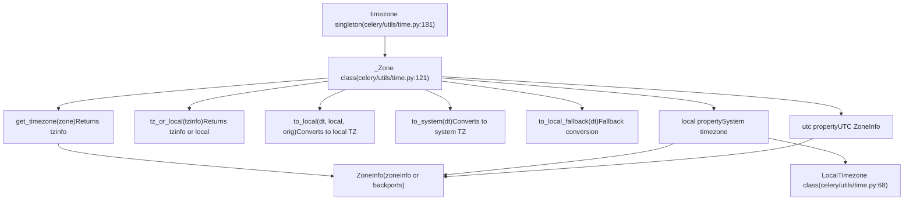
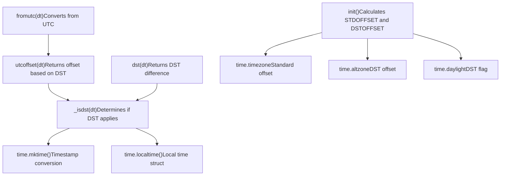
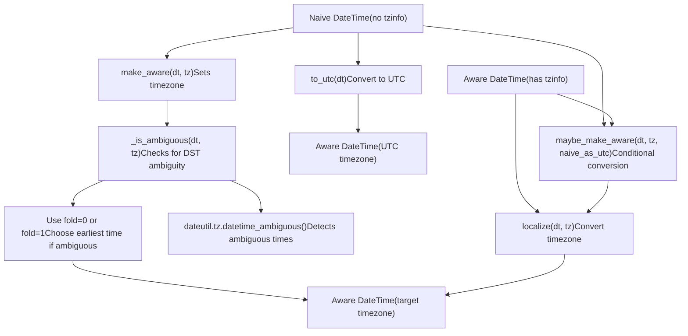
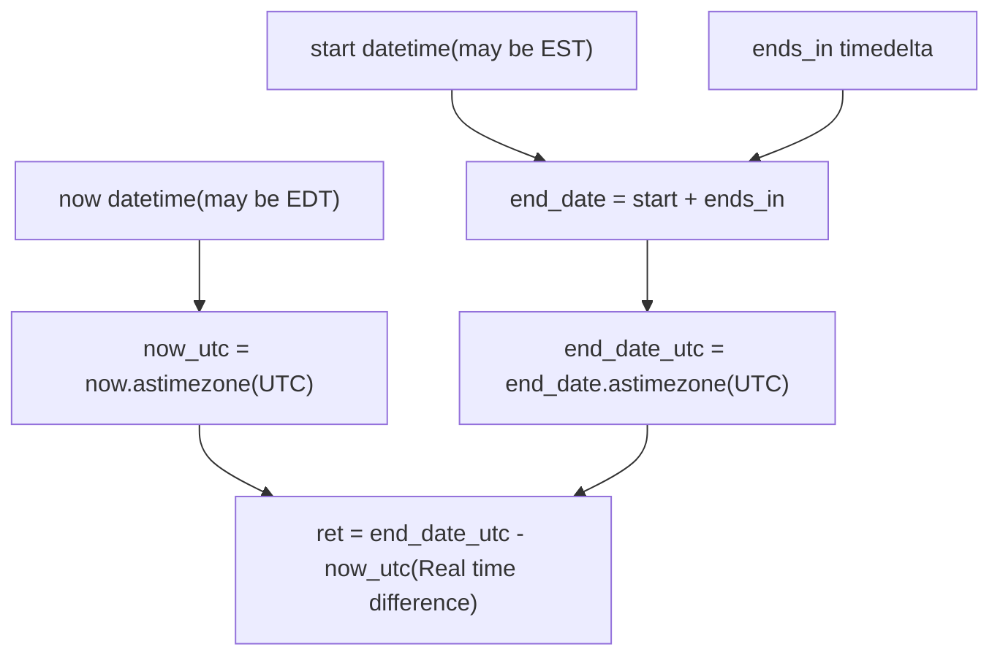
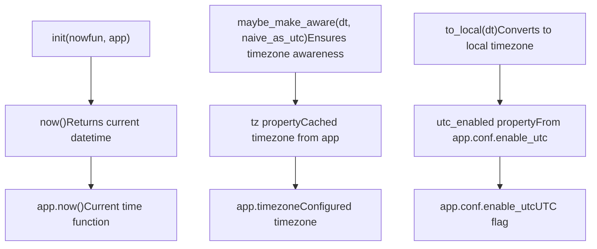

# 时间与时区处理

相关源文件

-   [CONTRIBUTORS.txt](https://github.com/celery/celery/blob/4d068b56/CONTRIBUTORS.txt)
-   [celery/beat.py](https://github.com/celery/celery/blob/4d068b56/celery/beat.py)
-   [celery/schedules.py](https://github.com/celery/celery/blob/4d068b56/celery/schedules.py)
-   [celery/utils/iso8601.py](https://github.com/celery/celery/blob/4d068b56/celery/utils/iso8601.py)
-   [celery/utils/time.py](https://github.com/celery/celery/blob/4d068b56/celery/utils/time.py)
-   [docs/AUTHORS.txt](https://github.com/celery/celery/blob/4d068b56/docs/AUTHORS.txt)
-   [t/unit/app/test\_beat.py](https://github.com/celery/celery/blob/4d068b56/t/unit/app/test_beat.py)
-   [t/unit/app/test\_schedules.py](https://github.com/celery/celery/blob/4d068b56/t/unit/app/test_schedules.py)
-   [t/unit/backends/test\_cache.py](https://github.com/celery/celery/blob/4d068b56/t/unit/backends/test_cache.py)
-   [t/unit/utils/test\_serialization.py](https://github.com/celery/celery/blob/4d068b56/t/unit/utils/test_serialization.py)
-   [t/unit/utils/test\_time.py](https://github.com/celery/celery/blob/4d068b56/t/unit/utils/test_time.py)

**目的**：本文档解释了 Celery 如何在周期性任务调度、任务执行计时以及结果过期中处理时间和时区。它涵盖了核心时区基础设施、datetime 转换操作、夏令时 (DST) 处理以及与 Beat 调度器的集成。

有关使用基于时间的调度来调度周期性任务的信息，请参阅[调度类型](/celery/celery/7.2-schedule-types)。有关 Beat 调度器架构的详细信息，请参阅[Beat 调度器架构](/celery/celery/7.1-beat-scheduler-architecture)。

## 时区配置

Celery 提供了两个配置设置，用于控制整个系统的时区行为：

| 设置 | 类型 | 默认值 | 描述 |
| --- | --- | --- | --- |
| `timezone` | str 或 tzinfo | `'UTC'` | 应用程序使用的时区 |
| `enable_utc` | bool | `True` | 是否在所有地方都使用 UTC 或使用本地时间 |

当 `enable_utc=True`（默认值）时，Celery 在内部将所有 datetime 存储为 UTC，并仅在需要时转换为配置的时区。当 `enable_utc=False` 时，Celery 通过 `LocalTimezone` 使用系统的本地时区。

`timezone` 设置可以指定为：

-   诸如 `'US/Eastern'` 或 `'Europe/London'` 之类的字符串（使用 ZoneInfo）
-   直接是一个 `tzinfo` 对象
-   特殊值 `'UTC'`

**来源**：[celery/utils/time.py121-181](https://github.com/celery/celery/blob/4d068b56/celery/utils/time.py#L121-L181) [celery/schedules.py84-103](https://github.com/celery/celery/blob/4d068b56/celery/schedules.py#L84-L103)

## 核心时区基础设施

### \_Zone 类和 timezone 单例

Celery 的时区处理集中在 [celery/utils/time.py121-179](https://github.com/celery/celery/blob/4d068b56/celery/utils/time.py#L121-L179) 的 `_Zone` 类中。一个名为 `timezone` 的单例实例在整个代码库中提供时区实用程序：


**来源**：[celery/utils/time.py121-181](https://github.com/celery/celery/blob/4d068b56/celery/utils/time.py#L121-L181)

### LocalTimezone 实现

当 `enable_utc=False` 时，Celery 使用 `LocalTimezone` 类来代表系统的本地时区。此实现使用 Python 的 `time` 模块处理夏令时 (DST) 转换：


`LocalTimezone` 类维护一个 `_offset_cache` 字典，以避免为相同的 UTC 偏移量重复创建时区对象。这种优化对于 `fromutc()` 转换尤为重要。

**来源**：[celery/utils/time.py68-119](https://github.com/celery/celery/blob/4d068b56/celery/utils/time.py#L68-L119)

## 时区感知的 DateTime 操作

### 使 DateTime 具备时区感知

Celery 提供了三个主要函数，用于向 datetime 对象添加时区信息：


关键函数位于 [celery/utils/time.py327-387](https://github.com/celery/celery/blob/4d068b56/celery/utils/time.py#L327-L387)：

-   **`is_naive(dt)`**：如果 datetime 没有时区信息或 `utcoffset` 为 `None`，则返回 `True`。
-   **`make_aware(dt, tz)`**：通过调用 `dt.replace(tzinfo=tz)` 添加时区信息并处理歧义时间。
-   **`maybe_make_aware(dt, tz, naive_as_utc=True)`**：仅在 datetime 是无时区（naive）时才进行转换。
-   **`localize(dt, tz)`**：使用 `astimezone()` 将具备时区感知的 datetime 转换为另一个时区。
-   **`to_utc(dt)`**：用于将无时区 datetime 转换为 UTC 的专门函数。

**来源**：[celery/utils/time.py327-387](https://github.com/celery/celery/blob/4d068b56/celery/utils/time.py#L327-L387)

### 时区转换流

`_Zone` 类提供了组合了底层操作的高级转换方法：

| 方法 | 目的 | 典型用例 |
| --- | --- | --- |
| `to_local(dt, local, orig)` | 转换为本地时区 | 向用户显示时间 |
| `to_system(dt)` | 转换为系统时区 | 日志记录、文件时间戳 |
| `to_local_fallback(dt)` | 回退本地转换 | 当 `enable_utc=False` 时 |
| `tz_or_local(tzinfo)` | 获取时区或默认值 | 规范化时区参数 |

**来源**：[celery/utils/time.py129-156](https://github.com/celery/celery/blob/4d068b56/celery/utils/time.py#L129-L156)

## DST (夏令时) 处理

Celery 仔细处理夏令时 (DST) 转换，以确保调度的任务在正确的时间运行。该实现使用 Python 的 `dateutil` 模块来检测歧义时间。

### 歧义时间检测 (Ambiguous Time Detection)

在夏令时转换期间将无时区 datetime 转换为感知时区的 datetime 时，可能会出现歧义。例如，当时钟在凌晨 2:00 “回退”到凌晨 1:00 时，凌晨 1:30 这个时间点会出现两次。Celery 通过选择较早的一次出现来解决此问题：

```python
def make_aware(dt: datetime, tz: tzinfo) -> datetime:
    dt = dt.replace(tzinfo=tz)
    if _is_ambiguous(dt, tz):
        dt = min(dt.replace(fold=0), dt.replace(fold=1))
    return dt
```
[celery/utils/time.py338-348](https://github.com/celery/celery/blob/4d068b56/celery/utils/time.py#L338-L348) 的 `_is_ambiguous()` 助手函数使用 `dateutil.tz.datetime_ambiguous()` 检查时区是否可以检测到歧义。这对于 `ZoneInfo` 和旧的 `pytz` 时区都有效。

**来源**：[celery/utils/time.py332-358](https://github.com/celery/celery/blob/4d068b56/celery/utils/time.py#L332-L358)

### 调度计算中的夏令时 (DST)

[celery/utils/time.py214-250](https://github.com/celery/celery/blob/4d068b56/celery/utils/time.py#L214-L250) 的 `remaining()` 函数通过在比较之前将所有 datetime 转换为 UTC 来计算真实的剩余时间：


这种方法避免了 Python 在具有相同的非 UTC 时区的 datetime 之间默认的挂钟时间（wall-time）算术，确保了跨夏令时转换的精确调度。

**来源**：[celery/utils/time.py214-250](https://github.com/celery/celery/blob/4d068b56/celery/utils/time.py#L214-L250) [t/unit/utils/test\_time.py125-214](https://github.com/celery/celery/blob/4d068b56/t/unit/utils/test_time.py#L125-L214)

## 调度集成

所有调度类型（`schedule`、`crontab`、`solar`）都继承自 [celery/schedules.py65-109](https://github.com/celery/celery/blob/4d068b56/celery/schedules.py#L65-L109) 的 `BaseSchedule`，它提供了时区集成：

### BaseSchedule 时区属性


**来源**：[celery/schedules.py65-109](https://github.com/celery/celery/blob/4d068b56/celery/schedules.py#L65-L109)

### Crontab 时区处理

`crontab` 调度类型在 [celery/schedules.py572-628](https://github.com/celery/celery/blob/4d068b56/celery/schedules.py#L572-L628) 的 `remaining_delta()` 中执行复杂的时区感知计算：

1.  **使所有 datetime 具备时区感知**：在 `last_run_at` 和 `now()` 上调用 `maybe_make_aware()`。
2.  **计算下次发生时间**：根据 minute、hour、day、month 限制确定下次调度的执行时间。
3.  **应用时区转换**：如果需要，使用 `to_local()` 将结果转换回本地时区。

该方法返回一个元组 `(last_run_at_local, delta, now_local)`，其中所有 datetime 都在适当的时区中。

**来源**：[celery/schedules.py572-628](https://github.com/celery/celery/blob/4d068b56/celery/schedules.py#L572-L628)

### 调度类型比较

| 调度类型 | 时区处理 | 夏令时 (DST) 行为 |
| --- | --- | --- |
| `schedule` | 使用带 UTC 转换的 `remaining()` | 正确处理夏令时转换 |
| `crontab` | 复杂的具备时区感知的 delta 计算 | 为夏令时进行调整，可能会跳过/重复时间 |
| `solar` | 使用具备时区感知 datetime 的 ephem 库 | 基于实际太阳位置 |

**来源**：[celery/schedules.py111-194](https://github.com/celery/celery/blob/4d068b56/celery/schedules.py#L111-L194) [celery/schedules.py323-700](https://github.com/celery/celery/blob/4d068b56/celery/schedules.py#L323-L700) [celery/schedules.py717-869](https://github.com/celery/celery/blob/4d068b56/celery/schedules.py#L717-L869)

## 持久化调度器时区跟踪

[celery/beat.py505-610](https://github.com/celery/celery/blob/4d068b56/celery/beat.py#L505-L610) 的 `PersistentScheduler` 在其 shelve 数据库中跟踪时区配置，以检测会导致存储的调度条目失效的变化。

### 时区变化检测

在 [celery/beat.py531-567](https://github.com/celery/celery/blob/4d068b56/celery/beat.py#L531-L567) 的 `setup_schedule()` 期间，调度器比较存储的和当前的时区设置：

> **[Mermaid sequence]**
> *(图表结构无法解析)*

这种重置行为确保所有调度条目都使用新时区重新计算，从而防止调度错误。

**来源**：[celery/beat.py531-567](https://github.com/celery/celery/blob/4d068b56/celery/beat.py#L531-L567)

### 存储的时区字段

持久化调度器存储三个与时区相关的字段：

| 字段 | 类型 | 目的 |
| --- | --- | --- |
| `tz` | str | 时区字符串（例如 'US/Eastern'） |
| `utc_enabled` | bool | 是否启用了 UTC 模式 |
| `__version__` | str | 用于迁移检测的 Celery 版本 |

这些字段在 [celery/beat.py545-564](https://github.com/celery/celery/blob/4d068b56/celery/beat.py#L545-L564) 的每次调度器启动时都会被检查：

```python
tz = self.app.conf.timezone
stored_tz = self._store.get('tz')
if stored_tz is not None and stored_tz != tz:
    warning('Reset: Timezone changed from %r to %r', stored_tz, tz)
    self._store.clear()   # 时区已更改，重置数据库！

utc = self.app.conf.enable_utc
stored_utc = self._store.get('utc_enabled')
if stored_utc is not None and stored_utc != utc:
    choices = {True: 'enabled', False: 'disabled'}
    warning('Reset: UTC changed from %s to %s',
            choices[stored_utc], choices[utc])
    self._store.clear()   # UTC 设置已更改，重置数据库！
```
**来源**：[celery/beat.py545-564](https://github.com/celery/celery/blob/4d068b56/celery/beat.py#L545-L564)

### 数据库重置场景

调度器在三种场景下会重置其数据库：

1.  **时区更改**：当 `app.conf.timezone` 与存储的 `'tz'` 不同时。
2.  **UTC 模式更改**：当 `app.conf.enable_utc` 与存储的 `'utc_enabled'` 不同时。
3.  **版本升级**：当 `__version__` 字段缺失或发生变化时。

所有这三个重置场景都会触发 `self._store.clear()` 以确保调度的一致性。

**来源**：[celery/beat.py569-590](https://github.com/celery/celery/blob/4d068b56/celery/beat.py#L569-L590)

## 时间计算实用程序

Celery 在 [celery/utils/time.py184-463](https://github.com/celery/celery/blob/4d068b56/celery/utils/time.py#L184-L463) 提供了几个用于时间相关计算的实用程序：

### 增量分辨率 (Delta Resolution)

[celery/utils/time.py191-211](https://github.com/celery/celery/blob/4d068b56/celery/utils/time.py#L191-L211) 的 `delta_resolution()` 函数将 datetime 取整到 timedelta 的分辨率：

```python
def delta_resolution(dt: datetime, delta: timedelta) -> datetime:
    """
    取整到最近的：天 (≥86400s), 小时 (≥3600s), 分钟 (≥60s), 或秒
    """
    # 返回取整到 timedelta 分辨率的 datetime
```
### 剩余时间计算

[celery/utils/time.py214-250](https://github.com/celery/celery/blob/4d068b56/celery/utils/time.py#L214-L250) 的 `remaining()` 函数计算考虑了夏令时 (DST) 的真实剩余时间：

```python
def remaining(start: datetime, ends_in: timedelta, now: datetime | None = None,
              relative: bool = False) -> timedelta:
    """
    通过以下步骤计算剩余时间：
    1. 将 ends_in 加到 start 上
    2. 如果 relative=True，则应用 delta_resolution
    3. 将两者都转换为 UTC
    4. 返回真实的时间差
    """
```
### 前向增量 (ffwd)

[celery/utils/time.py389-430](https://github.com/celery/celery/blob/4d068b56/celery/utils/time.py#L389-L430) 的 `ffwd` 类提供了一个仅支持加法的 `dateutil.relativedelta` 版本：

```python
ffwd(year=2024, month=3, day=10, hour=14, minute=30)
# 可以加到 datetime 上以获取特定的日期/时间
```
这被 crontab 调度用于计算下次发生时间。

**来源**：[celery/utils/time.py184-463](https://github.com/celery/celery/blob/4d068b56/celery/utils/time.py#L184-L463)

## 最佳实践

### 1. 始终使用具备时区感知的 DateTime

在处理 Celery 任务和调度时，始终确保 datetime 是具备时区感知的：

```python
from celery.utils.time import timezone, make_aware
from datetime import datetime

# 正确：时区感知
now = datetime.now(timezone.utc)
aware_dt = make_aware(datetime(2024, 1, 1), timezone.utc)

# 错误：无时区 datetime
naive_dt = datetime.now()  # 没有时区信息
```
### 2. 保持时区配置的一致性

在 Celery 配置中仅设置一次时区：

```python
app.conf.timezone = 'US/Eastern'
app.conf.enable_utc = True  # 推荐
```
避免在部署后更改时区配置，因为这会触发调度数据库重置。

### 3. 使用 UTC 进行存储

在数据库中存储 datetime 或在系统之间传递它们时，请转换为 UTC：

```python
from celery.utils.time import to_utc

utc_time = to_utc(local_time)
```
### 4. 处理夏令时 (DST) 转换

请注意，crontab 调度在夏令时转换期间可能会跳过或重复执行。使用 `beat_cron_starting_deadline` 设置来控制任务运行可以延迟多久：

```python
app.conf.beat_cron_starting_deadline = 3600  # 1 小时，以秒为单位
```
### 5. 在多个时区下进行测试

测试调度任务时，验证在不同时区和夏令时转换下的行为：

```python
from zoneinfo import ZoneInfo

eastern = ZoneInfo('US/Eastern')
tokyo = ZoneInfo('Asia/Tokyo')

# 在两个时区下测试调度行为
```
**来源**：[celery/schedules.py641-688](https://github.com/celery/celery/blob/4d068b56/celery/schedules.py#L641-L688) [celery/utils/time.py214-250](https://github.com/celery/celery/blob/4d068b56/celery/utils/time.py#L214-L250)
