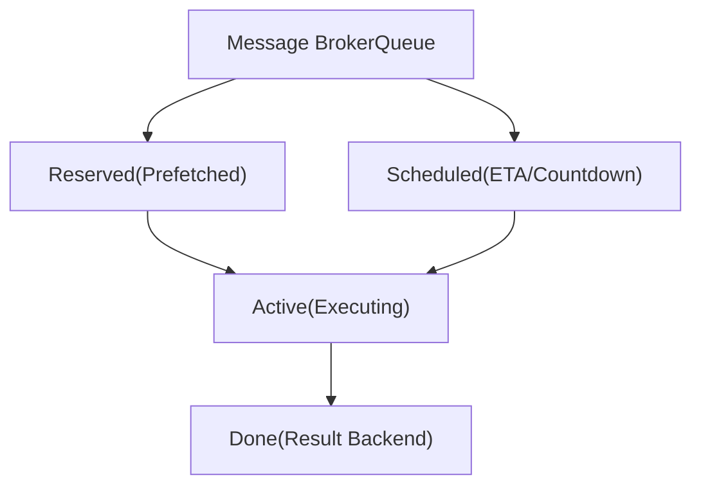
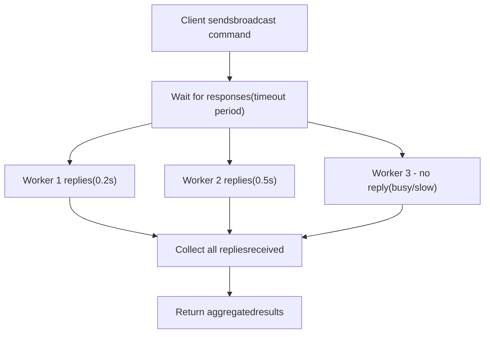
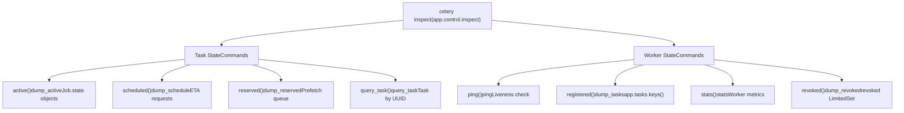

# 工作者检查 (Worker Inspection)

相关源文件

-   [celery/app/defaults.py](https://github.com/celery/celery/blob/4d068b56/celery/app/defaults.py)
-   [docs/faq.rst](https://github.com/celery/celery/blob/4d068b56/docs/faq.rst)
-   [docs/getting-started/first-steps-with-celery.rst](https://github.com/celery/celery/blob/4d068b56/docs/getting-started/first-steps-with-celery.rst)
-   [docs/getting-started/next-steps.rst](https://github.com/celery/celery/blob/4d068b56/docs/getting-started/next-steps.rst)
-   [docs/userguide/calling.rst](https://github.com/celery/celery/blob/4d068b56/docs/userguide/calling.rst)
-   [docs/userguide/monitoring.rst](https://github.com/celery/celery/blob/4d068b56/docs/userguide/monitoring.rst)
-   [docs/userguide/periodic-tasks.rst](https://github.com/celery/celery/blob/4d068b56/docs/userguide/periodic-tasks.rst)
-   [docs/userguide/routing.rst](https://github.com/celery/celery/blob/4d068b56/docs/userguide/routing.rst)
-   [docs/userguide/tasks.rst](https://github.com/celery/celery/blob/4d068b56/docs/userguide/tasks.rst)
-   [docs/userguide/workers.rst](https://github.com/celery/celery/blob/4d068b56/docs/userguide/workers.rst)

## 目的与范围

工作者检查提供了用于查询 Celery 工作者当前状态的只读命令。这些命令允许您在不修改工作者行为的情况下，监控活动任务、查看排队的工作、检查工作者统计信息以及验证任务注册。检查命令使用基于广播的协议，命令被发送到所有或特定的工作者，并在超时时间内收集响应。

有关修改工作者状态的命令（例如撤销任务或更改速率限制），请参阅[远程控制命令](/celery/celery/8.1-remote-control-commands)。有关全面的监控工具和基于事件的监控，请参阅[事件系统](/celery/celery/8.3-event-system)。

---

## 检查架构

工作者检查系统使用 Celery 的广播消息基础设施来查询工作者状态。当通过 `app.control.inspect()` 发出检查命令时，它会作为高优先级的广播消息，通过控制交换机（control exchange）发送给目标工作者。每个工作者的 `Consumer.Control` 组件处理该命令并返回响应。

**序列图：检查命令流**

> **[Mermaid sequence]**
> *(图表结构无法解析)*

**关键特性：**

-   **控制交换机**：命令使用专用的控制交换机（默认名称：`celery`，路由键模式：`<hostname>.control`）。
-   **邮箱模式 (Mailbox Pattern)**：通过 `app.control.broadcast()` 实现，使用 Mailbox 协议进行请求-回复通信。
-   **异步响应**：工作者通过临时回复队列独立进行回复；不保证所有工作者都会响应。
-   **可配置超时**：默认为 1.0 秒，可通过 `timeout` 参数配置。
-   **目标过滤**：可以使用 `destination=['worker@host']` 参数针对特定工作者。

**来源：** [docs/userguide/workers.rst412-451](https://github.com/celery/celery/blob/4d068b56/docs/userguide/workers.rst#L412-L451) [docs/userguide/monitoring.rst23-44](https://github.com/celery/celery/blob/4d068b56/docs/userguide/monitoring.rst#L23-L44) [celery/bin/celery.py19](https://github.com/celery/celery/blob/4d068b56/celery/bin/celery.py#L19-L19)

---

## 命令行界面

所有检查命令都使用 `celery inspect` 子命令调用：

```bash
# 通用语法
$ celery -A <app> inspect <command> [options]

# 针对特定工作者目标
$ celery -A proj inspect <command> -d worker1@example.com

# 使用自定义超时（单位：秒）
$ celery -A proj inspect <command> --timeout=5.0
```
**常用选项：**

| 选项 | 描述 | 默认值 |
| --- | --- | --- |
| `--destination` / `-d` | 针对特定工作者（逗号分隔） | 所有工作者 |
| `--timeout` / `-t` | 响应超时时间（秒） | 1.0 |
| `--json` | 以 JSON 格式输出结果 | 人类可读格式 |

**来源：** [docs/userguide/monitoring.rst32-43](https://github.com/celery/celery/blob/4d068b56/docs/userguide/monitoring.rst#L32-L43) [docs/userguide/monitoring.rst186-204](https://github.com/celery/celery/blob/4d068b56/docs/userguide/monitoring.rst#L186-L204)

---

## 任务状态检查命令

这些命令检查工作者内任务的当前状态。

### 活动任务 (Active Tasks)

列出工作者当前正在执行的所有任务。

```bash
$ celery -A proj inspect active
```
**返回：** 一个将工作者主机名映射到活动任务信息列表的字典。每个任务条目包含：

-   `id`: 任务 UUID
-   `name`: 任务名称（例如 `"myapp.tasks.process_order"`）
-   `args`: 位置参数的字符串表示
-   `kwargs`: 关键字参数的字符串表示
-   `type`: 任务类型
-   `hostname`: 正在执行任务的工作者主机名
-   `time_start`: 开始执行的时间戳
-   `acknowledged`: 任务消息是否已被确认
-   `delivery_info`: 代理交付元数据（exchange, routing\_key）
-   `worker_pid`: 正在执行任务的工作者进程 ID

**输出示例：**

```python
{
    'worker1@example.com': [
        {
            'id': '4e196aa4-0141-4601-8138-7aa33db0f577',
            'name': 'tasks.process_payment',
            'args': '[123, 45.99]',
            'kwargs': '{}',
            'time_start': 1634567890.123,
            'acknowledged': True,
            'worker_pid': 12345
        }
    ],
    'worker2@example.com': []
}
```
**用例：**

-   识别运行时间过长的任务。
-   检测卡住的工作者。
-   监控当前工作负载分布。

**来源：** [docs/userguide/monitoring.rst101-107](https://github.com/celery/celery/blob/4d068b56/docs/userguide/monitoring.rst#L101-L107)

---

### 已调度任务 (Scheduled Tasks)

列出已预留且带有 ETA（预计到达时间）或倒计时的任务。

```bash
$ celery -A proj inspect scheduled
```
**返回：** 工作者到已调度任务列表的映射字典。这些是从代理获取但正在等待其预定执行时间的任务。

**任务属性：**

-   `eta`: 任务应该执行的 ISO 8601 格式时间戳。
-   `priority`: 任务优先级（如果代理支持）。
-   `request`: 完整的任务请求对象，包含 `id`, `name`, `args`, `kwargs`。

**输出示例：**

```python
{
    'worker1@example.com': [
        {
            'eta': '2024-01-15T10:30:00+00:00',
            'priority': 6,
            'request': {
                'id': 'abc-123',
                'name': 'tasks.send_reminder',
                'args': '[user_id_456]'
            }
        }
    ]
}
```
**重要提示：** 已调度任务驻留在工作者内存中，直到其 ETA 到达。它们已经过代理确认，如果工作者在执行前崩溃，这些任务将不会被重新交付。

**来源：** [docs/userguide/monitoring.rst109-116](https://github.com/celery/celery/blob/4d068b56/docs/userguide/monitoring.rst#L109-L116) [docs/userguide/calling.rst226-276](https://github.com/celery/celery/blob/4d068b56/docs/userguide/calling.rst#L226-L276)

---

### 已预留任务 (Reserved Tasks)

列出已从代理预取并正在等待执行的任务（不包括已调度任务）。

```bash
$ celery -A proj inspect reserved
```
**返回：** 工作者到已预留（预取）任务列表的映射字典。这些任务位于工作者的内部队列中，等待可用的工作进程。

**预取行为：**

-   工作者根据 `worker_prefetch_multiplier` 设置预取多个任务。
-   已预留任务已被确认，但尚未执行。
-   默认预取数量：`concurrency * worker_prefetch_multiplier`（默认乘数为 4）。

**图表：工作者任务队列状态**


**来源：** [docs/userguide/monitoring.rst118-126](https://github.com/celery/celery/blob/4d068b56/docs/userguide/monitoring.rst#L118-L126) [docs/userguide/workers.rst344-346](https://github.com/celery/celery/blob/4d068b56/docs/userguide/workers.rst#L344-L346)

---

### 查询特定任务 (Query Specific Tasks)

通过任务 ID 检索特定任务的详细信息。

```bash
# 单个任务
$ celery -A proj inspect query_task e9f6c8f0-fec9-4ae8-a8c6-cf8c8451d4f8

# 多个任务
$ celery -A proj inspect query_task id1 id2 id3
```
**返回：** 工作者主机名到任务信息字典的映射字典。只有在其预留或活动集合中包含所查询任务的工作者才会响应。

**响应结构：**

```python
{
    'worker1@example.com': {
        'e9f6c8f0-fec9-4ae8-a8c6-cf8c8451d4f8': {
            'id': 'e9f6c8f0-fec9-4ae8-a8c6-cf8c8451d4f8',
            'name': 'tasks.process_order',
            'args': '[order_123]',
            'kwargs': '{"priority": "high"}',
            'type': 'tasks.process_order',
            'hostname': 'worker1@example.com',
            'time_start': 1634567890.123,
            'acknowledged': True,
            'state': 'RUNNING'
        }
    }
}
```
**用例：**

-   调试特定任务的执行。
-   验证分布式系统中任务的位置。
-   检查任务是否在特定工作者上卡住。

**来源：** [docs/userguide/monitoring.rst146-159](https://github.com/celery/celery/blob/4d068b56/docs/userguide/monitoring.rst#L146-L159)

---

## 工作者状态检查命令

这些命令检查工作者级别的状态和配置。

### Ping

测试工作者可用性并测量往返时间。

```bash
$ celery -A proj inspect ping
```
**返回：** 工作者主机名到 `{'ok': 'pong'}` 响应的映射字典。

**输出示例：**

```python
{
    'worker1@example.com': {'ok': 'pong'},
    'worker2@example.com': {'ok': 'pong'}
}
```
**用例：**

-   快速检查工作者是否存活并响应。
-   测量到工作者的网络延迟。
-   验证控制命令路由是否正常工作。
-   用于监控系统的健康检查。

**注意：** 这是最轻量级的检查命令。工作者会立即响应，而不收集任何状态信息。对存活性探测非常有用。

**来源：** [docs/userguide/monitoring.rst25-45](https://github.com/celery/celery/blob/4d068b56/docs/userguide/monitoring.rst#L25-L45)

---

### 已注册任务 (Registered Tasks)

列出每个工作者的 `app.tasks` 注册表中注册的所有任务。

```bash
$ celery -A proj inspect registered
```
**返回：** 工作者主机名到 `app.tasks.keys()` 中已注册任务名称排序列表的映射字典。

**输出示例：**

```python
{
    'worker1@example.com': [
        'celery.chain',
        'celery.chord',
        'celery.group',
        'myapp.tasks.add',
        'myapp.tasks.process_order',
        'myapp.tasks.send_email'
    ],
    'worker2@example.com': [
        'celery.chain',
        'celery.chord',
        'celery.group',
        'myapp.tasks.add',
        'myapp.tasks.generate_report'
    ]
}
```
**用例：**

-   验证工作者任务注册表中的任务发现和注册情况。
-   调试 "NotRegistered" 异常。
-   确认工作者配置差异（例如，不同的 `include` 设置）。
-   检查哪些工作者可以执行特定任务。

**注意：** 该列表包含内置的 Canvas 任务（前缀为 `celery.*`）和应用程序定义的任务。除非在 `@app.task()` 中通过 `name` 参数明确设置，否则任务名称由 `app.gen_task_name()` 生成。

**来源：** [docs/userguide/monitoring.rst134-138](https://github.com/celery/celery/blob/4d068b56/docs/userguide/monitoring.rst#L134-L138) [docs/userguide/tasks.rst186-246](https://github.com/celery/celery/blob/4d068b56/docs/userguide/tasks.rst#L186-L246) [docs/userguide/tasks.rst244-246](https://github.com/celery/celery/blob/4d068b56/docs/userguide/tasks.rst#L244-L246)

---

### 工作者统计信息 (Worker Statistics)

检索有关工作者状态和性能的全面统计信息。

```bash
$ celery -A proj inspect stats
```
**返回：** 工作者主机名到详细统计信息字典的映射字典。

**统计类别：**

| 类别 | 键 | 描述 |
| --- | --- | --- |
| **代理 (Broker)** | `broker` | 代理连接信息（transport, hostname, port） |
| **时钟 (Clock)** | `clock` | 用于事件排序的逻辑时钟值 |
| **池 (Pool)** | `pool` | 池实现和工作进程信息 |
|  | `pool.max-concurrency` | 最大并发任务数 |
|  | `pool.processes` | 工作进程 PID 列表 |
|  | `pool.max-tasks-per-child` | 每个工作进程的任务限制 |
|  | `pool.timeouts` | 软性/硬性超时设置 |
| **预取 (Prefetch)** | `prefetch_count` | 当前预取乘数设置 |
| **总计 (Total)** | `total` | 自工作者启动以来的累计计数器 |
|  | `total.tasks.received` | 接收的任务总数 |
|  | `total.tasks.active` | 当前活动任务计数 |
|  | `total.tasks.succeeded` | 成功完成的任务数 |
|  | `total.tasks.failed` | 失败的任务数 |
|  | `total.tasks.retried` | 重试的任务数 |
|  | `total.tasks.revoked` | 撤销的任务数 |
| **资源使用 (Rusage)** | `rusage` | 资源使用情况（CPU 时间、内存、I/O） |

**输出示例：**

```python
{
    'worker1@example.com': {
        'broker': {
            'hostname': 'localhost',
            'port': 5672,
            'transport': 'amqp',
            'virtual_host': '/'
        },
        'clock': 12345,
        'pool': {
            'implementation': 'prefork',
            'max-concurrency': 8,
            'processes': [12001, 12002, 12003, 12004],
            'max-tasks-per-child': None,
            'timeouts': [3600, 3660]
        },
        'prefetch_count': 4,
        'total': {
            'tasks.received': 15234,
            'tasks.active': 3,
            'tasks.succeeded': 14998,
            'tasks.failed': 42,
            'tasks.retried': 15,
            'tasks.revoked': 2
        },
        'rusage': {
            'utime': 123.45,
            'stime': 67.89,
            'maxrss': 524288,
            'idrss': 0,
            'isrss': 0
        }
    }
}
```
**监控用例：**

-   性能分析和容量规划。
-   检测资源耗尽（内存、CPU）。
-   跟踪任务成功/失败率。
-   验证工作者配置。
-   调试连接问题。

**来源：** [docs/userguide/monitoring.rst140-144](https://github.com/celery/celery/blob/4d068b56/docs/userguide/monitoring.rst#L140-L144) [docs/userguide/workers.rst313-362](https://github.com/celery/celery/blob/4d068b56/docs/userguide/workers.rst#L313-L362)

---

### 已撤销任务 (Revoked Tasks)

列出存储在工作者 `revoked` 集合中的撤销任务历史。

```bash
$ celery -A proj inspect revoked
```
**返回：** 工作者主机名到已撤销任务 UUID 集合的映射字典。

**输出示例：**

```python
{
    'worker1@example.com': [
        'd9078da5-9915-40a0-bfa1-392c7bde42ed',
        'f565793e-b041-4b2b-9ca4-dca22762a55d'
    ],
    'worker2@example.com': [
        'd9078da5-9915-40a0-bfa1-392c7bde42ed'
    ]
}
```
**撤销内存：**

-   工作者在内存中维护一个已撤销任务 ID 的 `LimitedSet`。
-   默认最大值：50,000 个撤销 ID（环境变量 `CELERY_WORKER_REVOKES_MAX`）。
-   撤销项在 10,800 秒/3 小时后过期（环境变量 `CELERY_WORKER_REVOKE_EXPIRES`）。
-   当超过限制时，最旧的撤销项将首先被移除。

**持久化撤销：**

```bash
$ celery -A proj worker --statedb=/var/run/celery/worker.state
```
使用 `--statedb` 时，已撤销任务列表将使用 `shelve` 持久化到磁盘，并在工作者重启后继续存在。工作者的 `Consumer.Mingle` 组件在启动时会在集群内同步撤销信息。

**来源：** [docs/userguide/monitoring.rst128-132](https://github.com/celery/celery/blob/4d068b56/docs/userguide/monitoring.rst#L128-L132) [docs/userguide/workers.rst509-524](https://github.com/celery/celery/blob/4d068b56/docs/userguide/workers.rst#L509-L524) [docs/userguide/workers.rst597-624](https://github.com/celery/celery/blob/4d068b56/docs/userguide/workers.rst#L597-L624)

---

## 针对特定工作者

默认情况下，检查命令会广播到所有工作者。您可以使用 `--destination` 选项针对特定工作者。

**语法：**

```bash
# 单个工作者
$ celery -A proj inspect active -d worker1@example.com

# 多个工作者（逗号分隔，无空格）
$ celery -A proj inspect active -d worker1@example.com,worker2@example.com

# 模式匹配（如果实现支持）
$ celery -A proj inspect active -d worker*@example.com
```
**工作者命名：**

工作者主机名遵循以下模式：`<nodename>@<hostname>`

-   `<nodename>`：使用 `--hostname` 选项指定的自定义名称（默认："celery"）。
-   `<hostname>`：系统主机名。

**主机名扩展变量：**

| 变量 | 扩展为 |
| --- | --- |
| `%h` | 带有域名的完整主机名（例如 `worker.example.com`） |
| `%n` | 仅主机名（例如 `worker`） |
| `%d` | 仅域名（例如 `example.com`） |

**示例：**

```bash
# 使用自定义名称启动工作者
$ celery -A proj worker --hostname=worker1@%h

# 检查该特定工作者
$ celery -A proj inspect active -d worker1@worker.example.com
```
**来源：** [docs/userguide/monitoring.rst193-204](https://github.com/celery/celery/blob/4d068b56/docs/userguide/monitoring.rst#L193-L204) [docs/userguide/workers.rst36-61](https://github.com/celery/celery/blob/4d068b56/docs/userguide/workers.rst#L36-L61)

---

## 超时与响应处理

检查命令必须在指定的超时时间内完成。由于没有中心化的工作者注册表，客户端无法知道预期会有多少响应。

**超时行为：**


**配置超时：**

```bash
# CLI：5 秒超时
$ celery -A proj inspect active --timeout=5.0

# 程序化：10 秒超时
>>> app.control.inspect(timeout=10.0).active()
```
**何时增加超时时间：**

-   客户端与代理之间的网络延迟较高。
-   工作者负载过重。
-   集群中的工作者数量巨大。
-   代理响应缓慢。
-   工作者正在处理大量任务（响应序列化开销）。

**超时 vs. 缺失的工作者：**

超时并不一定表示工作者已死亡。它可能意味着：

-   工作者太忙而无法快速响应。
-   网络延迟超过了超时时间。
-   代理队列拥塞。
-   工作者正在处理阻塞任务（特别是使用 `solo` 池时）。

**默认超时：** 1.0 秒。

**来源：** [docs/userguide/monitoring.rst186-189](https://github.com/celery/celery/blob/4d068b56/docs/userguide/monitoring.rst#L186-L189) [docs/userguide/workers.rst436-451](https://github.com/celery/celery/blob/4d068b56/docs/userguide/workers.rst#L436-L451)

---

## 程序化用法

可以在 Python 代码中使用 `app.control.inspect()` 接口程序化地调用检查命令，该接口返回一个包装了 `app.control.broadcast()` 的 `Inspect` 实例。

**基本模式：**

```python
from celery import Celery

app = Celery('myapp', broker='redis://localhost')

# 获取一个 Inspect 实例
inspect = app.control.inspect()

# 调用检查方法 - 每个方法内部都会调用 broadcast()
active_tasks = inspect.active()
scheduled_tasks = inspect.scheduled()
registered_tasks = inspect.registered()
worker_stats = inspect.stats()

# 使用自定义超时
inspect = app.control.inspect(timeout=5.0)
active_tasks = inspect.active()

# 针对特定工作者
inspect = app.control.inspect(destination=['worker1@example.com'])
active_tasks = inspect.active()
```
**可用方法：**

所有 CLI 检查命令在 `Inspect` 对象上都有相应的方法：

| 方法 | CLI 等效项 | 返回值 | 广播命令 |
| --- | --- | --- | --- |
| `ping()` | `inspect ping` | Dict\[str, Dict\] | `'ping'` |
| `active()` | `inspect active` | Dict\[str, List\[Dict\]\] | `'dump_active'` |
| `scheduled()` | `inspect scheduled` | Dict\[str, List\[Dict\]\] | `'dump_schedule'` |
| `reserved()` | `inspect reserved` | Dict\[str, List\[Dict\]\] | `'dump_reserved'` |
| `revoked()` | `inspect revoked` | Dict\[str, List\[str\]\] | `'dump_revoked'` |
| `registered()` | `inspect registered` | Dict\[str, List\[str\]\] | `'dump_tasks'` |
| `stats()` | `inspect stats` | Dict\[str, Dict\] | `'stats'` |
| `query_task(*task_ids)` | `inspect query_task` | Dict\[str, Dict\] | `'query_task'` |

**响应格式：**

所有方法都返回一个将工作者主机名映射到其响应的字典，如果没有工作者响应，则返回 `None`。如果工作者在超时时间内未响应，它将不会出现在结果中。

```python
{
    'worker1@example.com': [...],  # 工作者 1 的响应
    'worker2@example.com': [...],  # 工作者 2 的响应
    # worker3 在超时时间内未响应
}
```
**错误处理：**

```python
inspect = app.control.inspect(timeout=1.0)
result = inspect.active()

if result is None:
    print("在超时时间内没有工作者响应")
elif not result:
    print("工作者有响应，但没有活动任务")
else:
    for worker, tasks in result.items():
        print(f"{worker}: {len(tasks)} 个活动任务")
```
**集成示例：**

```python
def get_worker_health():
    """获取所有工作者的健康状态。"""
    inspect = app.control.inspect(timeout=2.0)

    stats = inspect.stats()
    active = inspect.active()

    if not stats:
        return {"error": "没有可用的工作者"}

    health = {}
    for worker, stat_data in stats.items():
        health[worker] = {
            "status": "healthy",
            "active_tasks": len(active.get(worker, [])),
            "total_tasks": stat_data['total']['tasks.received'],
            "failed_tasks": stat_data['total']['tasks.failed'],
            "pool_size": stat_data['pool']['max-concurrency'],
            "prefetch_count": stat_data['prefetch_count']
        }

    return health
```
**来源：** [docs/userguide/workers.rst455-496](https://github.com/celery/celery/blob/4d068b56/docs/userguide/workers.rst#L455-L496) [docs/userguide/monitoring.rst23-44](https://github.com/celery/celery/blob/4d068b56/docs/userguide/monitoring.rst#L23-L44)

---

## 检查命令参考

**完整命令摘要：**


**对比表：**

| 命令 | 检查目标 | 广播命令 | 何时使用 |
| --- | --- | --- | --- |
| `ping` | 工作者存活性 | `'ping'` | 健康检查，测量延迟 |
| `active` | `Job.state` 对象 | `'dump_active'` | 监控当前工作负载，检测运行时间过长的任务 |
| `scheduled` | ETA 请求 | `'dump_schedule'` | 检查延迟任务队列，调试调度情况 |
| `reserved` | 预取队列 | `'dump_reserved'` | 了解工作者队列深度，调整预取设置 |
| `query_task` | 特定 UUID | `'query_task'` | 调试特定任务执行，查找任务位置 |
| `registered` | `app.tasks` 注册表 | `'dump_tasks'` | 验证任务发现情况，调试 NotRegistered 错误 |
| `stats` | 工作者度量指标 | `'stats'` | 性能监控，容量规划 |
| `revoked` | `revoked` LimitedSet | `'dump_revoked'` | 审计任务撤销情况，验证撤销传播 |

**来源：** [docs/userguide/monitoring.rst44-159](https://github.com/celery/celery/blob/4d068b56/docs/userguide/monitoring.rst#L44-L159) [celery/bin/celery.py19](https://github.com/celery/celery/blob/4d068b56/celery/bin/celery.py#L19-L19)

---

## 代理 (Broker) 与池 (Pool) 支持

检查命令依赖于代理支持广播消息的能力，以及工作者池响应控制消息的能力。

**代理支持：**

| 代理 | 检查支持 | 备注 |
| --- | --- | --- |
| RabbitMQ (AMQP) | ✅ 完全支持 | 支持最好，广播可靠 |
| Redis | ✅ 完全支持 | 可靠但可能有延迟 |
| Amazon SQS | ❌ 受限 | 无原生广播支持 |
| 其他 AMQP | ✅ 完全支持 | 与 RabbitMQ 相同 |

**池支持：**

| 池类型 | 检查支持 | 备注 |
| --- | --- | --- |
| `prefork` | ✅ 完全支持 | 默认设置，完全支持 |
| `eventlet` | ✅ 完全支持 | 非阻塞，响应快 |
| `gevent` | ✅ 完全支持 | 非阻塞，响应快 |
| `threads` | ✅ 完全支持 | 完全支持 |
| `solo` | ⚠️ 会发生阻塞 | 会在执行任务时发生阻塞 |

**Solo 池注意事项：**

`solo` 池在主进程中执行任务。虽然它支持检查命令，但任何当前正在执行的任务都会阻塞检查响应。如果工作者非常忙碌，您可能需要显著增加超时时间。

```bash
# Solo 池工作者 - 可能需要更长的超时时间
$ celery -A proj inspect active --timeout=10.0
```
**来源：** [docs/userguide/workers.rst425-451](https://github.com/celery/celery/blob/4d068b56/docs/userguide/workers.rst#L425-L451)

---

## 最佳实践

**1. 设置适当的超时时间**

```python
# 用于本地开发
inspect = app.control.inspect(timeout=1.0)

# 用于具有大量工作者的生产环境
inspect = app.control.inspect(timeout=5.0)

# 用于分布式/高延迟网络
inspect = app.control.inspect(timeout=10.0)
```
**2. 处理缺失的响应**

```python
result = inspect.active()
if not result:
    # 可能意味着：没有工作者、超时或工作者繁忙
    # 分别检查代理和工作者健康状况
    pass
```
**3. 对大型集群使用特定的目标定位**

```python
# 而不是查询所有工作者
inspect = app.control.inspect(
    destination=['worker1@example.com', 'worker2@example.com']
)
```
**4. 为监控缓存统计信息**

```python
# 不要过于频繁地查询统计信息
# 在监控仪表板中缓存 30 秒
@cached(ttl=30)
def get_cached_stats():
    return app.control.inspect(timeout=2.0).stats()
```
**5. 为了效率组合命令**

```python
# 高效获取多项信息
inspect = app.control.inspect(timeout=3.0)
active = inspect.active()
reserved = inspect.reserved()
stats = inspect.stats()

# 一起处理所有结果
for worker in stats.keys():
    worker_info = {
        'active_count': len(active.get(worker, [])),
        'reserved_count': len(reserved.get(worker, [])),
        'total_processed': stats[worker]['total']['tasks.received']
    }
```
**6. 监控已撤销任务的增长**

```python
revoked = inspect.revoked()
for worker, revoked_ids in revoked.items():
    if len(revoked_ids) > 40000:  # 接近 50k 的限制
        print(f"警告：{worker} 有 {len(revoked_ids)} 个已撤销任务")
```
**来源：** [docs/userguide/monitoring.rst186-189](https://github.com/celery/celery/blob/4d068b56/docs/userguide/monitoring.rst#L186-L189) [docs/userguide/workers.rst509-524](https://github.com/celery/celery/blob/4d068b56/docs/userguide/workers.rst#L509-L524)
