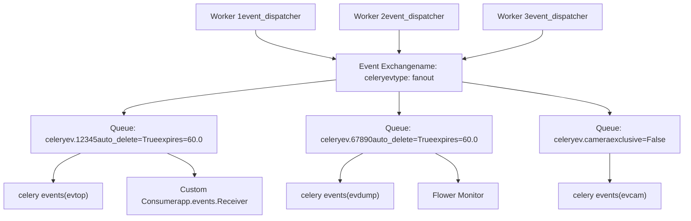
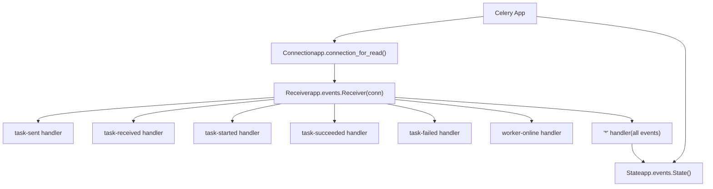
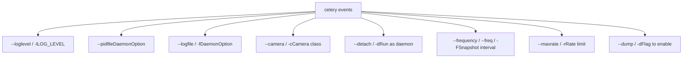
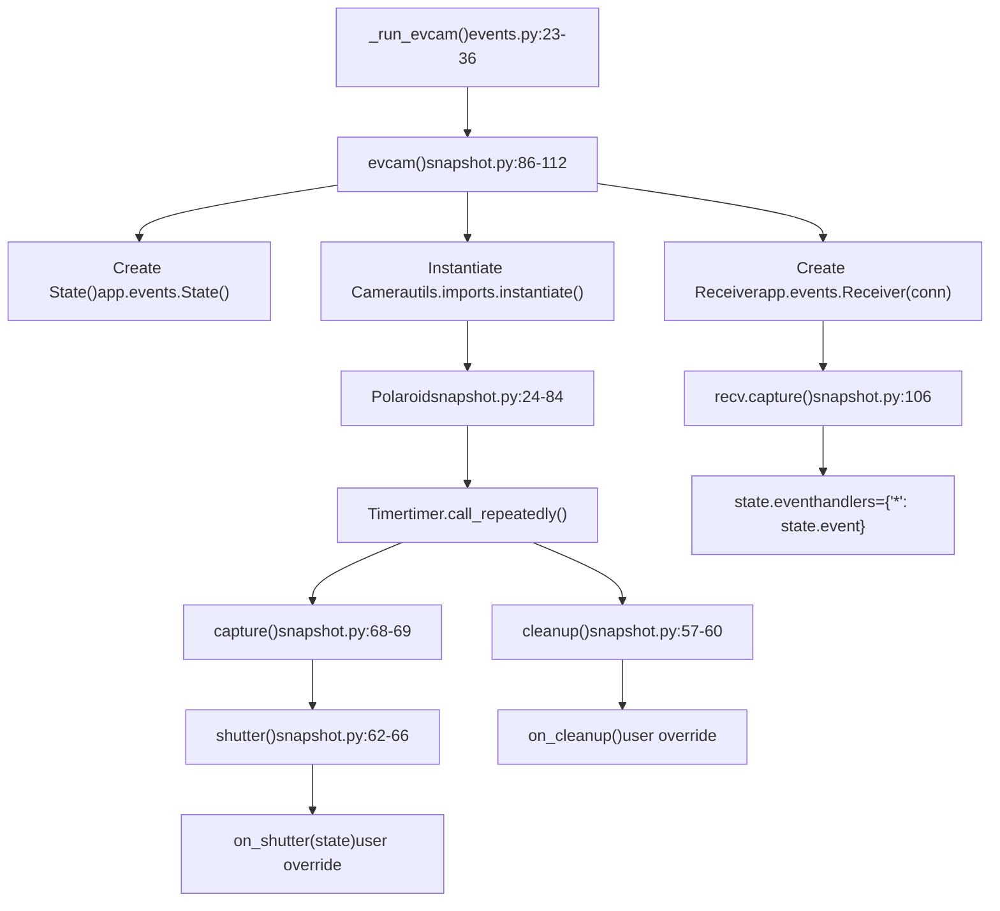

# 事件系统 (Event System)

相关源文件

-   [celery/bin/base.py](https://github.com/celery/celery/blob/4d068b56/celery/bin/base.py)
-   [celery/bin/beat.py](https://github.com/celery/celery/blob/4d068b56/celery/bin/beat.py)
-   [celery/bin/celery.py](https://github.com/celery/celery/blob/4d068b56/celery/bin/celery.py)
-   [celery/bin/events.py](https://github.com/celery/celery/blob/4d068b56/celery/bin/events.py)
-   [celery/bin/worker.py](https://github.com/celery/celery/blob/4d068b56/celery/bin/worker.py)
-   [celery/events/snapshot.py](https://github.com/celery/celery/blob/4d068b56/celery/events/snapshot.py)

Celery 中的事件系统通过允许工作者（worker）发出描述任务和工作者状态更改的事件，提供对集群活动的实时监控。事件发布到专用的交换机（exchange），并可以由监控工具、自定义应用程序或 `celery events` 命令消费。

有关远程控制命令的信息，请参阅第 8.1 页。有关工作者检查命令的信息，请参阅第 8.2 页。

## 概述

事件系统由三个主要组件组成：

1.  **事件发布**：当启用 `worker_send_task_events` 时，工作者向专用的事件交换机发出事件。
2.  **事件交换机**：一个扇出型（fanout）交换机（默认为 `celeryev`），它将事件分发到所有绑定的队列。
3.  **事件消费者**：消费并处理事件的工具和应用程序，包括：
    -   `celery events` 命令（evtop、evdump、evcam 模式）。
    -   第三方监控器，如 Flower。
    -   通过 `app.events.Receiver` 的自定义事件消费者。

来源：[celery/bin/events.py1-95](https://github.com/celery/celery/blob/4d068b56/celery/bin/events.py#L1-L95) [celery/events/snapshot.py1-112](https://github.com/celery/celery/blob/4d068b56/celery/events/snapshot.py#L1-L112)

## 事件交换机架构

事件通过专用的 AMQP 交换机发布，该交换机的配置与任务路由分离开来。事件交换机使用扇出（fanout）拓扑，这意味着所有绑定的队列都会接收到所有事件。

### 事件交换机配置

标题：事件交换机与队列配置


**事件交换机设置：**

| 设置项 | 默认值 | 目的 |
| --- | --- | --- |
| `event_exchange` | `'celeryev'` | 事件交换机名称 |
| `event_exchange_type` | `'topic'` | 交换机类型（使用 topic 允许路由） |
| `event_queue_prefix` | `'celeryev'` | 事件队列名称的前缀 |
| `event_queue_expires` | `60.0` | 队列过期时间（秒，自动删除） |
| `event_queue_ttl` | `5.0` | 消息存活时间（TTL，秒） |
| `event_serializer` | `'json'` | 事件的序列化格式 |

事件队列通常带有随机后缀自动生成，并在消费者断开连接时自动删除。

来源：[celery/bin/events.py1-95](https://github.com/celery/celery/blob/4d068b56/celery/bin/events.py#L1-L95) [celery/events/snapshot.py86-112](https://github.com/celery/celery/blob/4d068b56/celery/events/snapshot.py#L86-L112)

## 事件类型

工作者发出各种类型的事件，以描述任务执行和工作者状态的变化。事件消费者可以过滤并处理特定的事件类型。

### 任务事件 (Task Events) 

任务事件跟踪单个任务执行的生命周期：

| 事件类型 | 触发时机 | 描述 | 关键字段 |
| --- | --- | --- | --- |
| `task-sent` | 客户端 | 任务消息已发送到代理 | `name`, `id`, `args`, `kwargs`, `routing_key`, `eta` |
| `task-received` | 工作者端 | 工作者已接收任务 | `name`, `id`, `args`, `kwargs`, `hostname` |
| `task-started` | 工作者端 | 任务开始执行 | `name`, `id`, `hostname`, `pid` |
| `task-succeeded` | 工作者端 | 任务成功完成 | `name`, `id`, `result`, `runtime` |
| `task-failed` | 工作者端 | 任务引发异常 | `name`, `id`, `exception`, `traceback` |
| `task-rejected` | 工作者端 | 任务被工作者拒绝 | `name`, `id`, `requeue` |
| `task-revoked` | 工作者端 | 任务在执行前被撤销 | `name`, `id`, `terminated`, `signum`, `expired` |
| `task-retried` | 工作者端 | 任务将重试 | `name`, `id`, `exception`, `traceback` |

### 工作者事件 (Worker Events) 

工作者事件描述工作者的状态和生命周期：

| 事件类型 | 触发时机 | 描述 | 关键字段 |
| --- | --- | --- | --- |
| `worker-online` | 启动时 | 工作者已启动并连接 | `hostname`, `timestamp`, `freq` |
| `worker-heartbeat` | 定期 | 工作者仍然存活 | `hostname`, `timestamp`, `active`, `processed` |
| `worker-offline` | 关闭时 | 工作者已断开连接 | `hostname`, `timestamp` |

### 事件消息结构

所有事件共享一个标准结构，并带有类型特定的字段：

```json
{
    "type": "task-started",           // 事件类型
    "uuid": "task-uuid-here",         // 任务 ID
    "hostname": "worker1@host",       // 工作者主机名
    "timestamp": 1234567890.123,      // Unix 时间戳
    "clock": 42,                      // 逻辑时钟值
    "local_received": 1234567890.456, // 消费者接收时间
    // 类型特定字段...
    "name": "myapp.tasks.add",
    "pid": 12345
}
```
`clock` 字段实现了一个 Lamport 逻辑时钟，用于在分布式工作者之间对事件进行排序。

来源：[celery/bin/events.py1-95](https://github.com/celery/celery/blob/4d068b56/celery/bin/events.py#L1-L95)

## 启用事件发送

工作者默认不发送事件。必须通过配置或运行时控制显式启用事件发送。

### 通过配置启用

**应用程序配置：**

```python
app.conf.worker_send_task_events = True
app.conf.task_send_sent_event = True  # 启用 task-sent 事件
```
**工作者命令行：**

```bash
celery -A proj worker --task-events
# 或等效于
celery -A proj worker -E
```
有关 `--task-events` / `-E` 选项，请参阅 [celery/bin/worker.py212-220](https://github.com/celery/celery/blob/4d068b56/celery/bin/worker.py#L212-L220)。

### 运行时控制

在运行中的工作者上启用或禁用事件：

```bash
# 在所有工作者上启用事件
celery -A proj control enable_events

# 在所有工作者上禁用事件
celery -A proj control disable_events

# 针对特定工作者
celery -A proj control enable_events -d worker1@host
```
这是通过远程控制系统实现的（参见第 8.1 页）。

来源：[celery/bin/worker.py212-220](https://github.com/celery/celery/blob/4d068b56/celery/bin/worker.py#L212-L220)

## 事件消费者实现

应用程序可以使用 `app.events.Receiver` 类以程序化方式消费事件。这允许对集群事件进行自定义监控、日志记录或处理。

### 基本事件消费者

标题：事件消费者实现模式


**基本实现示例：**

```python
from celery import Celery

app = Celery('proj')

def on_task_succeeded(event):
    print(f"任务 {event['uuid']} 成功：{event['result']}")

def on_task_failed(event):
    print(f"任务 {event['uuid']} 失败：{event['exception']}")

def monitor_events():
    # 创建连接和状态对象
    connection = app.connection_for_read()
    state = app.events.State()

    # 创建带有处理程序的接收器
    with app.events.Receiver(connection, handlers={
        'task-succeeded': on_task_succeeded,
        'task-failed': on_task_failed,
        '*': state.event,  # 更新所有事件的状态
    }) as recv:
        recv.capture(limit=None, timeout=None, wakeup=True)

if __name__ == '__main__':
    monitor_events()
```
### 状态跟踪

`app.events.State()` 类根据消费的事件维护集群状态的内存表示：

```python
state = app.events.State()

# 注册 state.event 作为通配符处理程序
recv = app.events.Receiver(conn, handlers={'*': state.event})
recv.capture(limit=None)

# 访问累积的状态
print(f"活动工作者数: {len(state.workers)}")
print(f"活动任务数: {len(state.tasks)}")

# 遍历工作者
for hostname, worker_info in state.workers.items():
    print(f"工作者 {hostname}: {worker_info}")

# 遍历任务
for uuid, task_info in state.tasks.items():
    print(f"任务 {uuid}: {task_info.name} - {task_info.state}")
```
`State` 类被 evtop、evcam 和其他监控工具用来跟踪集群状态。

来源：[celery/events/snapshot.py98-112](https://github.com/celery/celery/blob/4d068b56/celery/events/snapshot.py#L98-L112)

## celery events 命令

`celery events` 命令提供了三种内置模式来消费事件流。模式由命令行选项确定。

### 命令结构

`celery events` 命令在 [celery/bin/events.py50-94](https://github.com/celery/celery/blob/4d068b56/celery/bin/events.py#L50-L94) 中实现，并根据选项自动确定要运行的模式：

```bash
celery -A proj events [OPTIONS]
```
**模式选择：**

| 选项 | 模式 | 调用的函数 | 描述 |
| --- | --- | --- | --- |
| `--dump` | evdump | `_run_evdump()` | 将事件转储到标准输出 (stdout) |
| `--camera=CLASS` | evcam | `_run_evcam()` | 启动快照照相机 (snapshot camera) |
| (无选项) | evtop | `_run_evtop()` | 启动 curses 监控器 |

来源：[celery/bin/events.py50-94](https://github.com/celery/celery/blob/4d068b56/celery/bin/events.py#L50-L94)

### 命令选项


来源：[celery/bin/events.py50-79](https://github.com/celery/celery/blob/4d068b56/celery/bin/events.py#L50-L79)

## 事件转储模式 (Event Dump Mode)

事件转储模式 (`evdump`) 会在原始事件到达时将其写入标准输出，这对于调试或通过管道传输到其他工具非常有用。

### 调用方式

```bash
# 将所有事件转储到标准输出
celery -A proj events --dump

# 重定向到文件
celery -A proj events --dump > events.log
```
### 实现方式

当存在 `--dump` 标志时触发该模式 [celery/bin/events.py85-86](https://github.com/celery/celery/blob/4d068b56/celery/bin/events.py#L85-L86)：

```python
if dump:
    return _run_evdump(app)
```
`_run_evdump()` 函数 [celery/bin/events.py17-20](https://github.com/celery/celery/blob/4d068b56/celery/bin/events.py#L17-L20) 设置进程标题并委托给 `celery.events.dumper.evdump`。

来源：[celery/bin/events.py17-20](https://github.com/celery/celery/blob/4d068b56/celery/bin/events.py#L17-L20) [celery/bin/events.py85-86](https://github.com/celery/celery/blob/4d068b56/celery/bin/events.py#L85-L86)

## Curses 监控模式

不带标志的默认模式会启动 `evtop`，这是一个基于终端的 curses 监控器，显示实时的任务和工作者活动。

### 调用方式

```bash
# 启动 curses 监控器
celery -A proj events

# 需要安装 ncurses 库
```
### 实现方式

当既没有指定 `--dump` 也没有指定 `--camera` 时，该命令默认为 evtop [celery/bin/events.py94](https://github.com/celery/celery/blob/4d068b56/celery/bin/events.py#L94-L94)：

```python
return _run_evtop(app)
```
`_run_evtop()` 函数 [celery/bin/events.py39-48](https://github.com/celery/celery/blob/4d068b56/celery/bin/events.py#L39-L48) 从 `celery.events.cursesmon` 导入并处理无法使用 curses 的情况：

```python
try:
    from celery.events.cursesmon import evtop
    _set_process_status('top')
    return evtop(app=app)
except ModuleNotFoundError as e:
    if e.name == '_curses':
        raise click.UsageError("需要 curses 模块...")
```
监控器在终端界面中显示任务、工作者及其状态，并实时更新。

来源：[celery/bin/events.py39-48](https://github.com/celery/celery/blob/4d068b56/celery/bin/events.py#L39-L48) [celery/bin/events.py94](https://github.com/celery/celery/blob/4d068b56/celery/bin/events.py#L94-L94) [docs/userguide/monitoring.rst321-330](https://github.com/celery/celery/blob/4d068b56/docs/userguide/monitoring.rst#L321-L330)

## 快照照相机模式 (Snapshot Camera Mode)

照相机模式 (`evcam`) 定期捕获集群状态，并将其传递给自定义照相机实现进行持久化或处理。

### 调用方式

```bash
# 启动照相机，每 2 秒拍摄一次快照
celery -A proj events --camera=myapp.Camera --frequency=2.0

# 以守护进程运行，并设置速率限制
celery -A proj events -c myapp.Camera --detach --maxrate=10/m \
    --logfile=/var/log/celery/cam.log --pidfile=/var/run/celery/cam.pid
```
### 照相机模式选项

| 选项 | 类型 | 默认值 | 描述 |
| --- | --- | --- | --- |
| `--camera` / `-c` | 字符串 | 必填 | 照相机类的全限定名 |
| `--frequency` / `--freq` / `-F` | 浮点数 | 1.0 | 快照之间的时间间隔（秒） |
| `--maxrate` / `-r` | 字符串 | 无 | 速率限制（例如 '10/m'） |
| `--detach` / `-d` | 标志位 | False | 作为后台守护进程运行 |

来源：[celery/bin/events.py56-72](https://github.com/celery/celery/blob/4d068b56/celery/bin/events.py#L56-L72)

### 照相机模式实现

标题：照相机模式数据流


`_run_evcam()` 函数 [celery/bin/events.py23-36](https://github.com/celery/celery/blob/4d068b56/celery/bin/events.py#L23-L36) 负责编排照相机模式：

1.  调用 [celery/events/snapshot.py86-112](https://github.com/celery/celery/blob/4d068b56/celery/events/snapshot.py#L86-L112) 中的 `evcam()`。
2.  创建一个 `State` 实例来跟踪集群状态。
3.  实例化自定义照相机类（必须继承自 `Polaroid`）。
4.  通过 `cam.install()` [celery/events/snapshot.py45-49](https://github.com/celery/celery/blob/4d068b56/celery/events/snapshot.py#L45-L49) 安装快照计时器。
5.  创建一个事件接收器，以 `state.event` 作为通配符处理程序。
6.  开始通过 `recv.capture(limit=None)` [celery/events/snapshot.py106](https://github.com/celery/celery/blob/4d068b56/celery/events/snapshot.py#L106-L106) 消费事件。

来源：[celery/bin/events.py23-36](https://github.com/celery/celery/blob/4d068b56/celery/bin/events.py#L23-L36) [celery/events/snapshot.py24-112](https://github.com/celery/celery/blob/4d068b56/celery/events/snapshot.py#L24-L112)

### Polaroid 类架构

`Polaroid` 类 [celery/events/snapshot.py24-84](https://github.com/celery/celery/blob/4d068b56/celery/events/snapshot.py#L24-L84) 管理定期的快照捕获：

**关键属性：**

| 属性 | 类型 | 描述 |
| --- | --- | --- |
| `state` | State | 集群状态对象 |
| `freq` | 浮点数 | 快照频率（秒） |
| `cleanup_freq` | 浮点数 | 清理频率（默认：3600.0） |
| `timer` | Timer | 调度计时器 |
| `maxrate` | TokenBucket | 速率限制器（可选） |
| `shutter_signal` | Signal | 快照时发出的信号 |
| `cleanup_signal` | Signal | 清理时发出的信号 |

**核心方法：**

| 方法 | 用途 | 文件引用 |
| --- | --- | --- |
| `install()` | 启动快照计时器 | [snapshot.py45-49](https://github.com/celery/celery/blob/4d068b56/snapshot.py#L45-L49) |
| `capture()` | 执行拍摄快照 | [snapshot.py68-69](https://github.com/celery/celery/blob/4d068b56/snapshot.py#L68-L69) |
| `shutter()` | 处理带有速率限制的快照 | [snapshot.py62-66](https://github.com/celery/celery/blob/4d068b56/snapshot.py#L62-L66) |
| `cleanup()` | 定期清理 | [snapshot.py57-60](https://github.com/celery/celery/blob/4d068b56/snapshot.py#L57-L60) |
| `cancel()` | 停止快照计时器 | [snapshot.py71-76](https://github.com/celery/celery/blob/4d068b56/snapshot.py#L71-L76) |
| `on_shutter()` | 用户自定义的快照钩子 | [snapshot.py51-52](https://github.com/celery/celery/blob/4d068b56/snapshot.py#L51-L52) |
| `on_cleanup()` | 用户自定义的清理钩子 | [snapshot.py54-55](https://github.com/celery/celery/blob/4d068b56/snapshot.py#L54-L55) |

来源：[celery/events/snapshot.py24-84](https://github.com/celery/celery/blob/4d068b56/celery/events/snapshot.py#L24-L84)

### 快照定时流程

标题：Polaroid 快照执行序列

> **[Mermaid sequence]**
> *(图表结构无法解析)*

`State.freeze_while()` 方法 [celery/events/snapshot.py69](https://github.com/celery/celery/blob/4d068b56/celery/events/snapshot.py#L69-L69) 确保在处理快照期间状态不会发生改变。通过 `TokenBucket` 实现的速率限制 [celery/events/snapshot.py63](https://github.com/celery/celery/blob/4d068b56/celery/events/snapshot.py#L63-L63) 防止当事件快速到达时快照频率过高。

来源：[celery/events/snapshot.py45-69](https://github.com/celery/celery/blob/4d068b56/celery/events/snapshot.py#L45-L69)

## 创建自定义照相机

通过实现已捕获状态的处理程序，可以扩展快照系统来创建自定义照相机。

### 照相机实现模式

```python
# myapp/cameras.py

from celery.events.snapshot import Polaroid

class MyCamera(Polaroid):
    """将快照存储到数据库的自定义照相机。"""

    clear_after = True  # 拍摄快照后清除状态

    def on_shutter(self, state):
        """为每次快照调用。"""
        # 访问状态数据
        workers = state.workers
        tasks = state.tasks

        # 存储到数据库
        self.store_snapshot({
            'timestamp': time.time(),
            'workers': dict(workers),
            'tasks': dict(tasks),
        })

    def on_cleanup(self):
        """定期调用以进行维护。"""
        # 移除旧快照
        self.remove_old_snapshots(days=7)
```
### 启动自定义照相机

```bash
celery -A proj events --camera=myapp.cameras.MyCamera --frequency=5.0
```
来源：[celery/events/snapshot.py24-84](https://github.com/celery/celery/blob/4d068b56/celery/events/snapshot.py#L24-L84) [docs/userguide/monitoring.rst522-527](https://github.com/celery/celery/blob/4d068b56/docs/userguide/monitoring.rst#L522-L527)

## 照相机系统配置

### 速率限制

`maxrate` 选项使用 kombu 的 `TokenBucket` 来限制快照频率 [celery/events/snapshot.py43](https://github.com/celery/celery/blob/4d068b56/celery/events/snapshot.py#L43-L43)：

```python
self.maxrate = maxrate and TokenBucket(rate(maxrate))
```
在每次拍摄快照前会检查速率限制 [celery/events/snapshot.py63](https://github.com/celery/celery/blob/4d068b56/celery/events/snapshot.py#L63-L63)：

```python
if self.maxrate is None or self.maxrate.can_consume():
    # 拍摄快照
```
### 快照频率 (Snapshot Frequency) 

`freq` 参数控制拍摄快照的频率。计时器以此间隔调用 `capture()` [celery/events/snapshot.py46](https://github.com/celery/celery/blob/4d068b56/celery/events/snapshot.py#L46-L46)：

```python
self._tref = self.timer.call_repeatedly(self.freq, self.capture)
```
### 清理频率 (Cleanup Frequency) 

单独的清理操作以 `cleanup_freq` 间隔运行（默认 3600 秒）[celery/events/snapshot.py47-49](https://github.com/celery/celery/blob/4d068b56/celery/events/snapshot.py#L47-L49)：

```python
self._ctref = self.timer.call_repeatedly(
    self.cleanup_freq, self.cleanup,
)
```
来源：[celery/events/snapshot.py35-49](https://github.com/celery/celery/blob/4d068b56/celery/events/snapshot.py#L35-L49)

## 进程管理

### 进程标题设置

所有事件模式都会设置一个描述性的进程标题 [celery/bin/events.py11-14](https://github.com/celery/celery/blob/4d068b56/celery/bin/events.py#L11-L14)：

```python
def _set_process_status(prog, info=''):
    prog = '{}:{}'.format('celery events', prog)
    info = f'{info} {strargv(sys.argv)}'
    return set_process_title(prog, info=info)
```
进程标题用以区分不同模式：

-   `celery events:dump` 用于 evdump。
-   `celery events:cam` 用于 evcam。
-   `celery events:top` 用于 evtop。

来源：[celery/bin/events.py11-14](https://github.com/celery/celery/blob/4d068b56/celery/bin/events.py#L11-L14)

### 守护进程化 (Daemonization) 

照相机模式支持通过 `--detach` 标志进行守护进程化 [celery/bin/events.py32-34](https://github.com/celery/celery/blob/4d068b56/celery/bin/events.py#L32-L34)：

```python
if detach:
    with detached(logfile, pidfile, uid, gid, umask, workdir):
        return cam()
```
来自 `celery.platforms` 的 `detached()` 上下文管理器负责处理：

-   双重派生（double-fork）守护进程化。
-   文件描述符管理。
-   更改工作目录。
-   创建 PID 文件。
-   放弃特权（uid/gid）。

从 `CeleryDaemonCommand` 继承的守护进程选项 [celery/bin/events.py50](https://github.com/celery/celery/blob/4d068b56/celery/bin/events.py#L50-L50)：

-   `--pidfile`：PID 文件路径。
-   `--logfile` / `-f`：日志文件路径。
-   `--uid`：要放弃特权到的用户 ID。
-   `--gid`：要放弃特权到的组 ID。
-   `--umask`：文件创建掩码。
-   `--workdir`：工作目录。

来源：[celery/bin/events.py23-36](https://github.com/celery/celery/blob/4d068b56/celery/bin/events.py#L23-L36) [celery/bin/events.py50](https://github.com/celery/celery/blob/4d068b56/celery/bin/events.py#L50-L50) [celery/platforms.py376-429](https://github.com/celery/celery/blob/4d068b56/celery/platforms.py#L376-L429)

## 事件配置

### 在工作者上启用事件

工作者必须配置为发送事件。这可以通过配置或命令行选项控制：

**配置设置：**

```python
app.conf.worker_send_task_events = True
```
**工作者命令行：**

```bash
celery -A proj worker --task-events
```
**运行时控制命令：**

```bash
celery -A proj control enable_events
```
## 第三方事件消费者

### Flower Web 监控器

Flower 是一个独立的包，它通过消费事件流来提供基于 Web 的监控界面：

```bash
# 安装 Flower
pip install flower

# 启动 Flower
celery -A proj flower
```
Flower 内部使用 `app.events.Receiver` 来消费事件，并维护其自己的状态跟踪。

### 自定义事件消费者

任何应用程序都可以通过以下步骤消费事件：

1.  创建连接：`connection = app.connection_for_read()`
2.  创建接收器：`recv = app.events.Receiver(connection, handlers={...})`
3.  消费事件：`recv.capture(limit=None)`

默认情况下，事件交换机为 `celeryev`，且事件以 JSON 格式序列化。事件队列通常是自动生成且临时性的（断开连接时自动删除）。

来源：[celery/events/snapshot.py102-112](https://github.com/celery/celery/blob/4d068b56/celery/events/snapshot.py#L102-L112)

## 高级事件消费者模式

### 按类型过滤事件

仅处理特定的事件类型：

```python
def my_monitor():
    with app.events.Receiver(connection, handlers={
        'task-succeeded': handle_success,
        'task-failed': handle_failure,
        'worker-online': handle_worker_online,
    }) as recv:
        recv.capture(limit=None)
```
### 用于快照的状态冻结 (State Freezing) 

使用 `State.freeze_while()` 在处理期间安全地读取状态：

```python
def take_snapshot(state):
    def capture():
        # 在该函数执行期间状态被冻结
        snapshot = {
            'workers': dict(state.workers),
            'tasks': dict(state.tasks),
            'timestamp': time.time(),
        }
        save_to_database(snapshot)

    state.freeze_while(capture, clear_after=False)
```
这与 `Polaroid.capture()` 使用的是相同的机制 [celery/events/snapshot.py68-69](https://github.com/celery/celery/blob/4d068b56/celery/events/snapshot.py#L68-L69)。

### 事件接收器选项

`Receiver.capture()` 方法接受多个参数：

| 参数 | 类型 | 默认值 | 描述 |
| --- | --- | --- | --- |
| `limit` | int | `None` | 最大捕获事件数（None = 无限制） |
| `timeout` | float | `None` | 捕获超时时间（秒） |
| `wakeup` | bool | `True` | 有新事件时唤醒 |

来源：[celery/events/snapshot.py68-69](https://github.com/celery/celery/blob/4d068b56/celery/events/snapshot.py#L68-L69) [celery/events/snapshot.py106](https://github.com/celery/celery/blob/4d068b56/celery/events/snapshot.py#L106-L106)

## 用法示例

### 在终端中监控任务

```bash
# 启动 curses 监控器
celery -A proj events

# 按键导航：
# - 方向键：滚动
# - 'q'：退出
# - 'r'：刷新
```
### 将事件转储到文件

```bash
# 将所有事件捕获到文件
celery -A proj events --dump > events.json

# 使用 grep 过滤
celery -A proj events --dump | grep task-succeeded
```
### 以守护进程运行照相机

```bash
# 启动照相机守护进程
celery -A proj events \
    --camera=myapp.DatabaseCamera \
    --frequency=10.0 \
    --detach \
    --logfile=/var/log/celery/camera.log \
    --pidfile=/var/run/celery/camera.pid

# 停止照相机守护进程
kill $(cat /var/run/celery/camera.pid)
```
### 带有速率限制的快照

```bash
# 限制为每分钟 6 次快照（每 10 秒一次）
celery -A proj events \
    --camera=myapp.Camera \
    --frequency=1.0 \
    --maxrate=6/m
```
来源：[celery/bin/events.py1-95](https://github.com/celery/celery/blob/4d068b56/celery/bin/events.py#L1-L95) [docs/userguide/monitoring.rst332-360](https://github.com/celery/celery/blob/4d068b56/docs/userguide/monitoring.rst#L332-L360)
