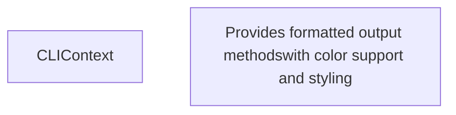
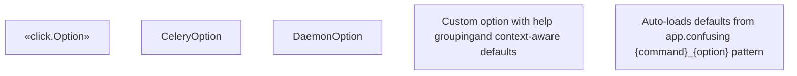
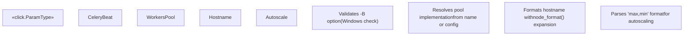
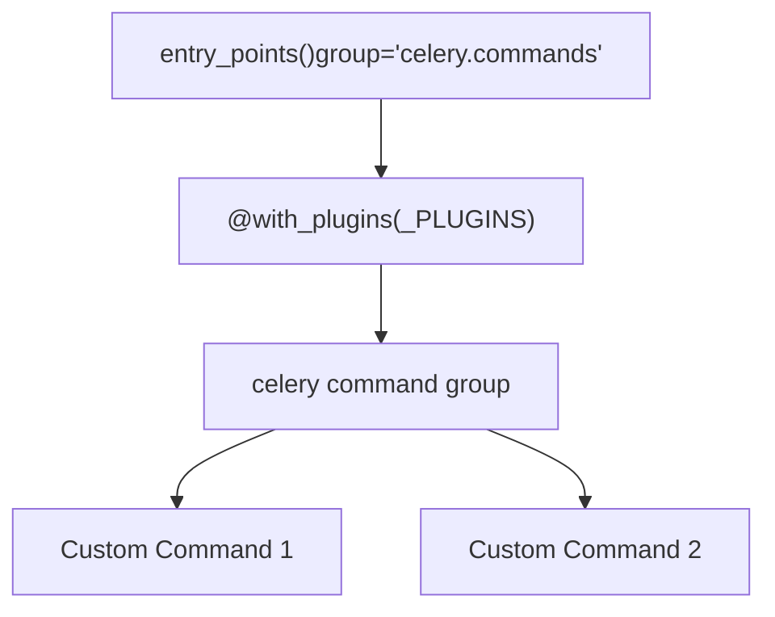
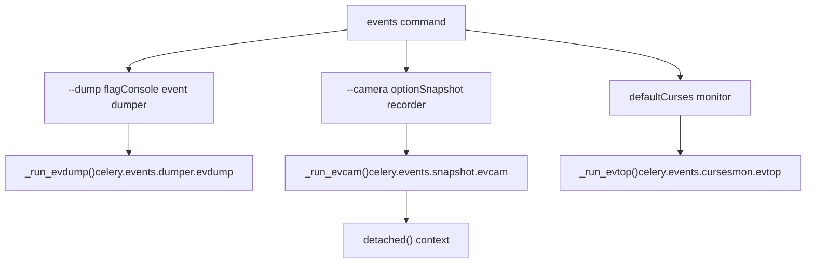

# 命令行界面 (Command Line Interface)

相关源文件

-   [celery/bin/base.py](https://github.com/celery/celery/blob/4d068b56/celery/bin/base.py)
-   [celery/bin/beat.py](https://github.com/celery/celery/blob/4d068b56/celery/bin/beat.py)
-   [celery/bin/celery.py](https://github.com/celery/celery/blob/4d068b56/celery/bin/celery.py)
-   [celery/bin/events.py](https://github.com/celery/celery/blob/4d068b56/celery/bin/events.py)
-   [celery/bin/worker.py](https://github.com/celery/celery/blob/4d068b56/celery/bin/worker.py)
-   [celery/events/snapshot.py](https://github.com/celery/celery/blob/4d068b56/celery/events/snapshot.py)

命令行界面 (CLI) 是从命令行管理 Celery 工作者、调度器和集群的主要手段。CLI 使用 Click 框架实现，并针对 Celery 的特定需求进行了广泛定制，例如应用加载、配置管理和插件扩展性。

有关可以发送给运行中工作者的远程控制命令的信息，请参阅[远程控制命令](/celery/celery/8.1-remote-control-commands)。有关工作者配置和生命周期的详细信息，请参阅[工作者架构与 Bootsteps](/celery/celery/5.1-worker-architecture-and-bootsteps)。

## 目的与范围

本页面记录了 Celery CLI 系统的技术架构，包括：

-   使用 Click 框架的命令结构和层次
-   应用程序加载与配置机制
-   自定义 Click 组件 (`CeleryCommand`, `CeleryOption`, `CLIContext`)
-   全局选项与环境变量处理
-   用于扩展自定义命令的 CLI 插件系统
-   守护进程命令（worker, beat）的常用模式

## CLI 入口点与命令结构

主要的 CLI 入口点是在 [celery/bin/celery.py55-164](https://github.com/celery/celery/blob/4d068b56/celery/bin/celery.py#L55-L164) 中定义的 `celery` 命令组，它作为所有 Celery 操作的伞形命令。

### 命令层次结构

```mermaid
flowchart TD
    Main["celery(main command group)"]
    Worker["workerStart worker instance"]
    Beat["beatStart periodic scheduler"]
    Events["eventsEvent monitoring"]
    Control["controlRemote control broadcast"]
    Inspect["inspectQuery worker state"]
    Status["statusShow cluster status"]
    Purge["purgeDelete messages"]
    Result["resultQuery task result"]
    List["listShow registered tasks"]
    Call["callExecute task"]
    Migrate["migrateMigrate messages"]
    Graph["graphGraph workflows"]
    Shell["shellInteractive shell"]
    Multi["multiManage multiple workers"]
    Report["reportBug report info"]
    Upgrade["upgradeUpgrade settings"]
    Amqp["amqpAMQP admin"]
    Logtool["logtoolLog analysis"]

    Main --> Worker
    Main --> Beat
    Main --> Events
    Main --> Control
    Main --> Inspect
    Main --> Status
    Main --> Purge
    Main --> Result
    Main --> List
    Main --> Call
    Main --> Migrate
    Main --> Graph
    Main --> Shell
    Main --> Multi
    Main --> Report
    Main --> Upgrade
    Main --> Amqp
    Main --> Logtool
```


**来源：** [celery/bin/celery.py55-191](https://github.com/celery/celery/blob/4d068b56/celery/bin/celery.py#L55-L191)

### 主命令实现

`celery` 命令组使用 `@with_plugins(_PLUGINS)` 装饰以启用插件发现，并使用 `@click.group(cls=DYMGroup)` 以便在输入错误命令时提供“您是指 (did you mean)”的建议。

> **[Mermaid sequence]**
> *(图表结构无法解析)*

**来源：** [celery/bin/celery.py113-164](https://github.com/celery/celery/blob/4d068b56/celery/bin/celery.py#L113-L164)

## 全局选项

主 `celery` 命令接受多个全局选项，这些选项会影响所有子命令的应用加载和行为。

| 选项 | 环境变量 | 类型 | 描述 |
| --- | --- | --- | --- |
| `-A`, `--app` | `APP` | str/Celery | 应用程序实例或导入路径 |
| `-b`, `--broker` | `BROKER_URL` | str | 代理连接 URL |
| `--result-backend` | `RESULT_BACKEND` | str | 结果后端 URL |
| `--loader` | `LOADER` | str | 要使用的加载器类 |
| `--config` | `CONFIG_MODULE` | str | 配置模块路径 |
| `--workdir` | \- | Path | 更改工作目录 |
| `-C`, `--no-color` | `NO_COLOR` | flag | 禁用彩色输出 |
| `-q`, `--quiet` | \- | flag | 抑制信息性输出 |
| `--version` | \- | flag | 显示版本并退出 |
| `--skip-checks` | `SKIP_CHECKS` | flag | 跳过 Django 核心检查 |

**来源：** [celery/bin/celery.py57-112](https://github.com/celery/celery/blob/4d068b56/celery/bin/celery.py#L57-L112)

### 应用程序加载

CLI 支持多种指定 Celery 应用程序的方式：

1.  **导入路径字符串**：`celery -A myapp.celery worker`
2.  **Celery 对象**：当通过程序化方式调用时
3.  **默认应用**：如果未指定，则回退到 `get_current_app()`

`find_app()` 函数 [celery/bin/celery.py137](https://github.com/celery/celery/blob/4d068b56/celery/bin/celery.py#L137-L137) 处理模块解析，并针对模块缺失、属性缺失和常规异常提供了全面的错误处理 [celery/bin/celery.py136-152](https://github.com/celery/celery/blob/4d068b56/celery/bin/celery.py#L136-L152)。

**来源：** [celery/bin/celery.py135-156](https://github.com/celery/celery/blob/4d068b56/celery/bin/celery.py#L135-L156) [celery/app/utils.py](https://github.com/celery/celery/blob/4d068b56/celery/app/utils.py)

## CLIContext 与上下文管理

`CLIContext` 类提供了一个上下文对象，该对象通过 Click 的上下文系统传递给所有子命令。


上下文对象在 [celery/bin/celery.py154-155](https://github.com/celery/celery/blob/4d068b56/celery/bin/celery.py#L154-L155) 中创建，并通过 `@click.pass_context` 装饰器被子命令访问：

```python
@click.pass_context
def worker(ctx, ...):
    app = ctx.obj.app
    ctx.obj.echo("Starting worker...")
```
**来源：** [celery/bin/base.py34-118](https://github.com/celery/celery/blob/4d068b56/celery/bin/base.py#L34-L118)

## 自定义 Click 组件

Celery 扩展了 Click 的自定义类，以支持应用程序特定的需求。

### CeleryOption

`CeleryOption` 扩展了 `click.Option`，支持：

-   **帮助分组**：可以使用 `help_group` 参数在帮助输出中对选项进行分组。
-   **来自上下文的默认值**：`default_value_from_context` 从 `CLIContext` 获取默认值。


**来源：** [celery/bin/base.py140-153](https://github.com/celery/celery/blob/4d068b56/celery/bin/base.py#L140-L153) [celery/bin/base.py174-189](https://github.com/celery/celery/blob/4d068b56/celery/bin/base.py#L174-L189)

### CeleryCommand 与 CeleryDaemonCommand

`CeleryCommand` 定制了帮助文档的格式化，以便按组显示选项 [celery/bin/base.py155-171](https://github.com/celery/celery/blob/4d068b56/celery/bin/base.py#L155-L171)。

`CeleryDaemonCommand` 扩展了 `CeleryCommand`，包含了常见的守护进程选项 [celery/bin/base.py191-204](https://github.com/celery/celery/blob/4d068b56/celery/bin/base.py#L191-L204)：

-   `--logfile` / `-f`：日志输出目标
-   `--pidfile`：PID 文件路径
-   `--uid`：用于放弃特权的用户 ID
-   `--gid`：用于放弃特权的组 ID
-   `--umask`：文件创建掩码
-   `--executable`：覆盖 Python 可执行文件

**来源：** [celery/bin/base.py155-204](https://github.com/celery/celery/blob/4d068b56/celery/bin/base.py#L155-L204)

### 自定义参数类型

Celery 定义了几个用于验证和转换的自定义 Click 参数类型：

| 类型 | 类 | 目的 |
| --- | --- | --- |
| `COMMA_SEPARATED_LIST` | `CommaSeparatedList` | 将逗号分隔的值解析为列表 |
| `JSON_ARRAY` | `JsonArray` | 解析并验证 JSON 数组 |
| `JSON_OBJECT` | `JsonObject` | 解析并验证 JSON 对象 |
| `ISO8601` | `ISO8601DateTime` | 解析 ISO 8601 datetime 字符串 |
| `ISO8601_OR_FLOAT` | `ISO8601DateTimeOrFloat` | 解析 datetime 或浮点值 |
| `LOG_LEVEL` | `LogLevel` | 将日志级别名称解析为数值 |

**来源：** [celery/bin/base.py207-306](https://github.com/celery/celery/blob/4d068b56/celery/bin/base.py#L207-L306)

### 工作者特定参数类型

worker 命令定义了额外的自定义类型：


**来源：** [celery/bin/worker.py22-98](https://github.com/celery/celery/blob/4d068b56/celery/bin/worker.py#L22-L98)

## 插件系统

CLI 通过 setuptools 入口点支持扩展性。插件从 `celery.commands` 入口点组中加载。


插件发现机制 [celery/bin/celery.py46-52](https://github.com/celery/celery/blob/4d068b56/celery/bin/celery.py#L46-L52) 处理不同的 Python 版本：

-   Python 3.10+：`entry_points(group='celery.commands')`
-   Python <3.10：`entry_points().get('celery.commands', [])` 或 `.select(group='celery.commands')`

**来源：** [celery/bin/celery.py46-55](https://github.com/celery/celery/blob/4d068b56/celery/bin/celery.py#L46-L55)

### 用户选项 (User Options)

应用程序可以使用 `user_options` 字典向 CLI 命令扩展自定义选项：

```python
app = Celery('myapp')
app.user_options['worker'].update([
    click.Option(['--custom-option'], help='Custom worker option')
])
app.user_options['preload'].update([
    click.Option(['--preload-option'], help='Global preload option')
])
```
用户选项在 [celery/bin/celery.py157-163](https://github.com/celery/celery/blob/4d068b56/celery/bin/celery.py#L157-L163) 中应用于命令：

-   `worker.params.extend(app.user_options.get('worker', []))`
-   `beat.params.extend(app.user_options.get('beat', []))`
-   `events.params.extend(app.user_options.get('events', []))`
-   所有命令都获取 `preload` 选项

`handle_preload_options` 装饰器 [celery/bin/base.py120-137](https://github.com/celery/celery/blob/4d068b56/celery/bin/base.py#L120-L137) 提取预加载（preload）选项并发送 `user_preload_options` 信号。

**来源：** [celery/bin/celery.py157-164](https://github.com/celery/celery/blob/4d068b56/celery/bin/celery.py#L157-L164) [celery/bin/base.py120-137](https://github.com/celery/celery/blob/4d068b56/celery/bin/base.py#L120-L137)

## Worker 命令

`worker` 命令启动一个工作者实例，并提供按逻辑分组组织的广泛配置选项。

### Worker 命令结构

```mermaid
flowchart TD
    WorkerCmd["worker command"]
    Hostname["--hostname / -nCustom hostname"]
    Detach["--detach / -DDaemonize"]
    StateDB["--statedb / -SState database path"]
    LogLevel["--loglevel / -lLogging level"]
    Optimization["--optimization / -OOptimization profile"]
    PrefetchMult["--prefetch-multiplierPrefetch multiplier"]
    DisablePrefetch["--disable-prefetchDisable prefetching"]
    Concurrency["--concurrency / -cWorker processes"]
    Pool["--pool / -PPool implementation"]
    Events["--task-events / -ESend events"]
    TimeLimit["--time-limitHard time limit"]
    SoftTimeLimit["--soft-time-limitSoft time limit"]
    MaxTasks["--max-tasks-per-childTask limit per worker"]
    MaxMemory["--max-memory-per-childMemory limit per worker"]
    Purge["--purge / --discardClear queues"]
    Queues["--queues / -QConsume from queues"]
    Exclude["--exclude-queues / -XExclude queues"]
    Include["--include / -IImport modules"]
    Gossip["--without-gossipDisable gossip"]
    Mingle["--without-mingleDisable mingle"]
    Heartbeat["--without-heartbeatDisable heartbeat"]
    HeartbeatInt["--heartbeat-intervalHeartbeat interval"]
    Autoscale["--autoscaleAutoscale workers"]
    Beat["--beat / -BEmbed beat scheduler"]
    Schedule["--schedule-filename / -sSchedule database"]
    Scheduler["--schedulerScheduler class"]

    WorkerCmd --> Hostname
    WorkerCmd --> Detach
    WorkerCmd --> Concurrency
    WorkerCmd --> Pool
    WorkerCmd --> Queues
    WorkerCmd --> Gossip
    WorkerCmd --> Beat
```


**来源：** [celery/bin/worker.py136-304](https://github.com/celery/celery/blob/4d068b56/celery/bin/worker.py#L136-L304)

### Worker 离线模式 (Detach Mode)

当使用 `--detach` 标志时，工作者会派生为一个后台守护进程。离线逻辑如下 [celery/bin/worker.py336-356](https://github.com/celery/celery/blob/4d068b56/celery/bin/worker.py#L336-L356)：

1.  重建命令行参数，移除与离线相关的选项。
2.  调用 `detach()` 函数 [celery/bin/worker.py108-133](https://github.com/celery/celery/blob/4d068b56/celery/bin/worker.py#L108-L133)。
3.  使用 `os.execv()` 用新的工作者实例替换进程。
4.  如果不进行离线处理，则通过 `maybe_drop_privileges()` 处理权限放弃。

**来源：** [celery/bin/worker.py108-133](https://github.com/celery/celery/blob/4d068b56/celery/bin/worker.py#L108-L133) [celery/bin/worker.py336-371](https://github.com/celery/celery/blob/4d068b56/celery/bin/worker.py#L336-L371)

### Worker 执行流程

> **[Mermaid sequence]**
> *(图表结构无法解析)*

**来源：** [celery/bin/worker.py306-371](https://github.com/celery/celery/blob/4d068b56/celery/bin/worker.py#L306-L371)

## Beat 命令

`beat` 命令启动周期性任务调度器，支持离线守护进程模式。

### Beat 命令选项

| 选项组 | 选项 |
| --- | --- |
| **Beat 选项** | `--detach`：作为守护进程运行
`--schedule / -s`：调度数据库路径
`--scheduler / -S`：调度器类
`--max-interval`：两次迭代之间的最大休眠时间
`--loglevel / -l`：日志级别 |
| **守护进程化** | `--logfile / -f`：日志输出目标
`--pidfile`：PID 文件路径
`--uid`：用户 ID
`--gid`：组 ID
`--umask`：文件创建掩码
`--executable`：Python 可执行文件路径 |

**来源：** [celery/bin/beat.py10-45](https://github.com/celery/celery/blob/4d068b56/celery/bin/beat.py#L10-L45)

### Beat 执行

beat 命令使用配置的选项创建一个部分 `app.Beat` 对象，并直接运行它或在离线上下文中运行它 [celery/bin/beat.py61-72](https://github.com/celery/celery/blob/4d068b56/celery/bin/beat.py#L61-L72)：

```python
beat = partial(app.Beat, logfile=logfile, pidfile=pidfile,
               quiet=ctx.obj.quiet, **kwargs)

if detach:
    with detached(logfile, pidfile, uid, gid, umask, workdir):
        return beat().run()
else:
    return beat().run()
```
**来源：** [celery/bin/beat.py47-72](https://github.com/celery/celery/blob/4d068b56/celery/bin/beat.py#L47-L72)

## Events 命令

`events` 命令提供事件监控实用程序，具有三种模式：dump（转储）、snapshot camera（快照照相机）和 top（curses 监控器）。

### Events 命令模式


**来源：** [celery/bin/events.py82-94](https://github.com/celery/celery/blob/4d068b56/celery/bin/events.py#L82-L94)

### Events 命令选项

| 选项 | 组 | 描述 |
| --- | --- | --- |
| `--dump / -d` | Dumper | 在控制台打印事件 |
| `--camera / -c` | Snapshot | 快照照相机类 |
| `--detach / -d` | Snapshot | 将照相机作为守护进程启动 |
| `--frequency / -F` | Snapshot | 快照频率（秒） |
| `--maxrate / -r` | Snapshot | 最大快照速率 |
| `--loglevel / -l` | Snapshot | 日志级别 |

快照照相机功能在 [celery/events/snapshot.py24-111](https://github.com/celery/celery/blob/4d068b56/celery/events/snapshot.py#L24-L111) 中实现，使用了 `Polaroid` 类和 `evcam()` 函数。

**来源：** [celery/bin/events.py50-82](https://github.com/celery/celery/blob/4d068b56/celery/bin/events.py#L50-L82) [celery/events/snapshot.py86-111](https://github.com/celery/celery/blob/4d068b56/celery/events/snapshot.py#L86-L111)

## 通过命令行进行配置

worker 和 beat 命令都支持在命令之后通过额外参数传递附加配置：

```bash
celery -A myapp worker -- worker_prefetch_multiplier=1 worker_max_tasks_per_child=100
```
`app.config_from_cmdline()` 方法 [celery/bin/worker.py330](https://github.com/celery/celery/blob/4d068b56/celery/bin/worker.py#L330-L330) 和 [celery/bin/beat.py54](https://github.com/celery/celery/blob/4d068b56/celery/bin/beat.py#L54-L54) 会解析这些参数并将其应用于应用程序配置。命名空间参数（'worker'）会作为配置键的前缀。

**来源：** [celery/bin/worker.py328-335](https://github.com/celery/celery/blob/4d068b56/celery/bin/worker.py#L328-L335) [celery/bin/beat.py52-59](https://github.com/celery/celery/blob/4d068b56/celery/bin/beat.py#L52-L59)

## 错误处理与用户体验

### 应用加载错误消息

CLI 为应用加载失败提供了详细的错误消息，并带有彩色输出：

-   `UNABLE_TO_LOAD_APP_MODULE_NOT_FOUND`：未找到模块 [celery/bin/celery.py32-34](https://github.com/celery/celery/blob/4d068b56/celery/bin/celery.py#L32-L34)
-   `UNABLE_TO_LOAD_APP_ERROR_OCCURRED`：导入期间发生异常 [celery/bin/celery.py36-39](https://github.com/celery/celery/blob/4d068b56/celery/bin/celery.py#L36-L39)
-   `UNABLE_TO_LOAD_APP_APP_MISSING`：缺少 app 属性 [celery/bin/celery.py41-43](https://github.com/celery/celery/blob/4d068b56/celery/bin/celery.py#L41-L43)

**来源：** [celery/bin/celery.py32-152](https://github.com/celery/celery/blob/4d068b56/celery/bin/celery.py#L32-L152)

### 选项位置验证

CLI 强制要求像 `-A`/`--app` 这样的全局选项必须在子命令之前指定，而不是在其之后。一个猴子补丁（monkey-patched）后的 `NoSuchOption.show()` 方法 [celery/bin/celery.py206-217](https://github.com/celery/celery/blob/4d068b56/celery/bin/celery.py#L206-L217) 会提供一条有用的错误消息来解释正确的用法：

```
You are using `-A` as an option of the worker sub-command:
celery worker -A celeryapp <...>

The support for this usage was removed in Celery 5.0. Instead you should use `-A` as a global option:
celery -A celeryapp worker <...>
```
**来源：** [celery/bin/celery.py193-217](https://github.com/celery/celery/blob/4d068b56/celery/bin/celery.py#L193-L217)

### 进程标题与状态

命令会设置有意义的进程标题，以便于识别进程。`_set_process_status()` 助手函数 [celery/bin/events.py11-14](https://github.com/celery/celery/blob/4d068b56/celery/bin/events.py#L11-L14) 会将诸如 `celery events:dump` 之类的进程标题与命令行参数进行格式化。

**来源：** [celery/bin/events.py11-20](https://github.com/celery/celery/blob/4d068b56/celery/bin/events.py#L11-L20)

## 命令注册

所有命令都使用 `celery.add_command()` 注册到主 `celery` 组中 [celery/bin/celery.py175-191](https://github.com/celery/celery/blob/4d068b56/celery/bin/celery.py#L175-L191)：

```python
celery.add_command(purge)
celery.add_command(call)
celery.add_command(beat)
celery.add_command(list_)
celery.add_command(result)
# ... 还有另外 11 个命令
```
每个命令都在 `celery/bin/` 下的各自模块中实现，并在 `celery.py` 顶部导入。

**来源：** [celery/bin/celery.py15-30](https://github.com/celery/celery/blob/4d068b56/celery/bin/celery.py#L15-L30) [celery/bin/celery.py175-191](https://github.com/celery/celery/blob/4d068b56/celery/bin/celery.py#L175-L191)
