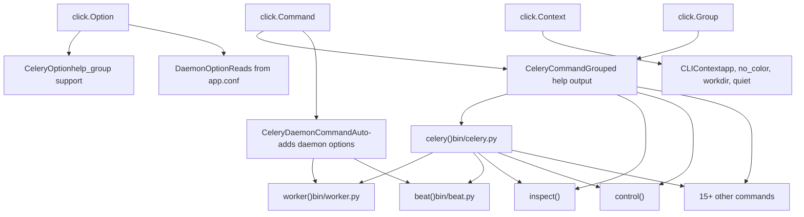
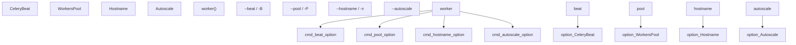
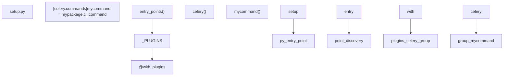

# CLI 架构 (CLI Architecture)

相关源文件

-   [celery/bin/base.py](https://github.com/celery/celery/blob/4d068b56/celery/bin/base.py)
-   [celery/bin/beat.py](https://github.com/celery/celery/blob/4d068b56/celery/bin/beat.py)
-   [celery/bin/celery.py](https://github.com/celery/celery/blob/4d068b56/celery/bin/celery.py)
-   [celery/bin/events.py](https://github.com/celery/celery/blob/4d068b56/celery/bin/events.py)
-   [celery/bin/worker.py](https://github.com/celery/celery/blob/4d068b56/celery/bin/worker.py)
-   [celery/events/snapshot.py](https://github.com/celery/celery/blob/4d068b56/celery/events/snapshot.py)

## 目的与范围

本页面记录了 Celery 命令行界面 (CLI) 的架构。该界面构建在 Click 框架之上，提供了一个用于管理 Celery 操作的可扩展系统。它涵盖了自定义 Click 组件、应用加载机制、插件系统以及命令如何组织和注册。

有关具体命令实现的信息，请参阅：

-   工作者 (Worker) 和 Beat 守护进程命令：[9.2](/celery/celery/9.2-worker-and-beat-commands)
-   管理命令（inspect, control, purge 等）：[9.3](/celery/celery/9.3-management-commands)
-   多工作者管理：[9.4](/celery/celery/9.4-multi-worker-management)

## CLI 框架概览

Celery 的 CLI 构建在 Click 框架之上，并通过自定义组件进行了扩展，以支持分组帮助输出、守护进程选项、应用上下文管理以及用于第三方扩展的插件架构。


**来源：** [celery/bin/base.py1-307](https://github.com/celery/celery/blob/4d068b56/celery/bin/base.py#L1-L307) [celery/bin/celery.py1-228](https://github.com/celery/celery/blob/4d068b56/celery/bin/celery.py#L1-L228)

## CLI 入口点与命令发现

主 CLI 入口点是 `celery` 组函数，它使用 Click 的插件系统从入口点（entry points）发现并注册命令。

### 入口点结构

```mermaid
flowchart TD
    main["main()"]
    celery_group["celery()"]
    plugins["@with_plugins(_PLUGINS)"]
    entry_points["entry_points()"]
    third_party["Third-party Extensions"]
    worker["worker()"]
    beat["beat()"]
    events["events()"]
    inspect["inspect()"]
    control["control()"]
    purge["purge()"]
    others["10+ more"]

    main --> celery_group
    plugins --> celery_group
    entry --> points_plugins
    third --> party_entry_points
    celery --> group_worker
    celery --> group_beat
    celery --> group_events
    celery --> group_inspect
    celery --> group_control
    celery --> group_purge
    celery --> group_others
```


**入口点发现代码：**

CLI 使用 Python 的 entry points 机制发现插件，并进行了版本特定的处理：

```python
Python >= 3.10:
  _PLUGINS = entry_points(group='celery.commands')

Python < 3.10:
  _PLUGINS = entry_points().get('celery.commands', [])
  或者
  _PLUGINS = entry_points().select(group='celery.commands')
```
[celery/bin/celery.py46-53](https://github.com/celery/celery/blob/4d068b56/celery/bin/celery.py#L46-L53)

**主入口点：**

`main()` 函数作为包入口点，并启用了环境变量的自动前缀：

[celery/bin/celery.py220-227](https://github.com/celery/celery/blob/4d068b56/celery/bin/celery.py#L220-L227)

**来源：** [celery/bin/celery.py46-53](https://github.com/celery/celery/blob/4d068b56/celery/bin/celery.py#L46-L53) [celery/bin/celery.py220-227](https://github.com/celery/celery/blob/4d068b56/celery/bin/celery.py#L220-L227)

## 自定义 Click 组件

Celery 扩展了 Click，具有四个提供专门功能的自定义组件类。

### 组件层次结构

| 组件 | 基类 | 目的 | 关键特性 |
| --- | --- | --- | --- |
| `CeleryOption` | `click.Option` | 增强版选项，支持帮助分组 | `help_group`, `default_value_from_context` |
| `CeleryCommand` | `click.Command` | 带有分组帮助输出的命令 | 按 `help_group` 组织选项 |
| `DaemonOption` | `CeleryOption` | 守护进程专用选项 | 从 `app.conf.{command}_{option}` 读取默认值 |
| `CeleryDaemonCommand` | `click.Command` | 带有自动选项的守护进程命令 | 自动添加 logfile, pidfile, uid, gid, umask, executable |

### CeleryOption

扩展了 `click.Option` 以支持帮助分组和基于上下文的默认值：

[celery/bin/base.py140-152](https://github.com/celery/celery/blob/4d068b56/celery/bin/base.py#L140-L152)

**关键特性：**

-   `help_group`：在帮助输出中对相关选项进行分组（例如，“Worker 选项”、“池选项”）。
-   `default_value_from_context`：从 `ctx.obj` 字典中检索默认值。

### CeleryCommand

覆盖了帮助文档的格式化，以显示按 `help_group` 分组的选项：

[celery/bin/base.py155-171](https://github.com/celery/celery/blob/4d068b56/celery/bin/base.py#L155-L171)

**帮助组织：**

-   带有 `help_group` 的选项被归类在该标题下。
-   不带 `help_group` 的选项属于“选项 (Options)”。
-   使用 `OrderedDict` 维护分组顺序。

### DaemonOption

从应用程序配置中读取默认值的专门选项：

[celery/bin/base.py174-188](https://github.com/celery/celery/blob/4d068b56/celery/bin/base.py#L174-L188)

**配置查找模式：**

```
针对命令：worker
针对选项：--pidfile
从以下读取：app.conf.worker_pidfile

针对命令：beat
针对选项：--logfile
从以下读取：app.conf.beat_logfile
```
### CeleryDaemonCommand

自动向命令添加通用的守护进程选项：

[celery/bin/base.py191-204](https://github.com/celery/celery/blob/4d068b56/celery/bin/base.py#L191-L204)

**自动添加的选项：**

-   `--logfile` / `-f`：日志输出目标
-   `--pidfile`：PID 文件路径
-   `--uid`：权限放弃的用户 ID
-   `--gid`：权限放弃的组 ID
-   `--umask`：文件创建掩码
-   `--executable`：Python 可执行文件覆盖

所有选项都会添加到“守护进程化选项 (Daemonization Options)”帮助组中。

**来源：** [celery/bin/base.py140-204](https://github.com/celery/celery/blob/4d068b56/celery/bin/base.py#L140-L204)

## 上下文管理 (Context Management)

CLI 使用自定义上下文对象 (`CLIContext`) 在命令链中传递应用状态和配置。

### CLIContext 结构

```mermaid
flowchart TD
    CLIContext["CLIContext"]
    app["app: Celery"]
    no_color["no_color: bool"]
    workdir["workdir: Path"]
    quiet["quiet: bool"]
    OK["OK"]
    ERROR["ERROR"]
    style_method["style()"]
    secho["secho()"]
    echo["echo()"]
    error["error()"]
    pretty["pretty()"]
    pretty_list["pretty_list()"]
    pretty_dict_ok_error["pretty_dict_ok_error()"]
    say_chat["say_chat()"]

    CLIContext --> app
    CLIContext --> no_color
    CLIContext --> workdir
    CLIContext --> quiet
    CLIContext --> OK
    CLIContext --> ERROR
    CLIContext --> style_method
    CLIContext --> secho
    CLIContext --> echo
    CLIContext --> error
    CLIContext --> pretty
    CLIContext --> pretty_list
    CLIContext --> pretty_dict_ok_error
    CLIContext --> say_chat
```


**上下文创建：**

主 `celery` 组创建上下文并将其存储在 `ctx.obj` 中：

[celery/bin/celery.py154-155](https://github.com/celery/celery/blob/4d068b56/celery/bin/celery.py#L154-L155)

**上下文使用模式：**

命令通过 `@click.pass_context` 装饰器访问上下文：

```python
@click.pass_context
def worker(ctx, **kwargs):
    app = ctx.obj.app           # 访问应用程序
    ctx.obj.echo("启动中...")    # 使用输出方法
```
**美化打印 (Pretty Printing)：**

上下文包含用于命令输出的复杂美化打印功能：

[celery/bin/base.py80-109](https://github.com/celery/celery/blob/4d068b56/celery/bin/base.py#L80-L109)

支持：

-   列表：项目符号格式。
-   带有 `ok`/`error` 键的字典：基于状态的格式化。
-   JSON 对象：语法高亮（如果 pygments 可用）。
-   其他对象：`pformat()` 回退方案。

**来源：** [celery/bin/base.py34-117](https://github.com/celery/celery/blob/4d068b56/celery/bin/base.py#L34-L117) [celery/bin/celery.py154-155](https://github.com/celery/celery/blob/4d068b56/celery/bin/celery.py#L154-L155)

## 应用程序加载与全局选项

主 `celery` 组定义了适用于所有子命令的全局选项，并处理应用程序加载。

### 全局选项

| 选项 | 环境变量 | 目的 | 类型 |
| --- | --- | --- | --- |
| `-A`, `--app` | `APP` | 应用程序模块路径 | `UNPROCESSED` |
| `-b`, `--broker` | `BROKER_URL` | 代理 URL | 字符串 |
| `--result-backend` | `RESULT_BACKEND` | 结果后端 URL | 字符串 |
| `--loader` | `LOADER` | 加载器类 | 字符串 |
| `--config` | `CONFIG_MODULE` | 配置模块 | 字符串 |
| `--workdir` | - | 工作目录 | 路径 |
| `-C`, `--no-color` | `NO_COLOR` | 禁用彩色 | 标志 |
| `-q`, `--quiet` | - | 静默模式 | 标志 |
| `--version` | - | 显示版本 | 标志 |
| `--skip-checks` | `SKIP_CHECKS` | 跳过 Django 检查 | 标志 |

[celery/bin/celery.py57-111](https://github.com/celery/celery/blob/4d068b56/celery/bin/celery.py#L57-L111)

### 应用程序加载流

> **[Mermaid sequence]**
> *(图表结构无法解析)*

**应用程序加载代码：**

[celery/bin/celery.py135-152](https://github.com/celery/celery/blob/4d068b56/celery/bin/celery.py#L135-L152)

**用户选项扩展：**

加载应用程序后，CLI 会使用应用程序定义的用户选项扩展命令参数：

[celery/bin/celery.py158-163](https://github.com/celery/celery/blob/4d068b56/celery/bin/celery.py#L158-L163)

这允许应用程序向特定命令注入自定义选项。

**来源：** [celery/bin/celery.py57-163](https://github.com/celery/celery/blob/4d068b56/celery/bin/celery.py#L57-L163)

## 命令注册

命令使用 `add_command()` 方法注册到主 `celery` 组。

### 内置命令注册

**命令注册代码：**

[celery/bin/celery.py166-191](https://github.com/celery/celery/blob/4d068b56/celery/bin/celery.py#L166-L191)

**内联命令示例：**

`report` 命令是内联定义的，而不是在单独的模块中：

[celery/bin/celery.py166-172](https://github.com/celery/celery/blob/4d068b56/celery/bin/celery.py#L166-L172)

**来源：** [celery/bin/celery.py166-191](https://github.com/celery/celery/blob/4d068b56/celery/bin/celery.py#L166-L191)

## 自定义参数类型

Celery 定义了自定义 Click 参数类型，用于专门的解析和验证。

### 参数类型目录

| 类型 | 类 | 目的 | 示例 |
| --- | --- | --- | --- |
| `COMMA_SEPARATED_LIST` | `CommaSeparatedList` | 解析逗号分隔的值 | `"queue1,queue2,queue3"` |
| `JSON_ARRAY` | `JsonArray` | 解析 JSON 数组字符串 | `'["a", "b", "c"]'` |
| `JSON_OBJECT` | `JsonObject` | 解析 JSON 对象字符串 | `'{"key": "value"}'` |
| `ISO8601` | `ISO8601DateTime` | 解析 ISO 8601 datetime | `"2024-01-01T12:00:00"` |
| `ISO8601_OR_FLOAT` | `ISO8601DateTimeOrFloat` | 解析 ISO 8601 或浮点数 | `"2024-01-01T12:00:00"` 或 `3600.5` |
| `LOG_LEVEL` | `LogLevel` | 解析日志级别名称 | `"DEBUG"`, `"INFO"`, `"WARNING"` |

### CommaSeparatedList

将逗号分隔的字符串拆分为列表：

[celery/bin/base.py207-213](https://github.com/celery/celery/blob/4d068b56/celery/bin/base.py#L207-L213)

**用法示例：**

```python
@click.option('--queues', '-Q', type=COMMA_SEPARATED_LIST)
```
### JSON 数组与对象

将 JSON 字符串解析为 Python 数据结构：

[celery/bin/base.py216-253](https://github.com/celery/celery/blob/4d068b56/celery/bin/base.py#L216-L253)

验证解析后的值是否为正确的类型（列表或字典）。

### ISO8601 DateTime

使用 `maybe_iso8601()` 解析 ISO 8601 日期/时间字符串：

[celery/bin/base.py256-265](https://github.com/celery/celery/blob/4d068b56/celery/bin/base.py#L256-L265)

### LogLevel

将日志级别名称转换为数值：

[celery/bin/base.py285-298](https://github.com/celery/celery/blob/4d068b56/celery/bin/base.py#L285-L298)

**特性：**

-   直接接受数值。
-   将字符串名称转换为大写。
-   使用 `mlevel()` 获取数值级别。
-   可选值：DEBUG, INFO, WARNING, ERROR, CRITICAL, FATAL。

**来源：** [celery/bin/base.py207-306](https://github.com/celery/celery/blob/4d068b56/celery/bin/base.py#L207-L306)

## Worker 和 Beat 命令架构

守护进程命令（worker, beat, events）遵循一个带有专门参数类型的共同模式。

### Worker 命令参数类型


### CeleryBeat 类型

验证在 Windows 上未使用 `-B` 选项：

[celery/bin/worker.py22-32](https://github.com/celery/celery/blob/4d068b56/celery/bin/worker.py#L22-L32)

### WorkersPool 类型

验证并解析池实现：

[celery/bin/worker.py35-63](https://github.com/celery/celery/blob/4d068b56/celery/bin/worker.py#L35-L63)

**解析逻辑：**

1.  如果值已经是一个池类，则返回它。
2.  通过 Click choices 转换池名称。
3.  如果 CLI 值为 'prefork'，检查 `worker_pool` 配置。
4.  使用 `concurrency.get_implementation()` 获取池类。
5.  如果查找失败，则回退到配置的 `worker_pool`。

### Hostname 类型

使用 `host_format()` 和 `default_nodename()` 格式化主机名：

[celery/bin/worker.py66-72](https://github.com/celery/celery/blob/4d068b56/celery/bin/worker.py#L66-L72)

支持占位符：

-   `%h`：主机名。
-   `%n`：节点名。
-   `%d`：域名。

### Autoscale 类型

将自动伸缩参数解析为 `"max,min"` 或单个值：

[celery/bin/worker.py75-97](https://github.com/celery/celery/blob/4d068b56/celery/bin/worker.py#L75-L97)

**解析规则：**

-   单个值：`"10"` → `(10, 0)`。
-   两个值：`"10,3"` → `(10, 3)`（最大值，最小值）。
-   值会被排序，最大值在前。

**来源：** [celery/bin/worker.py22-97](https://github.com/celery/celery/blob/4d068b56/celery/bin/worker.py#L22-L97)

## 错误处理与用户体验

CLI 包含了复杂的错误处理，以引导用户正确使用。

### 应用加载错误

针对不同的失败模式有三种不同的错误消息：

| 错误类型 | 消息模板 | 触发条件 |
| --- | --- | --- |
| 未找到模块 | `UNABLE_TO_LOAD_APP_MODULE_NOT_FOUND` | `ModuleNotFoundError` |
| 属性错误 | `UNABLE_TO_LOAD_APP_APP_MISSING` | `AttributeError` |
| 其他错误 | `UNABLE_TO_LOAD_APP_ERROR_OCCURRED` | 任何其他异常 |

[celery/bin/celery.py32-43](https://github.com/celery/celery/blob/4d068b56/celery/bin/celery.py#L32-L43)

### 错误的 App 选项用法

针对将 `-A` 作为子命令选项使用的常见错误，提供了自定义错误处理：

[celery/bin/celery.py197-217](https://github.com/celery/celery/blob/4d068b56/celery/bin/celery.py#L197-L217)

**拦截的模式：**

```bash
# 错误（旧的 Celery 4.x 语法）：
celery worker -A myapp

# 正确（Celery 5.x+）：
celery -A myapp worker
```
CLI 对 `click.exceptions.NoSuchOption.show` 进行了猴子补丁，以检测此模式并显示有用的指导：

[celery/bin/celery.py199-203](https://github.com/celery/celery/blob/4d068b56/celery/bin/celery.py#L199-L203)

### 预加载选项处理

命令可以提取用户定义的预加载选项并触发信号：

[celery/bin/base.py120-137](https://github.com/celery/celery/blob/4d068b56/celery/bin/base.py#L120-L137)

**用法模式：**

```python
@click.pass_context
@handle_preload_options
def worker(ctx, **kwargs):
    # 在函数运行前提取预加载选项并触发信号
    pass
```
`handle_preload_options` 装饰器：

1.  从 `app.user_options` 中提取标记为 'preload' 的选项。
2.  从 kwargs 创建选项值的字典。
3.  携带 app 和 options 触发 `user_preload_options` 信号。

**来源：** [celery/bin/celery.py32-43](https://github.com/celery/celery/blob/4d068b56/celery/bin/celery.py#L32-L43) [celery/bin/celery.py197-217](https://github.com/celery/celery/blob/4d068b56/celery/bin/celery.py#L197-L217) [celery/bin/base.py120-137](https://github.com/celery/celery/blob/4d068b56/celery/bin/base.py#L120-L137)

## 插件系统

CLI 通过 `celery.commands` 组中的 Python 入口点支持第三方扩展。

### 插件发现机制


**第三方包中的插件注册：**

```python
# 第三方 setup.py
setup(
    name='celery-custom-plugin',
    entry_points={
        'celery.commands': [
            'mycommand = mypackage.cli:mycommand',
        ],
    },
)
```
**插件加载：**

[celery/bin/celery.py46-52](https://github.com/celery/celery/blob/4d068b56/celery/bin/celery.py#L46-L52)

来自 `click_plugins` 的 `@with_plugins` 装饰器会自动从入口点发现并注册命令。

**DYMGroup (Did You Mean)：**

主命令组使用来自 `click-didyoumean` 的 `DYMGroup` 对拼写错误提供修正建议：

[celery/bin/celery.py56](https://github.com/celery/celery/blob/4d068b56/celery/bin/celery.py#L56-L56)

示例：

```bash
$ celery wrker
Error: No such command 'wrker'.
Did you mean 'worker'?
```
**来源：** [celery/bin/celery.py46-56](https://github.com/celery/celery/blob/4d068b56/celery/bin/celery.py#L46-L56)

## 通过命令行进行配置

worker 和 beat 命令都支持通过额外参数进行动态配置。

### 额外参数模式 (Extra Arguments Pattern)

命令使用 `context_settings={'allow_extra_args': True}` 来接受额外参数：

[celery/bin/worker.py136-137](https://github.com/celery/celery/blob/4d068b56/celery/bin/worker.py#L136-L137) [celery/bin/beat.py10-11](https://github.com/celery/celery/blob/4d068b56/celery/bin/beat.py#L10-L11)

### 配置解析

额外参数被解析并应用于应用程序配置：

[celery/bin/worker.py329-335](https://github.com/celery/celery/blob/4d068b56/celery/bin/worker.py#L329-L335)

**格式：**

```bash
celery -A myapp worker \
    worker.prefetch_multiplier=4 \
    worker.max_tasks_per_child=1000
```
`app.config_from_cmdline()` 方法：

-   从 `ctx.args` 解析 `key=value` 键值对。
-   支持命名空间前缀（例如，`worker.` → `worker_prefetch_multiplier`）。
-   对无效配置抛出 `KeyError` 或 `ValueError`。

**错误处理：**

[celery/bin/worker.py331-335](https://github.com/celery/celery/blob/4d068b56/celery/bin/worker.py#L331-L335)

无效配置会触发 `click.UsageError` 并显示有用的消息。

**来源：** [celery/bin/worker.py136-137](https://github.com/celery/celery/blob/4d068b56/celery/bin/worker.py#L136-L137) [celery/bin/worker.py329-335](https://github.com/celery/celery/blob/4d068b56/celery/bin/worker.py#L329-L335) [celery/bin/beat.py10-11](https://github.com/celery/celery/blob/4d068b56/celery/bin/beat.py#L10-L11) [celery/bin/beat.py52-59](https://github.com/celery/celery/blob/4d068b56/celery/bin/beat.py#L52-L59)

## 总结

Celery CLI 架构展示了 Click 框架的一次精心设计的扩展：

**关键架构模式：**

1.  **组件扩展**：自定义 `CeleryOption`、`CeleryCommand`、`CeleryDaemonCommand` 类使用 Celery 特有功能扩展了 Click。
2.  **上下文管理**：`CLIContext` 在所有命令之间提供了一致的应用程序访问和输出格式化。
3.  **插件架构**：入口点实现了第三方命令扩展。
4.  **帮助分组**：选项按 `help_group` 组织，提高了可发现性。
5.  **类型系统**：自定义参数类型处理特定领域的解析（池、日志级别、自动伸缩等）。
6.  **守护进程支持**：`CeleryDaemonCommand` 自动添加常见的守护进程选项（pidfile, logfile, uid/gid）。
7.  **错误引导**：有用的错误消息引导用户采用正确的用法模式。
8.  **动态配置**：额外参数支持运行时配置覆盖。

该架构在扩展性（插件、用户选项）与易用性（分组帮助、智能默认值）以及可维护性（类型安全、清晰的组件边界）之间取得了平衡。

**来源：** [celery/bin/celery.py1-228](https://github.com/celery/celery/blob/4d068b56/celery/bin/celery.py#L1-L228) [celery/bin/base.py1-307](https://github.com/celery/celery/blob/4d068b56/celery/bin/base.py#L1-L307) [celery/bin/worker.py1-372](https://github.com/celery/celery/blob/4d068b56/celery/bin/worker.py#L1-L372) [celery/bin/beat.py1-73](https://github.com/celery/celery/blob/4d068b56/celery/bin/beat.py#L1-L73) [celery/bin/events.py1-95](https://github.com/celery/celery/blob/4d068b56/celery/bin/events.py#L1-L95)
