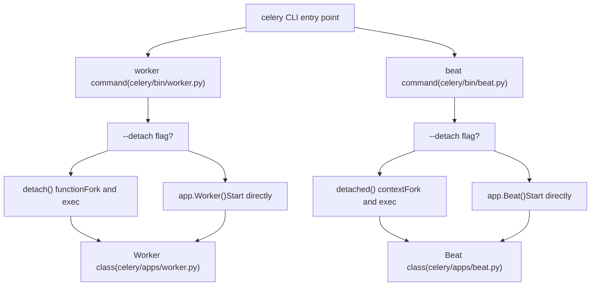
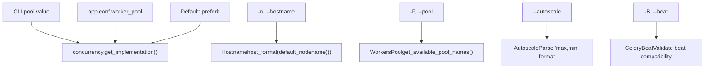
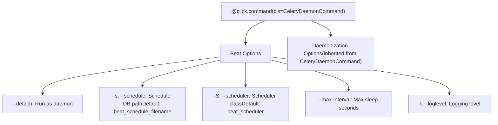
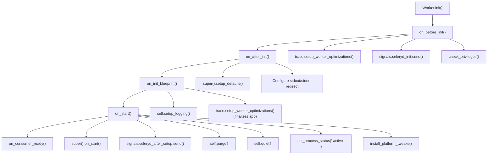
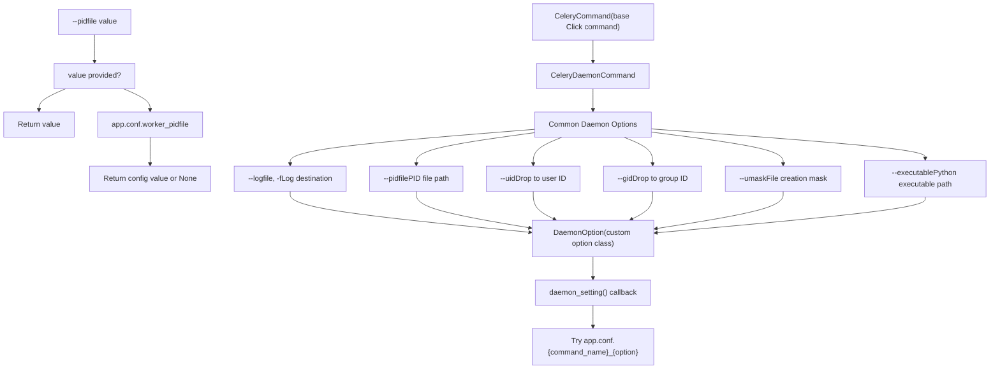
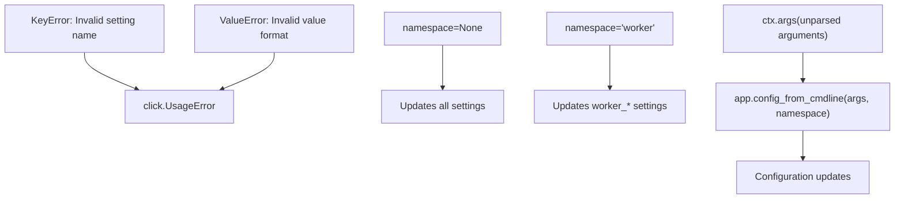

# Worker 和 Beat 命令

相关源文件

-   [celery/apps/beat.py](https://github.com/celery/celery/blob/4d068b56/celery/apps/beat.py)
-   [celery/apps/worker.py](https://github.com/celery/celery/blob/4d068b56/celery/apps/worker.py)
-   [celery/bin/base.py](https://github.com/celery/celery/blob/4d068b56/celery/bin/base.py)
-   [celery/bin/beat.py](https://github.com/celery/celery/blob/4d068b56/celery/bin/beat.py)
-   [celery/bin/celery.py](https://github.com/celery/celery/blob/4d068b56/celery/bin/celery.py)
-   [celery/bin/events.py](https://github.com/celery/celery/blob/4d068b56/celery/bin/events.py)
-   [celery/bin/worker.py](https://github.com/celery/celery/blob/4d068b56/celery/bin/worker.py)
-   [celery/events/snapshot.py](https://github.com/celery/celery/blob/4d068b56/celery/events/snapshot.py)
-   [celery/worker/\_\_init\_\_.py](https://github.com/celery/celery/blob/4d068b56/celery/worker/__init__.py)

## 目的与范围

本页面记录了 `celery worker` 和 `celery beat` CLI 子命令，它们分别用于启动工作者（worker）实例和周期性任务调度器（beat）。这些命令负责命令行选项解析、守护进程化以及长时间运行服务的生命周期管理。

有关通用 CLI 架构和全局选项的信息，请参阅 [CLI 架构](/celery/celery/9.1-cli-architecture)。有关 `inspect`、`control` 和 `purge` 等其他管理子命令的信息，请参阅[管理命令](/celery/celery/9.3-management-commands)。有关同时管理多个工作者实例的信息，请参阅[多工作者管理](/celery/celery/9.4-multi-worker-management)。

---

## 命令概述

`worker` 和 `beat` 命令都继承自 `CeleryDaemonCommand`，后者提供了通用的守护进程化选项。它们支持两种执行模式：

-   **前台模式**：进程连接到终端运行。
-   **离线模式 (Detached mode)**：进程以守护进程方式在后台运行。


**来源**：[celery/bin/worker.py136-372](https://github.com/celery/celery/blob/4d068b56/celery/bin/worker.py#L136-L372) [celery/bin/beat.py10-73](https://github.com/celery/celery/blob/4d068b56/celery/bin/beat.py#L10-L73) [celery/apps/worker.py85-280](https://github.com/celery/celery/blob/4d068b56/celery/apps/worker.py#L85-L280) [celery/apps/beat.py40-161](https://github.com/celery/celery/blob/4d068b56/celery/apps/beat.py#L40-L161)

---

## Worker 命令

worker 命令在 [celery/bin/worker.py136-372](https://github.com/celery/celery/blob/4d068b56/celery/bin/worker.py#L136-L372) 中定义，提供了丰富的配置选项来控制工作者行为。

### 命令定义与选项

worker 命令使用了几个自定义参数类型，并按逻辑选项组进行了组织：

| 选项组 | 用途 |
| --- | --- |
| Worker 选项 | 核心工作者设置（主机名、离线、状态数据库、日志级别、优化） |
| 池 (Pool) 选项 | 并发配置（池类型、并发级别、任务事件、时间限制） |
| 队列选项 | 队列消费（队列、排除队列、包含模块、清除） |
| 特性 (Features) | 高级特性（gossip、mingle、心跳、自动伸缩） |
| 内嵌 Beat 选项 | 可选的内嵌调度器（beat 标志、调度文件、调度器类） |
| 守护进程化选项 | 守护进程设置（日志文件、PID 文件、uid、gid、umask、可执行文件） |

**Worker 选项图表：**


**来源**：[celery/bin/worker.py22-104](https://github.com/celery/celery/blob/4d068b56/celery/bin/worker.py#L22-L104) [celery/bin/worker.py136-305](https://github.com/celery/celery/blob/4d068b56/celery/bin/worker.py#L136-L305)

### 自定义参数类型

四个自定义参数类型处理专门的验证和转换：

**Hostname 类型** ([celery/bin/worker.py66-73](https://github.com/celery/celery/blob/4d068b56/celery/bin/worker.py#L66-L73))：

-   使用 `host_format(default_nodename(value))` 转换主机名字符串。
-   展开模板：`%h` (主机名), `%n` (节点名), `%d` (域名)。
-   示例：`'w1@%h'` 变为 `'w1@myhost.example.com'`。

**WorkersPool 类型** ([celery/bin/worker.py35-64](https://github.com/celery/celery/blob/4d068b56/celery/bin/worker.py#L35-L64))：

-   根据 `concurrency.get_available_pool_names()` 验证池选择。
-   处理池优先级：CLI > `worker_pool` 配置 > 默认值。
-   通过 `concurrency.get_implementation()` 返回池实现类。

**Autoscale 类型** ([celery/bin/worker.py75-98](https://github.com/celery/celery/blob/4d068b56/celery/bin/worker.py#L75-L98))：

-   解析格式：`"max,min"` 或仅 `"max"`（min 默认为 0）。
-   返回反向排序的元组 `(max, min)`。
-   示例：`"10,3"` 变为 `(10, 3)`。

**CeleryBeat 类型** ([celery/bin/worker.py22-33](https://github.com/celery/celery/blob/4d068b56/celery/bin/worker.py#L22-L33))：

-   验证在 Windows 上不使用内嵌 beat（不支持）。
-   如果检测到 Windows，则报错。

**来源**：[celery/bin/worker.py22-104](https://github.com/celery/celery/blob/4d068b56/celery/bin/worker.py#L22-L104)

### Worker 命令执行流

> **[Mermaid sequence]**
> *(图表结构无法解析)*

**来源**：[celery/bin/worker.py307-372](https://github.com/celery/celery/blob/4d068b56/celery/bin/worker.py#L307-L372) [celery/bin/worker.py108-134](https://github.com/celery/celery/blob/4d068b56/celery/bin/worker.py#L108-L134)

### Detach 函数

`detach()` 函数 ([celery/bin/worker.py108-134](https://github.com/celery/celery/blob/4d068b56/celery/bin/worker.py#L108-L134)) 处理守护进程化：

1.  **预格式化日志文件**：在 fork 前使用 `node_format(logfile, hostname)` 展开模板。
2.  **调用 `detached()` 上下文**：来自 `celery.platforms`，处理实际的 fork。
3.  **执行新进程**：使用 `os.execv(path, [path] + argv)` 替换进程。
4.  **错误处理**：设置日志记录，如果 exec 失败则记录关键错误。

可以设置 `C_FAKEFORK` 环境变量以跳过实际的 fork，用于测试。

**来源**：[celery/bin/worker.py108-134](https://github.com/celery/celery/blob/4d068b56/celery/bin/worker.py#L108-L134)

---

## Beat 命令

beat 命令比 worker 简单，专注于调度器配置。

### 命令定义


**来源**：[celery/bin/beat.py10-73](https://github.com/celery/celery/blob/4d068b56/celery/bin/beat.py#L10-L73)

### Beat 命令执行流

beat 命令 ([celery/bin/beat.py47-73](https://github.com/celery/celery/blob/4d068b56/celery/bin/beat.py#L47-L73)) 执行步骤如下：

1.  **解析额外配置**：如果 `ctx.args` 存在，调用 `app.config_from_cmdline(ctx.args)`。
2.  **创建 beat partial 对象**：`beat = partial(app.Beat, logfile=..., pidfile=..., **kwargs)`。
3.  **如果需要则离线运行**：使用 `detached()` 上下文管理器或直接运行。
4.  **运行 beat**：调用 `beat().run()` 启动调度器服务。

**离线 vs 直接执行：**

| 模式 | 权限 | 上下文 | 执行 |
| --- | --- | --- | --- |
| 前台 | 首先调用 `maybe_drop_privileges(uid, gid)` | 直接执行 | `beat().run()` |
| 离线 | 由 `detached()` 上下文处理 | Fork 并守护进程化 | 在上下文内执行 `beat().run()` |

**来源**：[celery/bin/beat.py47-73](https://github.com/celery/celery/blob/4d068b56/celery/bin/beat.py#L47-L73)

---

## 工作者生命周期与信号处理程序

`Worker` 类 ([celery/apps/worker.py85-280](https://github.com/celery/celery/blob/4d068b56/celery/apps/worker.py#L85-L280)) 扩展了 `WorkController`，并通过钩子（hooks）和信号处理程序管理完整的工作者生命周期。

### 生命周期钩子


**来源**：[celery/apps/worker.py88-161](https://github.com/celery/celery/blob/4d068b56/celery/apps/worker.py#L88-L161)

### 信号处理程序 (Signal Handlers)

工作者在 `install_platform_tweaks()` 中安装了多个信号处理程序 ([celery/apps/worker.py248-269](https://github.com/celery/celery/blob/4d068b56/celery/apps/worker.py#L248-L269))：

| 信号 | 处理函数 | 目的 |
| --- | --- | --- |
| SIGTERM | `install_worker_term_handler` | 温和关闭（等待任务完成） |
| SIGQUIT | `install_worker_term_hard_handler` | 冷关闭（取消任务） |
| SIGINT | `install_worker_int_handler` | 第一次：提示消息；第二次：冷关闭 |
| SIGHUP | `install_worker_restart_handler` 或 `install_HUP_not_supported_handler` | 重启工作者（macOS 不支持） |
| SIGUSR1 | `install_cry_handler` | 转储所有线程的堆栈跟踪 |
| SIGUSR2 | `install_rdb_handler` | 设置 rdb 断点（如果设置了 `CELERY_RDBSIG` 环境变量） |

**SIGTERM 重映射**：如果 `billiard.common.REMAP_SIGTERM == "SIGQUIT"`，则 SIGTERM 触发冷关闭而非温和关闭。

**来源**：[celery/apps/worker.py248-269](https://github.com/celery/celery/blob/4d068b56/celery/apps/worker.py#L248-L269) [celery/apps/worker.py428-518](https://github.com/celery/celery/blob/4d068b56/celery/apps/worker.py#L428-L518)

### 停机阶段

工作者实现了一个精密的三阶段停机系统：

> **[Mermaid stateDiagram]**
> *(图表结构无法解析)*

**温和关闭 (Warm Shutdown)** ([celery/apps/worker.py282-311](https://github.com/celery/celery/blob/4d068b56/celery/apps/worker.py#L282-L311) [celery/apps/worker.py428-436](https://github.com/celery/celery/blob/4d068b56/celery/apps/worker.py#L428-L436))：

-   由 SIGTERM（或第一次 SIGINT）触发。
-   设置 `state.should_stop = EX_OK`。
-   工作者停止消费新任务，但等待正在运行的任务完成。
-   所有任务完成后干净退出。

**冷关闭 (Cold Shutdown)** ([celery/apps/worker.py363-425](https://github.com/celery/celery/blob/4d068b56/celery/apps/worker.py#L363-L425) [celery/apps/worker.py438-445](https://github.com/celery/celery/blob/4d068b56/celery/apps/worker.py#L438-L445))：

-   由 SIGQUIT 或第二次 SIGINT 触发。
-   在停机期间，将信号处理程序替换为 `during_soft_shutdown` ([celery/apps/worker.py332-361](https://github.com/celery/celery/blob/4d068b56/celery/apps/worker.py#L332-L361))。
-   如果启用了软停机（受限的温和关闭），则调用 `wait_for_soft_shutdown()`。
-   停止任务消费者以防止重新入队。
-   通过 `consumer.cancel_active_requests()` 取消所有活动请求。
-   设置 `state.should_terminate = True`。
-   停止池以允许成功的任务调用 `on_success()`。

**硬关闭 (Hard Shutdown)** ([celery/apps/worker.py313-330](https://github.com/celery/celery/blob/4d068b56/celery/apps/worker.py#L313-L330))：

-   在冷关闭期间由第三次 SIGINT/SIGQUIT 触发。
-   立即抛出 `WorkerTerminate(EX_FAILURE)`。
-   强制终止且不进行等待。

**软停机期间的处理程序** ([celery/apps/worker.py332-361](https://github.com/celery/celery/blob/4d068b56/celery/apps/worker.py#L332-L361))：

-   在冷关闭期间第一次 SIGQUIT/SIGINT 后安装。
-   用 `on_hard_shutdown` 处理程序替换 SIGINT/SIGQUIT。
-   取消活动请求，但仍等待软停机超时。
-   提供最后一次优雅退出的机会。

**来源**：[celery/apps/worker.py282-425](https://github.com/celery/celery/blob/4d068b56/celery/apps/worker.py#L282-L425) [celery/apps/worker.py428-518](https://github.com/celery/celery/blob/4d068b56/celery/apps/worker.py#L428-L518)

### 平台特定处理程序

**重启处理程序** ([celery/apps/worker.py470-482](https://github.com/celery/celery/blob/4d068b56/celery/apps/worker.py#L470-L482))：

-   SIGHUP 通过 `os.execv()` 触发工作者重启。
-   仅在未连接 tty 时安装（离线模式）。
-   由于线程限制，未在 macOS 上安装。
-   使用 `atexit.register(_reload_current_worker)`。

**macOS HUP 处理程序** ([celery/apps/worker.py511-518](https://github.com/celery/celery/blob/4d068b56/celery/apps/worker.py#L511-L518))：

-   显示警告消息，提示不支持重启。
-   在 macOS 上离线运行时安装。

**Cry 处理程序** ([celery/apps/worker.py484-494](https://github.com/celery/celery/blob/4d068b56/celery/apps/worker.py#L484-L494))：

-   SIGUSR1 通过 `celery.utils.debug.cry()` 转储堆栈跟踪。
-   在 PyPy 上不可用（缺失 `sys._current_frames`）。

**RDB 处理程序** ([celery/apps/worker.py496-509](https://github.com/celery/celery/blob/4d068b56/celery/apps/worker.py#L496-L509))：

-   SIGUSR2 设置 rdb 断点用于调试。
-   仅在设置了 `CELERY_RDBSIG` 环境变量时安装。

**来源**：[celery/apps/worker.py470-518](https://github.com/celery/celery/blob/4d068b56/celery/apps/worker.py#L470-L518)

### 工作者横幅 (Worker Banner)

工作者在启动时显示横幅 ([celery/apps/worker.py162-173](https://github.com/celery/celery/blob/4d068b56/celery/apps/worker.py#L162-L173) [celery/apps/worker.py206-246](https://github.com/celery/celery/blob/4d068b56/celery/apps/worker.py#L206-L246))：

```
 -------------- celery@hostname v5.x.x (...)
---- *****  -----
--- *******  ---- [config]
-- *** --- *  --- .> app:         proj:0x...
- **  ----------- .> transport:   redis://localhost:6379//
- **  ----------- .> results:     redis://localhost:6379/1
- **  ----------- .> concurrency: 4 (prefork)
- **  ----------- .> task events: OFF
- *** --- *  ---
-- *******  ---- [queues]
--- *****  ----- .> celery           exchange=celery(direct) key=celery
 --------------

[tasks]
  . proj.tasks.add
  . proj.tasks.mul
```
横幅内容包括：

-   主机名、版本、平台。
-   应用配置（传输、结果、并发、事件）。
-   队列配置。
-   已注册的任务（如果日志级别 <= INFO）。

**来源**：[celery/apps/worker.py162-173](https://github.com/celery/celery/blob/4d068b56/celery/apps/worker.py#L162-L173) [celery/apps/worker.py206-246](https://github.com/celery/celery/blob/4d068b56/celery/apps/worker.py#L206-L246) [celery/apps/worker.py37-71](https://github.com/celery/celery/blob/4d068b56/celery/apps/worker.py#L37-L71)

---

## Beat 生命周期

`Beat` 类 ([celery/apps/beat.py40-161](https://github.com/celery/celery/blob/4d068b56/celery/apps/beat.py#L40-L161)) 管理周期性任务调度器。

### Beat 初始化与执行

**来源**：[celery/apps/beat.py46-119](https://github.com/celery/celery/blob/4d068b56/celery/apps/beat.py#L46-L119)

### Beat 横幅

beat 服务显示一个横幅 ([celery/apps/beat.py120-147](https://github.com/celery/celery/blob/4d068b56/celery/apps/beat.py#L120-L147))：

```
__    -    ... __   -        _
LocalTime -> 2024-01-15 12:00:00
Configuration ->
    . broker -> redis://localhost:6379//
    . loader -> celery.loaders.app.AppLoader
    . scheduler -> celery.beat.PersistentScheduler
    . db -> celerybeat-schedule
    . logfile -> [stderr]@WARNING
    . maxinterval -> 5.00 minutes (300s)
```
**来源**：[celery/apps/beat.py120-147](https://github.com/celery/celery/blob/4d068b56/celery/apps/beat.py#L120-L147) [celery/apps/beat.py26-36](https://github.com/celery/celery/blob/4d068b56/celery/apps/beat.py#L26-L36)

### Beat 信号处理程序

beat 服务安装了一个同步处理程序，以便在停机时进行清理 ([celery/apps/beat.py155-161](https://github.com/celery/celery/blob/4d068b56/celery/apps/beat.py#L155-L161))：

```python
def _sync(signum, frame):
    service.sync()  # 将调度持久化到磁盘
    raise SystemExit()

platforms.signals.update(SIGTERM=_sync, SIGINT=_sync)
```
这确保了在收到 SIGTERM 或 SIGINT (Ctrl+C) 退出前保存调度。

**来源**：[celery/apps/beat.py155-161](https://github.com/celery/celery/blob/4d068b56/celery/apps/beat.py#L155-L161)

---

## 守护进程化架构

worker 和 beat 命令都从 `CeleryDaemonCommand` 继承了通用的守护进程化能力。

### CeleryDaemonCommand 类


**来源**：[celery/bin/base.py174-205](https://github.com/celery/celery/blob/4d068b56/celery/bin/base.py#L174-L205)

### DaemonOption 实现

`DaemonOption` 类 ([celery/bin/base.py174-189](https://github.com/celery/celery/blob/4d068b56/celery/bin/base.py#L174-L189)) 实现了回调模式：

1.  **初始化**：将 `help_group` 设置为 "守护进程化选项 (Daemonization Options)"，将回调函数设置为 `daemon_setting`。
2.  **回调执行**：`daemon_setting(ctx, opt, value)` 执行以下检查：
    -   如果提供了 `value`，则返回它。
    -   否则，检查 `ctx.obj.app.conf.{command_name}_{option_name}`。
    -   命令名称来自 `ctx.command.name`（例如 "worker" 或 "beat"）。

**配置示例：**

| 选项 | Worker 配置键 | Beat 配置键 |
| --- | --- | --- |
| `--pidfile` | `worker_pidfile` | `beat_pidfile` |
| `--logfile` | `worker_logfile` | `beat_logfile` |
| `--uid` | `worker_uid` | `beat_uid` |
| `--gid` | `worker_gid` | `beat_gid` |

**来源**：[celery/bin/base.py174-189](https://github.com/celery/celery/blob/4d068b56/celery/bin/base.py#L174-L189)

### Detached 上下文管理器

来自 `celery.platforms` 的 `detached()` 上下文管理器处理实际的守护进程化过程：

1.  **Fork 前设置**：
    -   创建/修改日志文件以验证可写性。
    -   使用节点名格式化日志文件名。
2.  **Fork 进程**：
    -   第一次 fork：创建子进程，父进程退出。
    -   `os.setsid()`：创建新会话。
    -   第二次 fork：防止获取控制终端。
3.  **Fork 后设置**：
    -   更改工作目录。
    -   设置 umask。
    -   放弃特权 (uid/gid)。
    -   创建 PID 文件。
    -   关闭文件描述符（stdin/stdout/stderr 除外）。
    -   将 stdout/stderr 重定向到日志文件。
4.  **执行上下文**：
    -   将控制权交还给调用者。
    -   调用者执行 `os.execv()` 以替换进程。

**伪模式 (Fake mode)**：设置 `C_FAKEFORK` 环境变量或传递 `fake=True` 会跳过 fork 以进行测试。

**来源**：[celery/bin/worker.py108-134](https://github.com/celery/celery/blob/4d068b56/celery/bin/worker.py#L108-L134) [celery/bin/beat.py68-70](https://github.com/celery/celery/blob/4d068b56/celery/bin/beat.py#L68-L70)

---

## 选项解析与额外参数

这两个命令都使用 `context_settings={'allow_extra_args': True}`，以便通过命令行参数接受附加配置。

### 额外配置解析


**Worker 示例** ([celery/bin/worker.py328-335](https://github.com/celery/celery/blob/4d068b56/celery/bin/worker.py#L328-L335))：

```bash
celery -A proj worker -l INFO worker_prefetch_multiplier=1
# 设置 app.conf.worker_prefetch_multiplier = 1
```
**Beat 示例** ([celery/bin/beat.py52-59](https://github.com/celery/celery/blob/4d068b56/celery/bin/beat.py#L52-L59))：

```bash
celery -A proj beat max_interval=10
# 设置 app.conf.max_interval = 10
```
**来源**：[celery/bin/worker.py328-335](https://github.com/celery/celery/blob/4d068b56/celery/bin/worker.py#L328-L335) [celery/bin/beat.py52-59](https://github.com/celery/celery/blob/4d068b56/celery/bin/beat.py#L52-L59)

---

## 摘要表：Worker vs Beat 命令

| 方面 | Worker 命令 | Beat 命令 |
| --- | --- | --- |
| **文件** | [celery/bin/worker.py](https://github.com/celery/celery/blob/4d068b56/celery/bin/worker.py) | [celery/bin/beat.py](https://github.com/celery/celery/blob/4d068b56/celery/bin/beat.py) |
| **实现类** | `celery.apps.worker.Worker` | `celery.apps.beat.Beat` |
| **主要选项** | hostname, pool, concurrency, queues, autoscale | schedule, scheduler, max-interval |
| **自定义类型** | Hostname, WorkersPool, Autoscale, CeleryBeat | 无 |
| **选项组** | 6 组 (Worker, Pool, Queue, Features, Beat, Daemon) | 2 组 (Beat, Daemon) |
| **信号** | SIGTERM, SIGQUIT, SIGINT, SIGHUP, SIGUSR1, SIGUSR2 | SIGTERM, SIGINT |
| **停机阶段** | 温和、冷、硬 | 单阶段（同步并退出） |
| **离线函数** | `detach()` 配合 `os.execv()` | `detached()` 上下文管理器 |
| **额外配置命名空间** | `'worker'` | 无（全局） |
| **内嵌 Beat** | 支持 `-B` 标志 | 不适用（本身即是 beat） |
| **横幅显示** | ASCII 艺术 + 配置详情 | 简单文本横幅 |

**来源**：[celery/bin/worker.py1-372](https://github.com/celery/celery/blob/4d068b56/celery/bin/worker.py#L1-L372) [celery/bin/beat.py1-73](https://github.com/celery/celery/blob/4d068b56/celery/bin/beat.py#L1-L73) [celery/apps/worker.py1-518](https://github.com/celery/celery/blob/4d068b56/celery/apps/worker.py#L1-L518) [celery/apps/beat.py1-161](https://github.com/celery/celery/blob/4d068b56/celery/apps/beat.py#L1-L161)
