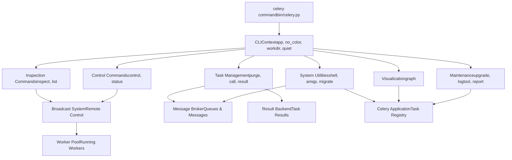
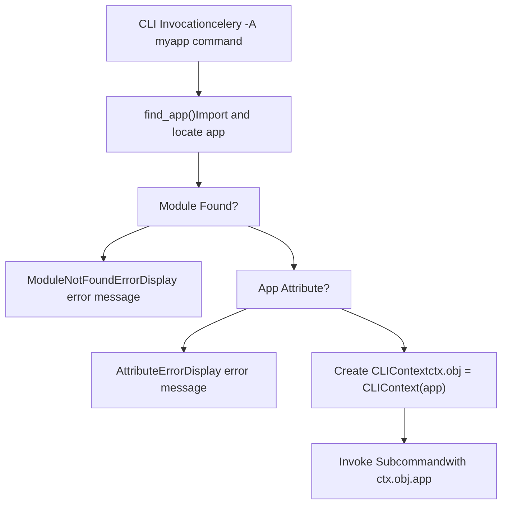
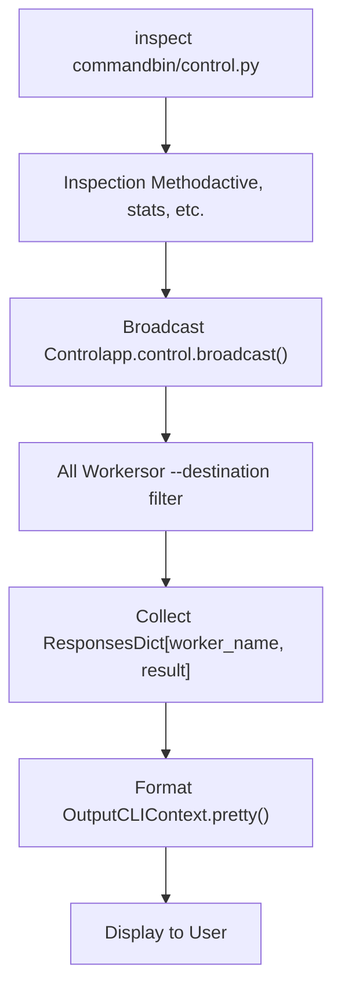
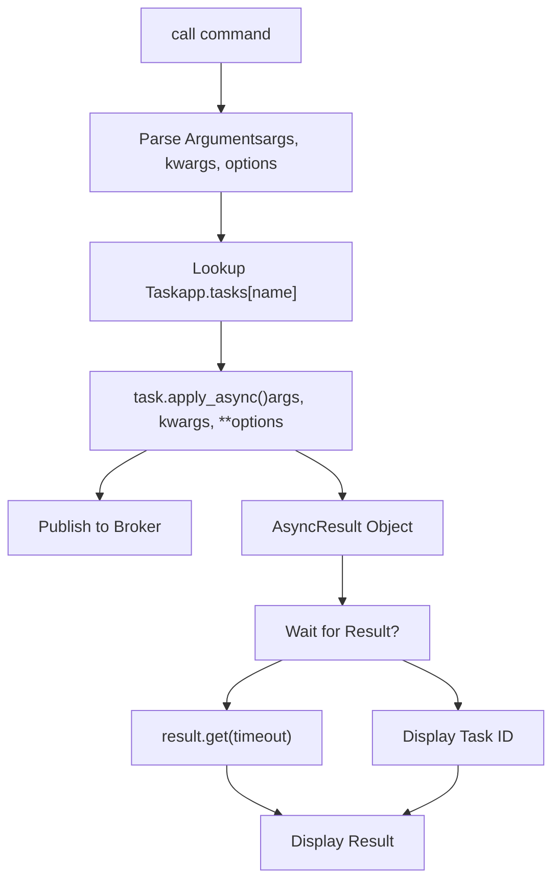
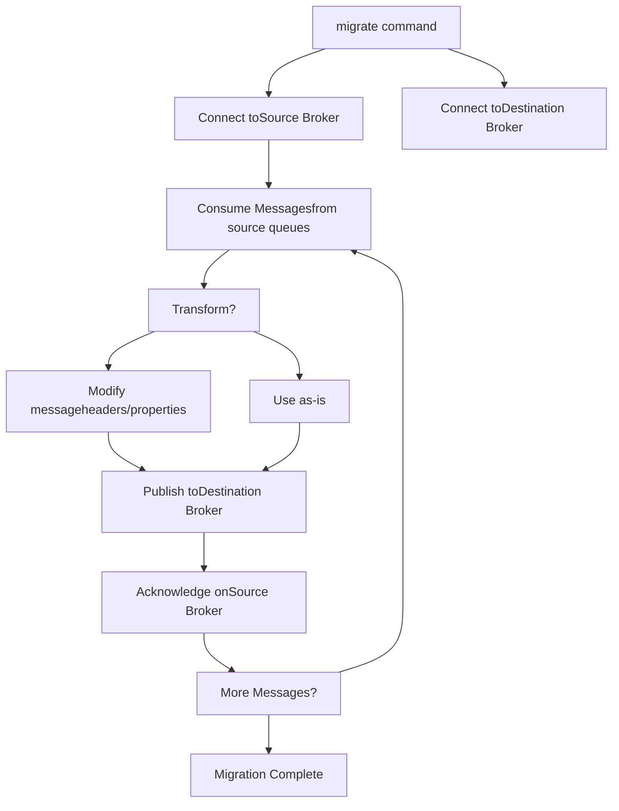
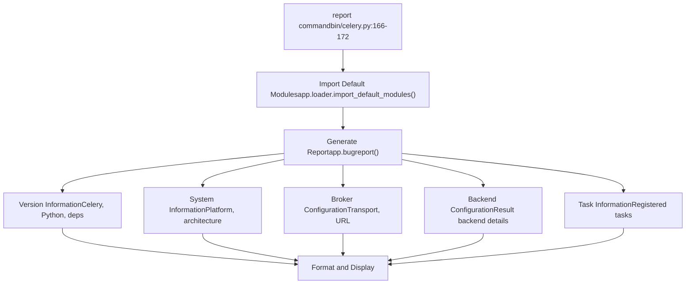

# 管理命令 (Management Commands)

相关源文件

-   [celery/bin/base.py](https://github.com/celery/celery/blob/4d068b56/celery/bin/base.py)
-   [celery/bin/beat.py](https://github.com/celery/celery/blob/4d068b56/celery/bin/beat.py)
-   [celery/bin/celery.py](https://github.com/celery/celery/blob/4d068b56/celery/bin/celery.py)
-   [celery/bin/events.py](https://github.com/celery/celery/blob/4d068b56/celery/bin/events.py)
-   [celery/bin/worker.py](https://github.com/celery/celery/blob/4d068b56/celery/bin/worker.py)
-   [celery/events/snapshot.py](https://github.com/celery/celery/blob/4d068b56/celery/events/snapshot.py)

## 目的与范围

本页面记录了 Celery 的管理和实用工具命令，这些命令为 Celery 应用程序提供了操作控制、检查和维护功能。管理员和开发人员可以通过这些命令与运行中的工作者（worker）进行交互、管理任务、检查集群状态以及执行管理操作。

本页涵盖以下命令：`inspect`、`control`、`purge`、`call`、`result`、`migrate`、`status`、`shell`、`amqp`、`graph`、`list`、`upgrade`、`logtool` 和 `report`。有关启动工作者和 beat 调度器的信息，请参阅[Worker 和 Beat 命令](/celery/celery/9.2-worker-and-beat-commands)。有关管理多个工作者实例的信息，请参阅[多工作者管理](/celery/celery/9.4-multi-worker-management)。

来源：[celery/bin/celery.py1-228](https://github.com/celery/celery/blob/4d068b56/celery/bin/celery.py#L1-L228)

## 命令类别

Celery 中的管理命令根据其用途以及交互的系统组件分为几个功能类别。

### 命令注册

所有管理命令都会在入口模块中注册到主 `celery` CLI 组。注册遵循一致的模式，每个命令都会被导入并添加到 CLI 组中。

```python
celery.add_command(purge)
celery.add_command(call)
celery.add_command(result)
celery.add_command(migrate)
celery.add_command(status)
celery.add_command(inspect)
celery.add_command(control)
celery.add_command(graph)
celery.add_command(upgrade)
celery.add_command(logtool)
celery.add_command(amqp)
celery.add_command(shell)
celery.add_command(list_)
```
来源：[celery/bin/celery.py175-191](https://github.com/celery/celery/blob/4d068b56/celery/bin/celery.py#L175-L191)

### 管理命令架构

下图展示了管理命令是如何组织的，以及它们与哪些系统组件进行交互：


来源：[celery/bin/celery.py15-31](https://github.com/celery/celery/blob/4d068b56/celery/bin/celery.py#L15-L31) [celery/bin/celery.py175-191](https://github.com/celery/celery/blob/4d068b56/celery/bin/celery.py#L175-L191)

## 命令基础设施

所有管理命令都构建在 Click 框架之上，并带有 Celery 特有的定制化。它们共享通用的应用程序加载、配置和输出格式化基础设施。

### 基类与上下文

管理命令继承自 `CeleryCommand`，并接收一个包含已初始化 Celery 应用程序和输出偏好设置的 `CLIContext` 对象。

| 组件 | 目的 | 关键属性 |
| --- | --- | --- |
| `CLIContext` | 共享的 CLI 上下文 | `app`, `no_color`, `quiet`, `workdir` |
| `CeleryCommand` | 基础命令类 | 定制化的帮助文档格式，支持选项分组 |
| `CeleryOption` | 自定义选项类型 | 支持帮助分组和上下文默认值 |

`CLIContext` 类提供了一些用于格式化输出的实用方法：

| 方法 | 目的 |
| --- | --- |
| `echo()` | 支持彩色的标准输出 |
| `secho()` | 支持彩色的样式化 echo 输出 |
| `error()` | 向 stderr 输出错误信息 |
| `pretty()` | 美化打印字典和列表 |
| `say_chat()` | 方向性消息显示 (← 或 →) |

来源：[celery/bin/base.py34-118](https://github.com/celery/celery/blob/4d068b56/celery/bin/base.py#L34-L118) [celery/bin/base.py155-172](https://github.com/celery/celery/blob/4d068b56/celery/bin/base.py#L155-L172)

### 应用程序加载

主 `celery` 命令在调用子命令之前处理应用程序加载。可以通过 `-A/--app` 选项或环境变量指定应用程序。


应用程序加载过程包含了针对常见失败场景的错误处理：

-   **未找到模块**：显示样式化的错误消息，指示无法导入该模块。
-   **属性错误**：指示在模块中找不到应用程序实例。
-   **常规异常**：显示完整堆栈跟踪以供调试。

来源：[celery/bin/celery.py113-156](https://github.com/celery/celery/blob/4d068b56/celery/bin/celery.py#L113-L156)

## 检查命令 (Inspection Commands)

检查命令查询工作者状态而不修改任何内容。它们使用基于广播的远程控制系统与运行中的工作者通信。

### inspect 命令

`inspect` 命令提供了对工作者状态和统计信息的只读访问。它通过控制广播系统与工作者通信。

常见的检查操作包括：

| 操作 | 目的 |
| --- | --- |
| `active` | 列出当前正在执行的任务 |
| `scheduled` | 列出已调度的任务 (ETA/countdown) |
| `reserved` | 列出已预留（已预取）的任务 |
| `stats` | 工作者统计信息与配置 |
| `registered` | 列出已注册的任务类型 |
| `active_queues` | 列出活动队列名称 |
| `conf` | 工作者配置值 |
| `revoked` | 列出已撤销的任务 ID |
| `clock` | 逻辑时钟值 |
| `ping` | 检查工作者响应性 |

inspect 命令架构：


工作者通过消费者的控制处理程序响应检查命令，该处理程序执行请求的检查方法并返回结果。

来源：[celery/bin/celery.py19](https://github.com/celery/celery/blob/4d068b56/celery/bin/celery.py#L19-L19) [celery/bin/celery.py184](https://github.com/celery/celery/blob/4d068b56/celery/bin/celery.py#L184-L184)

### list 命令

`list` 命令显示有关已注册任务和绑定的信息。与 `inspect` 不同，该命令操作的是本地应用程序实例，而不是查询远程工作者。

该命令可以列出：

-   **已注册任务**：应用程序已知的所有任务。
-   **任务绑定**：为任务配置的队列和交换机绑定。

来源：[celery/bin/celery.py22](https://github.com/celery/celery/blob/4d068b56/celery/bin/celery.py#L22-L22) [celery/bin/celery.py178](https://github.com/celery/celery/blob/4d068b56/celery/bin/celery.py#L178-L178)

## 控制命令 (Control Commands)

控制命令向工作者发送指令，以修改其行为或状态。它们使用与检查命令相同的广播系统，但触发的是动作而非查询。

### control 命令

`control` 命令向工作者发送操作指令。常见的控制操作：

| 操作 | 目的 | 影响 |
| --- | --- | --- |
| `shutdown` | 优雅地关闭工作者 | 工作者在完成当前任务后终止 |
| `pool_restart` | 重启工作者池 | 池进程被替换 |
| `pool_grow` | 增加工作者进程 | 增加并发量 |
| `pool_shrink` | 减少工作者进程 | 减少并发量 |
| `autoscale` | 设置自动伸缩参数 | 更改最小/最大工作者数量 |
| `time_limit` | 设置任务时间限制 | 影响软性/硬性时间限制 |
| `rate_limit` | 设置任务速率限制 | 控制任务执行速率 |
| `revoke` | 取消任务执行 | 将任务 ID 标记为已撤销 |
| `terminate` | 强制终止任务 | 杀死执行任务的工作进程 |
| `enable_events` | 启用事件监控 | 开始发送任务事件 |
| `disable_events` | 禁用事件监控 | 停止发送任务事件 |
| `election` | 触发领导者选举 | 用于事件照相机 (camera) 协调 |

### 控制消息流

> **[Mermaid sequence]**
> *(图表结构无法解析)*

来源：[celery/bin/celery.py19](https://github.com/celery/celery/blob/4d068b56/celery/bin/celery.py#L19-L19) [celery/bin/celery.py185](https://github.com/celery/celery/blob/4d068b56/celery/bin/celery.py#L185-L185)

### status 命令

`status` 命令是一个专门用于检查集群状态的控制操作。它会 ping 所有工作者并报告哪些工作者在线。

此命令特别适用于：

-   部署脚本中的健康检查。
-   验证工作者可用性。
-   监控集群大小。

来源：[celery/bin/celery.py19](https://github.com/celery/celery/blob/4d068b56/celery/bin/celery.py#L19-L19) [celery/bin/celery.py181](https://github.com/celery/celery/blob/4d068b56/celery/bin/celery.py#L181-L181)

## 任务管理命令

任务管理命令与代理（broker）和结果后端（result backend）交互，以管理任务生命周期操作。

### purge 命令

`purge` 命令从配置的队列中删除所有消息。这是一个破坏性操作，会丢弃挂起的任务。

操作流程：

1.  连接到代理。
2.  遍历配置的队列。
3.  删除每个队列中的所有消息。
4.  报告清除的消息数量。

用例：

-   修复错误后清除积压。
-   在部署期间移除过时的任务。
-   测试和开发环境的清理。

来源：[celery/bin/celery.py26](https://github.com/celery/celery/blob/4d068b56/celery/bin/celery.py#L26-L26) [celery/bin/celery.py175](https://github.com/celery/celery/blob/4d068b56/celery/bin/celery.py#L175-L175)

### call 命令

`call` 命令从命令行调用一个任务。它为任务提交提供了一个 CLI 界面，支持参数、关键字参数和执行选项。

支持的选项通常包括：

-   任务参数（位置参数和关键字参数）。
-   执行选项（ETA、倒计时、队列、路由）。
-   结果处理（等待、超时）。


来源：[celery/bin/celery.py18](https://github.com/celery/celery/blob/4d068b56/celery/bin/celery.py#L18-L18) [celery/bin/celery.py176](https://github.com/celery/celery/blob/4d068b56/celery/bin/celery.py#L176-L176)

### result 命令

`result` 命令在给定任务 ID 的情况下检索并显示任务结果。它查询结果后端并处理各种结果状态。

该命令处理以下状态：

-   **PENDING**: 任务尚未执行。
-   **STARTED**: 任务执行中。
-   **SUCCESS**: 任务成功完成（显示结果）。
-   **FAILURE**: 任务失败（显示异常）。
-   **RETRY**: 任务正在重试。
-   **REVOKED**: 任务已被取消。

结果检索选项：

-   带超时的阻塞等待。
-   任务状态检查。
-   显示异常堆栈跟踪。
-   结果反序列化。

来源：[celery/bin/celery.py27](https://github.com/celery/celery/blob/4d068b56/celery/bin/celery.py#L27-L27) [celery/bin/celery.py179](https://github.com/celery/celery/blob/4d068b56/celery/bin/celery.py#L179-L179)

## 系统实用程序命令

系统实用程序提供了对 Celery 内部组件的直接访问，用于调试、迁移和交互式使用。

### shell 命令

`shell` 命令启动一个预加载了 Celery 应用程序的交互式 Python shell。shell 环境包括：

-   已加载的 Celery 应用程序 (`app`)。
-   所有已注册的任务。
-   Celery 实用工具函数。
-   访问代理和后端连接。

支持的 shell 实现：

-   IPython（如果可用）。
-   bpython（如果可用）。
-   标准 Python REPL。

典型的 shell 会话：

```python
# Celery 应用程序自动加载
>>> app
<Celery default at 0x...>

# 访问注册的任务
>>> app.tasks
{'celery.chain': <Task: celery.chain>, ...}

# 交互式提交任务
>>> result = add.delay(2, 2)
>>> result.get()
4
```
来源：[celery/bin/celery.py28](https://github.com/celery/celery/blob/4d068b56/celery/bin/celery.py#L28-L28) [celery/bin/celery.py190](https://github.com/celery/celery/blob/4d068b56/celery/bin/celery.py#L190-L190)

### amqp 命令

`amqp` 命令提供了 AMQP 操作的低级接口。它实现了与消息代理的直接交互，用于：

-   队列声明与检查。
-   交换机声明与绑定。
-   消息发布。
-   消息消费。
-   队列清除。
-   绑定管理。

这主要用于：

-   调试代理连接。
-   检查队列内容。
-   测试路由配置。
-   手动操作消息。

来源：[celery/bin/celery.py15](https://github.com/celery/celery/blob/4d068b56/celery/bin/celery.py#L15-L15) [celery/bin/celery.py189](https://github.com/celery/celery/blob/4d068b56/celery/bin/celery.py#L189-L189)

### migrate 命令

`migrate` 命令通过将任务从一个代理移动到另一个代理来促进代理迁移。它从源代理消费消息，并将其重新发布到目标代理。

迁移过程：


用例：

-   切换代理技术（RabbitMQ → Redis）。
-   移动到不同的代理实例。
-   代理版本升级。
-   灾难恢复。

来源：[celery/bin/celery.py24](https://github.com/celery/celery/blob/4d068b56/celery/bin/celery.py#L24-L24) [celery/bin/celery.py180](https://github.com/celery/celery/blob/4d068b56/celery/bin/celery.py#L180-L180)

## 可视化与报告命令

这些命令提供了对任务关系和系统配置的见解。

### graph 命令

`graph` 命令生成 DOT 格式的图表，显示任务依赖关系和 Canvas 工作流结构。它可视化了：

-   任务依赖链。
-   Canvas 原语（group、chord、chain）。
-   Callback 和 errback 关系。
-   工作流组合。

输出格式：

-   DOT 语言（用于 Graphviz）。
-   视觉渲染（如果安装了 Graphviz）。

这对于以下方面很有用：

-   理解复杂的工作流。
-   生成文档。
-   调试任务依赖关系。
-   视觉架构审查。

来源：[celery/bin/celery.py21](https://github.com/celery/celery/blob/4d068b56/celery/bin/celery.py#L21-L21) [celery/bin/celery.py186](https://github.com/celery/celery/blob/4d068b56/celery/bin/celery.py#L186-L186)

### report 命令

`report` 命令生成一份全面的系统报告，包括：

-   Celery 版本信息。
-   Python 版本和平台。
-   代理传输详情。
-   结果后端配置。
-   已安装的依赖。
-   配置摘要。


该报告旨在包含在错误报告和支持请求中，提供所有相关的环境和配置详情。

来源：[celery/bin/celery.py166-172](https://github.com/celery/celery/blob/4d068b56/celery/bin/celery.py#L166-L172)

## 维护命令

### upgrade 命令

`upgrade` 命令在主要的 Celery 版本之间迁移时执行版本特定的升级程序。它处理：

-   配置迁移。
-   数据库模式更新。
-   文件格式转换。
-   兼容性检查。

该命令是感知版本的，仅根据当前版本和目标版本执行相关的升级步骤。

来源：[celery/bin/celery.py29](https://github.com/celery/celery/blob/4d068b56/celery/bin/celery.py#L29-L29) [celery/bin/celery.py187](https://github.com/celery/celery/blob/4d068b56/celery/bin/celery.py#L187-L187)

### logtool 命令

`logtool` 命令提供了解析和处理日志文件的工具。它可以：

-   解析 Celery 日志文件。
-   提取统计信息。
-   过滤日志条目。
-   从日志生成报告。

这对于事后分析和性能调查非常有用。

来源：[celery/bin/celery.py23](https://github.com/celery/celery/blob/4d068b56/celery/bin/celery.py#L23-L23) [celery/bin/celery.py188](https://github.com/celery/celery/blob/4d068b56/celery/bin/celery.py#L188-L188)

## 常用命令模式

### 输出格式化

所有管理命令都使用 `CLIContext` 来实现一致的输出格式。上下文提供了可以通过 `--no-color` 标志禁用的彩色支持。

美化打印逻辑：

| 输入类型 | 格式化策略 |
| --- | --- |
| `list` | 带有 "\* " 前缀的项目符号列表 |
| 带有 `ok`/`error` 键的 `dict` | 带有状态前缀的缩进输出 |
| `dict` (常规) | 带有语法高亮的 JSON 格式化输出 |
| `str` | 直接输出 |
| 其他 | `pformat()` 表示形式 |

来源：[celery/bin/base.py80-109](https://github.com/celery/celery/blob/4d068b56/celery/bin/base.py#L80-L109)

### 错误处理

命令遵循一致的错误处理模式：

1.  尝试操作。
2.  捕获特定的异常。
3.  使用 `ctx.obj.error()` 格式化错误消息。
4.  以非零状态退出。

该框架针对常见错误提供了专门的处理：

-   应用程序加载失败。
-   代理连接错误。
-   工作者不可用。
-   无效参数。

来源：[celery/bin/celery.py136-152](https://github.com/celery/celery/blob/4d068b56/celery/bin/celery.py#L136-L152)

### 通过插件扩展命令

CLI 系统支持通过入口点进行基于插件的命令扩展。第三方包可以注册额外的命令：

```python
# 在 setup.py 中
entry_points={
    'celery.commands': [
        'mycommand = mypackage.commands:mycommand',
    ],
}
```
主 CLI 从 `celery.commands` 入口点组加载插件，并将其与内置命令无缝集成。

来源：[celery/bin/celery.py46-53](https://github.com/celery/celery/blob/4d068b56/celery/bin/celery.py#L46-L53) [celery/bin/celery.py55-56](https://github.com/celery/celery/blob/4d068b56/celery/bin/celery.py#L55-L56)

## 与工作者控制系统的集成

与工作者交互的管理命令使用远程控制系统，该系统依赖于广播消息。有关远程控制协议的详细信息，请参阅[远程控制命令](/celery/celery/8.1-remote-control-commands)和[工作者检查](/celery/celery/8.2-worker-inspection)。

### 控制消息协议

控制和检查命令：

1.  创建包含命令名称和参数的控制消息。
2.  通过适当的路由发布到控制交换机。
3.  等待响应（带有超时）。
4.  汇总来自多个工作者的响应。
5.  格式化并显示结果。

工作者通过专用的消费者接收控制消息，该消费者：

-   验证控制命令。
-   检查方法权限。
-   执行请求的操作。
-   如果符合预期则返回结果。

来源：[celery/bin/celery.py19](https://github.com/celery/celery/blob/4d068b56/celery/bin/celery.py#L19-L19)
