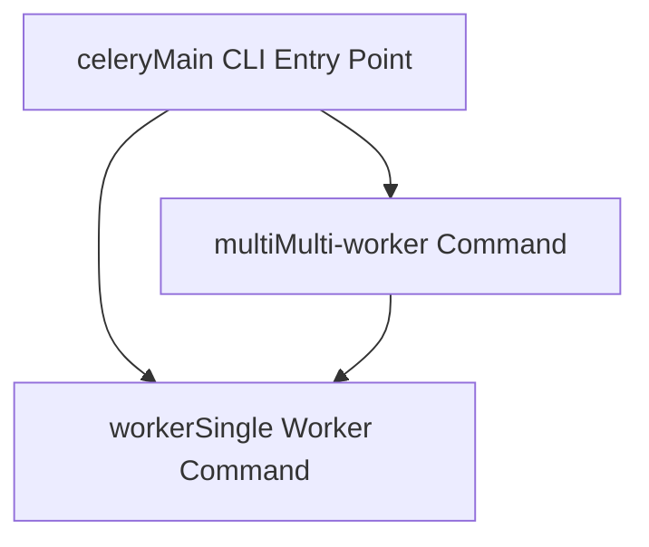
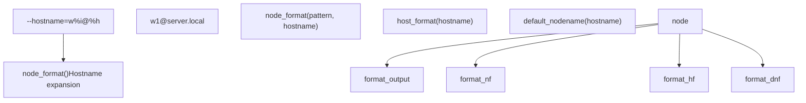
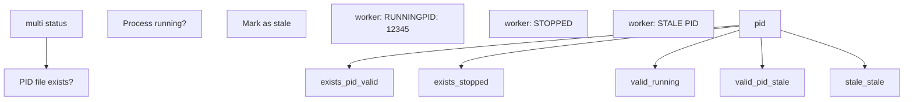
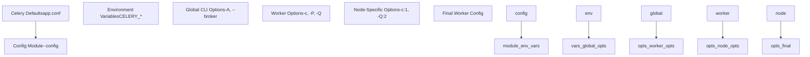
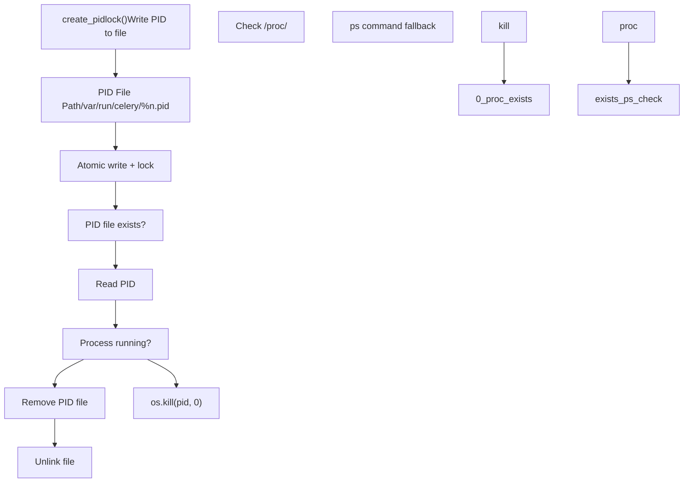
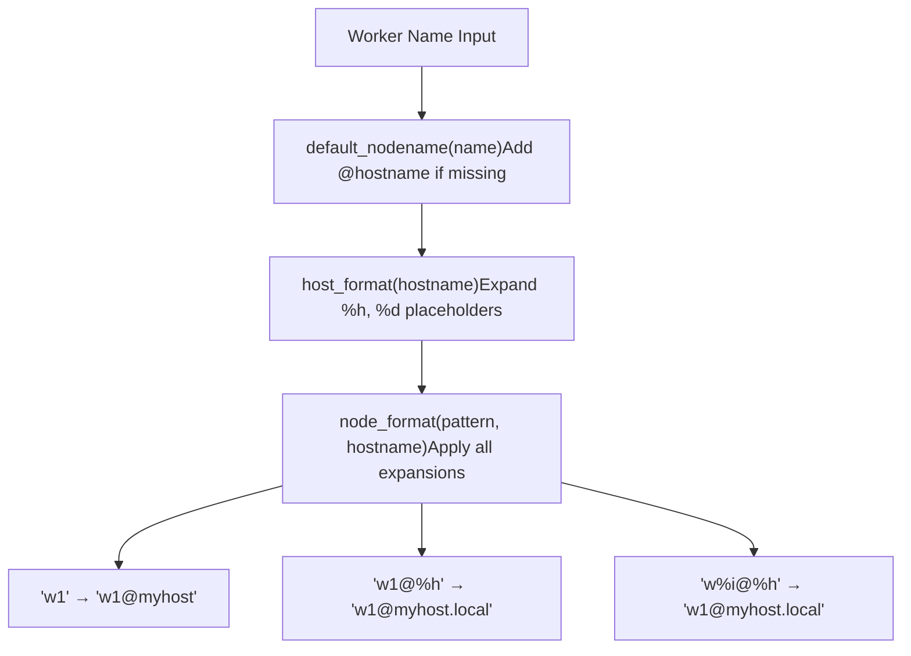
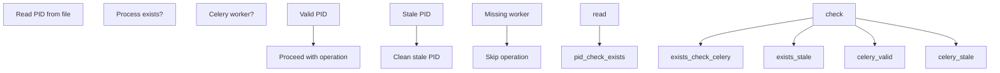

# 多工作者管理 (Multi-worker Management)

相关源文件

-   [celery/bin/base.py](https://github.com/celery/celery/blob/4d068b56/celery/bin/base.py)
-   [celery/bin/beat.py](https://github.com/celery/celery/blob/4d068b56/celery/bin/beat.py)
-   [celery/bin/celery.py](https://github.com/celery/celery/blob/4d068b56/celery/bin/celery.py)
-   [celery/bin/events.py](https://github.com/celery/celery/blob/4d068b56/celery/bin/events.py)
-   [celery/bin/worker.py](https://github.com/celery/celery/blob/4d068b56/celery/bin/worker.py)
-   [celery/events/snapshot.py](https://github.com/celery/celery/blob/4d068b56/celery/events/snapshot.py)

## 目的与范围

本文档描述了 `multi` 命令以及用于在单个主机上管理多个 Celery 工作者进程的相关基础设施。多工作者管理系统允许通过单个命令启动、停止、重启和监控具有不同配置、主机名和队列分配的多个工作者实例。

有关启动单个工作者实例的信息，请参阅[Worker 和 Beat 命令](/celery/celery/9.2-worker-and-beat-commands)。有关工作者架构和生命周期的详细信息，请参阅[工作者 (Workers)](/celery/celery/5-workers) 以及[工作者生命周期与停机](/celery/celery/5.2-worker-lifecycle-and-shutdown)。有关平台特定的进程管理实用程序，请参阅平台实用程序。

---

## Multi 命令概述

`multi` 命令提供了一个用于管理工作者进程集合的高级界面。它封装了标准的 `worker` 命令，并针对多个实例扩展了批量操作、进程跟踪和协调的生命周期管理。

### 命令注册

multi 命令作为插件命令注册在主 Celery CLI 中：


**Multi 命令注册流**

来源：[celery/bin/celery.py](https://github.com/celery/celery/blob/4d068b56/celery/bin/celery.py#L25-L25) [celery/bin/celery.py](https://github.com/celery/celery/blob/4d068b56/celery/bin/celery.py#L191-L191)

### 目的与用例

multi 命令解决了几个操作需求：

| 用例 | 描述 |
| --- | --- |
| **队列专业化** | 为不同的队列优先级运行独立的工作者（例如 `high`, `default`, `low`）。 |
| **资源隔离** | 为不同的工作者类型分配不同的并发级别。 |
| **主机名区分** | 为监控创建可唯一标识的工作者实例。 |
| **协调部署** | 原子性地启动/停止部署组中的所有工作者。 |
| **进程监督** | 跟踪并管理整个系统中的工作者进程健康状况。 |

---

## Multi 命令架构

multi 命令作为一个进程监督器运行，通过 shell 命令和进程信号管理工作者实例。

### 组件架构

```mermaid
flowchart TD
    multi_cmd["multi commandProcess Supervisor"]
    node_args["Node ArgumentsPer-worker config"]
    expansion["Name Expansion%n, %i placeholders"]
    worker_spawner["Worker SpawnerFork/exec workers"]
    pid_tracker["PID File TrackerProcess identification"]
    signal_sender["Signal SenderTERM/INT/QUIT"]
    detach["detached()Daemonization"]
    pidlock["create_pidlock()PID file creation"]
    privileges["maybe_drop_privileges()User switching"]
    w1["worker w1--hostname=w1@host"]
    w2["worker w2--hostname=w2@host"]
    w3["worker w3--hostname=w3@host"]

    multi --> cmd_node_args
    multi --> cmd_expansion
    node --> args_worker_spawner
    expansion --> worker_spawner
    worker --> spawner_pid_tracker
    worker --> spawner_signal_sender
    worker --> spawner_detach
    worker --> spawner_pidlock
    worker --> spawner_privileges
    detach --> w1
    detach --> w2
    detach --> w3
    pid --> tracker_w1
    pid --> tracker_w2
    pid --> tracker_w3
    signal --> sender_w1
    signal --> sender_w2
    signal --> sender_w3
```


**Multi 命令进程管理架构**

来源：[celery/bin/celery.py](https://github.com/celery/celery/blob/4d068b56/celery/bin/celery.py#L25-L25) [celery/bin/celery.py](https://github.com/celery/celery/blob/4d068b56/celery/bin/celery.py#L191-L191) [celery/bin/worker.py](https://github.com/celery/celery/blob/4d068b56/celery/bin/worker.py#L108-L134)

### 名称展开系统 (Name Expansion System)

multi 命令支持在工作者参数中使用占位符展开，以生成唯一的配置：

| 占位符 | 展开内容 | 示例 |
| --- | --- | --- |
| `%n` | 节点名称 | `worker1` → `w1@hostname` |
| `%h` | 完整主机名 | `myserver.example.com` |
| `%d` | 域名 | `example.com` |
| `%i` | 进程索引 | 多个实例时为 `0`, `1`, `2` |
| `%%` | 字面百分号 | `%` 字符 |

此展开由 `node_format()` 和 `host_format()` 实用程序处理：


**主机名与节点名展开**

来源：[celery/utils/nodenames.py](https://github.com/celery/celery/blob/4d068b56/celery/utils/nodenames.py) [celery/bin/worker.py](https://github.com/celery/celery/blob/4d068b56/celery/bin/worker.py#L66-L73) [celery/bin/worker.py](https://github.com/celery/celery/blob/4d068b56/celery/bin/worker.py#L362-L362)

---

## 进程管理操作

multi 命令提供了几个用于管理工作者生命周期的操作。

### 启动操作 (Start Operation)

`start` 操作根据指定的配置生成新的工作者进程：

> **[Mermaid sequence]**
> *(图表结构无法解析)*

**Multi 启动序列**

启动操作为每个工作者执行以下步骤：

1.  **参数构建** - 使用展开后的占位符构建完整的工作者命令行。
2.  **守护进程化** - 使用 `detached()` 上下文管理器派生后台进程。
3.  **PID 文件创建** - 将进程 ID 写入跟踪文件，以便后续操作。
4.  **工作者执行** - 调用 `execv()` 用工作者实例替换当前进程。
5.  **状态验证** - 可选地通过 PID 文件的存在来验证工作者是否启动。

来源：[celery/bin/worker.py](https://github.com/celery/celery/blob/4d068b56/celery/bin/worker.py#L108-L134) [celery/platforms.py](https://github.com/celery/celery/blob/4d068b56/celery/platforms.py)

### 停止操作 (Stop Operation)

`stop` 操作向运行中的工作者发送终止信号：

> **[Mermaid sequence]**
> *(图表结构无法解析)*

**Multi 停止序列**

停止操作实现了带有回退机制的优雅停机：

1.  **PID 查找** - 从跟踪文件中读取工作者 PID。
2.  **SIGTERM 信号** - 发送优雅停机信号（允许任务完成）。
3.  **宽限期** - 等待工作者完成当前任务并退出。
4.  **SIGKILL 回退** - 如果工作者没有响应，则强制终止。
5.  **清理** - 验证后移除 PID 文件。

来源：[celery/bin/worker.py](https://github.com/celery/celery/blob/4d068b56/celery/bin/worker.py) [celery/platforms.py](https://github.com/celery/celery/blob/4d068b56/celery/platforms.py)

### 重启操作 (Restart Operation)

`restart` 操作结合了停止和启动，并带有处理未运行工作者的逻辑：

| 重启策略 | 行为 |
| --- | --- |
| **运行中的工作者** | SIGTERM → 等待 → 启动新实例 |
| **已停止的工作者** | 跳过停止 → 启动新实例 |
| **过时的 PID** | 清理过时文件 → 启动新实例 |
| **启动失败** | 报告错误，继续处理其他工作者 |

### 状态操作 (Status Operation)

`status` 操作报告受管工作者的运行状态：


**Multi 状态检查逻辑**

来源：[celery/platforms.py](https://github.com/celery/celery/blob/4d068b56/celery/platforms.py)

---

## 工作者实例配置

multi 命令允许通过参数展开和选项传递对每个工作者进行配置。

### 节点特定参数 (Node-Specific Arguments)

可以使用节点名称语法为工作者配置不同的参数：

```bash
celery multi start 3 \
    --hostname=w%i@%h \
    -c:1 4 \
    -c:2 8 \
    -c:3 16 \
    -Q:1 high \
    -Q:2 default \
    -Q:3 low
```
这将创建三个具有不同并发量和队列分配的工作者：

| 工作者 | 主机名 | 并发量 | 队列 |
| --- | --- | --- | --- |
| w1 | `w1@hostname` | 4 | `high` |
| w2 | `w2@hostname` | 8 | `default` |
| w3 | `w3@hostname` | 16 | `low` |

### 配置继承

配置来自多个源，优先级如下：


**配置优先级流程**

来源：[celery/bin/celery.py](https://github.com/celery/celery/blob/4d068b56/celery/bin/celery.py#L113-L156) [celery/bin/worker.py](https://github.com/celery/celery/blob/4d068b56/celery/bin/worker.py#L307-L336)

### 常用的多工作者模式

#### 基于队列的工作者池

按队列优先级分离工作者：

```bash
celery multi start priority_workers -A myapp \
    --hostname=priority_%i@%h \
    -Q:1 critical \
    -Q:2 high \
    -Q:3 default \
    -Q:4 low \
    -c:1 2 \
    -c:2 4 \
    -c:3 8 \
    -c:4 8
```
#### 池类型专业化

运行不同的并发模型：

```bash
celery multi start mixed_pool -A myapp \
    --hostname=pool_%i@%h \
    -P:1 prefork -c:1 4 -Q:1 cpu_intensive \
    -P:2 eventlet -c:2 100 -Q:2 io_bound \
    -P:3 gevent -c:3 100 -Q:3 network_calls
```
来源：[celery/bin/worker.py](https://github.com/celery/celery/blob/4d068b56/celery/bin/worker.py#L35-L64) [celery/bin/worker.py](https://github.com/celery/celery/blob/4d068b56/celery/bin/worker.py#L100-L103)

---

## 进程标识与跟踪

multi 命令通过 PID 文件和主机名解析来跟踪工作者进程。

### PID 文件管理


**PID 文件管理流程**

PID 文件的命名遵循 DaemonOption 回调中指定的模式：

来源：[celery/bin/base.py](https://github.com/celery/celery/blob/4d068b56/celery/bin/base.py#L174-L189) [celery/platforms.py](https://github.com/celery/celery/blob/4d068b56/celery/platforms.py) [celery/bin/worker.py](https://github.com/celery/celery/blob/4d068b56/celery/bin/worker.py#L362-L362)

### 主机名解析 (Hostname Resolution)

工作者主机名通过主机名解析系统进行规范化：


**主机名解析流水线**

来源：[celery/utils/nodenames.py](https://github.com/celery/celery/blob/4d068b56/celery/utils/nodenames.py) [celery/bin/worker.py](https://github.com/celery/celery/blob/4d068b56/celery/bin/worker.py#L66-L73) [celery/bin/worker.py](https://github.com/celery/celery/blob/4d068b56/celery/bin/worker.py#L138-L145)

---

## 守护进程化与离线化 (Daemonization and Detachment)

multi 命令使用平台实用程序来正确地将工作者进程守护进程化。

### 离线进程创建 (Detached Process Creation)

`detached()` 上下文管理器负责处理守护进程化：

> **[Mermaid sequence]**
> *(图表结构无法解析)*

**离线工作者进程创建**

离线化过程确保：

1.  **会话领导者** - 工作者通过 `setsid()` 成为会话领导者。
2.  **双重 Fork** - 第二次 fork 防止重新获取 TTY 控制台。
3.  **文件描述符管理** - 关闭继承的描述符，重定向标准流。
4.  **日志文件设置** - 在离线前打开并验证日志文件的可访问性。
5.  **PID 记录** - 写入守护进程 PID 以供后续管理。
6.  **权限放弃** - fork 后可选的用户/组切换。
7.  **工作目录** - 更改为指定的工作目录或根目录。

来源：[celery/platforms.py](https://github.com/celery/celery/blob/4d068b56/celery/platforms.py) [celery/bin/worker.py](https://github.com/celery/celery/blob/4d068b56/celery/bin/worker.py#L108-L134)

### 日志文件处理

multi 命令使用节点名展开来格式化日志文件路径：

| 格式化字符串 | 展开内容 | 用途 |
| --- | --- | --- |
| `--logfile=%n.log` | `w1.log`, `w2.log` | 每个工作者独立的日志 |
| `--logfile=/var/log/celery/%n-%i.log` | `/var/log/celery/w1-0.log` | 带索引的日志 |
| `--logfile=/var/log/celery/worker.log` | 所有工作者 → 同一文件 | 共享日志（不推荐） |

日志文件路径在进程离线前进行格式化：

来源：[celery/bin/worker.py](https://github.com/celery/celery/blob/4d068b56/celery/bin/worker.py#L108-L118)

---

## 与 Worker 命令的集成

multi 命令内部为每个受管实例调用 worker 命令。

### Worker 命令选项

所有标准的 worker 选项都适用于 multi 管理的工作者：


**Multi 中可用的 Worker 命令选项**

来源：[celery/bin/worker.py](https://github.com/celery/celery/blob/4d068b56/celery/bin/worker.py#L136-L304)

### 工作者初始化流

当由 multi 派生的工作者启动时：

> **[Mermaid sequence]**
> *(图表结构无法解析)*

**多派生工作者初始化**

来源：[celery/bin/worker.py](https://github.com/celery/celery/blob/4d068b56/celery/bin/worker.py#L307-L368) [celery/bin/celery.py](https://github.com/celery/celery/blob/4d068b56/celery/bin/celery.py#L113-L156)

---

## 命令行示例

### 基本多工作者用法

使用默认设置启动三个工作者：

```bash
celery multi start 3 -A myapp
```
创建工作者：`celery@hostname`, `celery@hostname:1`, `celery@hostname:2`。

### 自定义主机名

使用自定义主机名模式启动工作者：

```bash
celery multi start 3 -A myapp --hostname=worker%i@%h
```
创建：`worker1@hostname`, `worker2@hostname`, `worker3@hostname`。

### 队列特定工作者

为不同队列集启动工作者：

```bash
celery multi start high_worker default_worker -A myapp \
    --hostname=%n@%h \
    -Q:high_worker urgent,high \
    -Q:default_worker default,low \
    -c:high_worker 4 \
    -c:default_worker 8
```
### 重启特定工作者

重启受管工作者的子集：

```bash
celery multi restart worker1 worker3 -A myapp
```
仅重启 `worker1` 和 `worker3`，保持其他工作者继续运行。

### 停止所有工作者

停止由 multi 管理的所有工作者：

```bash
celery multi stop 3 -A myapp --hostname=worker%i@%h
```
必须匹配与 `start` 时相同的主机名模式。

### 检查工作者状态

查询受管工作者的运行状态：

```bash
celery multi status 3 -A myapp --hostname=worker%i@%h
```
输出会显示每个工作者的 PID 和运行状态。

来源：[celery/bin/worker.py](https://github.com/celery/celery/blob/4d068b56/celery/bin/worker.py) [celery/bin/celery.py](https://github.com/celery/celery/blob/4d068b56/celery/bin/celery.py)

---

## 高级配置

### PID 文件目录

配置自定义 PID 文件位置：

```bash
celery multi start 3 -A myapp \
    --pidfile=/var/run/celery/%n.pid
```
### 日志文件组织

为每个工作者设置独立的日志文件：

```bash
celery multi start 3 -A myapp \
    --logfile=/var/log/celery/%n%I.log \
    --loglevel=INFO
```
创建：`/var/log/celery/celery.log`, `/var/log/celery/celery1.log`, `/var/log/celery/celery2.log`。

### 权限放弃

以不同用户身份启动工作者：

```bash
celery multi start 3 -A myapp \
    --uid=celery \
    --gid=celery
```
需要以 root 身份启动，然后在 fork 后放弃特权。

来源：[celery/bin/base.py](https://github.com/celery/celery/blob/4d068b56/celery/bin/base.py#L174-L205) [celery/platforms.py](https://github.com/celery/celery/blob/4d068b56/celery/platforms.py)

### 工作目录

为工作者设置工作目录：

```bash
celery multi start 3 -A myapp \
    --workdir=/opt/myapp
```
工作者在 fork 后会更改到此目录。

---

## 与直接 Worker 命令的比较

### Multi 命令 vs 直接 Worker

| 方面 | `celery multi` | `celery worker` |
| --- | --- | --- |
| **进程数量** | 多个工作者 | 单个工作者 |
| **PID 管理** | 自动跟踪 | 手动管理 PID 文件 |
| **批量操作** | 一次性启动/停止所有 | 一次操作一个 |
| **配置** | 按节点配置参数 | 单一配置 |
| **监控** | 内置状态查询 | 依赖外部工具 |
| **用例** | 生产环境部署 | 开发调试、单个实例 |

### 何时使用 Multi

在以下情况下使用 `celery multi`：

-   在同一台主机上运行多种类型的工作者。
-   需要对工作者组进行协调的启动/停止。
-   希望简化 PID 文件管理。
-   部署针对特定队列的工作者。

在以下情况下使用 `celery worker`：

-   运行单个工作者实例。
-   使用外部进程监督器（systemd, supervisord）。
-   需要对单个工作者进行详细控制。
-   开发和测试阶段。

来源：[celery/bin/worker.py](https://github.com/celery/celery/blob/4d068b56/celery/bin/worker.py) [celery/bin/celery.py](https://github.com/celery/celery/blob/4d068b56/celery/bin/celery.py#L25-L25) [celery/bin/celery.py](https://github.com/celery/celery/blob/4d068b56/celery/bin/celery.py#L191-L191)

---

## 错误处理与故障排除

### 常见问题

| 问题 | 原因 | 解决方法 |
| --- | --- | --- |
| **过时的 PID 文件** | 工作者崩溃且未清理 | 手动移除 PID 文件 |
| **权限被拒绝** | 对 PID/日志目录权限不足 | 检查目录权限 |
| **工作者无法停止** | 进程挂起，SIGTERM 被忽略 | 使用 `stop` 带上 `--force` 或手动执行 `SIGKILL` |
| **主机名不匹配** | 启动和停止时使用了不同模式 | 使用相同的 `--hostname` 模式 |
| **端口冲突** | 多个工作者绑定同一端口 | 为每个工作者使用不同端口 |

### PID 文件验证

multi 命令在执行操作前会验证 PID 文件：


**PID 文件验证逻辑**

来源：[celery/platforms.py](https://github.com/celery/celery/blob/4d068b56/celery/platforms.py)

---

## 与系统监督器集成

multi 命令可以与系统级进程监督器集成。

### Systemd 集成

虽然 `celery multi` 提供自己的进程管理，但 systemd 可以监督 multi 命令本身：

```ini
[Unit]
Description=Celery Multi Workers
After=network.target

[Service]
Type=forking
User=celery
Group=celery
WorkingDirectory=/opt/myapp
ExecStart=/usr/bin/celery multi start 3 -A myapp --pidfile=/var/run/celery/%%n.pid --logfile=/var/log/celery/%%n.log
ExecStop=/usr/bin/celery multi stop 3 --pidfile=/var/run/celery/%%n.pid
ExecReload=/usr/bin/celery multi restart 3 --pidfile=/var/run/celery/%%n.pid

[Install]
WantedBy=multi-user.target
```
### Supervisor 集成

或者，使用 supervisor 来管理单个工作者而不是使用 multi：

```ini
[program:celery_worker_%(process_num)02d]
command=celery -A myapp worker --hostname=w%(process_num)02d@%%h -Q queue_%(process_num)02d
process_name=%(program_name)s
numprocs=3
directory=/opt/myapp
user=celery
autostart=true
autorestart=true
```
来源：[celery/bin/worker.py](https://github.com/celery/celery/blob/4d068b56/celery/bin/worker.py#L336-L356)

---

## 总结

multi 命令通过以下方式实现了对多个 Celery 工作者进程的协调管理：

1.  **批量操作** - 针对工作者组的启动、停止、重启和状态命令。
2.  **名称展开** - 生成唯一工作者配置的占位符系统。
3.  **PID 跟踪** - 自动进程标识和生命周期管理。
4.  **守护进程化** - 与平台无关的后台进程创建。
5.  **按工作者配置** - 针对专业化工作者角色的节点特定参数。

multi 命令建立在标准 worker 命令基础设施之上，同时增加了适用于在单个主机上部署多种工作者类型的生产环境进程监督能力。

有关使用 systemd 或 supervisord 的替代进程管理方法，请参阅平台实用程序。有关工作者架构和配置的详细信息，请参阅[工作者 (Workers)](/celery/celery/5-workers) 和[工作者配置与控制](/celery/celery/5.4-worker-configuration-and-control)。

来源：[celery/bin/celery.py](https://github.com/celery/celery/blob/4d068b56/celery/bin/celery.py) [celery/bin/worker.py](https://github.com/celery/celery/blob/4d068b56/celery/bin/worker.py) [celery/bin/base.py](https://github.com/celery/celery/blob/4d068b56/celery/bin/base.py) [celery/platforms.py](https://github.com/celery/celery/blob/4d068b56/celery/platforms.py)
