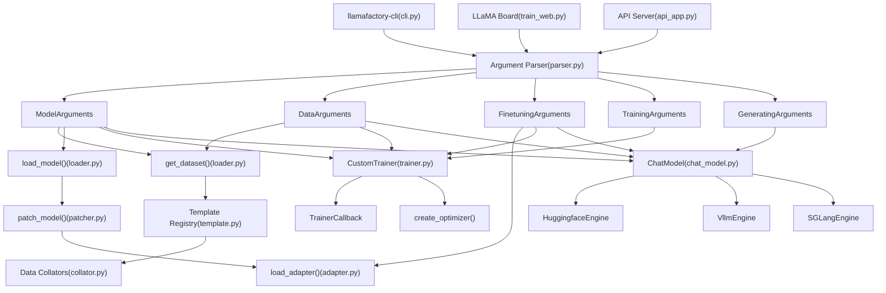
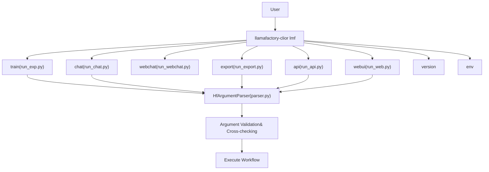
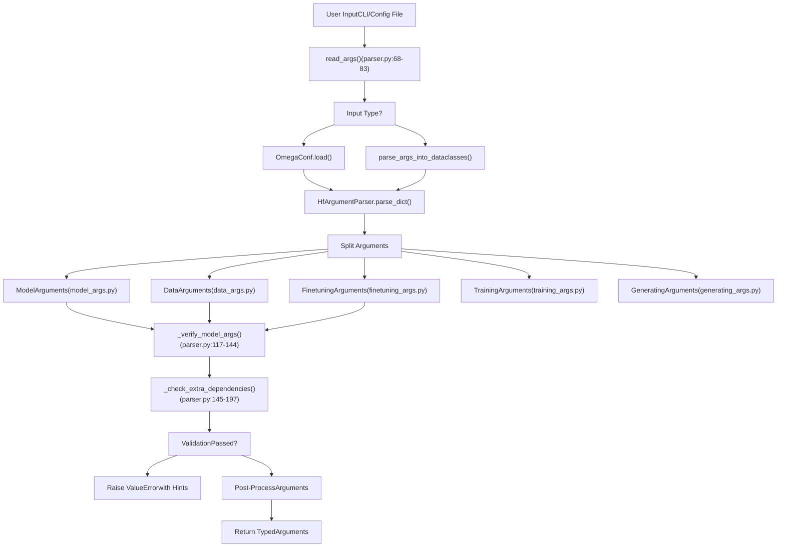
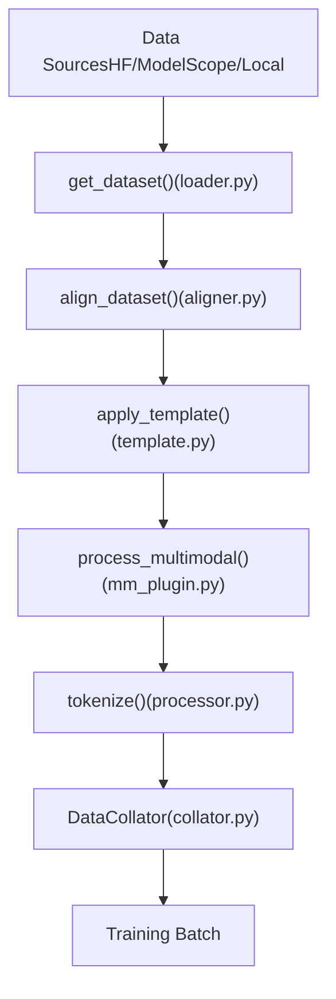
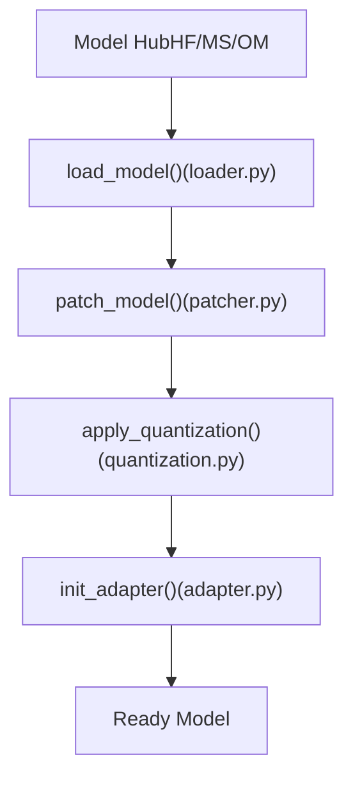
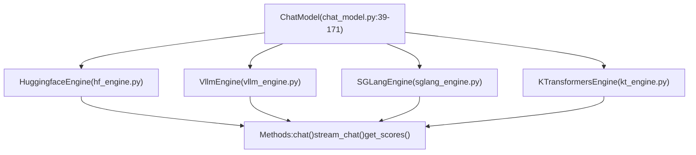

# LlamaFactory Overview

Relevant source files

-   [.github/workflows/tests.yml](https://github.com/hiyouga/LlamaFactory/blob/355d5c5e/.github/workflows/tests.yml)
-   [Makefile](https://github.com/hiyouga/LlamaFactory/blob/355d5c5e/Makefile)
-   [README.md](https://github.com/hiyouga/LlamaFactory/blob/355d5c5e/README.md?plain=1)
-   [README\_zh.md](https://github.com/hiyouga/LlamaFactory/blob/355d5c5e/README_zh.md?plain=1)
-   [docker/docker-cuda/Dockerfile.megatron](https://github.com/hiyouga/LlamaFactory/blob/355d5c5e/docker/docker-cuda/Dockerfile.megatron)
-   [examples/README.md](https://github.com/hiyouga/LlamaFactory/blob/355d5c5e/examples/README.md?plain=1)
-   [examples/README\_zh.md](https://github.com/hiyouga/LlamaFactory/blob/355d5c5e/examples/README_zh.md?plain=1)
-   [pyproject.toml](https://github.com/hiyouga/LlamaFactory/blob/355d5c5e/pyproject.toml)
-   [src/llamafactory/chat/base\_engine.py](https://github.com/hiyouga/LlamaFactory/blob/355d5c5e/src/llamafactory/chat/base_engine.py)
-   [src/llamafactory/chat/chat\_model.py](https://github.com/hiyouga/LlamaFactory/blob/355d5c5e/src/llamafactory/chat/chat_model.py)
-   [src/llamafactory/cli.py](https://github.com/hiyouga/LlamaFactory/blob/355d5c5e/src/llamafactory/cli.py)
-   [src/llamafactory/hparams/parser.py](https://github.com/hiyouga/LlamaFactory/blob/355d5c5e/src/llamafactory/hparams/parser.py)
-   [src/llamafactory/v1/launcher.py](https://github.com/hiyouga/LlamaFactory/blob/355d5c5e/src/llamafactory/v1/launcher.py)

## Purpose and Scope

This document provides a high-level introduction to LlamaFactory, a unified framework for efficient fine-tuning of 100+ large language models. It covers the system's architecture, core components, and how they interact to support training, evaluation, and inference workflows. This overview is intended to orient new developers and users to the codebase structure before diving into specific subsystems.

For detailed information on specific topics, see:

-   Installation and usage: [Getting Started](/hiyouga/LlamaFactory/2-getting-started)
-   Configuration details: [Configuration System](/hiyouga/LlamaFactory/3-configuration-system)
-   Data processing: [Data Pipeline](/hiyouga/LlamaFactory/4-data-pipeline)
-   Model operations: [Model Loading and Configuration](/hiyouga/LlamaFactory/5-model-loading-and-configuration)
-   Training specifics: [Training System](/hiyouga/LlamaFactory/6-training-system)
-   Deployment: [Inference and Deployment](/hiyouga/LlamaFactory/7-inference-and-deployment)
-   Web interface: [Web UI (LLaMA Board)](/hiyouga/LlamaFactory/8-web-ui-(llama-board))

**Sources:** [README.md1-103](https://github.com/hiyouga/LlamaFactory/blob/355d5c5e/README.md?plain=1#L1-L103) [README\_zh.md1-104](https://github.com/hiyouga/LlamaFactory/blob/355d5c5e/README_zh.md?plain=1#L1-L104) [pyproject.toml1-98](https://github.com/hiyouga/LlamaFactory/blob/355d5c5e/pyproject.toml#L1-L98)

---

## What is LlamaFactory?

LlamaFactory is a comprehensive fine-tuning framework designed to simplify and unify the process of training large language models. It provides:

-   **Multi-model support**: 100+ model families including LLaMA, Qwen, GLM, Mistral, Gemma, Yi, and more
-   **Flexible training methods**: Full-tuning, freeze-tuning, LoRA, QLoRA, OFT
-   **Multiple training stages**: Pre-training, supervised fine-tuning (SFT), reward modeling (RM), PPO, DPO, KTO, ORPO, SimPO
-   **Three user interfaces**: Command-line interface (`llamafactory-cli`), Web UI (LLaMA Board), and OpenAI-style API server
-   **Multiple inference backends**: HuggingFace Transformers, vLLM, SGLang, KTransformers
-   **Advanced features**: Multimodal support (images, videos, audio), quantization (2/4/8-bit), distributed training (DeepSpeed, FSDP), custom optimizers (GaLore, BAdam, APOLLO)

The framework is built on PyTorch and leverages HuggingFace Transformers, making it accessible to researchers and practitioners familiar with these ecosystems.

**Sources:** [README.md93-103](https://github.com/hiyouga/LlamaFactory/blob/355d5c5e/README.md?plain=1#L93-L103) [pyproject.toml6-8](https://github.com/hiyouga/LlamaFactory/blob/355d5c5e/pyproject.toml#L6-L8)

---

## System Architecture Overview

### High-Level Component Interaction


**Architecture Overview**

LlamaFactory follows a modular architecture where all entry points (CLI, Web UI, API) converge on a unified configuration system implemented in `parser.py`. The parser validates inputs and distributes them across five typed argument classes, ensuring type safety and early error detection.

The system is organized into five major subsystems:

1.  **Configuration System** ([parser.py1-472](https://github.com/hiyouga/LlamaFactory/blob/355d5c5e/parser.py#L1-L472)): Central validation and routing hub
2.  **Data System**: Handles loading, formatting, and batching from diverse sources
3.  **Model System**: Manages model loading, patching, quantization, and adapter application
4.  **Training System**: Provides stage-specific trainers with custom loss functions
5.  **Inference System**: Offers multiple backends for deployment scenarios

**Sources:** [src/llamafactory/cli.py16-31](https://github.com/hiyouga/LlamaFactory/blob/355d5c5e/src/llamafactory/cli.py#L16-L31) [src/llamafactory/hparams/parser.py49-66](https://github.com/hiyouga/LlamaFactory/blob/355d5c5e/src/llamafactory/hparams/parser.py#L49-L66) [src/llamafactory/chat/chat\_model.py39-85](https://github.com/hiyouga/LlamaFactory/blob/355d5c5e/src/llamafactory/chat/chat_model.py#L39-L85)

---

## Entry Points and Command Structure

### Command-Line Interface

The primary entry point is the `llamafactory-cli` command (aliased as `lmf`), which dispatches to different workflows:

| Command | Purpose | Implementation |
| --- | --- | --- |
| `llamafactory-cli train` | Train models | Launches training with parsed arguments |
| `llamafactory-cli chat` | Interactive CLI chat | [chat\_model.py173-211](https://github.com/hiyouga/LlamaFactory/blob/355d5c5e/chat_model.py#L173-L211) |
| `llamafactory-cli webchat` | Web-based chat UI | Gradio interface |
| `llamafactory-cli api` | OpenAI-style API server | FastAPI application |
| `llamafactory-cli webui` | LLaMA Board GUI | Full training/inference UI |
| `llamafactory-cli export` | Merge/export models | Adapter merging and quantization |
| `llamafactory-cli version` | Version information | Displays framework version |
| `llamafactory-cli env` | Environment info | System diagnostics |


**Command Execution Flow**

All commands follow this pattern:

1.  Parse command-line arguments or YAML/JSON config files
2.  Validate and cross-check arguments (e.g., quantization requires LoRA/OFT)
3.  Setup logging and environment variables
4.  Execute the requested workflow

The framework supports configuration via:

-   Command-line arguments: `llamafactory-cli train --model_name_or_path Qwen/Qwen3-4B ...`
-   YAML files: `llamafactory-cli train examples/train_lora/qwen3_lora_sft.yaml`
-   JSON files: `llamafactory-cli train config.json`
-   Hybrid approach: `llamafactory-cli train config.yaml learning_rate=1e-5`

**Sources:** [src/llamafactory/cli.py16-31](https://github.com/hiyouga/LlamaFactory/blob/355d5c5e/src/llamafactory/cli.py#L16-L31) [examples/README.md1-40](https://github.com/hiyouga/LlamaFactory/blob/355d5c5e/examples/README.md?plain=1#L1-L40) [src/llamafactory/hparams/parser.py68-83](https://github.com/hiyouga/LlamaFactory/blob/355d5c5e/src/llamafactory/hparams/parser.py#L68-L83)

---

## Configuration System Architecture

### Argument Parser and Validation


**Configuration Validation Logic**

The parser performs extensive validation to catch configuration errors early:

| Validation Type | Example Rules | Location |
| --- | --- | --- |
| Type compatibility | Quantization only with LoRA/OFT | [parser.py125-140](https://github.com/hiyouga/LlamaFactory/blob/355d5c5e/parser.py#L125-L140) |
| Stage requirements | `predict_with_generate` only in SFT | [parser.py256-267](https://github.com/hiyouga/LlamaFactory/blob/355d5c5e/parser.py#L256-L267) |
| Hardware constraints | `pure_bf16` requires BF16 support | [parser.py318-323](https://github.com/hiyouga/LlamaFactory/blob/355d5c5e/parser.py#L318-L323) |
| Distributed constraints | Layer-wise GaLore incompatible with DDP | [parser.py325-340](https://github.com/hiyouga/LlamaFactory/blob/355d5c5e/parser.py#L325-L340) |
| Backend requirements | vLLM doesn't support BnB quantization | [parser.py481-492](https://github.com/hiyouga/LlamaFactory/blob/355d5c5e/parser.py#L481-L492) |

**Argument Classes**

The five argument classes encapsulate different aspects of configuration:

1.  **`ModelArguments`**: Model selection, quantization, attention mechanism, RoPE scaling, adapter paths
2.  **`DataArguments`**: Dataset selection, templates, cutoff length, packing settings, multimodal configs
3.  **`FinetuningArguments`**: Training stage (pt/sft/rm/ppo/dpo), LoRA configs, optimizer settings
4.  **`TrainingArguments`**: HuggingFace Trainer settings (learning rate, batch size, epochs, DeepSpeed, FSDP)
5.  **`GeneratingArguments`**: Generation parameters (temperature, top\_p, max\_tokens, beam search)

**Sources:** [src/llamafactory/hparams/parser.py85-100](https://github.com/hiyouga/LlamaFactory/blob/355d5c5e/src/llamafactory/hparams/parser.py#L85-L100) [src/llamafactory/hparams/parser.py117-197](https://github.com/hiyouga/LlamaFactory/blob/355d5c5e/src/llamafactory/hparams/parser.py#L117-L197) [src/llamafactory/hparams/parser.py244-471](https://github.com/hiyouga/LlamaFactory/blob/355d5c5e/src/llamafactory/hparams/parser.py#L244-L471)

---

## Major Subsystem Overview

### Data Pipeline Summary

The data pipeline transforms raw datasets into tokenized batches ready for training. Key components:


-   **Dataset Loader**: Supports HuggingFace Hub, ModelScope, OpenMind, local files (JSON/CSV/Parquet), and cloud storage
-   **Format Aligner**: Converts Alpaca and ShareGPT formats to a unified internal representation
-   **Template System**: Applies model-specific chat templates (100+ registered templates)
-   **Multimodal Plugin**: Processes images, videos, and audio inputs with format regularization
-   **Data Collator**: Handles padding, sequence packing, and 4D attention mask generation

**Sources:** Diagram 3 from high-level architecture

### Model System Summary

The model system loads base models, applies patches, and initializes adapters:


-   **Model Loader**: Fetches models from multiple hubs with automatic fallback
-   **Model Patcher**: Applies config patches for attention mechanisms, RoPE scaling, MoE settings
-   **Quantization**: Supports 2/4/8-bit quantization via BitsAndBytes, GPTQ, AWQ, AQLM
-   **Adapter System**: Implements LoRA, QLoRA, OFT, QOFT, freeze-tuning, and full-tuning

**Sources:** Diagram 4 from high-level architecture

### Training System Summary

The training system provides stage-specific trainers with custom loss computations:

| Training Stage | Trainer Class | Loss Function | Use Case |
| --- | --- | --- | --- |
| `pt` | `CustomTrainer` | Cross-entropy | Continual pre-training |
| `sft` | `CustomSeq2SeqTrainer` | Masked CE | Instruction fine-tuning |
| `rm` | `PairwiseTrainer` | Pairwise loss | Reward model training |
| `ppo` | `PPOTrainer` | Policy gradient | Reinforcement learning |
| `dpo` | `CustomDPOTrainer` | DPO loss | Direct preference optimization |
| `kto` | `KTOTrainer` | KTO loss | Kahneman-Tversky optimization |
| `orpo` | `ORPOTrainer` | ORPO loss | Odds ratio preference optimization |
| `simpo` | `SimPOTrainer` | SimPO loss | Simple preference optimization |

**Advanced Optimizers**:

-   **GaLore**: Gradient low-rank projection for memory-efficient full-tuning
-   **BAdam**: Block-wise Adam with adaptive block selection
-   **APOLLO**: Adaptive pseudo-orthogonal low-rank optimization
-   **Adam-mini**: Memory-efficient Adam variant
-   **Muon**: Momentum-based optimizer for large models
-   **LoRA+**: Enhanced LoRA with different learning rates for A and B matrices

**Sources:** Diagram 4 from high-level architecture, [README.md98-99](https://github.com/hiyouga/LlamaFactory/blob/355d5c5e/README.md?plain=1#L98-L99)

### Inference System Summary

The inference system provides a unified `ChatModel` interface backed by multiple engines:


**Engine Characteristics**:

-   **HuggingfaceEngine**: Standard Transformers backend, full feature support
-   **VllmEngine**: 270%+ faster inference, optimized for high throughput
-   **SGLangEngine**: HTTP server-based, efficient for concurrent requests
-   **KTransformersEngine**: CPU-GPU hybrid offloading for large models

All engines expose the same interface:

-   `chat()`: Synchronous batch inference
-   `stream_chat()`: Token-by-token streaming
-   `get_scores()`: Reward model scoring

**Sources:** [src/llamafactory/chat/chat\_model.py39-171](https://github.com/hiyouga/LlamaFactory/blob/355d5c5e/src/llamafactory/chat/chat_model.py#L39-L171) [src/llamafactory/chat/base\_engine.py39-99](https://github.com/hiyouga/LlamaFactory/blob/355d5c5e/src/llamafactory/chat/base_engine.py#L39-L99) Diagram 5 from high-level architecture

---

## Key Features and Capabilities

### Multimodal Support

LlamaFactory supports training and inference with multiple modalities:

| Modality | Placeholder | Supported Models | Processing |
| --- | --- | --- | --- |
| Images | `<image>` | LLaVA, Qwen2-VL, InternVL, MiniCPM-V | Resize, normalize, pixel values |
| Videos | `<video>` | LLaVA-NeXT-Video, Qwen2-VL | Frame extraction, temporal encoding |
| Audio | `<audio>` | Qwen2-Audio, MiniCPM-o | Audio features, mel-spectrograms |

The multimodal plugin ([mm\_plugin.py](https://github.com/hiyouga/LlamaFactory/blob/355d5c5e/mm_plugin.py)) detects placeholders in text, loads media files, and generates processor inputs that are seamlessly integrated into the tokenized sequences.

**Sources:** [README.md100](https://github.com/hiyouga/LlamaFactory/blob/355d5c5e/README.md?plain=1#L100-L100) Diagram 3 from high-level architecture

### Distributed Training Support

LlamaFactory supports multiple distributed training strategies:

-   **Data Parallel (DDP)**: Standard PyTorch distributed training
-   **Fully Sharded Data Parallel (FSDP)**: Shards model parameters, gradients, and optimizer states
-   **DeepSpeed ZeRO-1/2/3**: Progressive memory optimization stages
-   **FSDP+QLoRA**: Enables 70B model training on 2x24GB GPUs

Configuration is handled through `TrainingArguments` with automatic detection and setup based on the environment.

**Sources:** [examples/README.md90-108](https://github.com/hiyouga/LlamaFactory/blob/355d5c5e/examples/README.md?plain=1#L90-L108) [README.md224](https://github.com/hiyouga/LlamaFactory/blob/355d5c5e/README.md?plain=1#L224-L224)

### Quantization Methods

| Method | Bits | Training Support | Inference Support | Hardware |
| --- | --- | --- | --- | --- |
| BitsAndBytes | 4/8 | ✓ (QLoRA) | ✓ | CUDA, NPU |
| GPTQ | 2/3/4/8 | ✓ (post-quant) | ✓ | CUDA |
| AWQ | 4 | ✓ (post-quant) | ✓ | CUDA |
| AQLM | 2 | ✓ (post-quant) | ✓ | CUDA |
| HQQ | 4/8 | ✓ (QLoRA) | ✓ | CUDA |
| EETQ | 8 | ✓ (QLoRA) | ✓ | CUDA |

All quantization methods are compatible with LoRA and OFT fine-tuning.

**Sources:** [README.md97](https://github.com/hiyouga/LlamaFactory/blob/355d5c5e/README.md?plain=1#L97-L97) [examples/README.md109-147](https://github.com/hiyouga/LlamaFactory/blob/355d5c5e/examples/README.md?plain=1#L109-L147)

### Hardware Compatibility

LlamaFactory runs on diverse hardware through conditional imports and device-specific optimizations:

-   **CUDA (NVIDIA)**: Full feature support, FlashAttention-2, FP8 training
-   **NPU (Ascend)**: NPU-optimized quantization, custom kernels
-   **ROCm (AMD)**: AMD GPU support with ROCm toolkit
-   **MPS (Apple Silicon)**: CPU/GPU hybrid inference on Mac

Device selection is automatic based on availability, with environment variables for fine control.

**Sources:** [README.md483-498](https://github.com/hiyouga/LlamaFactory/blob/355d5c5e/README.md?plain=1#L483-L498) [src/llamafactory/hparams/parser.py109-115](https://github.com/hiyouga/LlamaFactory/blob/355d5c5e/src/llamafactory/hparams/parser.py#L109-L115)

---

## Workflow Examples

### Training Workflow

> **[Mermaid sequence]**
> *(图表结构无法解析)*

**Typical Training Command**:

```
llamafactory-cli train \    --model_name_or_path Qwen/Qwen3-4B \    --stage sft \    --dataset alpaca_en \    --template qwen3_nothink \    --finetuning_type lora \    --lora_target q_proj,v_proj \    --output_dir outputs/qwen3_lora \    --per_device_train_batch_size 4 \    --learning_rate 5e-5 \    --num_train_epochs 3
```
**Sources:** [examples/README.md18-34](https://github.com/hiyouga/LlamaFactory/blob/355d5c5e/examples/README.md?plain=1#L18-L34)

### Inference Workflow

> **[Mermaid sequence]**
> *(图表结构无法解析)*

**Inference Methods**:

-   **Batch inference**: `chat_model.chat(messages)` returns complete responses
-   **Streaming**: `chat_model.stream_chat(messages)` yields tokens incrementally
-   **Scoring**: `chat_model.get_scores(inputs)` returns reward scores

**Sources:** [src/llamafactory/chat/chat\_model.py91-170](https://github.com/hiyouga/LlamaFactory/blob/355d5c5e/src/llamafactory/chat/chat_model.py#L91-L170)

---

## Extension Points

LlamaFactory is designed for extensibility:

1.  **Custom Models**: Add model definitions to [constants.py](https://github.com/hiyouga/LlamaFactory/blob/355d5c5e/constants.py) and templates to [template.py](https://github.com/hiyouga/LlamaFactory/blob/355d5c5e/template.py)
2.  **Custom Datasets**: Register in [dataset\_info.json](https://github.com/hiyouga/LlamaFactory/blob/355d5c5e/dataset_info.json) or provide local paths
3.  **Custom Trainers**: Inherit from `CustomTrainer` and override loss computation
4.  **Custom Optimizers**: Implement optimizer wrapper and register in trainer
5.  **Custom Inference Engines**: Implement `BaseEngine` interface

The modular architecture ensures new components integrate cleanly without modifying core code.

**Sources:** [README.md345-348](https://github.com/hiyouga/LlamaFactory/blob/355d5c5e/README.md?plain=1#L345-L348) [src/llamafactory/chat/base\_engine.py39-99](https://github.com/hiyouga/LlamaFactory/blob/355d5c5e/src/llamafactory/chat/base_engine.py#L39-L99)

---

## Performance Considerations

### Memory Optimization Techniques

-   **Gradient Checkpointing**: Trades compute for memory by recomputing activations
-   **Sequence Packing**: Combines multiple examples per sequence to maximize GPU utilization
-   **Mixed Precision**: FP16/BF16 training reduces memory and increases speed
-   **LoRA**: Trains only low-rank adapters (typically <1% of parameters)
-   **Quantization**: 4-bit training can reduce memory by 75%

### Inference Optimization

-   **vLLM Backend**: PagedAttention and continuous batching for 270%+ speedup
-   **FlashAttention-2**: Memory-efficient attention implementation
-   **Liger Kernel**: Fused kernels for common operations
-   **Unsloth**: Optimized kernels for LLaMA/Mistral/Yi models (170% speedup)

**Sources:** [README.md99-102](https://github.com/hiyouga/LlamaFactory/blob/355d5c5e/README.md?plain=1#L99-L102)

---

## Next Steps

After understanding this overview, explore specific subsystems:

-   **Installation**: [Getting Started](/hiyouga/LlamaFactory/2-getting-started) for setup instructions
-   **Running your first training**: [CLI Commands and Usage](/hiyouga/LlamaFactory/2.2-cli-commands-and-usage)
-   **Understanding configuration**: [Configuration System](/hiyouga/LlamaFactory/3-configuration-system)
-   **Working with datasets**: [Data Pipeline](/hiyouga/LlamaFactory/4-data-pipeline)
-   **Advanced training**: [Training System](/hiyouga/LlamaFactory/6-training-system)
-   **Deploying models**: [Inference and Deployment](/hiyouga/LlamaFactory/7-inference-and-deployment)
-   **Using the Web UI**: [Web UI (LLaMA Board)](/hiyouga/LlamaFactory/8-web-ui-(llama-board))

**Sources:** Table of contents from system overview
