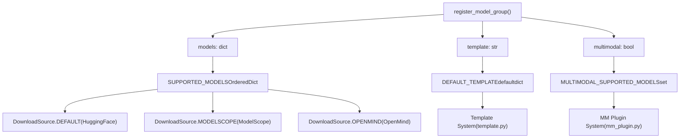
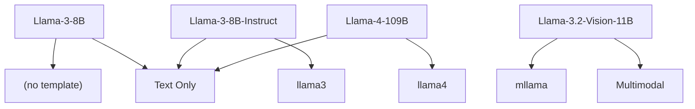
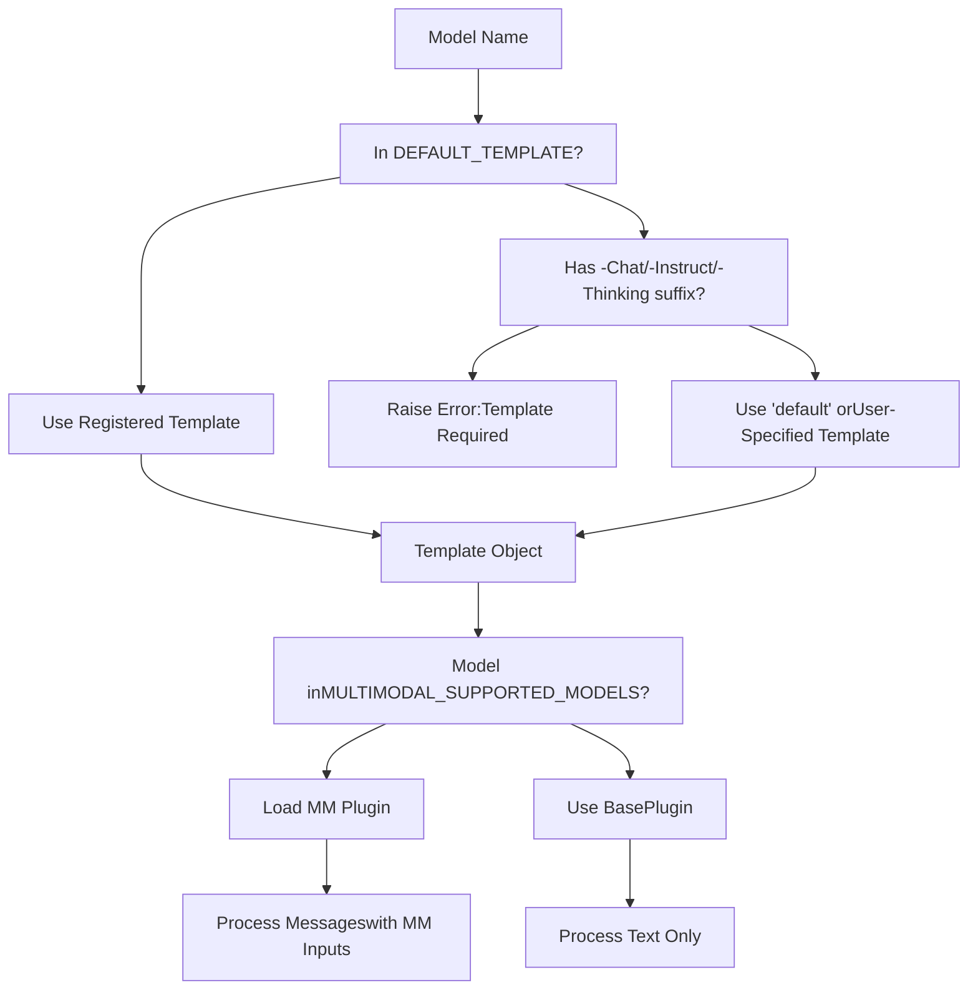
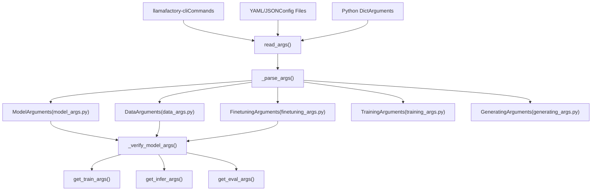
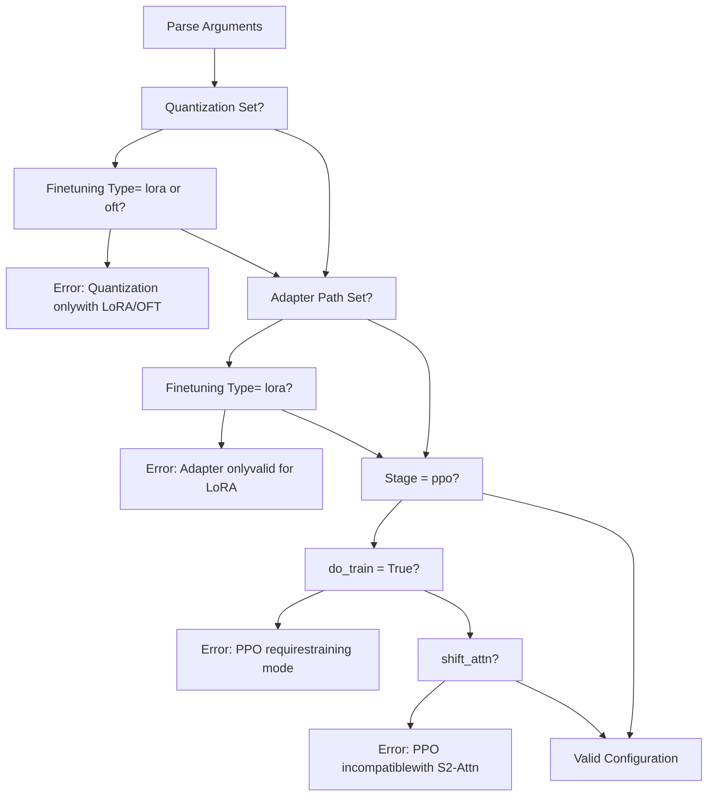
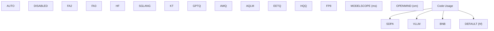
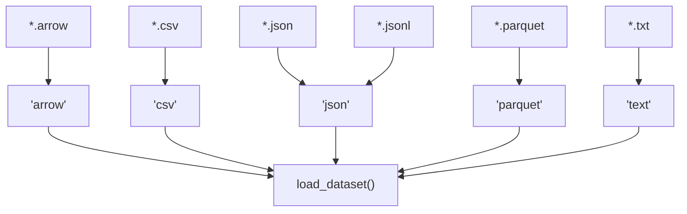
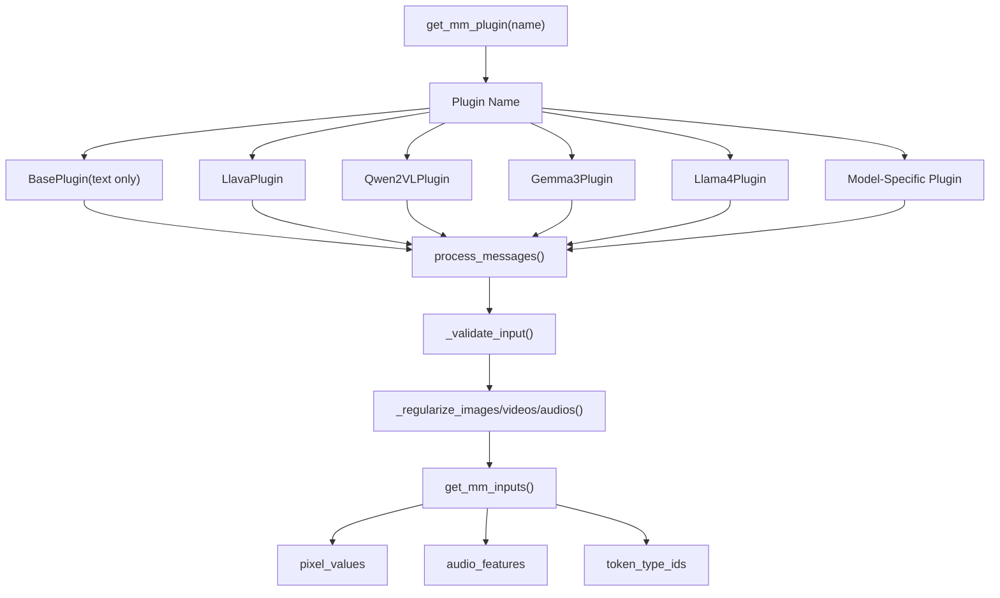
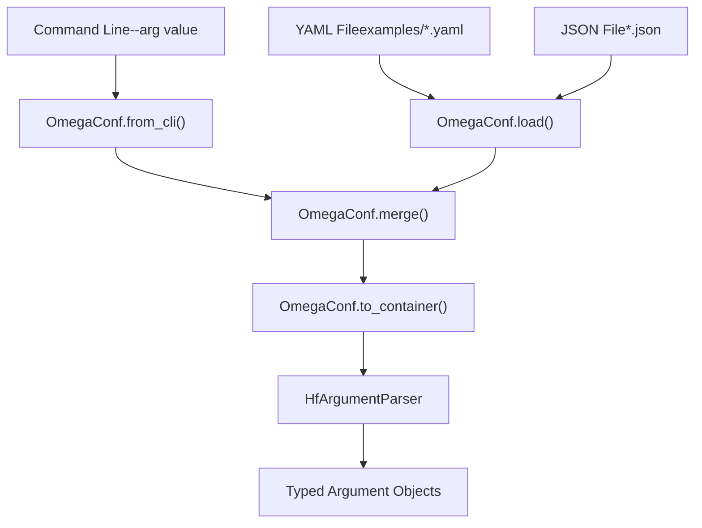
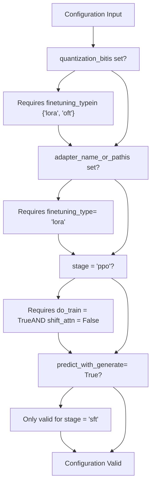

# Reference

Relevant source files

-   [README.md](https://github.com/hiyouga/LlamaFactory/blob/355d5c5e/README.md?plain=1)
-   [README\_zh.md](https://github.com/hiyouga/LlamaFactory/blob/355d5c5e/README_zh.md?plain=1)
-   [src/llamafactory/data/collator.py](https://github.com/hiyouga/LlamaFactory/blob/355d5c5e/src/llamafactory/data/collator.py)
-   [src/llamafactory/data/mm\_plugin.py](https://github.com/hiyouga/LlamaFactory/blob/355d5c5e/src/llamafactory/data/mm_plugin.py)
-   [src/llamafactory/data/template.py](https://github.com/hiyouga/LlamaFactory/blob/355d5c5e/src/llamafactory/data/template.py)
-   [src/llamafactory/extras/constants.py](https://github.com/hiyouga/LlamaFactory/blob/355d5c5e/src/llamafactory/extras/constants.py)
-   [src/llamafactory/hparams/parser.py](https://github.com/hiyouga/LlamaFactory/blob/355d5c5e/src/llamafactory/hparams/parser.py)
-   [src/llamafactory/model/model\_utils/misc.py](https://github.com/hiyouga/LlamaFactory/blob/355d5c5e/src/llamafactory/model/model_utils/misc.py)
-   [src/llamafactory/model/model\_utils/visual.py](https://github.com/hiyouga/LlamaFactory/blob/355d5c5e/src/llamafactory/model/model_utils/visual.py)
-   [tests/data/test\_mm\_plugin.py](https://github.com/hiyouga/LlamaFactory/blob/355d5c5e/tests/data/test_mm_plugin.py)
-   [tests/version.txt](https://github.com/hiyouga/LlamaFactory/blob/355d5c5e/tests/version.txt)

## Purpose and Scope

This section provides quick-lookup reference material for LlamaFactory's supported models, dataset formats, and configuration parameters. Use this documentation to:

-   Find which models are supported and their corresponding templates
-   Understand dataset format specifications and the `dataset_info.json` schema
-   Look up all available configuration parameters with their types, defaults, and valid values

For detailed information about specific subsystems:

-   For model loading and configuration details, see [Model Loading and Configuration](/hiyouga/LlamaFactory/5-model-loading-and-configuration)
-   For data pipeline implementation, see [Data Pipeline](/hiyouga/LlamaFactory/4-data-pipeline)
-   For training configuration in practice, see [Training System](/hiyouga/LlamaFactory/6-training-system)

The reference material is organized into three main sections:

-   [Supported Models](/hiyouga/LlamaFactory/10.1-supported-models): Complete registry of 100+ supported models with templates and capabilities
-   [Dataset Format Reference](/hiyouga/LlamaFactory/10.2-dataset-format-reference): Specification of dataset formats and `dataset_info.json` structure
-   [Configuration Parameter Reference](/hiyouga/LlamaFactory/10.3-configuration-parameter-reference): Exhaustive parameter listing for all argument types

---

## Model Registry System

LlamaFactory maintains a centralized registry system for supported models, templates, and multimodal capabilities. The system uses dictionaries and enums defined in `constants.py` to map model names to download sources, templates, and special handling requirements.

### Model Registration Architecture


**Sources:** [src/llamafactory/extras/constants.py155-169](https://github.com/hiyouga/LlamaFactory/blob/355d5c5e/src/llamafactory/extras/constants.py#L155-L169)

The `register_model_group()` function is the entry point for registering new models. It populates three global registries:

| Registry | Type | Purpose |
| --- | --- | --- |
| `SUPPORTED_MODELS` | `OrderedDict[str, dict[DownloadSource, str]]` | Maps model names to download paths for each source |
| `DEFAULT_TEMPLATE` | `defaultdict[str, str]` | Maps model names to their default chat templates |
| `MULTIMODAL_SUPPORTED_MODELS` | `set[str]` | Tracks which models support multimodal inputs |

### Model Name Conventions

Models in the registry follow naming patterns that indicate their type:

-   Base models: e.g., `Llama-3-8B`, `Qwen2-7B`
-   Chat/Instruct models: Suffix with `-Chat`, `-Instruct`, `-Thinking` (automatically assigned templates)
-   Distilled models: Suffix with `-Distill`
-   Multimodal models: Include vision/audio capabilities (e.g., `Qwen2-VL`, `LLaVA`)

**Sources:** [src/llamafactory/extras/constants.py162-165](https://github.com/hiyouga/LlamaFactory/blob/355d5c5e/src/llamafactory/extras/constants.py#L162-L165)

### Example Model Registrations


**Sources:** [README.md277-333](https://github.com/hiyouga/LlamaFactory/blob/355d5c5e/README.md?plain=1#L277-L333) [src/llamafactory/extras/constants.py171-1690](https://github.com/hiyouga/LlamaFactory/blob/355d5c5e/src/llamafactory/extras/constants.py#L171-L1690)

---

## Template and Plugin System

Templates define how conversations are formatted for different models, while plugins handle multimodal inputs. These systems work together to prepare data for training and inference.

### Template Assignment Flow


**Sources:** [src/llamafactory/data/template.py40-58](https://github.com/hiyouga/LlamaFactory/blob/355d5c5e/src/llamafactory/data/template.py#L40-L58) [src/llamafactory/data/mm\_plugin.py145-191](https://github.com/hiyouga/LlamaFactory/blob/355d5c5e/src/llamafactory/data/mm_plugin.py#L145-L191)

### Composite Model Registry

For multimodal models, the system uses a `CompositeModel` dataclass to define component structure:

| Field | Purpose | Example |
| --- | --- | --- |
| `model_type` | Model architecture identifier | `"llava"`, `"qwen2_vl"` |
| `projector_key` | Path to multimodal projector | `"multi_modal_projector"` |
| `vision_model_keys` | Components to freeze for vision | `["vision_tower"]` |
| `language_model_keys` | Language model components | `["language_model", "lm_head"]` |
| `lora_conflict_keys` | Modules incompatible with LoRA | `["patch_embed"]` |

**Sources:** [src/llamafactory/model/model\_utils/visual.py40-82](https://github.com/hiyouga/LlamaFactory/blob/355d5c5e/src/llamafactory/model/model_utils/visual.py#L40-L82)

---

## Configuration Parameter Categories

Configuration parameters are organized into five typed argument classes, each handling a specific aspect of the system.

### Argument Type Hierarchy


**Sources:** [src/llamafactory/hparams/parser.py44-98](https://github.com/hiyouga/LlamaFactory/blob/355d5c5e/src/llamafactory/hparams/parser.py#L44-L98)

### Parameter Categories

| Category | Argument Class | Primary Concerns | Example Parameters |
| --- | --- | --- | --- |
| Model Selection | `ModelArguments` | Which model, quantization, adapters | `model_name_or_path`, `quantization_bit`, `adapter_name_or_path` |
| Data Processing | `DataArguments` | Datasets, templates, preprocessing | `dataset`, `template`, `cutoff_len`, `packing` |
| Fine-tuning Method | `FinetuningArguments` | LoRA/OFT/freeze settings, stage | `finetuning_type`, `lora_rank`, `stage` |
| Training Config | `TrainingArguments` | Learning rate, batch size, distributed | `learning_rate`, `per_device_train_batch_size`, `deepspeed` |
| Generation | `GeneratingArguments` | Sampling parameters for inference | `temperature`, `top_p`, `max_new_tokens` |

**Sources:** [src/llamafactory/hparams/parser.py49-54](https://github.com/hiyouga/LlamaFactory/blob/355d5c5e/src/llamafactory/hparams/parser.py#L49-L54)

### Cross-Parameter Validation

The parser performs validation checks across argument types to ensure compatibility:


**Sources:** [src/llamafactory/hparams/parser.py117-143](https://github.com/hiyouga/LlamaFactory/blob/355d5c5e/src/llamafactory/hparams/parser.py#L117-L143) [src/llamafactory/hparams/parser.py256-289](https://github.com/hiyouga/LlamaFactory/blob/355d5c5e/src/llamafactory/hparams/parser.py#L256-L289)

---

## Constants and Enums

The system uses various constants and enums for type safety and validation.

### Key Constants

| Constant | Type | Value | Purpose |
| --- | --- | --- | --- |
| `IMAGE_PLACEHOLDER` | `str` | `"<image>"` | Default image placeholder in prompts |
| `VIDEO_PLACEHOLDER` | `str` | `"<video>"` | Default video placeholder in prompts |
| `AUDIO_PLACEHOLDER` | `str` | `"<audio>"` | Default audio placeholder in prompts |
| `IGNORE_INDEX` | `int` | `-100` | Loss masking value |
| `DATA_CONFIG` | `str` | `"dataset_info.json"` | Dataset registry filename |
| `LLAMABOARD_CONFIG` | `str` | `"llamaboard_config.yaml"` | Web UI config filename |

**Sources:** [src/llamafactory/extras/constants.py24-56](https://github.com/hiyouga/LlamaFactory/blob/355d5c5e/src/llamafactory/extras/constants.py#L24-L56)

### Enums for Type Safety


**Sources:** [src/llamafactory/extras/constants.py112-153](https://github.com/hiyouga/LlamaFactory/blob/355d5c5e/src/llamafactory/extras/constants.py#L112-L153)

### Training Stage Registry

```
TRAINING_STAGES = {    "Supervised Fine-Tuning": "sft",    "Reward Modeling": "rm",    "PPO": "ppo",    "DPO": "dpo",    "KTO": "kto",    "Pre-Training": "pt",} STAGES_USE_PAIR_DATA = {"rm", "dpo"}
```
These constants map user-facing stage names to internal identifiers and specify which stages require paired preference data.

**Sources:** [src/llamafactory/extras/constants.py90-99](https://github.com/hiyouga/LlamaFactory/blob/355d5c5e/src/llamafactory/extras/constants.py#L90-L99)

---

## Dataset Format System

Datasets are registered in `dataset_info.json` files, which specify how to load and process each dataset. The format supports multiple file types and column mappings.

### File Type Support


**Sources:** [src/llamafactory/extras/constants.py41-48](https://github.com/hiyouga/LlamaFactory/blob/355d5c5e/src/llamafactory/extras/constants.py#L41-L48)

### Dataset Format Categories

LlamaFactory supports two primary conversation formats:

| Format | Structure | Use Case | Column Requirements |
| --- | --- | --- | --- |
| **Alpaca** | Single instruction-response pair | Simple QA, completions | `instruction`, `output`, optional `input`, `history` |
| **ShareGPT** | Multi-turn conversation list | Chat, dialogue | `conversations` with `from` and `value` fields |

For complete specifications, see [Dataset Format Reference](/hiyouga/LlamaFactory/10.2-dataset-format-reference).

**Sources:** [README.md388-463](https://github.com/hiyouga/LlamaFactory/blob/355d5c5e/README.md?plain=1#L388-L463)

---

## Multimodal Processing Pipeline

Multimodal models require special handling for images, videos, and audio. The `mm_plugin.py` module defines a plugin system for different architectures.

### Plugin Registration and Usage


**Sources:** [src/llamafactory/data/mm\_plugin.py145-191](https://github.com/hiyouga/LlamaFactory/blob/355d5c5e/src/llamafactory/data/mm_plugin.py#L145-L191) [src/llamafactory/data/mm\_plugin.py325-385](https://github.com/hiyouga/LlamaFactory/blob/355d5c5e/src/llamafactory/data/mm_plugin.py#L325-L385)

### Plugin Method Responsibilities

Each plugin implements three key methods:

| Method | Input | Output | Purpose |
| --- | --- | --- | --- |
| `process_messages()` | Raw messages with placeholders | Formatted messages | Replace `<image>`, `<video>`, `<audio>` with model-specific tokens |
| `process_token_ids()` | Token IDs and labels | Modified token IDs and labels | Insert special tokens (e.g., image tokens) at correct positions |
| `get_mm_inputs()` | Raw media files | Processor outputs | Call image/video/audio processor and return tensors |

**Sources:** [src/llamafactory/data/mm\_plugin.py192-220](https://github.com/hiyouga/LlamaFactory/blob/355d5c5e/src/llamafactory/data/mm_plugin.py#L192-L220) [src/llamafactory/data/mm\_plugin.py325-385](https://github.com/hiyouga/LlamaFactory/blob/355d5c5e/src/llamafactory/data/mm_plugin.py#L325-L385)

---

## Configuration File Structure

Configuration can be provided via YAML, JSON, or command-line arguments. All three formats are parsed into the same typed argument classes.

### Configuration Sources


**Sources:** [src/llamafactory/hparams/parser.py68-82](https://github.com/hiyouga/LlamaFactory/blob/355d5c5e/src/llamafactory/hparams/parser.py#L68-L82)

### Example Configuration Structure

```
# Model selectionmodel_name_or_path: meta-llama/Llama-3-8B-Instructtemplate: llama3 # Data processing  dataset: alpaca_encutoff_len: 2048packing: true # Fine-tuning methodfinetuning_type: loralora_rank: 16lora_target: all # Trainingstage: sftlearning_rate: 5e-5num_train_epochs: 3per_device_train_batch_size: 2 # Generation (for evaluation)temperature: 0.7top_p: 0.9max_new_tokens: 512
```
**Sources:** [examples/ directory](https://github.com/hiyouga/LlamaFactory/blob/355d5c5e/examples/ directory)

---

## Validation Rules

The system enforces compatibility rules between different parameters to prevent invalid configurations.

### Key Validation Rules


| Constraint | Rationale |
| --- | --- |
| Quantization requires LoRA/OFT | Quantized models cannot be fully fine-tuned |
| PPO requires training mode | Evaluation not supported for PPO |
| PPO incompatible with S²-Attn | Technical limitation |
| `predict_with_generate` only for SFT | Other stages don't support generation |

**Sources:** [src/llamafactory/hparams/parser.py117-143](https://github.com/hiyouga/LlamaFactory/blob/355d5c5e/src/llamafactory/hparams/parser.py#L117-L143) [src/llamafactory/hparams/parser.py256-289](https://github.com/hiyouga/LlamaFactory/blob/355d5c5e/src/llamafactory/hparams/parser.py#L256-L289)

---

## Quick Reference Tables

### Supported Model Categories

| Category | Count | Example Models | Default Templates |
| --- | --- | --- | --- |
| Base LLMs | 30+ | Llama-3, Qwen2, Mistral | `default`, user-specified |
| Chat/Instruct | 70+ | Llama-3-Instruct, Qwen2-Chat | Auto-assigned from registry |
| Multimodal VLMs | 20+ | LLaVA, Qwen2-VL, Gemma3 | Specialized templates |
| Code Models | 10+ | DeepSeek-Coder, CodeGemma | Model-specific |
| MoE Models | 8+ | Mixtral, DeepSeek-MoE | Specialized handling |

See [Supported Models](/hiyouga/LlamaFactory/10.1-supported-models) for the complete list.

### Configuration Parameter Groups

| Group | Count | Key Parameters |
| --- | --- | --- |
| Model Args | 30+ | `model_name_or_path`, `quantization_bit`, `adapter_name_or_path`, `attention_implementation` |
| Data Args | 25+ | `dataset`, `template`, `cutoff_len`, `packing`, `train_on_prompt` |
| Finetuning Args | 40+ | `finetuning_type`, `lora_rank`, `lora_target`, `stage`, `use_galore` |
| Training Args | 100+ | `learning_rate`, `batch_size`, `num_train_epochs`, `deepspeed`, `fsdp` |
| Generating Args | 15+ | `temperature`, `top_p`, `top_k`, `max_new_tokens`, `repetition_penalty` |

See [Configuration Parameter Reference](/hiyouga/LlamaFactory/10.3-configuration-parameter-reference) for exhaustive listings.

### Inference Backend Options

| Backend | Enum Value | Use Case | Speed | Memory |
| --- | --- | --- | --- | --- |
| HuggingFace | `EngineName.HF` | Development, full features | Baseline | Baseline |
| vLLM | `EngineName.VLLM` | Production, high throughput | 270%+ | Optimized |
| SGLang | `EngineName.SGLANG` | HTTP server deployment | High | Optimized |
| KTransformers | `EngineName.KT` | CPU-GPU hybrid | Variable | CPU offload |

**Sources:** [src/llamafactory/extras/constants.py120-125](https://github.com/hiyouga/LlamaFactory/blob/355d5c5e/src/llamafactory/extras/constants.py#L120-L125) [README.md102](https://github.com/hiyouga/LlamaFactory/blob/355d5c5e/README.md?plain=1#L102-L102)

---

## Navigation

For detailed reference material:

-   **[Supported Models](/hiyouga/LlamaFactory/10.1-supported-models)**: Complete list of 100+ models with templates, capabilities, and download sources
-   **[Dataset Format Reference](/hiyouga/LlamaFactory/10.2-dataset-format-reference)**: Specification of `dataset_info.json` and column mapping formats
-   **[Configuration Parameter Reference](/hiyouga/LlamaFactory/10.3-configuration-parameter-reference)**: Exhaustive listing of all parameters with types and defaults

For implementation details:

-   Model loading: [Model Loading and Configuration](/hiyouga/LlamaFactory/5-model-loading-and-configuration)
-   Data processing: [Data Pipeline](/hiyouga/LlamaFactory/4-data-pipeline)
-   Training configuration: [Training System](/hiyouga/LlamaFactory/6-training-system)
-   Inference: [Inference and Deployment](/hiyouga/LlamaFactory/7-inference-and-deployment)

**Sources:** [README.md1-91](https://github.com/hiyouga/LlamaFactory/blob/355d5c5e/README.md?plain=1#L1-L91) [src/llamafactory/extras/constants.py1-1690](https://github.com/hiyouga/LlamaFactory/blob/355d5c5e/src/llamafactory/extras/constants.py#L1-L1690) [src/llamafactory/hparams/parser.py1-442](https://github.com/hiyouga/LlamaFactory/blob/355d5c5e/src/llamafactory/hparams/parser.py#L1-L442) [src/llamafactory/data/template.py1-400](https://github.com/hiyouga/LlamaFactory/blob/355d5c5e/src/llamafactory/data/template.py#L1-L400) [src/llamafactory/data/mm\_plugin.py1-900](https://github.com/hiyouga/LlamaFactory/blob/355d5c5e/src/llamafactory/data/mm_plugin.py#L1-L900)
