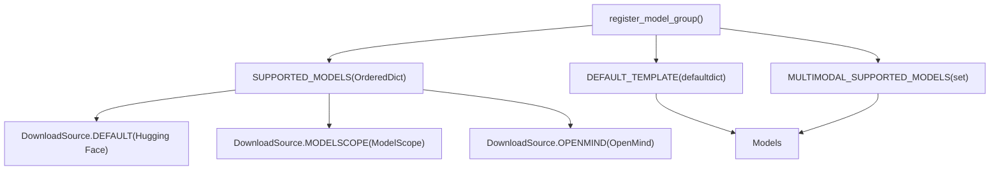
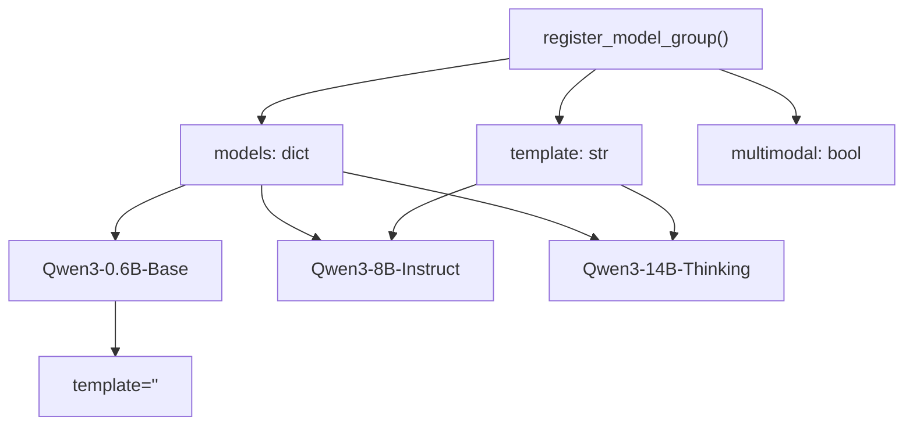
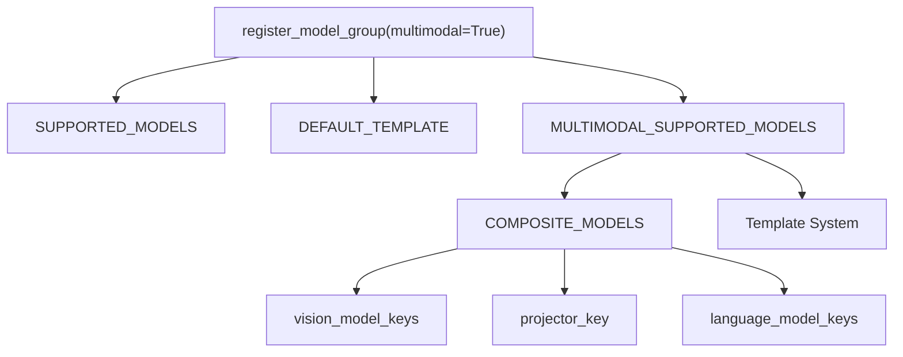
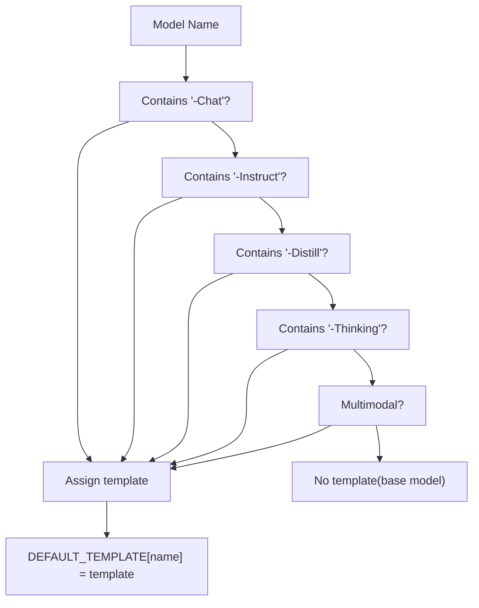

# Supported Models

Relevant source files

-   [README.md](https://github.com/hiyouga/LlamaFactory/blob/355d5c5e/README.md?plain=1)
-   [README\_zh.md](https://github.com/hiyouga/LlamaFactory/blob/355d5c5e/README_zh.md?plain=1)
-   [src/llamafactory/data/collator.py](https://github.com/hiyouga/LlamaFactory/blob/355d5c5e/src/llamafactory/data/collator.py)
-   [src/llamafactory/data/mm\_plugin.py](https://github.com/hiyouga/LlamaFactory/blob/355d5c5e/src/llamafactory/data/mm_plugin.py)
-   [src/llamafactory/data/template.py](https://github.com/hiyouga/LlamaFactory/blob/355d5c5e/src/llamafactory/data/template.py)
-   [src/llamafactory/extras/constants.py](https://github.com/hiyouga/LlamaFactory/blob/355d5c5e/src/llamafactory/extras/constants.py)
-   [src/llamafactory/hparams/parser.py](https://github.com/hiyouga/LlamaFactory/blob/355d5c5e/src/llamafactory/hparams/parser.py)
-   [src/llamafactory/model/model\_utils/misc.py](https://github.com/hiyouga/LlamaFactory/blob/355d5c5e/src/llamafactory/model/model_utils/misc.py)
-   [src/llamafactory/model/model\_utils/visual.py](https://github.com/hiyouga/LlamaFactory/blob/355d5c5e/src/llamafactory/model/model_utils/visual.py)
-   [tests/data/test\_mm\_plugin.py](https://github.com/hiyouga/LlamaFactory/blob/355d5c5e/tests/data/test_mm_plugin.py)
-   [tests/version.txt](https://github.com/hiyouga/LlamaFactory/blob/355d5c5e/tests/version.txt)

This page provides a comprehensive reference for all models supported by LlamaFactory. It documents the model registry system, model capabilities, default templates, and how models are organized and configured within the codebase.

For information about chat templates and formatting, see [Dataset Formats and Templates](/hiyouga/LlamaFactory/4.2-dataset-formats-and-templates). For model loading and configuration details, see [Model Loading Pipeline](/hiyouga/LlamaFactory/5.1-model-loading-pipeline).

---

## Model Registry System

LlamaFactory maintains a centralized model registry that maps model names to download sources and assigns default templates for instruction-tuned models. The registry is implemented through a registration system that organizes models by family.

### Core Registry Components

The model registry consists of three primary data structures defined in [src/llamafactory/extras/constants.py84-169](https://github.com/hiyouga/LlamaFactory/blob/355d5c5e/src/llamafactory/extras/constants.py#L84-L169):


**Diagram: Model Registry Architecture**

The `register_model_group()` function is the entry point for adding models to the registry:

-   **`SUPPORTED_MODELS`**: Maps model names to download paths for each hub (Hugging Face, ModelScope, OpenMind)
-   **`DEFAULT_TEMPLATE`**: Automatically assigns templates to models with names ending in `-Chat`, `-Instruct`, `-Thinking`, or multimodal models
-   **`MULTIMODAL_SUPPORTED_MODELS`**: Tracks which models support image/video/audio inputs

**Sources:** [src/llamafactory/extras/constants.py84-169](https://github.com/hiyouga/LlamaFactory/blob/355d5c5e/src/llamafactory/extras/constants.py#L84-L169)

---

## Model Organization

### Registration Pattern

Models are registered in family groups using a consistent pattern. Here's an example from the Qwen3 family:


**Diagram: Model Family Registration Example**

The registration logic applies templates selectively:

-   **Base models**: No default template assigned (use `default`, `alpaca`, `vicuna`, etc.)
-   **Instruct/Chat models**: Automatically receive the family template (`qwen3`, `llama3`, etc.)
-   **Thinking models**: Special suffix models that include reasoning capabilities
-   **Multimodal models**: Flagged with `multimodal=True` to enable visual/audio processing

**Sources:** [src/llamafactory/extras/constants.py155-169](https://github.com/hiyouga/LlamaFactory/blob/355d5c5e/src/llamafactory/extras/constants.py#L155-L169)

---

## Download Sources

Each model in the registry can be accessed from multiple hubs. The system supports three download sources:

| Source | Enum Value | Typical Hub |
| --- | --- | --- |
| **Default** | `DownloadSource.DEFAULT` | Hugging Face Hub |
| **ModelScope** | `DownloadSource.MODELSCOPE` | ModelScope (Alibaba) |
| **OpenMind** | `DownloadSource.OPENMIND` | OpenMind Hub |

Models specify paths for each available source:

```
# Example from constants.py"Qwen3-8B-Instruct": {    DownloadSource.DEFAULT: "Qwen/Qwen3-8B-Instruct",    DownloadSource.MODELSCOPE: "Qwen/Qwen3-8B-Instruct",}
```
Users can select the download source via the `download_source` parameter in `ModelArguments`. The model loader automatically fetches from the appropriate hub.

**Sources:** [src/llamafactory/extras/constants.py127-131](https://github.com/hiyouga/LlamaFactory/blob/355d5c5e/src/llamafactory/extras/constants.py#L127-L131)

---

## Complete Model List

LlamaFactory supports **100+ language models** spanning multiple model families and parameter sizes. Models are categorized by family, with size variants and specialized versions.

### Model Families and Templates

The following table lists major model families with their parameter ranges and assigned templates:

| Model Family | Parameter Sizes | Template(s) | Multimodal |
| --- | --- | --- | --- |
| **BLOOM/BLOOMZ** | 560M, 1.1B, 1.7B, 3B, 7.1B, 176B | `-` | No |
| **Command R** | 35B, 104B | `cohere` | No |
| **DeepSeek (LLM/Code/MoE)** | 7B, 16B, 67B, 236B | `deepseek` | No |
| **DeepSeek 3-3.2** | 236B, 671B | `deepseek3` | No |
| **DeepSeek R1 (Distill)** | 1.5B, 7B, 8B, 14B, 32B, 70B, 671B | `deepseekr1` | No |
| **ERNIE-4.5** | 0.3B, 21B, 300B | `ernie`, `ernie_nothink` | No |
| **Falcon/Falcon H1** | 0.5B, 1.5B, 3B, 7B, 11B, 34B, 40B, 180B | `falcon`, `falcon_h1` | No |
| **Gemma/Gemma 2/CodeGemma** | 2B, 7B, 9B, 27B | `gemma`, `gemma2` | No |
| **Gemma 3/Gemma 3n** | 270M, 1B, 4B, 6B, 8B, 12B, 27B | `gemma3`, `gemma3n` | Yes (3n) |
| **GLM-4/GLM-Z1** | 9B, 32B | `glm4`, `glmz1` | No |
| **GLM-4.5/GLM-4.5V** | 9B, 106B, 355B | `glm4_moe`, `glm4_5v` | Yes (4.5V) |
| **GPT-2** | 0.1B, 0.4B, 0.8B, 1.5B | `-` | No |
| **GPT-OSS** | 20B, 120B | `gpt_oss` | No |
| **Granite 3-4** | 1B, 2B, 3B, 7B, 8B | `granite3`, `granite4` | No |
| **InternLM 2-3** | 7B, 8B, 20B | `intern2` | No |
| **InternVL 2.5-3.5** | 1B, 2B, 4B, 8B, 14B, 30B, 38B, 78B, 241B | `intern_vl` | Yes |
| **Intern-S1-mini** | 8B | `intern_s1` | No |
| **Kimi-VL** | 16B | `kimi_vl` | Yes |
| **Llama** | 7B, 13B, 33B, 65B | `-` | No |
| **Llama 2** | 7B, 13B, 70B | `llama2` | No |
| **Llama 3-3.3** | 1B, 3B, 8B, 70B | `llama3` | No |
| **Llama 4** | 109B, 402B | `llama4` | Yes |
| **Llama 3.2 Vision** | 11B, 90B | `mllama` | Yes |
| **LLaVA-1.5** | 7B, 13B | `llava` | Yes |
| **LLaVA-NeXT** | 7B, 8B, 13B, 34B, 72B, 110B | `llava_next` | Yes |
| **LLaVA-NeXT-Video** | 7B, 34B | `llava_next_video` | Yes |
| **MiniCPM 1-4.1** | 0.5B, 1B, 2B, 4B, 8B | `cpm`, `cpm3`, `cpm4` | No |
| **MiniCPM-o-2.6/V-2.6** | 8B | `minicpm_o`, `minicpm_v` | Yes |
| **MiniMax-M1/M2** | 229B, 456B | `minimax1`, `minimax2` | No |
| **Mistral/Mixtral** | 7B, 8x7B, 8x22B | `mistral` | No |
| **Phi-3/Phi-3.5** | 4B, 14B | `phi` | No |
| **Phi-4** | 14B | `phi4` | No |
| **Pixtral** | 12B | `pixtral` | Yes |
| **Qwen (1-2.5)** | 0.5B, 1.5B, 3B, 7B, 14B, 32B, 72B, 110B | `qwen` | No |
| **Qwen3** | 0.6B, 1.7B, 4B, 8B, 14B, 32B, 80B, 235B | `qwen3`, `qwen3_nothink` | No |
| **Qwen2-Audio** | 7B | `qwen2_audio` | Yes (audio) |
| **Qwen2.5-Omni** | 3B, 7B | `qwen2_omni` | Yes (audio) |
| **Qwen3-Omni** | 30B | `qwen3_omni` | Yes (audio) |
| **Qwen2-VL/Qwen2.5-VL** | 2B, 3B, 7B, 32B, 72B | `qwen2_vl` | Yes |
| **Qwen3-VL** | 2B, 4B, 8B, 30B, 32B, 235B | `qwen3_vl` | Yes |
| **Yi/Yi-1.5** | 1.5B, 6B, 9B, 34B | `yi` | No |

> **Note:** For base models without an assigned template, use `template: default`, `template: alpaca`, or `template: vicuna` depending on your use case. For instruct/chat models, always use the corresponding template shown in the table.

**Sources:** [README.md277-333](https://github.com/hiyouga/LlamaFactory/blob/355d5c5e/README.md?plain=1#L277-L333) [src/llamafactory/extras/constants.py171](https://github.com/hiyouga/LlamaFactory/blob/355d5c5e/src/llamafactory/extras/constants.py#L171-LNaN)

---

## Multimodal Model Support

### Multimodal Model Registry

Models with visual, video, or audio capabilities are tracked separately in the `MULTIMODAL_SUPPORTED_MODELS` set. When a model is registered with `multimodal=True`, it's automatically added to this set.


**Diagram: Multimodal Model Registration and Configuration**

### Composite Model Configuration

Multimodal models require additional configuration to identify their component modules. This is handled by the `COMPOSITE_MODELS` registry in [src/llamafactory/model/model\_utils/visual.py55-81](https://github.com/hiyouga/LlamaFactory/blob/355d5c5e/src/llamafactory/model/model_utils/visual.py#L55-L81):

```
@dataclassclass CompositeModel:    model_type: str    projector_key: str                # e.g., "multi_modal_projector"    vision_model_keys: list[str]      # e.g., ["vision_tower"]    language_model_keys: list[str]    # e.g., ["language_model", "lm_head"]    lora_conflict_keys: list[str]     # modules to avoid in LoRA
```
This configuration enables:

-   **Freezing vision components** during fine-tuning (`freeze_vision_tower`)
-   **Selective LoRA application** (excluding vision modules)
-   **Proper gradient flow** in mixed-modality training

### Multimodal Model Examples

| Model Type | Image | Video | Audio | Template |
| --- | --- | --- | --- | --- |
| **LLaVA-1.5** | ✓ | ✗ | ✗ | `llava` |
| **LLaVA-NeXT-Video** | ✓ | ✓ | ✗ | `llava_next_video` |
| **Qwen2-VL** | ✓ | ✓ | ✗ | `qwen2_vl` |
| **Qwen2-Audio** | ✗ | ✗ | ✓ | `qwen2_audio` |
| **Qwen2.5-Omni** | ✓ | ✗ | ✓ | `qwen2_omni` |
| **MiniCPM-o-2.6** | ✓ | ✓ | ✓ | `minicpm_o` |
| **Llama 4** | ✓ | ✗ | ✗ | `llama4` |
| **Gemma 3n** | ✓ | ✗ | ✓ | `gemma3n` |

**Sources:** [src/llamafactory/extras/constants.py76-77](https://github.com/hiyouga/LlamaFactory/blob/355d5c5e/src/llamafactory/extras/constants.py#L76-L77) [src/llamafactory/model/model\_utils/visual.py55-332](https://github.com/hiyouga/LlamaFactory/blob/355d5c5e/src/llamafactory/model/model_utils/visual.py#L55-L332)

---

## Template Assignment Logic

### Automatic Template Selection

The `register_model_group()` function automatically assigns templates based on naming conventions:


**Diagram: Template Assignment Decision Tree**

This logic is implemented in [src/llamafactory/extras/constants.py155-169](https://github.com/hiyouga/LlamaFactory/blob/355d5c5e/src/llamafactory/extras/constants.py#L155-L169):

```
def register_model_group(    models: dict[str, dict[DownloadSource, str]],    template: str | None = None,    multimodal: bool = False,) -> None:    for name, path in models.items():        SUPPORTED_MODELS[name] = path        if template is not None and (            any(suffix in name for suffix in ("-Chat", "-Distill", "-Instruct", "-Thinking")) or multimodal        ):            DEFAULT_TEMPLATE[name] = template
```
### Template Suffixes for Special Models

Some model families use template suffixes to distinguish between reasoning and non-reasoning versions:

| Model Family | Standard Template | Thinking Template | Usage |
| --- | --- | --- | --- |
| **Qwen3** | `qwen3` | `qwen3_nothink` | Separate reasoning/non-reasoning modes |
| **ERNIE-4.5** | `ernie` | `ernie_nothink` | Distinguish thinking vs. pre-trained models |
| **DeepSeek R1** | `deepseekr1` | N/A | All variants use same reasoning template |

> **Important:** Always use the same template during training and inference. Mismatched templates will cause incorrect tokenization and poor model performance.

**Sources:** [README.md335-343](https://github.com/hiyouga/LlamaFactory/blob/355d5c5e/README.md?plain=1#L335-L343) [src/llamafactory/extras/constants.py155-169](https://github.com/hiyouga/LlamaFactory/blob/355d5c5e/src/llamafactory/extras/constants.py#L155-L169)

---

## Model Lookup and Usage

### Finding Model Information

The model registry provides programmatic access to model metadata:

```
from llamafactory.extras.constants import SUPPORTED_MODELS, DEFAULT_TEMPLATE, MULTIMODAL_SUPPORTED_MODELS # Check if model is supportedmodel_name = "Qwen3-8B-Instruct"if model_name in SUPPORTED_MODELS:    paths = SUPPORTED_MODELS[model_name]    hf_path = paths[DownloadSource.DEFAULT]    # Get default templatetemplate = DEFAULT_TEMPLATE[model_name]  # Returns "qwen3" # Check if multimodalis_multimodal = model_name in MULTIMODAL_SUPPORTED_MODELS
```
### Model Selection in Training

When configuring training, specify the model name and optionally override the template:

```
# training_config.yamlmodel_name_or_path: Qwen/Qwen3-8B-Instructtemplate: qwen3  # Optional: uses DEFAULT_TEMPLATE if omitted
```
The model loader automatically:

1.  Looks up the model in `SUPPORTED_MODELS`
2.  Selects download source based on `download_source` parameter
3.  Applies default template if not specified
4.  Configures multimodal plugins if the model is in `MULTIMODAL_SUPPORTED_MODELS`

**Sources:** [src/llamafactory/extras/constants.py84-169](https://github.com/hiyouga/LlamaFactory/blob/355d5c5e/src/llamafactory/extras/constants.py#L84-L169) [src/llamafactory/hparams/parser.py117-144](https://github.com/hiyouga/LlamaFactory/blob/355d5c5e/src/llamafactory/hparams/parser.py#L117-L144)

---

## Adding Custom Models

### Extending the Registry

To add a new model family, register it using `register_model_group()` in [src/llamafactory/extras/constants.py](https://github.com/hiyouga/LlamaFactory/blob/355d5c5e/src/llamafactory/extras/constants.py):

```
register_model_group(    models={        "YourModel-7B-Base": {            DownloadSource.DEFAULT: "org/model-7b-base",            DownloadSource.MODELSCOPE: "org/model-7b-base",        },        "YourModel-7B-Instruct": {            DownloadSource.DEFAULT: "org/model-7b-instruct",        },    },    template="yourmodel",  # Must match template name in template.py    multimodal=False,      # Set True for VLMs)
```
### Template Creation

If your model requires a custom chat format, add a template definition in [src/llamafactory/data/template.py](https://github.com/hiyouga/LlamaFactory/blob/355d5c5e/src/llamafactory/data/template.py):

1.  Define formatters for user/assistant/system messages
2.  Register the template with a unique name
3.  Use the same name in `register_model_group()`

For multimodal models, also register in [src/llamafactory/model/model\_utils/visual.py](https://github.com/hiyouga/LlamaFactory/blob/355d5c5e/src/llamafactory/model/model_utils/visual.py):

```
_register_composite_model(    model_type="yourmodel",    projector_key="multi_modal_projector",    vision_model_keys=["vision_tower"],    language_model_keys=["language_model", "lm_head"],)
```
**Sources:** [src/llamafactory/extras/constants.py155-169](https://github.com/hiyouga/LlamaFactory/blob/355d5c5e/src/llamafactory/extras/constants.py#L155-L169) [src/llamafactory/data/template.py334](https://github.com/hiyouga/LlamaFactory/blob/355d5c5e/src/llamafactory/data/template.py#L334-LNaN) [src/llamafactory/model/model\_utils/visual.py55-332](https://github.com/hiyouga/LlamaFactory/blob/355d5c5e/src/llamafactory/model/model_utils/visual.py#L55-L332)

---

## Special Model Configurations

### Mixture-of-Experts (MoE) Models

MoE models like DeepSeek-V2/V3 and Mixtral require special handling. Supported MoE models are tracked in [src/llamafactory/extras/constants.py58-70](https://github.com/hiyouga/LlamaFactory/blob/355d5c5e/src/llamafactory/extras/constants.py#L58-L70):

```
MCA_SUPPORTED_MODELS = {    "deepseek_v3",    "mixtral",    "qwen2",    "qwen2_vl",    # ... other MoE architectures}
```
For MoE models, consider using DeepSpeed Zero3 for efficient training on limited VRAM.

### Quantization Compatibility

Quantized model variants (4-bit, 8-bit) are listed separately in the registry when they differ from standard loading:

-   **4-bit models**: Often use GPTQ or AWQ quantization
-   **8-bit models**: Typically use LLM.int8 or HQQ
-   **Example**: `CommandR-35B-4bit-Chat` provides a pre-quantized checkpoint

Quantization can also be applied at load time via `quantization_bit` parameter (see [Quantization and Precision](/hiyouga/LlamaFactory/5.3-quantization-and-precision)).

**Sources:** [src/llamafactory/extras/constants.py58-75](https://github.com/hiyouga/LlamaFactory/blob/355d5c5e/src/llamafactory/extras/constants.py#L58-L75) [README.md242-244](https://github.com/hiyouga/LlamaFactory/blob/355d5c5e/README.md?plain=1#L242-L244)

---

## Model Verification

### Testing Model Support

Use the provided test suite to verify model configurations:

```
# Test multimodal plugin for a specific modelpytest tests/data/test_mm_plugin.py::test_llava_plugin # Run all model plugin testspytest tests/data/test_mm_plugin.py
```
The test suite verifies:

-   Message processing with placeholders (`<image>`, `<video>`, `<audio>`)
-   Token ID generation and label alignment
-   Multimodal input processing
-   Template expansion correctness

**Sources:** [tests/data/test\_mm\_plugin.py1](https://github.com/hiyouga/LlamaFactory/blob/355d5c5e/tests/data/test_mm_plugin.py#L1-LNaN)

---

## Summary

LlamaFactory's model registry provides:

-   **100+ supported models** across 30+ model families
-   **Automatic template assignment** for instruction-tuned models
-   **Multi-hub support** (Hugging Face, ModelScope, OpenMind)
-   **Multimodal capabilities** for 20+ vision/audio models
-   **Extensible architecture** for adding custom models

The centralized registry in `constants.py` ensures consistent model handling across training, inference, and evaluation workflows. All models are tested and verified for compatibility with the framework's training methods and optimization techniques.

For next steps, see [Dataset Formats and Templates](/hiyouga/LlamaFactory/4.2-dataset-formats-and-templates) to learn about chat formatting, or [Model Loading Pipeline](/hiyouga/LlamaFactory/5.1-model-loading-pipeline) for details on how models are loaded and configured.

**Sources:** [src/llamafactory/extras/constants.py84](https://github.com/hiyouga/LlamaFactory/blob/355d5c5e/src/llamafactory/extras/constants.py#L84-LNaN) [README.md277-348](https://github.com/hiyouga/LlamaFactory/blob/355d5c5e/README.md?plain=1#L277-L348) [src/llamafactory/model/model\_utils/visual.py55-332](https://github.com/hiyouga/LlamaFactory/blob/355d5c5e/src/llamafactory/model/model_utils/visual.py#L55-L332)
