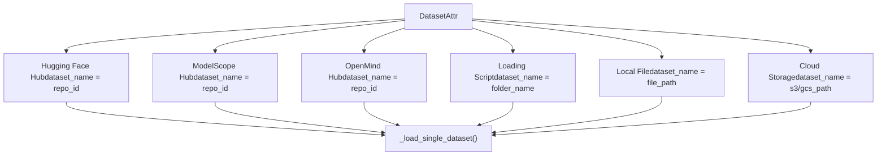
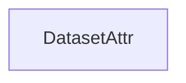
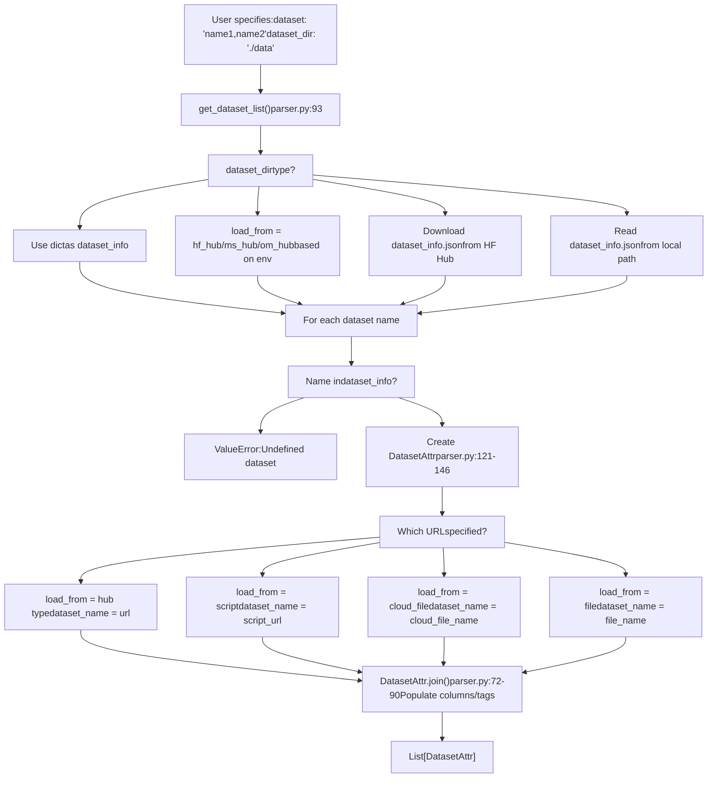
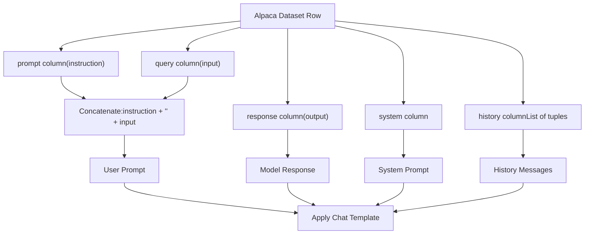
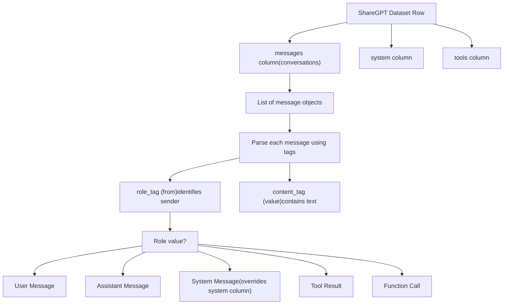
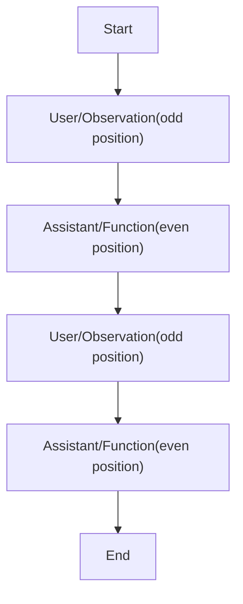
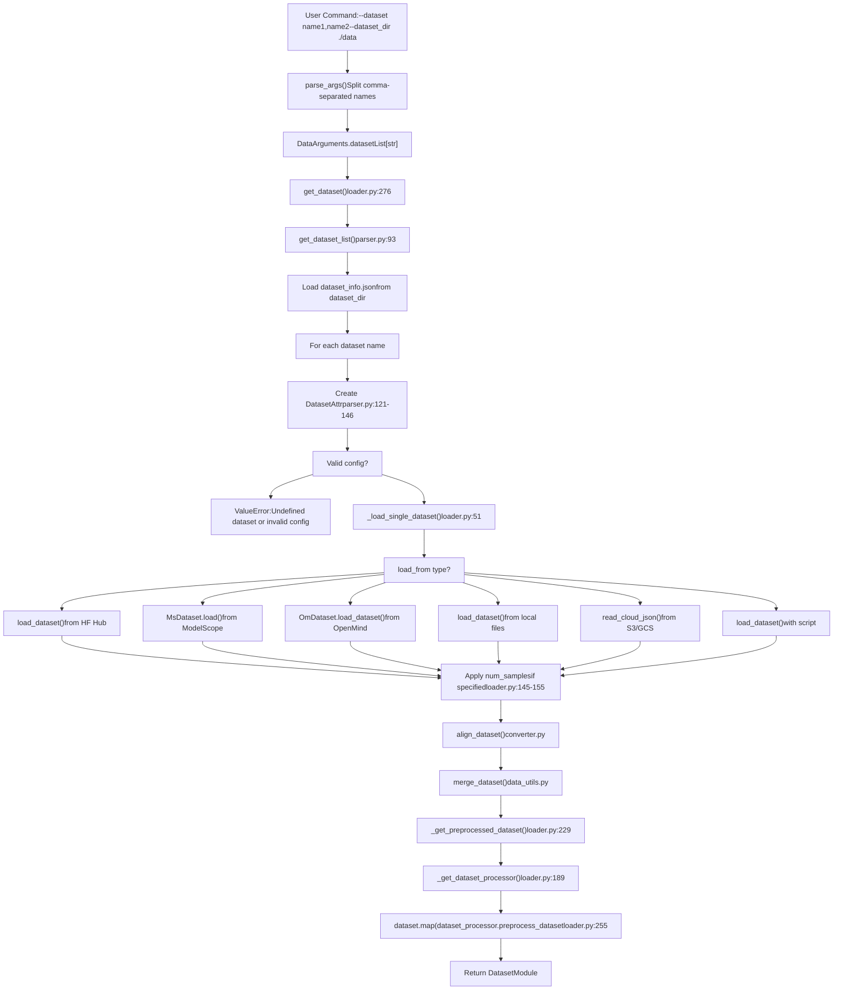

# Dataset Format Reference

Relevant source files

-   [data/README.md](https://github.com/hiyouga/LlamaFactory/blob/355d5c5e/data/README.md?plain=1)
-   [data/README\_zh.md](https://github.com/hiyouga/LlamaFactory/blob/355d5c5e/data/README_zh.md?plain=1)
-   [src/llamafactory/data/loader.py](https://github.com/hiyouga/LlamaFactory/blob/355d5c5e/src/llamafactory/data/loader.py)
-   [src/llamafactory/data/parser.py](https://github.com/hiyouga/LlamaFactory/blob/355d5c5e/src/llamafactory/data/parser.py)
-   [src/llamafactory/hparams/data\_args.py](https://github.com/hiyouga/LlamaFactory/blob/355d5c5e/src/llamafactory/hparams/data_args.py)
-   [src/llamafactory/webui/components/\_\_init\_\_.py](https://github.com/hiyouga/LlamaFactory/blob/355d5c5e/src/llamafactory/webui/components/__init__.py)
-   [src/llamafactory/webui/components/footer.py](https://github.com/hiyouga/LlamaFactory/blob/355d5c5e/src/llamafactory/webui/components/footer.py)

This document provides a comprehensive specification of dataset formats supported by LlamaFactory, the structure of the `dataset_info.json` configuration file, and the column/tag mappings used to parse datasets. This reference is intended for users preparing custom datasets or configuring dataset loading.

For information about the data processing pipeline and how datasets are tokenized, see [Data Pipeline](/hiyouga/LlamaFactory/4-data-pipeline). For guidance on using datasets in training, see [Getting Started](/hiyouga/LlamaFactory/2-getting-started).

---

## Overview of Dataset Configuration

LlamaFactory uses a centralized `dataset_info.json` file to register and configure datasets. This file must be placed in the directory specified by `dataset_dir` (default: `./data`) and defines metadata for each dataset including its source location, format, column mappings, and other attributes.

The system supports two primary dataset formats:

-   **Alpaca format**: Instruction-input-output structure
-   **ShareGPT format**: Multi-turn conversation structure with role tags

Supported file types include: `json`, `jsonl`, `csv`, `parquet`, and `arrow`.

**Sources:** [data/README.md1-5](https://github.com/hiyouga/LlamaFactory/blob/355d5c5e/data/README.md?plain=1#L1-L5) [src/llamafactory/hparams/data\_args.py38-41](https://github.com/hiyouga/LlamaFactory/blob/355d5c5e/src/llamafactory/hparams/data_args.py#L38-L41)

---

## Dataset Source Types

Datasets can be loaded from six different source types, determined by the `load_from` field in `DatasetAttr`:


| Source Type | Configuration Key | Description | Example |
| --- | --- | --- | --- |
| `hf_hub` | `hf_hub_url` | Hugging Face dataset repository | `"yahma/alpaca-cleaned"` |
| `ms_hub` | `ms_hub_url` | ModelScope dataset repository | `"modelscope/alpaca-gpt4-data"` |
| `om_hub` | `om_hub_url` | OpenMind dataset repository | `"openmind/dataset-name"` |
| `script` | `script_url` | Local folder with dataset loading script | `"custom_loader"` |
| `file` | `file_name` | Local file or folder path | `"alpaca_data.json"` |
| `cloud_file` | `cloud_file_name` | S3 or GCS cloud storage path | `"s3://bucket/data.json"` |

The priority order (if multiple are specified): `hf_hub_url` / `ms_hub_url` / `om_hub_url` > `script_url` > `cloud_file_name` > `file_name`.

**Sources:** [src/llamafactory/data/parser.py26-64](https://github.com/hiyouga/LlamaFactory/blob/355d5c5e/src/llamafactory/data/parser.py#L26-L64) [src/llamafactory/data/loader.py51-91](https://github.com/hiyouga/LlamaFactory/blob/355d5c5e/src/llamafactory/data/loader.py#L51-L91) [data/README.md8-13](https://github.com/hiyouga/LlamaFactory/blob/355d5c5e/data/README.md?plain=1#L8-L13)

---

## DatasetAttr Structure

The `DatasetAttr` class ([src/llamafactory/data/parser.py26-91](https://github.com/hiyouga/LlamaFactory/blob/355d5c5e/src/llamafactory/data/parser.py#L26-L91)) defines all dataset attributes. This is the internal representation after parsing `dataset_info.json`.


### Basic Configuration Fields

| Field | Type | Default | Description |
| --- | --- | --- | --- |
| `load_from` | `Literal` | (required) | Source type: `hf_hub`, `ms_hub`, `om_hub`, `script`, `file`, `cloud_file` |
| `dataset_name` | `str` | (required) | Repository ID, folder name, or file path depending on `load_from` |
| `formatting` | `Literal` | `"alpaca"` | Dataset format: `alpaca`, `sharegpt`, or `openai` |
| `ranking` | `bool` | `False` | Whether this is a preference dataset (for reward modeling, DPO, etc.) |

### Extra Configuration Fields

| Field | Type | Default | Description |
| --- | --- | --- | --- |
| `subset` | `str` | `None` | Dataset subset name (for datasets with multiple configurations) |
| `split` | `str` | `"train"` | Dataset split to use (`train`, `test`, `validation`, etc.) |
| `folder` | `str` | `None` | Folder within the repository (for Hugging Face datasets) |
| `num_samples` | `int` | `None` | Number of samples to use from the dataset (random sampling with replacement if needed) |

**Sources:** [src/llamafactory/data/parser.py26-65](https://github.com/hiyouga/LlamaFactory/blob/355d5c5e/src/llamafactory/data/parser.py#L26-L65) [data/README.md14-19](https://github.com/hiyouga/LlamaFactory/blob/355d5c5e/data/README.md?plain=1#L14-L19)

---

## Dataset Info JSON Format

The `dataset_info.json` file is a JSON object where each key is a dataset name and each value is a configuration object.

### Complete Schema

```
{  "dataset_name": {    "hf_hub_url": "string (optional)",    "ms_hub_url": "string (optional)",    "om_hub_url": "string (optional)",    "script_url": "string (optional)",    "cloud_file_name": "string (optional)",    "file_name": "string (optional, required if above are not specified)",    "formatting": "alpaca | sharegpt | openai (optional, default: alpaca)",    "ranking": "boolean (optional, default: false)",    "subset": "string (optional)",    "split": "string (optional, default: train)",    "folder": "string (optional)",    "num_samples": "integer (optional)",    "columns": {      "prompt": "string (optional, default: instruction)",      "query": "string (optional, default: input)",      "response": "string (optional, default: output)",      "history": "string (optional)",      "messages": "string (optional, default: conversations)",      "system": "string (optional)",      "tools": "string (optional)",      "images": "string (optional)",      "videos": "string (optional)",      "audios": "string (optional)",      "chosen": "string (optional)",      "rejected": "string (optional)",      "kto_tag": "string (optional)"    },    "tags": {      "role_tag": "string (optional, default: from)",      "content_tag": "string (optional, default: value)",      "user_tag": "string (optional, default: human)",      "assistant_tag": "string (optional, default: gpt)",      "observation_tag": "string (optional, default: observation)",      "function_tag": "string (optional, default: function_call)",      "system_tag": "string (optional, default: system)"    }  }}
```
### Configuration Parsing Flow


**Sources:** [src/llamafactory/data/parser.py93-149](https://github.com/hiyouga/LlamaFactory/blob/355d5c5e/src/llamafactory/data/parser.py#L93-L149) [data/README.md1-44](https://github.com/hiyouga/LlamaFactory/blob/355d5c5e/data/README.md?plain=1#L1-L44)

---

## Column Mappings

Column mappings allow datasets with different column names to be normalized to a standard internal representation. The `columns` object in `dataset_info.json` specifies which actual column names correspond to which semantic fields.

### Common Columns

| Semantic Field | Default Column Name | Used In | Description |
| --- | --- | --- | --- |
| `system` | `None` | All formats | System prompt (optional) |
| `tools` | `None` | All formats | Tool/function descriptions in JSON format (optional) |
| `images` | `None` | Multimodal | List of image file paths (optional) |
| `videos` | `None` | Multimodal | List of video file paths (optional) |
| `audios` | `None` | Multimodal | List of audio file paths (optional) |

### Alpaca Format Columns

| Semantic Field | Default Column Name | Required | Description |
| --- | --- | --- | --- |
| `prompt` | `"instruction"` | Yes | User instruction/prompt |
| `query` | `"input"` | No | Additional user input (concatenated with prompt) |
| `response` | `"output"` | Yes (SFT/PT) | Model response |
| `history` | `None` | No | List of `[instruction, response]` tuples for multi-turn history |

**Alpaca Format Structure:**


### ShareGPT Format Columns

| Semantic Field | Default Column Name | Required | Description |
| --- | --- | --- | --- |
| `messages` | `"conversations"` | Yes | List of message objects with role and content |

**ShareGPT Format Structure:**


### Preference Dataset Columns

| Semantic Field | Default Column Name | Required | Used In | Description |
| --- | --- | --- | --- | --- |
| `chosen` | `None` | Yes | DPO, ORPO, SimPO, RM | Better response (Alpaca) or message object (ShareGPT) |
| `rejected` | `None` | Yes | DPO, ORPO, SimPO, RM | Worse response (Alpaca) or message object (ShareGPT) |
| `kto_tag` | `None` | Yes | KTO | Boolean feedback (`true` = positive, `false` = negative) |

**Sources:** [src/llamafactory/data/parser.py40-64](https://github.com/hiyouga/LlamaFactory/blob/355d5c5e/src/llamafactory/data/parser.py#L40-L64) [data/README.md20-34](https://github.com/hiyouga/LlamaFactory/blob/355d5c5e/data/README.md?plain=1#L20-L34)

---

## Tag Mappings (ShareGPT Format)

Tags define how to parse message objects in ShareGPT format. They specify which keys identify the role and content, and which values represent different message types.

### Tag Configuration

| Tag | Default Value | Description |
| --- | --- | --- |
| `role_tag` | `"from"` | Key in message object that contains the role |
| `content_tag` | `"value"` | Key in message object that contains the text content |
| `user_tag` | `"human"` | Value of `role_tag` indicating a user message |
| `assistant_tag` | `"gpt"` | Value of `role_tag` indicating an assistant message |
| `observation_tag` | `"observation"` | Value of `role_tag` indicating tool output |
| `function_tag` | `"function_call"` | Value of `role_tag` indicating a function call |
| `system_tag` | `"system"` | Value of `role_tag` indicating a system prompt (overrides `system` column) |

### Example: OpenAI Format Mapping

OpenAI format uses `role`/`content` keys and `user`/`assistant`/`system` role values:

```
{  "dataset_name": {    "file_name": "openai_data.json",    "formatting": "sharegpt",    "columns": {      "messages": "messages"    },    "tags": {      "role_tag": "role",      "content_tag": "content",      "user_tag": "user",      "assistant_tag": "assistant",      "system_tag": "system"    }  }}
```
**Sources:** [src/llamafactory/data/parser.py57-64](https://github.com/hiyouga/LlamaFactory/blob/355d5c5e/src/llamafactory/data/parser.py#L57-L64) [data/README.md35-43](https://github.com/hiyouga/LlamaFactory/blob/355d5c5e/data/README.md?plain=1#L35-L43) [data/README.md460-477](https://github.com/hiyouga/LlamaFactory/blob/355d5c5e/data/README.md?plain=1#L460-L477)

---

## Alpaca Format Specification

### Supervised Fine-Tuning Dataset

**Data File Structure:**

```
[  {    "instruction": "user instruction (required)",    "input": "user input (optional)",    "output": "model response (required)",    "system": "system prompt (optional)",    "history": [      ["first round instruction (optional)", "first round response (optional)"],      ["second round instruction (optional)", "second round response (optional)"]    ]  }]
```
**Dataset Info Configuration:**

```
{  "dataset_name": {    "file_name": "alpaca_data.json",    "columns": {      "prompt": "instruction",      "query": "input",      "response": "output",      "system": "system",      "history": "history"    }  }}
```
**Key Points:**

-   The final user prompt is `instruction + "\n" + input` (if input is not empty)
-   The `output` column is the model's response that will be learned
-   History messages in the `history` column are **also learned** (not masked)
-   For reasoning models (e.g., Qwen3), if the dataset contains chain-of-thought (CoT), it should be in the format: `output`
-   If the model has reasoning capabilities but the dataset lacks CoT, LlamaFactory automatically adds empty CoT based on the `enable_thinking` parameter

**Sources:** [data/README.md49-95](https://github.com/hiyouga/LlamaFactory/blob/355d5c5e/data/README.md?plain=1#L49-L95)

---

### Pre-training Dataset

**Data File Structure:**

```
[  {"text": "document"},  {"text": "document"}]
```
**Dataset Info Configuration:**

```
{  "dataset_name": {    "file_name": "pretrain_data.jsonl",    "columns": {      "prompt": "text"    }  }}
```
**Key Points:**

-   Only the `text` column is used; it maps to the `prompt` field
-   No instruction-response structure; entire text is treated as a continuous sequence
-   Commonly used with streaming mode for large corpora

**Sources:** [data/README.md96-118](https://github.com/hiyouga/LlamaFactory/blob/355d5c5e/data/README.md?plain=1#L96-L118)

---

### Preference Dataset

**Data File Structure:**

```
[  {    "instruction": "user instruction (required)",    "input": "user input (optional)",    "chosen": "chosen answer (required)",    "rejected": "rejected answer (required)"  }]
```
**Dataset Info Configuration:**

```
{  "dataset_name": {    "file_name": "preference_data.json",    "ranking": true,    "columns": {      "prompt": "instruction",      "query": "input",      "chosen": "chosen",      "rejected": "rejected"    }  }}
```
**Key Points:**

-   The `ranking: true` flag is **required** for preference datasets
-   Used for reward modeling, DPO, ORPO, and SimPO training
-   `chosen` contains the better response; `rejected` contains the worse response
-   Both responses are for the same prompt

**Sources:** [data/README.md120-150](https://github.com/hiyouga/LlamaFactory/blob/355d5c5e/data/README.md?plain=1#L120-L150)

---

### KTO Dataset

**Data File Structure (Alpaca):**

```
[  {    "instruction": "user instruction (required)",    "input": "user input (optional)",    "output": "model response (required)",    "kto_tag": true  }]
```
**Dataset Info Configuration:**

```
{  "dataset_name": {    "file_name": "kto_data.json",    "columns": {      "prompt": "instruction",      "query": "input",      "response": "output",      "kto_tag": "kto_tag"    }  }}
```
**Key Points:**

-   `kto_tag` is a boolean indicating human feedback: `true` = positive, `false` = negative
-   Unlike preference datasets, KTO uses single responses with binary feedback
-   Used specifically for KTO (Kahneman-Tversky Optimization) training

**Sources:** [data/README.md152-154](https://github.com/hiyouga/LlamaFactory/blob/355d5c5e/data/README.md?plain=1#L152-L154) [data/README\_zh.md152-154](https://github.com/hiyouga/LlamaFactory/blob/355d5c5e/data/README_zh.md?plain=1#L152-L154)

---

### Multimodal Datasets (Images, Videos, Audios)

**Data File Structure:**

```
[  {    "instruction": "<image>describe this image",    "input": "",    "output": "model response",    "images": ["path/to/image1.jpg"]  }]
```
**Dataset Info Configuration:**

```
{  "dataset_name": {    "file_name": "multimodal_data.json",    "columns": {      "prompt": "instruction",      "query": "input",      "response": "output",      "images": "images"    }  }}
```
**Key Points:**

-   Use `<image>`, `<video>`, or `<audio>` tokens as placeholders in text
-   The number of tokens **must match** the number of paths in the corresponding list
-   Paths can be absolute or relative to `media_dir` (defaults to `dataset_dir`)
-   Supports multiple modalities simultaneously

**Column Names:**

-   Images: `images` column (list of image paths)
-   Videos: `videos` column (list of video paths)
-   Audios: `audios` column (list of audio paths)

**Sources:** [data/README.md156-166](https://github.com/hiyouga/LlamaFactory/blob/355d5c5e/data/README.md?plain=1#L156-L166) [src/llamafactory/hparams/data\_args.py42-45](https://github.com/hiyouga/LlamaFactory/blob/355d5c5e/src/llamafactory/hparams/data_args.py#L42-L45)

---

## ShareGPT Format Specification

### Supervised Fine-Tuning Dataset

**Data File Structure:**

```
[  {    "conversations": [      {        "from": "human",        "value": "user instruction"      },      {        "from": "function_call",        "value": "{\"name\": \"tool\", \"arguments\": {}}"      },      {        "from": "observation",        "value": "tool result"      },      {        "from": "gpt",        "value": "model response"      }    ],    "system": "system prompt (optional)",    "tools": "[{\"name\": \"tool\", \"description\": \"...\"}]"  }]
```
**Dataset Info Configuration:**

```
{  "dataset_name": {    "file_name": "sharegpt_data.json",    "formatting": "sharegpt",    "columns": {      "messages": "conversations",      "system": "system",      "tools": "tools"    }  }}
```
**Message Role Constraints:**


**Key Points:**

-   `human` and `observation` roles must appear in **odd positions** (1st, 3rd, 5th, ...)
-   `gpt` and `function_call` roles must appear in **even positions** (2nd, 4th, 6th, ...)
-   Only `gpt` and `function_call` messages are learned (have loss computed)
-   Supports tool/function calling workflows with `function_call` and `observation` roles

**Sources:** [data/README.md170-217](https://github.com/hiyouga/LlamaFactory/blob/355d5c5e/data/README.md?plain=1#L170-L217)

---

### Preference Dataset

**Data File Structure:**

```
[  {    "conversations": [      {        "from": "human",        "value": "user instruction"      },      {        "from": "gpt",        "value": "context response"      },      {        "from": "human",        "value": "follow-up instruction"      }    ],    "chosen": {      "from": "gpt",      "value": "chosen answer (required)"    },    "rejected": {      "from": "gpt",      "value": "rejected answer (required)"    }  }]
```
**Dataset Info Configuration:**

```
{  "dataset_name": {    "file_name": "dpo_data.json",    "formatting": "sharegpt",    "ranking": true,    "columns": {      "messages": "conversations",      "chosen": "chosen",      "rejected": "rejected"    }  }}
```
**Key Points:**

-   `ranking: true` is required
-   `chosen` and `rejected` are message objects, not plain strings
-   The `conversations` list provides context; final turn is where preference diverges

**Sources:** [data/README.md223-271](https://github.com/hiyouga/LlamaFactory/blob/355d5c5e/data/README.md?plain=1#L223-L271)

---

### KTO Dataset

**Data File Structure:**

```
[  {    "conversations": [      {        "from": "human",        "value": "user instruction"      },      {        "from": "gpt",        "value": "model response"      }    ],    "kto_tag": true  }]
```
**Dataset Info Configuration:**

```
{  "dataset_name": {    "file_name": "kto_data.json",    "formatting": "sharegpt",    "columns": {      "messages": "conversations",      "kto_tag": "kto_tag"    }  }}
```
**Key Points:**

-   Same as Alpaca KTO: `kto_tag` is a boolean for human feedback
-   Can include multi-turn context in `conversations`

**Sources:** [data/README.md273-308](https://github.com/hiyouga/LlamaFactory/blob/355d5c5e/data/README.md?plain=1#L273-L308)

---

### Multimodal Datasets (Images, Videos, Audios)

**Data File Structure (Images Example):**

```
[  {    "conversations": [      {        "from": "human",        "value": "<image><image>describe these images"      },      {        "from": "gpt",        "value": "model response"      }    ],    "images": [      "path/to/image1.jpg",      "path/to/image2.jpg"    ]  }]
```
**Dataset Info Configuration:**

```
{  "dataset_name": {    "file_name": "mllm_data.json",    "formatting": "sharegpt",    "columns": {      "messages": "conversations",      "images": "images"    }  }}
```
**Key Points:**

-   Use `<image>`, `<video>`, or `<audio>` tokens in message values
-   Token count must **strictly match** the number of paths
-   Same rules apply as Alpaca format regarding paths and `media_dir`

**Sources:** [data/README.md310-432](https://github.com/hiyouga/LlamaFactory/blob/355d5c5e/data/README.md?plain=1#L310-L432)

---

### OpenAI Format (Special Case)

OpenAI format is a standardized variant of ShareGPT format using specific role and content keys.

**Data File Structure:**

```
[  {    "messages": [      {        "role": "system",        "content": "system prompt (optional)"      },      {        "role": "user",        "content": "user instruction"      },      {        "role": "assistant",        "content": "model response"      }    ]  }]
```
**Dataset Info Configuration:**

```
{  "dataset_name": {    "file_name": "openai_data.json",    "formatting": "sharegpt",    "columns": {      "messages": "messages"    },    "tags": {      "role_tag": "role",      "content_tag": "content",      "user_tag": "user",      "assistant_tag": "assistant",      "system_tag": "system"    }  }}
```
**Key Points:**

-   First message can be a system prompt (role = "system")
-   Uses `role`/`content` instead of `from`/`value`
-   Requires explicit tag configuration to override defaults

**Sources:** [data/README.md433-476](https://github.com/hiyouga/LlamaFactory/blob/355d5c5e/data/README.md?plain=1#L433-L476)

---

## Complete Configuration Examples

### Example 1: Local Alpaca Dataset with Default Columns

```
{  "my_alpaca_dataset": {    "file_name": "my_data.json"  }}
```
This uses all default values:

-   `formatting`: `"alpaca"`
-   `columns.prompt`: `"instruction"`
-   `columns.query`: `"input"`
-   `columns.response`: `"output"`

### Example 2: Hugging Face Hub ShareGPT Dataset with Custom Columns

```
{  "my_custom_dataset": {    "hf_hub_url": "user/dataset-repo",    "subset": "default",    "split": "train",    "formatting": "sharegpt",    "columns": {      "messages": "dialogue",      "system": "sys_prompt"    }  }}
```
### Example 3: Preference Dataset with Sampling

```
{  "dpo_subset": {    "file_name": "preference_data.json",    "formatting": "sharegpt",    "ranking": true,    "num_samples": 10000,    "columns": {      "messages": "conversations",      "chosen": "winner",      "rejected": "loser"    }  }}
```
### Example 4: Multimodal Dataset from ModelScope

```
{  "vision_dataset": {    "ms_hub_url": "modelscope/visual-instruction-data",    "formatting": "sharegpt",    "columns": {      "messages": "conversations",      "images": "image_paths"    }  }}
```
### Example 5: Multiple Datasets from Different Sources

```
{  "alpaca_local": {    "file_name": "alpaca.json"  },  "sharegpt_hf": {    "hf_hub_url": "openchat/openchat_sharegpt4_dataset",    "formatting": "sharegpt"  },  "custom_dpo": {    "file_name": "dpo_pairs.jsonl",    "formatting": "alpaca",    "ranking": true,    "columns": {      "prompt": "question",      "chosen": "good_answer",      "rejected": "bad_answer"    }  }}
```
**Usage:**

```
llamafactory-cli train \  --dataset alpaca_local,sharegpt_hf,custom_dpo \  --dataset_dir ./data \  ...
```
**Sources:** [data/README.md1-476](https://github.com/hiyouga/LlamaFactory/blob/355d5c5e/data/README.md?plain=1#L1-L476) [src/llamafactory/data/parser.py93-149](https://github.com/hiyouga/LlamaFactory/blob/355d5c5e/src/llamafactory/data/parser.py#L93-L149)

---

## Dataset Loading and Validation Flow


**Key Validation Points:**

1.  **Dataset name lookup** ([src/llamafactory/data/parser.py125-126](https://github.com/hiyouga/LlamaFactory/blob/355d5c5e/src/llamafactory/data/parser.py#L125-L126)): Checks if dataset name exists in `dataset_info.json`
2.  **Column existence** (in `align_dataset`): Validates that specified column names exist in the loaded dataset
3.  **Format validation** (in processors): Ensures data conforms to expected structure for the training stage
4.  **Sample count** ([src/llamafactory/data/loader.py145-155](https://github.com/hiyouga/LlamaFactory/blob/355d5c5e/src/llamafactory/data/loader.py#L145-L155)): If `num_samples` exceeds dataset size, samples with replacement

**Sources:** [src/llamafactory/data/loader.py51-336](https://github.com/hiyouga/LlamaFactory/blob/355d5c5e/src/llamafactory/data/loader.py#L51-L336) [src/llamafactory/data/parser.py93-149](https://github.com/hiyouga/LlamaFactory/blob/355d5c5e/src/llamafactory/data/parser.py#L93-L149)

---

## Special Considerations

### Thinking Mode for Reasoning Models

For models with reasoning capabilities (e.g., Qwen3, Qwen2.5, DeepSeek-R1):

-   **With CoT in dataset**: Place CoT in model response as `output`
-   **Without CoT in dataset**: LlamaFactory auto-adds empty CoT based on `enable_thinking` parameter:
    -   `enable_thinking=True` (default): Empty CoT added to response (slow thinking, loss computed)
    -   `enable_thinking=False`: Empty CoT added to prompt (fast thinking, loss not computed)
    -   `enable_thinking=None`: Mixed mode (CoT data uses slow thinking, non-CoT data uses fast thinking)

**Sources:** [data/README.md91-94](https://github.com/hiyouga/LlamaFactory/blob/355d5c5e/data/README.md?plain=1#L91-L94)

### Sequence Packing

When `packing=True` in `DataArguments`:

-   Multiple sequences are packed into a single training example
-   Uses block-diagonal attention masks to prevent cross-attention between sequences
-   The `cutoff_len` is reduced by 1 to avoid padding issues ([src/llamafactory/hparams/data\_args.py182-183](https://github.com/hiyouga/LlamaFactory/blob/355d5c5e/src/llamafactory/hparams/data_args.py#L182-L183))

**Sources:** [src/llamafactory/hparams/data\_args.py106-113](https://github.com/hiyouga/LlamaFactory/blob/355d5c5e/src/llamafactory/hparams/data_args.py#L106-L113) [src/llamafactory/hparams/data\_args.py179-183](https://github.com/hiyouga/LlamaFactory/blob/355d5c5e/src/llamafactory/hparams/data_args.py#L179-L183)

### Dataset Mixing Strategies

When using multiple datasets (comma-separated in `dataset` argument):

| Strategy | Parameter | Description |
| --- | --- | --- |
| `concat` | `mix_strategy="concat"` | Concatenate datasets sequentially (default) |
| `interleave_under` | `mix_strategy="interleave_under"` + `interleave_probs` | Interleave with undersampling (smaller datasets sampled less) |
| `interleave_over` | `mix_strategy="interleave_over"` + `interleave_probs` | Interleave with oversampling (smaller datasets repeated) |

**Sources:** [src/llamafactory/hparams/data\_args.py66-73](https://github.com/hiyouga/LlamaFactory/blob/355d5c5e/src/llamafactory/hparams/data_args.py#L66-L73)

### Streaming Mode

When `streaming=True`:

-   Datasets are loaded as `IterableDataset` instead of `Dataset`
-   Enables processing of datasets too large to fit in memory
-   Incompatible with `max_samples` and fractional `val_size`
-   File-based datasets are converted to iterable with `to_iterable_dataset()`

**Sources:** [src/llamafactory/hparams/data\_args.py58-61](https://github.com/hiyouga/LlamaFactory/blob/355d5c5e/src/llamafactory/hparams/data_args.py#L58-L61) [src/llamafactory/data/loader.py142-143](https://github.com/hiyouga/LlamaFactory/blob/355d5c5e/src/llamafactory/data/loader.py#L142-L143)

---

## Troubleshooting Common Issues

### Issue: "Undefined dataset X in dataset\_info.json"

**Cause:** Dataset name specified in `--dataset` is not present in `dataset_info.json`

**Solution:** Add dataset configuration to `dataset_info.json` or check for typos

**Code Reference:** [src/llamafactory/data/parser.py125-126](https://github.com/hiyouga/LlamaFactory/blob/355d5c5e/src/llamafactory/data/parser.py#L125-L126)

---

### Issue: "Column 'X' not found in dataset"

**Cause:** The column specified in `columns` mapping does not exist in the loaded dataset file

**Solution:**

1.  Check the actual column names in your data file
2.  Update the `columns` mapping in `dataset_info.json` to match
3.  Or rename columns in your data file to match the defaults

**Code Reference:** [src/llamafactory/data/loader.py161](https://github.com/hiyouga/LlamaFactory/blob/355d5c5e/src/llamafactory/data/loader.py#L161-L161) (calls `align_dataset`)

---

### Issue: "File X not found"

**Cause:** The `file_name` path is incorrect or the file doesn't exist

**Solution:**

1.  Ensure the file exists in `dataset_dir`
2.  Check that `dataset_dir` parameter points to the correct directory
3.  Use absolute paths if necessary

**Code Reference:** [src/llamafactory/data/loader.py73-82](https://github.com/hiyouga/LlamaFactory/blob/355d5c5e/src/llamafactory/data/loader.py#L73-L82)

---

### Issue: "Number of images does not match  tokens"

**Cause:** Mismatch between the count of `<image>` tokens in text and the length of `images` list

**Solution:** Ensure each `<image>` token has a corresponding path in the `images` array

**Code Reference:** Referenced in multimodal processing (see [Multimodal Data Processing](/hiyouga/LlamaFactory/4.3-multimodal-data-processing))

---

### Issue: "The dataset is not applicable in the current training stage"

**Cause:** Using a ranking dataset (`ranking=true`) in a non-RM stage, or vice versa

**Solution:**

-   Use `ranking=true` only for RM, DPO, KTO, ORPO, SimPO training stages
-   Use `ranking=false` (or omit) for PT, SFT, PPO stages

**Code Reference:** [src/llamafactory/data/loader.py178-179](https://github.com/hiyouga/LlamaFactory/blob/355d5c5e/src/llamafactory/data/loader.py#L178-L179)

---

This completes the Dataset Format Reference. For information on how datasets flow through the processing pipeline, see [Data Pipeline](/hiyouga/LlamaFactory/4-data-pipeline). For configuration of training parameters, see [Configuration System](/hiyouga/LlamaFactory/3-configuration-system).
