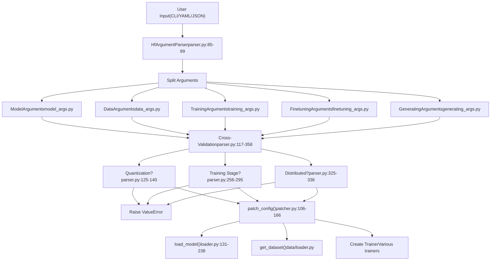
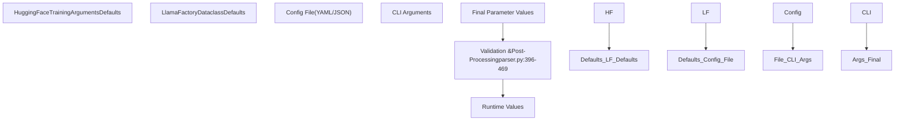

# Configuration Parameter Reference

Relevant source files

-   [README.md](https://github.com/hiyouga/LlamaFactory/blob/355d5c5e/README.md?plain=1)
-   [README\_zh.md](https://github.com/hiyouga/LlamaFactory/blob/355d5c5e/README_zh.md?plain=1)
-   [src/llamafactory/hparams/finetuning\_args.py](https://github.com/hiyouga/LlamaFactory/blob/355d5c5e/src/llamafactory/hparams/finetuning_args.py)
-   [src/llamafactory/hparams/model\_args.py](https://github.com/hiyouga/LlamaFactory/blob/355d5c5e/src/llamafactory/hparams/model_args.py)
-   [src/llamafactory/hparams/parser.py](https://github.com/hiyouga/LlamaFactory/blob/355d5c5e/src/llamafactory/hparams/parser.py)
-   [src/llamafactory/model/adapter.py](https://github.com/hiyouga/LlamaFactory/blob/355d5c5e/src/llamafactory/model/adapter.py)
-   [src/llamafactory/model/loader.py](https://github.com/hiyouga/LlamaFactory/blob/355d5c5e/src/llamafactory/model/loader.py)
-   [src/llamafactory/model/model\_utils/unsloth.py](https://github.com/hiyouga/LlamaFactory/blob/355d5c5e/src/llamafactory/model/model_utils/unsloth.py)
-   [src/llamafactory/model/patcher.py](https://github.com/hiyouga/LlamaFactory/blob/355d5c5e/src/llamafactory/model/patcher.py)
-   [src/llamafactory/train/dpo/trainer.py](https://github.com/hiyouga/LlamaFactory/blob/355d5c5e/src/llamafactory/train/dpo/trainer.py)
-   [src/llamafactory/train/kto/trainer.py](https://github.com/hiyouga/LlamaFactory/blob/355d5c5e/src/llamafactory/train/kto/trainer.py)
-   [src/llamafactory/train/ppo/trainer.py](https://github.com/hiyouga/LlamaFactory/blob/355d5c5e/src/llamafactory/train/ppo/trainer.py)
-   [src/llamafactory/train/pt/trainer.py](https://github.com/hiyouga/LlamaFactory/blob/355d5c5e/src/llamafactory/train/pt/trainer.py)
-   [src/llamafactory/train/rm/trainer.py](https://github.com/hiyouga/LlamaFactory/blob/355d5c5e/src/llamafactory/train/rm/trainer.py)
-   [src/llamafactory/train/sft/trainer.py](https://github.com/hiyouga/LlamaFactory/blob/355d5c5e/src/llamafactory/train/sft/trainer.py)
-   [src/llamafactory/train/trainer\_utils.py](https://github.com/hiyouga/LlamaFactory/blob/355d5c5e/src/llamafactory/train/trainer_utils.py)

This page provides a comprehensive reference for all configuration parameters available in LlamaFactory. Use this page to look up parameter names, types, default values, valid values, and constraints when configuring training, inference, or export operations.

For information about creating and structuring configuration files, see [Configuration Files (YAML/JSON)](/hiyouga/LlamaFactory/3.2-configuration-files-(yamljson)). For information about how arguments are validated and flow through the system, see [Argument Types and Validation](/hiyouga/LlamaFactory/3.1-argument-types-and-validation).

---

## Overview

LlamaFactory organizes configuration parameters into five primary argument classes, each handling a specific aspect of the system:

```mermaid
flowchart TD
    Config["Configuration(YAML/JSON/CLI)"]
    MA["ModelArgumentsmodel_args.py"]
    DA["DataArgumentsdata_args.py"]
    TA["TrainingArgumentstraining_args.py"]
    FA["FinetuningArgumentsfinetuning_args.py"]
    GA["GeneratingArgumentsgenerating_args.py"]
    BaseModel["BaseModelArguments"]
    Quant["QuantizationArguments"]
    Proc["ProcessorArguments"]
    Export["ExportArguments"]
    VLLM["VllmArguments"]
    KT["KTransformersArguments"]
    Freeze["FreezeArguments"]
    LoRA["LoraArguments"]
    OFT["OFTArguments"]
    RLHF["RLHFArguments"]
    GaLore["GaloreArguments"]
    Apollo["ApolloArguments"]
    BAdam["BAdamArguments"]

    Config --> MA
    Config --> DA
    Config --> TA
    Config --> FA
    Config --> GA
    MA --> BaseModel
    MA --> Quant
    MA --> Proc
    MA --> Export
    MA --> VLLM
    MA --> KT
    FA --> Freeze
    FA --> LoRA
    FA --> OFT
    FA --> RLHF
    FA --> GaLore
    FA --> Apollo
    FA --> BAdam
```

**Sources:** [src/llamafactory/hparams/parser.py49-54](https://github.com/hiyouga/LlamaFactory/blob/355d5c5e/src/llamafactory/hparams/parser.py#L49-L54) [src/llamafactory/hparams/model\_args.py33-403](https://github.com/hiyouga/LlamaFactory/blob/355d5c5e/src/llamafactory/hparams/model_args.py#L33-L403) [src/llamafactory/hparams/finetuning\_args.py19-467](https://github.com/hiyouga/LlamaFactory/blob/355d5c5e/src/llamafactory/hparams/finetuning_args.py#L19-L467)

---

## ModelArguments

`ModelArguments` controls model loading, quantization, processor settings, export behavior, and inference backend configuration. These parameters are defined across multiple dataclasses in [src/llamafactory/hparams/model\_args.py](https://github.com/hiyouga/LlamaFactory/blob/355d5c5e/src/llamafactory/hparams/model_args.py)

### Base Model Arguments

| Parameter | Type | Default | Description |
| --- | --- | --- | --- |
| `model_name_or_path` | `str` | Required | Path to model weight or identifier from huggingface.co/models or modelscope.cn/models |
| `adapter_name_or_path` | `str | None` | `None` | Path to adapter weight(s). Use commas to separate multiple adapters |
| `adapter_folder` | `str | None` | `None` | Folder containing adapter weights to load |
| `cache_dir` | `str | None` | `None` | Directory to store downloaded models from HuggingFace or ModelScope |
| `use_fast_tokenizer` | `bool` | `True` | Whether to use fast tokenizer (backed by tokenizers library) |
| `resize_vocab` | `bool` | `False` | Whether to resize tokenizer vocab and embedding layers |
| `split_special_tokens` | `bool` | `False` | Whether special tokens should be split during tokenization |
| `add_tokens` | `str | None` | `None` | Non-special tokens to add. Use commas to separate multiple tokens |
| `add_special_tokens` | `str | None` | `None` | Special tokens to add. Use commas to separate multiple tokens |
| `new_special_tokens_config` | `str | None` | `None` | Path to YAML config with special token descriptions for semantic initialization |
| `init_special_tokens` | `Literal` | `"noise_init"` | Initialization method: `"noise_init"`, `"desc_init"`, `"desc_init_w_noise"` |
| `model_revision` | `str` | `"main"` | Model version to use (branch name, tag name, or commit id) |
| `low_cpu_mem_usage` | `bool` | `True` | Whether to use memory-efficient model loading |
| `rope_scaling` | `RopeScaling | None` | `None` | RoPE scaling strategy: `"linear"`, `"dynamic"`, or `None` |
| `flash_attn` | `AttentionFunction` | `"auto"` | FlashAttention mode: `"auto"`, `"disabled"`, `"fa2"`, `"sdpa"` |
| `shift_attn` | `bool` | `False` | Enable shift short attention (S²-Attn) from LongLoRA |
| `mixture_of_depths` | `Literal | None` | `None` | Convert model to MoD: `"convert"`, `"load"`, or `None` |
| `use_unsloth` | `bool` | `False` | Use Unsloth optimization for LoRA training |
| `use_unsloth_gc` | `bool` | `False` | Use Unsloth gradient checkpointing (no Unsloth installation needed) |
| `enable_liger_kernel` | `bool` | `False` | Enable Liger kernel for faster training |
| `moe_aux_loss_coef` | `float | None` | `None` | Coefficient of auxiliary router loss in MoE models |
| `disable_gradient_checkpointing` | `bool` | `False` | Disable gradient checkpointing |
| `use_reentrant_gc` | `bool` | `True` | Use reentrant gradient checkpointing |
| `upcast_layernorm` | `bool` | `False` | Upcast layernorm weights to fp32 |
| `upcast_lmhead_output` | `bool` | `False` | Upcast lm\_head output to fp32 |
| `train_from_scratch` | `bool` | `False` | Randomly initialize model weights |
| `infer_backend` | `EngineName` | `"huggingface"` | Backend engine: `"huggingface"`, `"vllm"`, `"sglang"`, `"ktransformers"` |
| `offload_folder` | `str` | `"offload"` | Path to offload model weights |
| `use_kv_cache` | `bool` | `True` | Use KV cache in generation |
| `use_v1_kernels` | `bool | None` | `False` | Use high-performance kernels in training |
| `infer_dtype` | `Literal` | `"auto"` | Data type at inference: `"auto"`, `"float16"`, `"bfloat16"`, `"float32"` |
| `hf_hub_token` | `str | None` | `None` | Auth token for Hugging Face Hub |
| `ms_hub_token` | `str | None` | `None` | Auth token for ModelScope Hub |
| `om_hub_token` | `str | None` | `None` | Auth token for Modelers Hub |
| `print_param_status` | `bool` | `False` | Print parameter status for debugging |
| `trust_remote_code` | `bool` | `False` | Trust execution of code from datasets/models on Hub |

**Sources:** [src/llamafactory/hparams/model\_args.py33-203](https://github.com/hiyouga/LlamaFactory/blob/355d5c5e/src/llamafactory/hparams/model_args.py#L33-L203)

### Quantization Arguments

| Parameter | Type | Default | Description |
| --- | --- | --- | --- |
| `quantization_method` | `QuantizationMethod` | `"bitsandbytes"` | Quantization method: `"bitsandbytes"`, `"hqq"`, `"eetq"` |
| `quantization_bit` | `int | None` | `None` | Number of bits for on-the-fly quantization: `4`, `8`, or `None` |
| `quantization_type` | `Literal` | `"nf4"` | Quantization data type for bitsandbytes int4: `"fp4"` or `"nf4"` |
| `double_quantization` | `bool` | `True` | Use double quantization in bitsandbytes int4 training |
| `quantization_device_map` | `Literal | None` | `None` | Device map for 4-bit quantized model: `"auto"` or `None` |

**Constraints:**

-   Quantization only works with LoRA or OFT finetuning ([src/llamafactory/hparams/parser.py125-127](https://github.com/hiyouga/LlamaFactory/blob/355d5c5e/src/llamafactory/hparams/parser.py#L125-L127))
-   Cannot use quantization with `resize_vocab=True` ([src/llamafactory/hparams/parser.py132-133](https://github.com/hiyouga/LlamaFactory/blob/355d5c5e/src/llamafactory/hparams/parser.py#L132-L133))
-   Cannot create new adapter on quantized model ([src/llamafactory/hparams/parser.py135-136](https://github.com/hiyouga/LlamaFactory/blob/355d5c5e/src/llamafactory/hparams/parser.py#L135-L136))

**Sources:** [src/llamafactory/hparams/model\_args.py278-300](https://github.com/hiyouga/LlamaFactory/blob/355d5c5e/src/llamafactory/hparams/model_args.py#L278-L300)

### Processor Arguments (Multimodal)

| Parameter | Type | Default | Description |
| --- | --- | --- | --- |
| `image_max_pixels` | `int` | `768 * 768` | Maximum number of pixels for image inputs |
| `image_min_pixels` | `int` | `32 * 32` | Minimum number of pixels for image inputs |
| `image_do_pan_and_scan` | `bool` | `False` | Use pan and scan for image processing (Gemma3) |
| `crop_to_patches` | `bool` | `False` | Crop image to patches (InternVL) |
| `video_max_pixels` | `int` | `256 * 256` | Maximum number of pixels for video inputs |
| `video_min_pixels` | `int` | `16 * 16` | Minimum number of pixels for video inputs |
| `video_fps` | `float` | `2.0` | Frames to sample per second for video inputs |
| `video_maxlen` | `int` | `128` | Maximum number of sampled frames for video inputs |
| `use_audio_in_video` | `bool` | `False` | Use audio in video inputs |
| `audio_sampling_rate` | `int` | `16000` | Sampling rate of audio inputs |

**Sources:** [src/llamafactory/hparams/model\_args.py304-346](https://github.com/hiyouga/LlamaFactory/blob/355d5c5e/src/llamafactory/hparams/model_args.py#L304-L346)

### Export Arguments

| Parameter | Type | Default | Description |
| --- | --- | --- | --- |
| `export_dir` | `str | None` | `None` | Directory to save exported model |
| `export_size` | `int` | `5` | File shard size in GB for exported model |
| `export_device` | `Literal` | `"cpu"` | Device for export: `"cpu"` or `"auto"` |
| `export_quantization_bit` | `int | None` | `None` | Number of bits for quantizing exported model |
| `export_quantization_dataset` | `str | None` | `None` | Dataset for quantization (required if quantizing) |
| `export_quantization_nsamples` | `int` | `128` | Number of samples used for quantization |
| `export_quantization_maxlen` | `int` | `1024` | Maximum length of inputs for quantization |
| `export_legacy_format` | `bool` | `False` | Save `.bin` files instead of `.safetensors` |
| `export_hub_model_id` | `str | None` | `None` | Repository name if pushing to Hugging Face Hub |

**Sources:** [src/llamafactory/hparams/model\_args.py357-399](https://github.com/hiyouga/LlamaFactory/blob/355d5c5e/src/llamafactory/hparams/model_args.py#L357-L399)

### vLLM Arguments

| Parameter | Type | Default | Description |
| --- | --- | --- | --- |
| `vllm_maxlen` | `int` | `4096` | Maximum sequence (prompt + response) length |
| `vllm_gpu_util` | `float` | `0.7` | Fraction of GPU memory (0,1) for vLLM engine |
| `vllm_enforce_eager` | `bool` | `False` | Disable CUDA graph in vLLM engine |
| `vllm_max_lora_rank` | `int` | `32` | Maximum rank of all LoRAs in vLLM engine |
| `vllm_config` | `dict | str | None` | `None` | Config to initialize vLLM engine |

**Constraints:**

-   vLLM only supports auto-regressive models (SFT stage) ([src/llamafactory/hparams/parser.py482-483](https://github.com/hiyouga/LlamaFactory/blob/355d5c5e/src/llamafactory/hparams/parser.py#L482-L483))
-   vLLM does not support bnb quantization ([src/llamafactory/hparams/parser.py485-486](https://github.com/hiyouga/LlamaFactory/blob/355d5c5e/src/llamafactory/hparams/parser.py#L485-L486))
-   vLLM does not support RoPE scaling ([src/llamafactory/hparams/parser.py488-489](https://github.com/hiyouga/LlamaFactory/blob/355d5c5e/src/llamafactory/hparams/parser.py#L488-L489))

**Sources:** [src/llamafactory/hparams/model\_args.py403-430](https://github.com/hiyouga/LlamaFactory/blob/355d5c5e/src/llamafactory/hparams/model_args.py#L403-L430)

### KTransformers Arguments

| Parameter | Type | Default | Description |
| --- | --- | --- | --- |
| `use_kt` | `bool` | `False` | Enable KTransformers for CPU-GPU hybrid inference |
| `kt_config` | `str | None` | `None` | Path to KTransformers optimization config file |

**Constraints:**

-   KTransformers is incompatible with DeepSpeed ZeRO-3 ([src/llamafactory/hparams/parser.py350-351](https://github.com/hiyouga/LlamaFactory/blob/355d5c5e/src/llamafactory/hparams/parser.py#L350-L351))
-   Cannot use KTransformers with LoRA reward model in PPO ([src/llamafactory/hparams/parser.py279-280](https://github.com/hiyouga/LlamaFactory/blob/355d5c5e/src/llamafactory/hparams/parser.py#L279-L280))

**Sources:** [src/llamafactory/hparams/model\_args.py433-443](https://github.com/hiyouga/LlamaFactory/blob/355d5c5e/src/llamafactory/hparams/model_args.py#L433-L443)

---

## FinetuningArguments

`FinetuningArguments` controls the fine-tuning method, adapter configuration, optimization algorithms, and RLHF hyperparameters. These parameters are organized into multiple dataclasses in [src/llamafactory/hparams/finetuning\_args.py](https://github.com/hiyouga/LlamaFactory/blob/355d5c5e/src/llamafactory/hparams/finetuning_args.py)

### Core Finetuning Arguments

| Parameter | Type | Default | Description |
| --- | --- | --- | --- |
| `stage` | `Literal` | Required | Training stage: `"pt"`, `"sft"`, `"rm"`, `"ppo"`, `"dpo"`, `"kto"`, `"orpo"`, `"simpo"` |
| `finetuning_type` | `Literal` | `"lora"` | Fine-tuning method: `"lora"`, `"oft"`, `"freeze"`, `"full"` |
| `use_llama_pro` | `bool` | `False` | Enable LLaMA Pro block expansion |
| `freeze_vision_tower` | `bool` | `True` | Freeze vision tower in multimodal models |
| `freeze_multi_modal_projector` | `bool` | `True` | Freeze multimodal projector |
| `train_mm_proj_only` | `bool` | `False` | Train only multimodal projector |
| `plot_loss` | `bool` | `False` | Plot training loss after training |
| `disable_shuffling` | `bool` | `False` | Disable dataset shuffling |

**Sources:** [src/llamafactory/hparams/finetuning\_args.py467-523](https://github.com/hiyouga/LlamaFactory/blob/355d5c5e/src/llamafactory/hparams/finetuning_args.py#L467-L523)

### Freeze Tuning Arguments

| Parameter | Type | Default | Description |
| --- | --- | --- | --- |
| `freeze_trainable_layers` | `int` | `2` | Number of trainable layers. Positive: last n layers. Negative: first n layers |
| `freeze_trainable_modules` | `str` | `"all"` | Module names to set as trainable. Use commas to separate. Use `"all"` for all modules |
| `freeze_extra_modules` | `str | None` | `None` | Extra module names (apart from hidden layers) to set as trainable |

**Sources:** [src/llamafactory/hparams/finetuning\_args.py20-52](https://github.com/hiyouga/LlamaFactory/blob/355d5c5e/src/llamafactory/hparams/finetuning_args.py#L20-L52)

### LoRA Arguments

| Parameter | Type | Default | Description |
| --- | --- | --- | --- |
| `additional_target` | `str | None` | `None` | Modules (apart from LoRA layers) to set as trainable and save. Use commas to separate |
| `lora_alpha` | `int | None` | `None` | Scale factor for LoRA (default: `lora_rank * 2`) |
| `lora_dropout` | `float` | `0.0` | Dropout rate for LoRA |
| `lora_rank` | `int` | `8` | Intrinsic dimension for LoRA |
| `lora_target` | `str` | `"all"` | Target modules for LoRA. Use commas to separate. Use `"all"` for all linear modules |
| `loraplus_lr_ratio` | `float | None` | `None` | LoRA+ learning rate ratio (lr\_B / lr\_A) |
| `loraplus_lr_embedding` | `float` | `1e-6` | LoRA+ learning rate for embedding layers |
| `use_rslora` | `bool` | `False` | Use rank stabilization scaling factor |
| `use_dora` | `bool` | `False` | Use weight-decomposed LoRA (DoRA) |
| `pissa_init` | `bool` | `False` | Initialize PiSSA adapter |
| `pissa_iter` | `int` | `16` | Number of FSVD iteration steps in PiSSA. Use `-1` to disable |
| `pissa_convert` | `bool` | `False` | Convert PiSSA adapter to normal LoRA adapter |
| `create_new_adapter` | `bool` | `False` | Create new adapter with randomly initialized weight |

**Constraints:**

-   `pissa_init` incompatible with quantization ([src/llamafactory/hparams/parser.py129-130](https://github.com/hiyouga/LlamaFactory/blob/355d5c5e/src/llamafactory/hparams/parser.py#L129-L130))
-   `pissa_init` incompatible with DeepSpeed ZeRO-3 ([src/llamafactory/hparams/parser.py315-316](https://github.com/hiyouga/LlamaFactory/blob/355d5c5e/src/llamafactory/hparams/parser.py#L315-L316))

**Sources:** [src/llamafactory/hparams/finetuning\_args.py56-123](https://github.com/hiyouga/LlamaFactory/blob/355d5c5e/src/llamafactory/hparams/finetuning_args.py#L56-L123)

### OFT Arguments

| Parameter | Type | Default | Description |
| --- | --- | --- | --- |
| `additional_target` | `str | None` | `None` | Modules (apart from OFT layers) to set as trainable and save |
| `module_dropout` | `float` | `0.0` | Dropout rate for OFT |
| `oft_rank` | `int` | `0` | Intrinsic dimension for OFT |
| `oft_block_size` | `int` | `32` | Block size for OFT |
| `oft_target` | `str` | `"all"` | Target modules for OFT. Use commas to separate. Use `"all"` for all linear modules |
| `create_new_adapter` | `bool` | `False` | Create new adapter with randomly initialized weight |

**Sources:** [src/llamafactory/hparams/finetuning\_args.py126-164](https://github.com/hiyouga/LlamaFactory/blob/355d5c5e/src/llamafactory/hparams/finetuning_args.py#L126-L164)

### RLHF Arguments (PPO, DPO, KTO)

| Parameter | Type | Default | Description |
| --- | --- | --- | --- |
| `pref_beta` | `float` | `0.1` | Beta parameter in preference loss |
| `pref_ftx` | `float` | `0.0` | Supervised fine-tuning loss coefficient in DPO |
| `pref_bco_weight` | `float` | `0.0` | Binary Classifier Optimization coefficient in DPO |
| `pref_loss` | `Literal` | `"sigmoid"` | DPO loss type: `"sigmoid"`, `"hinge"`, `"ipo"`, `"kto_pair"`, `"orpo"`, `"simpo"` |
| `dpo_label_smoothing` | `float` | `0.0` | DPO label smoothing parameter (0 to 0.5) |
| `kto_chosen_weight` | `float` | `1.0` | Weight factor for desirable losses in KTO |
| `kto_rejected_weight` | `float` | `1.0` | Weight factor for undesirable losses in KTO |
| `simpo_gamma` | `float` | `0.5` | Target reward margin term in SimPO loss |
| `ppo_buffer_size` | `int` | `1` | Number of mini-batches in PPO experience buffer |
| `ppo_epochs` | `int` | `4` | Number of epochs in PPO optimization step |
| `ppo_score_norm` | `bool` | `False` | Use score normalization in PPO |
| `ppo_target` | `float` | `6.0` | Target KL value for adaptive KL control in PPO |
| `ppo_whiten_rewards` | `bool` | `False` | Whiten rewards before computing advantages in PPO |
| `ref_model` | `str | None` | `None` | Path to reference model for PPO/DPO |
| `ref_model_adapters` | `str | None` | `None` | Path to adapters of reference model |
| `ref_model_quantization_bit` | `int | None` | `None` | Number of bits to quantize reference model |
| `reward_model` | `str | None` | `None` | Path to reward model for PPO |
| `reward_model_adapters` | `str | None` | `None` | Path to adapters of reward model |
| `reward_model_quantization_bit` | `int | None` | `None` | Number of bits to quantize reward model |
| `reward_model_type` | `Literal` | `"lora"` | Reward model type: `"lora"`, `"full"`, `"api"` |
| `ld_alpha` | `float | None` | `None` | Alpha parameter from LD-DPO paper |

**Constraints:**

-   PPO does not support evaluation mode ([src/llamafactory/hparams/parser.py273-274](https://github.com/hiyouga/LlamaFactory/blob/355d5c5e/src/llamafactory/hparams/parser.py#L273-L274))
-   PPO incompatible with S²-Attn ([src/llamafactory/hparams/parser.py276-277](https://github.com/hiyouga/LlamaFactory/blob/355d5c5e/src/llamafactory/hparams/parser.py#L276-L277))
-   PPO only accepts wandb or tensorboard logger ([src/llamafactory/hparams/parser.py285-286](https://github.com/hiyouga/LlamaFactory/blob/355d5c5e/src/llamafactory/hparams/parser.py#L285-L286))

**Sources:** [src/llamafactory/hparams/finetuning\_args.py168-259](https://github.com/hiyouga/LlamaFactory/blob/355d5c5e/src/llamafactory/hparams/finetuning_args.py#L168-L259)

### GaLore Arguments

| Parameter | Type | Default | Description |
| --- | --- | --- | --- |
| `use_galore` | `bool` | `False` | Use gradient low-rank projection (GaLore) |
| `galore_target` | `str` | `"all"` | Modules to apply GaLore. Use commas to separate. Use `"all"` for all linear modules |
| `galore_rank` | `int` | `16` | Rank of GaLore gradients |
| `galore_update_interval` | `int` | `200` | Steps to update GaLore projection |
| `galore_scale` | `float` | `2.0` | GaLore scaling coefficient |
| `galore_proj_type` | `Literal` | `"std"` | GaLore projection type: `"std"`, `"reverse_std"`, `"right"`, `"left"`, `"full"` |
| `galore_layerwise` | `bool` | `False` | Use layer-wise GaLore |

**Constraints:**

-   GaLore incompatible with DeepSpeed ([src/llamafactory/hparams/parser.py338-339](https://github.com/hiyouga/LlamaFactory/blob/355d5c5e/src/llamafactory/hparams/parser.py#L338-L339))
-   Layer-wise GaLore not supported in distributed training ([src/llamafactory/hparams/parser.py326-327](https://github.com/hiyouga/LlamaFactory/blob/355d5c5e/src/llamafactory/hparams/parser.py#L326-L327))

**Sources:** [src/llamafactory/hparams/finetuning\_args.py263-294](https://github.com/hiyouga/LlamaFactory/blob/355d5c5e/src/llamafactory/hparams/finetuning_args.py#L263-L294)

### APOLLO Arguments

| Parameter | Type | Default | Description |
| --- | --- | --- | --- |
| `use_apollo` | `bool` | `False` | Use APOLLO optimizer |
| `apollo_target` | `str` | `"all"` | Modules to apply APOLLO. Use commas to separate. Use `"all"` for all linear modules |
| `apollo_rank` | `int` | `256` | Rank of APOLLO gradients |
| `apollo_update_interval` | `int` | `50` | Steps to update APOLLO projection |
| `apollo_scale` | `float` | `1.0` | APOLLO scaling coefficient |
| `apollo_proj_type` | `Literal` | `"std"` | APOLLO projection type: `"std"`, `"reverse_std"`, `"right"`, `"left"`, `"full"` |
| `apollo_layerwise` | `bool` | `False` | Use layer-wise APOLLO |

**Constraints:**

-   APOLLO incompatible with DeepSpeed ([src/llamafactory/hparams/parser.py338-339](https://github.com/hiyouga/LlamaFactory/blob/355d5c5e/src/llamafactory/hparams/parser.py#L338-L339))
-   Layer-wise APOLLO not supported in distributed training ([src/llamafactory/hparams/parser.py329-330](https://github.com/hiyouga/LlamaFactory/blob/355d5c5e/src/llamafactory/hparams/parser.py#L329-L330))

**Sources:** [src/llamafactory/hparams/finetuning\_args.py298-329](https://github.com/hiyouga/LlamaFactory/blob/355d5c5e/src/llamafactory/hparams/finetuning_args.py#L298-L329)

### BAdam Arguments

| Parameter | Type | Default | Description |
| --- | --- | --- | --- |
| `use_badam` | `bool` | `False` | Use BAdam optimizer |
| `badam_mode` | `Literal` | `"layer"` | BAdam mode: `"layer"` or `"ratio"` |
| `badam_start_block` | `int | None` | `None` | Starting block index for BAdam |
| `badam_switch_mode` | `Literal` | `"ascending"` | BAdam switch mode: `"ascending"`, `"descending"`, `"random"`, `"fixed"` |
| `badam_switch_interval` | `int | None` | `50` | Steps to update BAdam mask |
| `badam_update_ratio` | `float` | `0.05` | Ratio of blocks to update in BAdam |
| `badam_mask_mode` | `Literal` | `"adjacent"` | BAdam mask mode: `"adjacent"` or `"scatter"` |
| `badam_verbose` | `int` | `0` | Verbosity level for BAdam |

**Constraints:**

-   Ratio-based BAdam not supported in distributed training ([src/llamafactory/hparams/parser.py333-334](https://github.com/hiyouga/LlamaFactory/blob/355d5c5e/src/llamafactory/hparams/parser.py#L333-L334))
-   Layer-wise BAdam only supports DeepSpeed ZeRO-3 ([src/llamafactory/hparams/parser.py335-336](https://github.com/hiyouga/LlamaFactory/blob/355d5c5e/src/llamafactory/hparams/parser.py#L335-L336))

**Sources:** [src/llamafactory/hparams/finetuning\_args.py333-370](https://github.com/hiyouga/LlamaFactory/blob/355d5c5e/src/llamafactory/hparams/finetuning_args.py#L333-L370)

### Additional Optimization Arguments

| Parameter | Type | Default | Description |
| --- | --- | --- | --- |
| `use_adam_mini` | `bool` | `False` | Use Adam-mini optimizer |
| `adam_mini_target` | `str` | `"all"` | Modules to apply Adam-mini. Use commas to separate |
| `use_muon` | `bool` | `False` | Use Muon optimizer |
| `muon_init_lr_ratio` | `float` | `1.0` | Initial learning rate ratio for Muon |
| `muon_momentum` | `float` | `0.95` | Momentum coefficient for Muon optimizer |
| `pure_bf16` | `bool` | `False` | Train model in pure bf16 precision (ZeRO-2 only) |
| `compute_accuracy` | `bool` | `False` | Compute prediction accuracy in evaluation |
| `use_dft_loss` | `bool` | `False` | Use DFT loss for reducing overfitting |

**Sources:** [src/llamafactory/hparams/finetuning\_args.py374-416](https://github.com/hiyouga/LlamaFactory/blob/355d5c5e/src/llamafactory/hparams/finetuning_args.py#L374-L416)

### Monitoring Arguments

| Parameter | Type | Default | Description |
| --- | --- | --- | --- |
| `use_swanlab` | `bool` | `False` | Use SwanLab for experiment tracking |
| `swanlab_api_key` | `str | None` | `None` | API key for SwanLab |
| `swanlab_project_name` | `str | None` | `None` | Project name for SwanLab |

**Sources:** [src/llamafactory/hparams/finetuning\_args.py420-438](https://github.com/hiyouga/LlamaFactory/blob/355d5c5e/src/llamafactory/hparams/finetuning_args.py#L420-L438)

---

## Configuration Parameter Flow

The following diagram shows how configuration parameters flow from user input through validation to the various system components:

**Sources:** [src/llamafactory/hparams/parser.py68-99](https://github.com/hiyouga/LlamaFactory/blob/355d5c5e/src/llamafactory/hparams/parser.py#L68-L99) [src/llamafactory/hparams/parser.py117-358](https://github.com/hiyouga/LlamaFactory/blob/355d5c5e/src/llamafactory/hparams/parser.py#L117-L358) [src/llamafactory/model/patcher.py106-166](https://github.com/hiyouga/LlamaFactory/blob/355d5c5e/src/llamafactory/model/patcher.py#L106-L166)

---

## Cross-Parameter Validation Rules

The following table documents important validation rules that enforce constraints between parameters:

| Constraint | Parameters Involved | Error Condition | Location |
| --- | --- | --- | --- |
| Adapter requires LoRA | `adapter_name_or_path`, `finetuning_type` | Adapter specified but not using LoRA | [parser.py122-123](https://github.com/hiyouga/LlamaFactory/blob/355d5c5e/parser.py#L122-L123) |
| Quantization compatibility | `quantization_bit`, `finetuning_type` | Quantization with non-LoRA/OFT method | [parser.py125-127](https://github.com/hiyouga/LlamaFactory/blob/355d5c5e/parser.py#L125-L127) |
| PiSSA with quantization | `pissa_init`, `quantization_bit` | Cannot initialize PiSSA with quantized model | [parser.py129-130](https://github.com/hiyouga/LlamaFactory/blob/355d5c5e/parser.py#L129-L130) |
| Vocab resize with quantization | `resize_vocab`, `quantization_bit` | Cannot resize vocab on quantized model | [parser.py132-133](https://github.com/hiyouga/LlamaFactory/blob/355d5c5e/parser.py#L132-L133) |
| New adapter on quantized | `adapter_name_or_path`, `create_new_adapter`, `quantization_bit` | Cannot create new adapter on quantized model | [parser.py135-136](https://github.com/hiyouga/LlamaFactory/blob/355d5c5e/parser.py#L135-L136) |
| Single adapter for quantized | `adapter_name_or_path`, `quantization_bit` | Quantized model only accepts single adapter | [parser.py138-139](https://github.com/hiyouga/LlamaFactory/blob/355d5c5e/parser.py#L138-L139) |
| PPO requires training | `stage`, `do_train` | PPO stage requires `do_train=True` | [parser.py273-274](https://github.com/hiyouga/LlamaFactory/blob/355d5c5e/parser.py#L273-L274) |
| PPO with S²-Attn | `stage`, `shift_attn` | PPO incompatible with shift attention | [parser.py276-277](https://github.com/hiyouga/LlamaFactory/blob/355d5c5e/parser.py#L276-L277) |
| Layer-wise GaLore distributed | `use_galore`, `galore_layerwise`, `parallel_mode` | Layer-wise GaLore not in distributed | [parser.py326-327](https://github.com/hiyouga/LlamaFactory/blob/355d5c5e/parser.py#L326-L327) |
| Layer-wise APOLLO distributed | `use_apollo`, `apollo_layerwise`, `parallel_mode` | Layer-wise APOLLO not in distributed | [parser.py329-330](https://github.com/hiyouga/LlamaFactory/blob/355d5c5e/parser.py#L329-L330) |
| Ratio BAdam distributed | `use_badam`, `badam_mode` | Ratio BAdam not in distributed | [parser.py333-334](https://github.com/hiyouga/LlamaFactory/blob/355d5c5e/parser.py#L333-L334) |
| Layer BAdam requires ZeRO-3 | `use_badam`, `badam_mode`, `deepspeed` | Layer BAdam needs DeepSpeed ZeRO-3 | [parser.py335-336](https://github.com/hiyouga/LlamaFactory/blob/355d5c5e/parser.py#L335-L336) |
| GaLore/APOLLO with DeepSpeed | `use_galore`/`use_apollo`, `deepspeed` | GaLore/APOLLO incompatible with DeepSpeed | [parser.py338-339](https://github.com/hiyouga/LlamaFactory/blob/355d5c5e/parser.py#L338-L339) |
| FP8 with quantization | `fp8`, `quantization_bit` | FP8 incompatible with quantization | [parser.py341-342](https://github.com/hiyouga/LlamaFactory/blob/355d5c5e/parser.py#L341-L342) |
| Unsloth with ZeRO-3 | `use_unsloth`, `deepspeed` | Unsloth incompatible with DeepSpeed ZeRO-3 | [parser.py347-348](https://github.com/hiyouga/LlamaFactory/blob/355d5c5e/parser.py#L347-L348) |
| KTransformers with ZeRO-3 | `use_kt`, `deepspeed` | KTransformers incompatible with ZeRO-3 | [parser.py350-351](https://github.com/hiyouga/LlamaFactory/blob/355d5c5e/parser.py#L350-L351) |

**Sources:** [src/llamafactory/hparams/parser.py117-358](https://github.com/hiyouga/LlamaFactory/blob/355d5c5e/src/llamafactory/hparams/parser.py#L117-L358)

---

## Parameter Usage by Training Stage

Different training stages require different parameter combinations:

**Sources:** [src/llamafactory/hparams/parser.py256-274](https://github.com/hiyouga/LlamaFactory/blob/355d5c5e/src/llamafactory/hparams/parser.py#L256-L274) [src/llamafactory/train/pt/trainer.py](https://github.com/hiyouga/LlamaFactory/blob/355d5c5e/src/llamafactory/train/pt/trainer.py) [src/llamafactory/train/sft/trainer.py](https://github.com/hiyouga/LlamaFactory/blob/355d5c5e/src/llamafactory/train/sft/trainer.py) [src/llamafactory/train/rm/trainer.py](https://github.com/hiyouga/LlamaFactory/blob/355d5c5e/src/llamafactory/train/rm/trainer.py) [src/llamafactory/train/ppo/trainer.py](https://github.com/hiyouga/LlamaFactory/blob/355d5c5e/src/llamafactory/train/ppo/trainer.py) [src/llamafactory/train/dpo/trainer.py](https://github.com/hiyouga/LlamaFactory/blob/355d5c5e/src/llamafactory/train/dpo/trainer.py) [src/llamafactory/train/kto/trainer.py](https://github.com/hiyouga/LlamaFactory/blob/355d5c5e/src/llamafactory/train/kto/trainer.py)

---

## Environment Variables

The following environment variables affect parameter behavior:

| Variable | Effect | Default | Location |
| --- | --- | --- | --- |
| `LLAMAFACTORY_VERBOSITY` | Logging verbosity | `"INFO"` | [parser.py103](https://github.com/hiyouga/LlamaFactory/blob/355d5c5e/parser.py#L103-L103) |
| `USE_MCA` | Use Megatron-core adapter | `False` | [parser.py56](https://github.com/hiyouga/LlamaFactory/blob/355d5c5e/parser.py#L56-L56) |
| `ALLOW_EXTRA_ARGS` | Allow unknown arguments in parser | `False` | [parser.py201](https://github.com/hiyouga/LlamaFactory/blob/355d5c5e/parser.py#L201-L201) |
| `NPU_JIT_COMPILE` | Enable JIT compile on NPU | `False` | [parser.py112](https://github.com/hiyouga/LlamaFactory/blob/355d5c5e/parser.py#L112-L112) |
| `VLLM_WORKER_MULTIPROC_METHOD` | vLLM worker spawn method | Set by system | [parser.py114](https://github.com/hiyouga/LlamaFactory/blob/355d5c5e/parser.py#L114-L114) |
| `DISABLE_VERSION_CHECK` | Skip version checks | `False` | Used in dependencies |
| `LOCAL_RANK` | Local rank for distributed training | `"0"` | [loader.py234](https://github.com/hiyouga/LlamaFactory/blob/355d5c5e/loader.py#L234-L234) |

**Sources:** [src/llamafactory/hparams/parser.py102-115](https://github.com/hiyouga/LlamaFactory/blob/355d5c5e/src/llamafactory/hparams/parser.py#L102-L115) [src/llamafactory/model/loader.py234](https://github.com/hiyouga/LlamaFactory/blob/355d5c5e/src/llamafactory/model/loader.py#L234-L234)

---

## Parameter Inheritance and Defaults

The following diagram illustrates how parameters can be overridden and where defaults come from:

**Priority order (highest to lowest):**

1.  CLI arguments (highest priority)
2.  Config file values
3.  LlamaFactory defaults (in dataclass `field(default=...)`)
4.  HuggingFace `TrainingArguments` defaults

**Post-processing adjustments:**

-   `generation_max_length` defaults to `cutoff_len` if not set ([parser.py397](https://github.com/hiyouga/LlamaFactory/blob/355d5c5e/parser.py#L397-L397))
-   `generation_num_beams` uses `eval_num_beams` if provided ([parser.py398](https://github.com/hiyouga/LlamaFactory/blob/355d5c5e/parser.py#L398-L398))
-   `compute_dtype` inferred from `bf16`/`fp16` flags ([parser.py452-455](https://github.com/hiyouga/LlamaFactory/blob/355d5c5e/parser.py#L452-L455))
-   `device_map` set based on distributed mode ([parser.py457](https://github.com/hiyouga/LlamaFactory/blob/355d5c5e/parser.py#L457-L457))
-   `model_max_length` set to `cutoff_len` ([parser.py458](https://github.com/hiyouga/LlamaFactory/blob/355d5c5e/parser.py#L458-L458))

**Sources:** [src/llamafactory/hparams/parser.py396-471](https://github.com/hiyouga/LlamaFactory/blob/355d5c5e/src/llamafactory/hparams/parser.py#L396-L471)
