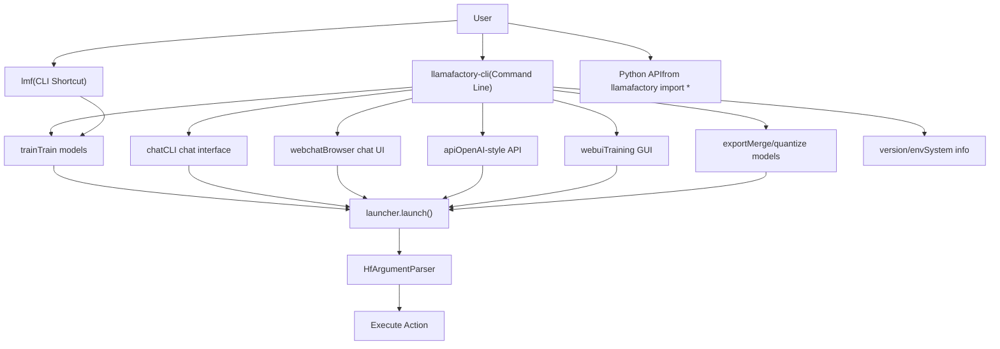
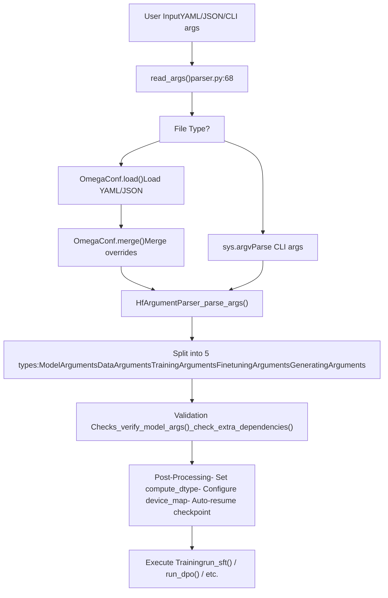
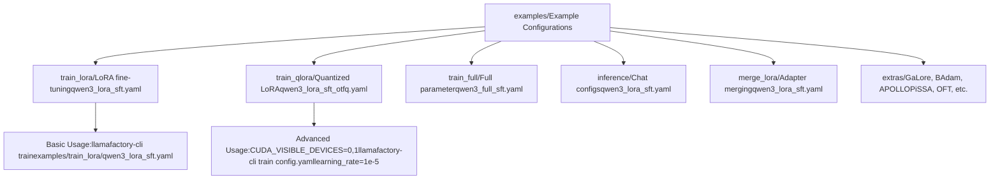

# Getting Started

Relevant source files

-   [.github/workflows/tests.yml](https://github.com/hiyouga/LlamaFactory/blob/355d5c5e/.github/workflows/tests.yml)
-   [Makefile](https://github.com/hiyouga/LlamaFactory/blob/355d5c5e/Makefile)
-   [README.md](https://github.com/hiyouga/LlamaFactory/blob/355d5c5e/README.md?plain=1)
-   [README\_zh.md](https://github.com/hiyouga/LlamaFactory/blob/355d5c5e/README_zh.md?plain=1)
-   [docker/docker-cuda/Dockerfile.megatron](https://github.com/hiyouga/LlamaFactory/blob/355d5c5e/docker/docker-cuda/Dockerfile.megatron)
-   [examples/README.md](https://github.com/hiyouga/LlamaFactory/blob/355d5c5e/examples/README.md?plain=1)
-   [examples/README\_zh.md](https://github.com/hiyouga/LlamaFactory/blob/355d5c5e/examples/README_zh.md?plain=1)
-   [pyproject.toml](https://github.com/hiyouga/LlamaFactory/blob/355d5c5e/pyproject.toml)
-   [src/llamafactory/chat/base\_engine.py](https://github.com/hiyouga/LlamaFactory/blob/355d5c5e/src/llamafactory/chat/base_engine.py)
-   [src/llamafactory/chat/chat\_model.py](https://github.com/hiyouga/LlamaFactory/blob/355d5c5e/src/llamafactory/chat/chat_model.py)
-   [src/llamafactory/cli.py](https://github.com/hiyouga/LlamaFactory/blob/355d5c5e/src/llamafactory/cli.py)
-   [src/llamafactory/hparams/parser.py](https://github.com/hiyouga/LlamaFactory/blob/355d5c5e/src/llamafactory/hparams/parser.py)
-   [src/llamafactory/v1/launcher.py](https://github.com/hiyouga/LlamaFactory/blob/355d5c5e/src/llamafactory/v1/launcher.py)

This guide provides a quick introduction to installing LlamaFactory and running your first training job. It covers the essential steps to get from zero to a working fine-tuning setup in minutes. For detailed installation instructions and environment configuration, see [Installation and Environment](/hiyouga/LlamaFactory/2.1-installation-and-environment). For comprehensive CLI command documentation, see [CLI Commands and Usage](/hiyouga/LlamaFactory/2.2-cli-commands-and-usage).

## Prerequisites Overview

LlamaFactory requires the following minimum system specifications:

| Component | Minimum | Recommended |
| --- | --- | --- |
| Python | 3.9 | 3.10+ |
| PyTorch | 2.0.0 | 2.6.0+ |
| Transformers | 4.49.0 | 4.50.0+ |
| CUDA (GPU) | 11.8+ | 12.1+ |
| GPU Memory | 8GB | 24GB+ |

**Operating Systems**: Linux, Windows, macOS (with Apple Silicon support via MPS)

**Hardware Support**: NVIDIA CUDA GPUs, AMD ROCm GPUs, Ascend NPUs, Apple MPS

Sources: [README.md473-485](https://github.com/hiyouga/LlamaFactory/blob/355d5c5e/README.md?plain=1#L473-L485)

## Installation Quick Start

### Option 1: Install from PyPI (Recommended)

```
pip install llamafactory
```
### Option 2: Install from Source

```
git clone --depth 1 https://github.com/hiyouga/LlamaFactory.gitcd LlamaFactorypip install -e ".[torch,metrics]"
```
### Option 3: Using Docker

```
docker pull hiyouga/llamafactory:latestdocker run -it --gpus all hiyouga/llamafactory:latest bash
```
### Verify Installation

After installation, verify that the `llamafactory-cli` command is available:

```
llamafactory-cli version
```
You should see output similar to:

```
----------------------------------------------------------
| Welcome to LLaMA Factory, version X.X.X                |
|                                                         |
| Project page: https://github.com/hiyouga/LLaMA-Factory |
----------------------------------------------------------
```
Sources: [README.md486-529](https://github.com/hiyouga/LlamaFactory/blob/355d5c5e/README.md?plain=1#L486-L529) [pyproject.toml84-86](https://github.com/hiyouga/LlamaFactory/blob/355d5c5e/pyproject.toml#L84-L86)

## System Entry Points

LlamaFactory provides multiple entry points for different use cases:


**CLI Entry Point**: The main entry point is [src/llamafactory/cli.py16-31](https://github.com/hiyouga/LlamaFactory/blob/355d5c5e/src/llamafactory/cli.py#L16-L31) which checks for the `USE_V1` environment variable and launches the appropriate launcher. Both `llamafactory-cli` and `lmf` are registered as command-line scripts.

Sources: [src/llamafactory/cli.py1-32](https://github.com/hiyouga/LlamaFactory/blob/355d5c5e/src/llamafactory/cli.py#L1-L32) [pyproject.toml84-86](https://github.com/hiyouga/LlamaFactory/blob/355d5c5e/pyproject.toml#L84-L86) [src/llamafactory/v1/launcher.py44-63](https://github.com/hiyouga/LlamaFactory/blob/355d5c5e/src/llamafactory/v1/launcher.py#L44-L63)

## Your First Training Job

This section walks through running a complete LoRA fine-tuning job on a small model.

### Step 1: Prepare Configuration

Create a YAML configuration file `quickstart_train.yaml`:

```
### Model configurationmodel_name_or_path: Qwen/Qwen2.5-0.5B-Instructtrust_remote_code: true ### Training methodstage: sftdo_train: truefinetuning_type: loralora_target: all ### Dataset configurationdataset: identitytemplate: qwencutoff_len: 1024max_samples: 1000overwrite_cache: truepreprocessing_num_workers: 16 ### Output configurationoutput_dir: saves/qwen2.5-0.5b/lora/sftlogging_steps: 10save_steps: 500plot_loss: trueoverwrite_output_dir: true ### Training hyperparametersper_device_train_batch_size: 2gradient_accumulation_steps: 4learning_rate: 1.0e-4num_train_epochs: 3.0lr_scheduler_type: cosinewarmup_ratio: 0.1bf16: trueddp_timeout: 180000000 ### LoRA configurationlora_rank: 8lora_alpha: 16lora_dropout: 0
```
### Step 2: Execute Training

Run the training command:

```
llamafactory-cli train quickstart_train.yaml
```
Or with command-line overrides:

```
llamafactory-cli train quickstart_train.yaml \    learning_rate=1e-5 \    num_train_epochs=1
```
Or using a shell script for more complex configurations:

```
CUDA_VISIBLE_DEVICES=0 llamafactory-cli train quickstart_train.yaml
```
### Step 3: Monitor Training

During training, you will see output similar to:

```
Process rank: 0, world size: 1, device: cuda:0, distributed training: False, compute dtype: torch.bfloat16
Loading checkpoint shards: 100%|████████████| 2/2 [00:01<00:00]
...
{'loss': 2.3456, 'learning_rate': 9.8e-05, 'epoch': 0.1}
{'loss': 1.9876, 'learning_rate': 9.5e-05, 'epoch': 0.2}
```
Training artifacts are saved to the `output_dir`:

-   `adapter_config.json`: LoRA adapter configuration
-   `adapter_model.safetensors`: Trained LoRA weights
-   `trainer_state.json`: Training state and metrics
-   `training_args.bin`: Training arguments
-   `all_results.json`: Final evaluation results

Sources: [examples/README.md18-51](https://github.com/hiyouga/LlamaFactory/blob/355d5c5e/examples/README.md?plain=1#L18-L51) [README.md769-826](https://github.com/hiyouga/LlamaFactory/blob/355d5c5e/README.md?plain=1#L769-L826)

## Configuration Flow

The following diagram shows how configuration flows from user input to training execution:


**Key Functions**:

-   `read_args()`: Determines input type and loads configuration [src/llamafactory/hparams/parser.py68-83](https://github.com/hiyouga/LlamaFactory/blob/355d5c5e/src/llamafactory/hparams/parser.py#L68-L83)
-   `_parse_args()`: Parses into dataclasses [src/llamafactory/hparams/parser.py85-99](https://github.com/hiyouga/LlamaFactory/blob/355d5c5e/src/llamafactory/hparams/parser.py#L85-L99)
-   `get_train_args()`: Main entry point for training arguments [src/llamafactory/hparams/parser.py244-471](https://github.com/hiyouga/LlamaFactory/blob/355d5c5e/src/llamafactory/hparams/parser.py#L244-L471)
-   `_verify_model_args()`: Cross-validates model settings [src/llamafactory/hparams/parser.py117-144](https://github.com/hiyouga/LlamaFactory/blob/355d5c5e/src/llamafactory/hparams/parser.py#L117-L144)
-   `_check_extra_dependencies()`: Verifies required packages [src/llamafactory/hparams/parser.py145-197](https://github.com/hiyouga/LlamaFactory/blob/355d5c5e/src/llamafactory/hparams/parser.py#L145-L197)

Sources: [src/llamafactory/hparams/parser.py68-471](https://github.com/hiyouga/LlamaFactory/blob/355d5c5e/src/llamafactory/hparams/parser.py#L68-L471)

## Testing Your Setup

### Test 1: Verify Model Loading

Test that the system can load a model:

```
llamafactory-cli chat examples/inference/qwen3_lora_sft.yaml
```
This opens an interactive chat. Type a message and verify you get a response. Type `exit` to quit.

### Test 2: Quick Training Test

Run a minimal training test (1 step):

```
llamafactory-cli train quickstart_train.yaml \    max_steps=1 \    output_dir=test_output
```
This should complete in under a minute and create checkpoint files in `test_output/`.

### Test 3: Check Available Commands

Verify all commands are accessible:

```
llamafactory-cli --helpllamafactory-cli train --helpllamafactory-cli chat --help
```
Sources: [examples/README.md202-217](https://github.com/hiyouga/LlamaFactory/blob/355d5c5e/examples/README.md?plain=1#L202-L217) [README.md857-894](https://github.com/hiyouga/LlamaFactory/blob/355d5c5e/README.md?plain=1#L857-L894)

## Common First-Run Issues

| Issue | Symptom | Solution |
| --- | --- | --- |
| CUDA not available | `RuntimeError: No CUDA GPUs are available` | Install CUDA-enabled PyTorch: `pip install torch --index-url https://download.pytorch.org/whl/cu121` |
| Out of memory | `torch.cuda.OutOfMemoryError` | Reduce `per_device_train_batch_size` or enable `quantization_bit: 4` |
| Model not found | `OSError: model_name_or_path not found` | Login to HuggingFace: `huggingface-cli login` |
| Distributed error | `ValueError: Please launch distributed training` | Use `FORCE_TORCHRUN=1` or run with multiple GPUs |
| Missing dependencies | `ModuleNotFoundError` | Install optional dependencies: `pip install llamafactory[metrics,deepspeed]` |

Sources: [src/llamafactory/hparams/parser.py256-355](https://github.com/hiyouga/LlamaFactory/blob/355d5c5e/src/llamafactory/hparams/parser.py#L256-L355)

## Working with Examples

LlamaFactory provides extensive examples in the `examples/` directory:


**Example Usage Patterns**:

```
# Basic LoRA trainingllamafactory-cli train examples/train_lora/qwen3_lora_sft.yaml # QLoRA with quantizationllamafactory-cli train examples/train_qlora/qwen3_lora_sft_otfq.yaml # Multi-GPU training with DeepSpeedFORCE_TORCHRUN=1 llamafactory-cli train examples/train_lora/qwen3_lora_sft_ds3.yaml # Inference after trainingllamafactory-cli chat examples/inference/qwen3_lora_sft.yaml # Export merged modelllamafactory-cli export examples/merge_lora/qwen3_lora_sft.yaml
```
Sources: [examples/README.md1-293](https://github.com/hiyouga/LlamaFactory/blob/355d5c5e/examples/README.md?plain=1#L1-L293) [examples/README\_zh.md1-293](https://github.com/hiyouga/LlamaFactory/blob/355d5c5e/examples/README_zh.md?plain=1#L1-L293)

## Environment Variables

LlamaFactory behavior can be controlled via environment variables:

| Variable | Purpose | Values |
| --- | --- | --- |
| `CUDA_VISIBLE_DEVICES` | Select GPUs | `0`, `0,1`, `0,1,2,3` |
| `FORCE_TORCHRUN` | Force distributed mode | `1` (enable) |
| `WANDB_DISABLED` | Disable W&B logging | `true` (disable) |
| `HF_TOKEN` | HuggingFace authentication | Your HF token |
| `USE_MCA` | Enable Megatron-Core adapter | `1` (enable) |
| `DISABLE_VERSION_CHECK` | Skip version validation | `1` (skip) |
| `LLAMAFACTORY_VERBOSITY` | Logging level | `DEBUG`, `INFO`, `WARNING` |

**Example with environment variables**:

```
CUDA_VISIBLE_DEVICES=0 \WANDB_DISABLED=true \HF_TOKEN=hf_xxxx \llamafactory-cli train config.yaml
```
Sources: [src/llamafactory/hparams/parser.py102-115](https://github.com/hiyouga/LlamaFactory/blob/355d5c5e/src/llamafactory/hparams/parser.py#L102-L115) [.github/workflows/tests.yml54-56](https://github.com/hiyouga/LlamaFactory/blob/355d5c5e/.github/workflows/tests.yml#L54-L56)

## Next Steps

After completing this quick start:

1.  **Learn the CLI**: Explore all CLI commands and options in [CLI Commands and Usage](/hiyouga/LlamaFactory/2.2-cli-commands-and-usage)
2.  **Configure your environment**: Set up hardware-specific optimizations in [Installation and Environment](/hiyouga/LlamaFactory/2.1-installation-and-environment)
3.  **Understand the configuration system**: Deep dive into argument types in [Configuration System](/hiyouga/LlamaFactory/3-configuration-system)
4.  **Prepare your data**: Learn about dataset formats in [Data Pipeline](/hiyouga/LlamaFactory/4-data-pipeline)
5.  **Choose training methods**: Explore different training stages in [Training System](/hiyouga/LlamaFactory/6-training-system)

**Useful Resources**:

-   Official examples: `examples/` directory
-   Model templates: [src/llamafactory/data/template.py](https://github.com/hiyouga/LlamaFactory/blob/355d5c5e/src/llamafactory/data/template.py)
-   Supported models: [src/llamafactory/extras/constants.py](https://github.com/hiyouga/LlamaFactory/blob/355d5c5e/src/llamafactory/extras/constants.py)
-   Example datasets: `data/` directory

Sources: [README.md67-92](https://github.com/hiyouga/LlamaFactory/blob/355d5c5e/README.md?plain=1#L67-L92)
