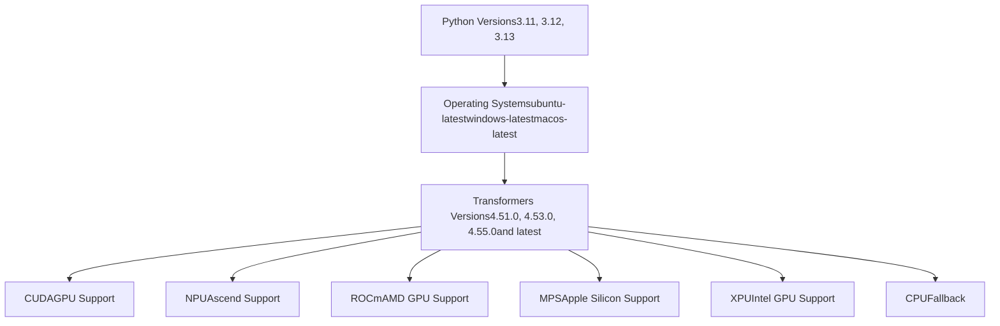
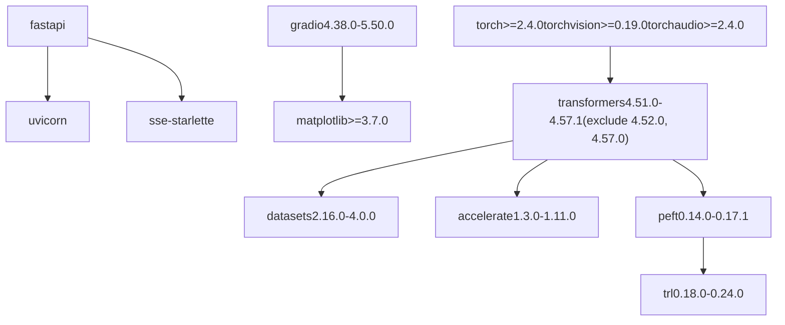
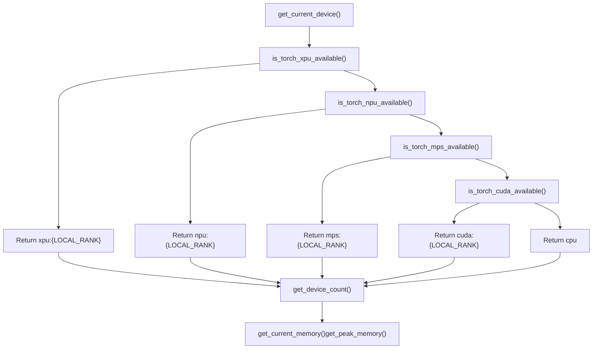
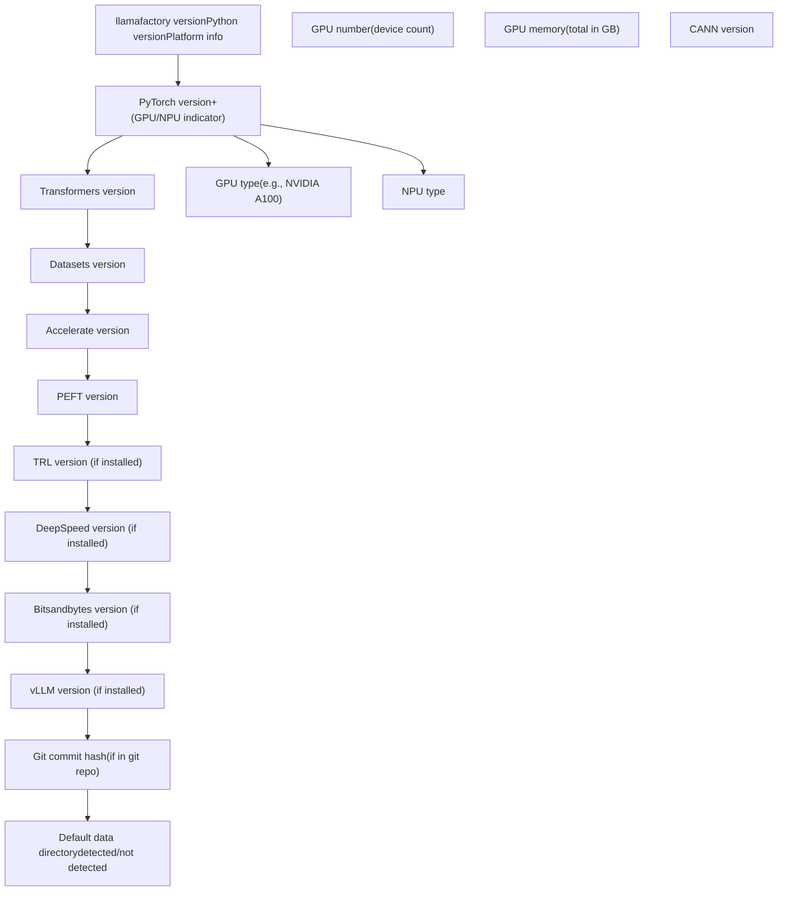

# Installation and Environment

Relevant source files

-   [.github/workflows/tests.yml](https://github.com/hiyouga/LlamaFactory/blob/355d5c5e/.github/workflows/tests.yml)
-   [Makefile](https://github.com/hiyouga/LlamaFactory/blob/355d5c5e/Makefile)
-   [docker/docker-cuda/Dockerfile.megatron](https://github.com/hiyouga/LlamaFactory/blob/355d5c5e/docker/docker-cuda/Dockerfile.megatron)
-   [pyproject.toml](https://github.com/hiyouga/LlamaFactory/blob/355d5c5e/pyproject.toml)
-   [src/llamafactory/\_\_init\_\_.py](https://github.com/hiyouga/LlamaFactory/blob/355d5c5e/src/llamafactory/__init__.py)
-   [src/llamafactory/extras/env.py](https://github.com/hiyouga/LlamaFactory/blob/355d5c5e/src/llamafactory/extras/env.py)
-   [src/llamafactory/extras/misc.py](https://github.com/hiyouga/LlamaFactory/blob/355d5c5e/src/llamafactory/extras/misc.py)
-   [src/llamafactory/extras/packages.py](https://github.com/hiyouga/LlamaFactory/blob/355d5c5e/src/llamafactory/extras/packages.py)
-   [src/llamafactory/model/model\_utils/attention.py](https://github.com/hiyouga/LlamaFactory/blob/355d5c5e/src/llamafactory/model/model_utils/attention.py)
-   [src/llamafactory/model/model\_utils/liger\_kernel.py](https://github.com/hiyouga/LlamaFactory/blob/355d5c5e/src/llamafactory/model/model_utils/liger_kernel.py)
-   [src/llamafactory/model/model\_utils/longlora.py](https://github.com/hiyouga/LlamaFactory/blob/355d5c5e/src/llamafactory/model/model_utils/longlora.py)
-   [src/llamafactory/model/model\_utils/moe.py](https://github.com/hiyouga/LlamaFactory/blob/355d5c5e/src/llamafactory/model/model_utils/moe.py)
-   [src/llamafactory/model/model\_utils/packing.py](https://github.com/hiyouga/LlamaFactory/blob/355d5c5e/src/llamafactory/model/model_utils/packing.py)
-   [src/llamafactory/model/model\_utils/valuehead.py](https://github.com/hiyouga/LlamaFactory/blob/355d5c5e/src/llamafactory/model/model_utils/valuehead.py)
-   [src/llamafactory/train/callbacks.py](https://github.com/hiyouga/LlamaFactory/blob/355d5c5e/src/llamafactory/train/callbacks.py)

This document provides detailed instructions for installing LlamaFactory and configuring the runtime environment. It covers system requirements, installation methods, dependency management, hardware support, and environment configuration.

For information about running CLI commands after installation, see [CLI Commands and Usage](/hiyouga/LlamaFactory/2.2-cli-commands-and-usage). For hardware-specific optimizations, see [Hardware Support](/hiyouga/LlamaFactory/9.1-hardware-support).

---

## Overview and System Requirements

### Supported Platforms

LlamaFactory supports multiple platforms and Python versions. The testing matrix validates compatibility across:

| Component | Supported Versions |
| --- | --- |
| Python | 3.11, 3.12, 3.13 |
| Operating Systems | Ubuntu (Linux), Windows, macOS |
| Transformers | 4.51.0 - 4.57.1 (excluding 4.52.0, 4.57.0) |

**Testing Matrix**


Sources: [.github/workflows/tests.yml27-46](https://github.com/hiyouga/LlamaFactory/blob/355d5c5e/.github/workflows/tests.yml#L27-L46) [pyproject.toml11](https://github.com/hiyouga/LlamaFactory/blob/355d5c5e/pyproject.toml#L11-L11) [pyproject.toml44](https://github.com/hiyouga/LlamaFactory/blob/355d5c5e/pyproject.toml#L44-L44)

---

## Installation Methods

### Method 1: Install from PyPI (Recommended)

Install the latest stable release directly from PyPI:

```
pip install llamafactory
```
For users in regions with slow PyPI access, use a mirror:

```
pip install llamafactory --index-url https://mirrors.aliyun.com/pypi/simple/
```
### Method 2: Install from Source

For development or to use the latest features:

```
git clone https://github.com/hiyouga/LlamaFactory.gitcd LlamaFactorypip install -e ".[dev]"
```
The `-e` flag installs in editable mode, allowing you to modify the source code without reinstalling.

### Method 3: Install with UV (Faster Alternative)

Using [uv](https://github.com/hiyouga/LlamaFactory/blob/355d5c5e/uv) for faster dependency resolution:

```
# Install uv firstpip install uv # Create virtual environment and installuv venvuv pip install -e ".[dev]"
```
### Method 4: Docker Installation

For containerized deployments, LlamaFactory provides Docker images:

```
docker pull registry.hub.docker.com/hiyouga/llamafactory:latestdocker run -it --gpus all registry.hub.docker.com/hiyouga/llamafactory:latest
```
For Megatron-LM support with optimized CUDA environment:

```
# Example from Dockerfile.megatronFROM nvcr.io/nvidia/pytorch:24.05-py3 # Install PyTorch 2.6.0 with CUDA 12.4RUN pip install torch==2.6.0 torchvision==0.21.0 torchaudio==2.6.0 \    --index-url https://download.pytorch.org/whl/cu124 # Install LlamaFactoryCOPY . /appWORKDIR /appRUN pip install --no-cache-dir -e ".[metrics]" --no-build-isolation
```
Sources: [pyproject.toml1-77](https://github.com/hiyouga/LlamaFactory/blob/355d5c5e/pyproject.toml#L1-L77) [docker/docker-cuda/Dockerfile.megatron1-78](https://github.com/hiyouga/LlamaFactory/blob/355d5c5e/docker/docker-cuda/Dockerfile.megatron#L1-L78) [.github/workflows/tests.yml62-73](https://github.com/hiyouga/LlamaFactory/blob/355d5c5e/.github/workflows/tests.yml#L62-L73) [Makefile5-10](https://github.com/hiyouga/LlamaFactory/blob/355d5c5e/Makefile#L5-L10)

---

## Core Dependencies

### Required Packages

LlamaFactory requires several core packages with specific version constraints:

**Dependency Version Requirements**


**Version Checking Mechanism**

The `check_dependencies()` function enforces version constraints at runtime:

```
# From src/llamafactory/extras/misc.py:95-102def check_dependencies() -> None:    check_version("transformers>=4.51.0,<=4.57.1")    check_version("datasets>=2.16.0,<=4.0.0")    check_version("accelerate>=1.3.0,<=1.11.0")    check_version("peft>=0.14.0,<=0.17.1")    check_version("trl>=0.18.0,<=0.24.0")
```
Users can disable version checking by setting `DISABLE_VERSION_CHECK=1`, though this may cause unexpected behavior.

Sources: [pyproject.toml39-76](https://github.com/hiyouga/LlamaFactory/blob/355d5c5e/pyproject.toml#L39-L76) [src/llamafactory/extras/misc.py95-102](https://github.com/hiyouga/LlamaFactory/blob/355d5c5e/src/llamafactory/extras/misc.py#L95-L102)

### Optional Dependencies

Install additional features using extras:

| Extra | Purpose | Installation |
| --- | --- | --- |
| `dev` | Development tools (pre-commit, ruff, pytest) | `pip install "llamafactory[dev]"` |
| `metrics` | Evaluation metrics (nltk, jieba, rouge-chinese) | `pip install "llamafactory[metrics]"` |
| `deepspeed` | Distributed training with DeepSpeed | `pip install "llamafactory[deepspeed]"` |

**Complete Installation with All Features**

```
pip install "llamafactory[dev,metrics,deepspeed]"
```
Sources: [pyproject.toml79-82](https://github.com/hiyouga/LlamaFactory/blob/355d5c5e/pyproject.toml#L79-L82)

---

## Hardware Support and Detection

### Supported Accelerators

LlamaFactory automatically detects and utilizes available hardware accelerators:

**Hardware Detection Flow**


**Device Detection Implementation**

The system provides unified APIs for different hardware backends:

| Function | Purpose | Return Value |
| --- | --- | --- |
| `get_current_device()` | Returns active device | `torch.device` object |
| `get_device_count()` | Counts available devices | Integer (0 for CPU-only) |
| `get_current_memory()` | Gets available/total memory | Tuple\[int, int\] in bytes |
| `get_peak_memory()` | Gets peak allocated/reserved memory | Tuple\[int, int\] in bytes |
| `is_accelerator_available()` | Checks for any accelerator | Boolean |

Sources: [src/llamafactory/extras/misc.py144-228](https://github.com/hiyouga/LlamaFactory/blob/355d5c5e/src/llamafactory/extras/misc.py#L144-L228)

### Precision Support

**FP16 and BF16 Availability Check**

```
# From src/llamafactory/extras/misc.py:41-45_is_fp16_available = is_torch_npu_available() or is_torch_cuda_available() try:    _is_bf16_available = is_torch_bf16_gpu_available() or \                        (is_torch_npu_available() and torch.npu.is_bf16_supported())except Exception:    _is_bf16_available = False
```
The `infer_optim_dtype()` function automatically selects the best precision:

| Condition | Selected dtype | Rationale |
| --- | --- | --- |
| BF16 available AND (model is BF16 OR model dtype unknown) | `torch.bfloat16` | BF16 provides better numerical stability |
| FP16 available | `torch.float16` | FP16 for memory efficiency |
| Otherwise | `torch.float32` | FP32 as fallback |

Sources: [src/llamafactory/extras/misc.py41-45](https://github.com/hiyouga/LlamaFactory/blob/355d5c5e/src/llamafactory/extras/misc.py#L41-L45) [src/llamafactory/extras/misc.py214-222](https://github.com/hiyouga/LlamaFactory/blob/355d5c5e/src/llamafactory/extras/misc.py#L214-L222)

### Memory Management

**GPU Memory Cleanup**

```
# From src/llamafactory/extras/misc.py:254-264def torch_gc() -> None:    """Collect the device memory."""    gc.collect()    if is_torch_xpu_available():        torch.xpu.empty_cache()    elif is_torch_npu_available():        torch.npu.empty_cache()    elif is_torch_mps_available():        torch.mps.empty_cache()    elif is_torch_cuda_available():        torch.cuda.empty_cache()
```
Sources: [src/llamafactory/extras/misc.py254-264](https://github.com/hiyouga/LlamaFactory/blob/355d5c5e/src/llamafactory/extras/misc.py#L254-L264)

---

## Environment Variables

LlamaFactory uses environment variables to control system behavior without code changes.

### Core Configuration Variables

**Environment Variable Reference**

```mermaid
flowchart TD
    LlamaFactoryVerbosity["LLAMAFACTORY_VERBOSITYLog levelValues: DEBUG, INFO, WARN, ERROR"]
    LlamaBoardEnabled["LLAMABOARD_ENABLEDWeb UI mode activeSet automatically"]
    LlamaBoardWorkDir["LLAMABOARD_WORKDIRWeb UI working directorySet automatically"]
    ForceTorchrun["FORCE_TORCHRUNForce torchrun usageDefault: disabled"]
    UseRay["USE_RAYEnable Ray backendDefault: disabled"]
    UseKT["USE_KTUse KTransformersDefault: disabled"]
    UseModelScope["USE_MODELSCOPE_HUBUse ModelScope HubDefault: disabled"]
    UseOpenMind["USE_OPENMIND_HUBUse OpenMind HubDefault: disabled"]
    RecordVRAM["RECORD_VRAMTrack memory usageDefault: disabled"]
    WandBProject["WANDB_PROJECTWandB project nameDefault: llamafactory"]
    DisableVersionCheck["DISABLE_VERSION_CHECKSkip dependency checksDefault: 0"]
    ForceCheckImports["FORCE_CHECK_IMPORTSEnable import checksDefault: disabled"]
```


**Hub Selection Logic**

The system supports multiple model hubs with priority order:

```
# From src/llamafactory/extras/misc.py:267-302def try_download_model_from_other_hub(model_args):    if (not use_modelscope() and not use_openmind()) or os.path.exists(model_args.model_name_or_path):        return model_args.model_name_or_path  # Use HuggingFace or local path        if use_modelscope():        # Use ModelScope Hub (Chinese mirror)        check_version("modelscope>=1.14.0", mandatory=True)        from modelscope import snapshot_download        # ... download model        if use_openmind():        # Use OpenMind Hub        check_version("openmind>=0.8.0", mandatory=True)        from openmind.utils.hub import snapshot_download        # ... download model
```
Sources: [src/llamafactory/\_\_init\_\_.py18-26](https://github.com/hiyouga/LlamaFactory/blob/355d5c5e/src/llamafactory/__init__.py#L18-L26) [src/llamafactory/extras/misc.py231-318](https://github.com/hiyouga/LlamaFactory/blob/355d5c5e/src/llamafactory/extras/misc.py#L231-L318) [src/llamafactory/train/callbacks.py185-189](https://github.com/hiyouga/LlamaFactory/blob/355d5c5e/src/llamafactory/train/callbacks.py#L185-L189)

### Setting Environment Variables

**Linux/macOS:**

```
export DISABLE_VERSION_CHECK=1export RECORD_VRAM=1export USE_MODELSCOPE_HUB=1
```
**Windows (PowerShell):**

```
$env:DISABLE_VERSION_CHECK="1"$env:RECORD_VRAM="1"$env:USE_MODELSCOPE_HUB="1"
```
**Python Script:**

```
import osos.environ["DISABLE_VERSION_CHECK"] = "1"os.environ["RECORD_VRAM"] = "1"
```
Sources: [src/llamafactory/\_\_init\_\_.py20-26](https://github.com/hiyouga/LlamaFactory/blob/355d5c5e/src/llamafactory/__init__.py#L20-L26) [src/llamafactory/extras/misc.py231-234](https://github.com/hiyouga/LlamaFactory/blob/355d5c5e/src/llamafactory/extras/misc.py#L231-L234)

---

## Version Information and Verification

### Checking Installation

After installation, verify the setup using the `print_env()` function:

```
llamafactory-cli env
```
Or in Python:

```
from llamafactory.extras.env import print_envprint_env()
```
**Example Output Structure**


**Environment Report Implementation**

The `print_env()` function collects comprehensive system information:

```
# From src/llamafactory/extras/env.py:25-102def print_env() -> None:    info = OrderedDict({        "`llamafactory` version": VERSION,        "Platform": platform.platform(),        "Python version": platform.python_version(),        "PyTorch version": torch.__version__,        "Transformers version": transformers.__version__,        "Datasets version": datasets.__version__,        "Accelerate version": accelerate.__version__,        "PEFT version": peft.__version__,    })        if is_torch_cuda_available():        info["PyTorch version"] += " (GPU)"        info["GPU type"] = torch.cuda.get_device_name()        info["GPU number"] = torch.cuda.device_count()        info["GPU memory"] = f"{torch.cuda.mem_get_info()[1] / (1024**3):.2f}GB"        # Additional optional packages detected...
```
Sources: [src/llamafactory/extras/env.py22-102](https://github.com/hiyouga/LlamaFactory/blob/355d5c5e/src/llamafactory/extras/env.py#L22-L102)

---

## Advanced Installation Scenarios

### Installing with Specific Backends

**vLLM for High-Throughput Inference:**

```
pip install llamafactory vllm
```
**DeepSpeed for Distributed Training:**

```
pip install "llamafactory[deepspeed]"
```
**Liger Kernel for Performance:**

```
pip install llamafactory liger-kernel
```
**Multiple Backends:**

```
pip install llamafactory vllm "deepspeed>=0.10.0" liger-kernel
```
Sources: [pyproject.toml82](https://github.com/hiyouga/LlamaFactory/blob/355d5c5e/pyproject.toml#L82-L82) [src/llamafactory/extras/packages.py53-124](https://github.com/hiyouga/LlamaFactory/blob/355d5c5e/src/llamafactory/extras/packages.py#L53-L124)

### Custom Package Installation

For packages requiring special build flags (e.g., GPT-Model, AutoAWQ):

```
# From src/llamafactory/extras/misc.py:76-92def check_version(requirement: str, mandatory: bool = False) -> None:    if "gptmodel" in requirement or "autoawq" in requirement:        pip_command = f"pip install {requirement} --no-build-isolation"    else:        pip_command = f"pip install {requirement}"        # Provides helpful error messages with fix commands
```
**Example:**

```
# Install packages that require custom buildpip install gptmodel --no-build-isolationpip install autoawq --no-build-isolation
```
Sources: [src/llamafactory/extras/misc.py76-92](https://github.com/hiyouga/LlamaFactory/blob/355d5c5e/src/llamafactory/extras/misc.py#L76-L92)

### ModelScope and OpenMind Hub Configuration

For users in regions with restricted access to Hugging Face, alternative hubs are supported:

**ModelScope Hub (China):**

```
export USE_MODELSCOPE_HUB=1# Requires: pip install "modelscope>=1.14.0"
```
**OpenMind Hub:**

```
export USE_OPENMIND_HUB=1# Requires: pip install "openmind>=0.8.0"
```
The system automatically downloads models from the configured hub with file locking to prevent concurrent download conflicts:

```
# From src/llamafactory/extras/misc.py:281-286with WeakFileLock(os.path.abspath(os.path.expanduser("~/.cache/llamafactory/modelscope.lock"))):    model_path = snapshot_download(        model_args.model_name_or_path,        revision=revision,        cache_dir=model_args.cache_dir,    )
```
Sources: [src/llamafactory/extras/misc.py267-302](https://github.com/hiyouga/LlamaFactory/blob/355d5c5e/src/llamafactory/extras/misc.py#L267-L302)

---

## Troubleshooting

### Common Installation Issues

**Issue: Version Conflicts**

```
# Symptom: ImportError or version mismatch errors# Solution: Use version checkingpython -c "from llamafactory.extras.misc import check_dependencies; check_dependencies()" # Or disable version checking temporarilyexport DISABLE_VERSION_CHECK=1
```
**Issue: CUDA Not Detected**

```
# Verify CUDA availabilitypython -c "import torch; print(f'CUDA Available: {torch.cuda.is_available()}')"python -c "import torch; print(f'CUDA Version: {torch.version.cuda}')" # Check device detectionpython -c "from llamafactory.extras.misc import get_current_device; print(get_current_device())"
```
**Issue: Out of Memory**

```
# Enable VRAM recording to monitor memory usageexport RECORD_VRAM=1 # Or call torch_gc() manually to free memorypython -c "from llamafactory.extras.misc import torch_gc; torch_gc()"
```
**Issue: FlashAttention Not Available**

```
# Check attention implementation supportpython -c "from transformers.utils import is_flash_attn_2_available; print(f'Flash Attention 2: {is_flash_attn_2_available()}')"
```
Sources: [src/llamafactory/extras/misc.py76-102](https://github.com/hiyouga/LlamaFactory/blob/355d5c5e/src/llamafactory/extras/misc.py#L76-L102) [src/llamafactory/extras/misc.py144-264](https://github.com/hiyouga/LlamaFactory/blob/355d5c5e/src/llamafactory/extras/misc.py#L144-L264) [src/llamafactory/model/model\_utils/attention.py31-103](https://github.com/hiyouga/LlamaFactory/blob/355d5c5e/src/llamafactory/model/model_utils/attention.py#L31-L103)

### Package Availability Checks

LlamaFactory provides utility functions to check optional package availability:

| Function | Package Checked | Usage |
| --- | --- | --- |
| `is_vllm_available()` | vllm | High-throughput inference |
| `is_gradio_available()` | gradio | Web UI |
| `is_galore_available()` | galore\_torch | GaLore optimizer |
| `is_apollo_available()` | apollo\_torch | Apollo optimizer |
| `is_safetensors_available()` | safetensors | Safe tensor serialization |
| `is_ray_available()` | ray | Distributed computing |
| `is_kt_available()` | ktransformers | KTransformers engine |

Sources: [src/llamafactory/extras/packages.py30-125](https://github.com/hiyouga/LlamaFactory/blob/355d5c5e/src/llamafactory/extras/packages.py#L30-L125)

---

## Summary

This page covered the complete installation and environment setup process for LlamaFactory:

1.  **System Requirements**: Python 3.11-3.13, multiple OS support, tested transformer versions
2.  **Installation Methods**: PyPI, source, UV, and Docker installation
3.  **Dependencies**: Core and optional package requirements with version constraints
4.  **Hardware Support**: Automatic detection for CUDA, NPU, ROCm, MPS, XPU, and CPU
5.  **Environment Variables**: Configuration options for hubs, monitoring, and execution
6.  **Verification**: Using `print_env()` to validate installation
7.  **Advanced Scenarios**: Backend-specific installations and hub configuration

After completing installation, proceed to [CLI Commands and Usage](/hiyouga/LlamaFactory/2.2-cli-commands-and-usage) to learn how to use LlamaFactory's command-line interface.
