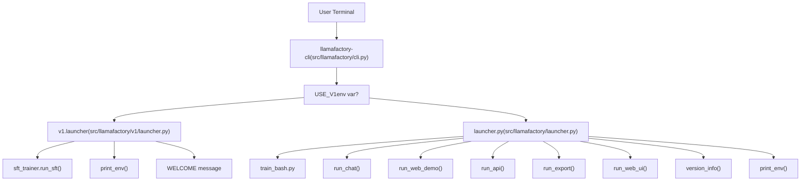
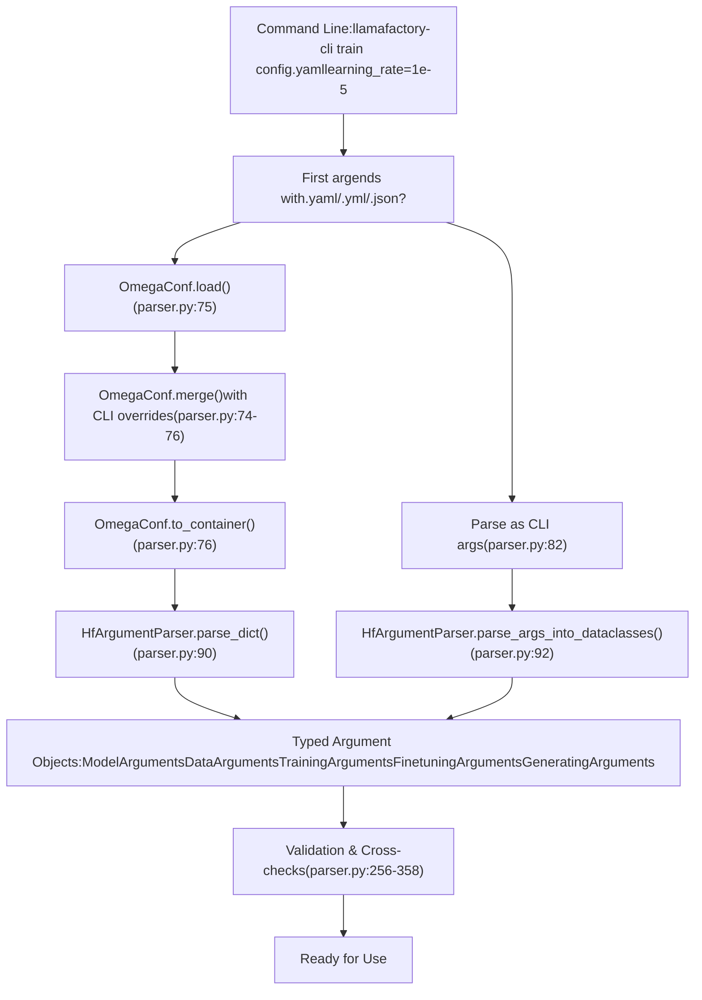
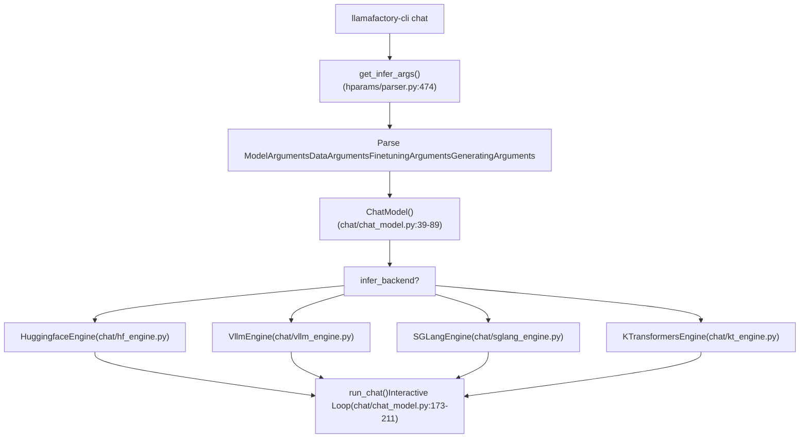
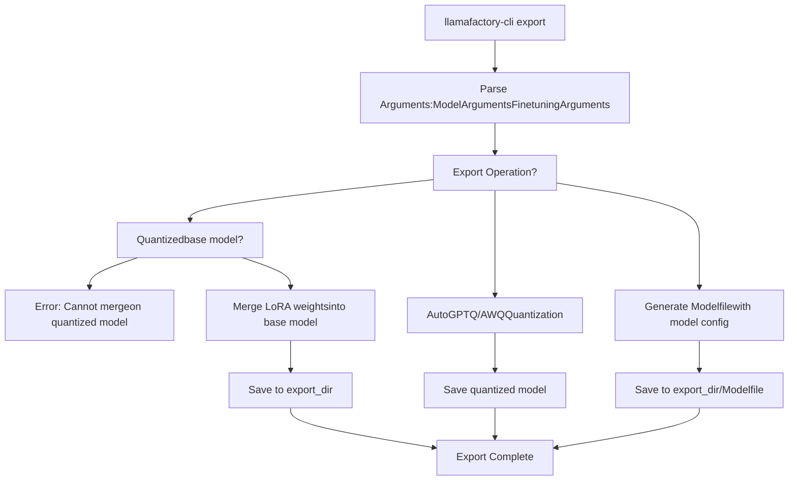
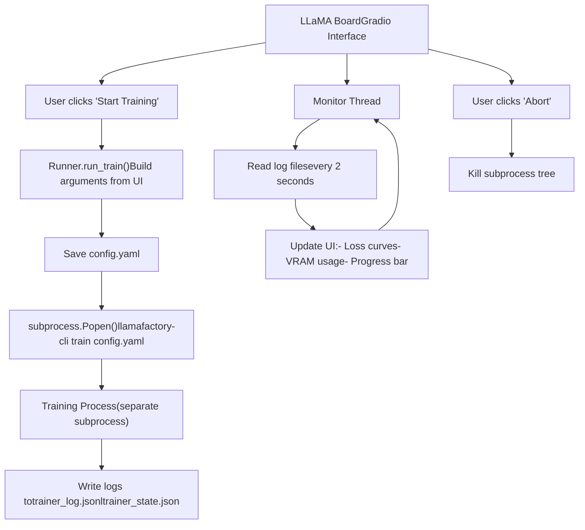

# CLI Commands and Usage

Relevant source files

-   [README.md](https://github.com/hiyouga/LlamaFactory/blob/355d5c5e/README.md?plain=1)
-   [README\_zh.md](https://github.com/hiyouga/LlamaFactory/blob/355d5c5e/README_zh.md?plain=1)
-   [examples/README.md](https://github.com/hiyouga/LlamaFactory/blob/355d5c5e/examples/README.md?plain=1)
-   [examples/README\_zh.md](https://github.com/hiyouga/LlamaFactory/blob/355d5c5e/examples/README_zh.md?plain=1)
-   [src/llamafactory/chat/base\_engine.py](https://github.com/hiyouga/LlamaFactory/blob/355d5c5e/src/llamafactory/chat/base_engine.py)
-   [src/llamafactory/chat/chat\_model.py](https://github.com/hiyouga/LlamaFactory/blob/355d5c5e/src/llamafactory/chat/chat_model.py)
-   [src/llamafactory/cli.py](https://github.com/hiyouga/LlamaFactory/blob/355d5c5e/src/llamafactory/cli.py)
-   [src/llamafactory/hparams/parser.py](https://github.com/hiyouga/LlamaFactory/blob/355d5c5e/src/llamafactory/hparams/parser.py)
-   [src/llamafactory/v1/launcher.py](https://github.com/hiyouga/LlamaFactory/blob/355d5c5e/src/llamafactory/v1/launcher.py)

This document provides comprehensive reference for the `llamafactory-cli` command-line interface, which serves as the primary entry point for all LlamaFactory operations including training, inference, model export, and launching services. For detailed configuration parameters, see [Configuration Parameter Reference](/hiyouga/LlamaFactory/10.3-configuration-parameter-reference). For installation instructions, see [Installation and Environment](/hiyouga/LlamaFactory/2.1-installation-and-environment).

---

## Overview

The `llamafactory-cli` command (aliased as `lmf`) provides a unified interface to all LlamaFactory functionality. It routes user commands to appropriate subsystems based on the first positional argument and processes configuration from YAML/JSON files or command-line arguments.

**Entry Point Architecture**


**Sources:** [src/llamafactory/cli.py16-24](https://github.com/hiyouga/LlamaFactory/blob/355d5c5e/src/llamafactory/cli.py#L16-L24) [src/llamafactory/v1/launcher.py44-63](https://github.com/hiyouga/LlamaFactory/blob/355d5c5e/src/llamafactory/v1/launcher.py#L44-L63)

---

## Command Reference Table

| Command | Purpose | Config File | Requires Training Args | Requires GPU |
| --- | --- | --- | --- | --- |
| `train` | Train or fine-tune models | Required | Yes | Yes (typically) |
| `chat` | Interactive CLI chat interface | Optional | No | Yes |
| `webchat` | Launch Gradio chat interface | Optional | No | Yes |
| `api` | Start OpenAI-compatible API server | Optional | No | Yes |
| `export` | Merge adapters or quantize models | Required | No | Optional |
| `webui` | Launch LLaMA Board training GUI | Optional | No | No |
| `version` | Display version information | N/A | No | No |
| `env` | Print environment diagnostics | N/A | No | No |

**Sources:** [README.md49-86](https://github.com/hiyouga/LlamaFactory/blob/355d5c5e/README.md?plain=1#L49-L86) [examples/README.md18-35](https://github.com/hiyouga/LlamaFactory/blob/355d5c5e/examples/README.md?plain=1#L18-L35)

---

## Configuration Methods

LlamaFactory supports three methods for passing configuration, which can be combined:

### YAML/JSON Configuration Files

The primary method for specifying training or inference parameters. The first command-line argument ending in `.yaml`, `.yml`, or `.json` is treated as the configuration file path.

**Configuration File Processing Flow**


**Sources:** [src/llamafactory/hparams/parser.py68-99](https://github.com/hiyouga/LlamaFactory/blob/355d5c5e/src/llamafactory/hparams/parser.py#L68-L99)

**Example YAML Configuration:**

```
### modelmodel_name_or_path: Qwen/Qwen3-4B-Instruct-2507template: qwen3_nothink ### methodstage: sftfinetuning_type: loralora_rank: 8lora_target: all ### datasetdataset: alpaca_en_democutoff_len: 1024 ### outputoutput_dir: saves/qwen3-4b/lora/sftlogging_steps: 10save_steps: 500 ### trainper_device_train_batch_size: 2learning_rate: 1e-4num_train_epochs: 3.0
```
**Sources:** [examples/train\_lora/qwen3\_lora\_sft.yaml](https://github.com/hiyouga/LlamaFactory/blob/355d5c5e/examples/train_lora/qwen3_lora_sft.yaml) (inferred from examples)

### Command-Line Arguments

Override individual parameters directly on the command line:

```
llamafactory-cli train config.yaml \    learning_rate=1e-5 \    per_device_train_batch_size=4 \    logging_steps=1
```
**Sources:** [examples/README.md26-30](https://github.com/hiyouga/LlamaFactory/blob/355d5c5e/examples/README.md?plain=1#L26-L30) [src/llamafactory/hparams/parser.py74](https://github.com/hiyouga/LlamaFactory/blob/355d5c5e/src/llamafactory/hparams/parser.py#L74-L74)

### Mixed Approach

Combine a base configuration file with command-line overrides for flexibility:

```
CUDA_VISIBLE_DEVICES=0,1 llamafactory-cli train examples/train_lora/qwen3_lora_sft.yaml \    output_dir=saves/custom_run \    num_train_epochs=5.0
```
**Sources:** [examples/README.md27-30](https://github.com/hiyouga/LlamaFactory/blob/355d5c5e/examples/README.md?plain=1#L27-L30)

---

## Command Details

### train

Executes model training (pre-training, fine-tuning, reward modeling, PPO, DPO, etc.) based on the `stage` parameter in configuration.

**Basic Syntax:**

```
llamafactory-cli train <config_file.yaml> [overrides...]
```
**Configuration Requirements:**

-   **Required arguments:** Defined in `ModelArguments`, `DataArguments`, `TrainingArguments`, `FinetuningArguments`, `GeneratingArguments`
-   **Key parameters:** `model_name_or_path`, `dataset`, `stage`, `finetuning_type`, `output_dir`
-   **Validation:** Extensive cross-validation performed in [parser.py256-358](https://github.com/hiyouga/LlamaFactory/blob/355d5c5e/parser.py#L256-L358)

**Examples:**

| Training Type | Command | Configuration File |
| --- | --- | --- |
| LoRA SFT | `llamafactory-cli train examples/train_lora/qwen3_lora_sft.yaml` | [examples/train\_lora/qwen3\_lora\_sft.yaml](https://github.com/hiyouga/LlamaFactory/blob/355d5c5e/examples/train_lora/qwen3_lora_sft.yaml) |
| QLoRA SFT | `llamafactory-cli train examples/train_qlora/qwen3_lora_sft_otfq.yaml` | [examples/train\_qlora/qwen3\_lora\_sft\_otfq.yaml](https://github.com/hiyouga/LlamaFactory/blob/355d5c5e/examples/train_qlora/qwen3_lora_sft_otfq.yaml) |
| Full-parameter SFT | `FORCE_TORCHRUN=1 llamafactory-cli train examples/train_full/qwen3_full_sft.yaml` | [examples/train\_full/qwen3\_full\_sft.yaml](https://github.com/hiyouga/LlamaFactory/blob/355d5c5e/examples/train_full/qwen3_full_sft.yaml) |
| DPO Training | `llamafactory-cli train examples/train_lora/qwen3_lora_dpo.yaml` | [examples/train\_lora/qwen3\_lora\_dpo.yaml](https://github.com/hiyouga/LlamaFactory/blob/355d5c5e/examples/train_lora/qwen3_lora_dpo.yaml) |
| Reward Modeling | `llamafactory-cli train examples/train_lora/qwen3_lora_reward.yaml` | [examples/train\_lora/qwen3\_lora\_reward.yaml](https://github.com/hiyouga/LlamaFactory/blob/355d5c5e/examples/train_lora/qwen3_lora_reward.yaml) |
| Multimodal SFT | `llamafactory-cli train examples/train_lora/qwen3vl_lora_sft.yaml` | [examples/train\_lora/qwen3vl\_lora\_sft.yaml](https://github.com/hiyouga/LlamaFactory/blob/355d5c5e/examples/train_lora/qwen3vl_lora_sft.yaml) |

**Multi-Node Training:**

For distributed training across multiple nodes, use environment variables:

```
# Node 0FORCE_TORCHRUN=1 NNODES=2 NODE_RANK=0 MASTER_ADDR=192.168.0.1 MASTER_PORT=29500 \    llamafactory-cli train examples/train_lora/qwen3_lora_sft.yaml # Node 1FORCE_TORCHRUN=1 NNODES=2 NODE_RANK=1 MASTER_ADDR=192.168.0.1 MASTER_PORT=29500 \    llamafactory-cli train examples/train_lora/qwen3_lora_sft.yaml
```
**Elastic Training with Fault Tolerance:**

```
FORCE_TORCHRUN=1 MIN_NNODES=1 MAX_NNODES=3 MAX_RESTARTS=3 RDZV_ID=llamafactory \    MASTER_ADDR=192.168.0.1 MASTER_PORT=29500 \    llamafactory-cli train examples/train_full/qwen3_full_sft.yaml
```
**Sources:** [examples/README.md20-108](https://github.com/hiyouga/LlamaFactory/blob/355d5c5e/examples/README.md?plain=1#L20-L108) [examples/README\_zh.md20-116](https://github.com/hiyouga/LlamaFactory/blob/355d5c5e/examples/README_zh.md?plain=1#L20-L116) [src/llamafactory/hparams/parser.py244-471](https://github.com/hiyouga/LlamaFactory/blob/355d5c5e/src/llamafactory/hparams/parser.py#L244-L471)

---

### chat

Launches an interactive command-line chat interface for inference with a trained model.

**Basic Syntax:**

```
llamafactory-cli chat <config_file.yaml> [overrides...]
```
**Configuration Requirements:**

-   **Required arguments:** Defined in `ModelArguments`, `DataArguments`, `FinetuningArguments`, `GeneratingArguments`
-   **Key parameters:** `model_name_or_path`, `template`, `adapter_name_or_path` (for LoRA), `finetuning_type`

**Interactive Commands:**

-   Type messages normally to chat with the model
-   `clear` - Remove conversation history and free memory
-   `exit` - Exit the application

**Example:**

```
llamafactory-cli chat examples/inference/qwen3_lora_sft.yaml
```
**Example Session:**

```
Welcome to the CLI application, use `clear` to remove the history, use `exit` to exit the application.

User: What is machine learning?
Assistant: Machine learning is a subset of artificial intelligence...

User: clear
History has been removed.

User: exit
```
**Backend Engine Selection:**

The chat command uses the inference backend specified by `infer_backend` parameter:

-   `huggingface` (default) - Standard HuggingFace transformers
-   `vllm` - High-throughput vLLM engine
-   `sglang` - SGLang inference server
-   `kt` - KTransformers CPU-GPU hybrid

**Implementation Details:**


**Sources:** [src/llamafactory/chat/chat\_model.py39-89](https://github.com/hiyouga/LlamaFactory/blob/355d5c5e/src/llamafactory/chat/chat_model.py#L39-L89) [src/llamafactory/chat/chat\_model.py173-211](https://github.com/hiyouga/LlamaFactory/blob/355d5c5e/src/llamafactory/chat/chat_model.py#L173-L211) [examples/README.md202-205](https://github.com/hiyouga/LlamaFactory/blob/355d5c5e/examples/README.md?plain=1#L202-L205)

---

### webchat

Launches a Gradio web interface for interactive chat with a trained model.

**Basic Syntax:**

```
llamafactory-cli webchat <config_file.yaml> [overrides...]
```
**Configuration Requirements:**

-   Same as `chat` command
-   Additional optional parameters for Gradio server: `server_name`, `server_port`, `share`

**Example:**

```
llamafactory-cli webchat examples/inference/qwen3_lora_sft.yaml
```
**Features:**

-   Web-based chat interface
-   Conversation history display
-   Parameter adjustment (temperature, top\_p, max\_tokens)
-   Supports multimodal inputs (images, videos, audio) if model supports them
-   Shareable public URL with `share=True`

**Sources:** [examples/README.md207-211](https://github.com/hiyouga/LlamaFactory/blob/355d5c5e/examples/README.md?plain=1#L207-L211) [examples/README\_zh.md207-211](https://github.com/hiyouga/LlamaFactory/blob/355d5c5e/examples/README_zh.md?plain=1#L207-L211)

---

### api

Starts an OpenAI-compatible API server for model inference, supporting both streaming and non-streaming responses.

**Basic Syntax:**

```
llamafactory-cli api <config_file.yaml> [overrides...]
```
**Configuration Requirements:**

-   Same as `chat` command
-   Additional optional parameters: `server_name`, `server_port`, `api_key`

**Example:**

```
llamafactory-cli api examples/inference/qwen3_lora_sft.yaml
```
**API Endpoints:**

The server implements OpenAI-compatible endpoints:

| Endpoint | Method | Purpose |
| --- | --- | --- |
| `/v1/models` | GET | List available models |
| `/v1/chat/completions` | POST | Chat completion (streaming/non-streaming) |
| `/v1/completions` | POST | Text completion |
| `/v1/embeddings` | POST | Generate embeddings |
| `/v1/score/evaluation` | POST | Reward model scoring |

**Example API Call:**

```
curl -X POST http://localhost:8000/v1/chat/completions \  -H "Content-Type: application/json" \  -H "Authorization: Bearer YOUR_API_KEY" \  -d '{    "model": "qwen3-4b",    "messages": [{"role": "user", "content": "Hello!"}],    "stream": false  }'
```
**vLLM Backend for High Performance:**

For production workloads, use vLLM backend for significantly higher throughput:

```
llamafactory-cli api examples/inference/qwen3_lora_sft.yaml infer_backend=vllm
```
**Sources:** [examples/README.md213-217](https://github.com/hiyouga/LlamaFactory/blob/355d5c5e/examples/README.md?plain=1#L213-L217) [examples/README\_zh.md213-217](https://github.com/hiyouga/LlamaFactory/blob/355d5c5e/examples/README_zh.md?plain=1#L213-L217) [README.md268](https://github.com/hiyouga/LlamaFactory/blob/355d5c5e/README.md?plain=1#L268-L268)

---

### export

Merges LoRA adapters with base models, quantizes models, or exports models to different formats including Ollama modelfiles.

**Basic Syntax:**

```
llamafactory-cli export <config_file.yaml> [overrides...]
```
**Configuration Requirements:**

-   **Required arguments:** Defined in `ModelArguments`, `DataArguments`, `FinetuningArguments`
-   **Key parameters:** `model_name_or_path`, `adapter_name_or_path`, `export_dir`, `export_quantization_bit`, `export_quantization_dataset`

**Export Operations:**


**Examples:**

| Operation | Command | Notes |
| --- | --- | --- |
| Merge LoRA | `llamafactory-cli export examples/merge_lora/qwen3_lora_sft.yaml` | Do not use quantized base model |
| GPTQ Quantization | `llamafactory-cli export examples/merge_lora/qwen3_gptq.yaml` | Requires AutoGPTQ |
| Save Ollama Modelfile | `llamafactory-cli export examples/merge_lora/qwen3_full_sft.yaml` | Creates Ollama-compatible config |

**Important Constraints:**

-   Do NOT use quantized models as base when merging LoRA adapters (\[parser.py validation\])
-   GPTQ quantization requires calibration dataset specified in `export_quantization_dataset`
-   Merged models can be used directly without adapter loading overhead

**Sources:** [examples/README.md170-190](https://github.com/hiyouga/LlamaFactory/blob/355d5c5e/examples/README.md?plain=1#L170-L190) [examples/README\_zh.md170-190](https://github.com/hiyouga/LlamaFactory/blob/355d5c5e/examples/README_zh.md?plain=1#L170-L190) [README.md168](https://github.com/hiyouga/LlamaFactory/blob/355d5c5e/README.md?plain=1#L168-L168)

---

### webui

Launches the LLaMA Board web interface, a comprehensive Gradio-based GUI for training, evaluation, chat, and model export.

**Basic Syntax:**

```
llamafactory-cli webui
```
**Configuration:** No configuration file required. All settings are configured through the web interface.

**Optional Arguments:**

```
llamafactory-cli webui --server_name 0.0.0.0 --server_port 7860 --share
```
**Features:**

-   **Training Tab:** Configure and launch training jobs with real-time monitoring
-   **Evaluation Tab:** Evaluate model performance on test sets
-   **Chat Tab:** Interactive chat interface for testing models
-   **Export Tab:** Merge adapters and export models

**Process Management:**

The web UI spawns training as a subprocess and monitors it via log files:


**Accessing the Web UI:**

-   Locally: `http://localhost:7860`
-   Public sharing (with `--share`): Gradio provides a temporary public URL
-   Online demo: [https://huggingface.co/spaces/hiyouga/LLaMA-Board](https://huggingface.co/spaces/hiyouga/LLaMA-Board)

**Sources:** [README.md80](https://github.com/hiyouga/LlamaFactory/blob/355d5c5e/README.md?plain=1#L80-L80) [README\_zh.md82](https://github.com/hiyouga/LlamaFactory/blob/355d5c5e/README_zh.md?plain=1#L82-L82) Diagram 6 from high-level architecture

---

### version

Displays LlamaFactory version information and welcome message.

**Basic Syntax:**

```
llamafactory-cli version
```
**Output Example:**

```
----------------------------------------------------------
| Welcome to LLaMA Factory, version 0.x.x                |
|                                                        |
| Project page: https://github.com/hiyouga/LLaMA-Factory |
----------------------------------------------------------
```
**Sources:** [src/llamafactory/v1/launcher.py31-41](https://github.com/hiyouga/LlamaFactory/blob/355d5c5e/src/llamafactory/v1/launcher.py#L31-L41) [src/llamafactory/v1/launcher.py55-56](https://github.com/hiyouga/LlamaFactory/blob/355d5c5e/src/llamafactory/v1/launcher.py#L55-L56)

---

### env

Prints diagnostic information about the current environment including hardware, installed packages, and configuration.

**Basic Syntax:**

```
llamafactory-cli env
```
**Output Information:**

-   Python version
-   PyTorch version and CUDA availability
-   Transformers, datasets, accelerate versions
-   GPU information (if available)
-   NPU information (for Ascend devices)
-   Environment variables affecting LlamaFactory

**Use Case:** Debugging installation issues or reporting bugs.

**Sources:** [src/llamafactory/v1/launcher.py52-53](https://github.com/hiyouga/LlamaFactory/blob/355d5c5e/src/llamafactory/v1/launcher.py#L52-L53)

---

## Device Selection

Control which GPUs or NPUs are visible to LlamaFactory using environment variables.

**GPU Selection (CUDA):**

```
# Use only GPU 0CUDA_VISIBLE_DEVICES=0 llamafactory-cli train config.yaml # Use GPUs 0 and 1CUDA_VISIBLE_DEVICES=0,1 llamafactory-cli train config.yaml
```
**NPU Selection (Ascend):**

```
# Use only NPU 0ASCEND_RT_VISIBLE_DEVICES=0 llamafactory-cli train config.yaml # Use NPUs 0 and 1ASCEND_RT_VISIBLE_DEVICES=0,1 llamafactory-cli train config.yaml
```
**Default Behavior:** LlamaFactory uses all visible devices by default. Set `CUDA_VISIBLE_DEVICES` or `ASCEND_RT_VISIBLE_DEVICES` before launching to restrict device usage.

**Sources:** [examples/README.md14-16](https://github.com/hiyouga/LlamaFactory/blob/355d5c5e/examples/README.md?plain=1#L14-L16) [examples/README\_zh.md14-16](https://github.com/hiyouga/LlamaFactory/blob/355d5c5e/examples/README_zh.md?plain=1#L14-L16)

---

## Environment Variables

Key environment variables that affect CLI behavior:

| Variable | Effect | Values |
| --- | --- | --- |
| `CUDA_VISIBLE_DEVICES` | Select visible GPUs | Comma-separated GPU IDs |
| `ASCEND_RT_VISIBLE_DEVICES` | Select visible NPUs | Comma-separated NPU IDs |
| `FORCE_TORCHRUN` | Force distributed training mode | `0` (default) or `1` |
| `USE_RAY` | Enable Ray for distributed training | `0` (default) or `1` |
| `USE_V1` | Use experimental v1 API | `0` (default) or `1` |
| `USE_MCA` | Use Megatron-core adapter backend | `0` (default) or `1` |
| `ALLOW_EXTRA_ARGS` | Allow unrecognized arguments | `0` (default) or `1` |
| `DISABLE_VERSION_CHECK` | Skip transformers version check | `0` (default) or `1` |
| `NPU_JIT_COMPILE` | Enable JIT compilation on NPU | `0` (default) or `1` |
| `VLLM_WORKER_MULTIPROC_METHOD` | vLLM worker spawn method | `fork` (default) or `spawn` |
| `LLAMAFACTORY_VERBOSITY` | Logging verbosity | `INFO` (default), `DEBUG` |

**Distributed Training Variables:**

| Variable | Purpose | Required For |
| --- | --- | --- |
| `NNODES` | Total number of nodes | Multi-node training |
| `NODE_RANK` | Current node rank (0-indexed) | Multi-node training |
| `MASTER_ADDR` | Master node IP address | Multi-node training |
| `MASTER_PORT` | Master node port | Multi-node training |
| `MIN_NNODES` | Minimum nodes for elastic training | Elastic training |
| `MAX_NNODES` | Maximum nodes for elastic training | Elastic training |
| `MAX_RESTARTS` | Max failures before abort | Elastic training |
| `RDZV_ID` | Unique job ID | Elastic training |

**Sources:** [src/llamafactory/hparams/parser.py109-115](https://github.com/hiyouga/LlamaFactory/blob/355d5c5e/src/llamafactory/hparams/parser.py#L109-L115) [examples/README.md93-95](https://github.com/hiyouga/LlamaFactory/blob/355d5c5e/examples/README.md?plain=1#L93-L95) [examples/README.md156-162](https://github.com/hiyouga/LlamaFactory/blob/355d5c5e/examples/README.md?plain=1#L156-L162)

---

## Common Usage Patterns

### Pattern 1: Quick Experimentation

Use command-line overrides to iterate quickly:

```
# Baseline runllamafactory-cli train config.yaml # Test different learning ratesllamafactory-cli train config.yaml learning_rate=5e-5llamafactory-cli train config.yaml learning_rate=1e-5llamafactory-cli train config.yaml learning_rate=5e-6 # Test different batch sizesllamafactory-cli train config.yaml per_device_train_batch_size=4llamafactory-cli train config.yaml per_device_train_batch_size=8
```
### Pattern 2: Development → Production Pipeline

```
# 1. Develop on single GPUCUDA_VISIBLE_DEVICES=0 llamafactory-cli train dev_config.yaml # 2. Test with LoRA on single nodellamafactory-cli train lora_config.yaml # 3. Scale to multi-GPU with DeepSpeedFORCE_TORCHRUN=1 llamafactory-cli train lora_ds3_config.yaml # 4. Deploy with vLLM APIllamafactory-cli api inference_config.yaml infer_backend=vllm
```
### Pattern 3: Preprocessing → Training → Export → Deployment

```
# 1. Preprocess large datasetllamafactory-cli train preprocess_config.yaml # 2. Train using preprocessed datallamafactory-cli train train_config.yaml tokenized_path=preprocessed_data/ # 3. Merge LoRA adaptersllamafactory-cli export merge_config.yaml # 4. Start API server with merged modelllamafactory-cli api api_config.yaml model_name_or_path=merged_model/
```
### Pattern 4: Shell Scripts for Reproducibility

Create shell scripts wrapping common configurations:

```
#!/bin/bash# train_qwen3.sh CUDA_VISIBLE_DEVICES=0,1 llamafactory-cli train examples/train_lora/qwen3_lora_sft.yaml \    output_dir=saves/qwen3-${RUN_NAME} \    learning_rate=${LR:-1e-4} \    num_train_epochs=${EPOCHS:-3.0} \    logging_steps=10
```
Run with:

```
RUN_NAME=experiment1 LR=5e-5 EPOCHS=5 bash train_qwen3.sh
```
**Sources:** [examples/README.md33-34](https://github.com/hiyouga/LlamaFactory/blob/355d5c5e/examples/README.md?plain=1#L33-L34) [examples/README\_zh.md32-34](https://github.com/hiyouga/LlamaFactory/blob/355d5c5e/examples/README_zh.md?plain=1#L32-L34)

---

## Argument Validation and Error Messages

The CLI performs extensive validation before launching operations. Common error scenarios:

| Error Condition | Error Message | Solution |
| --- | --- | --- |
| Quantization without LoRA/OFT | "Quantization is only compatible with the LoRA or OFT method" | Set `finetuning_type: lora` or `finetuning_type: oft` |
| PiSSA with quantization | "Please use scripts/pissa\_init.py to initialize PiSSA for a quantized model" | Initialize PiSSA separately first |
| Missing dataset | "Please specify dataset for training" | Add `dataset` parameter |
| Invalid eval config | "Please make sure eval\_dataset be provided or val\_size >1e-6" | Set `eval_dataset` or `val_size` |
| DeepSpeed without torchrun | "Please use `FORCE_TORCHRUN=1` to launch DeepSpeed training" | Add `FORCE_TORCHRUN=1` |
| Missing max\_steps in streaming | "Please specify `max_steps` in streaming mode" | Add `max_steps` when using `streaming: true` |

**Validation Location:** [src/llamafactory/hparams/parser.py256-358](https://github.com/hiyouga/LlamaFactory/blob/355d5c5e/src/llamafactory/hparams/parser.py#L256-L358)

**Sources:** [src/llamafactory/hparams/parser.py122-140](https://github.com/hiyouga/LlamaFactory/blob/355d5c5e/src/llamafactory/hparams/parser.py#L122-L140) [src/llamafactory/hparams/parser.py256-358](https://github.com/hiyouga/LlamaFactory/blob/355d5c5e/src/llamafactory/hparams/parser.py#L256-L358)

---

## Shorthand Alias

The command `llamafactory-cli` can be shortened to `lmf`:

```
# These are equivalentllamafactory-cli train config.yamllmf train config.yaml # Also works with all subcommandslmf chat config.yamllmf api config.yamllmf webui
```
**Sources:** [src/llamafactory/v1/launcher.py26](https://github.com/hiyouga/LlamaFactory/blob/355d5c5e/src/llamafactory/v1/launcher.py#L26-L26)
