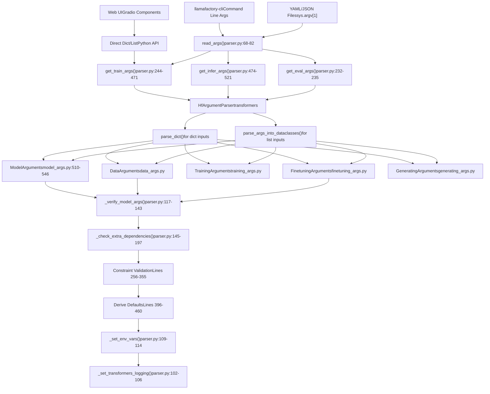
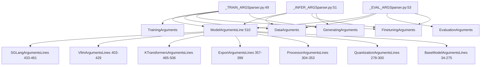
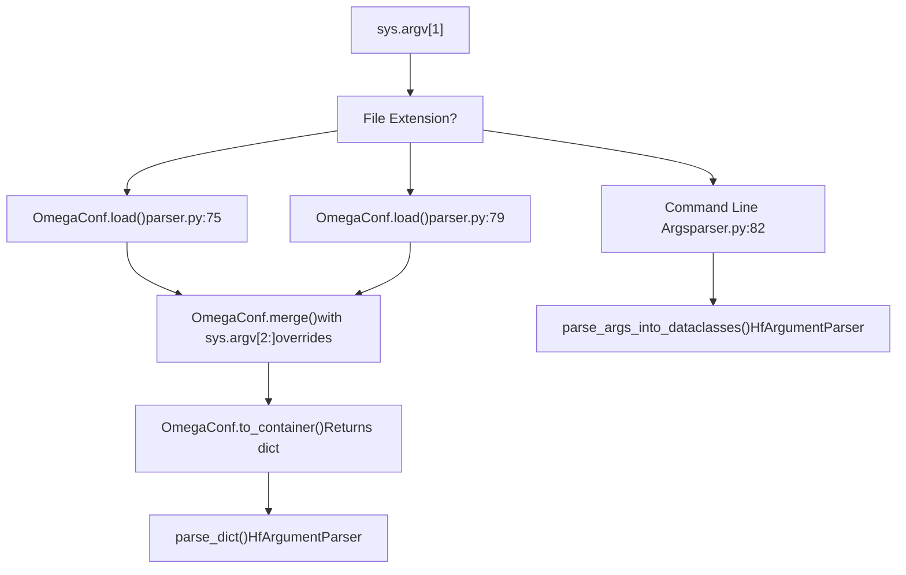
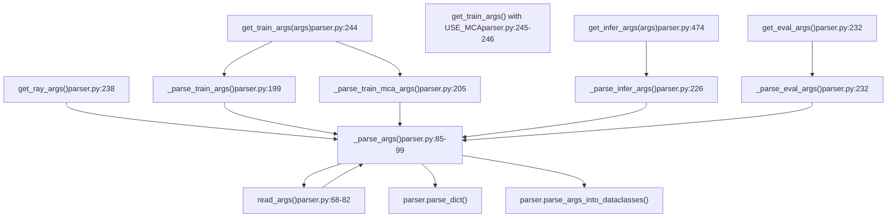
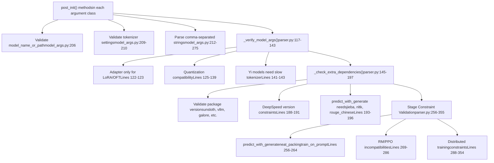
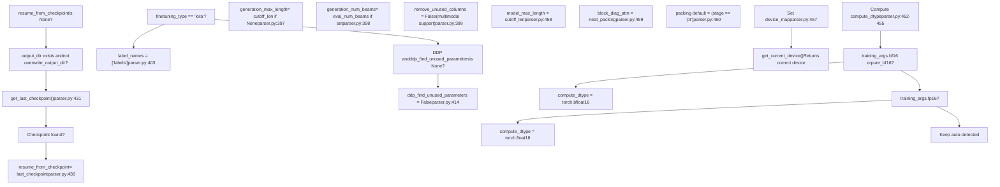
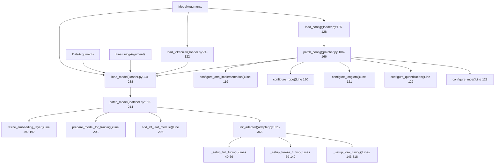

# Configuration System

Relevant source files

-   [README.md](https://github.com/hiyouga/LlamaFactory/blob/355d5c5e/README.md?plain=1)
-   [README\_zh.md](https://github.com/hiyouga/LlamaFactory/blob/355d5c5e/README_zh.md?plain=1)
-   [src/llamafactory/hparams/model\_args.py](https://github.com/hiyouga/LlamaFactory/blob/355d5c5e/src/llamafactory/hparams/model_args.py)
-   [src/llamafactory/hparams/parser.py](https://github.com/hiyouga/LlamaFactory/blob/355d5c5e/src/llamafactory/hparams/parser.py)
-   [src/llamafactory/model/adapter.py](https://github.com/hiyouga/LlamaFactory/blob/355d5c5e/src/llamafactory/model/adapter.py)
-   [src/llamafactory/model/loader.py](https://github.com/hiyouga/LlamaFactory/blob/355d5c5e/src/llamafactory/model/loader.py)
-   [src/llamafactory/model/model\_utils/unsloth.py](https://github.com/hiyouga/LlamaFactory/blob/355d5c5e/src/llamafactory/model/model_utils/unsloth.py)
-   [src/llamafactory/model/patcher.py](https://github.com/hiyouga/LlamaFactory/blob/355d5c5e/src/llamafactory/model/patcher.py)

## Purpose and Scope

The Configuration System is the central nervous system of LlamaFactory, responsible for parsing, validating, and routing all user-specified parameters to the appropriate subsystems. This document covers the argument parsing pipeline, the five primary argument types, validation logic, and configuration file formats.

For details on specific argument categories and their parameters, see [Argument Types and Validation](/hiyouga/LlamaFactory/3.1-argument-types-and-validation). For practical examples of creating configuration files, see [Configuration Files (YAML/JSON)](/hiyouga/LlamaFactory/3.2-configuration-files-(yamljson)). For information on how these configurations affect model loading, see [Model Loading and Configuration](/hiyouga/LlamaFactory/5-model-loading-and-configuration). For training-specific parameters, see [Training System](/hiyouga/LlamaFactory/6-training-system).

---

## System Overview

The configuration system processes user inputs from three entry points (CLI, Web UI, API) and transforms them into typed, validated argument objects that control all aspects of training and inference.


**Sources:** [src/llamafactory/hparams/parser.py68-471](https://github.com/hiyouga/LlamaFactory/blob/355d5c5e/src/llamafactory/hparams/parser.py#L68-L471)

---

## Argument Types

LlamaFactory organizes configuration into five typed argument classes, each managing a distinct aspect of the system. These classes use Python's `@dataclass` decorator with extensive field validation.

### Argument Type Hierarchy


**Sources:** [src/llamafactory/hparams/parser.py49-54](https://github.com/hiyouga/LlamaFactory/blob/355d5c5e/src/llamafactory/hparams/parser.py#L49-L54) [src/llamafactory/hparams/model\_args.py510-546](https://github.com/hiyouga/LlamaFactory/blob/355d5c5e/src/llamafactory/hparams/model_args.py#L510-L546)

### Argument Type Responsibilities

| Argument Type | Primary Responsibility | Key File | Example Parameters |
| --- | --- | --- | --- |
| `ModelArguments` | Model selection, loading, quantization, inference backend | [model\_args.py510-546](https://github.com/hiyouga/LlamaFactory/blob/355d5c5e/model_args.py#L510-L546) | `model_name_or_path`, `quantization_bit`, `adapter_name_or_path`, `infer_backend` |
| `DataArguments` | Dataset loading, preprocessing, templates, cutoff | data\_args.py | `dataset`, `template`, `cutoff_len`, `packing`, `val_size` |
| `TrainingArguments` | Optimizer, learning rate, batch size, distributed training | training\_args.py | `learning_rate`, `per_device_train_batch_size`, `num_train_epochs`, `deepspeed` |
| `FinetuningArguments` | Fine-tuning method, LoRA config, training stage | finetuning\_args.py | `finetuning_type`, `lora_rank`, `lora_target`, `stage` |
| `GeneratingArguments` | Generation parameters for inference/evaluation | generating\_args.py | `temperature`, `top_p`, `top_k`, `max_new_tokens` |

**Sources:** [src/llamafactory/hparams/parser.py49-54](https://github.com/hiyouga/LlamaFactory/blob/355d5c5e/src/llamafactory/hparams/parser.py#L49-L54)

### ModelArguments Internal Structure

`ModelArguments` is a composite class that inherits from seven specialized argument groups:

```
@dataclassclass ModelArguments(    SGLangArguments,        # SGLang inference engine config    VllmArguments,          # vLLM inference engine config    KTransformersArguments, # KTransformers training config    ExportArguments,        # Model export and merging    ProcessorArguments,     # Image/video/audio processing    QuantizationArguments,  # 4/8-bit quantization    BaseModelArguments,     # Core model parameters):    # Derived fields (computed, not user-specified)    compute_dtype: torch.dtype | None = field(default=None, init=False)    device_map: str | dict[str, Any] | None = field(default=None, init=False)    model_max_length: int | None = field(default=None, init=False)    block_diag_attn: bool = field(default=False, init=False)
```
**Key Fields in BaseModelArguments:**

| Field | Type | Purpose | Validation |
| --- | --- | --- | --- |
| `model_name_or_path` | `str` | HuggingFace/ModelScope model identifier | Required, validated in `__post_init__` [model\_args.py206-207](https://github.com/hiyouga/LlamaFactory/blob/355d5c5e/model_args.py#L206-L207) |
| `adapter_name_or_path` | `str` | Comma-separated adapter paths to load/merge | Split into list [model\_args.py212-213](https://github.com/hiyouga/LlamaFactory/blob/355d5c5e/model_args.py#L212-L213) |
| `quantization_bit` | `int` | Bits for quantization (4/8) | Must use with LoRA/OFT [parser.py125-139](https://github.com/hiyouga/LlamaFactory/blob/355d5c5e/parser.py#L125-L139) |
| `flash_attn` | `AttentionFunction` | FlashAttention mode (auto/fa2/sdpa/disabled) | Configured in [patcher.py119](https://github.com/hiyouga/LlamaFactory/blob/355d5c5e/patcher.py#L119-L119) |
| `rope_scaling` | `RopeScaling` | RoPE scaling strategy (linear/dynamic/yarn) | Applied in [patcher.py120](https://github.com/hiyouga/LlamaFactory/blob/355d5c5e/patcher.py#L120-L120) |
| `infer_backend` | `EngineName` | Inference engine (hf/vllm/sglang/kt) | Must be `hf` for training [parser.py344-345](https://github.com/hiyouga/LlamaFactory/blob/355d5c5e/parser.py#L344-L345) |

**Sources:** [src/llamafactory/hparams/model\_args.py33-546](https://github.com/hiyouga/LlamaFactory/blob/355d5c5e/src/llamafactory/hparams/model_args.py#L33-L546)

---

## Configuration File Format

LlamaFactory supports both YAML and JSON configuration files. The parser automatically detects the format based on file extension.

### File Detection Logic


**Sources:** [src/llamafactory/hparams/parser.py68-82](https://github.com/hiyouga/LlamaFactory/blob/355d5c5e/src/llamafactory/hparams/parser.py#L68-L82)

### YAML Configuration Structure

YAML files provide the cleanest syntax for complex configurations:

```
# Model configurationmodel_name_or_path: meta-llama/Llama-2-7b-hfadapter_name_or_path: path/to/lora1,path/to/lora2  # Comma-separated for mergingquantization_bit: 4flash_attn: fa2 # Data configurationdataset: alpaca_en,alpaca_zh  # Multiple datasetstemplate: llama2cutoff_len: 2048val_size: 0.1 # Training configurationoutput_dir: ./outputnum_train_epochs: 3per_device_train_batch_size: 4learning_rate: 5.0e-5fp16: true # Fine-tuning configurationfinetuning_type: loralora_rank: 8lora_target: q_proj,v_projstage: sft
```
### Command-Line Overrides

Configuration files can be overridden via command line using OmegaConf syntax:

```
llamafactory-cli train config.yaml \    learning_rate=1e-4 \    output_dir=./custom_output \    lora_rank=16
```
The override mechanism merges CLI arguments with the loaded config [parser.py74-76](https://github.com/hiyouga/LlamaFactory/blob/355d5c5e/parser.py#L74-L76)

**Sources:** [src/llamafactory/hparams/parser.py73-80](https://github.com/hiyouga/LlamaFactory/blob/355d5c5e/src/llamafactory/hparams/parser.py#L73-L80)

---

## Parsing Pipeline

The parsing pipeline consists of multiple stages: reading, parsing, validation, and post-processing.

### Main Entry Points


**Sources:** [src/llamafactory/hparams/parser.py68-241](https://github.com/hiyouga/LlamaFactory/blob/355d5c5e/src/llamafactory/hparams/parser.py#L68-L241)

### Argument Parsing Flow

The `_parse_args` function handles both dictionary and list inputs:

```
def _parse_args(    parser: "HfArgumentParser",     args: dict[str, Any] | list[str] | None = None,     allow_extra_keys: bool = False) -> tuple[Any]:    args = read_args(args)  # Load from file or use provided args        if isinstance(args, dict):        # Direct dict parsing (from YAML/JSON or Python dict)        return parser.parse_dict(args, allow_extra_keys=allow_extra_keys)        # List parsing (from command line)    (*parsed_args, unknown_args) = parser.parse_args_into_dataclasses(        args=args,         return_remaining_strings=True    )        if unknown_args and not allow_extra_keys:        print(parser.format_help())        raise ValueError(f"Some specified arguments are not used: {unknown_args}")        return tuple(parsed_args)
```
**Sources:** [src/llamafactory/hparams/parser.py85-99](https://github.com/hiyouga/LlamaFactory/blob/355d5c5e/src/llamafactory/hparams/parser.py#L85-L99)

### Environment Variable Support

Several environment variables affect parsing behavior:

| Environment Variable | Effect | Location |
| --- | --- | --- |
| `USE_MCA` | Enable Megatron-core adapter training args | [parser.py56-65](https://github.com/hiyouga/LlamaFactory/blob/355d5c5e/parser.py#L56-L65) |
| `ALLOW_EXTRA_ARGS` | Allow unknown arguments without error | [parser.py201](https://github.com/hiyouga/LlamaFactory/blob/355d5c5e/parser.py#L201-L201) |
| `LLAMAFACTORY_VERBOSITY` | Set transformers logging verbosity | [parser.py103-106](https://github.com/hiyouga/LlamaFactory/blob/355d5c5e/parser.py#L103-L106) |
| `NPU_JIT_COMPILE` | Enable JIT compilation on NPU devices | [parser.py112](https://github.com/hiyouga/LlamaFactory/blob/355d5c5e/parser.py#L112-L112) |
| `VLLM_WORKER_MULTIPROC_METHOD` | Set vLLM multiprocessing method | [parser.py114](https://github.com/hiyouga/LlamaFactory/blob/355d5c5e/parser.py#L114-L114) |

**Sources:** [src/llamafactory/hparams/parser.py56-114](https://github.com/hiyouga/LlamaFactory/blob/355d5c5e/src/llamafactory/hparams/parser.py#L56-L114)

---

## Validation System

Validation occurs in multiple phases to ensure configuration consistency and catch errors early.

### Validation Architecture


**Sources:** [src/llamafactory/hparams/parser.py117-355](https://github.com/hiyouga/LlamaFactory/blob/355d5c5e/src/llamafactory/hparams/parser.py#L117-L355)

### Critical Validation Rules

#### Quantization Constraints

Quantization has strict compatibility requirements enforced in [parser.py125-139](https://github.com/hiyouga/LlamaFactory/blob/355d5c5e/parser.py#L125-L139):

```
if model_args.quantization_bit is not None:    # Rule 1: Only LoRA or OFT support quantization    if finetuning_args.finetuning_type not in ["lora", "oft"]:        raise ValueError("Quantization is only compatible with the LoRA or OFT method.")        # Rule 2: Cannot use PiSSA with quantized models    if finetuning_args.pissa_init:        raise ValueError("Please use scripts/pissa_init.py to initialize PiSSA for a quantized model.")        # Rule 3: Cannot resize vocab on quantized models    if model_args.resize_vocab:        raise ValueError("Cannot resize embedding layers of a quantized model.")        # Rule 4: Cannot create new adapters on quantized models    if model_args.adapter_name_or_path is not None and finetuning_args.create_new_adapter:        raise ValueError("Cannot create new adapter upon a quantized model.")        # Rule 5: Only single adapter allowed with quantization    if model_args.adapter_name_or_path is not None and len(model_args.adapter_name_or_path) != 1:        raise ValueError("Quantized model only accepts a single adapter. Merge them first.")
```
**Sources:** [src/llamafactory/hparams/parser.py125-139](https://github.com/hiyouga/LlamaFactory/blob/355d5c5e/src/llamafactory/hparams/parser.py#L125-L139)

#### Stage-Specific Constraints

Different training stages have different requirements [parser.py256-286](https://github.com/hiyouga/LlamaFactory/blob/355d5c5e/parser.py#L256-L286):

| Constraint | Applies To | Rationale | Line |
| --- | --- | --- | --- |
| `predict_with_generate` only for SFT | All except SFT | Generation metrics only make sense for autoregressive models | 256-258 |
| `neat_packing` only for SFT | All except SFT | Packed sequences only valid for SFT | 260-261 |
| `train_on_prompt`/`mask_history` only for SFT | All except SFT | Masking logic is SFT-specific | 263-264 |
| `predict_with_generate` required for predictions | SFT with `do_predict` | Need generation to save predictions | 266-267 |
| `load_best_model_at_end` not for RM/PPO | RM, PPO | Value head causes checkpoint issues | 269-270 |
| PPO requires training mode | PPO | PPO cannot evaluate | 272-274 |
| PPO incompatible with S²-Attn | PPO | Shift attention breaks PPO | 276-277 |

**Sources:** [src/llamafactory/hparams/parser.py256-286](https://github.com/hiyouga/LlamaFactory/blob/355d5c5e/src/llamafactory/hparams/parser.py#L256-L286)

#### Distributed Training Constraints

Distributed training has specific limitations [parser.py325-339](https://github.com/hiyouga/LlamaFactory/blob/355d5c5e/parser.py#L325-L339):

```
if training_args.parallel_mode == ParallelMode.DISTRIBUTED:    # Layer-wise optimizers don't work distributed    if finetuning_args.use_galore and finetuning_args.galore_layerwise:        raise ValueError("Distributed training does not support layer-wise GaLore.")        if finetuning_args.use_apollo and finetuning_args.apollo_layerwise:        raise ValueError("Distributed training does not support layer-wise APOLLO.")        # BAdam has special requirements    if finetuning_args.use_badam:        if finetuning_args.badam_mode == "ratio":            raise ValueError("Radio-based BAdam does not yet support distributed training...")        elif not is_deepspeed_zero3_enabled():            raise ValueError("Layer-wise BAdam only supports DeepSpeed ZeRO-3 training.")
```
**Sources:** [src/llamafactory/hparams/parser.py325-336](https://github.com/hiyouga/LlamaFactory/blob/355d5c5e/src/llamafactory/hparams/parser.py#L325-L336)

---

## Post-Processing

After validation, the system performs post-processing to compute derived values and apply defaults.

### Post-Processing Pipeline


**Sources:** [src/llamafactory/hparams/parser.py396-460](https://github.com/hiyouga/LlamaFactory/blob/355d5c5e/src/llamafactory/hparams/parser.py#L396-L460)

### Derived Arguments

Several arguments are computed rather than user-specified:

```
# Compute dtype from training precisionif training_args.bf16 or finetuning_args.pure_bf16:    model_args.compute_dtype = torch.bfloat16elif training_args.fp16:    model_args.compute_dtype = torch.float16# parser.py:452-455 # Device placementmodel_args.device_map = {"": get_current_device()}# parser.py:457 # Sync cutoff length to modelmodel_args.model_max_length = data_args.cutoff_len# parser.py:458 # Enable block diagonal attention if using neat packingmodel_args.block_diag_attn = data_args.neat_packing# parser.py:459 # Auto-enable packing for pretraining if not explicitly setdata_args.packing = data_args.packing if data_args.packing is not None else finetuning_args.stage == "pt"# parser.py:460
```
**Sources:** [src/llamafactory/hparams/parser.py452-460](https://github.com/hiyouga/LlamaFactory/blob/355d5c5e/src/llamafactory/hparams/parser.py#L452-L460)

### Checkpoint Auto-Resume

The system automatically detects and resumes from the last checkpoint if conditions are met [parser.py424-440](https://github.com/hiyouga/LlamaFactory/blob/355d5c5e/parser.py#L424-L440):

```
if (    training_args.resume_from_checkpoint is None  # Not explicitly set    and training_args.do_train                     # Training mode    and os.path.isdir(training_args.output_dir)   # Output dir exists    and not training_args.overwrite_output_dir    # Not overwriting    and can_resume_from_checkpoint                 # Stage supports resume):    last_checkpoint = get_last_checkpoint(training_args.output_dir)        # Check if output dir has model files but no checkpoint metadata    if last_checkpoint is None and any(        os.path.isfile(os.path.join(training_args.output_dir, name))         for name in CHECKPOINT_NAMES    ):        raise ValueError("Output directory already exists and is not empty. Please set `overwrite_output_dir`.")        if last_checkpoint is not None:        training_args.resume_from_checkpoint = last_checkpoint        logger.info_rank0(f"Resuming training from {training_args.resume_from_checkpoint}.")
```
**Sources:** [src/llamafactory/hparams/parser.py424-440](https://github.com/hiyouga/LlamaFactory/blob/355d5c5e/src/llamafactory/hparams/parser.py#L424-L440)

---

## Configuration Flow to Model System

The validated configuration flows into the model loading and patching systems.

### Config-to-Model Pipeline


**Sources:** [src/llamafactory/model/loader.py71-238](https://github.com/hiyouga/LlamaFactory/blob/355d5c5e/src/llamafactory/model/loader.py#L71-L238) [src/llamafactory/model/patcher.py106-214](https://github.com/hiyouga/LlamaFactory/blob/355d5c5e/src/llamafactory/model/patcher.py#L106-L214) [src/llamafactory/model/adapter.py321-366](https://github.com/hiyouga/LlamaFactory/blob/355d5c5e/src/llamafactory/model/adapter.py#L321-L366)

### Configuration Application Examples

#### Example 1: Quantization Configuration Applied

When `quantization_bit=4` is set:

1.  **Parser validates** [parser.py125-127](https://github.com/hiyouga/LlamaFactory/blob/355d5c5e/parser.py#L125-L127): Must be used with LoRA/OFT
2.  **Config patching** [patcher.py122](https://github.com/hiyouga/LlamaFactory/blob/355d5c5e/patcher.py#L122-L122): Calls `configure_quantization(config, tokenizer, model_args, is_trainable, init_kwargs)`
3.  **Quantization setup** (in configure\_quantization): Sets BitsAndBytes config in `init_kwargs`
4.  **Model loading** [loader.py179](https://github.com/hiyouga/LlamaFactory/blob/355d5c5e/loader.py#L179-L179): `AutoModelForCausalLM.from_pretrained(**init_kwargs)` loads quantized model
5.  **Adapter setup** [adapter.py334-336](https://github.com/hiyouga/LlamaFactory/blob/355d5c5e/adapter.py#L334-L336): Enforces LoRA/OFT constraint again

#### Example 2: Adapter Loading and Merging

When `adapter_name_or_path="lora1,lora2,lora3"` is set:

1.  **Parser splits string** [model\_args.py212-213](https://github.com/hiyouga/LlamaFactory/blob/355d5c5e/model_args.py#L212-L213): Creates list `["lora1", "lora2", "lora3"]`
2.  **Validation checks** [parser.py122-123](https://github.com/hiyouga/LlamaFactory/blob/355d5c5e/parser.py#L122-L123): Ensures LoRA fine-tuning type
3.  **Adapter initialization** [adapter.py159-212](https://github.com/hiyouga/LlamaFactory/blob/355d5c5e/adapter.py#L159-L212):
    -   If training and not creating new adapter: Merge first N-1, load last one
    -   If inference: Merge all adapters
    -   Calls `PeftModel.from_pretrained()` for each adapter [adapter.py198](https://github.com/hiyouga/LlamaFactory/blob/355d5c5e/adapter.py#L198-L198)
    -   Calls `model.merge_and_unload()` for adapters to merge [adapter.py199](https://github.com/hiyouga/LlamaFactory/blob/355d5c5e/adapter.py#L199-L199)

**Sources:** [src/llamafactory/hparams/parser.py125-139](https://github.com/hiyouga/LlamaFactory/blob/355d5c5e/src/llamafactory/hparams/parser.py#L125-L139) [src/llamafactory/hparams/model\_args.py212-213](https://github.com/hiyouga/LlamaFactory/blob/355d5c5e/src/llamafactory/hparams/model_args.py#L212-L213) [src/llamafactory/model/adapter.py159-212](https://github.com/hiyouga/LlamaFactory/blob/355d5c5e/src/llamafactory/model/adapter.py#L159-L212)

---

## Usage Patterns

### Command-Line Usage

```
# Pure command line (all arguments as flags)llamafactory-cli train \    --model_name_or_path meta-llama/Llama-2-7b-hf \    --dataset alpaca_en \    --template llama2 \    --finetuning_type lora \    --lora_rank 8 \    --output_dir ./output \    --per_device_train_batch_size 4 \    --learning_rate 5e-5 # YAML config file with overridesllamafactory-cli train config.yaml \    learning_rate=1e-4 \    output_dir=./custom_output # JSON config filellamafactory-cli train config.json
```
### Python API Usage

```
from llamafactory.hparams import get_train_args # Dict-based configurationconfig = {    "model_name_or_path": "meta-llama/Llama-2-7b-hf",    "dataset": "alpaca_en",    "template": "llama2",    "finetuning_type": "lora",    "lora_rank": 8,    "output_dir": "./output",    "per_device_train_batch_size": 4,    "learning_rate": 5e-5,} model_args, data_args, training_args, finetuning_args, generating_args = get_train_args(config)
```
### Web UI Integration

The Web UI builds argument dictionaries from Gradio component values and passes them to `get_train_args()`. See [Web UI Architecture](/hiyouga/LlamaFactory/8.1-web-ui-architecture) for details.

**Sources:** [src/llamafactory/hparams/parser.py68-82](https://github.com/hiyouga/LlamaFactory/blob/355d5c5e/src/llamafactory/hparams/parser.py#L68-L82) [src/llamafactory/hparams/parser.py244-471](https://github.com/hiyouga/LlamaFactory/blob/355d5c5e/src/llamafactory/hparams/parser.py#L244-L471)

---

## Special Configuration Modes

### Megatron-Core Adapter Mode

When `USE_MCA` environment variable is set, the system uses Megatron-core training arguments [parser.py56-65](https://github.com/hiyouga/LlamaFactory/blob/355d5c5e/parser.py#L56-L65):

```
if is_mcore_adapter_available() and is_env_enabled("USE_MCA"):    from mcore_adapter import TrainingArguments as McaTrainingArguments        _TRAIN_MCA_ARGS = [ModelArguments, DataArguments, McaTrainingArguments,                        FinetuningArguments, GeneratingArguments]
```
The `_configure_mca_training_args()` function patches specific arguments [parser.py217-223](https://github.com/hiyouga/LlamaFactory/blob/355d5c5e/parser.py#L217-L223):

```
def _configure_mca_training_args(training_args, data_args, finetuning_args) -> None:    training_args.predict_with_generate = False    training_args.generation_max_length = data_args.cutoff_len    training_args.generation_num_beams = 1    training_args.use_mca = True    finetuning_args.use_mca = True
```
**Sources:** [src/llamafactory/hparams/parser.py56-65](https://github.com/hiyouga/LlamaFactory/blob/355d5c5e/src/llamafactory/hparams/parser.py#L56-L65) [src/llamafactory/hparams/parser.py217-224](https://github.com/hiyouga/LlamaFactory/blob/355d5c5e/src/llamafactory/hparams/parser.py#L217-L224)

### Inference-Only Configuration

For inference, use `get_infer_args()` which excludes `TrainingArguments` [parser.py474-521](https://github.com/hiyouga/LlamaFactory/blob/355d5c5e/parser.py#L474-L521):

```
model_args, data_args, finetuning_args, generating_args = get_infer_args(args)
```
Key inference-specific validations [parser.py481-492](https://github.com/hiyouga/LlamaFactory/blob/355d5c5e/parser.py#L481-L492):

-   vLLM engine only supports SFT stage
-   vLLM doesn't support BitsAndBytes quantization (GPTQ/AWQ ok)
-   vLLM doesn't support RoPE scaling
-   vLLM accepts only single adapter

**Sources:** [src/llamafactory/hparams/parser.py474-521](https://github.com/hiyouga/LlamaFactory/blob/355d5c5e/src/llamafactory/hparams/parser.py#L474-L521)

---

## Configuration Tables

### Critical Configuration Combinations

| Scenario | Required Args | Forbidden Args | Notes |
| --- | --- | --- | --- |
| QLoRA Training | `quantization_bit=4`, `finetuning_type=lora` | `pissa_init`, `resize_vocab`, `create_new_adapter` | Only single adapter allowed [parser.py125-139](https://github.com/hiyouga/LlamaFactory/blob/355d5c5e/parser.py#L125-L139) |
| Full Fine-Tuning | `finetuning_type=full` | `adapter_name_or_path` | All parameters trained except forbidden modules [adapter.py40-56](https://github.com/hiyouga/LlamaFactory/blob/355d5c5e/adapter.py#L40-L56) |
| Merge Multiple LoRAs | `adapter_name_or_path="lora1,lora2"` | `quantization_bit`, `deepspeed` ZeRO-3 | Merges N-1 adapters, loads last [adapter.py177-181](https://github.com/hiyouga/LlamaFactory/blob/355d5c5e/adapter.py#L177-L181) |
| PPO Training | `stage=ppo` | `shift_attn`, `predict_with_generate` | Requires training mode, specific reward model config [parser.py272-286](https://github.com/hiyouga/LlamaFactory/blob/355d5c5e/parser.py#L272-L286) |
| vLLM Inference | `infer_backend=vllm` | `quantization_bit` (BNB), `rope_scaling` | Only for training=False [parser.py481-492](https://github.com/hiyouga/LlamaFactory/blob/355d5c5e/parser.py#L481-L492) |

### Environment Variables Reference

| Variable | Effect | Default | Location |
| --- | --- | --- | --- |
| `USE_MCA` | Enable Megatron-core adapter training | Not set | [parser.py56](https://github.com/hiyouga/LlamaFactory/blob/355d5c5e/parser.py#L56-L56) |
| `ALLOW_EXTRA_ARGS` | Allow unknown CLI arguments | Not set | [parser.py201](https://github.com/hiyouga/LlamaFactory/blob/355d5c5e/parser.py#L201-L201) |
| `LLAMAFACTORY_VERBOSITY` | Logging level (DEBUG/INFO/WARNING/ERROR) | INFO | [parser.py103](https://github.com/hiyouga/LlamaFactory/blob/355d5c5e/parser.py#L103-L103) |
| `NPU_JIT_COMPILE` | Enable JIT on NPU devices | Not set | [parser.py112](https://github.com/hiyouga/LlamaFactory/blob/355d5c5e/parser.py#L112-L112) |
| `VLLM_WORKER_MULTIPROC_METHOD` | vLLM process spawn method | spawn (on NPU) | [parser.py114](https://github.com/hiyouga/LlamaFactory/blob/355d5c5e/parser.py#L114-L114) |
| `DISABLE_VERSION_CHECK` | Skip transformers version check | Not set | README |
| `FORCE_TORCHRUN` | Force torchrun for DeepSpeed | Not set | [parser.py292](https://github.com/hiyouga/LlamaFactory/blob/355d5c5e/parser.py#L292-L292) |

**Sources:** [src/llamafactory/hparams/parser.py56-114](https://github.com/hiyouga/LlamaFactory/blob/355d5c5e/src/llamafactory/hparams/parser.py#L56-L114) [src/llamafactory/hparams/parser.py201](https://github.com/hiyouga/LlamaFactory/blob/355d5c5e/src/llamafactory/hparams/parser.py#L201-L201) [src/llamafactory/hparams/parser.py292](https://github.com/hiyouga/LlamaFactory/blob/355d5c5e/src/llamafactory/hparams/parser.py#L292-L292)
