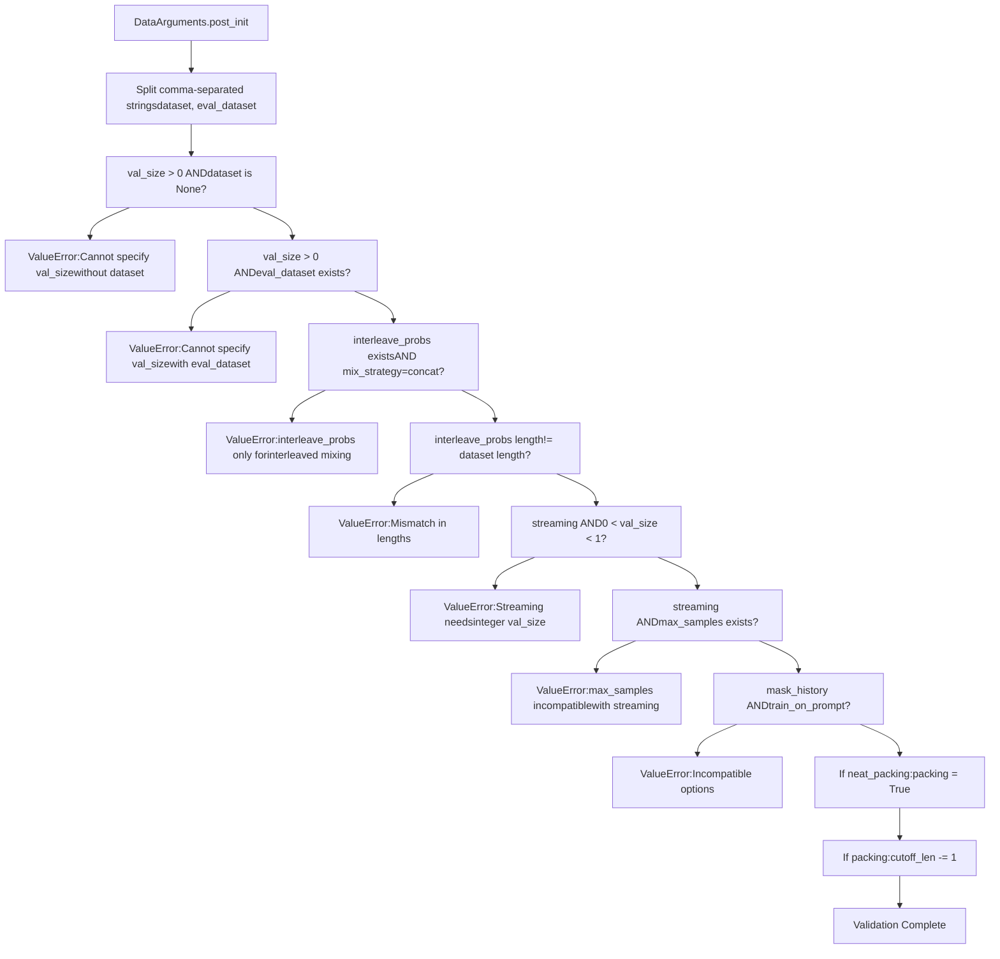
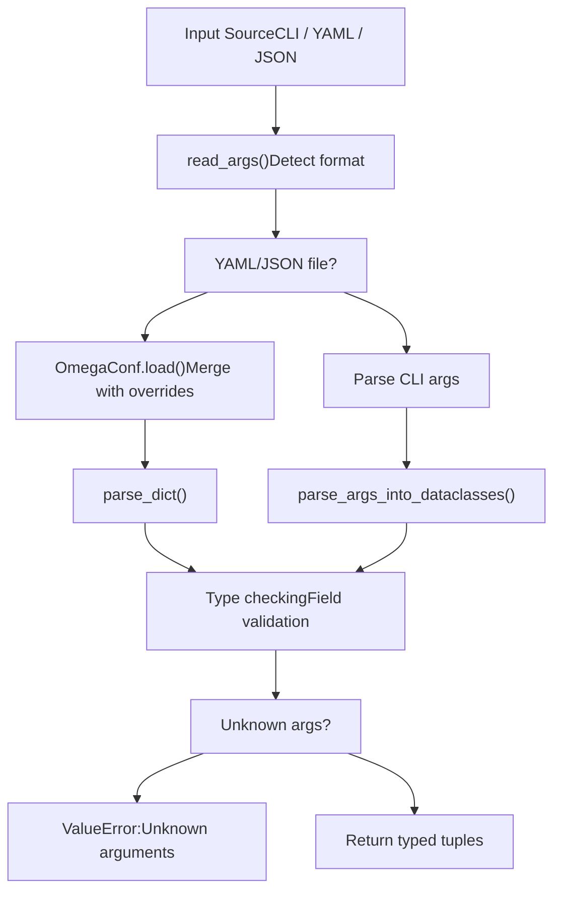
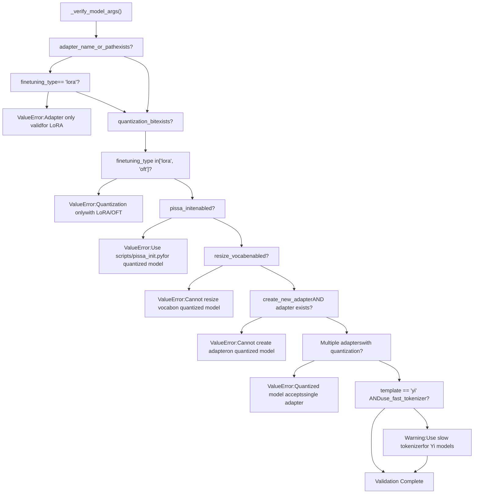
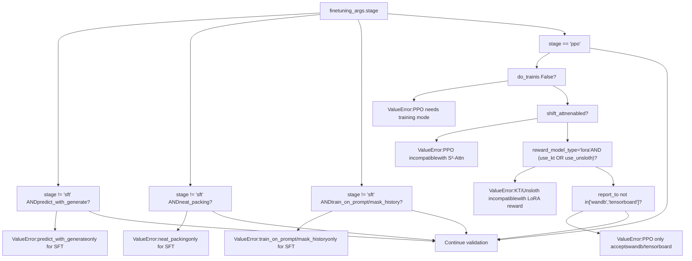
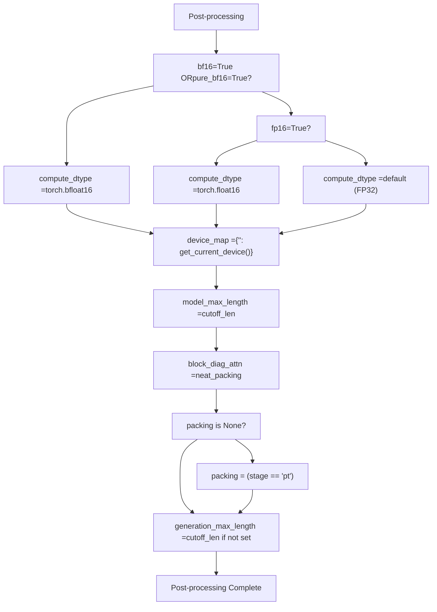
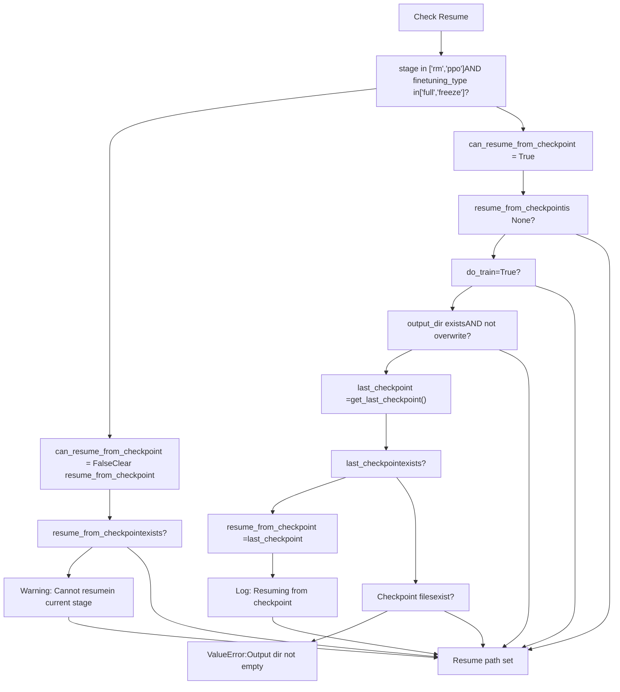

# Argument Types and Validation

Relevant source files

-   [README.md](https://github.com/hiyouga/LlamaFactory/blob/355d5c5e/README.md?plain=1)
-   [README\_zh.md](https://github.com/hiyouga/LlamaFactory/blob/355d5c5e/README_zh.md?plain=1)
-   [src/llamafactory/data/loader.py](https://github.com/hiyouga/LlamaFactory/blob/355d5c5e/src/llamafactory/data/loader.py)
-   [src/llamafactory/data/parser.py](https://github.com/hiyouga/LlamaFactory/blob/355d5c5e/src/llamafactory/data/parser.py)
-   [src/llamafactory/hparams/data\_args.py](https://github.com/hiyouga/LlamaFactory/blob/355d5c5e/src/llamafactory/hparams/data_args.py)
-   [src/llamafactory/hparams/parser.py](https://github.com/hiyouga/LlamaFactory/blob/355d5c5e/src/llamafactory/hparams/parser.py)

## Purpose and Scope

This document describes the five core argument types used throughout LlamaFactory (`ModelArguments`, `DataArguments`, `FinetuningArguments`, `TrainingArguments`, and `GeneratingArguments`) and the multi-stage validation pipeline that ensures configuration consistency before expensive operations begin. The validation system catches incompatible parameter combinations, missing dependencies, and invalid training configurations early in the execution flow.

For information about configuration files (YAML/JSON), see [Configuration Files](/hiyouga/LlamaFactory/3.2-configuration-files-(yamljson)). For details on how arguments flow through the training pipeline, see [Configuration System](/hiyouga/LlamaFactory/3-configuration-system).

## Overview of Argument Types

LlamaFactory uses a typed argument system where all configuration parameters are organized into five dataclasses. Each dataclass encapsulates related parameters and includes field-level validation via `__post_init__` methods.

### Argument Type Structure

```mermaid
flowchart TD
    MA["ModelArgumentsmodel_name_or_pathquantization_bitadapter_name_or_pathinfer_backend..."]
    DA["DataArgumentsdatasettemplatecutoff_lenpacking..."]
    FA["FinetuningArgumentsfinetuning_typestagelora_ranklora_alpha..."]
    TA["TrainingArgumentslearning_ratenum_train_epochsper_device_train_batch_sizedeepspeed..."]
    GA["GeneratingArgumentstemperaturetop_pmax_new_tokens..."]
    Train["TrainingMA + DA + TA + FA + GA"]
    Infer["InferenceMA + DA + FA + GA"]
    Eval["EvaluationMA + DA + EvalArgs + FA"]

    MA --> Train
    DA --> Train
    TA --> Train
    FA --> Train
    GA --> Train
    MA --> Infer
    DA --> Infer
    FA --> Infer
    GA --> Infer
    MA --> Eval
    DA --> Eval
    FA --> Eval
```

**Sources:** [src/llamafactory/hparams/parser.py49-54](https://github.com/hiyouga/LlamaFactory/blob/355d5c5e/src/llamafactory/hparams/parser.py#L49-L54)

### Argument Type Selection by Context

Different entry points require different argument combinations:

| Context | Required Arguments | Entry Function |
| --- | --- | --- |
| Training | `ModelArguments`, `DataArguments`, `TrainingArguments`, `FinetuningArguments`, `GeneratingArguments` | `get_train_args()` |
| Inference | `ModelArguments`, `DataArguments`, `FinetuningArguments`, `GeneratingArguments` | `get_infer_args()` |
| Evaluation | `ModelArguments`, `DataArguments`, `EvaluationArguments`, `FinetuningArguments` | `get_eval_args()` |

**Sources:** [src/llamafactory/hparams/parser.py244-527](https://github.com/hiyouga/LlamaFactory/blob/355d5c5e/src/llamafactory/hparams/parser.py#L244-L527)

## ModelArguments

`ModelArguments` contains parameters for model loading, quantization, adapter configuration, and inference backend selection. These parameters control how the base model is initialized and modified.

**Key Fields:**

-   `model_name_or_path`: HuggingFace model ID or local path
-   `quantization_bit`: Quantization precision (4, 8, etc.)
-   `adapter_name_or_path`: List of LoRA/adapter paths to load
-   `infer_backend`: Backend engine (`hf`, `vllm`, `sglang`, `kt`)
-   `use_unsloth`: Enable Unsloth optimization
-   `use_kt`: Enable KTransformers optimization
-   `shift_attn`: Enable LongLoRA's S²-Attn
-   `rope_scaling`: RoPE scaling method
-   `flash_attn`: Flash attention implementation

**Sources:** [src/llamafactory/hparams/parser.py40-144](https://github.com/hiyouga/LlamaFactory/blob/355d5c5e/src/llamafactory/hparams/parser.py#L40-L144)

## DataArguments

`DataArguments` contains dataset configuration, template selection, preprocessing parameters, and data mixing strategies. This class includes extensive `__post_init__` validation.

**Key Fields:**

-   `dataset`: Comma-separated list of dataset names
-   `eval_dataset`: Comma-separated list of evaluation datasets
-   `template`: Chat template name
-   `cutoff_len`: Maximum sequence length (default: 2048)
-   `packing`: Enable sequence packing
-   `neat_packing`: Enable packing without cross-attention
-   `streaming`: Enable dataset streaming
-   `mix_strategy`: Dataset mixing method (`concat`, `interleave_under`, `interleave_over`)
-   `val_size`: Validation split size
-   `train_on_prompt`: Whether to compute loss on prompt tokens
-   `mask_history`: Whether to mask conversation history

### DataArguments Validation Rules

The `__post_init__` method in `DataArguments` enforces several constraints:

**Sources:** [src/llamafactory/hparams/data\_args.py141-184](https://github.com/hiyouga/LlamaFactory/blob/355d5c5e/src/llamafactory/hparams/data_args.py#L141-L184)

## FinetuningArguments

`FinetuningArguments` specifies the fine-tuning method (full, freeze, LoRA, OFT), training stage, and method-specific hyperparameters. This class is critical for determining compatibility constraints.

**Key Fields:**

-   `stage`: Training stage (`pt`, `sft`, `rm`, `ppo`, `dpo`, `kto`, `orpo`, `simpo`)
-   `finetuning_type`: Method type (`full`, `freeze`, `lora`, `oft`)
-   `lora_rank`: LoRA rank parameter
-   `lora_alpha`: LoRA alpha parameter
-   `additional_target`: Additional modules to apply adapters
-   `pissa_init`: Enable PiSSA initialization
-   `use_galore`: Enable GaLore optimizer
-   `use_apollo`: Enable APOLLO optimizer
-   `use_badam`: Enable BAdam optimizer
-   `use_adam_mini`: Enable Adam-mini optimizer
-   `pure_bf16`: Enable pure BF16 training
-   `compute_accuracy`: Compute accuracy metrics
-   `reward_model_type`: Reward model type for PPO

**Sources:** [src/llamafactory/hparams/parser.py38-126](https://github.com/hiyouga/LlamaFactory/blob/355d5c5e/src/llamafactory/hparams/parser.py#L38-L126)

## TrainingArguments

`TrainingArguments` extends HuggingFace's `Seq2SeqTrainingArguments` with additional fields for distributed training, monitoring, and LlamaFactory-specific optimizations.

**Key Fields (beyond HF TrainingArguments):**

-   `deepspeed`: DeepSpeed configuration file
-   `fsdp`: FSDP configuration
-   `report_to`: Monitoring services list
-   `fp8`: Enable FP8 training
-   `predict_with_generate`: Use generation for evaluation
-   `generation_max_length`: Max generation length
-   `generation_num_beams`: Beam search size

**Sources:** [src/llamafactory/hparams/parser.py41](https://github.com/hiyouga/LlamaFactory/blob/355d5c5e/src/llamafactory/hparams/parser.py#L41-L41)

## GeneratingArguments

`GeneratingArguments` contains generation/inference parameters like temperature, top-p sampling, and token limits.

**Key Fields:**

-   `temperature`: Sampling temperature
-   `top_p`: Nucleus sampling threshold
-   `top_k`: Top-k sampling parameter
-   `max_new_tokens`: Maximum tokens to generate
-   `num_return_sequences`: Number of sequences to generate

**Sources:** [src/llamafactory/hparams/parser.py39](https://github.com/hiyouga/LlamaFactory/blob/355d5c5e/src/llamafactory/hparams/parser.py#L39-L39)

## Validation Pipeline

The validation pipeline consists of four stages that execute sequentially, ensuring progressively stricter consistency checks.

### Stage 1: Argument Parsing

The `HfArgumentParser` from HuggingFace Transformers parses arguments from CLI, YAML, or JSON and performs type checking.

**Sources:** [src/llamafactory/hparams/parser.py68-100](https://github.com/hiyouga/LlamaFactory/blob/355d5c5e/src/llamafactory/hparams/parser.py#L68-L100)

### Stage 2: Field-Level Validation

Each argument dataclass's `__post_init__` method validates its own fields for internal consistency (example shown for `DataArguments` above).

**Sources:** [src/llamafactory/hparams/data\_args.py141-184](https://github.com/hiyouga/LlamaFactory/blob/355d5c5e/src/llamafactory/hparams/data_args.py#L141-L184)

### Stage 3: Cross-Argument Validation

The `_verify_model_args()` function validates relationships between `ModelArguments`, `DataArguments`, and `FinetuningArguments`:

**Sources:** [src/llamafactory/hparams/parser.py117-144](https://github.com/hiyouga/LlamaFactory/blob/355d5c5e/src/llamafactory/hparams/parser.py#L117-L144)

### Stage 4: Training-Specific Validation

The `get_train_args()` function performs extensive validation for training scenarios, checking:

#### Stage and Method Compatibility

**Sources:** [src/llamafactory/hparams/parser.py256-286](https://github.com/hiyouga/LlamaFactory/blob/355d5c5e/src/llamafactory/hparams/parser.py#L256-L286)

#### Distributed Training Constraints

| Constraint | Error Message |
| --- | --- |
| No distributed launch | "Please launch distributed training with `llamafactory-cli` or `torchrun`" |
| DeepSpeed without distributed mode | "Please use `FORCE_TORCHRUN=1` to launch DeepSpeed training" |
| Streaming without `max_steps` | "Please specify `max_steps` in streaming mode" |
| Layer-wise GaLore + Distributed | "Distributed training does not support layer-wise GaLore" |
| Layer-wise APOLLO + Distributed | "Distributed training does not support layer-wise APOLLO" |
| BAdam ratio mode + Distributed | "Radio-based BAdam does not yet support distributed training" |
| BAdam layer mode without DeepSpeed ZeRO-3 | "Layer-wise BAdam only supports DeepSpeed ZeRO-3 training" |

**Sources:** [src/llamafactory/hparams/parser.py288-337](https://github.com/hiyouga/LlamaFactory/blob/355d5c5e/src/llamafactory/hparams/parser.py#L288-L337)

#### Optimization and Precision Constraints

| Combination | Validation |
| --- | --- |
| GaLore/APOLLO + DeepSpeed | Invalid: "GaLore and APOLLO are incompatible with DeepSpeed yet" |
| FP8 + Quantization | Invalid: "FP8 training is not compatible with quantization" |
| `pure_bf16` without BF16 hardware | Invalid: "This device does not support `pure_bf16`" |
| `pure_bf16` + DeepSpeed ZeRO-3 | Invalid: "`pure_bf16` is incompatible with DeepSpeed ZeRO-3" |
| Unsloth + DeepSpeed ZeRO-3 | Invalid: "Unsloth is incompatible with DeepSpeed ZeRO-3" |
| KTransformers + DeepSpeed ZeRO-3 | Invalid: "KTransformers is incompatible with DeepSpeed ZeRO-3" |
| `predict_with_generate` + DeepSpeed ZeRO-3 | Invalid: "`predict_with_generate` is incompatible with DeepSpeed ZeRO-3" |
| PiSSA init + DeepSpeed ZeRO-3 | Invalid: "Please use scripts/pissa\_init.py to initialize PiSSA in DeepSpeed ZeRO-3" |

**Sources:** [src/llamafactory/hparams/parser.py306-354](https://github.com/hiyouga/LlamaFactory/blob/355d5c5e/src/llamafactory/hparams/parser.py#L306-L354)

## Dependency Checking

The `_check_extra_dependencies()` function validates that required packages are installed for specific features:

```mermaid
flowchart TD
    DeepSpeed["deepspeed config"]
    CheckDS["check_version'deepspeed>=0.10.0,<=0.16.9'"]
    PredictGenerate["predict_with_generate=True"]
    CheckNLP["check_version'jieba, nltk, rouge_chinese'"]
    UseSwanLab["use_swanlab=True"]
    CheckSwanLab["check_version'swanlab'"]
    PlotLoss["plot_loss=True"]
    CheckMatplotlib["check_version'matplotlib'"]
    UseGaLore["use_galore=True"]
    CheckGaLore["check_version'galore_torch'"]
    UseApollo["use_apollo=True"]
    CheckApollo["check_version'apollo_torch'"]
    UseBadam["use_badam=True"]
    CheckBadam["check_version'badam>=1.2.1'"]
    UseAdamMini["use_adam_mini=True"]
    CheckAdamMini["check_version'adam-mini'"]
    VLLMBackend["infer_backend='vllm'"]
    CheckVLLM["check_version'vllm>=0.4.3,<=0.11.0'"]
    SGLangBackend["infer_backend='sglang'"]
    CheckSGLang["check_version'sglang>=0.4.5'"]
    UseKT["use_kt=True"]
    CheckKT["check_version'ktransformers'"]
    UseUnsloth["use_unsloth=True"]
    CheckUnsloth["check_version'unsloth'"]
    Liger["enable_liger_kernel=True"]
    CheckLiger["check_version'liger-kernel'"]
    MoD["mixture_of_depths"]
    CheckMoD["check_version'mixture-of-depth>=1.1.6'"]

    DeepSpeed --> CheckDS
    PredictGenerate --> CheckNLP
    UseSwanLab --> CheckSwanLab
    PlotLoss --> CheckMatplotlib
    UseGaLore --> CheckGaLore
    UseApollo --> CheckApollo
    UseBadam --> CheckBadam
    UseAdamMini --> CheckAdamMini
    VLLMBackend --> CheckVLLM
    SGLangBackend --> CheckSGLang
    UseKT --> CheckKT
    UseUnsloth --> CheckUnsloth
    Liger --> CheckLiger
    MoD --> CheckMoD
```

**Sources:** [src/llamafactory/hparams/parser.py145-197](https://github.com/hiyouga/LlamaFactory/blob/355d5c5e/src/llamafactory/hparams/parser.py#L145-L197)

## Post-Processing

After validation, arguments are post-processed to set derived values and ensure consistency:

### Compute Dtype Selection

**Sources:** [src/llamafactory/hparams/parser.py452-461](https://github.com/hiyouga/LlamaFactory/blob/355d5c5e/src/llamafactory/hparams/parser.py#L452-L461)

### Training Arguments Adjustments

| Field | Adjustment |
| --- | --- |
| `generation_max_length` | Set to `cutoff_len` if not specified |
| `generation_num_beams` | Set to `eval_num_beams` if provided |
| `remove_unused_columns` | Always set to `False` for multimodal datasets |
| `label_names` | Set to `["labels"]` for LoRA training |
| `ddp_find_unused_parameters` | Set to `False` for DDP + LoRA to optimize performance |

**Sources:** [src/llamafactory/hparams/parser.py397-414](https://github.com/hiyouga/LlamaFactory/blob/355d5c5e/src/llamafactory/hparams/parser.py#L397-L414)

### Checkpoint Resumption Logic

**Sources:** [src/llamafactory/hparams/parser.py416-450](https://github.com/hiyouga/LlamaFactory/blob/355d5c5e/src/llamafactory/hparams/parser.py#L416-L450)

## Warning Messages

In addition to errors, the validation system issues warnings for suboptimal but valid configurations:

| Condition | Warning |
| --- | --- |
| LoRA + quantization + `resize_vocab` without `additional_target` | "Remember to add embedding layers to `additional_target` to make the added tokens trainable" |
| Quantized training without `upcast_layernorm` | "We recommend enable `upcast_layernorm` in quantized training" |
| Training without FP16 or BF16 | "We recommend enable mixed precision training" |
| GaLore/APOLLO without `pure_bf16` | "Using GaLore or APOLLO with mixed precision training may significantly increases GPU memory usage" |
| Evaluation in 4/8-bit mode | "Evaluating model in 4/8-bit mode may cause lower scores" |
| DPO evaluation without `ref_model` | "Specify `ref_model` for computing rewards at evaluation" |

**Sources:** [src/llamafactory/hparams/parser.py364-394](https://github.com/hiyouga/LlamaFactory/blob/355d5c5e/src/llamafactory/hparams/parser.py#L364-L394)

## Inference-Specific Validation

The `get_infer_args()` function performs inference-specific validation with different constraints:

| Constraint | Error Message |
| --- | --- |
| vLLM with non-SFT stage | "vLLM engine only supports auto-regressive models" |
| vLLM with BnB quantization | "vLLM engine does not support bnb quantization (GPTQ and AWQ are supported)" |
| vLLM with RoPE scaling | "vLLM engine does not support RoPE scaling" |
| vLLM with multiple adapters | "vLLM only accepts a single adapter. Merge them first" |

**Sources:** [src/llamafactory/hparams/parser.py474-506](https://github.com/hiyouga/LlamaFactory/blob/355d5c5e/src/llamafactory/hparams/parser.py#L474-L506)

## Validation Flow Summary

The complete validation flow from user input to validated arguments:

> **[Mermaid sequence]**
> *(图表结构无法解析)*

**Sources:** [src/llamafactory/hparams/parser.py244-471](https://github.com/hiyouga/LlamaFactory/blob/355d5c5e/src/llamafactory/hparams/parser.py#L244-L471)
