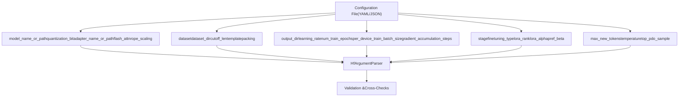
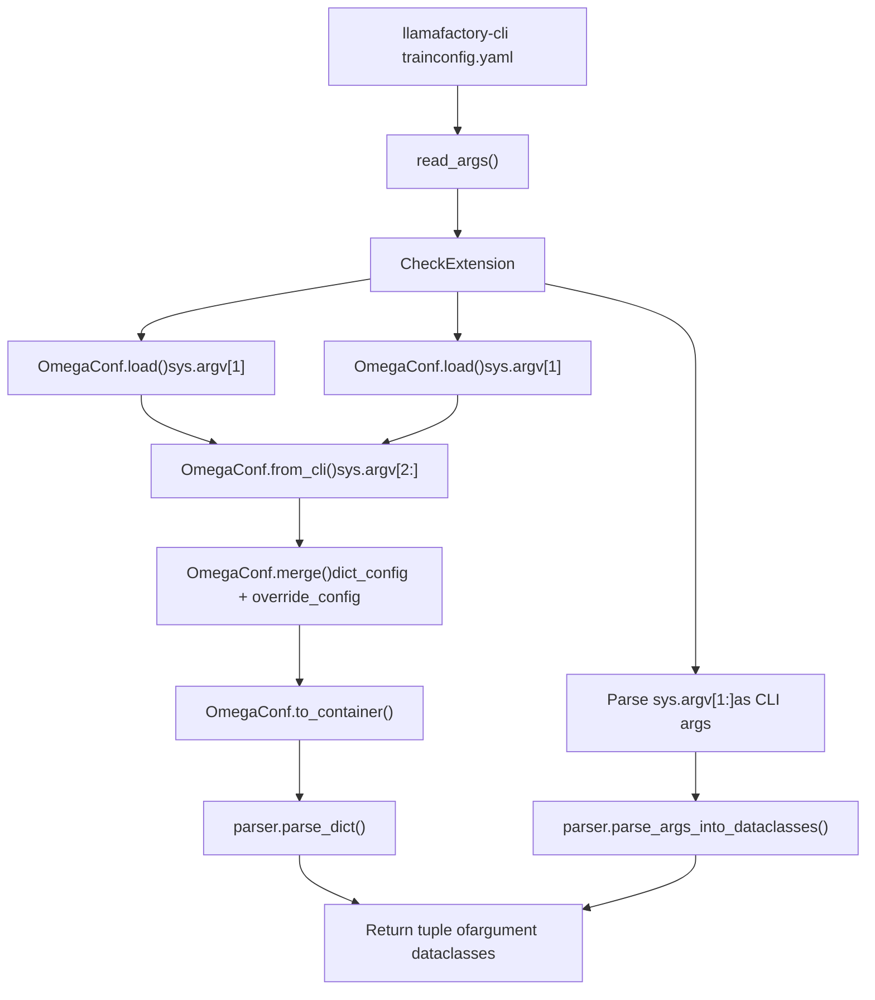
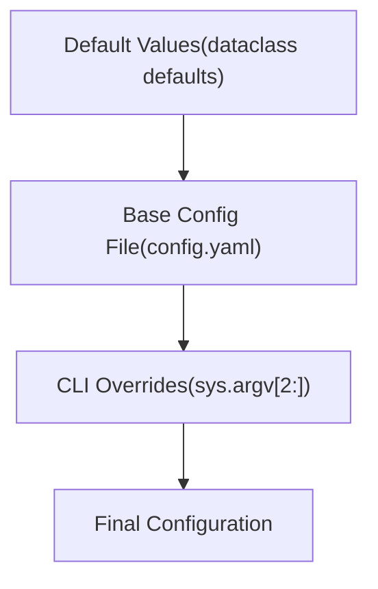
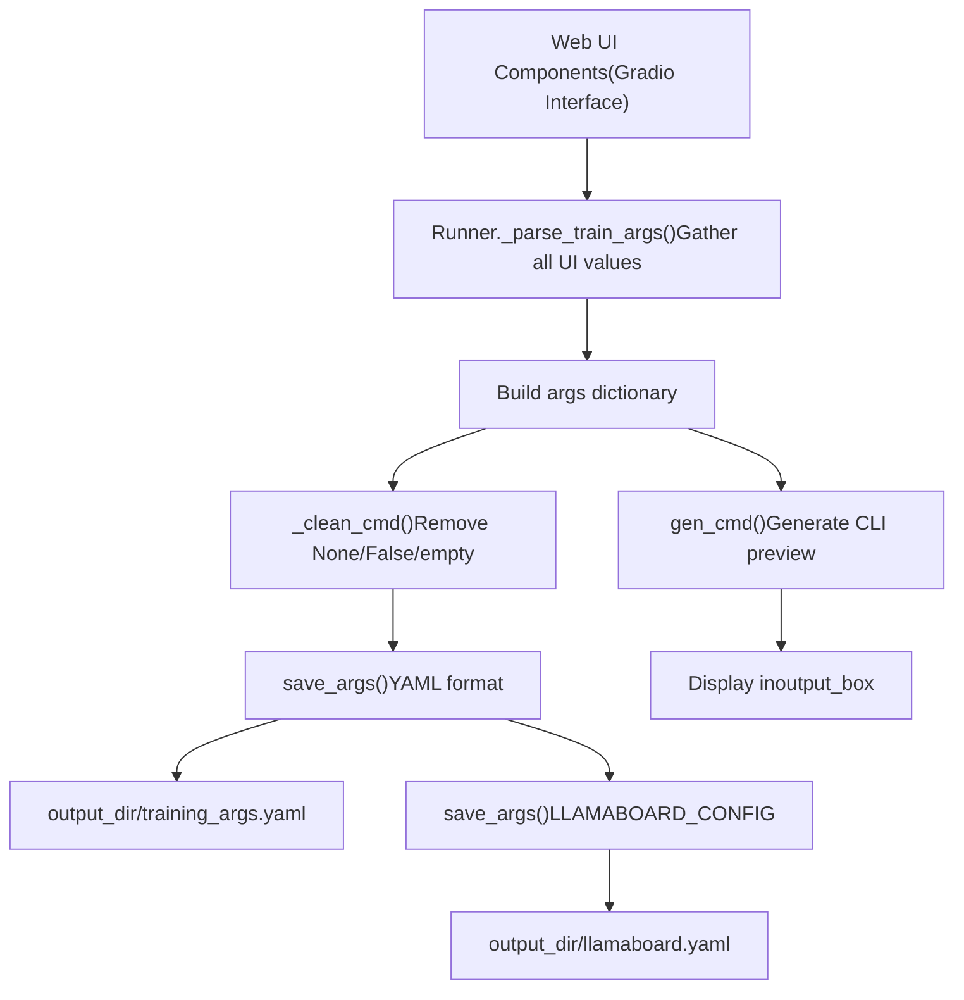
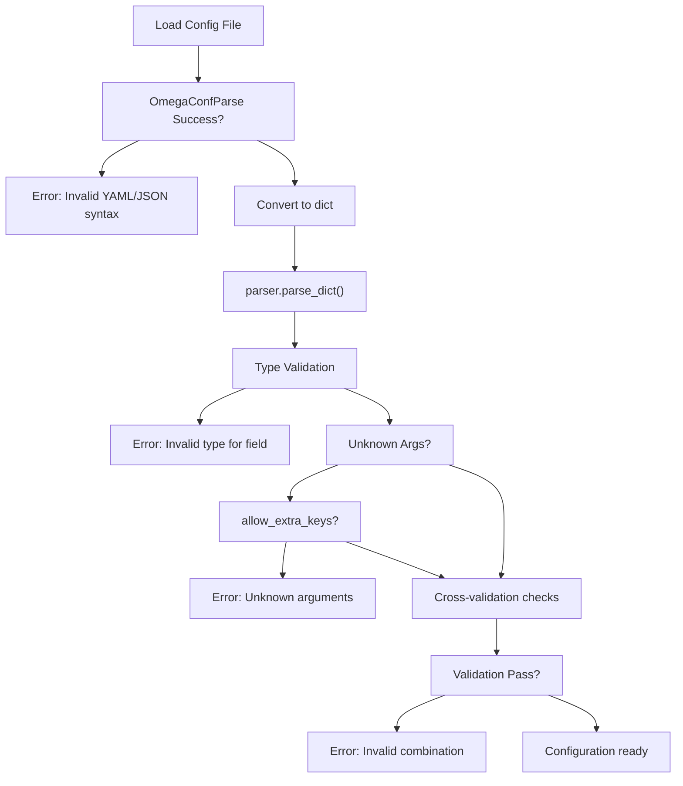

# Configuration Files (YAML/JSON)

Relevant source files

-   [README.md](https://github.com/hiyouga/LlamaFactory/blob/355d5c5e/README.md?plain=1)
-   [README\_zh.md](https://github.com/hiyouga/LlamaFactory/blob/355d5c5e/README_zh.md?plain=1)
-   [src/llamafactory/hparams/parser.py](https://github.com/hiyouga/LlamaFactory/blob/355d5c5e/src/llamafactory/hparams/parser.py)
-   [src/llamafactory/webui/chatter.py](https://github.com/hiyouga/LlamaFactory/blob/355d5c5e/src/llamafactory/webui/chatter.py)
-   [src/llamafactory/webui/common.py](https://github.com/hiyouga/LlamaFactory/blob/355d5c5e/src/llamafactory/webui/common.py)
-   [src/llamafactory/webui/components/export.py](https://github.com/hiyouga/LlamaFactory/blob/355d5c5e/src/llamafactory/webui/components/export.py)
-   [src/llamafactory/webui/components/top.py](https://github.com/hiyouga/LlamaFactory/blob/355d5c5e/src/llamafactory/webui/components/top.py)
-   [src/llamafactory/webui/components/train.py](https://github.com/hiyouga/LlamaFactory/blob/355d5c5e/src/llamafactory/webui/components/train.py)
-   [src/llamafactory/webui/engine.py](https://github.com/hiyouga/LlamaFactory/blob/355d5c5e/src/llamafactory/webui/engine.py)
-   [src/llamafactory/webui/locales.py](https://github.com/hiyouga/LlamaFactory/blob/355d5c5e/src/llamafactory/webui/locales.py)
-   [src/llamafactory/webui/manager.py](https://github.com/hiyouga/LlamaFactory/blob/355d5c5e/src/llamafactory/webui/manager.py)
-   [src/llamafactory/webui/runner.py](https://github.com/hiyouga/LlamaFactory/blob/355d5c5e/src/llamafactory/webui/runner.py)

## Purpose and Scope

Configuration files provide a declarative, version-controlled alternative to passing arguments via command line. LlamaFactory supports both YAML and JSON formats for configuration, allowing users to store training setups in files that can be committed to repositories, shared across teams, and easily modified. This page covers configuration file structure, loading mechanisms, and usage patterns.

For details on the argument types and their validation logic, see [Argument Types and Validation](/hiyouga/LlamaFactory/3.1-argument-types-and-validation). For CLI command usage, see [CLI Commands and Usage](/hiyouga/LlamaFactory/2.2-cli-commands-and-usage).

---

## File Formats and Location

LlamaFactory accepts configuration files in two formats:

| Format | Extensions | Parser |
| --- | --- | --- |
| YAML | `.yaml`, `.yml` | OmegaConf |
| JSON | `.json` | OmegaConf |

Configuration files can be placed anywhere in the filesystem. The most common locations are:

-   Project root directory for shared configurations
-   `examples/` directory for reference configurations
-   `llamaboard_config/` directory when using the Web UI (default: `DEFAULT_CONFIG_DIR`)
-   Training output directories (automatically saved as `training_args.yaml`)

**Sources:** [src/llamafactory/hparams/parser.py68-83](https://github.com/hiyouga/LlamaFactory/blob/355d5c5e/src/llamafactory/hparams/parser.py#L68-L83) [src/llamafactory/webui/common.py39-43](https://github.com/hiyouga/LlamaFactory/blob/355d5c5e/src/llamafactory/webui/common.py#L39-L43)

---

## Configuration Structure

Configuration files map directly to the five argument dataclasses used by LlamaFactory. All keys correspond to field names in these classes:


### Basic YAML Structure

```
# Model configurationmodel_name_or_path: meta-llama/Llama-2-7b-hftemplate: llama2finetuning_type: lora # Data configurationdataset: alpaca_endataset_dir: datacutoff_len: 2048 # Training configurationstage: sftdo_train: trueoutput_dir: saves/llama2-7b/lora/sftlearning_rate: 5.0e-5num_train_epochs: 3.0per_device_train_batch_size: 2gradient_accumulation_steps: 8 # LoRA configurationlora_rank: 8lora_alpha: 16lora_dropout: 0.05lora_target: all # Optimizationfp16: trueddp_timeout: 180000000
```
### Equivalent JSON Structure

```
{  "model_name_or_path": "meta-llama/Llama-2-7b-hf",  "template": "llama2",  "finetuning_type": "lora",  "dataset": "alpaca_en",  "dataset_dir": "data",  "cutoff_len": 2048,  "stage": "sft",  "do_train": true,  "output_dir": "saves/llama2-7b/lora/sft",  "learning_rate": 5.0e-5,  "num_train_epochs": 3.0,  "per_device_train_batch_size": 2,  "gradient_accumulation_steps": 8,  "lora_rank": 8,  "lora_alpha": 16,  "lora_dropout": 0.05,  "lora_target": "all",  "fp16": true,  "ddp_timeout": 180000000}
```
**Sources:** [src/llamafactory/hparams/parser.py49-54](https://github.com/hiyouga/LlamaFactory/blob/355d5c5e/src/llamafactory/hparams/parser.py#L49-L54) [src/llamafactory/webui/runner.py126-290](https://github.com/hiyouga/LlamaFactory/blob/355d5c5e/src/llamafactory/webui/runner.py#L126-L290)

---

## Loading Configuration Files

### Loading Mechanism Flow


### Code Implementation

The `read_args` function handles file loading:

```
# Simplified logic from parser.py:68-82if sys.argv[1].endswith(".yaml") or sys.argv[1].endswith(".yml"):    override_config = OmegaConf.from_cli(sys.argv[2:])    dict_config = OmegaConf.load(Path(sys.argv[1]).absolute())    return OmegaConf.to_container(OmegaConf.merge(dict_config, override_config))elif sys.argv[1].endswith(".json"):    override_config = OmegaConf.from_cli(sys.argv[2:])    dict_config = OmegaConf.load(Path(sys.argv[1]).absolute())    return OmegaConf.to_container(OmegaConf.merge(dict_config, override_config))else:    return sys.argv[1:]
```
The parser then converts the dictionary to typed dataclasses:

```
# From parser.py:85-99if isinstance(args, dict):    return parser.parse_dict(args, allow_extra_keys=allow_extra_keys) (*parsed_args, unknown_args) = parser.parse_args_into_dataclasses(    args=args, return_remaining_strings=True)
```
**Sources:** [src/llamafactory/hparams/parser.py68-99](https://github.com/hiyouga/LlamaFactory/blob/355d5c5e/src/llamafactory/hparams/parser.py#L68-L99)

---

## CLI Argument Overrides

Configuration files support runtime overrides via CLI arguments. OmegaConf merges overrides with the base configuration:

### Override Syntax

```
# Basic overridellamafactory-cli train config.yaml learning_rate=1e-4 # Multiple overridesllamafactory-cli train config.yaml \    learning_rate=1e-4 \    num_train_epochs=5.0 \    output_dir=saves/custom_run # Nested override (using dot notation)llamafactory-cli train config.yaml \    lora_rank=16 \    lora_alpha=32 # Boolean overridesllamafactory-cli train config.yaml \    fp16=true \    do_eval=false # List overridesllamafactory-cli train config.yaml \    dataset=alpaca_en,alpaca_zh
```
### Override Priority


| Priority Level | Source | Example |
| --- | --- | --- |
| 1 (Lowest) | Dataclass defaults | `lora_rank=8` in `FinetuningArguments` |
| 2 | Configuration file | `lora_rank: 16` in `config.yaml` |
| 3 (Highest) | CLI overrides | `lora_rank=32` in command line |

**Sources:** [src/llamafactory/hparams/parser.py73-80](https://github.com/hiyouga/LlamaFactory/blob/355d5c5e/src/llamafactory/hparams/parser.py#L73-L80)

---

## Common Configuration Examples

### Supervised Fine-Tuning (SFT) with LoRA

```
### modelmodel_name_or_path: meta-llama/Llama-2-7b-hftemplate: llama2 ### methodstage: sftdo_train: truefinetuning_type: loralora_target: alllora_rank: 8lora_alpha: 16lora_dropout: 0.05 ### datasetdataset: alpaca_endataset_dir: datacutoff_len: 2048max_samples: 1000overwrite_cache: truepreprocessing_num_workers: 16 ### outputoutput_dir: saves/llama2-7b/lora/sftlogging_steps: 10save_steps: 500plot_loss: true ### trainper_device_train_batch_size: 2gradient_accumulation_steps: 8learning_rate: 5.0e-5num_train_epochs: 3.0lr_scheduler_type: cosinewarmup_steps: 100fp16: true ### evalval_size: 0.1per_device_eval_batch_size: 1eval_strategy: stepseval_steps: 500
```
### DPO Training Configuration

```
### modelmodel_name_or_path: meta-llama/Llama-2-7b-hfadapter_name_or_path: saves/llama2-7b/lora/sfttemplate: llama2finetuning_type: lora ### methodstage: dpopref_beta: 0.1pref_loss: sigmoid ### datasetdataset: dpo_endataset_dir: datacutoff_len: 2048 ### outputoutput_dir: saves/llama2-7b/lora/dpologging_steps: 10save_steps: 500 ### trainper_device_train_batch_size: 2gradient_accumulation_steps: 8learning_rate: 5.0e-6num_train_epochs: 3.0lr_scheduler_type: cosinewarmup_ratio: 0.1bf16: true
```
### Full Parameter Fine-Tuning with DeepSpeed

```
### modelmodel_name_or_path: meta-llama/Llama-2-7b-hftemplate: llama2 ### methodstage: sftdo_train: truefinetuning_type: full ### datasetdataset: alpaca_endataset_dir: datacutoff_len: 2048 ### outputoutput_dir: saves/llama2-7b/full/sft ### trainper_device_train_batch_size: 1gradient_accumulation_steps: 16learning_rate: 2.0e-5num_train_epochs: 3.0bf16: true ### distributeddeepspeed: examples/deepspeed/ds_z3_config.jsonddp_timeout: 180000000
```
### Quantized Training (QLoRA)

```
### modelmodel_name_or_path: meta-llama/Llama-2-7b-hfquantization_bit: 4quantization_method: bnbtemplate: llama2 ### methodstage: sftdo_train: truefinetuning_type: loralora_rank: 64lora_alpha: 128lora_target: all ### datasetdataset: alpaca_endataset_dir: datacutoff_len: 2048 ### outputoutput_dir: saves/llama2-7b/qlora/sft ### trainper_device_train_batch_size: 4gradient_accumulation_steps: 4learning_rate: 1.0e-4num_train_epochs: 3.0bf16: true
```
**Sources:** [src/llamafactory/webui/runner.py126-290](https://github.com/hiyouga/LlamaFactory/blob/355d5c5e/src/llamafactory/webui/runner.py#L126-L290) [examples directory mentioned in README.md](https://github.com/hiyouga/LlamaFactory/blob/355d5c5e/examples directory mentioned in README.md?plain=1)

---

## Web UI Configuration Generation

The Web UI (LLaMA Board) automatically generates and saves configuration files:


### Saved Configuration Files

When training via Web UI, two configuration files are automatically saved:

| File | Format | Purpose | Location |
| --- | --- | --- | --- |
| `training_args.yaml` | YAML | Clean training arguments for CLI replay | `{output_dir}/training_args.yaml` |
| `llamaboard.yaml` | YAML | Full UI state including display settings | `{output_dir}/llamaboard.yaml` |

### Configuration Cleaning Logic

The `_clean_cmd` function removes unnecessary keys before saving:

```
# From common.py:169-179no_skip_keys = [    "packing",    "enable_thinking",    "use_reentrant_gc",    "double_quantization",    "freeze_vision_tower",    "freeze_multi_modal_projector",]return {    k: v for k, v in args.items()    if (k in no_skip_keys) or (v is not None and v is not False and v != "")}
```
Keys with `None`, `False`, or empty string values are removed, except for boolean flags that should be explicitly preserved (like `packing`).

### Loading Web UI Configurations

Web UI configurations can be loaded back into the interface:

```
# From runner.py:381-390def _build_config_dict(self, data: dict["Component", Any]) -> dict[str, Any]:    config_dict = {}    skip_ids = ["top.lang", "top.model_path", "train.output_dir", "train.config_path"]    for elem, value in data.items():        elem_id = self.manager.get_id_by_elem(elem)        if elem_id not in skip_ids:            config_dict[elem_id] = value    return config_dict
```
**Sources:** [src/llamafactory/webui/runner.py381-390](https://github.com/hiyouga/LlamaFactory/blob/355d5c5e/src/llamafactory/webui/runner.py#L381-L390) [src/llamafactory/webui/common.py163-209](https://github.com/hiyouga/LlamaFactory/blob/355d5c5e/src/llamafactory/webui/common.py#L163-L209)

---

## Validation and Error Handling

### Configuration File Validation Flow


### Common Validation Errors

| Error Type | Cause | Example | Solution |
| --- | --- | --- | --- |
| Unknown arguments | Extra keys not in dataclasses | `unknown_param: value` | Remove or use `ALLOW_EXTRA_ARGS=1` |
| Type mismatch | Wrong value type | `learning_rate: "high"` | Use correct type: `learning_rate: 5.0e-5` |
| Missing required | Required field not provided | Missing `output_dir` | Add required field |
| Invalid combination | Conflicting settings | `quantization_bit: 4` with `finetuning_type: full` | Use compatible settings |
| JSON decode error (Web UI) | Malformed `extra_args` | `{"optim": invalid}` | Fix JSON syntax |

### Validation Code Points

```
# From parser.py:92-97(*parsed_args, unknown_args) = parser.parse_args_into_dataclasses(    args=args, return_remaining_strings=True) if unknown_args and not allow_extra_keys:    raise ValueError(f"Some specified arguments are not used: {unknown_args}")
```
Cross-validation checks are performed in `get_train_args`:

```
# From parser.py:256-376 (examples)if finetuning_args.stage != "sft":    if training_args.predict_with_generate:        raise ValueError("`predict_with_generate` cannot be set except SFT.") if model_args.quantization_bit is not None:    if finetuning_args.finetuning_type not in ["lora", "oft"]:        raise ValueError("Quantization is only compatible with LoRA or OFT.")
```
### Environment Variable Override

Allow unknown arguments using environment variable:

```
ALLOW_EXTRA_ARGS=1 llamafactory-cli train config.yaml
```
**Sources:** [src/llamafactory/hparams/parser.py92-97](https://github.com/hiyouga/LlamaFactory/blob/355d5c5e/src/llamafactory/hparams/parser.py#L92-L97) [src/llamafactory/hparams/parser.py256-376](https://github.com/hiyouga/LlamaFactory/blob/355d5c5e/src/llamafactory/hparams/parser.py#L256-L376) [src/llamafactory/webui/runner.py99-102](https://github.com/hiyouga/LlamaFactory/blob/355d5c5e/src/llamafactory/webui/runner.py#L99-L102)

---

## Best Practices

### Organization and Naming

```
configs/
├── base/
│   ├── llama2_base.yaml          # Base model config
│   └── qwen_base.yaml
├── methods/
│   ├── lora_sft.yaml             # Method-specific settings
│   ├── full_sft.yaml
│   └── dpo.yaml
├── experiments/
│   ├── exp001_llama2_alpaca.yaml # Complete experiment configs
│   └── exp002_qwen_dpo.yaml
└── production/
    └── prod_model_v1.yaml        # Production configurations
```
### Configuration Composition

Use multiple configuration files for better modularity:

```
# base_model.yamlmodel_name_or_path: meta-llama/Llama-2-7b-hftemplate: llama2cutoff_len: 2048
```
```
# lora_config.yaml  finetuning_type: loralora_rank: 8lora_alpha: 16lora_target: all
```
```
# Load base and override with method-specific configllamafactory-cli train base_model.yaml \    $(cat lora_config.yaml | grep -v "^#" | tr '\n' ' ')
```
### Documentation in Configuration Files

```
### Model Configuration# Base model: Llama-2-7b from Meta# Template: Standard Llama-2 chat formatmodel_name_or_path: meta-llama/Llama-2-7b-hftemplate: llama2 ### Training Strategy# Stage: Supervised fine-tuning# Method: LoRA for efficient training# Reason: Limited GPU memory (24GB)stage: sftfinetuning_type: lora ### Hyperparameters  # Learning rate: Conservative 5e-5 for stability# Batch size: Effective batch size = 2 * 8 = 16learning_rate: 5.0e-5per_device_train_batch_size: 2gradient_accumulation_steps: 8
```
### Version Control Integration

```
# config.yaml# Version: 1.2.0# Author: team@example.com# Last updated: 2025-01-15# Purpose: Production SFT configuration for customer support model model_name_or_path: meta-llama/Llama-2-7b-hf# ... rest of config
```
### Configuration Validation Script

```
# validate_config.pyfrom llamafactory.hparams import get_train_args try:    model_args, data_args, training_args, finetuning_args, generating_args = \        get_train_args(["config.yaml"])    print("✓ Configuration is valid")except Exception as e:    print(f"✗ Configuration error: {e}")
```
### Reference Table: Required vs Optional Fields

| Category | Required Fields | Common Optional Fields |
| --- | --- | --- |
| Model | `model_name_or_path`, `template` | `quantization_bit`, `rope_scaling`, `flash_attn` |
| Data | `dataset`, `dataset_dir` | `cutoff_len`, `max_samples`, `val_size` |
| Training | `stage`, `output_dir` | `learning_rate`, `num_train_epochs`, `warmup_steps` |
| Method | `finetuning_type` | `lora_rank`, `lora_alpha`, `pref_beta` |
| Generation | \- | `max_new_tokens`, `temperature`, `top_p` |

### Performance Considerations

**Configuration Parameter Impact:**

```
# Memory-optimized configurationper_device_train_batch_size: 1          # Reduce memorygradient_accumulation_steps: 32         # Maintain effective batch sizegradient_checkpointing: true            # Enable if memory-criticalfp16: true                              # Use mixed precision # Speed-optimized configurationper_device_train_batch_size: 8          # Larger batchesgradient_accumulation_steps: 2flash_attn: fa2                         # Enable FlashAttention-2dataloader_num_workers: 4               # Parallel data loadingpreprocessing_num_workers: 16           # Parallel preprocessing
```
**Sources:** [src/llamafactory/webui/runner.py126-290](https://github.com/hiyouga/LlamaFactory/blob/355d5c5e/src/llamafactory/webui/runner.py#L126-L290) [src/llamafactory/hparams/parser.py68-471](https://github.com/hiyouga/LlamaFactory/blob/355d5c5e/src/llamafactory/hparams/parser.py#L68-L471)

---

## Summary

Configuration files in LlamaFactory provide a robust, version-controlled approach to managing training experiments. Key takeaways:

-   **Formats:** YAML (preferred) and JSON both supported via OmegaConf
-   **Structure:** Maps directly to five argument dataclasses with flat key-value pairs
-   **Loading:** Supports file-based configuration with CLI overrides using merge priority
-   **Web UI:** Automatically generates and saves configurations for reproducibility
-   **Validation:** Multi-stage validation including syntax, types, and cross-checks
-   **Best Practices:** Organize by purpose, document extensively, validate before training

The configuration system bridges declarative setup with the underlying argument parser, enabling reproducible experimentation and easy sharing of training recipes.
