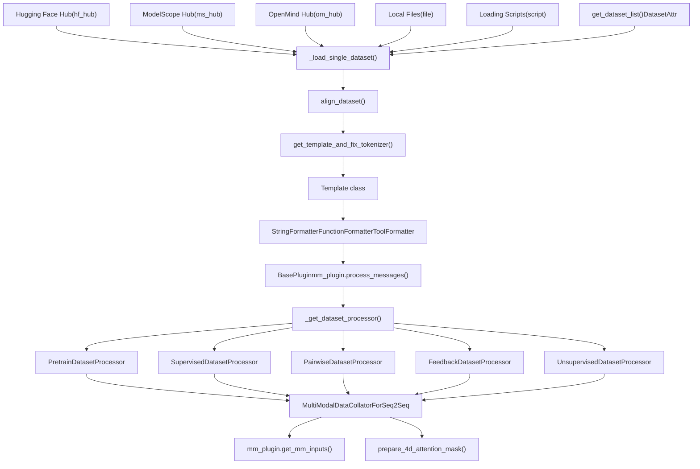
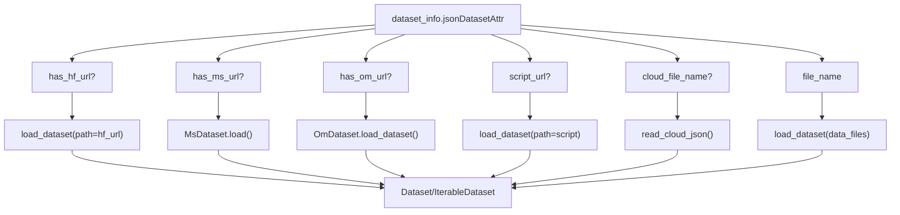
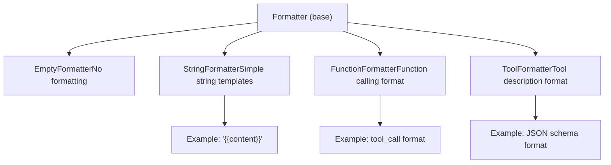
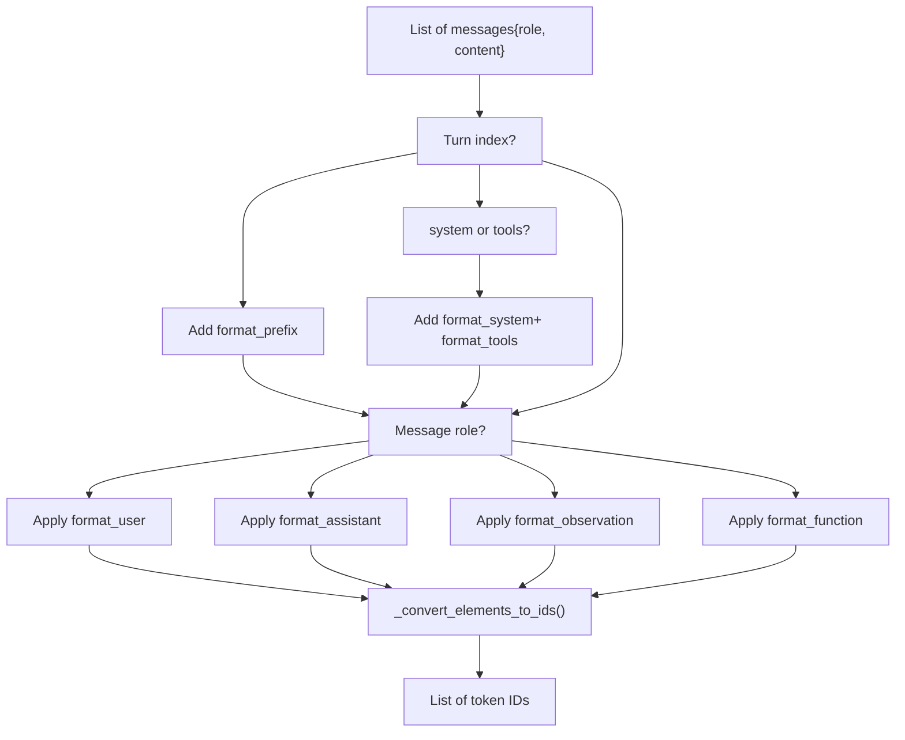
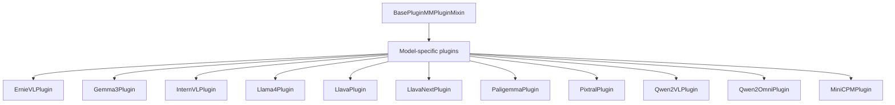
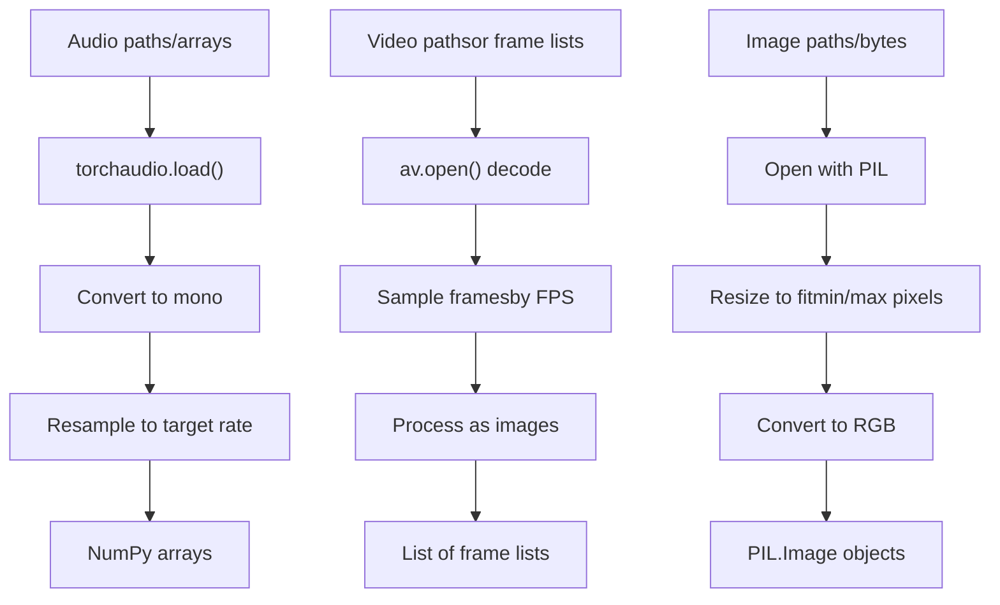
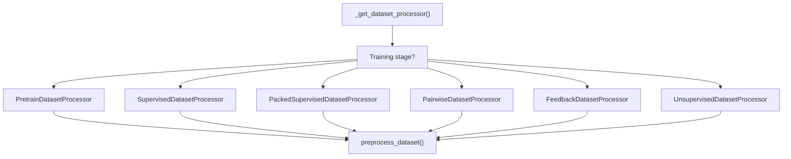
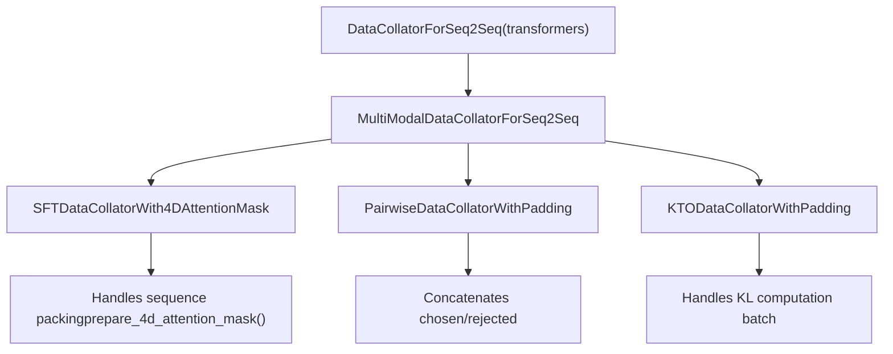
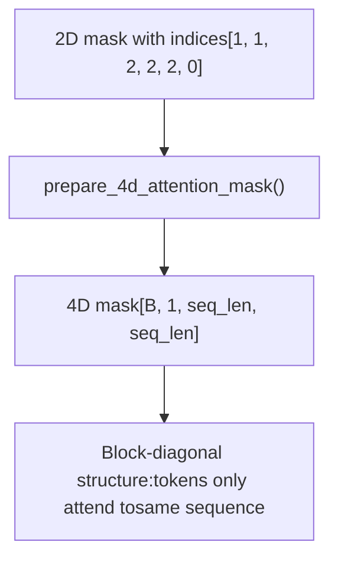

# Data Pipeline

Relevant source files

-   [data/README.md](https://github.com/hiyouga/LlamaFactory/blob/355d5c5e/data/README.md?plain=1)
-   [data/README\_zh.md](https://github.com/hiyouga/LlamaFactory/blob/355d5c5e/data/README_zh.md?plain=1)
-   [src/llamafactory/data/collator.py](https://github.com/hiyouga/LlamaFactory/blob/355d5c5e/src/llamafactory/data/collator.py)
-   [src/llamafactory/data/loader.py](https://github.com/hiyouga/LlamaFactory/blob/355d5c5e/src/llamafactory/data/loader.py)
-   [src/llamafactory/data/mm\_plugin.py](https://github.com/hiyouga/LlamaFactory/blob/355d5c5e/src/llamafactory/data/mm_plugin.py)
-   [src/llamafactory/data/parser.py](https://github.com/hiyouga/LlamaFactory/blob/355d5c5e/src/llamafactory/data/parser.py)
-   [src/llamafactory/data/template.py](https://github.com/hiyouga/LlamaFactory/blob/355d5c5e/src/llamafactory/data/template.py)
-   [src/llamafactory/extras/constants.py](https://github.com/hiyouga/LlamaFactory/blob/355d5c5e/src/llamafactory/extras/constants.py)
-   [src/llamafactory/hparams/data\_args.py](https://github.com/hiyouga/LlamaFactory/blob/355d5c5e/src/llamafactory/hparams/data_args.py)
-   [src/llamafactory/model/model\_utils/misc.py](https://github.com/hiyouga/LlamaFactory/blob/355d5c5e/src/llamafactory/model/model_utils/misc.py)
-   [src/llamafactory/model/model\_utils/visual.py](https://github.com/hiyouga/LlamaFactory/blob/355d5c5e/src/llamafactory/model/model_utils/visual.py)
-   [src/llamafactory/webui/components/\_\_init\_\_.py](https://github.com/hiyouga/LlamaFactory/blob/355d5c5e/src/llamafactory/webui/components/__init__.py)
-   [src/llamafactory/webui/components/footer.py](https://github.com/hiyouga/LlamaFactory/blob/355d5c5e/src/llamafactory/webui/components/footer.py)
-   [tests/data/test\_mm\_plugin.py](https://github.com/hiyouga/LlamaFactory/blob/355d5c5e/tests/data/test_mm_plugin.py)
-   [tests/version.txt](https://github.com/hiyouga/LlamaFactory/blob/355d5c5e/tests/version.txt)

## Purpose and Scope

The Data Pipeline is responsible for loading, processing, and preparing training data for all stages of model training (pre-training, supervised fine-tuning, reward modeling, preference learning). It handles data from multiple sources, applies model-specific chat templates, processes multimodal inputs (images, videos, audio), tokenizes text, generates training labels, and batches sequences for efficient training.

For model loading and configuration, see [Model Loading and Configuration](/hiyouga/LlamaFactory/5-model-loading-and-configuration). For training system details, see [Training System](/hiyouga/LlamaFactory/6-training-system). For dataset format specifications, see [Dataset Format Reference](/hiyouga/LlamaFactory/10.2-dataset-format-reference).

## Overview

The data pipeline flows through six major stages:

| Stage | Primary Components | Output |
| --- | --- | --- |
| **Dataset Loading** | `get_dataset_list()`, `_load_single_dataset()` | Raw datasets from various sources |
| **Format Alignment** | `align_dataset()` in converter | Standardized format (Alpaca/ShareGPT) |
| **Template Application** | `Template` classes, `Formatter` classes | Formatted conversation strings |
| **Multimodal Processing** | `BasePlugin` and subclasses | Regularized media + placeholder expansion |
| **Tokenization** | Dataset processors (`SupervisedDatasetProcessor`, etc.) | Token IDs + labels |
| **Batching** | `MultiModalDataCollatorForSeq2Seq` | Training batches with attention masks |

**Sources:** [src/llamafactory/data/loader.py276-337](https://github.com/hiyouga/LlamaFactory/blob/355d5c5e/src/llamafactory/data/loader.py#L276-L337) \[Diagram 3 from context\]

## Pipeline Architecture


**Sources:** [src/llamafactory/data/loader.py51-162](https://github.com/hiyouga/LlamaFactory/blob/355d5c5e/src/llamafactory/data/loader.py#L51-L162) [src/llamafactory/data/loader.py276-337](https://github.com/hiyouga/LlamaFactory/blob/355d5c5e/src/llamafactory/data/loader.py#L276-L337)

## Dataset Loading and Sources

### Source Routing

The pipeline supports five data source types, configured via `dataset_info.json`:


**Sources:** [src/llamafactory/data/parser.py93-149](https://github.com/hiyouga/LlamaFactory/blob/355d5c5e/src/llamafactory/data/parser.py#L93-L149) [src/llamafactory/data/loader.py51-162](https://github.com/hiyouga/LlamaFactory/blob/355d5c5e/src/llamafactory/data/loader.py#L51-L162)

### DatasetAttr Configuration

The `DatasetAttr` class stores all dataset metadata:

| Field | Type | Purpose |
| --- | --- | --- |
| `load_from` | Literal | Source type: `hf_hub`, `ms_hub`, `om_hub`, `script`, `file` |
| `dataset_name` | str | Repository ID or file path |
| `formatting` | Literal | Data format: `alpaca`, `sharegpt`, `openai` (default: `alpaca`) |
| `ranking` | bool | Whether dataset is for preference learning (default: `False`) |
| `subset` | str | None | Dataset subset name |
| `split` | str | Dataset split to use (default: `train`) |
| `folder` | str | None | Folder within repository |
| `num_samples` | int | None | Number of samples to use |

**Column mappings** (Alpaca format):

-   `prompt`: Instruction column (default: `instruction`)
-   `query`: Input column (default: `input`)
-   `response`: Output column (default: `output`)
-   `history`: Conversation history column
-   `system`: System prompt column
-   `tools`: Tool descriptions column
-   `images`, `videos`, `audios`: Multimodal input columns
-   `chosen`, `rejected`: Preference learning columns
-   `kto_tag`: KTO feedback column

**Column mappings** (ShareGPT format):

-   `messages`: Conversation list column (default: `conversations`)
-   Role tags: `role_tag`, `content_tag`, `user_tag`, `assistant_tag`, `observation_tag`, `function_tag`, `system_tag`

**Sources:** [src/llamafactory/data/parser.py26-91](https://github.com/hiyouga/LlamaFactory/blob/355d5c5e/src/llamafactory/data/parser.py#L26-L91) [data/README.md7-44](https://github.com/hiyouga/LlamaFactory/blob/355d5c5e/data/README.md?plain=1#L7-L44)

### Loading Process

The `_load_single_dataset()` function implements the loading workflow:

1.  **Parse configuration**: Extract `data_path`, `data_name`, `data_dir`, `data_files` from `DatasetAttr`
2.  **Load dataset**: Call appropriate loading function based on `load_from`
3.  **Sample dataset**: If `num_samples` specified, randomly sample (with replacement if needed)
4.  **Truncate dataset**: If `max_samples` specified, select first N samples
5.  **Align format**: Call `align_dataset()` to convert to standardized format

**Key features**:

-   Supports streaming mode via `data_args.streaming`
-   Handles multiple file types: json, jsonl, csv, parquet, arrow (see `FILEEXT2TYPE`)
-   Automatic conversion from ModelScope/OpenMind formats to HuggingFace `Dataset`

**Sources:** [src/llamafactory/data/loader.py51-162](https://github.com/hiyouga/LlamaFactory/blob/355d5c5e/src/llamafactory/data/loader.py#L51-L162) [src/llamafactory/extras/constants.py41-48](https://github.com/hiyouga/LlamaFactory/blob/355d5c5e/src/llamafactory/extras/constants.py#L41-L48)

### Dataset Merging

Multiple datasets are merged via `merge_dataset()` with three strategies:

| Strategy | Behavior | Use Case |
| --- | --- | --- |
| `concat` | Concatenate all datasets sequentially | Simple combination |
| `interleave_under` | Interleave with undersampling (sample from smallest) | Balanced training on imbalanced datasets |
| `interleave_over` | Interleave with oversampling (sample from largest) | Preserve all data |

Controlled by `data_args.mix_strategy` and `data_args.interleave_probs` (for weighted sampling).

**Sources:** [src/llamafactory/data/loader.py164-187](https://github.com/hiyouga/LlamaFactory/blob/355d5c5e/src/llamafactory/data/loader.py#L164-L187) [src/llamafactory/hparams/data\_args.py66-73](https://github.com/hiyouga/LlamaFactory/blob/355d5c5e/src/llamafactory/hparams/data_args.py#L66-L73)

## Template System

The template system formats raw conversations into model-specific prompt formats. See [Dataset Formats and Templates](/hiyouga/LlamaFactory/4.2-dataset-formats-and-templates) for detailed format specifications.

### Template Components

A `Template` object contains:

| Component | Type | Purpose |
| --- | --- | --- |
| `format_user` | Formatter | Formats user messages |
| `format_assistant` | Formatter | Formats assistant responses |
| `format_system` | Formatter | Formats system prompts |
| `format_function` | Formatter | Formats function calls |
| `format_observation` | Formatter | Formats function results |
| `format_tools` | Formatter | Formats tool descriptions |
| `format_prefix` | Formatter | Formats conversation prefix |
| `default_system` | str | Default system message |
| `stop_words` | list\[str\] | Additional stop tokens |
| `thought_words` | tuple\[str, str\] | CoT delimiters (e.g., \`\`) |
| `tool_call_words` | tuple\[str, str\] | Tool call delimiters |
| `efficient_eos` | bool | Whether to omit EOS token in formatter |
| `replace_eos` | bool | Replace tokenizer EOS with stop word |
| `mm_plugin` | BasePlugin | Multimodal processing plugin |

**Sources:** [src/llamafactory/data/template.py40-58](https://github.com/hiyouga/LlamaFactory/blob/355d5c5e/src/llamafactory/data/template.py#L40-L58)

### Formatter Types


Each formatter has a `slots` attribute containing template elements:

-   **Strings**: Literal text with `{{content}}` placeholder
-   **Dicts**: Special tokens like `{"token": "<reserved_102>"}`
-   **Sets**: Token references like `{"bos_token"}`, `{"eos_token"}`

**Sources:** [src/llamafactory/data/formatter.py](https://github.com/hiyouga/LlamaFactory/blob/355d5c5e/src/llamafactory/data/formatter.py) [src/llamafactory/data/template.py505-536](https://github.com/hiyouga/LlamaFactory/blob/355d5c5e/src/llamafactory/data/template.py#L505-L536)

### Template Application

The `Template._encode()` method converts messages to token IDs:


**Key methods**:

-   `encode_oneturn()`: Returns `(prompt_ids, response_ids)` for single-turn encoding
-   `encode_multiturn()`: Returns list of `(prompt_ids, response_ids)` tuples for multi-turn conversations
-   `extract_tool()`: Extracts function calls from assistant messages
-   `get_stop_token_ids()`: Returns all stop token IDs including custom stop words

**Sources:** [src/llamafactory/data/template.py59-169](https://github.com/hiyouga/LlamaFactory/blob/355d5c5e/src/llamafactory/data/template.py#L59-L169)

### Reasoning Templates

The `ReasoningTemplate` subclass handles models with chain-of-thought capabilities:

**Behavior**:

-   Automatically adds empty CoT tags (\`\`) if not present in data
-   When `enable_thinking=True`: CoT added to response (loss computed on CoT)
-   When `enable_thinking=False`: CoT added to prompt (loss not computed on CoT)
-   When `enable_thinking=None`: Adaptive mode based on data content

**Methods**:

-   `add_thought()`: Wraps content with thought delimiters
-   `remove_thought()`: Strips CoT tags from content
-   `get_thought_word_ids()`: Returns tokenized empty CoT sequence

**Sources:** [src/llamafactory/data/template.py404-460](https://github.com/hiyouga/LlamaFactory/blob/355d5c5e/src/llamafactory/data/template.py#L404-L460)

### Template Registration

Templates are registered via `register_template()`:

```
register_template(    name="alpaca",    format_user=StringFormatter(slots=["### Instruction:\n{{content}}\n\n### Response:\n"]),    format_assistant=StringFormatter(slots=["{{content}}", {"eos_token"}, "\n\n"]),    default_system="Below is an instruction...",    replace_jinja_template=True,)
```
The registry `TEMPLATES` contains 100+ pre-defined templates (alpaca, llama2, chatglm, qwen, etc.).

**Sources:** [src/llamafactory/data/template.py465-536](https://github.com/hiyouga/LlamaFactory/blob/355d5c5e/src/llamafactory/data/template.py#L465-L536) [src/llamafactory/data/template.py641-1978](https://github.com/hiyouga/LlamaFactory/blob/355d5c5e/src/llamafactory/data/template.py#L641-L1978)

## Multimodal Processing

The multimodal plugin system handles images, videos, and audio inputs. See [Multimodal Data Processing](/hiyouga/LlamaFactory/4.3-multimodal-data-processing) for details.

### Plugin Architecture


**Sources:** [src/llamafactory/data/mm\_plugin.py412-466](https://github.com/hiyouga/LlamaFactory/blob/355d5c5e/src/llamafactory/data/mm_plugin.py#L412-L466)

### Plugin Interface

Each plugin implements three key methods:

| Method | Purpose | Input | Output |
| --- | --- | --- | --- |
| `process_messages()` | Pre-tokenization message processing | messages, images, videos, audios, processor | Modified messages with placeholders expanded |
| `process_token_ids()` | Post-tokenization ID processing | input\_ids, labels, images, videos, audios, tokenizer, processor | Modified (input\_ids, labels) |
| `get_mm_inputs()` | Batch multimodal input preparation | images, videos, audios, lens, batch\_ids, processor | Dict of tensors (pixel\_values, etc.) |

**Sources:** [src/llamafactory/data/mm\_plugin.py413-466](https://github.com/hiyouga/LlamaFactory/blob/355d5c5e/src/llamafactory/data/mm_plugin.py#L413-L466)

### Media Regularization

The `MMPluginMixin` provides media preprocessing:


**Key parameters**:

-   Images: `image_max_pixels` (default: 768×768), `image_min_pixels` (default: 32×32)
-   Videos: `video_max_pixels` (default: 256×256), `video_min_pixels` (default: 16×16), `video_fps` (default: 2.0), `video_maxlen` (default: 128 frames)
-   Audio: `audio_sampling_rate` (default: 16000 Hz)

**Sources:** [src/llamafactory/data/mm\_plugin.py221-324](https://github.com/hiyouga/LlamaFactory/blob/355d5c5e/src/llamafactory/data/mm_plugin.py#L221-L324)

### Multimodal Input Generation

The `_get_mm_inputs()` method processes regularized media into model inputs:

**Image processing**:

```
image_processor(images, return_tensors="pt")# Returns: {"pixel_values": Tensor[B, C, H, W]}# For Qwen2-VL: {"pixel_values": Tensor[num_patches, patch_dim], #                "image_grid_thw": Tensor[num_images, 3]}
```
**Video processing**:

```
video_processor(videos=videos, return_tensors="pt")# Returns: {"pixel_values": Tensor[...], "video_grid_thw": Tensor[...]}
```
**Audio processing**:

```
feature_extractor(audios, sampling_rate=16000, return_tensors="pt")# Returns: {"input_features": Tensor[...], "feature_attention_mask": Tensor[...]}
```
**Sources:** [src/llamafactory/data/mm\_plugin.py325-409](https://github.com/hiyouga/LlamaFactory/blob/355d5c5e/src/llamafactory/data/mm_plugin.py#L325-L409)

### Placeholder Expansion

Different models use different placeholder strategies:

| Model | Strategy | Example |
| --- | --- | --- |
| LLaVA | Repeat token N times | `<image>` → `<image>` × 576 |
| PaliGemma | Remove placeholder, prepend tokens | `<image>` → (removed), tokens prepended |
| Qwen2-VL | Dynamic expansion based on grid | `<image>` → \`< |
| InternVL | Context tokens in special tags | `<image>` → `<IMG_CONTEXT>×256</img>` |
| Pixtral | Grid layout with breaks | `<image>` → `[IMG][IMG_BREAK][IMG][IMG_END]` |

**Sources:** [tests/data/test\_mm\_plugin.py135-337](https://github.com/hiyouga/LlamaFactory/blob/355d5c5e/tests/data/test_mm_plugin.py#L135-L337)

## Tokenization and Label Generation

### Dataset Processors

The pipeline selects a processor based on training stage:


**Sources:** [src/llamafactory/data/loader.py189-227](https://github.com/hiyouga/LlamaFactory/blob/355d5c5e/src/llamafactory/data/loader.py#L189-L227)

### Supervised Fine-Tuning Processor

The `SupervisedDatasetProcessor` implements the core tokenization logic:

**Process flow**:

1.  **Extract messages**: Parse dataset into conversation messages
2.  **Process messages**: Apply `mm_plugin.process_messages()` for multimodal placeholder handling
3.  **Apply template**: Use `template.encode_oneturn()` or `template.encode_multiturn()`
4.  **Process token IDs**: Apply `mm_plugin.process_token_ids()` for post-tokenization adjustments
5.  **Generate labels**: Mask prompt tokens (set to `IGNORE_INDEX=-100`), keep response tokens
6.  **Handle history masking**: If `mask_history=True`, only compute loss on final turn

**Label masking strategy**:

```
Turn 0: [PROMPT_IDS][RESPONSE_IDS]
Labels: [-100...    ][RESPONSE_IDS]  (prompt masked)

Turn 1: [PROMPT_IDS][RESPONSE_IDS]
Labels: [-100...    ][RESPONSE_IDS]  (prompt masked)
```
If `train_on_prompt=True`, prompt labels are not masked.

**Sources:** [src/llamafactory/data/processor.py](https://github.com/hiyouga/LlamaFactory/blob/355d5c5e/src/llamafactory/data/processor.py)

### Sequence Packing

When `packing=True`, the `PackedSupervisedDatasetProcessor` packs multiple sequences into fixed-length blocks:

**Packing algorithm**:

1.  Collect sequences until cumulative length ≥ `cutoff_len`
2.  Concatenate with unique attention mask indices: `[1, 1, 2, 2, 2, 0, 0]`
    -   Same index = same sequence
    -   Index 0 = padding
3.  Sequences attend only to themselves (via block-diagonal attention mask)

**Benefits**:

-   Reduces padding overhead
-   Increases training throughput (up to 2-3× for short sequences)

**Limitations**:

-   Requires `neat_packing=True` for cross-attention models
-   Not compatible with `train_on_prompt=True`

**Sources:** [src/llamafactory/data/processor.py](https://github.com/hiyouga/LlamaFactory/blob/355d5c5e/src/llamafactory/data/processor.py) [src/llamafactory/hparams/data\_args.py106-113](https://github.com/hiyouga/LlamaFactory/blob/355d5c5e/src/llamafactory/hparams/data_args.py#L106-L113)

### Preference Dataset Processing

**Pairwise format** (for DPO, ORPO, SimPO):

```
{    "chosen_input_ids": [...],    "chosen_labels": [...],    "rejected_input_ids": [...],    "rejected_labels": [...]}
```
**KTO format**:

```
{    "input_ids": [...],        # Completion    "labels": [...],    "kl_input_ids": [...],     # Prompt only (for KL term)    "kl_labels": [...],    "kto_tags": bool           # True=chosen, False=rejected}
```
**Sources:** [src/llamafactory/data/processor.py](https://github.com/hiyouga/LlamaFactory/blob/355d5c5e/src/llamafactory/data/processor.py)

## Data Collation and Batching

### Collator Architecture


**Sources:** [src/llamafactory/data/collator.py84-332](https://github.com/hiyouga/LlamaFactory/blob/355d5c5e/src/llamafactory/data/collator.py#L84-L332)

### Multimodal Batch Preparation

The `MultiModalDataCollatorForSeq2Seq.__call__()` method:

**Steps**:

1.  **Extract multimodal inputs**: Collect `images`, `videos`, `audios` from features
2.  **Handle empty batches**: For zero3/FSDP, inject fake multimodal data to avoid hangs
3.  **Get multimodal inputs**: Call `mm_plugin.get_mm_inputs()` to process all media
4.  **Handle token type IDs**: For PaliGemma/Gemma3, extract and assign `token_type_ids`
5.  **Call parent collator**: Run base `DataCollatorForSeq2Seq` for padding
6.  **Compute RoPE indices**: For Qwen2-VL models, compute 3D position IDs for M-RoPE
7.  **Merge multimodal inputs**: Add `pixel_values`, `image_grid_thw`, etc. to batch

**Sources:** [src/llamafactory/data/collator.py108-242](https://github.com/hiyouga/LlamaFactory/blob/355d5c5e/src/llamafactory/data/collator.py#L108-L242)

### 4D Attention Masks for Packing

When `block_diag_attn=True` and `attn_implementation!="flash_attention_2"`, the collator generates 4D attention masks:


**Mask construction**:

```
Input:  [1, 1, 2, 2, 2, 0]

Output (simplified):
        [o, x, x, x, x, x]  # Token 0 attends to [0-1]
        [o, o, x, x, x, x]  # Token 1 attends to [0-1]
        [x, x, o, x, x, x]  # Token 2 attends to [2-4]
        [x, x, o, o, x, x]  # Token 3 attends to [2-4]
        [x, x, o, o, o, x]  # Token 4 attends to [2-4]
        [x, x, x, x, x, x]  # Token 5 (padding)

Where: o = 0.0 (attend), x = min_dtype (mask)
```
**Sources:** [src/llamafactory/data/collator.py41-82](https://github.com/hiyouga/LlamaFactory/blob/355d5c5e/src/llamafactory/data/collator.py#L41-L82) [src/llamafactory/data/collator.py244-262](https://github.com/hiyouga/LlamaFactory/blob/355d5c5e/src/llamafactory/data/collator.py#L244-L262)

### Batch Output Format

Final training batch structure:

| Key | Shape | Description |
| --- | --- | --- |
| `input_ids` | `[batch_size, seq_len]` | Token IDs |
| `attention_mask` | `[batch_size, seq_len]` or `[batch_size, 1, seq_len, seq_len]` | Attention mask (2D or 4D) |
| `labels` | `[batch_size, seq_len]` | Target token IDs (with `-100` masking) |
| `pixel_values` | Varies by model | Image/video pixel values |
| `image_grid_thw` | `[num_images, 3]` | Qwen2-VL image grid dimensions |
| `video_grid_thw` | `[num_videos, 3]` | Qwen2-VL video grid dimensions |
| `input_features` | `[batch_size, ...]` | Audio features |
| `feature_attention_mask` | `[batch_size, ...]` | Audio attention mask |
| `position_ids` | `[batch_size, seq_len]` or `[batch_size, 3, seq_len]` | Position IDs (2D or 3D for M-RoPE) |
| `rope_deltas` | `[batch_size, seq_len]` | Qwen2-VL RoPE delta values |
| `token_type_ids` | `[batch_size, seq_len]` | PaliGemma/Gemma3 token types |
| `cross_attention_mask` | `[batch_size, seq_len, num_tiles]` | Mllama cross-attention mask |

**Sources:** [src/llamafactory/data/collator.py183-242](https://github.com/hiyouga/LlamaFactory/blob/355d5c5e/src/llamafactory/data/collator.py#L183-L242)

## Key Configuration Parameters

### Data Arguments

The `DataArguments` class controls the entire pipeline:

| Parameter | Type | Default | Purpose |
| --- | --- | --- | --- |
| `template` | str | None | None | Template name (e.g., `"llama3"`, `"qwen2"`) |
| `dataset` | str | None | None | Dataset names (comma-separated) |
| `eval_dataset` | str | None | None | Evaluation dataset names |
| `dataset_dir` | str | `"data"` | Directory containing datasets and `dataset_info.json` |
| `media_dir` | str | None | None | Directory for media files (defaults to `dataset_dir`) |
| `cutoff_len` | int | 2048 | Maximum sequence length |
| `train_on_prompt` | bool | False | Whether to compute loss on prompts |
| `mask_history` | bool | False | Whether to mask history turns (train only on last) |
| `streaming` | bool | False | Enable streaming mode |
| `buffer_size` | int | 16384 | Streaming buffer size |
| `mix_strategy` | Literal | `"concat"` | Dataset mixing: `concat`, `interleave_under`, `interleave_over` |
| `interleave_probs` | str | None | None | Sampling probabilities for interleaving |
| `packing` | bool | None | None | Enable sequence packing (auto-enabled for pre-training) |
| `neat_packing` | bool | False | Packing without cross-attention |
| `preprocessing_num_workers` | int | None | None | Number of workers for preprocessing |
| `preprocessing_batch_size` | int | 1000 | Batch size for preprocessing |
| `val_size` | float | 0.0 | Validation split size |
| `max_samples` | int | None | None | Maximum samples per dataset (for debugging) |
| `tool_format` | str | None | None | Function calling format |
| `default_system` | str | None | None | Override default system message |
| `enable_thinking` | bool | None | True | Enable CoT for reasoning models |
| `tokenized_path` | str | None | None | Path to save/load tokenized datasets |

**Sources:** [src/llamafactory/hparams/data\_args.py22-175](https://github.com/hiyouga/LlamaFactory/blob/355d5c5e/src/llamafactory/hparams/data_args.py#L22-L175)

### Template Selection

Templates are selected by:

1.  **Explicit specification**: `data_args.template="llama3"`
2.  **Auto-detection**: Parse from `tokenizer.chat_template` if available
3.  **Fallback**: Use `"empty"` template if neither specified

The `DEFAULT_TEMPLATE` mapping (in `constants.py`) provides defaults for instruction-tuned models based on model name patterns (e.g., `-Chat`, `-Instruct`).

**Sources:** [src/llamafactory/data/template.py600-639](https://github.com/hiyouga/LlamaFactory/blob/355d5c5e/src/llamafactory/data/template.py#L600-L639) [src/llamafactory/extras/constants.py39-169](https://github.com/hiyouga/LlamaFactory/blob/355d5c5e/src/llamafactory/extras/constants.py#L39-L169)

### Memory and Performance

**Streaming mode** (`streaming=True`):

-   Loads data incrementally from disk/hub
-   Reduces memory footprint for large datasets
-   Incompatible with `val_size` < 1 and `max_samples`

**Preprocessing parallelization**:

-   `preprocessing_num_workers`: Number of processes for `.map()` operations
-   `preprocessing_batch_size`: Batch size for dataset processing (affects memory)

**Caching**:

-   `overwrite_cache=True`: Force recomputation of preprocessed data
-   `tokenized_path`: Save/load fully preprocessed datasets to skip pipeline

**Sources:** [src/llamafactory/hparams/data\_args.py58-77](https://github.com/hiyouga/LlamaFactory/blob/355d5c5e/src/llamafactory/hparams/data_args.py#L58-L77) [src/llamafactory/data/loader.py229-274](https://github.com/hiyouga/LlamaFactory/blob/355d5c5e/src/llamafactory/data/loader.py#L229-L274)

## Pipeline Integration

The complete pipeline is invoked via `get_dataset()`:

```
from llamafactory.data import get_dataset dataset_module = get_dataset(    template=template,    model_args=model_args,    data_args=data_args,    training_args=training_args,    stage="sft",  # pt, sft, rm, ppo, kto    tokenizer=tokenizer,    processor=processor,) # Returns: DatasetModule with train_dataset, eval_dataset, data_collator
```
**Internal flow**:

1.  Check for cached tokenized data at `tokenized_path`
2.  Load and merge datasets via `_get_merged_dataset()`
3.  Split into train/eval via `split_dataset()`
4.  Preprocess via `_get_preprocessed_dataset()` (applies processor)
5.  Optionally save tokenized data
6.  Return `DatasetModule` with datasets and collator

**Sources:** [src/llamafactory/data/loader.py276-337](https://github.com/hiyouga/LlamaFactory/blob/355d5c5e/src/llamafactory/data/loader.py#L276-L337)
