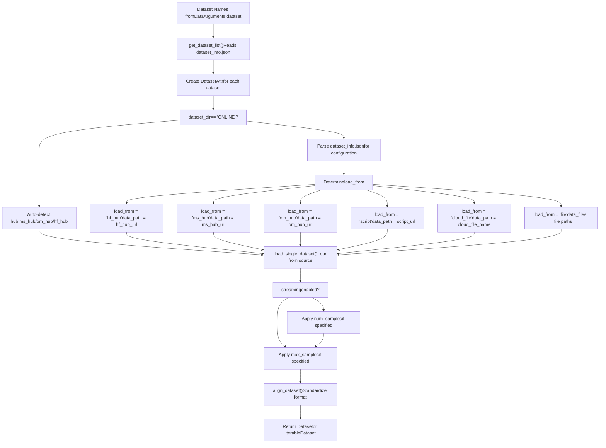
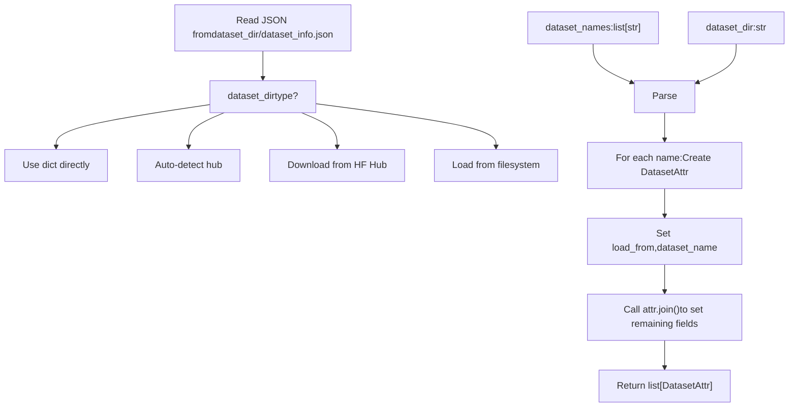
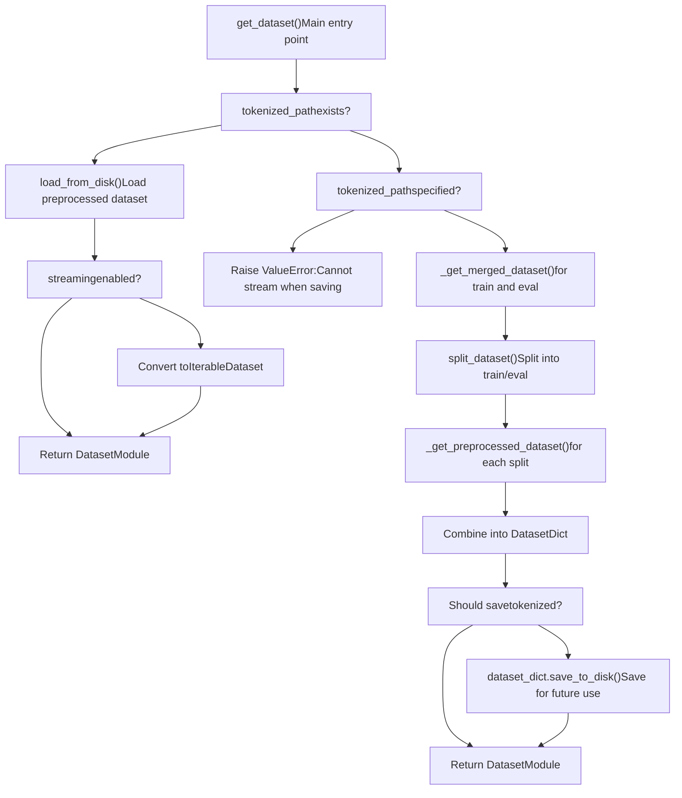
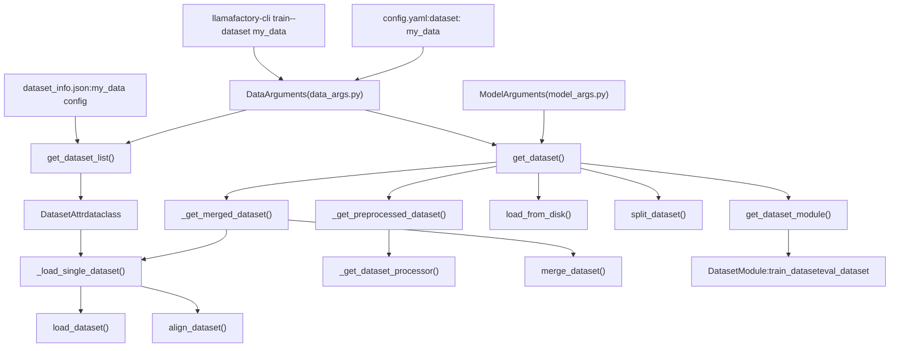

# Dataset Loading and Sources

Relevant source files

-   [data/README.md](https://github.com/hiyouga/LlamaFactory/blob/355d5c5e/data/README.md?plain=1)
-   [data/README\_zh.md](https://github.com/hiyouga/LlamaFactory/blob/355d5c5e/data/README_zh.md?plain=1)
-   [src/llamafactory/data/loader.py](https://github.com/hiyouga/LlamaFactory/blob/355d5c5e/src/llamafactory/data/loader.py)
-   [src/llamafactory/data/parser.py](https://github.com/hiyouga/LlamaFactory/blob/355d5c5e/src/llamafactory/data/parser.py)
-   [src/llamafactory/hparams/data\_args.py](https://github.com/hiyouga/LlamaFactory/blob/355d5c5e/src/llamafactory/hparams/data_args.py)
-   [src/llamafactory/webui/components/\_\_init\_\_.py](https://github.com/hiyouga/LlamaFactory/blob/355d5c5e/src/llamafactory/webui/components/__init__.py)
-   [src/llamafactory/webui/components/footer.py](https://github.com/hiyouga/LlamaFactory/blob/355d5c5e/src/llamafactory/webui/components/footer.py)

This page documents how LlamaFactory loads datasets from various sources and configures them for training and evaluation. It covers the dataset configuration system (`dataset_info.json`), supported data sources, and the loading pipeline that converts raw data into standardized datasets.

For information about how loaded datasets are formatted and processed with templates, see [Dataset Formats and Templates](/hiyouga/LlamaFactory/4.2-dataset-formats-and-templates). For multimodal data processing, see [Multimodal Data Processing](/hiyouga/LlamaFactory/4.3-multimodal-data-processing). For how datasets are batched for training, see [Data Collation and Batching](/hiyouga/LlamaFactory/4.4-data-collation-and-batching).

## Overview

LlamaFactory's data loading system provides a unified interface for loading datasets from multiple sources while maintaining flexibility in dataset configuration. The system uses a declarative configuration file (`dataset_info.json`) to specify dataset locations, formats, and column mappings, then loads and standardizes datasets through a multi-stage pipeline.

## Dataset Configuration System

### The dataset\_info.json File

The `dataset_info.json` file is the central registry for all datasets used in LlamaFactory. It must be placed in the directory specified by the `dataset_dir` parameter (default: `./data`). This file maps dataset names to their configurations.

**Basic Structure:**

| Field | Type | Required | Description |
| --- | --- | --- | --- |
| `hf_hub_url` | string | conditional | Hugging Face Hub repository path |
| `ms_hub_url` | string | conditional | ModelScope Hub repository path |
| `om_hub_url` | string | conditional | OpenMind Hub repository path |
| `script_url` | string | conditional | Local directory containing a dataset loading script |
| `cloud_file_name` | string | conditional | S3/GCS cloud storage file path |
| `file_name` | string | conditional | Local file or folder name (required if hub URLs not specified) |
| `formatting` | string | optional | Dataset format: `alpaca` (default) or `sharegpt` |
| `ranking` | boolean | optional | Whether dataset is for preference learning (default: false) |
| `subset` | string | optional | Dataset subset name |
| `split` | string | optional | Dataset split to use (default: `train`) |
| `folder` | string | optional | Folder within repository |
| `num_samples` | integer | optional | Number of samples to use from dataset |

**Column Mappings:**

The `columns` field maps dataset columns to LlamaFactory's standard names:

| Standard Name | Default Column | Purpose |
| --- | --- | --- |
| `prompt` | `instruction` | User instruction/prompt |
| `query` | `input` | Additional user input |
| `response` | `output` | Model response |
| `history` | None | Conversation history |
| `messages` | `conversations` | Message list (ShareGPT format) |
| `system` | None | System prompt |
| `tools` | None | Tool descriptions |
| `images` | None | Image file paths |
| `videos` | None | Video file paths |
| `audios` | None | Audio file paths |
| `chosen` | None | Preferred response (preference datasets) |
| `rejected` | None | Rejected response (preference datasets) |
| `kto_tag` | None | KTO feedback label |

**ShareGPT Tags:**

For ShareGPT format datasets, the `tags` field customizes role identifiers:

| Tag | Default Value | Purpose |
| --- | --- | --- |
| `role_tag` | `from` | Key for sender role |
| `content_tag` | `value` | Key for message content |
| `user_tag` | `human` | User role identifier |
| `assistant_tag` | `gpt` | Assistant role identifier |
| `observation_tag` | `observation` | Tool result role |
| `function_tag` | `function_call` | Function call role |
| `system_tag` | `system` | System prompt role |

**Example Configuration:**

```
{  "alpaca_demo": {    "file_name": "alpaca_en_demo.json",    "columns": {      "prompt": "instruction",      "query": "input",      "response": "output"    }  },  "identity": {    "hf_hub_url": "AI-ModelScope/alpaca-gpt4-data-en",    "ms_hub_url": "AI-ModelScope/alpaca-gpt4-data",    "subset": "default"  },  "glaive_toolcall": {    "file_name": "glaive_toolcall_en_demo.json",    "formatting": "sharegpt",    "columns": {      "messages": "conversations",      "tools": "tools"    }  }}
```
Sources: [data/README.md7-44](https://github.com/hiyouga/LlamaFactory/blob/355d5c5e/data/README.md?plain=1#L7-L44) [src/llamafactory/data/parser.py26-91](https://github.com/hiyouga/LlamaFactory/blob/355d5c5e/src/llamafactory/data/parser.py#L26-L91)

### DatasetAttr Class

The `DatasetAttr` dataclass represents a parsed dataset configuration. It is created by `get_dataset_list()` when reading `dataset_info.json`.


**Dataset Loading Flow:**

Sources: [src/llamafactory/data/parser.py26-91](https://github.com/hiyouga/LlamaFactory/blob/355d5c5e/src/llamafactory/data/parser.py#L26-L91) [src/llamafactory/hparams/data\_args.py22-187](https://github.com/hiyouga/LlamaFactory/blob/355d5c5e/src/llamafactory/hparams/data_args.py#L22-L187)

## Data Sources

LlamaFactory supports five distinct data sources, determined by the `load_from` field in `DatasetAttr`:

### 1\. Hugging Face Hub (`hf_hub`)

Loads datasets directly from Hugging Face's dataset repository.

**Configuration:**

-   Specify `hf_hub_url` in `dataset_info.json`
-   Uses `datasets.load_dataset()` with Hugging Face authentication
-   Respects `cache_dir` and `hf_hub_token` from `ModelArguments`

**Loading Logic:**

```
# From loader.py:131-141dataset = load_dataset(    path=data_path,    name=data_name,    data_dir=data_dir,    data_files=data_files,    split=dataset_attr.split,    cache_dir=model_args.cache_dir,    token=model_args.hf_hub_token,    num_proc=data_args.preprocessing_num_workers,    streaming=data_args.streaming)
```
### 2\. ModelScope Hub (`ms_hub`)

Loads datasets from ModelScope's repository, commonly used in China.

**Configuration:**

-   Specify `ms_hub_url` in `dataset_info.json`
-   Requires `modelscope>=1.14.0`
-   Uses `MS_DATASETS_CACHE` for caching

**Loading Logic:**

```
# From loader.py:93-110from modelscope import MsDatasetdataset = MsDataset.load(    dataset_name=data_path,    subset_name=data_name,    data_dir=data_dir,    split=dataset_attr.split,    cache_dir=cache_dir,    token=model_args.ms_hub_token,    use_streaming=data_args.streaming)if isinstance(dataset, MsDataset):    dataset = dataset.to_hf_dataset()
```
### 3\. OpenMind Hub (`om_hub`)

Loads datasets from OpenMind's repository.

**Configuration:**

-   Specify `om_hub_url` in `dataset_info.json`
-   Requires `openmind>=0.8.0`
-   Uses `OM_DATASETS_CACHE` for caching

**Loading Logic:**

```
# From loader.py:112-127from openmind import OmDatasetdataset = OmDataset.load_dataset(    path=data_path,    name=data_name,    data_dir=data_dir,    split=dataset_attr.split,    cache_dir=cache_dir,    token=model_args.om_hub_token,    streaming=data_args.streaming)
```
### 4\. Local Files (`file`)

Loads datasets from local files in various formats.

**Configuration:**

-   Specify `file_name` in `dataset_info.json`
-   Path is relative to `dataset_dir`
-   Supports directories or individual files

**Supported File Types:**

| Extension | Dataset Type | Description |
| --- | --- | --- |
| `.json` | JSON | Standard JSON format |
| `.jsonl` | JSON Lines | Newline-delimited JSON |
| `.csv` | CSV | Comma-separated values |
| `.parquet` | Parquet | Apache Parquet columnar format |
| `.arrow` | Arrow | Apache Arrow format |

**Loading Logic:**

```
# From loader.py:73-89data_files = []local_path = os.path.join(data_args.dataset_dir, dataset_attr.dataset_name)if os.path.isdir(local_path):    for file_name in os.listdir(local_path):        data_files.append(os.path.join(local_path, file_name))elif os.path.isfile(local_path):    data_files.append(local_path)else:    raise ValueError(f"File {local_path} not found.") data_path = FILEEXT2TYPE.get(os.path.splitext(data_files[0])[-1][1:], None)
```
**Validation:**

-   All files in a directory must have the same extension
-   File types must be in the supported list

### 5\. Cloud Storage (`cloud_file`)

Loads datasets from S3 or GCS cloud storage.

**Configuration:**

-   Specify `cloud_file_name` in `dataset_info.json`
-   File must be in JSON format
-   Uses `read_cloud_json()` to fetch data

**Loading Logic:**

```
# From loader.py:128-129dataset = Dataset.from_list(    read_cloud_json(data_path),     split=dataset_attr.split)
```
### 6\. Custom Loading Scripts (`script`)

Loads datasets using a custom Python loading script.

**Configuration:**

-   Specify `script_url` in `dataset_info.json`
-   Points to a directory containing a dataset loading script
-   Script must be compatible with `datasets.load_dataset()`

**Loading Logic:**

```
# From loader.py:65-68data_path = os.path.join(data_args.dataset_dir, dataset_attr.dataset_name)data_name = dataset_attr.subsetdata_dir = dataset_attr.folder
```
**Hub Priority:**

When multiple hub URLs are specified, the system uses the following priority:

1.  ModelScope Hub (if `use_modelscope()` or no HF URL)
2.  OpenMind Hub (if `use_openmind()` or no HF URL)
3.  Hugging Face Hub (default)

Sources: [src/llamafactory/data/loader.py51-161](https://github.com/hiyouga/LlamaFactory/blob/355d5c5e/src/llamafactory/data/loader.py#L51-L161) [src/llamafactory/data/parser.py93-149](https://github.com/hiyouga/LlamaFactory/blob/355d5c5e/src/llamafactory/data/parser.py#L93-L149)

## Dataset Loading Pipeline


Sources: [src/llamafactory/data/loader.py51-161](https://github.com/hiyouga/LlamaFactory/blob/355d5c5e/src/llamafactory/data/loader.py#L51-L161) [src/llamafactory/data/parser.py93-149](https://github.com/hiyouga/LlamaFactory/blob/355d5c5e/src/llamafactory/data/parser.py#L93-L149)

### Loading Process Stages

#### Stage 1: Configuration Parsing

The `get_dataset_list()` function reads `dataset_info.json` and creates `DatasetAttr` objects:


**Remote Configuration:**

If `dataset_dir` starts with `REMOTE:`, the configuration is fetched from a Hugging Face repository:

```
# From parser.py:103-104config_path = hf_hub_download(    repo_id=dataset_dir[7:],     filename=DATA_CONFIG,     repo_type="dataset")
```
Sources: [src/llamafactory/data/parser.py93-149](https://github.com/hiyouga/LlamaFactory/blob/355d5c5e/src/llamafactory/data/parser.py#L93-L149)

#### Stage 2: Single Dataset Loading

The `_load_single_dataset()` function handles loading from the determined source:

**Key Steps:**

1.  **Determine loading parameters** based on `load_from` field [src/llamafactory/data/loader.py59-91](https://github.com/hiyouga/LlamaFactory/blob/355d5c5e/src/llamafactory/data/loader.py#L59-L91)
2.  **Call appropriate loader** (HF, ModelScope, OpenMind, or built-in) [src/llamafactory/data/loader.py93-143](https://github.com/hiyouga/LlamaFactory/blob/355d5c5e/src/llamafactory/data/loader.py#L93-L143)
3.  **Convert to iterable** if streaming is enabled for local files [src/llamafactory/data/loader.py142-143](https://github.com/hiyouga/LlamaFactory/blob/355d5c5e/src/llamafactory/data/loader.py#L142-L143)
4.  **Apply sampling** if `num_samples` is specified [src/llamafactory/data/loader.py145-155](https://github.com/hiyouga/LlamaFactory/blob/355d5c5e/src/llamafactory/data/loader.py#L145-L155)
5.  **Truncate** if `max_samples` is specified [src/llamafactory/data/loader.py157-159](https://github.com/hiyouga/LlamaFactory/blob/355d5c5e/src/llamafactory/data/loader.py#L157-L159)
6.  **Align format** using `align_dataset()` [src/llamafactory/data/loader.py161](https://github.com/hiyouga/LlamaFactory/blob/355d5c5e/src/llamafactory/data/loader.py#L161-L161)

**Sampling Logic:**

When `num_samples` is specified (not compatible with streaming):

```
# From loader.py:145-154target_num = dataset_attr.num_samplesindexes = np.random.permutation(len(dataset))[:target_num]target_num -= len(indexes)if target_num > 0:  # Need more samples - oversample    expand_indexes = np.random.choice(len(dataset), target_num)    indexes = np.concatenate((indexes, expand_indexes), axis=0) assert len(indexes) == dataset_attr.num_samplesdataset = dataset.select(indexes)
```
Sources: [src/llamafactory/data/loader.py51-161](https://github.com/hiyouga/LlamaFactory/blob/355d5c5e/src/llamafactory/data/loader.py#L51-L161)

#### Stage 3: Dataset Merging

The `_get_merged_dataset()` function combines multiple datasets:

**Merge Strategies:**

| Strategy | Description | When to Use |
| --- | --- | --- |
| `concat` | Concatenate datasets sequentially | Default, preserves dataset ordering |
| `interleave_under` | Interleave with undersampling | Balance datasets by limiting larger ones |
| `interleave_over` | Interleave with oversampling | Balance datasets by repeating smaller ones |

**Configuration:**

The `mix_strategy` and `interleave_probs` parameters in `DataArguments` control merging:

-   `mix_strategy`: Strategy to use (default: `concat`)
-   `interleave_probs`: Sampling probabilities for interleave strategies (must match dataset count)

**Loading Flow:**

```
# From loader.py:164-186def _get_merged_dataset(dataset_names, ...):    if dataset_names is None:        return None        datasets = {}    for dataset_name, dataset_attr in zip(        dataset_names,         get_dataset_list(dataset_names, data_args.dataset_dir)    ):        # Validate dataset is appropriate for training stage        if (stage == "rm" and dataset_attr.ranking is False) or \           (stage != "rm" and dataset_attr.ranking is True):            raise ValueError("Dataset not applicable in current stage.")                datasets[dataset_name] = _load_single_dataset(...)        if return_dict:        return datasets    else:        return merge_dataset(            list(datasets.values()),             data_args,             seed=training_args.seed        )
```
**Stage Validation:**

Datasets are validated for the training stage:

-   Reward modeling (`rm`): Requires `ranking=True`
-   Other stages: Requires `ranking=False` (unless preference learning stage like `dpo`, `kto`)

Sources: [src/llamafactory/data/loader.py164-186](https://github.com/hiyouga/LlamaFactory/blob/355d5c5e/src/llamafactory/data/loader.py#L164-L186)

## Main Entry Point: get\_dataset()

The `get_dataset()` function is the primary interface for loading datasets:


**Function Signature:**

```
# From loader.py:276-284def get_dataset(    template: "Template",    model_args: "ModelArguments",    data_args: "DataArguments",    training_args: "Seq2SeqTrainingArguments",    stage: Literal["pt", "sft", "rm", "ppo", "kto"],    tokenizer: "PreTrainedTokenizer",    processor: Optional["ProcessorMixin"] = None,) -> "DatasetModule":
```
**Tokenized Dataset Caching:**

The system supports caching preprocessed datasets to disk:

1.  **Saving:** If `tokenized_path` is specified and doesn't exist, the dataset is saved after preprocessing [src/llamafactory/data/loader.py330-334](https://github.com/hiyouga/LlamaFactory/blob/355d5c5e/src/llamafactory/data/loader.py#L330-L334)
2.  **Loading:** If `tokenized_path` exists, the dataset is loaded directly, bypassing all preprocessing [src/llamafactory/data/loader.py286-296](https://github.com/hiyouga/LlamaFactory/blob/355d5c5e/src/llamafactory/data/loader.py#L286-L296)
3.  **Warning:** Loading from disk ignores all other data arguments [src/llamafactory/data/loader.py289](https://github.com/hiyouga/LlamaFactory/blob/355d5c5e/src/llamafactory/data/loader.py#L289-L289)

**Process Synchronization:**

The loading and preprocessing use `training_args.main_process_first()` to ensure:

-   Only the main process loads datasets first [src/llamafactory/data/loader.py302](https://github.com/hiyouga/LlamaFactory/blob/355d5c5e/src/llamafactory/data/loader.py#L302-L302)
-   Other processes wait and reuse cached results
-   The `data_shared_file_system` parameter controls whether processes share filesystem access [src/llamafactory/data/loader.py302](https://github.com/hiyouga/LlamaFactory/blob/355d5c5e/src/llamafactory/data/loader.py#L302-L302)

Sources: [src/llamafactory/data/loader.py276-336](https://github.com/hiyouga/LlamaFactory/blob/355d5c5e/src/llamafactory/data/loader.py#L276-L336)

## Dataset Arguments Configuration

The `DataArguments` class in [src/llamafactory/hparams/data\_args.py22-187](https://github.com/hiyouga/LlamaFactory/blob/355d5c5e/src/llamafactory/hparams/data_args.py#L22-L187) defines all data-related configuration parameters:

### Core Parameters

| Parameter | Type | Default | Description |
| --- | --- | --- | --- |
| `dataset` | str | None | None | Comma-separated dataset names for training |
| `eval_dataset` | str | None | None | Comma-separated dataset names for evaluation |
| `dataset_dir` | str | `"data"` | Directory containing datasets and `dataset_info.json` |
| `media_dir` | str | None | None | Directory for images/videos/audios (defaults to `dataset_dir`) |

### Loading Parameters

| Parameter | Type | Default | Description |
| --- | --- | --- | --- |
| `streaming` | bool | False | Enable dataset streaming for large datasets |
| `buffer_size` | int | 16384 | Buffer size for streaming random sampling |
| `max_samples` | int | None | None | Maximum samples per dataset (for debugging) |
| `overwrite_cache` | bool | False | Ignore cached preprocessed datasets |
| `preprocessing_num_workers` | int | None | None | Number of parallel preprocessing workers |
| `preprocessing_batch_size` | int | 1000 | Batch size for preprocessing operations |

### Mixing Parameters

| Parameter | Type | Default | Description |
| --- | --- | --- | --- |
| `mix_strategy` | Literal | `"concat"` | Strategy: `concat`, `interleave_under`, `interleave_over` |
| `interleave_probs` | str | None | None | Comma-separated sampling probabilities for interleaving |

### Splitting Parameters

| Parameter | Type | Default | Description |
| --- | --- | --- | --- |
| `val_size` | float | 0.0 | Validation split size (integer count or float ratio) |
| `eval_on_each_dataset` | bool | False | Evaluate on each dataset separately |

### Tokenization Caching

| Parameter | Type | Default | Description |
| --- | --- | --- | --- |
| `tokenized_path` | str | None | None | Path to save/load tokenized datasets |
| `data_shared_file_system` | bool | False | Whether processes share filesystem for data |

### Validation Rules

The `__post_init__` method enforces several constraints:

1.  **Cannot specify both `eval_dataset` and `val_size`** [src/llamafactory/hparams/data\_args.py156-157](https://github.com/hiyouga/LlamaFactory/blob/355d5c5e/src/llamafactory/hparams/data_args.py#L156-L157)
2.  **Cannot use `val_size` without `dataset`** [src/llamafactory/hparams/data\_args.py153-154](https://github.com/hiyouga/LlamaFactory/blob/355d5c5e/src/llamafactory/hparams/data_args.py#L153-L154)
3.  **Interleave probabilities must match dataset count** [src/llamafactory/hparams/data\_args.py164-168](https://github.com/hiyouga/LlamaFactory/blob/355d5c5e/src/llamafactory/hparams/data_args.py#L164-L168)
4.  **Streaming mode requires integer `val_size`** [src/llamafactory/hparams/data\_args.py170-171](https://github.com/hiyouga/LlamaFactory/blob/355d5c5e/src/llamafactory/hparams/data_args.py#L170-L171)
5.  **`max_samples` incompatible with streaming** [src/llamafactory/hparams/data\_args.py173-174](https://github.com/hiyouga/LlamaFactory/blob/355d5c5e/src/llamafactory/hparams/data_args.py#L173-L174)

Sources: [src/llamafactory/hparams/data\_args.py22-187](https://github.com/hiyouga/LlamaFactory/blob/355d5c5e/src/llamafactory/hparams/data_args.py#L22-L187)

## Examples

### Example 1: Loading a Single Local Dataset

**Configuration in `dataset_info.json`:**

```
{  "my_dataset": {    "file_name": "my_data.json",    "columns": {      "prompt": "instruction",      "response": "output"    }  }}
```
**Usage:**

```
data_args.dataset = "my_dataset"data_args.dataset_dir = "./data"
```
The system will:

1.  Parse `./data/dataset_info.json`
2.  Create `DatasetAttr` with `load_from="file"` and `dataset_name="my_data.json"`
3.  Load `./data/my_data.json` using `load_dataset("json", data_files=...)`
4.  Map `instruction` → `prompt` and `output` → `response`

### Example 2: Mixing Multiple Datasets with Interleaving

**Configuration:**

```
{  "dataset_a": {"file_name": "dataset_a.json"},  "dataset_b": {"file_name": "dataset_b.json"},  "dataset_c": {"file_name": "dataset_c.json"}}
```
**Usage:**

```
data_args.dataset = "dataset_a,dataset_b,dataset_c"data_args.mix_strategy = "interleave_under"data_args.interleave_probs = "0.5,0.3,0.2"
```
The system will load all three datasets and interleave them with specified probabilities, undersampling larger datasets to balance.

### Example 3: Loading from Hugging Face Hub

**Configuration:**

```
{  "alpaca_gpt4": {    "hf_hub_url": "vicgalle/alpaca-gpt4",    "subset": "default",    "split": "train"  }}
```
The system will load directly from Hugging Face Hub without requiring local files.

### Example 4: Using ONLINE Mode

**Usage:**

```
data_args.dataset = "tatsu-lab/alpaca"data_args.dataset_dir = "ONLINE"
```
When `dataset_dir="ONLINE"`, the system bypasses `dataset_info.json` and loads datasets directly from the hub, auto-detecting whether to use Hugging Face, ModelScope, or OpenMind based on environment.

### Example 5: Tokenized Dataset Caching

**First Run (preprocessing):**

```
data_args.dataset = "my_dataset"data_args.tokenized_path = "./tokenized_data"
```
The system preprocesses the dataset and saves it to `./tokenized_data`.

**Subsequent Runs (loading):**

```
data_args.tokenized_path = "./tokenized_data"# dataset, template, and other data args are ignored
```
The system loads the preprocessed dataset directly, dramatically reducing startup time.

Sources: [data/README.md1-475](https://github.com/hiyouga/LlamaFactory/blob/355d5c5e/data/README.md?plain=1#L1-L475) [src/llamafactory/data/loader.py276-336](https://github.com/hiyouga/LlamaFactory/blob/355d5c5e/src/llamafactory/data/loader.py#L276-L336)

## Code Entity Map


Sources: [src/llamafactory/data/loader.py1-336](https://github.com/hiyouga/LlamaFactory/blob/355d5c5e/src/llamafactory/data/loader.py#L1-L336) [src/llamafactory/data/parser.py1-149](https://github.com/hiyouga/LlamaFactory/blob/355d5c5e/src/llamafactory/data/parser.py#L1-L149) [src/llamafactory/hparams/data\_args.py1-187](https://github.com/hiyouga/LlamaFactory/blob/355d5c5e/src/llamafactory/hparams/data_args.py#L1-L187)
