# Dataset Formats and Templates

Relevant source files

-   [data/README.md](https://github.com/hiyouga/LlamaFactory/blob/355d5c5e/data/README.md?plain=1)
-   [data/README\_zh.md](https://github.com/hiyouga/LlamaFactory/blob/355d5c5e/data/README_zh.md?plain=1)
-   [src/llamafactory/data/collator.py](https://github.com/hiyouga/LlamaFactory/blob/355d5c5e/src/llamafactory/data/collator.py)
-   [src/llamafactory/data/mm\_plugin.py](https://github.com/hiyouga/LlamaFactory/blob/355d5c5e/src/llamafactory/data/mm_plugin.py)
-   [src/llamafactory/data/template.py](https://github.com/hiyouga/LlamaFactory/blob/355d5c5e/src/llamafactory/data/template.py)
-   [src/llamafactory/extras/constants.py](https://github.com/hiyouga/LlamaFactory/blob/355d5c5e/src/llamafactory/extras/constants.py)
-   [src/llamafactory/model/model\_utils/misc.py](https://github.com/hiyouga/LlamaFactory/blob/355d5c5e/src/llamafactory/model/model_utils/misc.py)
-   [src/llamafactory/model/model\_utils/visual.py](https://github.com/hiyouga/LlamaFactory/blob/355d5c5e/src/llamafactory/model/model_utils/visual.py)
-   [src/llamafactory/webui/components/\_\_init\_\_.py](https://github.com/hiyouga/LlamaFactory/blob/355d5c5e/src/llamafactory/webui/components/__init__.py)
-   [src/llamafactory/webui/components/footer.py](https://github.com/hiyouga/LlamaFactory/blob/355d5c5e/src/llamafactory/webui/components/footer.py)
-   [tests/data/test\_mm\_plugin.py](https://github.com/hiyouga/LlamaFactory/blob/355d5c5e/tests/data/test_mm_plugin.py)
-   [tests/version.txt](https://github.com/hiyouga/LlamaFactory/blob/355d5c5e/tests/version.txt)

## Purpose and Scope

This document describes the dataset formats accepted by LlamaFactory and the chat template system that transforms these formats into model-specific input sequences. It covers the **Alpaca** and **ShareGPT** formats for supervised fine-tuning, pre-training, preference learning, and multimodal data, as well as the **Template** abstraction that handles role-based formatting and model-specific conversation structures.

For information about loading datasets from various sources, see [Dataset Loading and Sources](/hiyouga/LlamaFactory/4.1-dataset-loading-and-sources). For multimodal data processing details, see [Multimodal Data Processing](/hiyouga/LlamaFactory/4.3-multimodal-data-processing).

---

## Dataset Formats

LlamaFactory supports two primary dataset formats, defined in `dataset_info.json` configuration files. The system automatically loads and processes these formats based on column mappings.

### Alpaca Format

The Alpaca format is a simple instruction-response structure suitable for supervised fine-tuning, pre-training, and preference learning.

**Structure:**

| Field | Type | Required | Description |
| --- | --- | --- | --- |
| `instruction` | string | Yes | User instruction or prompt |
| `input` | string | No | Additional context or query |
| `output` | string | Yes (SFT) | Model response |
| `system` | string | No | System prompt |
| `history` | list\[tuple\[str, str\]\] | No | Conversation history (instruction, response pairs) |
| `chosen` | string | Yes (preference) | Preferred response |
| `rejected` | string | Yes (preference) | Rejected response |
| `kto_tag` | boolean | Yes (KTO) | Human feedback label |
| `images` | list\[string\] | No | Image file paths |
| `videos` | list\[string\] | No | Video file paths |
| `audios` | list\[string\] | No | Audio file paths |

**Supervised Fine-Tuning Example:**

```
{  "instruction": "Translate to French",  "input": "Hello world",  "output": "Bonjour le monde",  "system": "You are a translator",  "history": [    ["What is 2+2?", "The answer is 4."]  ]}
```
The prompt construction concatenates `instruction` and `input` as: `instruction\ninput`. The template system then wraps this with model-specific formatting.

**Pre-training Example:**

For pre-training, only a `text` column is needed, mapped to the `prompt` field:

```
{"text": "This is a document for language modeling."}
```
**Preference Dataset Example:**

```
{  "instruction": "Write a story",  "input": "",  "chosen": "Once upon a time...",  "rejected": "Story goes here..."}
```
**Configuration in `dataset_info.json`:**

```
{  "dataset_name": {    "file_name": "data.json",    "formatting": "alpaca",    "ranking": false,    "columns": {      "prompt": "instruction",      "query": "input",      "response": "output",      "system": "system",      "history": "history"    }  }}
```
**Sources:** [data/README.md1-479](https://github.com/hiyouga/LlamaFactory/blob/355d5c5e/data/README.md?plain=1#L1-L479) [data/README\_zh.md1-479](https://github.com/hiyouga/LlamaFactory/blob/355d5c5e/data/README_zh.md?plain=1#L1-L479)

### ShareGPT Format

The ShareGPT format supports multi-turn conversations with various roles (user, assistant, system, function, observation) in a single `conversations` or `messages` array.

**Structure:**

The dataset contains a `conversations` (or `messages`) column with a list of message objects:

```
{  "conversations": [    {"from": "system", "value": "System prompt"},    {"from": "human", "value": "User message"},    {"from": "gpt", "value": "Assistant response"},    {"from": "function_call", "value": "Tool call"},    {"from": "observation", "value": "Tool result"},    {"from": "gpt", "value": "Final response"}  ],  "system": "Optional system override",  "tools": "Tool descriptions",  "images": ["image1.jpg"],  "videos": ["video1.mp4"],  "audios": ["audio1.wav"]}
```
**Role Tags:**

| Default Tag | Customizable Via | Position | Loss Computed |
| --- | --- | --- | --- |
| `human` | `user_tag` | Odd (0, 2, 4...) | No |
| `gpt` | `assistant_tag` | Even (1, 3, 5...) | Yes |
| `system` | `system_tag` | First position only | No |
| `function_call` | `function_tag` | Even | Yes |
| `observation` | `observation_tag` | Odd | No |

**Configuration in `dataset_info.json`:**

```
{  "dataset_name": {    "file_name": "data.json",    "formatting": "sharegpt",    "columns": {      "messages": "conversations",      "system": "system",      "tools": "tools",      "images": "images"    },    "tags": {      "role_tag": "from",      "content_tag": "value",      "user_tag": "human",      "assistant_tag": "gpt",      "observation_tag": "observation",      "function_tag": "function_call",      "system_tag": "system"    }  }}
```
**OpenAI Format:**

OpenAI format is a variant of ShareGPT where roles are `user`, `assistant`, and `system`:

```
{  "messages": [    {"role": "system", "content": "System prompt"},    {"role": "user", "content": "User message"},    {"role": "assistant", "content": "Response"}  ]}
```
Configuration uses different tag mappings:

```
{  "tags": {    "role_tag": "role",    "content_tag": "content",    "user_tag": "user",    "assistant_tag": "assistant",    "system_tag": "system"  }}
```
**Sources:** [data/README.md168-479](https://github.com/hiyouga/LlamaFactory/blob/355d5c5e/data/README.md?plain=1#L168-L479) [data/README\_zh.md167-479](https://github.com/hiyouga/LlamaFactory/blob/355d5c5e/data/README_zh.md?plain=1#L167-L479)

---

## Template System Architecture

```mermaid
flowchart TD
    TEMPLATES["TEMPLATES dictname -> Template"]
    register_template["register_template"]
    get_template_and_fix_tokenizer["get_template_and_fix_tokenizer"]
    Template["Template Classsrc/llamafactory/data/template.py"]
    Formatters["Formatters"]
    StringFormatter["StringFormatterSimple string slots"]
    FunctionFormatter["FunctionFormatterTool call formatting"]
    ToolFormatter["ToolFormatterTool description"]
    EmptyFormatter["EmptyFormatterPrefix/BOS tokens"]
    format_user["format_userUser message wrapper"]
    format_assistant["format_assistantAssistant message wrapper"]
    format_system["format_systemSystem prompt wrapper"]
    format_function["format_functionFunction call wrapper"]
    format_observation["format_observationTool result wrapper"]
    format_tools["format_toolsTool description"]
    format_prefix["format_prefixBOS/initial tokens"]
    Llama2Template["Llama2TemplateSystem fusion"]
    ReasoningTemplate["ReasoningTemplateThought handling"]

    Template --> format_user
    Template --> format_assistant
    Template --> format_system
    Template --> format_function
    Template --> format_observation
    Template --> format_tools
    Template --> format_prefix
    Formatters --> StringFormatter
    Formatters --> FunctionFormatter
    Formatters --> ToolFormatter
    Formatters --> EmptyFormatter
    format --> user_StringFormatter
    format --> assistant_StringFormatter
    format --> system_StringFormatter
    Template --> Llama2Template
    Template --> ReasoningTemplate
    register --> template_TEMPLATES
    TEMPLATES --> get_template_and_fix_tokenizer
```


**Template Class Architecture**

The `Template` class [src/llamafactory/data/template.py40-332](https://github.com/hiyouga/LlamaFactory/blob/355d5c5e/src/llamafactory/data/template.py#L40-L332) is the core abstraction that defines how messages are formatted for a specific model. Each template consists of:

1.  **Role Formatters**: Define how to wrap each role's content

    -   `format_user`: Wraps user messages
    -   `format_assistant`: Wraps assistant responses
    -   `format_system`: Wraps system prompts
    -   `format_function`: Wraps function call outputs
    -   `format_observation`: Wraps tool execution results
    -   `format_tools`: Formats tool descriptions
    -   `format_prefix`: Initial tokens (e.g., BOS token)
2.  **Formatting Slots**: Each formatter contains slots with placeholders

    -   String literals: `"### Instruction:\n"`
    -   Content placeholder: `"{{content}}"` (replaced with actual text)
    -   Special tokens: `{"eos_token"}`, `{"bos_token"}`
    -   Token refs: `{"token": "<reserved_102>"}`
3.  **Template Metadata**:

    -   `default_system`: Default system prompt
    -   `stop_words`: Additional stop tokens
    -   `thought_words`: Delimiters for reasoning (e.g., \`\`)
    -   `tool_call_words`: Delimiters for tool calls
    -   `efficient_eos`: Whether EOS is implicit
    -   `replace_eos`: Replace tokenizer's EOS token
    -   `replace_jinja_template`: Override tokenizer's chat template

**Encoding Process:**

> **[Mermaid sequence]**
> *(图表结构无法解析)*

The `encode_oneturn()` method [src/llamafactory/data/template.py59-73](https://github.com/hiyouga/LlamaFactory/blob/355d5c5e/src/llamafactory/data/template.py#L59-L73) processes a single conversation turn:

1.  Calls `_encode()` to format all messages
2.  Concatenates all but the last message as `prompt_ids`
3.  Returns the last message as `response_ids`

The `encode_multiturn()` method [src/llamafactory/data/template.py75-84](https://github.com/hiyouga/LlamaFactory/blob/355d5c5e/src/llamafactory/data/template.py#L75-L84) processes multiple turns:

1.  Calls `_encode()` to format all messages
2.  Pairs adjacent messages: (messages\[0\], messages\[1\]), (messages\[2\], messages\[3\]), ...
3.  Returns list of (prompt\_ids, response\_ids) tuples

**Sources:** [src/llamafactory/data/template.py40-332](https://github.com/hiyouga/LlamaFactory/blob/355d5c5e/src/llamafactory/data/template.py#L40-L332)

---

## Chat Template Examples

### Alpaca Template

The Alpaca template [src/llamafactory/data/template.py641-649](https://github.com/hiyouga/LlamaFactory/blob/355d5c5e/src/llamafactory/data/template.py#L641-L649) formats instructions with clear section markers:

```
register_template(    name="alpaca",    format_user=StringFormatter(slots=["### Instruction:\n{{content}}\n\n### Response:\n"]),    format_assistant=StringFormatter(slots=["{{content}}", {"eos_token"}, "\n\n"]),    default_system=(        "Below is an instruction that describes a task. "        "Write a response that appropriately completes the request.\n\n"    ),    replace_jinja_template=True,)
```
**Rendered Example:**

```
Below is an instruction that describes a task. Write a response that appropriately completes the request.

### Instruction:
Translate to French: Hello world

### Response:
Bonjour le monde<eos>\n\n
```
### ChatML Template

The ChatML template [src/llamafactory/data/template.py1072-1079](https://github.com/hiyouga/LlamaFactory/blob/355d5c5e/src/llamafactory/data/template.py#L1072-L1079) uses special tokens for role separation:

```
register_template(    name="chatml",    format_user=StringFormatter(slots=["<|im_start|>user\n{{content}}<|im_end|>\n<|im_start|>assistant\n"]),    format_system=StringFormatter(slots=["<|im_start|>system\n{{content}}<|im_end|>\n"]),    format_observation=StringFormatter(slots=["<|im_start|>tool\n{{content}}<|im_end|>\n<|im_start|>assistant\n"]),    stop_words=["<|im_end|>"],    replace_eos=True,)
```
**Rendered Example:**

```
<|im_start|>system
You are a helpful assistant<|im_end|>
<|im_start|>user
Hello<|im_end|>
<|im_start|>assistant
Hi there!<|im_end|>
```
### Llama2 Template (System Fusion)

The `Llama2Template` class [src/llamafactory/data/template.py334-401](https://github.com/hiyouga/LlamaFactory/blob/355d5c5e/src/llamafactory/data/template.py#L334-L401) fuses the system prompt into the first user message:

```
register_template(    name="llama2",    format_user=StringFormatter(slots=["[INST] {{content}} [/INST]"]),    format_system=StringFormatter(slots=["<<SYS>>\n{{content}}\n<</SYS>>\n\n"]),    default_system=(        "You are a helpful, respectful and honest assistant. "        "Always answer as helpfully as possible, while being safe."    ),    template_class=Llama2Template,)
```
**Rendered Example:**

```
[INST] <<SYS>>
You are a helpful assistant.
<</SYS>>

What is 2+2? [/INST] The answer is 4. [INST] Thank you [/INST]
```
The system prompt only appears in the first turn, concatenated with the first user message [src/llamafactory/data/template.py354-356](https://github.com/hiyouga/LlamaFactory/blob/355d5c5e/src/llamafactory/data/template.py#L354-L356)

**Sources:** [src/llamafactory/data/template.py641-2686](https://github.com/hiyouga/LlamaFactory/blob/355d5c5e/src/llamafactory/data/template.py#L641-L2686)

---

## Model-Template Mapping

```mermaid
flowchart TD
    register_model_group["register_model_group()src/llamafactory/extras/constants.py:155"]
    SUPPORTED_MODELS["SUPPORTED_MODELSOrderedDict"]
    DEFAULT_TEMPLATE["DEFAULT_TEMPLATEdefaultdict(str)"]
    Qwen["Qwen2-7B-Instructtemplate: qwen"]
    Llama["Llama-3-8B-Instructtemplate: llama3"]
    GLM["GLM-4-9B-Chattemplate: glm4"]
    Baichuan["Baichuan2-7B-Chattemplate: baichuan2"]
    get_template["get_template_and_fix_tokenizer()src/llamafactory/data/template.py:600"]
    TEMPLATES["TEMPLATES dictRegistered templates"]
    parse_template["parse_template()Fallback: parse from tokenizer"]

    register --> model_group_SUPPORTED_MODELS
    register --> model_group_DEFAULT_TEMPLATE
    Qwen --> DEFAULT_TEMPLATE
    Llama --> DEFAULT_TEMPLATE
    GLM --> DEFAULT_TEMPLATE
    Baichuan --> DEFAULT_TEMPLATE
    DEFAULT --> TEMPLATE_get_template
    TEMPLATES --> get_template
    get --> template_parse_template
```


### Model Registration

Models are registered with templates in [src/llamafactory/extras/constants.py155-169](https://github.com/hiyouga/LlamaFactory/blob/355d5c5e/src/llamafactory/extras/constants.py#L155-L169):

```
def register_model_group(    models: dict[str, dict[DownloadSource, str]],    template: str | None = None,    multimodal: bool = False,) -> None:    for name, path in models.items():        SUPPORTED_MODELS[name] = path        if template is not None and (            any(suffix in name for suffix in ("-Chat", "-Distill", "-Instruct", "-Thinking")) or multimodal        ):            DEFAULT_TEMPLATE[name] = template
```
Models with suffixes like `-Chat`, `-Instruct`, or `-Thinking` automatically inherit the specified template.

### Example Registrations

**Qwen Models** [src/llamafactory/extras/constants.py2100-2128](https://github.com/hiyouga/LlamaFactory/blob/355d5c5e/src/llamafactory/extras/constants.py#L2100-L2128):

```
register_model_group(    models={        "Qwen2-0.5B": {...},        "Qwen2-7B-Instruct": {...},  # Gets template="qwen"    },    template="qwen",)
```
**GLM Models** [src/llamafactory/extras/constants.py932-961](https://github.com/hiyouga/LlamaFactory/blob/355d5c5e/src/llamafactory/extras/constants.py#L932-L961):

```
register_model_group(    models={        "GLM-4-9B-Chat": {...},  # Gets template="glm4"    },    template="glm4",)
```
**Multimodal Models** [src/llamafactory/extras/constants.py1003-1020](https://github.com/hiyouga/LlamaFactory/blob/355d5c5e/src/llamafactory/extras/constants.py#L1003-L1020):

```
register_model_group(    models={        "GLM-4.5V-Air-Thinking": {...},    },    template="glm4_5v",    multimodal=True,  # Adds to MULTIMODAL_SUPPORTED_MODELS)
```
### Template Selection Logic

The `get_template_and_fix_tokenizer()` function [src/llamafactory/data/template.py600-638](https://github.com/hiyouga/LlamaFactory/blob/355d5c5e/src/llamafactory/data/template.py#L600-L638) selects templates using this priority:

1.  **Explicit `template` argument**: Use `data_args.template` if specified
2.  **Parse from tokenizer**: If tokenizer has `chat_template`, parse it with `parse_template()`
3.  **Use empty template**: Fallback placeholder

```
def get_template_and_fix_tokenizer(tokenizer: "PreTrainedTokenizer", data_args: "DataArguments") -> "Template":    if data_args.template is None:        if isinstance(tokenizer.chat_template, str):            logger.warning_rank0("Parsing chat template from tokenizer.")            template = parse_template(tokenizer)        else:            logger.warning_rank0("Use `empty` template.")            template = TEMPLATES["empty"]    else:        if data_args.template not in TEMPLATES:            raise ValueError(f"Template {data_args.template} does not exist.")        template = TEMPLATES[data_args.template]
```
The function also:

-   Validates `train_on_prompt` compatibility [src/llamafactory/data/template.py615-616](https://github.com/hiyouga/LlamaFactory/blob/355d5c5e/src/llamafactory/data/template.py#L615-L616)
-   Overrides tool format if `data_args.tool_format` specified [src/llamafactory/data/template.py618-622](https://github.com/hiyouga/LlamaFactory/blob/355d5c5e/src/llamafactory/data/template.py#L618-L622)
-   Overrides default system if `data_args.default_system` specified [src/llamafactory/data/template.py624-626](https://github.com/hiyouga/LlamaFactory/blob/355d5c5e/src/llamafactory/data/template.py#L624-L626)
-   Handles reasoning template configuration [src/llamafactory/data/template.py628-634](https://github.com/hiyouga/LlamaFactory/blob/355d5c5e/src/llamafactory/data/template.py#L628-L634)

**Sources:** [src/llamafactory/extras/constants.py155-3207](https://github.com/hiyouga/LlamaFactory/blob/355d5c5e/src/llamafactory/extras/constants.py#L155-L3207) [src/llamafactory/data/template.py600-638](https://github.com/hiyouga/LlamaFactory/blob/355d5c5e/src/llamafactory/data/template.py#L600-L638)

---

## Special Template Types

### Llama2Template: System Message Fusion

The `Llama2Template` class [src/llamafactory/data/template.py334-401](https://github.com/hiyouga/LlamaFactory/blob/355d5c5e/src/llamafactory/data/template.py#L334-L401) overrides the `_encode()` method to fuse the system prompt into the first user message instead of prepending it separately:

**Standard Template Encoding:**

```
[System: You are helpful]
[User: Hello]
[Assistant: Hi]
```
**Llama2Template Encoding:**

```
[User: [System: You are helpful] Hello]
[Assistant: Hi]
```
**Implementation:**

```
@overridedef _encode(self, tokenizer, messages, system, tools) -> list[list[int]]:    system = system or self.default_system    encoded_messages = []    for i, message in enumerate(messages):        elements = []        system_text = ""        if i == 0:            elements += self.format_prefix.apply()            if system or tools:                tool_text = self.format_tools.apply(content=tools)[0] if tools else ""                system_text = self.format_system.apply(content=(system + tool_text))[0]                if message["role"] == Role.USER:            elements += self.format_user.apply(content=system_text + message["content"])        # ... handle other roles
```
Key difference: `system_text` is concatenated directly to the first user message content [src/llamafactory/data/template.py359](https://github.com/hiyouga/LlamaFactory/blob/355d5c5e/src/llamafactory/data/template.py#L359-L359)

**Models Using Llama2Template:**

-   `llama2` [src/llamafactory/data/template.py1595-1606](https://github.com/hiyouga/LlamaFactory/blob/355d5c5e/src/llamafactory/data/template.py#L1595-L1606)
-   `llama2_zh` [src/llamafactory/data/template.py1609-1620](https://github.com/hiyouga/LlamaFactory/blob/355d5c5e/src/llamafactory/data/template.py#L1609-L1620)
-   `atom` [src/llamafactory/data/template.py665-671](https://github.com/hiyouga/LlamaFactory/blob/355d5c5e/src/llamafactory/data/template.py#L665-L671)

**Sources:** [src/llamafactory/data/template.py334-401](https://github.com/hiyouga/LlamaFactory/blob/355d5c5e/src/llamafactory/data/template.py#L334-L401)

### ReasoningTemplate: Chain-of-Thought Handling

The `ReasoningTemplate` class [src/llamafactory/data/template.py404-459](https://github.com/hiyouga/LlamaFactory/blob/355d5c5e/src/llamafactory/data/template.py#L404-L459) handles models with reasoning capabilities by managing "thought" sections in responses.

**Thought Words Configuration:**

Templates define thought delimiters via `thought_words` tuple:

-   Default: `("\n\n")` [src/llamafactory/data/template.py528](https://github.com/hiyouga/LlamaFactory/blob/355d5c5e/src/llamafactory/data/template.py#L528-L528)
-   Example model output: `\n\nThe answer is 4.`

**Behavior Modes (controlled by `enable_thinking`):**

| Mode | `enable_thinking` | Thought Placement | Loss Computed |
| --- | --- | --- | --- |
| Slow Thinking | `True` (default) | Added to response | Yes |
| Fast Thinking | `False` | Added to prompt | No |
| Auto | `None` | Data-dependent | Varies |

**One-Turn Encoding:**

```
def encode_oneturn(self, tokenizer, messages, system=None, tools=None):    messages = deepcopy(messages)    # Remove thoughts from history    for i in range(1, len(messages) - 2, 2):        messages[i]["content"] = self.remove_thought(messages[i]["content"])        # Handle last response based on enable_thinking    if self.enable_thinking is False:        messages[-1]["content"] = self.remove_thought(messages[-1]["content"])        prompt_ids, response_ids = super().encode_oneturn(tokenizer, messages, system, tools)        # Add empty thought if missing    if thought_words not in messages[-1]["content"]:        if not self.enable_thinking:  # Fast thinking            prompt_ids += self.get_thought_word_ids(tokenizer)        else:  # Slow thinking            response_ids = self.get_thought_word_ids(tokenizer) + response_ids        return prompt_ids, response_ids
```
**Multi-Turn Encoding:**

For multi-turn conversations, the template handles thoughts in each response [src/llamafactory/data/template.py436-459](https://github.com/hiyouga/LlamaFactory/blob/355d5c5e/src/llamafactory/data/template.py#L436-L459):

1.  Remove all thoughts if `enable_thinking=False`
2.  Keep thoughts in training data if `enable_thinking=True`
3.  Add empty thought markers where missing

**Models Using ReasoningTemplate:**

-   `deepseek3` [src/llamafactory/data/template.py1237-1252](https://github.com/hiyouga/LlamaFactory/blob/355d5c5e/src/llamafactory/data/template.py#L1237-L1252)
-   `deepseekr1` [src/llamafactory/data/template.py1255-1271](https://github.com/hiyouga/LlamaFactory/blob/355d5c5e/src/llamafactory/data/template.py#L1255-L1271)
-   `qwen3_vl` [src/llamafactory/data/template.py2340-2364](https://github.com/hiyouga/LlamaFactory/blob/355d5c5e/src/llamafactory/data/template.py#L2340-L2364)
-   `qwen3_vl_nothink` [src/llamafactory/data/template.py2367-2388](https://github.com/hiyouga/LlamaFactory/blob/355d5c5e/src/llamafactory/data/template.py#L2367-L2388) (with `enable_thinking=False`)

**Detection from Tokenizer:**

The `parse_template()` function [src/llamafactory/data/template.py538-597](https://github.com/hiyouga/LlamaFactory/blob/355d5c5e/src/llamafactory/data/template.py#L538-L597) automatically detects reasoning templates:

```
assistant_slot = tokenizer.apply_chat_template(messages, ...)template_class = ReasoningTemplate if "<think>" in assistant_slot else Template
```
**Sources:** [src/llamafactory/data/template.py404-459](https://github.com/hiyouga/LlamaFactory/blob/355d5c5e/src/llamafactory/data/template.py#L404-L459) [src/llamafactory/data/template.py628-634](https://github.com/hiyouga/LlamaFactory/blob/355d5c5e/src/llamafactory/data/template.py#L628-L634)

---

## Multimodal Template Support

```mermaid
flowchart TD
    IMAGE_PLACEHOLDER["IMAGE_PLACEHOLDER<image>src/llamafactory/extras/constants.py:52"]
    VIDEO_PLACEHOLDER["VIDEO_PLACEHOLDER<video>:105"]
    AUDIO_PLACEHOLDER["AUDIO_PLACEHOLDER<audio>:24"]
    Template["Template+mm_plugin: BasePlugin"]
    get_mm_plugin["get_mm_plugin(name)src/llamafactory/data/mm_plugin.py"]
    BasePlugin["BasePluginNo-op processing"]
    LlavaPlugin["LlavaPluginExpand <image> tokens"]
    Qwen2VLPlugin["Qwen2VLPluginWrap with vision tags"]
    PaligemmaPlugin["PaligemmaPluginPrepend to input_ids"]
    Gemma3Plugin["Gemma3PluginReplace with image_soft_token"]
    InternVLPlugin["InternVLPluginWrap with <img> tags"]
    process_messages["process_messages()Pre-tokenization"]
    process_token_ids["process_token_ids()Post-tokenization"]
    get_mm_inputs["get_mm_inputs()Build batched inputs"]

    IMAGE --> PLACEHOLDER_Template
    VIDEO --> PLACEHOLDER_Template
    AUDIO --> PLACEHOLDER_Template
    get --> mm_plugin_BasePlugin
    get --> mm_plugin_LlavaPlugin
    get --> mm_plugin_Qwen2VLPlugin
    get --> mm_plugin_PaligemmaPlugin
    get --> mm_plugin_Gemma3Plugin
    get --> mm_plugin_InternVLPlugin
    Template --> process_messages
    Template --> process_token_ids
    Template --> get_mm_inputs
```


### Multimodal Plugin Architecture

Each template has an associated `mm_plugin` that handles image, video, and audio placeholders [src/llamafactory/data/template.py57](https://github.com/hiyouga/LlamaFactory/blob/355d5c5e/src/llamafactory/data/template.py#L57-L57)

**Plugin Base Class:**

The `BasePlugin` [src/llamafactory/data/mm\_plugin.py412-466](https://github.com/hiyouga/LlamaFactory/blob/355d5c5e/src/llamafactory/data/mm_plugin.py#L412-L466) provides three key methods:

1.  **`process_messages()`**: Pre-process messages before tokenization

    -   Replace placeholders with model-specific tokens
    -   Example: `<image>` → `<image>` × 576 (for LLaVA)
2.  **`process_token_ids()`**: Post-process token IDs after tokenization

    -   Insert special token IDs
    -   Example: Prepend image token IDs for PaliGemma
3.  **`get_mm_inputs()`**: Build batched multimodal inputs

    -   Process images/videos/audios with processor
    -   Return `pixel_values`, `image_grid_thw`, etc.

**Plugin Configuration:**

Templates specify their multimodal plugin via the `mm_plugin` parameter [src/llamafactory/data/template.py482](https://github.com/hiyouga/LlamaFactory/blob/355d5c5e/src/llamafactory/data/template.py#L482-L482):

```
register_template(    name="llava",    ...,    mm_plugin=get_mm_plugin(name="llava", image_token="<image>"),)
```
### Example Multimodal Plugins

**LLaVA Plugin** [src/llamafactory/data/mm\_plugin.py827-878](https://github.com/hiyouga/LlamaFactory/blob/355d5c5e/src/llamafactory/data/mm_plugin.py#L827-L878):

Expands `<image>` placeholder to multiple image tokens based on image resolution:

```
@overridedef process_messages(self, messages, images, videos, audios, processor):    # Calculate image sequence length from processor config    image_seqlen = processor.image_seq_length  # e.g., 576        for message in messages:        content = message["content"]        while IMAGE_PLACEHOLDER in content:            # Replace single <image> with repeated tokens            content = content.replace(IMAGE_PLACEHOLDER, self.image_token * image_seqlen, 1)        message["content"] = content
```
**Qwen2-VL Plugin** [src/llamafactory/data/mm\_plugin.py1143-1191](https://github.com/hiyouga/LlamaFactory/blob/355d5c5e/src/llamafactory/data/mm_plugin.py#L1143-L1191):

Wraps placeholders with vision start/end tags and expands based on `image_grid_thw`:

```
@overridedef process_messages(self, messages, images, videos, audios, processor):    mm_inputs = self._get_mm_inputs(images, videos, audios, processor)    image_grid_thw = mm_inputs.get("image_grid_thw", [])        image_idx = 0    for message in messages:        content = message["content"]        while IMAGE_PLACEHOLDER in content:            # Calculate tokens from grid dimensions            image_seqlen = image_grid_thw[image_idx].prod() // merge_length            content = content.replace(                IMAGE_PLACEHOLDER,                f"<|vision_start|>{self.image_token * image_seqlen}<|vision_end|>",                1            )            image_idx += 1
```
**PaliGemma Plugin** [src/llamafactory/data/mm\_plugin.py1021-1073](https://github.com/hiyouga/LlamaFactory/blob/355d5c5e/src/llamafactory/data/mm_plugin.py#L1021-L1073):

Prepends image token IDs to the input sequence:

```
@overridedef process_token_ids(self, input_ids, labels, images, videos, audios, tokenizer, processor):    image_token_id = tokenizer.convert_tokens_to_ids(self.image_token)    image_seqlen = processor.image_seq_length * len(images)        # Prepend image tokens    input_ids = [image_token_id] * image_seqlen + input_ids    if labels is not None:        labels = [IGNORE_INDEX] * image_seqlen + labels        return input_ids, labels
```
**Gemma3 Plugin** [src/llamafactory/data/mm\_plugin.py519-577](https://github.com/hiyouga/LlamaFactory/blob/355d5c5e/src/llamafactory/data/mm_plugin.py#L519-L577):

Replaces `{{image}}` placeholders with full image sequence or BOI token:

```
@overridedef process_messages(self, messages, images, videos, audios, processor):    boi_token = getattr(processor, "boi_token")    full_image_sequence = getattr(processor, "full_image_sequence")    image_str = full_image_sequence if self.expand_mm_tokens else boi_token        for message in messages:        content = message["content"]        # Replace with full sequence during training, BOI during inference        message["content"] = content.replace("{{image}}", image_str)
```
**Validation:**

Plugins validate that placeholder counts match media counts [src/llamafactory/data/mm\_plugin.py192-219](https://github.com/hiyouga/LlamaFactory/blob/355d5c5e/src/llamafactory/data/mm_plugin.py#L192-L219):

```
def _validate_messages(self, messages, images, videos, audios):    num_image_tokens = sum(m["content"].count(IMAGE_PLACEHOLDER) for m in messages)    if len(images) != num_image_tokens:        raise ValueError(            f"Number of images ({len(images)}) doesn't match "            f"number of {IMAGE_PLACEHOLDER} tokens ({num_image_tokens})"        )
```
**Sources:** [src/llamafactory/data/mm\_plugin.py412-2245](https://github.com/hiyouga/LlamaFactory/blob/355d5c5e/src/llamafactory/data/mm_plugin.py#L412-L2245) [src/llamafactory/extras/constants.py24-105](https://github.com/hiyouga/LlamaFactory/blob/355d5c5e/src/llamafactory/extras/constants.py#L24-L105)

---

## Jinja and Ollama Template Generation

### Jinja Template Conversion

Templates can be converted to Jinja2 format for use with `tokenizer.apply_chat_template()` [src/llamafactory/data/template.py243-269](https://github.com/hiyouga/LlamaFactory/blob/355d5c5e/src/llamafactory/data/template.py#L243-L269):

```
def _get_jinja_template(self, tokenizer: "PreTrainedTokenizer") -> str:    # Convert formatters to Jinja expressions    prefix = self._convert_slots_to_jinja(self.format_prefix.apply(), tokenizer)    system = self._convert_slots_to_jinja(self.format_system.apply(), tokenizer, placeholder="system_message")    user = self._convert_slots_to_jinja(self.format_user.apply(), tokenizer)    assistant = self._convert_slots_to_jinja(self.format_assistant.apply(), tokenizer)        # Build Jinja template string    jinja_template = ""    if prefix:        jinja_template += "{{ " + prefix + " }}"        if self.default_system:        jinja_template += ""        jinja_template += (        ""        ""        ""        ""        "{{ " + system + " }}"        ""        ""        "{{ " + user + " }}"        "{{ " + assistant + " }}"        ""    )    return jinja_template
```
**Slot Conversion:**

The `_convert_slots_to_jinja()` method [src/llamafactory/data/template.py221-241](https://github.com/hiyouga/LlamaFactory/blob/355d5c5e/src/llamafactory/data/template.py#L221-L241) transforms template slots to Jinja expressions:

| Slot Type | Example | Jinja Output |
| --- | --- | --- |
| String literal | `"Hello "` | `'Hello '` |
| Content placeholder | `"{{content}}"` | `content` (variable reference) |
| BOS token | `{"bos_token"}` | `'<bos>'` (actual token string) |
| EOS token | `{"eos_token"}` | `'<eos>'` (actual token string) |

**Fixing Tokenizer:**

The template's Jinja representation is injected into the tokenizer [src/llamafactory/data/template.py271-277](https://github.com/hiyouga/LlamaFactory/blob/355d5c5e/src/llamafactory/data/template.py#L271-L277):

```
def fix_jinja_template(self, tokenizer: "PreTrainedTokenizer") -> None:    if tokenizer.chat_template is None or self.replace_jinja_template:        try:            tokenizer.chat_template = self._get_jinja_template(tokenizer)        except ValueError as e:            logger.info_rank0(f"Cannot add chat template: {e}")
```
### Ollama Modelfile Generation

Templates can generate Ollama `Modelfile` format [src/llamafactory/data/template.py316-331](https://github.com/hiyouga/LlamaFactory/blob/355d5c5e/src/llamafactory/data/template.py#L316-L331):

```
def get_ollama_modelfile(self, tokenizer: "PreTrainedTokenizer") -> str:    modelfile = "# ollama modelfile auto-generated by llamafactory\n\n"    modelfile += f'FROM .\n\nTEMPLATE """{self._get_ollama_template(tokenizer)}"""\n\n'        if self.default_system:        modelfile += f'SYSTEM """{self.default_system}"""\n\n'        for stop_token_id in self.get_stop_token_ids(tokenizer):        modelfile += f'PARAMETER stop "{tokenizer.convert_ids_to_tokens(stop_token_id)}"\n'        modelfile += "PARAMETER num_ctx 4096\n"    return modelfile
```
**Ollama Template Format:**

The `_get_ollama_template()` method [src/llamafactory/data/template.py304-314](https://github.com/hiyouga/LlamaFactory/blob/355d5c5e/src/llamafactory/data/template.py#L304-L314) uses Ollama's Go template syntax:

```
def _get_ollama_template(self, tokenizer: "PreTrainedTokenizer") -> str:    prefix = self._convert_slots_to_ollama(self.format_prefix.apply(), tokenizer)    system = self._convert_slots_to_ollama(self.format_system.apply(), tokenizer, placeholder=".System")    user = self._convert_slots_to_ollama(self.format_user.apply(), tokenizer, placeholder=".Content")    assistant = self._convert_slots_to_ollama(self.format_assistant.apply(), tokenizer, placeholder=".Content")    return (        f"{prefix}{{{{ if .System }}}}{system}{{{{ end }}}}"        f"""{{{{ range .Messages }}}}{{{{ if eq .Role "user" }}}}{user}"""        f"""{{{{ else if eq .Role "assistant" }}}}{assistant}{{{{ end }}}}{{{{ end }}}}"""    )
```
**Example Output:**

For the ChatML template:

```
# ollama modelfile auto-generated by llamafactory

FROM .

TEMPLATE """{{ if .System }}<|im_start|>system
{{ .System }}<|im_end|>
{{ end }}{{ range .Messages }}{{ if eq .Role "user" }}<|im_start|>user
{{ .Content }}<|im_end|>
<|im_start|>assistant
{{ else if eq .Role "assistant" }}{{ .Content }}<|im_end|>
{{ end }}{{ end }}"""

SYSTEM """You are a helpful assistant"""

PARAMETER stop "<|im_end|>"
PARAMETER num_ctx 4096
```
**Sources:** [src/llamafactory/data/template.py216-331](https://github.com/hiyouga/LlamaFactory/blob/355d5c5e/src/llamafactory/data/template.py#L216-L331)

---

## Template Configuration and Usage

### Specifying Templates

Templates are selected via the `template` parameter in `DataArguments`:

**Command Line:**

```
llamafactory-cli train \    --model_name_or_path Qwen/Qwen2-7B-Instruct \    --template qwen \    --dataset alpaca_en
```
**YAML Configuration:**

```
model_name_or_path: Qwen/Qwen2-7B-Instructtemplate: qwendataset: alpaca_en
```
**Python API:**

```
from llamafactory.hparams import get_train_argsfrom llamafactory.model import load_tokenizerfrom llamafactory.data import get_dataset model_args, data_args, training_args, finetuning_args, generating_args = get_train_args({    "model_name_or_path": "Qwen/Qwen2-7B-Instruct",    "template": "qwen",    "dataset": "alpaca_en"}) tokenizer_module = load_tokenizer(model_args)dataset = get_dataset(model_args, data_args, training_args, tokenizer_module)
```
### Custom Template Registration

Users can register custom templates by creating a new template definition:

```
from llamafactory.data import register_templatefrom llamafactory.data.formatter import StringFormatter register_template(    name="custom_model",    format_user=StringFormatter(slots=["<|user|>\n{{content}}\n<|assistant|>\n"]),    format_assistant=StringFormatter(slots=["{{content}}", {"eos_token"}, "\n"]),    format_system=StringFormatter(slots=["<|system|>\n{{content}}\n"]),    default_system="You are a helpful AI assistant.",    stop_words=["<|endoftext|>"],    efficient_eos=False,    replace_eos=True,)
```
**Parameters:**

| Parameter | Type | Description |
| --- | --- | --- |
| `name` | str | Unique template identifier |
| `format_user` | Formatter | User message wrapper |
| `format_assistant` | Formatter | Assistant message wrapper |
| `format_system` | Formatter | System prompt wrapper (optional) |
| `format_function` | Formatter | Function call wrapper (optional) |
| `format_observation` | Formatter | Tool result wrapper (optional) |
| `format_tools` | Formatter | Tool description formatter (optional) |
| `format_prefix` | Formatter | Initial tokens (optional) |
| `default_system` | str | Default system prompt |
| `stop_words` | list\[str\] | Additional stop tokens |
| `thought_words` | tuple\[str, str\] | Reasoning delimiters (for reasoning models) |
| `tool_call_words` | tuple\[str, str\] | Tool call delimiters |
| `efficient_eos` | bool | Whether EOS is implicit in format |
| `replace_eos` | bool | Replace tokenizer's EOS token |
| `replace_jinja_template` | bool | Override tokenizer's chat template |
| `enable_thinking` | bool | None | Reasoning mode (for ReasoningTemplate) |
| `mm_plugin` | BasePlugin | Multimodal plugin |
| `template_class` | type\[Template\] | Template class (Template, Llama2Template, ReasoningTemplate) |

### Overriding Template Components

Individual template components can be overridden via `DataArguments`:

**Tool Format Override:**

```
data_args.tool_format = "glm4"  # Override function formatter
```
This changes the function call format from the default to GLM4's format [src/llamafactory/data/template.py618-622](https://github.com/hiyouga/LlamaFactory/blob/355d5c5e/src/llamafactory/data/template.py#L618-L622)

**Default System Override:**

```
data_args.default_system = "You are a coding assistant."
```
This replaces the template's default system prompt [src/llamafactory/data/template.py624-626](https://github.com/hiyouga/LlamaFactory/blob/355d5c5e/src/llamafactory/data/template.py#L624-L626)

**Reasoning Mode Override:**

```
data_args.enable_thinking = False  # Fast thinking mode
```
For reasoning templates, this controls whether thoughts are computed in loss [src/llamafactory/data/template.py628-634](https://github.com/hiyouga/LlamaFactory/blob/355d5c5e/src/llamafactory/data/template.py#L628-L634)

### Parsing Templates from Tokenizer

If no template is specified and the tokenizer has a `chat_template` attribute, LlamaFactory can automatically parse it [src/llamafactory/data/template.py538-597](https://github.com/hiyouga/LlamaFactory/blob/355d5c5e/src/llamafactory/data/template.py#L538-L597):

```
def parse_template(tokenizer: "PreTrainedTokenizer") -> "Template":    # Test with sample messages to extract slots    prefix = tokenizer.decode(tokenizer.encode(""))        messages = [{"role": "system", "content": "{{content}}"}]    system_slot = tokenizer.apply_chat_template(messages, tokenize=False)[len(prefix):]        messages = [{"role": "user", "content": "{{content}}"}]    user_slot = tokenizer.apply_chat_template(messages, add_generation_prompt=True, tokenize=False)[len(prefix):]        messages = [        {"role": "user", "content": "{{content}}"},         {"role": "assistant", "content": "{{content}}"}    ]    assistant_slot = tokenizer.apply_chat_template(messages, tokenize=False)    assistant_slot = assistant_slot[len(prefix) + len(user_slot):]        # Detect reasoning template    template_class = ReasoningTemplate if "<think>" in assistant_slot else Template        # Build template from extracted slots    return template_class(        format_user=StringFormatter(slots=[user_slot]),        format_assistant=StringFormatter(slots=[assistant_slot]),        format_system=StringFormatter(slots=[system_slot]),        # ... other formatters    )
```
This enables zero-configuration usage for models with proper tokenizer chat templates.

**Sources:** [src/llamafactory/data/template.py465-638](https://github.com/hiyouga/LlamaFactory/blob/355d5c5e/src/llamafactory/data/template.py#L465-L638)

---

## Summary

LlamaFactory's template system provides a flexible abstraction for formatting conversational data across 100+ models:

1.  **Dataset Formats**: Supports Alpaca (instruction-based) and ShareGPT (conversation-based) formats with comprehensive column mapping via `dataset_info.json`

2.  **Template Architecture**: Each template consists of role-specific formatters (user, assistant, system, function, observation, tools, prefix) that define how content is wrapped

3.  **Model-Specific Templates**: Models are registered with default templates in `constants.py`, automatically applied based on model name suffixes

4.  **Special Templates**:

    -   `Llama2Template` fuses system prompts into first user message
    -   `ReasoningTemplate` manages chain-of-thought with slow/fast thinking modes
5.  **Multimodal Support**: Plugin architecture handles image/video/audio placeholders with model-specific preprocessing (token expansion, tag wrapping, prepending)

6.  **Template Selection**: Priority-based selection from explicit argument, tokenizer parsing, or fallback to empty template

7.  **Format Conversion**: Templates can generate Jinja2 templates for `apply_chat_template()` and Ollama Modelfiles for deployment


**Sources:** [src/llamafactory/data/template.py1-2686](https://github.com/hiyouga/LlamaFactory/blob/355d5c5e/src/llamafactory/data/template.py#L1-L2686) [src/llamafactory/extras/constants.py1-3207](https://github.com/hiyouga/LlamaFactory/blob/355d5c5e/src/llamafactory/extras/constants.py#L1-L3207) [src/llamafactory/data/mm\_plugin.py1-2245](https://github.com/hiyouga/LlamaFactory/blob/355d5c5e/src/llamafactory/data/mm_plugin.py#L1-L2245) [data/README.md1-479](https://github.com/hiyouga/LlamaFactory/blob/355d5c5e/data/README.md?plain=1#L1-L479) [data/README\_zh.md1-479](https://github.com/hiyouga/LlamaFactory/blob/355d5c5e/data/README_zh.md?plain=1#L1-L479)
