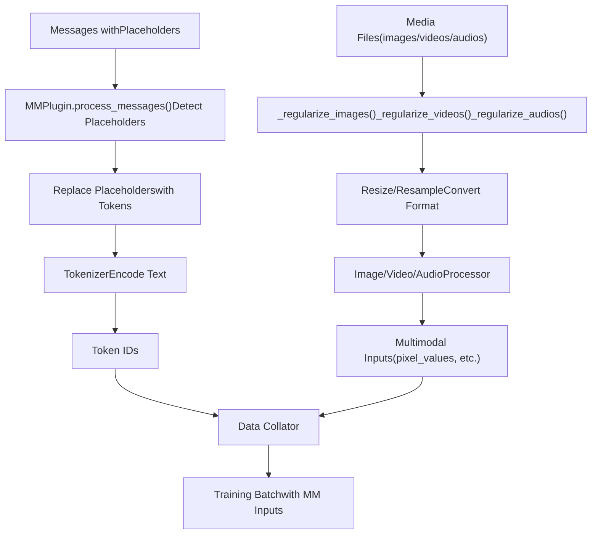
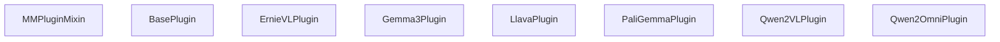
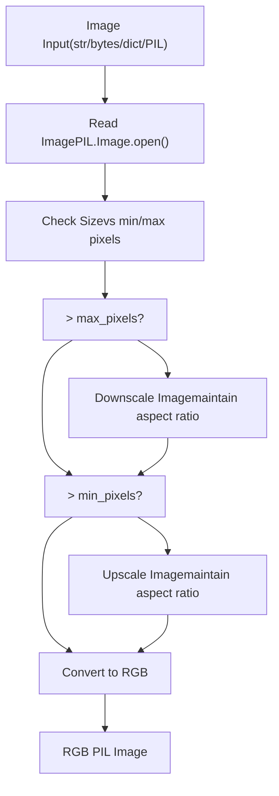
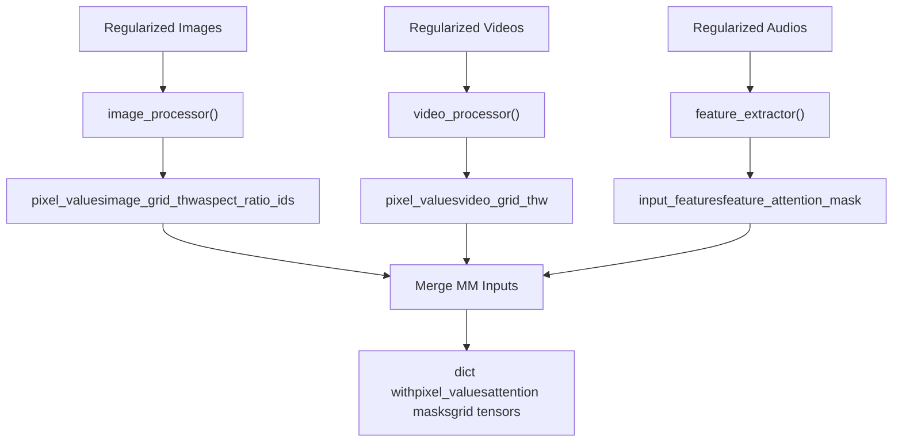

# Multimodal Data Processing

Relevant source files

-   [src/llamafactory/data/collator.py](https://github.com/hiyouga/LlamaFactory/blob/355d5c5e/src/llamafactory/data/collator.py)
-   [src/llamafactory/data/loader.py](https://github.com/hiyouga/LlamaFactory/blob/355d5c5e/src/llamafactory/data/loader.py)
-   [src/llamafactory/data/mm\_plugin.py](https://github.com/hiyouga/LlamaFactory/blob/355d5c5e/src/llamafactory/data/mm_plugin.py)
-   [src/llamafactory/data/parser.py](https://github.com/hiyouga/LlamaFactory/blob/355d5c5e/src/llamafactory/data/parser.py)
-   [src/llamafactory/data/template.py](https://github.com/hiyouga/LlamaFactory/blob/355d5c5e/src/llamafactory/data/template.py)
-   [src/llamafactory/extras/constants.py](https://github.com/hiyouga/LlamaFactory/blob/355d5c5e/src/llamafactory/extras/constants.py)
-   [src/llamafactory/hparams/data\_args.py](https://github.com/hiyouga/LlamaFactory/blob/355d5c5e/src/llamafactory/hparams/data_args.py)
-   [src/llamafactory/model/model\_utils/misc.py](https://github.com/hiyouga/LlamaFactory/blob/355d5c5e/src/llamafactory/model/model_utils/misc.py)
-   [src/llamafactory/model/model\_utils/visual.py](https://github.com/hiyouga/LlamaFactory/blob/355d5c5e/src/llamafactory/model/model_utils/visual.py)
-   [tests/data/test\_mm\_plugin.py](https://github.com/hiyouga/LlamaFactory/blob/355d5c5e/tests/data/test_mm_plugin.py)
-   [tests/version.txt](https://github.com/hiyouga/LlamaFactory/blob/355d5c5e/tests/version.txt)

## Purpose and Scope

This document explains how LlamaFactory processes multimodal data (images, videos, and audio) for vision-language models (VLMs), audio-language models, and other multimodal architectures. The multimodal processing system detects media placeholders in text, regularizes media files to appropriate formats and sizes, and generates model-specific inputs for training and inference.

For dataset format specifications that include multimodal data, see [Dataset Formats and Templates](/hiyouga/LlamaFactory/4.2-dataset-formats-and-templates). For model-specific configuration of vision towers and projectors, see [Model Patching and Special Configurations](/hiyouga/LlamaFactory/5.5-model-patching-and-special-configurations). For how multimodal data is batched during training, see [Data Collation and Batching](/hiyouga/LlamaFactory/4.4-data-collation-and-batching).

## System Overview


**Sources:** [src/llamafactory/data/mm\_plugin.py1-466](https://github.com/hiyouga/LlamaFactory/blob/355d5c5e/src/llamafactory/data/mm_plugin.py#L1-L466) [src/llamafactory/data/template.py40-57](https://github.com/hiyouga/LlamaFactory/blob/355d5c5e/src/llamafactory/data/template.py#L40-L57)

The multimodal processing system operates through a plugin-based architecture where each `BasePlugin` implementation handles the specific requirements of different model families. The processing occurs in three main stages: placeholder detection and replacement, media regularization, and multimodal input generation.

## Media Placeholders

LlamaFactory uses three environment-configurable placeholder tokens to mark locations where media content should be inserted:

| Placeholder | Default Token | Environment Variable | Usage |
| --- | --- | --- | --- |
| Image | `<image>` | `IMAGE_PLACEHOLDER` | Single image insertion |
| Video | `<video>` | `VIDEO_PLACEHOLDER` | Video or image sequence insertion |
| Audio | `<audio>` | `AUDIO_PLACEHOLDER` | Audio clip insertion |

**Sources:** [src/llamafactory/extras/constants.py24](https://github.com/hiyouga/LlamaFactory/blob/355d5c5e/src/llamafactory/extras/constants.py#L24-L24) [src/llamafactory/extras/constants.py52](https://github.com/hiyouga/LlamaFactory/blob/355d5c5e/src/llamafactory/extras/constants.py#L52-L52) [src/llamafactory/extras/constants.py105](https://github.com/hiyouga/LlamaFactory/blob/355d5c5e/src/llamafactory/extras/constants.py#L105-L105)

These placeholders appear in dataset messages and are replaced with model-specific tokens during processing. For example:

```
{  "role": "user",  "content": "<image>What is shown in this image?"}
```
The `MMPlugin` validates that the number of placeholders matches the number of provided media files:

**Sources:** [src/llamafactory/data/mm\_plugin.py192-219](https://github.com/hiyouga/LlamaFactory/blob/355d5c5e/src/llamafactory/data/mm_plugin.py#L192-L219)

## MMPlugin Architecture


**Sources:** [src/llamafactory/data/mm\_plugin.py145-466](https://github.com/hiyouga/LlamaFactory/blob/355d5c5e/src/llamafactory/data/mm_plugin.py#L145-L466)

### Core Plugin Methods

Each plugin implements three key methods:

1.  **`process_messages(messages, images, videos, audios, processor)`** - Pre-processes messages before tokenization, replacing placeholders with model-specific tokens
2.  **`process_token_ids(input_ids, labels, images, videos, audios, tokenizer, processor)`** - Post-processes token IDs after tokenization, potentially inserting image tokens
3.  **`get_mm_inputs(images, videos, audios, imglens, vidlens, audlens, batch_ids, processor)`** - Generates batched multimodal inputs (pixel values, attention masks, etc.)

**Sources:** [src/llamafactory/data/mm\_plugin.py413-466](https://github.com/hiyouga/LlamaFactory/blob/355d5c5e/src/llamafactory/data/mm_plugin.py#L413-L466)

### Plugin Registration

Plugins are registered with the template system using `get_mm_plugin()`:

```
register_template(    name="qwen2_vl",    mm_plugin=get_mm_plugin(        name="qwen2_vl",        image_token="<|image_pad|>",        video_token="<|video_pad|>",    ),)
```
**Sources:** [src/llamafactory/data/template.py465-536](https://github.com/hiyouga/LlamaFactory/blob/355d5c5e/src/llamafactory/data/template.py#L465-L536)

## Media Regularization

### Image Regularization

The `_regularize_images()` method processes images to ensure they meet model requirements:


**Sources:** [src/llamafactory/data/mm\_plugin.py221-271](https://github.com/hiyouga/LlamaFactory/blob/355d5c5e/src/llamafactory/data/mm_plugin.py#L221-L271)

Key features:

-   Accepts multiple input formats: file paths (str), binary streams, bytes, encoded dictionaries, or PIL Image objects
-   Resizes images based on `image_max_pixels` and `image_min_pixels` from processor config
-   Maintains aspect ratio during resizing
-   Converts all images to RGB mode

### Video Regularization

The `_regularize_videos()` method handles video processing with two input modes:

**Sources:** [src/llamafactory/data/mm\_plugin.py240-302](https://github.com/hiyouga/LlamaFactory/blob/355d5c5e/src/llamafactory/data/mm_plugin.py#L240-L302)

1.  **Nested Images Mode** - Video provided as a list of image objects (used for pre-extracted frames)
2.  **Video File Mode** - Video file processed using PyAV library

For video files, frame sampling is controlled by `_get_video_sample_indices()`:

```
sample_frames = max(1, floor(duration * video_fps))sample_frames = min(total_frames, video_maxlen, sample_frames)sample_indices = linspace(0, total_frames - 1, sample_frames)
```
**Sources:** [src/llamafactory/data/mm\_plugin.py240-250](https://github.com/hiyouga/LlamaFactory/blob/355d5c5e/src/llamafactory/data/mm_plugin.py#L240-L250)

Configuration parameters:

-   `video_fps` - Target frames per second for sampling (default: 2.0)
-   `video_maxlen` - Maximum number of frames (default: 128)
-   `video_max_pixels` / `video_min_pixels` - Size constraints per frame

### Audio Regularization

The `_regularize_audios()` method processes audio inputs:

**Sources:** [src/llamafactory/data/mm\_plugin.py304-323](https://github.com/hiyouga/LlamaFactory/blob/355d5c5e/src/llamafactory/data/mm_plugin.py#L304-L323)

Processing steps:

1.  Load audio using `torchaudio.load()`
2.  Convert stereo to mono if needed (average channels)
3.  Resample to target `sampling_rate` (default: 16000 Hz) using `torchaudio.functional.resample()`
4.  Convert to numpy array
5.  Return list of audio arrays with their sampling rates

## Model-Specific Plugins

### Gemma3Plugin

Handles Gemma 3's vision input format with pan-and-scan cropping:

**Sources:** [src/llamafactory/data/mm\_plugin.py520-577](https://github.com/hiyouga/LlamaFactory/blob/355d5c5e/src/llamafactory/data/mm_plugin.py#L520-L577)

Key features:

-   Replaces `<image>` with `<start_of_image><image_soft_token>*N<end_of_image>` where N depends on image resolution
-   Supports pan-and-scan cropping (`image_do_pan_and_scan=True`) which generates multiple crops per image
-   Generates `token_type_ids` to mark image token positions
-   Uses `_get_gemma3_token_type_ids()` to create token type array

### Qwen2VLPlugin

Processes images/videos for Qwen2-VL models with dynamic resolution:

**Sources:** [src/llamafactory/data/mm\_plugin.py768-874](https://github.com/hiyouga/LlamaFactory/blob/355d5c5e/src/llamafactory/data/mm_plugin.py#L768-L874)

Key features:

-   Replaces placeholders with `<|vision_start|><|image_pad|>*N<|vision_end|>` where N is computed from image dimensions
-   Computes `image_grid_thw` tensor containing (time, height, width) for each image/video
-   Uses patch-based processing with `merge_length` parameter
-   Handles both images and videos with unified vision token format

### PaliGemmaPlugin

Handles PaliGemma's unique prefix-based image encoding:

**Sources:** [src/llamafactory/data/mm\_plugin.py688-730](https://github.com/hiyouga/LlamaFactory/blob/355d5c5e/src/llamafactory/data/mm_plugin.py#L688-L730)

Key features:

-   Removes `<image>` placeholder from messages (images are always prefix)
-   Prepends image tokens to `input_ids` in `process_token_ids()`
-   Masks image token positions in labels (sets to `IGNORE_INDEX`)
-   Generates `token_type_ids` using `_get_paligemma_token_type_ids()` to distinguish image tokens (0) from text tokens (1)

### LlavaPlugin Family

Several plugins handle Llava-style models with varying image sequence lengths:

**Sources:** [src/llamafactory/data/mm\_plugin.py618-685](https://github.com/hiyouga/LlamaFactory/blob/355d5c5e/src/llamafactory/data/mm_plugin.py#L618-L685)

-   **LlavaPlugin** - Base Llava models, replaces `<image>` with repeated image tokens (typically 576 tokens)
-   **LlavaNextPlugin** - Llava 1.6+, dynamic image tokens based on resolution (e.g., 1176 tokens)
-   **LlavaNextVideoPlugin** - Video variant, processes video frames as images

All expand the `<image>` placeholder to multiple image tokens: `<image><image>...<image>`

### Qwen2OmniPlugin

Handles Qwen2.5-Omni models with both vision and audio:

**Sources:** [src/llamafactory/data/mm\_plugin.py876-956](https://github.com/hiyouga/LlamaFactory/blob/355d5c5e/src/llamafactory/data/mm_plugin.py#L876-L956)

Key features:

-   Processes both images and audio simultaneously
-   Replaces `<image>` with `<|vision_start|><|image_pad|>*N<|vision_end|>`
-   Replaces `<audio>` with `<audio><audio>...<audio>` (expanded audio tokens)
-   Generates both `image_grid_thw` for vision and audio tokens for speech

### MllamaPlugin

Handles Meta's Mllama (Llama 3.2 Vision) models:

**Sources:** [src/llamafactory/data/mm\_plugin.py594-617](https://github.com/hiyouga/LlamaFactory/blob/355d5c5e/src/llamafactory/data/mm_plugin.py#L594-L617)

Key features:

-   Replaces `<image>` with `<|image|>` (single token)
-   Generates complex cross-attention masks for vision-language interaction
-   Produces `aspect_ratio_ids`, `aspect_ratio_mask`, and `num_tiles` for multi-tile images
-   Cross-attention mask shape: `(batch_size, num_images, max_num_chunks, seq_len)`

## Multimodal Input Generation

The `_get_mm_inputs()` method generates model-ready tensors from regularized media:


**Sources:** [src/llamafactory/data/mm\_plugin.py325-409](https://github.com/hiyouga/LlamaFactory/blob/355d5c5e/src/llamafactory/data/mm_plugin.py#L325-L409)

### Common Output Formats

Different model architectures produce different tensor formats:

| Model Type | Key Tensors | Shape Description |
| --- | --- | --- |
| Llava, Llava-Next | `pixel_values` | `(B, C, H, W)` - Standard batch of images |
| Qwen2-VL, Qwen3-VL | `pixel_values`, `image_grid_thw` | Patches: `(num_patches, patch_dim)`, Grid: `(num_images, 3)` |
| Mllama | `pixel_values`, `aspect_ratio_ids`, `aspect_ratio_mask`, `num_tiles` | Tiled: `(B, max_images, max_tiles, C, H, W)` |
| PaliGemma | `pixel_values`, `token_type_ids` | Standard images + token type array |
| Gemma3 | `pixel_values`, `token_type_ids`, `num_crops` | With optional pan-and-scan crops |
| Qwen2-Omni | `pixel_values`, `image_grid_thw`, `input_features`, `feature_attention_mask` | Vision + audio features |

**Sources:** [src/llamafactory/data/mm\_plugin.py325-410](https://github.com/hiyouga/LlamaFactory/blob/355d5c5e/src/llamafactory/data/mm_plugin.py#L325-L410)

### Processor Configuration

The `processor` object (typically a `ProcessorMixin`) provides model-specific configuration:

**Sources:** [src/llamafactory/data/mm\_plugin.py85-93](https://github.com/hiyouga/LlamaFactory/blob/355d5c5e/src/llamafactory/data/mm_plugin.py#L85-L93)

Common processor attributes:

-   `image_max_pixels`, `image_min_pixels` - Size constraints for images
-   `video_max_pixels`, `video_min_pixels` - Size constraints for video frames
-   `video_fps` - Frame sampling rate
-   `video_maxlen` - Maximum frames per video
-   `audio_sampling_rate` - Target audio sample rate
-   `patch_size`, `image_seq_length` - Tokenization parameters

## Integration with Data Collator

The `MultiModalDataCollatorForSeq2Seq` integrates multimodal inputs into training batches:

**Sources:** [src/llamafactory/data/collator.py84-241](https://github.com/hiyouga/LlamaFactory/blob/355d5c5e/src/llamafactory/data/collator.py#L84-L241)

### Collation Process

1.  **Media Extraction** - Extract images/videos/audios from each feature, count lengths per sample
2.  **Fake Inputs Handling** - For distributed training (Zero3/FSDP), generate fake multimodal inputs when batch has no media to avoid process hanging
3.  **MM Input Generation** - Call `mm_plugin.get_mm_inputs()` with batched media
4.  **Text Collation** - Use base `DataCollatorForSeq2Seq` to pad text sequences
5.  **Tensor Merging** - Combine text tensors with multimodal tensors
6.  **Special Processing** - Generate `position_ids` and `rope_deltas` for models using multi-dimensional RoPE (Qwen2-VL, Qwen3-VL, GLM4V, etc.)

**Sources:** [src/llamafactory/data/collator.py108-241](https://github.com/hiyouga/LlamaFactory/blob/355d5c5e/src/llamafactory/data/collator.py#L108-L241)

### MRope (Multimodal Rotary Position Embedding)

Models like Qwen2-VL require 3D position embeddings for multimodal content:

**Sources:** [src/llamafactory/data/collator.py185-226](https://github.com/hiyouga/LlamaFactory/blob/355d5c5e/src/llamafactory/data/collator.py#L185-L226)

The collator calls `model.get_rope_index()` with:

-   `input_ids` - Token IDs
-   `image_grid_thw` - Image grid dimensions
-   `video_grid_thw` - Video grid dimensions
-   `attention_mask` - Sequence attention mask
-   `second_per_grid_ts` or `video_second_per_grid` - Temporal information for videos

This generates:

-   `position_ids` - 3D position tensor `(batch_size, 3, seq_len)` for (temporal, height, width)
-   `rope_deltas` - Adjustment values for position embedding computation

## Validation and Error Handling

The plugin system includes comprehensive validation:

### Input Validation

**Sources:** [src/llamafactory/data/mm\_plugin.py152-191](https://github.com/hiyouga/LlamaFactory/blob/355d5c5e/src/llamafactory/data/mm_plugin.py#L152-L191)

`_validate_input()` checks:

-   Model supports image input if images provided (`image_token` is not None)
-   Model supports video input if videos provided (`video_token` is not None)
-   Model supports audio input if audios provided (`audio_token` is not None)
-   Processor exists and has required components (image\_processor, video\_processor, feature\_extractor)

### Message Validation

**Sources:** [src/llamafactory/data/mm\_plugin.py192-219](https://github.com/hiyouga/LlamaFactory/blob/355d5c5e/src/llamafactory/data/mm_plugin.py#L192-L219)

`_validate_messages()` verifies:

-   Number of `<image>` placeholders matches length of images list
-   Number of `<video>` placeholders matches length of videos list
-   Number of `<audio>` placeholders matches length of audios list

## Supported Model Architectures

The following multimodal models are registered in the system:

**Sources:** [src/llamafactory/model/model\_utils/visual.py202-386](https://github.com/hiyouga/LlamaFactory/blob/355d5c5e/src/llamafactory/model/model_utils/visual.py#L202-L386) [src/llamafactory/extras/constants.py155-169](https://github.com/hiyouga/LlamaFactory/blob/355d5c5e/src/llamafactory/extras/constants.py#L155-L169)

| Model Type | Vision Tower Keys | Projector Key | Special Features |
| --- | --- | --- | --- |
| `dots_ocr` | `vision_tower` | `vision_tower.merger` | OCR-specific |
| `gemma3` | `vision_tower` | `multi_modal_projector` | Pan-and-scan cropping |
| `gemma3n` | `vision_tower`, `audio_tower` | `multi_modal_projector` | Vision + audio |
| `glm4v` | `visual.patch_embed`, `visual.blocks` | `visual.merger` | Qwen2-VL style |
| `internvl` | `vision_tower` | `multi_modal_projector` | InternViT encoder |
| `llama4` | `vision_model` | `multi_modal_projector` | Multi-tile images |
| `llava`, `llava_next` | `vision_tower` | `multi_modal_projector` | Standard VLM |
| `llava_next_video` | `vision_tower` | `multi_modal_projector` | Video frames |
| `minicpmv` | `vpm` | `resampler` | Efficient resampler |
| `minicpmo` | `vpm`, `apm`, `tts` | `resampler` | Omni-modal |
| `mllama` | `vision_model` | `multi_modal_projector` | Cross-attention |
| `paligemma` | `vision_tower` | `multi_modal_projector` | Prefix images |
| `qwen2_audio` | `audio_tower` | `multi_modal_projector` | Audio-only |
| `qwen2_vl`, `qwen2_5_vl`, `qwen3_vl` | `visual.patch_embed`, `visual.blocks` | `visual.merger` | Dynamic resolution, MRope |
| `qwen2_5_omni_thinker`, `qwen3_omni_moe_thinker` | `visual.*`, `audio_tower` | `visual.merger` | Vision + audio + reasoning |

Models are registered with `multimodal=True` flag when calling `register_model_group()` which adds them to `MULTIMODAL_SUPPORTED_MODELS` set.

## Performance Considerations

### Memory Optimization

-   **Lazy Loading** - Media files are read just before processing, not at dataset construction
-   **Streaming Support** - Works with dataset streaming mode for large-scale training
-   **Resolution Limits** - `image_max_pixels` prevents extremely large images from consuming excessive memory
-   **Video Sampling** - `video_maxlen` and `video_fps` control frame count to limit memory

### Preprocessing Efficiency

-   **Batch Processing** - `preprocessing_batch_size` parameter controls batch size during dataset mapping
-   **Multiprocessing** - `preprocessing_num_workers` enables parallel preprocessing
-   **Caching** - Processed datasets can be cached to disk via `tokenized_path`

**Sources:** [src/llamafactory/data/loader.py229-273](https://github.com/hiyouga/LlamaFactory/blob/355d5c5e/src/llamafactory/data/loader.py#L229-L273) [src/llamafactory/hparams/data\_args.py78-85](https://github.com/hiyouga/LlamaFactory/blob/355d5c5e/src/llamafactory/hparams/data_args.py#L78-L85)

## Example: Complete Processing Flow

Here's how a sample with one image flows through the system:

> **[Mermaid sequence]**
> *(图表结构无法解析)*

**Sources:** [src/llamafactory/data/processor.py](https://github.com/hiyouga/LlamaFactory/blob/355d5c5e/src/llamafactory/data/processor.py) [src/llamafactory/data/mm\_plugin.py413-466](https://github.com/hiyouga/LlamaFactory/blob/355d5c5e/src/llamafactory/data/mm_plugin.py#L413-L466) [src/llamafactory/data/collator.py108-241](https://github.com/hiyouga/LlamaFactory/blob/355d5c5e/src/llamafactory/data/collator.py#L108-L241)
