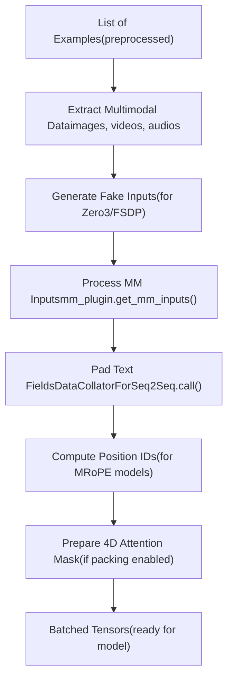
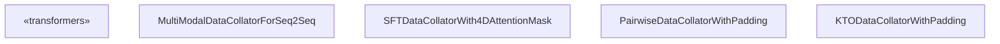
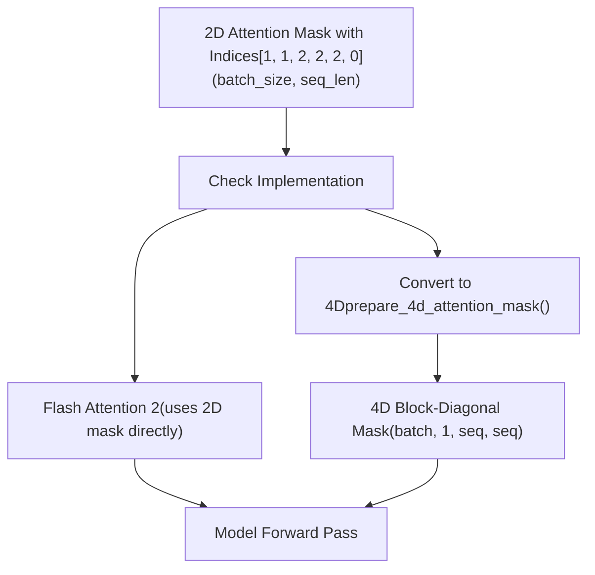
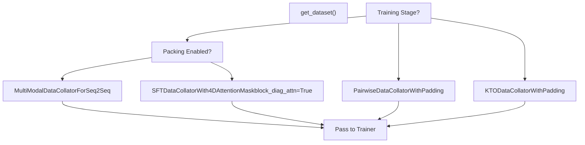

# Data Collation and Batching

Relevant source files

-   [src/llamafactory/data/collator.py](https://github.com/hiyouga/LlamaFactory/blob/355d5c5e/src/llamafactory/data/collator.py)
-   [src/llamafactory/data/loader.py](https://github.com/hiyouga/LlamaFactory/blob/355d5c5e/src/llamafactory/data/loader.py)
-   [src/llamafactory/data/mm\_plugin.py](https://github.com/hiyouga/LlamaFactory/blob/355d5c5e/src/llamafactory/data/mm_plugin.py)
-   [src/llamafactory/data/parser.py](https://github.com/hiyouga/LlamaFactory/blob/355d5c5e/src/llamafactory/data/parser.py)
-   [src/llamafactory/data/template.py](https://github.com/hiyouga/LlamaFactory/blob/355d5c5e/src/llamafactory/data/template.py)
-   [src/llamafactory/extras/constants.py](https://github.com/hiyouga/LlamaFactory/blob/355d5c5e/src/llamafactory/extras/constants.py)
-   [src/llamafactory/hparams/data\_args.py](https://github.com/hiyouga/LlamaFactory/blob/355d5c5e/src/llamafactory/hparams/data_args.py)
-   [src/llamafactory/model/model\_utils/misc.py](https://github.com/hiyouga/LlamaFactory/blob/355d5c5e/src/llamafactory/model/model_utils/misc.py)
-   [src/llamafactory/model/model\_utils/visual.py](https://github.com/hiyouga/LlamaFactory/blob/355d5c5e/src/llamafactory/model/model_utils/visual.py)
-   [tests/data/test\_mm\_plugin.py](https://github.com/hiyouga/LlamaFactory/blob/355d5c5e/tests/data/test_mm_plugin.py)
-   [tests/version.txt](https://github.com/hiyouga/LlamaFactory/blob/355d5c5e/tests/version.txt)

## Purpose and Scope

Data collation is the final stage of the data pipeline that transforms preprocessed individual examples into batched tensors ready for training. This document covers the collator implementations, sequence packing with block-diagonal attention masks, multimodal input batching, and padding strategies.

For information about data loading and preprocessing before collation, see [Dataset Loading and Sources](/hiyouga/LlamaFactory/4.1-dataset-loading-and-sources) and [Multimodal Data Processing](/hiyouga/LlamaFactory/4.3-multimodal-data-processing). For information about dataset formats and tokenization, see [Dataset Formats and Templates](/hiyouga/LlamaFactory/4.2-dataset-formats-and-templates).

---

## Collation Pipeline Overview

The collation process transforms a list of preprocessed examples into a dictionary of batched tensors. The pipeline handles:

1.  **Standard text fields** (`input_ids`, `labels`, `attention_mask`)
2.  **Multimodal inputs** (images, videos, audios)
3.  **Special model requirements** (position IDs, RoPE deltas, token type IDs)
4.  **Sequence packing** (optional, with block-diagonal attention)


**Pipeline Flow**

| Stage | Input | Output | Key Operations |
| --- | --- | --- | --- |
| Extract MM Data | List of dicts with `images`, `videos`, `audios` | Flat lists: `batch_images`, `batch_videos`, `batch_audios` | Extract and flatten multimodal data |
| Fake Inputs | Empty MM lists (Zero3/FSDP case) | Fake inputs to prevent hanging | Generate dummy image/audio to avoid process hanging |
| MM Processing | Flat MM lists + processor | `pixel_values`, `image_grid_thw`, etc. | Call processor, regularize media |
| Padding | Token lists | Padded tensors: `input_ids`, `labels`, `attention_mask` | Apply DataCollatorForSeq2Seq |
| Position IDs | `input_ids` + `image_grid_thw` | `position_ids`, `rope_deltas` | Compute for MRoPE models (Qwen2-VL, etc.) |
| 4D Attention | 2D attention mask with indices | 4D attention mask (batch, 1, seq, seq) | Convert to block-diagonal form |

Sources: [src/llamafactory/data/collator.py108-241](https://github.com/hiyouga/LlamaFactory/blob/355d5c5e/src/llamafactory/data/collator.py#L108-L241)

---

## Core Collator Classes

### MultiModalDataCollatorForSeq2Seq

The base collator that extends Transformers' `DataCollatorForSeq2Seq` to support multimodal inputs. It handles images, videos, and audios alongside text.


**Key Responsibilities:**

1.  **Extract multimodal data** from features
2.  **Handle distributed training edge cases** (fake inputs for Zero3/FSDP)
3.  **Process multimodal inputs** via `mm_plugin.get_mm_inputs()`
4.  **Compute position IDs** for MRoPE models (Qwen2-VL, GLM-4V, etc.)
5.  **Pad cross-attention masks** for Mllama

Sources: [src/llamafactory/data/collator.py84-242](https://github.com/hiyouga/LlamaFactory/blob/355d5c5e/src/llamafactory/data/collator.py#L84-L242)

#### Multimodal Data Extraction

```
# From features list, extract and flatten multimodal databatch_images, batch_videos, batch_audios = [], [], []batch_imglens, batch_vidlens, batch_audlens, batch_input_ids = [], [], [], [] for feature in features:    images = feature.pop("images", None) or []    videos = feature.pop("videos", None) or []    audios = feature.pop("audios", None) or []    batch_images.extend(images)         # Flatten: [[img1], [img2]] -> [img1, img2]    batch_videos.extend(videos)    batch_audios.extend(audios)    batch_imglens.append(len(images))   # Track count per sample: [1, 0, 2]    batch_vidlens.append(len(videos))    batch_audlens.append(len(audios))    batch_input_ids.append(feature["input_ids"])
```
The collator extracts multimodal data from each feature and maintains length lists (`imglens`, `vidlens`, `audlens`) to track how many images/videos/audios belong to each sample.

Sources: [src/llamafactory/data/collator.py108-122](https://github.com/hiyouga/LlamaFactory/blob/355d5c5e/src/llamafactory/data/collator.py#L108-L122)

#### Fake Inputs for Distributed Training

When using DeepSpeed Zero3 or FSDP, if a batch contains no images or audios, the process can hang because the processor is not called. The collator generates fake inputs to prevent this:

```
if self.template.mm_plugin.image_token is not None and sum(batch_imglens) == 0:    # Generate fake image to avoid hanging in Zero3/FSDP    fake_messages = [{"role": "user", "content": IMAGE_PLACEHOLDER}]    fake_images = [Image.new("RGB", (64, 64), (255, 255, 255))]    # Process fake messages and append fake token IDs    # ... (append to first sample)    batch_images = fake_images    batch_imglens[0] = 1
```
The fake inputs are appended to the first sample with `IGNORE_INDEX` labels so they don't affect training loss.

Sources: [src/llamafactory/data/collator.py123-167](https://github.com/hiyouga/LlamaFactory/blob/355d5c5e/src/llamafactory/data/collator.py#L123-L167)

#### MRoPE Position ID Computation

For models using Multi-dimensional RoPE (MRoPE) like Qwen2-VL, GLM-4V, Qwen3-VL, the collator computes 3D position IDs:

```
if self.get_rope_func is not None:    rope_index_kwargs = {        "input_ids": features["input_ids"],        "image_grid_thw": mm_inputs.get("image_grid_thw"),        "video_grid_thw": mm_inputs.get("video_grid_thw"),        "attention_mask": (features["attention_mask"] >= 1).float(),    }    features["position_ids"], features["rope_deltas"] = self.get_rope_func(**rope_index_kwargs)
```
The `get_rope_func` is extracted from the model in `__post_init__()` and computes position IDs based on the temporal, height, and width dimensions of images/videos.

Sources: [src/llamafactory/data/collator.py101-106](https://github.com/hiyouga/LlamaFactory/blob/355d5c5e/src/llamafactory/data/collator.py#L101-L106) [src/llamafactory/data/collator.py185-226](https://github.com/hiyouga/LlamaFactory/blob/355d5c5e/src/llamafactory/data/collator.py#L185-L226)

### SFTDataCollatorWith4DAttentionMask

Extends `MultiModalDataCollatorForSeq2Seq` to support 4D attention masks for sequence packing. When `block_diag_attn=True` and attention implementation is not Flash Attention 2, it converts 2D attention masks to 4D block-diagonal form.

**Configuration:**

-   `block_diag_attn`: Enable block-diagonal attention (default: False)
-   `attn_implementation`: Attention backend ("eager", "sdpa", "flash\_attention\_2")
-   `compute_dtype`: Data type for computation (e.g., torch.float32, torch.bfloat16)

Sources: [src/llamafactory/data/collator.py244-262](https://github.com/hiyouga/LlamaFactory/blob/355d5c5e/src/llamafactory/data/collator.py#L244-L262)

### PairwiseDataCollatorWithPadding

Used for preference learning algorithms (DPO, ORPO, SimPO) that require paired chosen/rejected responses. It duplicates features to create 2n examples where the first n are chosen and the last n are rejected.

```
# Input features contain both chosen and rejected fields# Output: [chosen_0, chosen_1, ..., rejected_0, rejected_1, ...]concatenated_features = []for key in ("chosen", "rejected"):    for feature in features:        target_feature = {            "input_ids": feature[f"{key}_input_ids"],            "attention_mask": feature[f"{key}_attention_mask"],            "labels": feature[f"{key}_labels"],            "images": feature["images"],  # Shared multimodal data            "videos": feature["videos"],            "audios": feature["audios"],        }        concatenated_features.append(target_feature)
```
Sources: [src/llamafactory/data/collator.py264-288](https://github.com/hiyouga/LlamaFactory/blob/355d5c5e/src/llamafactory/data/collator.py#L264-L288)

### KTODataCollatorWithPadding

Used for KTO (Kahneman-Tversky Optimization) training, which requires both target completions and KL reference completions. It creates separate batches for target and KL inputs, then combines them.

**Output structure:**

-   Standard fields: `input_ids`, `labels`, `attention_mask`
-   KL fields: `kl_input_ids`, `kl_labels`, `kl_attention_mask`
-   Tags: `kto_tags` (indicating desirable/undesirable)

Sources: [src/llamafactory/data/collator.py290-332](https://github.com/hiyouga/LlamaFactory/blob/355d5c5e/src/llamafactory/data/collator.py#L290-L332)

---

## Sequence Packing with Block-Diagonal Attention

Sequence packing concatenates multiple examples into a single sequence to improve GPU utilization. To prevent attention leakage between examples, a 4D block-diagonal attention mask is used.

### 4D Attention Mask Format


The 2D attention mask uses **indices** to indicate which example each token belongs to:

-   `0`: Padding token
-   `1`: First example
-   `2`: Second example
-   `3`: Third example, etc.

The `prepare_4d_attention_mask` function converts this to a 4D block-diagonal matrix where:

-   Tokens can attend to other tokens in the **same example** (same index)
-   Tokens **cannot** attend to tokens in different examples
-   Lower triangular form prevents future peeking

Sources: [src/llamafactory/data/collator.py41-82](https://github.com/hiyouga/LlamaFactory/blob/355d5c5e/src/llamafactory/data/collator.py#L41-L82)

### Conversion Example

**Input 2D mask (with indices):**

```
[[1, 1, 2, 2, 2, 0]]
```
**Output 4D mask (after conversion):**

```
[
    [
        [
            [0.0,    -inf,   -inf,   -inf,   -inf,   -inf],
            [0.0,    0.0,    -inf,   -inf,   -inf,   -inf],
            [-inf,   -inf,   0.0,    -inf,   -inf,   -inf],
            [-inf,   -inf,   0.0,    0.0,    -inf,   -inf],
            [-inf,   -inf,   0.0,    0.0,    0.0,    -inf],
            [-inf,   -inf,   -inf,   -inf,   -inf,   -inf],
        ]
    ]
]
```
Where:

-   `0.0` = can attend
-   `-inf` (min\_dtype) = cannot attend
-   Each example forms a triangular block on the diagonal

Sources: [src/llamafactory/data/collator.py41-82](https://github.com/hiyouga/LlamaFactory/blob/355d5c5e/src/llamafactory/data/collator.py#L41-L82)

### Flash Attention 2 Optimization

Flash Attention 2 supports packed sequences natively and can work with 2D attention masks directly. The collator skips 4D conversion when `attn_implementation="flash_attention_2"`:

```
if self.block_diag_attn and self.attn_implementation != "flash_attention_2":    features["attention_mask"] = prepare_4d_attention_mask(        features["attention_mask"],         self.compute_dtype    )
```
Sources: [src/llamafactory/data/collator.py254-255](https://github.com/hiyouga/LlamaFactory/blob/355d5c5e/src/llamafactory/data/collator.py#L254-L255)

### Configuration

Sequence packing is configured via `DataArguments`:

| Parameter | Type | Default | Description |
| --- | --- | --- | --- |
| `packing` | bool | None | Enable sequence packing (auto-enabled for pre-training) |
| `neat_packing` | bool | False | Enable packing without cross-attention (sets `packing=True`) |
| `cutoff_len` | int | 2048 | Max sequence length (reduced by 1 when packing enabled) |

When `packing=True`, the `cutoff_len` is reduced by 1 to avoid `pad_to_multiple_of` issues.

Sources: [src/llamafactory/hparams/data\_args.py106-113](https://github.com/hiyouga/LlamaFactory/blob/355d5c5e/src/llamafactory/hparams/data_args.py#L106-L113) [src/llamafactory/hparams/data\_args.py179-184](https://github.com/hiyouga/LlamaFactory/blob/355d5c5e/src/llamafactory/hparams/data_args.py#L179-L184)

---

## Multimodal Input Integration

### MM Plugin Integration

The collator uses the template's `mm_plugin` to process multimodal inputs:

```
mm_inputs = self.template.mm_plugin.get_mm_inputs(    batch_images,      # Flat list of all images    batch_videos,      # Flat list of all videos    batch_audios,      # Flat list of all audios    batch_imglens,     # [1, 0, 2] - images per sample    batch_vidlens,     # [0, 1, 0] - videos per sample    batch_audlens,     # [0, 0, 1] - audios per sample    batch_input_ids,   # For computing token type IDs    self.processor,)
```
The plugin returns a dictionary of tensors that get merged into the final batch:

-   **Image models**: `pixel_values`
-   **Qwen2-VL**: `pixel_values`, `image_grid_thw`, `video_grid_thw`
-   **Mllama**: `pixel_values`, `aspect_ratio_ids`, `aspect_ratio_mask`, `cross_attention_mask`
-   **PaliGemma/Gemma3**: `token_type_ids`
-   **Audio models**: `input_features`, `feature_attention_mask`

Sources: [src/llamafactory/data/collator.py168-177](https://github.com/hiyouga/LlamaFactory/blob/355d5c5e/src/llamafactory/data/collator.py#L168-L177)

### Token Type IDs

Some models (PaliGemma, Gemma3) require token type IDs to distinguish image tokens from text tokens for proper loss masking:

**PaliGemma:**

```
def _get_paligemma_token_type_ids(imglens, seqlens, processor):    batch_token_type_ids = []    for imglen, seqlen in zip(imglens, seqlens):        image_seqlen = imglen * processor.image_seq_length        # 0 for image tokens, 1 for text tokens        batch_token_type_ids.append([0] * image_seqlen + [1] * (seqlen - image_seqlen))    return batch_token_type_ids
```
**Gemma3:**

```
def _get_gemma3_token_type_ids(batch_ids, processor):    image_token_id = processor.image_token_id    batch_token_type_ids = []    for token_ids in batch_ids:        token_type_ids = np.zeros_like(token_ids)        token_type_ids[token_ids == image_token_id] = 1  # 1 for image tokens        batch_token_type_ids.append(token_type_ids.tolist())    return batch_token_type_ids
```
These token type IDs are used by the model to:

1.  **Mask loss computation** - only compute loss on text tokens
2.  **Apply different embeddings** - image vs text embeddings
3.  **Control attention patterns** - in some architectures

Sources: [src/llamafactory/data/mm\_plugin.py95-128](https://github.com/hiyouga/LlamaFactory/blob/355d5c5e/src/llamafactory/data/mm_plugin.py#L95-L128) [src/llamafactory/data/collator.py178-182](https://github.com/hiyouga/LlamaFactory/blob/355d5c5e/src/llamafactory/data/collator.py#L178-L182)

### Cross-Attention Mask Padding

For Mllama models, the `cross_attention_mask` may need padding when `pad_to_multiple_of` is enabled:

```
if "cross_attention_mask" in mm_inputs:    cross_attention_mask = mm_inputs.pop("cross_attention_mask")    seq_len = features["input_ids"].size(1)    orig_len = cross_attention_mask.size(1)    # Pad to match padded input_ids length    mm_inputs["cross_attention_mask"] = F.pad(        cross_attention_mask,         (0, 0, 0, 0, 0, seq_len - orig_len)    )
```
Sources: [src/llamafactory/data/collator.py228-233](https://github.com/hiyouga/LlamaFactory/blob/355d5c5e/src/llamafactory/data/collator.py#L228-L233)

---

## Padding Strategies

The collator inherits padding behavior from Transformers' `DataCollatorForSeq2Seq`, with additional multimodal considerations.

### Standard Padding

| Field | Padding Value | Notes |
| --- | --- | --- |
| `input_ids` | `tokenizer.pad_token_id` | Usually 0 or specific pad token |
| `labels` | `IGNORE_INDEX` (-100) | Excluded from loss computation |
| `attention_mask` | 0 | Indicates padding positions |

### Padding Side

The padding side is controlled by `tokenizer.padding_side`:

-   **Right padding** (default): Pads to the right of sequences
-   **Left padding**: Pads to the left (useful for generation)

When fake inputs are added, they respect the padding side:

```
if self.tokenizer.padding_side == "right":    features[0]["input_ids"] = features[0]["input_ids"] + fake_input_ids    features[0]["attention_mask"] = features[0]["attention_mask"] + [0] * len(fake_input_ids)    features[0]["labels"] = features[0]["labels"] + [IGNORE_INDEX] * len(fake_input_ids)else:  # left padding    features[0]["input_ids"] = fake_input_ids + features[0]["input_ids"]    features[0]["attention_mask"] = [0] * len(fake_input_ids) + features[0]["attention_mask"]    features[0]["labels"] = [IGNORE_INDEX] * len(fake_input_ids) + features[0]["labels"]
```
Sources: [src/llamafactory/data/collator.py156-165](https://github.com/hiyouga/LlamaFactory/blob/355d5c5e/src/llamafactory/data/collator.py#L156-L165)

### Multimodal Padding Considerations

Multimodal tensors are typically **not padded** by the collator since they are already in a batch-ready format from the processor:

-   `pixel_values`: Shape depends on model (e.g., `(B, C, H, W)` for LLaVA, `(num_patches, patch_dim)` for Qwen2-VL)
-   `image_grid_thw`: Variable number of images per sample, but each entry is fixed size
-   Audio features: May have attention masks indicating valid frames

The processor handles any necessary padding/resizing of visual inputs before they reach the collator.

---

## Output Batch Structure

The final output from the collator is a dictionary of tensors ready for the model's forward pass:

### Standard Fields (Always Present)

| Key | Shape | Description |
| --- | --- | --- |
| `input_ids` | `(batch_size, seq_len)` | Padded token IDs |
| `attention_mask` | `(batch_size, seq_len)` or `(batch_size, 1, seq_len, seq_len)` | 2D or 4D attention mask |
| `labels` | `(batch_size, seq_len)` | Target token IDs with padding masked |

### Model-Specific Fields (Conditional)

| Key | Present When | Shape | Description |
| --- | --- | --- | --- |
| `pixel_values` | Images/videos present | Model-dependent | Image pixel values |
| `image_grid_thw` | Qwen2-VL/Qwen3-VL | `(num_images, 3)` | Time, height, width grid |
| `position_ids` | MRoPE models | `(batch_size, 3, seq_len)` | 3D position IDs |
| `rope_deltas` | MRoPE models | `(batch_size, 1)` | RoPE delta values |
| `token_type_ids` | PaliGemma/Gemma3 | `(batch_size, seq_len)` | Image vs text tokens |
| `cross_attention_mask` | Mllama | `(batch_size, seq_len, num_images, num_tiles)` | Cross-attention mask |
| `feature_attention_mask` | Audio models | `(batch_size, num_features)` | Valid audio frames |
| `aspect_ratio_ids` | Mllama | `(batch_size, max_num_images)` | Aspect ratio IDs |
| `aspect_ratio_mask` | Mllama | `(batch_size, max_num_images, max_tiles)` | Aspect ratio mask |

### Special Cases

**MiniCPM-V:** Returns a nested structure:

```
{    "data": {        "input_ids": ...,        "labels": ...,        "image_bound": ...,        "position_ids": ...,  # Sequential position IDs        ...    },    "input_ids": ...,  # Duplicated for trainer compatibility    "labels": ...,}
```
Sources: [src/llamafactory/data/collator.py236-241](https://github.com/hiyouga/LlamaFactory/blob/355d5c5e/src/llamafactory/data/collator.py#L236-L241)

---

## Collator Selection and Creation

The appropriate collator is selected based on training stage and configuration:


All collators receive:

-   `tokenizer`: For padding configuration
-   `model`: For extracting RoPE functions
-   `template`: For multimodal plugin
-   `processor`: For processing images/videos/audios
-   `pad_to_multiple_of`: For efficient hardware utilization

For `SFTDataCollatorWith4DAttentionMask`, additional parameters:

-   `block_diag_attn`: Set to `data_args.neat_packing`
-   `attn_implementation`: From model config
-   `compute_dtype`: From model args

Sources: [src/llamafactory/data/loader.py276-336](https://github.com/hiyouga/LlamaFactory/blob/355d5c5e/src/llamafactory/data/loader.py#L276-L336) [src/llamafactory/train/sft/workflow.py70-80](https://github.com/hiyouga/LlamaFactory/blob/355d5c5e/src/llamafactory/train/sft/workflow.py#L70-L80) (not provided but inferred from structure)
