# Model Loading and Configuration

Relevant source files

-   [src/llamafactory/extras/env.py](https://github.com/hiyouga/LlamaFactory/blob/355d5c5e/src/llamafactory/extras/env.py)
-   [src/llamafactory/extras/packages.py](https://github.com/hiyouga/LlamaFactory/blob/355d5c5e/src/llamafactory/extras/packages.py)
-   [src/llamafactory/hparams/model\_args.py](https://github.com/hiyouga/LlamaFactory/blob/355d5c5e/src/llamafactory/hparams/model_args.py)
-   [src/llamafactory/model/adapter.py](https://github.com/hiyouga/LlamaFactory/blob/355d5c5e/src/llamafactory/model/adapter.py)
-   [src/llamafactory/model/loader.py](https://github.com/hiyouga/LlamaFactory/blob/355d5c5e/src/llamafactory/model/loader.py)
-   [src/llamafactory/model/model\_utils/attention.py](https://github.com/hiyouga/LlamaFactory/blob/355d5c5e/src/llamafactory/model/model_utils/attention.py)
-   [src/llamafactory/model/model\_utils/liger\_kernel.py](https://github.com/hiyouga/LlamaFactory/blob/355d5c5e/src/llamafactory/model/model_utils/liger_kernel.py)
-   [src/llamafactory/model/model\_utils/moe.py](https://github.com/hiyouga/LlamaFactory/blob/355d5c5e/src/llamafactory/model/model_utils/moe.py)
-   [src/llamafactory/model/model\_utils/unsloth.py](https://github.com/hiyouga/LlamaFactory/blob/355d5c5e/src/llamafactory/model/model_utils/unsloth.py)
-   [src/llamafactory/model/model\_utils/valuehead.py](https://github.com/hiyouga/LlamaFactory/blob/355d5c5e/src/llamafactory/model/model_utils/valuehead.py)
-   [src/llamafactory/model/patcher.py](https://github.com/hiyouga/LlamaFactory/blob/355d5c5e/src/llamafactory/model/patcher.py)
-   [src/llamafactory/train/callbacks.py](https://github.com/hiyouga/LlamaFactory/blob/355d5c5e/src/llamafactory/train/callbacks.py)

This document describes the model loading and configuration system in LlamaFactory. It covers the complete pipeline from loading pretrained models from various hubs through configuration patching, adapter initialization, quantization setup, and attention mechanism configuration. The system is designed to support 100+ model architectures with flexible adapter methods, quantization options, and optimization techniques.

For information about training-specific configurations, see [Training System](/hiyouga/LlamaFactory/6-training-system). For inference engine backends, see [Inference Engines](/hiyouga/LlamaFactory/7.1-inference-engines). For dataset and data processing configuration, see [Data Pipeline](/hiyouga/LlamaFactory/4-data-pipeline).

---

## System Architecture

The model loading system follows a sequential pipeline that transforms a model from its pretrained state into a training- or inference-ready state. The following diagram shows the high-level flow:

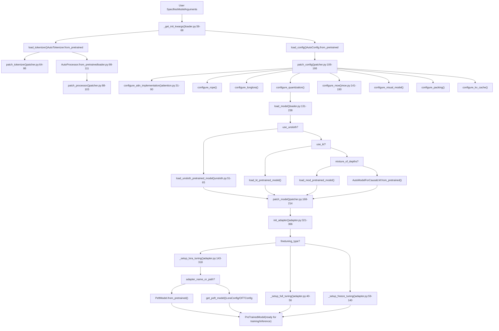
**Sources:** [src/llamafactory/model/loader.py131-238](https://github.com/hiyouga/LlamaFactory/blob/355d5c5e/src/llamafactory/model/loader.py#L131-L238) [src/llamafactory/model/patcher.py106-214](https://github.com/hiyouga/LlamaFactory/blob/355d5c5e/src/llamafactory/model/patcher.py#L106-L214) [src/llamafactory/model/adapter.py321-366](https://github.com/hiyouga/LlamaFactory/blob/355d5c5e/src/llamafactory/model/adapter.py#L321-L366)

---

## Core Components

### TokenizerModule and Model Arguments

The system uses a centralized `ModelArguments` class that aggregates all model-related configuration:

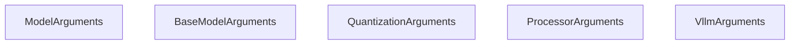
**Sources:** [src/llamafactory/hparams/model\_args.py510-572](https://github.com/hiyouga/LlamaFactory/blob/355d5c5e/src/llamafactory/hparams/model_args.py#L510-L572)

The `load_tokenizer()` function returns a `TokenizerModule` TypedDict:

| Field | Type | Description |
| --- | --- | --- |
| `tokenizer` | `PreTrainedTokenizer` | Main tokenizer loaded from `AutoTokenizer` |
| `processor` | `ProcessorMixin | None` | Optional processor for multimodal models |

**Sources:** [src/llamafactory/model/loader.py51-122](https://github.com/hiyouga/LlamaFactory/blob/355d5c5e/src/llamafactory/model/loader.py#L51-L122)

---

## Model Loading Pipeline

### Hub Selection and Model Retrieval

The system supports loading models from three hubs via `_get_init_kwargs()` and `try_download_model_from_other_hub()`:

| Hub | Environment Variable | Token Argument | Priority |
| --- | --- | --- | --- |
| Hugging Face | `USE_MODELSCOPE_HUB!=1` | `hf_hub_token` | Default |
| ModelScope | `USE_MODELSCOPE_HUB=1` | `ms_hub_token` | China region |
| OpenMind | Custom logic | `om_hub_token` | Fallback |

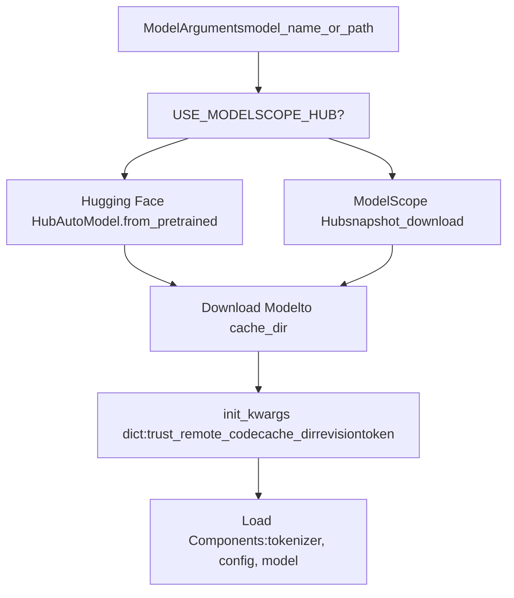
**Sources:** [src/llamafactory/model/loader.py56-68](https://github.com/hiyouga/LlamaFactory/blob/355d5c5e/src/llamafactory/model/loader.py#L56-L68) [src/llamafactory/extras/misc.py](https://github.com/hiyouga/LlamaFactory/blob/355d5c5e/src/llamafactory/extras/misc.py#LNaN-LNaN)

### Tokenizer and Processor Loading

The `load_tokenizer()` function performs the following steps:

1.  **Load tokenizer** with fallback logic (fast → slow):

    ```
    # loader.py:78-93try:    tokenizer = AutoTokenizer.from_pretrained(        model_args.model_name_or_path,        use_fast=model_args.use_fast_tokenizer,        split_special_tokens=model_args.split_special_tokens,        padding_side="right",        **init_kwargs,    )except ValueError:  # Try alternate tokenizer type    tokenizer = AutoTokenizer.from_pretrained(        model_args.model_name_or_path,        use_fast=not model_args.use_fast_tokenizer,        padding_side="right",        **init_kwargs,    )
    ```

2.  **Patch tokenizer** via `patch_tokenizer()`:

    -   Restore `_pad` method if overridden [patcher.py65-66](https://github.com/hiyouga/LlamaFactory/blob/355d5c5e/patcher.py#L65-L66)
    -   Extend `model_max_length` if needed [patcher.py68-69](https://github.com/hiyouga/LlamaFactory/blob/355d5c5e/patcher.py#L68-L69)
    -   Add custom tokens [patcher.py71-76](https://github.com/hiyouga/LlamaFactory/blob/355d5c5e/patcher.py#L71-L76)
    -   Add special tokens with optional semantic initialization [patcher.py78-85](https://github.com/hiyouga/LlamaFactory/blob/355d5c5e/patcher.py#L78-L85)
3.  **Load processor** for multimodal models:

    -   Try `AutoProcessor.from_pretrained()` [loader.py98-108](https://github.com/hiyouga/LlamaFactory/blob/355d5c5e/loader.py#L98-L108)
    -   Validate it's a real processor [loader.py115-117](https://github.com/hiyouga/LlamaFactory/blob/355d5c5e/loader.py#L115-L117)
    -   Patch with image/video/audio settings [patcher.py88-103](https://github.com/hiyouga/LlamaFactory/blob/355d5c5e/patcher.py#L88-L103)

**Sources:** [src/llamafactory/model/loader.py71-122](https://github.com/hiyouga/LlamaFactory/blob/355d5c5e/src/llamafactory/model/loader.py#L71-L122) [src/llamafactory/model/patcher.py64-103](https://github.com/hiyouga/LlamaFactory/blob/355d5c5e/src/llamafactory/model/patcher.py#L64-L103)

### Configuration Loading and Patching

The `patch_config()` function orchestrates all configuration modifications:

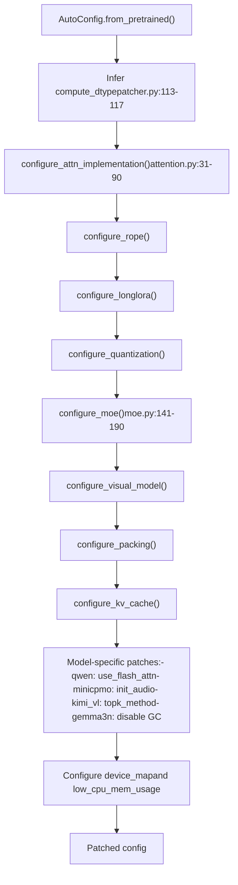
**Sources:** [src/llamafactory/model/patcher.py106-166](https://github.com/hiyouga/LlamaFactory/blob/355d5c5e/src/llamafactory/model/patcher.py#L106-L166)

---

## Attention Configuration

The `configure_attn_implementation()` function selects the attention mechanism based on `model_args.flash_attn`:

| `flash_attn` Value | Implementation | Requirements | Notes |
| --- | --- | --- | --- |
| `AttentionFunction.AUTO` | Auto-select | None | Default behavior |
| `AttentionFunction.DISABLED` | `eager` | None | Standard PyTorch attention |
| `AttentionFunction.SDPA` | `sdpa` | torch >= 2.1.1 | Scaled dot-product attention |
| `AttentionFunction.FA2` | `flash_attention_2` | flash-attn-2 or NPU | FlashAttention-2 |
| `AttentionFunction.FA3` | Custom kernel | GPT-OSS model | FlashAttention-3 with attention sink |

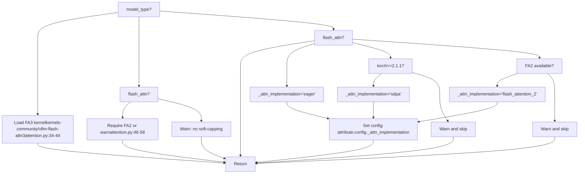
**Special Cases:**

-   **InternLM2**: Uses `config.attn_implementation` instead of `config._attn_implementation` [attention.py83-84](https://github.com/hiyouga/LlamaFactory/blob/355d5c5e/attention.py#L83-L84)
-   **Kimi-VL**: Sets attention for both vision and text configs [attention.py85-87](https://github.com/hiyouga/LlamaFactory/blob/355d5c5e/attention.py#L85-L87)
-   **Gemma2**: Requires FA2 for soft-capping attention [attention.py46-58](https://github.com/hiyouga/LlamaFactory/blob/355d5c5e/attention.py#L46-L58)

**Sources:** [src/llamafactory/model/model\_utils/attention.py31-104](https://github.com/hiyouga/LlamaFactory/blob/355d5c5e/src/llamafactory/model/model_utils/attention.py#L31-L104)

---

## Quantization System

### Quantization Configuration

The system supports multiple quantization methods via `configure_quantization()`:

| Method | Bits | Library | Use Case |
| --- | --- | --- | --- |
| `QuantizationMethod.BNB` | 4, 8 | BitsAndBytes | Training with QLoRA |
| `QuantizationMethod.HQQ` | 2, 4, 8 | HQQ | Inference optimization |
| `QuantizationMethod.EETQ` | 8 | EETQ | Inference optimization |
| `QuantizationMethod.GGUF` | Various | llama.cpp | Specialized inference |
| `QuantizationMethod.GPTQ` | 2-8 | AutoGPTQ | Pre-quantized models |
| `QuantizationMethod.AWQ` | 4 | AutoAWQ | Pre-quantized models |
| `QuantizationMethod.AQLM` | 1-2 | AQLM | Extreme compression |

**Quantization Device Map:**

-   `quantization_device_map="auto"` requires `bitsandbytes >= 0.43.0`
-   Allows distributing quantized models across multiple GPUs
-   Only works with BitsAndBytes quantization

**BitsAndBytes Configuration:**

```
# Generated in configure_quantization()BitsAndBytesConfig(    load_in_4bit=(quantization_bit == 4),    load_in_8bit=(quantization_bit == 8),    llm_int8_threshold=6.0,    llm_int8_has_fp16_weight=False,    bnb_4bit_compute_dtype=compute_dtype,    bnb_4bit_use_double_quant=double_quantization,    bnb_4bit_quant_type=quantization_type,  # "nf4" or "fp4"    bnb_4bit_quant_storage=compute_dtype,)
```
**Sources:** [src/llamafactory/model/model\_utils/quantization.py](https://github.com/hiyouga/LlamaFactory/blob/355d5c5e/src/llamafactory/model/model_utils/quantization.py) [src/llamafactory/hparams/model\_args.py278-300](https://github.com/hiyouga/LlamaFactory/blob/355d5c5e/src/llamafactory/hparams/model_args.py#L278-L300)

### Compute Dtype Selection

The `compute_dtype` is inferred in `patch_config()` with the following priority:

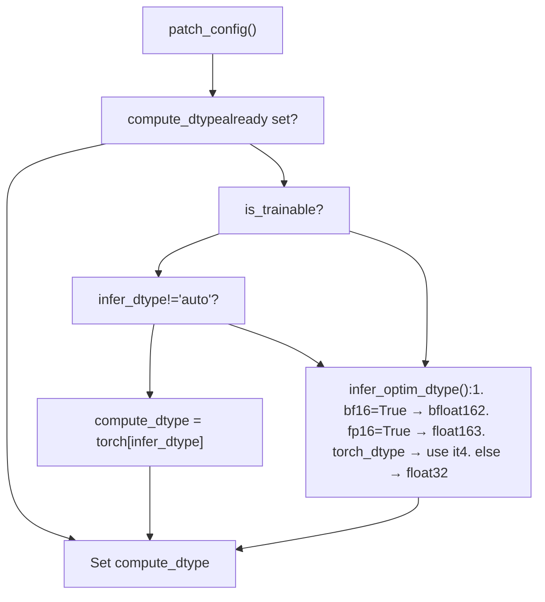
**Sources:** [src/llamafactory/model/patcher.py113-117](https://github.com/hiyouga/LlamaFactory/blob/355d5c5e/src/llamafactory/model/patcher.py#L113-L117) [src/llamafactory/extras/misc.py](https://github.com/hiyouga/LlamaFactory/blob/355d5c5e/src/llamafactory/extras/misc.py#LNaN-LNaN)

---

## Adapter System

### Adapter Types and Setup

The `init_adapter()` function branches based on `finetuning_args.finetuning_type`:

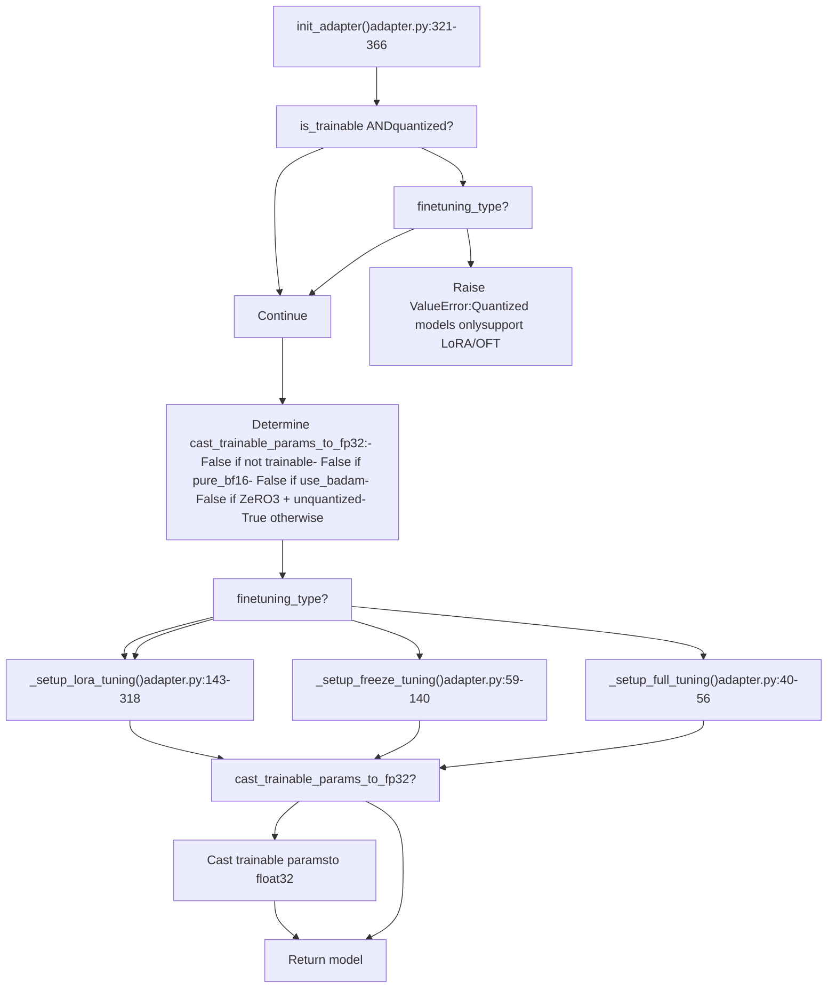
**Sources:** [src/llamafactory/model/adapter.py321-366](https://github.com/hiyouga/LlamaFactory/blob/355d5c5e/src/llamafactory/model/adapter.py#L321-L366)

### Full Tuning

`_setup_full_tuning()` sets all parameters as trainable except forbidden modules:

```
# adapter.py:40-56def _setup_full_tuning(model, finetuning_args, is_trainable, cast_trainable_params_to_fp32):    if not is_trainable:        return        logger.info_rank0("Fine-tuning method: Full")    forbidden_modules = get_forbidden_modules(model.config, finetuning_args)    for name, param in model.named_parameters():        if not any(forbidden_module in name for forbidden_module in forbidden_modules):            if cast_trainable_params_to_fp32:                param.data = param.data.to(torch.float32)        else:            param.requires_grad_(False)
```
**Forbidden Modules:**

-   Vision encoders (if `freeze_vision_tower=True`)
-   Audio encoders (if `freeze_audio_encoder=True`)
-   Model-specific projectors (if `freeze_multi_modal_projector=True`)

**Sources:** [src/llamafactory/model/adapter.py40-56](https://github.com/hiyouga/LlamaFactory/blob/355d5c5e/src/llamafactory/model/adapter.py#L40-L56) [src/llamafactory/model/model\_utils/visual.py](https://github.com/hiyouga/LlamaFactory/blob/355d5c5e/src/llamafactory/model/model_utils/visual.py#LNaN-LNaN)

### Freeze Tuning

`_setup_freeze_tuning()` enables selective layer training:

**Layer Selection Logic:**

| Scenario | `freeze_trainable_layers` | Trainable Layers |
| --- | --- | --- |
| LLaMA-Pro | Must divide `num_layers` evenly | Every `stride`\-th layer |
| Fine-tune last N | Positive value | Last N layers |
| Fine-tune first N | Negative value | First N layers |

**Module Selection:**

-   `freeze_trainable_modules`: List of module names within each trainable layer (e.g., `["self_attn", "mlp"]`)
-   Use `"all"` to train all modules in selected layers
-   `freeze_extra_modules`: Additional non-layer modules to train (e.g., `["embed_tokens", "lm_head"]`)

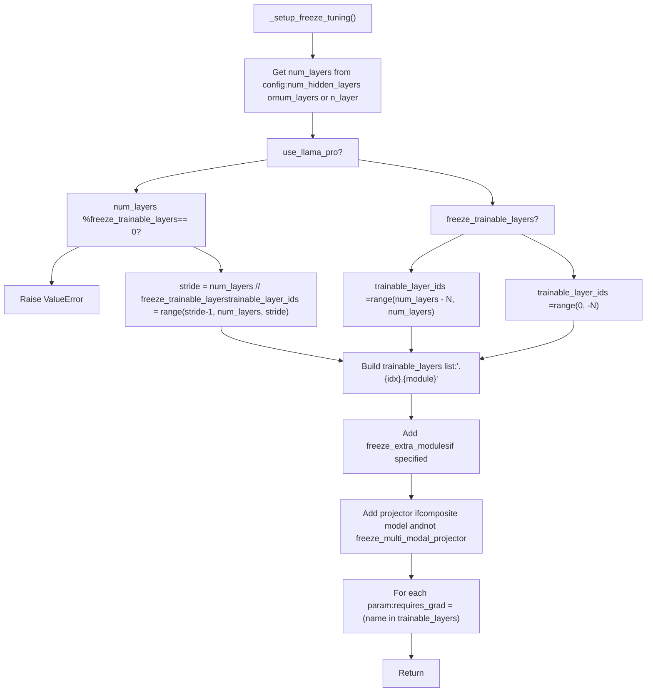
**Sources:** [src/llamafactory/model/adapter.py59-140](https://github.com/hiyouga/LlamaFactory/blob/355d5c5e/src/llamafactory/model/adapter.py#L59-L140)

### LoRA and OFT Tuning

`_setup_lora_tuning()` is the most complex adapter setup:

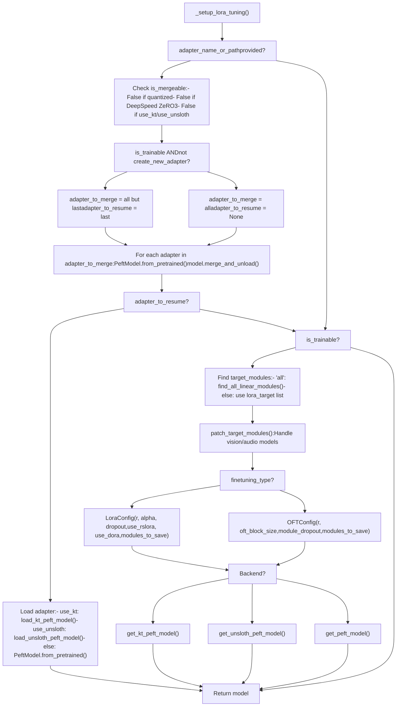
**LoRA Configuration Parameters:**

| Parameter | Default | Description |
| --- | --- | --- |
| `lora_rank` | 8 | Rank of LoRA matrices |
| `lora_alpha` | 16 | Scaling factor (effective lr multiplier) |
| `lora_dropout` | 0.0 | Dropout rate for LoRA layers |
| `use_rslora` | False | Use Rank-Stabilized LoRA |
| `use_dora` | False | Use DoRA (Weight-Decomposed LoRA) |
| `lora_target` | `["all"]` | Target modules (or "all" for auto-detection) |
| `additional_target` | None | Extra modules to save (e.g., embeddings) |

**OFT Configuration Parameters:**

| Parameter | Default | Description |
| --- | --- | --- |
| `oft_rank` | 8 | Rank of orthogonal transformation |
| `oft_block_size` | 4 | Block size for OFT |
| `module_dropout` | 0.0 | Dropout rate for OFT modules |

**PiSSA Initialization:**

-   Set `pissa_init=True` to use PiSSA initialization
-   `pissa_iter=-1`: Use default PiSSA
-   `pissa_iter=N`: Use PiSSA with N FSVD steps

**Sources:** [src/llamafactory/model/adapter.py143-318](https://github.com/hiyouga/LlamaFactory/blob/355d5c5e/src/llamafactory/model/adapter.py#L143-L318) [src/llamafactory/hparams/finetuning\_args.py](https://github.com/hiyouga/LlamaFactory/blob/355d5c5e/src/llamafactory/hparams/finetuning_args.py#LNaN-LNaN)

---

## Model Patching

### Base Model Patching

The `patch_model()` function applies model-level modifications:

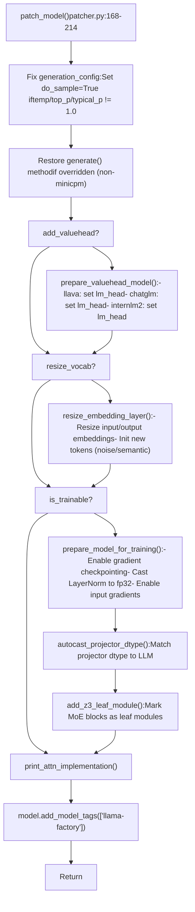
**Sources:** [src/llamafactory/model/patcher.py168-214](https://github.com/hiyouga/LlamaFactory/blob/355d5c5e/src/llamafactory/model/patcher.py#L168-L214)

### MoE Configuration

The `configure_moe()` function enables auxiliary loss for Mixture-of-Experts models:

**Supported MoE Architectures:**

| Model Type | Config Field | Loss Coefficient Field |
| --- | --- | --- |
| dbrx, mixtral, jamba | `output_router_logits` | `router_aux_loss_coef` |
| deepseek | \- | `aux_loss_alpha` |
| jetmoe | `output_router_logits` | `aux_loss_coef` |
| qwen2\_moe, qwen3\_moe | `output_router_logits` | `router_aux_loss_coef` |
| ernie4\_5\_moe, phimoe | `output_router_logits` | `router_aux_loss_coef` |
| granitemoe, olmoe, llama4 | `output_router_logits` | `router_aux_loss_coef` |

**DeepSpeed Zero3 Leaf Modules:**

For proper partitioning under DeepSpeed Zero3, specific MoE blocks are marked as leaf modules:

```
# moe.py:43-138def add_z3_leaf_module(model):    if not is_deepspeed_zero3_enabled():        return        model_type = getattr(model.config, "model_type", None)        if model_type == "mixtral":        from transformers.models.mixtral.modeling_mixtral import MixtralSparseMoeBlock        _set_z3_leaf_modules(model, [MixtralSparseMoeBlock])        elif model_type == "deepseek_v2":        _set_z3_leaf_modules(model, ["DeepseekV2MoE"])        # ... (similar for other MoE models)
```
**Sources:** [src/llamafactory/model/model\_utils/moe.py36-190](https://github.com/hiyouga/LlamaFactory/blob/355d5c5e/src/llamafactory/model/model_utils/moe.py#L36-L190)

### Visual Model Configuration

The `configure_visual_model()` function handles multimodal model setup:

**Composite Model Registry:**

| Model Type | Projector Key | Freeze by Default |
| --- | --- | --- |
| llava | `multi_modal_projector` | Configurable |
| llava\_next | `multi_modal_projector` | Configurable |
| paligemma | `multi_modal_projector` | Configurable |
| video\_llava | `multi_modal_projector` | Configurable |
| qwen2\_vl | `visual` | Configurable |
| minicpmv | `resampler` | Configurable |
| glm4v | `vision_projection` | Configurable |
| cogvlm2 | `vpm` | Configurable |

**Forbidden Module Logic:**

1.  If `freeze_vision_tower=True`, add vision encoder to forbidden modules
2.  If `freeze_multi_modal_projector=True`, add projector to forbidden modules
3.  These modules will have `requires_grad=False` set

**Sources:** [src/llamafactory/model/model\_utils/visual.py](https://github.com/hiyouga/LlamaFactory/blob/355d5c5e/src/llamafactory/model/model_utils/visual.py#LNaN-LNaN) [src/llamafactory/model/model\_utils/visual.py](https://github.com/hiyouga/LlamaFactory/blob/355d5c5e/src/llamafactory/model/model_utils/visual.py#LNaN-LNaN)

---

## Special Optimizations

### Unsloth Integration

Unsloth provides optimized training for LoRA:

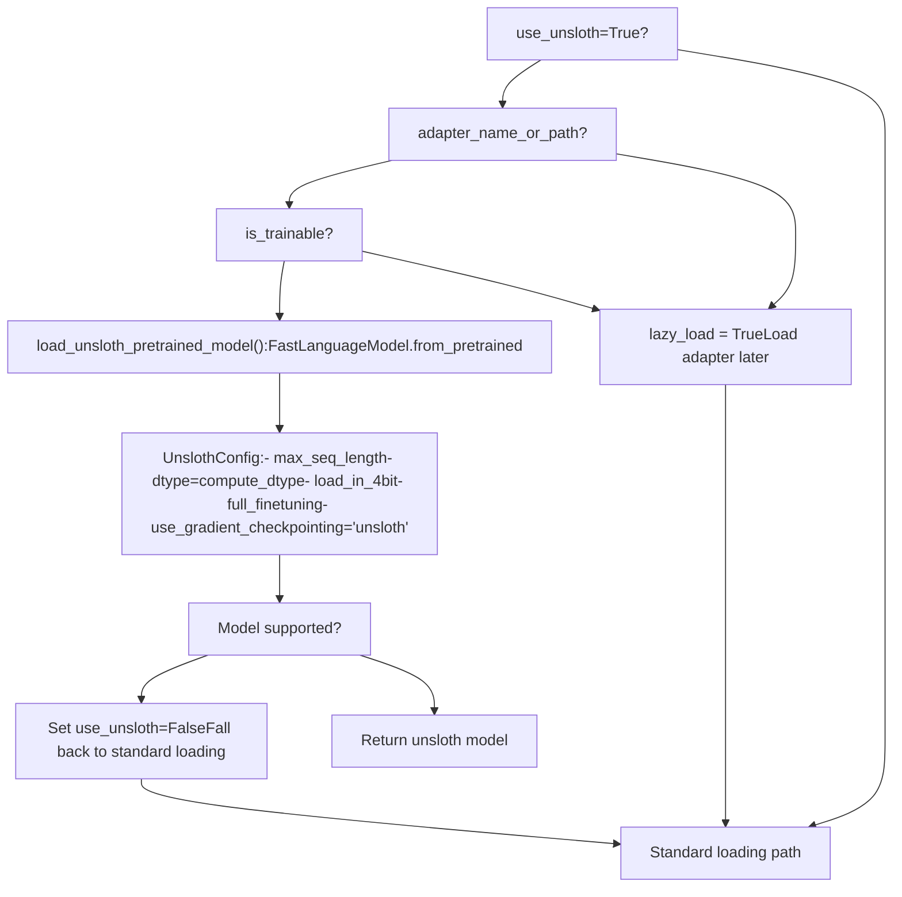
**Unsloth LoRA Setup:**

```
# unsloth.py:68-79def get_unsloth_peft_model(model, model_args, peft_kwargs):    from unsloth import FastLanguageModel        unsloth_peft_kwargs = {        "model": model,        "max_seq_length": model_args.model_max_length,        "use_gradient_checkpointing": "unsloth",    }    return FastLanguageModel.get_peft_model(**peft_kwargs, **unsloth_peft_kwargs)
```
**Sources:** [src/llamafactory/model/model\_utils/unsloth.py51-103](https://github.com/hiyouga/LlamaFactory/blob/355d5c5e/src/llamafactory/model/model_utils/unsloth.py#L51-L103) [src/llamafactory/model/adapter.py286-290](https://github.com/hiyouga/LlamaFactory/blob/355d5c5e/src/llamafactory/model/adapter.py#L286-L290)

### KTransformers Support

KTransformers enables CPU-GPU hybrid inference for large models:

```
# Model loading with KTransformersif model_args.use_kt:    from ktransformers.sft.monkey_patch_torch_module import install_patch    install_patch()    model = load_kt_pretrained_model(config, model_args)
```
**KTransformers LoRA Adjustments:**

```
# adapter.py:220-228if model_args.use_kt:    new_list = []    for m in target_modules:        if m in ("down_proj", "up_proj", "gate_proj"):            # KT requires prefixed MLP module names            new_list.extend([f"mlp.{m}", f"shared_experts.{m}"])        elif m not in ("generate_linear", "orig_module", "prefill_linear"):            new_list.append(m)        target_modules[:] = new_list
```
**Sources:** [src/llamafactory/model/loader.py146-150](https://github.com/hiyouga/LlamaFactory/blob/355d5c5e/src/llamafactory/model/loader.py#L146-L150) [src/llamafactory/model/adapter.py220-228](https://github.com/hiyouga/LlamaFactory/blob/355d5c5e/src/llamafactory/model/adapter.py#L220-L228)

### Liger Kernel

The `apply_liger_kernel()` function applies memory-efficient kernel implementations:

**Supported Models:**

| Model Family | Kernel Module |
| --- | --- |
| Llama, Mistral, Mixtral | `apply_liger_kernel_to_llama` |
| Gemma (1/2/3) | `apply_liger_kernel_to_gemma*` |
| Qwen (2/3) | `apply_liger_kernel_to_qwen*` |
| Phi3 | `apply_liger_kernel_to_phi3` |
| GLM4 | `apply_liger_kernel_to_glm4` |
| Granite, OLMo2 | Model-specific kernels |

**Kernel Selection Logic:**

```
# liger_kernel.py:30-97def apply_liger_kernel(config, model_args, is_trainable, require_logits):    if not is_trainable or not model_args.enable_liger_kernel:        return        model_type = getattr(config, "model_type", None)        # Import appropriate kernel based on model_type    if model_type == "llama":        from liger_kernel.transformers import apply_liger_kernel_to_llama as apply_liger_kernel    # ... (other model types)        # Disable fused cross-entropy for stages requiring logits (RM, DPO, etc.)    if require_logits and "fused_linear_cross_entropy" in inspect.signature(apply_liger_kernel).parameters:        kwargs = {"fused_linear_cross_entropy": False, "cross_entropy": True}    else:        kwargs = {}        apply_liger_kernel(**kwargs)
```
**Sources:** [src/llamafactory/model/model\_utils/liger\_kernel.py30-97](https://github.com/hiyouga/LlamaFactory/blob/355d5c5e/src/llamafactory/model/model_utils/liger_kernel.py#L30-L97)

---

## Summary

The model loading and configuration system provides:

1.  **Unified hub support** for Hugging Face, ModelScope, and OpenMind
2.  **Flexible adapter system** supporting full, freeze, LoRA, and OFT tuning
3.  **Multiple quantization backends** (BitsAndBytes, GPTQ, AWQ, etc.)
4.  **Attention optimizations** (FlashAttention-2/3, SDPA)
5.  **MoE-aware training** with proper DeepSpeed Zero3 integration
6.  **Multimodal support** with vision/audio encoder freezing
7.  **Special optimization backends** (Unsloth, KTransformers, Liger)

The system validates configurations early (e.g., quantization only with LoRA/OFT), applies model-specific patches automatically, and provides extensive logging for debugging. All configuration flows through `ModelArguments`, which is split into logical sub-dataclasses for maintainability.
