# Model Loading Pipeline

Relevant source files

-   [src/llamafactory/\_\_init\_\_.py](https://github.com/hiyouga/LlamaFactory/blob/355d5c5e/src/llamafactory/__init__.py)
-   [src/llamafactory/extras/misc.py](https://github.com/hiyouga/LlamaFactory/blob/355d5c5e/src/llamafactory/extras/misc.py)
-   [src/llamafactory/hparams/model\_args.py](https://github.com/hiyouga/LlamaFactory/blob/355d5c5e/src/llamafactory/hparams/model_args.py)
-   [src/llamafactory/model/adapter.py](https://github.com/hiyouga/LlamaFactory/blob/355d5c5e/src/llamafactory/model/adapter.py)
-   [src/llamafactory/model/loader.py](https://github.com/hiyouga/LlamaFactory/blob/355d5c5e/src/llamafactory/model/loader.py)
-   [src/llamafactory/model/model\_utils/longlora.py](https://github.com/hiyouga/LlamaFactory/blob/355d5c5e/src/llamafactory/model/model_utils/longlora.py)
-   [src/llamafactory/model/model\_utils/packing.py](https://github.com/hiyouga/LlamaFactory/blob/355d5c5e/src/llamafactory/model/model_utils/packing.py)
-   [src/llamafactory/model/model\_utils/unsloth.py](https://github.com/hiyouga/LlamaFactory/blob/355d5c5e/src/llamafactory/model/model_utils/unsloth.py)
-   [src/llamafactory/model/patcher.py](https://github.com/hiyouga/LlamaFactory/blob/355d5c5e/src/llamafactory/model/patcher.py)

## Purpose and Scope

This document describes the model loading pipeline in LlamaFactory, which transforms model identifiers and configuration arguments into fully initialized, trainable or inference-ready models. The pipeline handles hub selection, model downloading, configuration patching, quantization setup, and adapter initialization.

For information about specific adapter types (LoRA, QLoRA, OFT) and their configurations, see [Adapter System (LoRA/QLoRA/OFT)](/hiyouga/LlamaFactory/5.2-adapter-system-(loraqloraoft)). For quantization methods and precision modes, see [Quantization and Precision](/hiyouga/LlamaFactory/5.3-quantization-and-precision). For attention mechanism configurations, see [Attention Mechanisms and Optimizations](/hiyouga/LlamaFactory/5.4-attention-mechanisms-and-optimizations). For model-specific patches and configurations, see [Model Patching and Special Configurations](/hiyouga/LlamaFactory/5.5-model-patching-and-special-configurations).

---

## High-Level Pipeline Overview

The model loading pipeline consists of six main stages executed sequentially:

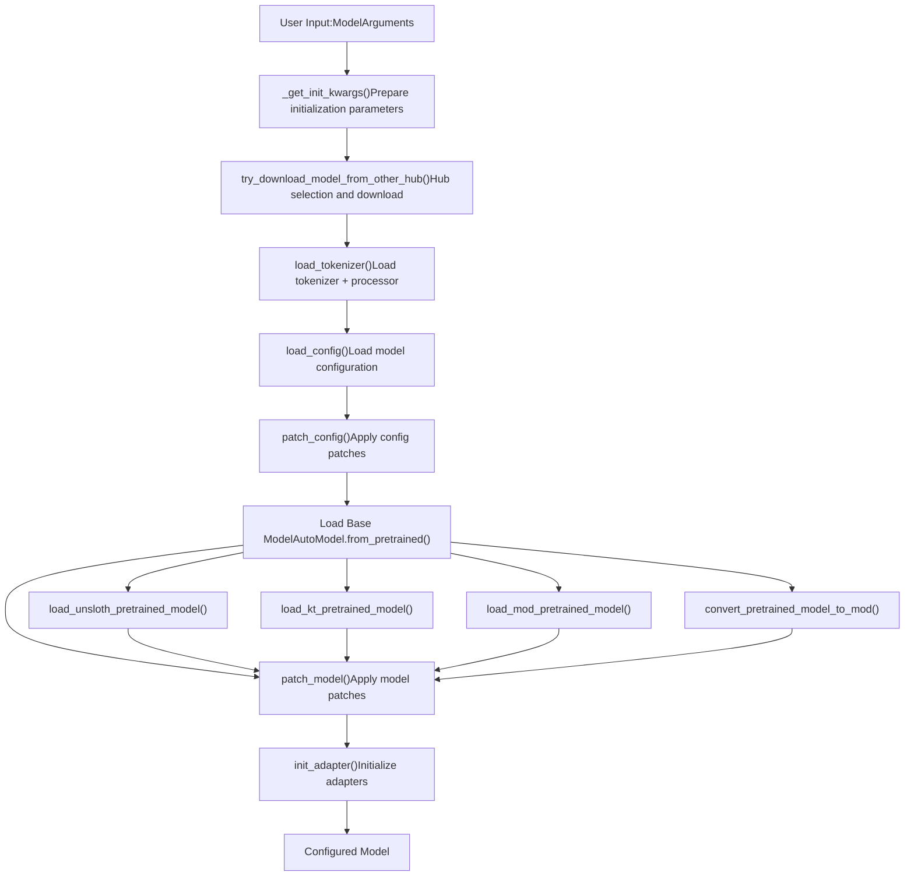
**Sources:** [src/llamafactory/model/loader.py56-238](https://github.com/hiyouga/LlamaFactory/blob/355d5c5e/src/llamafactory/model/loader.py#L56-L238)

---

## Initialization Arguments Preparation

### Function: `_get_init_kwargs()`

The `_get_init_kwargs()` function prepares the standard initialization parameters used across all loading operations. It performs hub-specific model path resolution and returns a dictionary of common arguments.

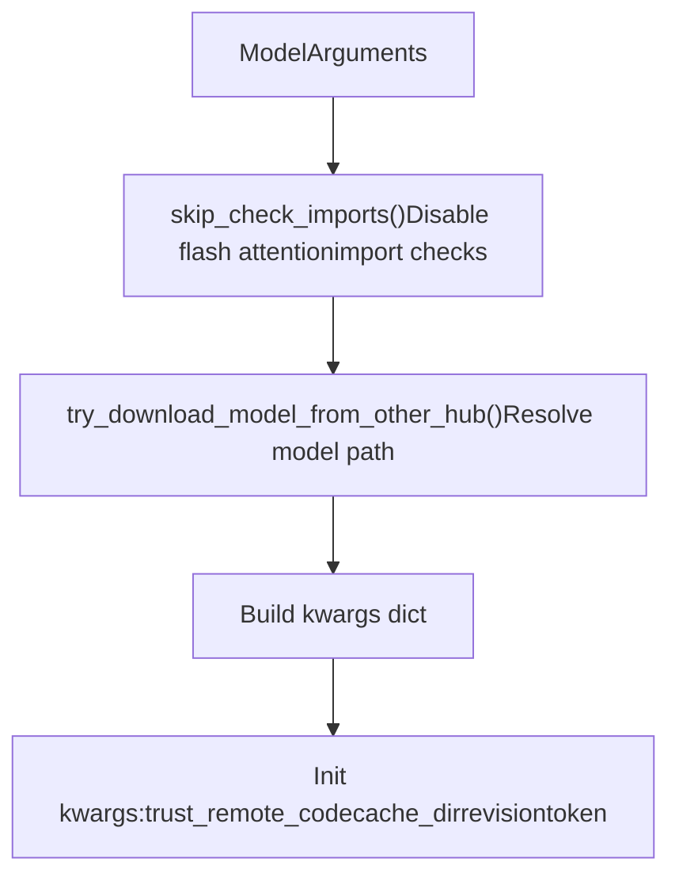
**Key Parameters:**

| Parameter | Source | Description |
| --- | --- | --- |
| `trust_remote_code` | `model_args.trust_remote_code` | Whether to execute custom model code |
| `cache_dir` | `model_args.cache_dir` | Directory for cached downloads |
| `revision` | `model_args.model_revision` | Git branch/tag/commit to use |
| `token` | `model_args.hf_hub_token` | HuggingFace Hub authentication token |

**Sources:** [src/llamafactory/model/loader.py56-68](https://github.com/hiyouga/LlamaFactory/blob/355d5c5e/src/llamafactory/model/loader.py#L56-L68) [src/llamafactory/extras/misc.py248-251](https://github.com/hiyouga/LlamaFactory/blob/355d5c5e/src/llamafactory/extras/misc.py#L248-L251)

---

## Hub Selection and Model Download

### Function: `try_download_model_from_other_hub()`

LlamaFactory supports three model hubs: HuggingFace, ModelScope (China), and OpenMind (China). The hub is selected via environment variables and models are downloaded if not locally available.

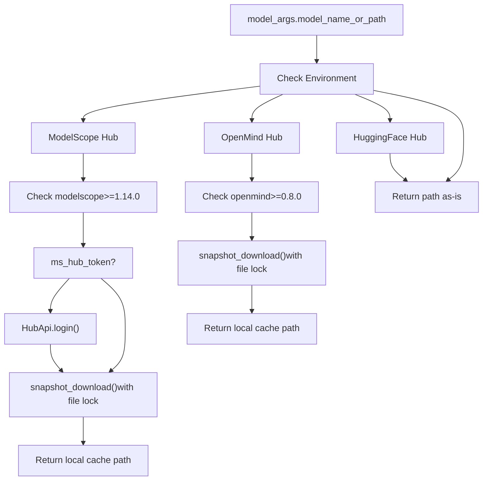
**Hub Selection Logic:**

-   `use_modelscope()`: Returns `True` if `USE_MODELSCOPE_HUB` environment variable is enabled
-   `use_openmind()`: Returns `True` if `USE_OPENMIND_HUB` environment variable is enabled
-   Default: HuggingFace Hub (no download needed, handled by `transformers`)

**File Locking:** ModelScope and OpenMind use `WeakFileLock` to prevent concurrent downloads:

-   ModelScope: `~/.cache/llamafactory/modelscope.lock`
-   OpenMind: `~/.cache/llamafactory/openmind.lock`

**Sources:** [src/llamafactory/extras/misc.py267-310](https://github.com/hiyouga/LlamaFactory/blob/355d5c5e/src/llamafactory/extras/misc.py#L267-L310) [src/llamafactory/model/loader.py61-62](https://github.com/hiyouga/LlamaFactory/blob/355d5c5e/src/llamafactory/model/loader.py#L61-L62)

---

## Tokenizer and Processor Loading

### Function: `load_tokenizer()`

The tokenizer loading process attempts fast tokenizer first, falls back to slow tokenizer if needed, and optionally loads a processor for multimodal models.

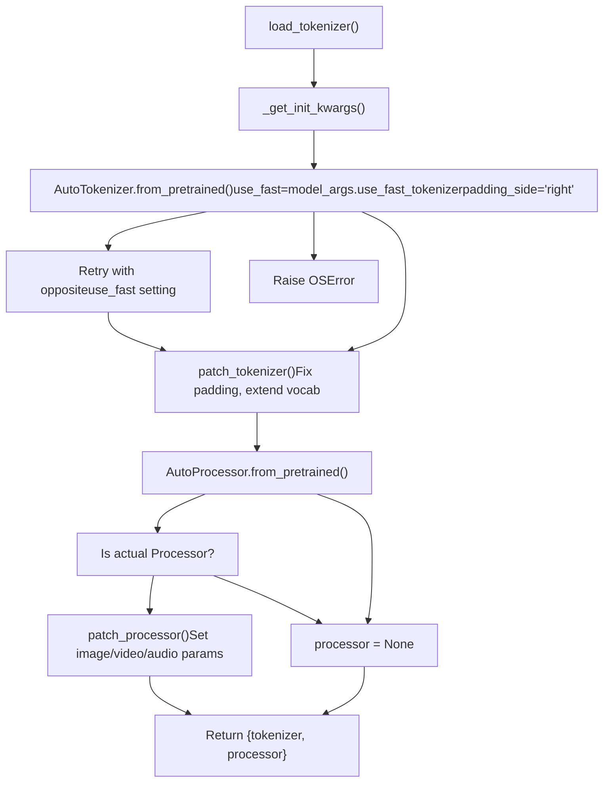
### Tokenizer Patching: `patch_tokenizer()`

The `patch_tokenizer()` function modifies the loaded tokenizer:

| Modification | Condition | Action |
| --- | --- | --- |
| Pad method fix | Always | Replace with `PreTrainedTokenizerBase._pad` if needed |
| Max length extension | `model_args.model_max_length` set | Increase `tokenizer.model_max_length` |
| Add custom tokens | `model_args.add_tokens` set | Add non-special tokens, set `resize_vocab=True` |
| Add special tokens | `model_args.add_special_tokens` or `model_args.new_special_tokens_config` set | Add special tokens with optional semantic initialization |

**Sources:** [src/llamafactory/model/loader.py71-122](https://github.com/hiyouga/LlamaFactory/blob/355d5c5e/src/llamafactory/model/loader.py#L71-L122) [src/llamafactory/model/patcher.py64-86](https://github.com/hiyouga/LlamaFactory/blob/355d5c5e/src/llamafactory/model/patcher.py#L64-L86) [src/llamafactory/model/patcher.py88-104](https://github.com/hiyouga/LlamaFactory/blob/355d5c5e/src/llamafactory/model/patcher.py#L88-L104)

---

## Configuration Loading and Patching

### Function: `load_config()` and `patch_config()`

Model configuration loading is a two-step process: load the base config, then apply extensive patches based on `ModelArguments`.

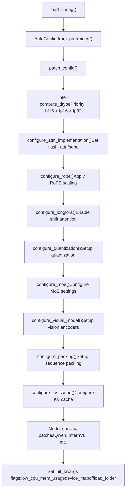
### Key Configuration Patches

**Compute Dtype Inference:**

```
# Priority order (from patch_config)if model_args.infer_dtype != "auto" and not is_trainable:    compute_dtype = torch.dtype from infer_dtypeelse:    compute_dtype = infer_optim_dtype(config.torch_dtype)    # Returns bf16 if available and model uses it, else fp16, else fp32
```
**Device Map Configuration:**

-   Disabled if DeepSpeed ZeRO-3 or FSDP enabled
-   Requires `low_cpu_mem_usage=True`
-   If `device_map="auto"`, sets `offload_folder` for disk offloading

**Model-Specific Patches:**

| Model Type | Patches Applied |
| --- | --- |
| `qwen` | Set `use_flash_attn`, dtype flags (`fp16`, `bf16`, `fp32`) |
| `minicpmo` | Set `init_audio=True`, `init_tts=False` |
| `kimi_vl` | Set `text_config.topk_method="greedy"` during training |
| `internvl` | Raise error if not HF-compatible format |
| `llava` | Raise error if not `llava-hf` format |
| `qwen3_omni_moe` | Apply MoE sparse block patch |

**Sources:** [src/llamafactory/model/loader.py125-128](https://github.com/hiyouga/LlamaFactory/blob/355d5c5e/src/llamafactory/model/loader.py#L125-L128) [src/llamafactory/model/patcher.py106-166](https://github.com/hiyouga/LlamaFactory/blob/355d5c5e/src/llamafactory/model/patcher.py#L106-L166) [src/llamafactory/extras/misc.py214-222](https://github.com/hiyouga/LlamaFactory/blob/355d5c5e/src/llamafactory/extras/misc.py#L214-L222)

---

## Base Model Loading

### Function: `load_model()`

The base model loading logic branches based on special loading modes (Unsloth, KTransformers, MoD) before falling back to standard `AutoModel` loading.

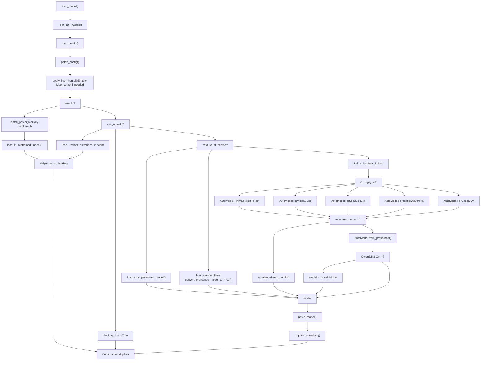
**Auto Model Class Selection:** The system automatically selects the appropriate `AutoModel` class based on the model's configuration:

| Config Mapping | AutoModel Class | Use Case |
| --- | --- | --- |
| `AutoModelForImageTextToText` | Image-text models | Vision-language models (VLMs) |
| `AutoModelForVision2Seq` | Vision-to-sequence | Alternative VLM format |
| `AutoModelForSeq2SeqLM` | Seq2Seq | Audio-text models |
| `AutoModelForTextToWaveform` | Text-to-audio | Qwen Omni audio generation |
| `AutoModelForCausalLM` | Causal LM | Standard text generation models |

**Sources:** [src/llamafactory/model/loader.py131-188](https://github.com/hiyouga/LlamaFactory/blob/355d5c5e/src/llamafactory/model/loader.py#L131-L188)

---

## Model Patching

### Function: `patch_model()`

After loading the base model, `patch_model()` applies runtime modifications to ensure correct behavior during training or inference.

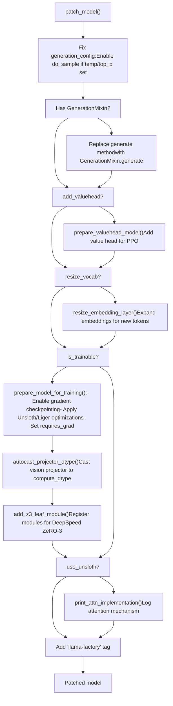
### Key Model Patches

**1\. Generation Config Fixing:** If sampling parameters (temperature, top\_p, typical\_p) are set but `do_sample=False`, automatically enables sampling to prevent silent failures.

**2\. Value Head Preparation (`add_valuehead=True`):**

-   Adds a value head layer for reinforcement learning (PPO) training
-   Freezes all parameters except the value head initially
-   See [Training Stages and Trainers](/hiyouga/LlamaFactory/6.1-training-stages-and-trainers) for PPO details

**3\. Embedding Resizing:** When new tokens are added to the tokenizer, the embedding and output layers must be resized:

-   Calls `resize_embedding_layer()` to expand dimensions
-   Can optionally perform semantic initialization for special tokens
-   Sets `resize_vocab=True` automatically if tokens added

**4\. Training Preparation (`is_trainable=True`):**

-   **Gradient Checkpointing:** Enabled unless `disable_gradient_checkpointing=True` or model type is `gemma3n`
-   **Unsloth Optimization:** Applies memory-efficient gradient checkpointing if `use_unsloth_gc=True`
-   **Liger Kernel:** Applies fused kernels if `enable_liger_kernel=True`
-   **Projector Casting:** For multimodal models, casts vision projector to `compute_dtype`
-   **DeepSpeed ZeRO-3:** Registers MoE experts as leaf modules to prevent sharding issues

**Sources:** [src/llamafactory/model/patcher.py168-214](https://github.com/hiyouga/LlamaFactory/blob/355d5c5e/src/llamafactory/model/patcher.py#L168-L214) [src/llamafactory/model/model\_utils/checkpointing.py](https://github.com/hiyouga/LlamaFactory/blob/355d5c5e/src/llamafactory/model/model_utils/checkpointing.py) [src/llamafactory/model/model\_utils/embedding.py](https://github.com/hiyouga/LlamaFactory/blob/355d5c5e/src/llamafactory/model/model_utils/embedding.py) [src/llamafactory/model/model\_utils/valuehead.py](https://github.com/hiyouga/LlamaFactory/blob/355d5c5e/src/llamafactory/model/model_utils/valuehead.py)

---

## Adapter Initialization

### Function: `init_adapter()`

The final stage initializes parameter-efficient fine-tuning (PEFT) adapters or configures full/freeze tuning. This function dispatches to one of four configuration modes.

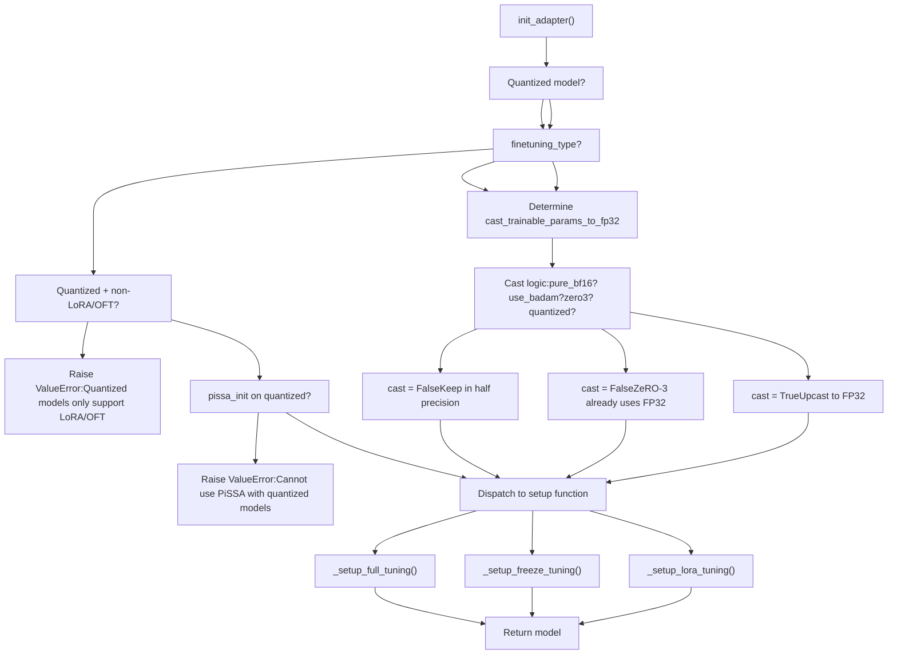
### Trainable Parameter Casting Logic

The decision to cast trainable parameters to FP32 depends on multiple factors:

| Condition | Cast to FP32? | Reason |
| --- | --- | --- |
| `not is_trainable` | No | Inference mode, no gradients |
| `pure_bf16=True` | No | Pure BF16 training requested |
| `use_badam=True` | No | BAdam handles mixed precision |
| `quantization_bit` set | Yes | QLoRA requires FP32 gradients |
| `zero3` without quant | No | DeepSpeed ZeRO-3 uses FP32 internally |
| Default trainable | Yes | Standard mixed precision training |

**Sources:** [src/llamafactory/model/adapter.py321-366](https://github.com/hiyouga/LlamaFactory/blob/355d5c5e/src/llamafactory/model/adapter.py#L321-L366)

---

## Adapter Configuration Modes

### 1\. Full Tuning: `_setup_full_tuning()`

Full tuning updates all model parameters, with optional freezing of forbidden modules (e.g., vision encoders).

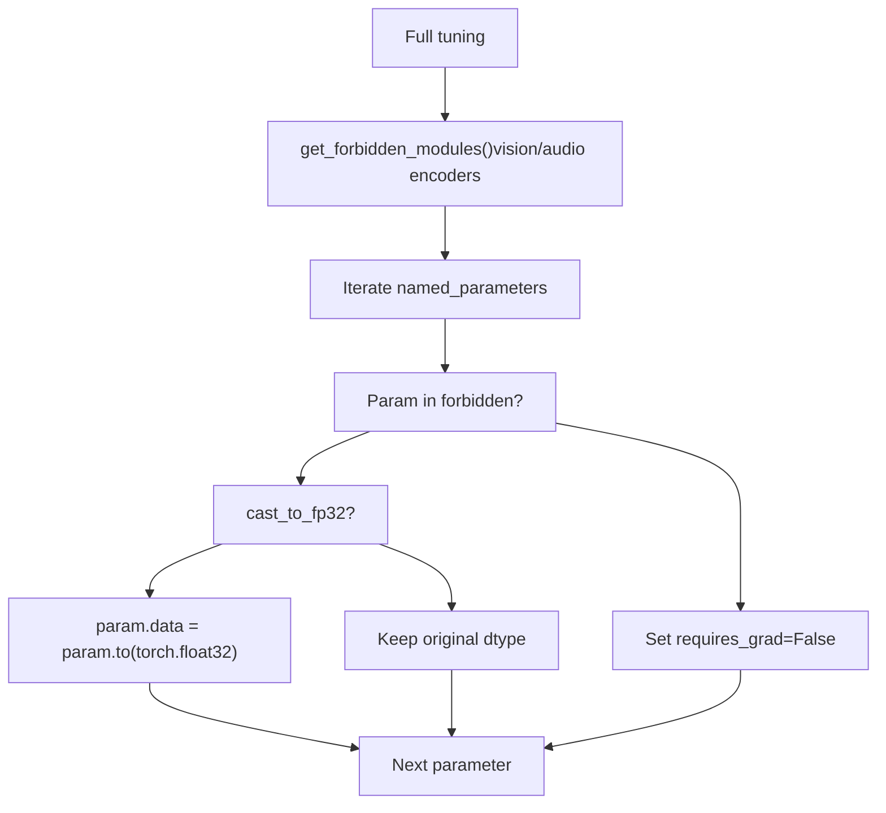
**Sources:** [src/llamafactory/model/adapter.py40-56](https://github.com/hiyouga/LlamaFactory/blob/355d5c5e/src/llamafactory/model/adapter.py#L40-L56)

### 2\. Freeze Tuning: `_setup_freeze_tuning()`

Freeze tuning trains only specific layers, supporting both standard and LLaMA-Pro training strategies.

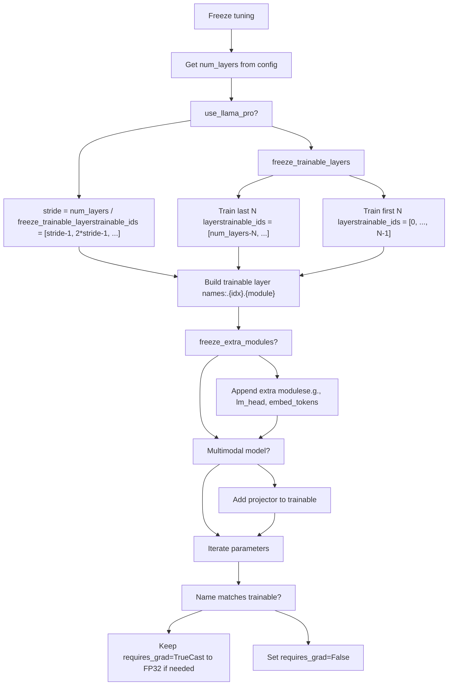
**LLaMA-Pro Strategy:** LLaMA-Pro distributes trainable layers evenly throughout the model rather than concentrating them at the end. For example, with 32 layers and 8 trainable layers, it trains layers 3, 7, 11, 15, 19, 23, 27, 31.

**Sources:** [src/llamafactory/model/adapter.py59-141](https://github.com/hiyouga/LlamaFactory/blob/355d5c5e/src/llamafactory/model/adapter.py#L59-L141)

### 3\. LoRA/OFT Tuning: `_setup_lora_tuning()`

LoRA (Low-Rank Adaptation) and OFT (Orthogonal Fine-Tuning) are the most complex adapter configurations, supporting model merging, adapter loading, and new adapter creation.

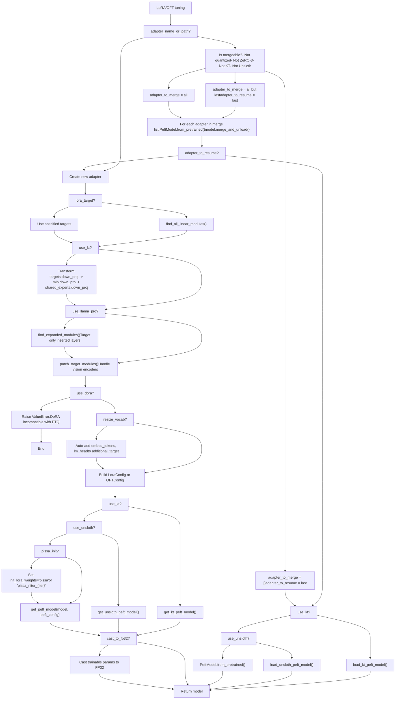
**Adapter Merging Logic:**

Adapters can be merged into the base model for faster inference. The merging decision matrix:

| Scenario | Merge Behavior |
| --- | --- |
| Quantized model | **No merge** (unstable), resume last adapter only |
| DeepSpeed ZeRO-3 | **No merge**, resume last adapter only |
| KTransformers | **No merge**, resume last adapter only |
| Unsloth | **No merge**, resume last adapter only |
| Training + `create_new_adapter=False` | **Merge all but last**, resume last for continued training |
| Training + `create_new_adapter=True` | **Merge all**, create new adapter |
| Inference | **Merge all** into base model |

**Target Module Selection:**

| `lora_target` Value | Resulting Targets |
| --- | --- |
| `["all"]` | All linear layers found by `find_all_linear_modules()` |
| Specific list (e.g., `["q_proj", "v_proj"]`) | Only specified modules |
| With `use_llama_pro=True` | Only modules in inserted layers |
| With KTransformers | Transformed names (e.g., `mlp.down_proj`, `shared_experts.down_proj`) |

**PiSSA Initialization:**

PiSSA (Principal Singular Values and Singular Vectors Adaptation) initializes LoRA matrices using SVD:

-   `pissa_iter=-1`: Standard PiSSA using full SVD
-   `pissa_iter=N`: Fast SVD with N iterations
-   Only compatible with non-quantized models
-   Set via `init_lora_weights="pissa"` or `"pissa_niter_{N}"`

**Sources:** [src/llamafactory/model/adapter.py143-318](https://github.com/hiyouga/LlamaFactory/blob/355d5c5e/src/llamafactory/model/adapter.py#L143-L318)

---

## Post-Loading Operations

After adapter initialization, the `load_model()` function performs several final operations before returning the model.

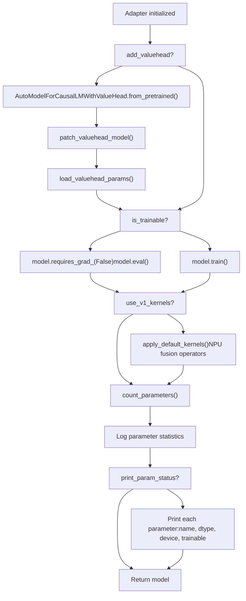
### Value Head Integration

For PPO training (`add_valuehead=True`):

1.  **Wrap:** Model wrapped in `AutoModelForCausalLMWithValueHead`
2.  **Patch:** Apply methods for embedding access, weight tying, RoPE index
3.  **Load:** Attempt to load pre-trained value head parameters from checkpoint
4.  **Ignore Keys:** Set `_keys_to_ignore_on_save` to avoid saving base model twice

### Parameter Statistics Logging

The system logs parameter counts using `count_parameters()`:

-   **Trainable params:** Parameters with `requires_grad=True`
-   **All params:** Total parameters in model
-   **Trainable %:** Percentage of parameters being trained
-   Handles DeepSpeed ZeRO-3 via `param.ds_numel`
-   Handles 4-bit quantization via `Params4bit.quant_storage`

**Example Output:**

```
trainable params: 4,194,304 || all params: 6,738,415,616 || trainable%: 0.0622
```
### V1 Kernels (Experimental)

When `use_v1_kernels=True`, applies NPU-optimized fusion operators:

-   **Purpose:** Accelerate training on Ascend NPUs
-   **Scope:** Not supported for all models
-   **Location:** [src/llamafactory/v1/plugins/model\_plugins/kernels/interface.py](https://github.com/hiyouga/LlamaFactory/blob/355d5c5e/src/llamafactory/v1/plugins/model_plugins/kernels/interface.py)
-   **Status:** Future feature, may be removed after transition period

**Sources:** [src/llamafactory/model/loader.py192-237](https://github.com/hiyouga/LlamaFactory/blob/355d5c5e/src/llamafactory/model/loader.py#L192-L237) [src/llamafactory/extras/misc.py117-141](https://github.com/hiyouga/LlamaFactory/blob/355d5c5e/src/llamafactory/extras/misc.py#L117-L141) [src/llamafactory/model/patcher.py216-253](https://github.com/hiyouga/LlamaFactory/blob/355d5c5e/src/llamafactory/model/patcher.py#L216-L253)

---

## Complete Pipeline Code Flow

This diagram shows the complete function call hierarchy with actual function names from the codebase:

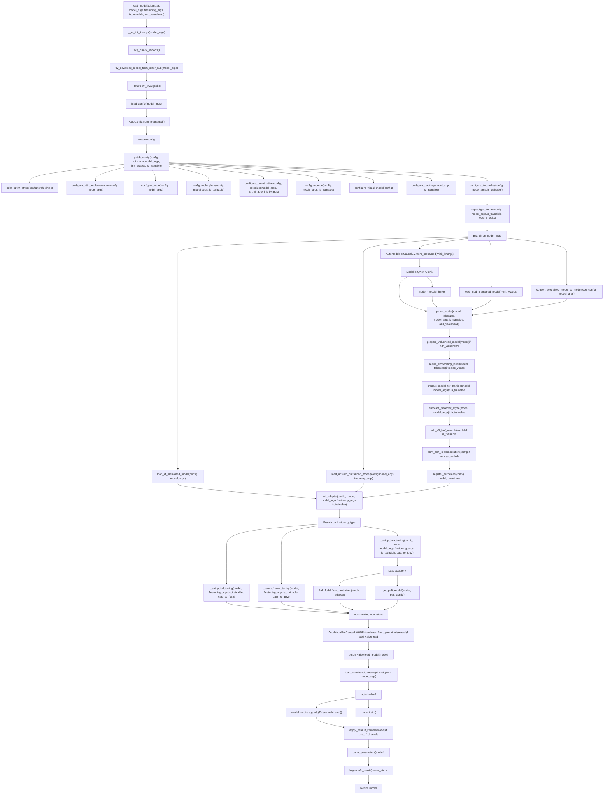
**Sources:** [src/llamafactory/model/loader.py131-238](https://github.com/hiyouga/LlamaFactory/blob/355d5c5e/src/llamafactory/model/loader.py#L131-L238) [src/llamafactory/model/patcher.py106-214](https://github.com/hiyouga/LlamaFactory/blob/355d5c5e/src/llamafactory/model/patcher.py#L106-L214) [src/llamafactory/model/adapter.py321-366](https://github.com/hiyouga/LlamaFactory/blob/355d5c5e/src/llamafactory/model/adapter.py#L321-L366)

---

## Environment Variables

The following environment variables affect the model loading pipeline:

| Variable | Effect | Default |
| --- | --- | --- |
| `USE_MODELSCOPE_HUB` | Use ModelScope instead of HuggingFace | `0` |
| `USE_OPENMIND_HUB` | Use OpenMind instead of HuggingFace | `0` |
| `USE_KT` | Enable KTransformers integration | `0` |
| `DISABLE_VERSION_CHECK` | Skip dependency version checks | `0` |
| `FORCE_CHECK_IMPORTS` | Force flash attention import checks | `0` |
| `LOCAL_RANK` | Process rank for distributed training | `0` |

**Sources:** [src/llamafactory/extras/misc.py231-233](https://github.com/hiyouga/LlamaFactory/blob/355d5c5e/src/llamafactory/extras/misc.py#L231-L233) [src/llamafactory/extras/misc.py304-317](https://github.com/hiyouga/LlamaFactory/blob/355d5c5e/src/llamafactory/extras/misc.py#L304-L317)

---

## Error Handling and Validation

### Model-Specific Validation

The pipeline includes several model-specific validations:

```
# InternVL format checkif "InternVLChatModel" in config.architectures:    raise ValueError("Please download internvl models in HF-compatible format") # LLaVA format check  if "LlavaLlamaForCausalLM" in config.architectures:    raise ValueError("Please download llava models with hf-compatible format") # InternLM3 version checkif config.model_type == "internlm3" and transformers_version < "4.47.1":    raise RuntimeError("InternLM3 requires transformers>=4.47.1")
```
### Adapter Compatibility Validation

```
# Quantization with non-LoRA adaptersif is_trainable and quantized and finetuning_type not in ["lora", "oft"]:    raise ValueError("Quantized models can only use LoRA or OFT tuning") # PiSSA with quantizationif pissa_init and quantized:    raise ValueError("Cannot initialize PiSSA adapter on quantized models") # DoRA with non-BNB quantizationif use_dora and quantization_method not in [None, "bnb"]:    raise ValueError("DoRA is not compatible with PTQ-quantized models")
```
**Sources:** [src/llamafactory/model/patcher.py141-154](https://github.com/hiyouga/LlamaFactory/blob/355d5c5e/src/llamafactory/model/patcher.py#L141-L154) [src/llamafactory/model/adapter.py334-340](https://github.com/hiyouga/LlamaFactory/blob/355d5c5e/src/llamafactory/model/adapter.py#L334-L340)

---

## Summary Table: Key Functions

| Function | File | Purpose |
| --- | --- | --- |
| `load_tokenizer()` | loader.py:71-122 | Load tokenizer and optional processor |
| `load_config()` | loader.py:125-128 | Load model configuration from pretrained |
| `load_model()` | loader.py:131-238 | Main entry point for model loading pipeline |
| `_get_init_kwargs()` | loader.py:56-68 | Prepare standard initialization arguments |
| `try_download_model_from_other_hub()` | misc.py:267-301 | Download from ModelScope/OpenMind if needed |
| `patch_tokenizer()` | patcher.py:64-86 | Extend vocabulary and fix tokenizer methods |
| `patch_processor()` | patcher.py:88-104 | Configure image/video/audio processing parameters |
| `patch_config()` | patcher.py:106-166 | Apply extensive configuration patches |
| `patch_model()` | patcher.py:168-214 | Apply runtime model modifications |
| `init_adapter()` | adapter.py:321-366 | Initialize PEFT adapters or full/freeze tuning |
| `_setup_full_tuning()` | adapter.py:40-56 | Configure full parameter fine-tuning |
| `_setup_freeze_tuning()` | adapter.py:59-141 | Configure layer freezing strategy |
| `_setup_lora_tuning()` | adapter.py:143-318 | Configure LoRA/OFT adapters |
