# Adapter System (LoRA/QLoRA/OFT)

Relevant source files

-   [src/llamafactory/hparams/finetuning\_args.py](https://github.com/hiyouga/LlamaFactory/blob/355d5c5e/src/llamafactory/hparams/finetuning_args.py)
-   [src/llamafactory/hparams/model\_args.py](https://github.com/hiyouga/LlamaFactory/blob/355d5c5e/src/llamafactory/hparams/model_args.py)
-   [src/llamafactory/model/adapter.py](https://github.com/hiyouga/LlamaFactory/blob/355d5c5e/src/llamafactory/model/adapter.py)
-   [src/llamafactory/model/loader.py](https://github.com/hiyouga/LlamaFactory/blob/355d5c5e/src/llamafactory/model/loader.py)
-   [src/llamafactory/model/model\_utils/unsloth.py](https://github.com/hiyouga/LlamaFactory/blob/355d5c5e/src/llamafactory/model/model_utils/unsloth.py)
-   [src/llamafactory/model/patcher.py](https://github.com/hiyouga/LlamaFactory/blob/355d5c5e/src/llamafactory/model/patcher.py)
-   [src/llamafactory/train/dpo/trainer.py](https://github.com/hiyouga/LlamaFactory/blob/355d5c5e/src/llamafactory/train/dpo/trainer.py)
-   [src/llamafactory/train/kto/trainer.py](https://github.com/hiyouga/LlamaFactory/blob/355d5c5e/src/llamafactory/train/kto/trainer.py)
-   [src/llamafactory/train/ppo/trainer.py](https://github.com/hiyouga/LlamaFactory/blob/355d5c5e/src/llamafactory/train/ppo/trainer.py)
-   [src/llamafactory/train/pt/trainer.py](https://github.com/hiyouga/LlamaFactory/blob/355d5c5e/src/llamafactory/train/pt/trainer.py)
-   [src/llamafactory/train/rm/trainer.py](https://github.com/hiyouga/LlamaFactory/blob/355d5c5e/src/llamafactory/train/rm/trainer.py)
-   [src/llamafactory/train/sft/trainer.py](https://github.com/hiyouga/LlamaFactory/blob/355d5c5e/src/llamafactory/train/sft/trainer.py)
-   [src/llamafactory/train/trainer\_utils.py](https://github.com/hiyouga/LlamaFactory/blob/355d5c5e/src/llamafactory/train/trainer_utils.py)

## Purpose and Scope

The Adapter System provides parameter-efficient fine-tuning (PEFT) methods for large language models. This page documents four fine-tuning strategies: **LoRA** (Low-Rank Adaptation), **QLoRA** (Quantized LoRA), **OFT** (Orthogonal Fine-Tuning), and **Freeze** tuning, along with full parameter fine-tuning. The system handles adapter initialization, configuration, loading, merging, and integration with quantized models.

For model loading and configuration before adapter initialization, see [Model Loading Pipeline](/hiyouga/LlamaFactory/5.1-model-loading-pipeline). For quantization details independent of adapters, see [Quantization and Precision](/hiyouga/LlamaFactory/5.3-quantization-and-precision). For training integration, see [Training Stages and Trainers](/hiyouga/LlamaFactory/6.1-training-stages-and-trainers).

---

## Adapter Method Overview

LlamaFactory supports four fine-tuning approaches, each with different trade-offs between memory efficiency, training speed, and model capacity:

| Method | Trainable Params | Memory Efficiency | Use Case | Quantization Support |
| --- | --- | --- | --- | --- |
| **Full** | All parameters | Low | Small models, unlimited resources | No |
| **Freeze** | Selected layers | Medium | Layer-specific tuning, LLaMA-Pro | No |
| **LoRA/QLoRA** | Low-rank matrices | High | Most efficient, works with quantization | Yes (4/8-bit) |
| **OFT** | Orthogonal matrices | High | Alternative to LoRA | Yes (4/8-bit) |

The adapter type is specified via `finetuning_type` in `FinetuningArguments`, which can be `"full"`, `"freeze"`, `"lora"`, or `"oft"`.

**Sources:** [src/llamafactory/hparams/finetuning\_args.py464-467](https://github.com/hiyouga/LlamaFactory/blob/355d5c5e/src/llamafactory/hparams/finetuning_args.py#L464-L467) [src/llamafactory/model/adapter.py321-367](https://github.com/hiyouga/LlamaFactory/blob/355d5c5e/src/llamafactory/model/adapter.py#L321-L367)

---

## Adapter Initialization Flow

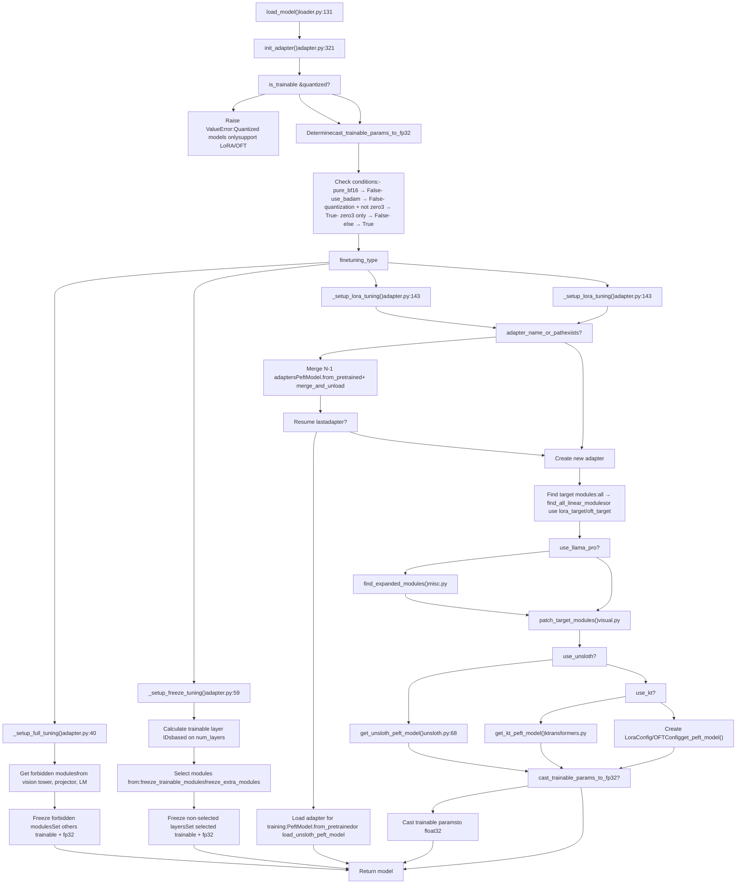
**Key Decision Points:**

1.  **Quantization Check**: Quantized models can only use LoRA or OFT adapters [adapter.py334-336](https://github.com/hiyouga/LlamaFactory/blob/355d5c5e/adapter.py#L334-L336)
2.  **Cast to FP32**: Trainable parameters are cast to `float32` unless using pure BF16, BAdam, or DeepSpeed ZeRO-3 [adapter.py342-353](https://github.com/hiyouga/LlamaFactory/blob/355d5c5e/adapter.py#L342-L353)
3.  **Adapter Merging**: Multiple adapters can be loaded and merged sequentially, except the last one which is used for training [adapter.py177-182](https://github.com/hiyouga/LlamaFactory/blob/355d5c5e/adapter.py#L177-L182)

**Sources:** [src/llamafactory/model/adapter.py321-367](https://github.com/hiyouga/LlamaFactory/blob/355d5c5e/src/llamafactory/model/adapter.py#L321-L367) [src/llamafactory/model/loader.py190](https://github.com/hiyouga/LlamaFactory/blob/355d5c5e/src/llamafactory/model/loader.py#L190-L190)

---

## LoRA Configuration

LoRA (Low-Rank Adaptation) adds trainable low-rank decomposition matrices to frozen model weights, significantly reducing the number of trainable parameters.

### LoRA Parameters

The `LoraArguments` dataclass in `FinetuningArguments` controls LoRA behavior:

| Parameter | Type | Default | Description |
| --- | --- | --- | --- |
| `lora_rank` | int | 8 | Rank of low-rank matrices (r) |
| `lora_alpha` | int | lora\_rank\*2 | Scaling factor (α), defaults to 2r |
| `lora_dropout` | float | 0.0 | Dropout probability for LoRA layers |
| `lora_target` | str | "all" | Target modules (comma-separated or "all") |
| `additional_target` | str | None | Extra modules to train beyond LoRA layers |
| `use_rslora` | bool | False | Use rank-stabilized LoRA scaling |
| `use_dora` | bool | False | Use DoRA (Weight-Decomposed LoRA) |
| `pissa_init` | bool | False | Initialize with PiSSA |
| `pissa_iter` | int | 16 | FSVD iterations for PiSSA (-1 disables) |

**Sources:** [src/llamafactory/hparams/finetuning\_args.py56-123](https://github.com/hiyouga/LlamaFactory/blob/355d5c5e/src/llamafactory/hparams/finetuning_args.py#L56-L123)

### Target Module Selection

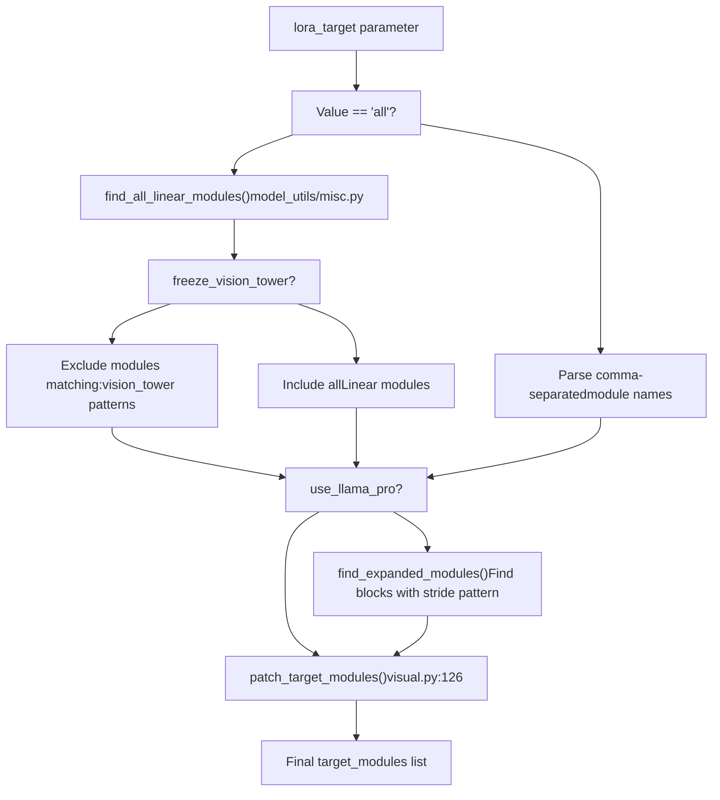
When `lora_target="all"`, the system finds all `torch.nn.Linear` modules excluding embeddings and `lm_head`. For vision-language models with `freeze_vision_tower=True`, vision tower modules are excluded.

**Sources:** [src/llamafactory/model/adapter.py215-233](https://github.com/hiyouga/LlamaFactory/blob/355d5c5e/src/llamafactory/model/adapter.py#L215-L233) [src/llamafactory/model/model\_utils/misc.py](https://github.com/hiyouga/LlamaFactory/blob/355d5c5e/src/llamafactory/model/model_utils/misc.py#LNaN-LNaN)

### LoRA Variants

**Standard LoRA**: Adds matrices A (r×d) and B (d×r) where r << d:

```
ΔW = B·A·(α/r)
```
**RSLoRA** (`use_rslora=True`): Uses rank-stabilized scaling:

```
ΔW = B·A·(α/√r)
```
**DoRA** (`use_dora=True`): Decomposes weight updates into magnitude and direction:

```
W' = m·(W₀ + ΔW)/||W₀ + ΔW||
```
**PiSSA** (`pissa_init=True`): Initializes LoRA with principal singular vectors via FSVD. See [PiSSA Initialization](https://github.com/hiyouga/LlamaFactory/blob/355d5c5e/PiSSA Initialization) section below.

**Sources:** [src/llamafactory/hparams/finetuning\_args.py99-119](https://github.com/hiyouga/LlamaFactory/blob/355d5c5e/src/llamafactory/hparams/finetuning_args.py#L99-L119) [src/llamafactory/model/adapter.py292-298](https://github.com/hiyouga/LlamaFactory/blob/355d5c5e/src/llamafactory/model/adapter.py#L292-L298)

### Configuration Example

```
# LoRA with rank 16, targeting all linear layersFinetuningArguments(    finetuning_type="lora",    lora_rank=16,    lora_alpha=32,    lora_dropout=0.05,    lora_target="all",    use_rslora=False,    use_dora=False) # LoRA with specific targetsFinetuningArguments(    finetuning_type="lora",    lora_rank=8,    lora_target="q_proj,v_proj,k_proj,o_proj",    additional_target="embed_tokens,lm_head"  # Also train embeddings)
```
**Sources:** [src/llamafactory/hparams/finetuning\_args.py56-123](https://github.com/hiyouga/LlamaFactory/blob/355d5c5e/src/llamafactory/hparams/finetuning_args.py#L56-L123)

---

## OFT Configuration

OFT (Orthogonal Fine-Tuning) uses orthogonal transformations to adapt model weights, providing an alternative to LoRA's low-rank approach.

### OFT Parameters

The `OFTArguments` dataclass defines OFT-specific configuration:

| Parameter | Type | Default | Description |
| --- | --- | --- | --- |
| `oft_rank` | int | 0 | Rank constraint (0 = unconstrained) |
| `oft_block_size` | int | 32 | Block size for orthogonal matrices |
| `module_dropout` | float | 0.0 | Dropout rate for OFT modules |
| `oft_target` | str | "all" | Target modules (same as LoRA) |
| `additional_target` | str | None | Extra modules to train |

**Sources:** [src/llamafactory/hparams/finetuning\_args.py125-165](https://github.com/hiyouga/LlamaFactory/blob/355d5c5e/src/llamafactory/hparams/finetuning_args.py#L125-L165)

### OFT vs LoRA Comparison

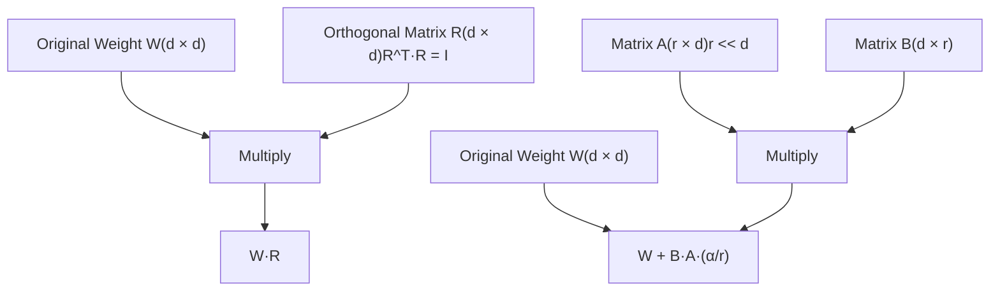
**Key Differences:**

-   **LoRA**: Additive low-rank update (fewer parameters)
-   **OFT**: Multiplicative orthogonal transformation (preserves norms)

**Sources:** [src/llamafactory/hparams/finetuning\_args.py125-165](https://github.com/hiyouga/LlamaFactory/blob/355d5c5e/src/llamafactory/hparams/finetuning_args.py#L125-L165) [src/llamafactory/model/adapter.py263-270](https://github.com/hiyouga/LlamaFactory/blob/355d5c5e/src/llamafactory/model/adapter.py#L263-L270)

### Configuration Example

```
FinetuningArguments(    finetuning_type="oft",    oft_rank=0,  # Unconstrained    oft_block_size=32,    module_dropout=0.0,    oft_target="all")
```
**Sources:** [src/llamafactory/hparams/finetuning\_args.py125-165](https://github.com/hiyouga/LlamaFactory/blob/355d5c5e/src/llamafactory/hparams/finetuning_args.py#L125-L165)

---

## Freeze Tuning Configuration

Freeze tuning trains only specific layers while keeping others frozen, useful for layer-specific adaptation and LLaMA-Pro-style expansion.

### Freeze Parameters

The `FreezeArguments` dataclass controls layer selection:

| Parameter | Type | Default | Description |
| --- | --- | --- | --- |
| `freeze_trainable_layers` | int | 2 | Number of layers to train (+ = last n, - = first n) |
| `freeze_trainable_modules` | str | "all" | Module types within layers (e.g., "attn,mlp") |
| `freeze_extra_modules` | str | None | Additional top-level modules to train |

**Sources:** [src/llamafactory/hparams/finetuning\_args.py20-53](https://github.com/hiyouga/LlamaFactory/blob/355d5c5e/src/llamafactory/hparams/finetuning_args.py#L20-L53)

### Layer Selection Logic

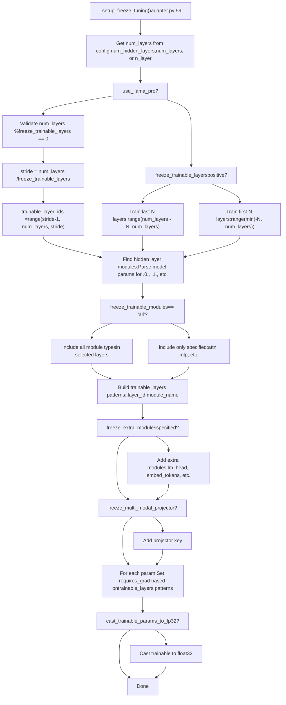
**Layer ID Calculation:**

-   **Positive**: `freeze_trainable_layers=2` trains the last 2 layers
-   **Negative**: `freeze_trainable_layers=-2` trains the first 2 layers
-   **LLaMA-Pro**: Distributes training evenly (e.g., 32 layers with `freeze_trainable_layers=8` trains layers 3, 7, 11, 15, 19, 23, 27, 31)

**Sources:** [src/llamafactory/model/adapter.py59-141](https://github.com/hiyouga/LlamaFactory/blob/355d5c5e/src/llamafactory/model/adapter.py#L59-L141) [src/llamafactory/hparams/finetuning\_args.py20-53](https://github.com/hiyouga/LlamaFactory/blob/355d5c5e/src/llamafactory/hparams/finetuning_args.py#L20-L53)

### Configuration Examples

```
# Train last 2 layers, all modulesFinetuningArguments(    finetuning_type="freeze",    freeze_trainable_layers=2,    freeze_trainable_modules="all") # Train first 3 layers, only attentionFinetuningArguments(    finetuning_type="freeze",    freeze_trainable_layers=-3,    freeze_trainable_modules="attn") # LLaMA-Pro: Train 8 layers evenly distributedFinetuningArguments(    finetuning_type="freeze",    freeze_trainable_layers=8,    use_llama_pro=True)
```
**Sources:** [src/llamafactory/hparams/finetuning\_args.py20-53](https://github.com/hiyouga/LlamaFactory/blob/355d5c5e/src/llamafactory/hparams/finetuning_args.py#L20-L53) [src/llamafactory/model/adapter.py82-95](https://github.com/hiyouga/LlamaFactory/blob/355d5c5e/src/llamafactory/model/adapter.py#L82-L95)

---

## Full Tuning Configuration

Full tuning trains all model parameters except those in forbidden modules (vision tower, projector, or language model if frozen).

### Full Tuning Logic

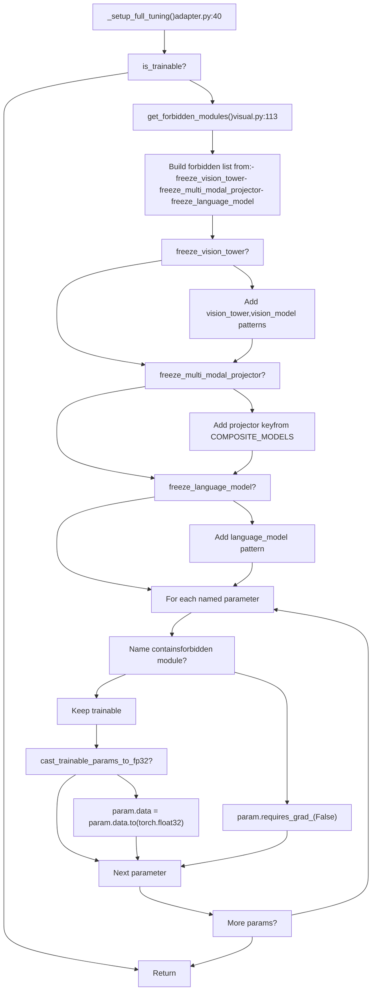
Full tuning is the most memory-intensive approach but provides maximum flexibility. It's typically used for:

-   Small models (< 7B parameters)
-   Domain adaptation requiring extensive changes
-   Models where PEFT methods don't perform adequately

**Sources:** [src/llamafactory/model/adapter.py40-57](https://github.com/hiyouga/LlamaFactory/blob/355d5c5e/src/llamafactory/model/adapter.py#L40-L57) [src/llamafactory/model/model\_utils/visual.py113-124](https://github.com/hiyouga/LlamaFactory/blob/355d5c5e/src/llamafactory/model/model_utils/visual.py#L113-L124)

---

## Quantization and QLoRA

QLoRA (Quantized LoRA) combines 4-bit or 8-bit quantization with LoRA training, enabling fine-tuning of large models on consumer hardware.

### Quantization Compatibility

| Fine-tuning Method | 4-bit Quantization | 8-bit Quantization |
| --- | --- | --- |
| Full | ❌ Not supported | ❌ Not supported |
| Freeze | ❌ Not supported | ❌ Not supported |
| LoRA | ✅ Supported (QLoRA) | ✅ Supported (QLoRA) |
| OFT | ✅ Supported | ✅ Supported |

The validation logic enforces this at adapter initialization:

```
if is_trainable and getattr(model, "quantization_method", None) is not None:    if finetuning_args.finetuning_type not in ["lora", "oft"]:        raise ValueError("Quantized models can only be used for the LoRA or OFT tuning.")
```
**Sources:** [src/llamafactory/model/adapter.py334-336](https://github.com/hiyouga/LlamaFactory/blob/355d5c5e/src/llamafactory/model/adapter.py#L334-L336)

### QLoRA Configuration Flow

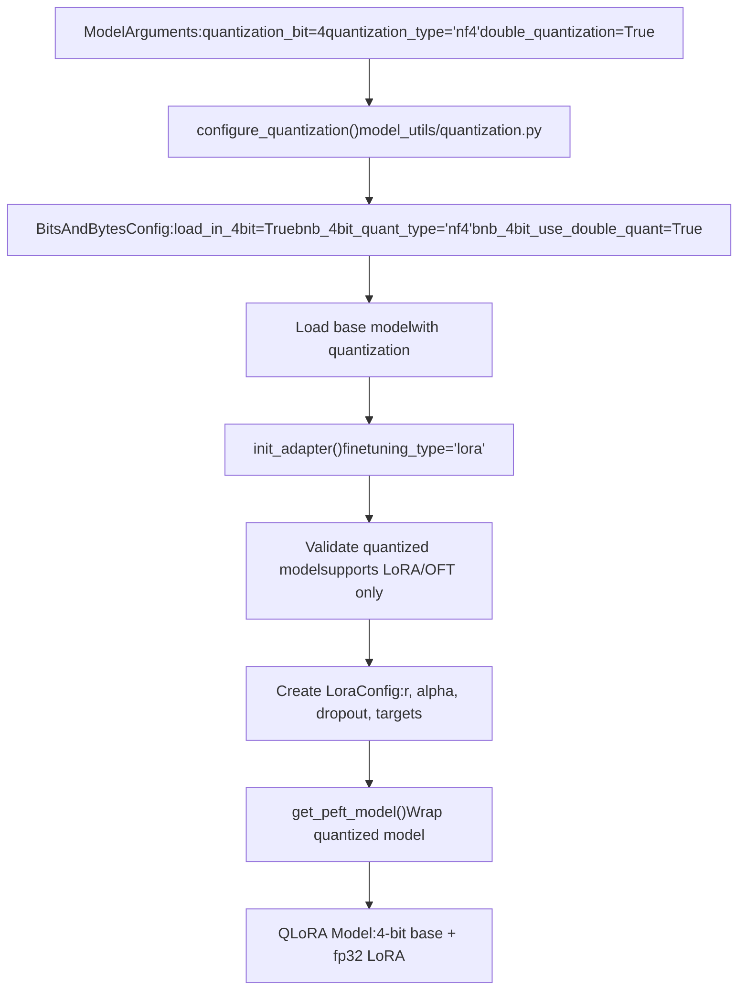
**Key Points:**

1.  Quantization is configured during model loading via `configure_quantization()` [model\_utils/quantization.py](https://github.com/hiyouga/LlamaFactory/blob/355d5c5e/model_utils/quantization.py)
2.  The base model is loaded in 4-bit or 8-bit precision
3.  LoRA adapters are trained in `float32` on top of the quantized base
4.  This drastically reduces memory usage while maintaining training quality

**Sources:** [src/llamafactory/model/adapter.py334-340](https://github.com/hiyouga/LlamaFactory/blob/355d5c5e/src/llamafactory/model/adapter.py#L334-L340) [src/llamafactory/model/model\_utils/quantization.py](https://github.com/hiyouga/LlamaFactory/blob/355d5c5e/src/llamafactory/model/model_utils/quantization.py)

### Memory Comparison

For a 7B parameter model:

| Method | Base Model Memory | Trainable Params | Total Memory |
| --- | --- | --- | --- |
| Full FP16 | ~14 GB | 7B | ~14 GB |
| LoRA FP16 | ~14 GB | ~10M | ~14 GB |
| QLoRA 4-bit | ~3.5 GB | ~10M | ~4 GB |

**Sources:** [src/llamafactory/model/adapter.py334-367](https://github.com/hiyouga/LlamaFactory/blob/355d5c5e/src/llamafactory/model/adapter.py#L334-L367)

---

## Adapter Loading and Merging

The system supports loading multiple pre-trained adapters, merging them into the base model, and optionally resuming training from a checkpoint.

### Adapter Loading Strategy

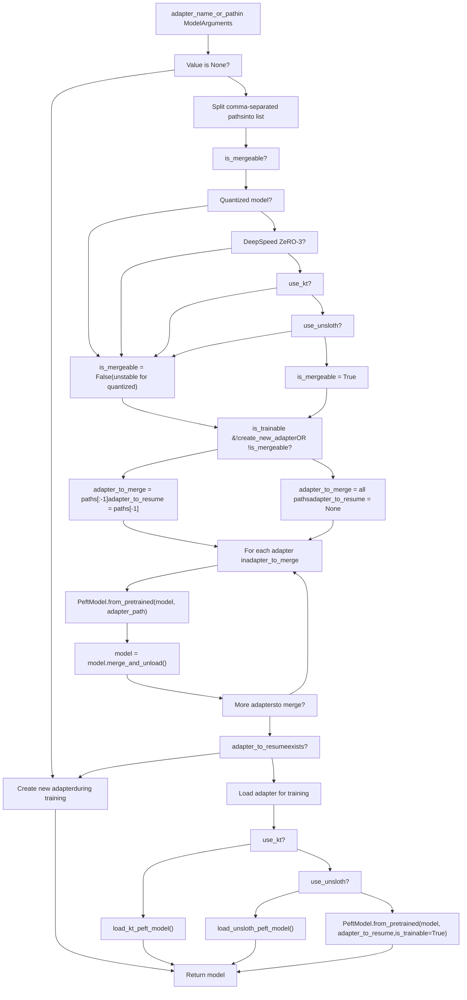
**Merging Behavior:**

-   **Multiple Adapters**: Paths `"adapter1,adapter2,adapter3"` → Merge `adapter1` and `adapter2`, resume from `adapter3`
-   **Single Adapter (Training)**: Path `"adapter1"` → Resume from `adapter1`
-   **Single Adapter (Inference)**: Path `"adapter1"` → Merge `adapter1` into base model
-   **Quantized Models**: Cannot merge (instability), always resume from last adapter

**Sources:** [src/llamafactory/model/adapter.py159-212](https://github.com/hiyouga/LlamaFactory/blob/355d5c5e/src/llamafactory/model/adapter.py#L159-L212) [src/llamafactory/hparams/model\_args.py43-50](https://github.com/hiyouga/LlamaFactory/blob/355d5c5e/src/llamafactory/hparams/model_args.py#L43-L50)

### Example Configurations

```
# Merge two adapters, train a thirdModelArguments(    model_name_or_path="meta-llama/Llama-2-7b-hf",    adapter_name_or_path="adapter_task1,adapter_task2,adapter_task3")# Result: adapter_task1 + adapter_task2 merged, adapter_task3 resumed for training # Inference with merged adapterModelArguments(    model_name_or_path="meta-llama/Llama-2-7b-hf",    adapter_name_or_path="my_adapter")# Result: my_adapter merged into base model for inference # QLoRA with existing adapterModelArguments(    model_name_or_path="meta-llama/Llama-2-7b-hf",    quantization_bit=4,    adapter_name_or_path="my_adapter")# Result: 4-bit base + my_adapter resumed (merging skipped for quantized model)
```
**Sources:** [src/llamafactory/model/adapter.py159-212](https://github.com/hiyouga/LlamaFactory/blob/355d5c5e/src/llamafactory/model/adapter.py#L159-L212)

---

## PiSSA Initialization

PiSSA (Principal Singular values and Singular vectors Adaptation) initializes LoRA matrices using principal components from SVD, improving convergence over random initialization.

### PiSSA Algorithm

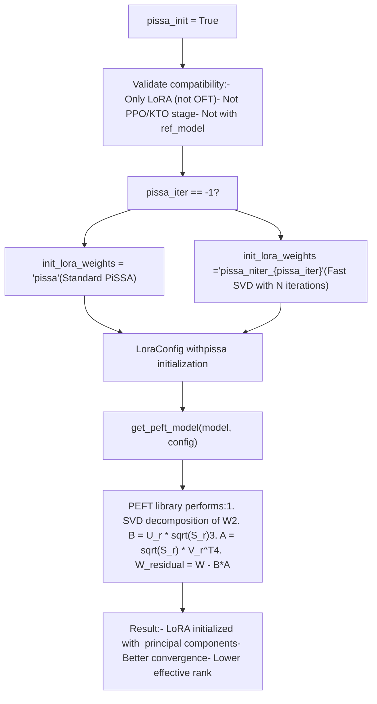
**Mathematical Formulation:**

Given a weight matrix W, PiSSA computes:

1.  SVD: W = U·Σ·V^T
2.  Take top-r singular values/vectors
3.  Initialize: B = U\_r·√Σ\_r, A = √Σ\_r·V\_r^T
4.  Residual: W' = W - B·A

This ensures the adapter starts from a meaningful subspace rather than random noise.

**Configuration:**

```
# Standard PiSSAFinetuningArguments(    finetuning_type="lora",    pissa_init=True,    pissa_iter=-1,  # Disable FSVD, use standard SVD    lora_rank=8) # Fast SVD PiSSA with 16 iterationsFinetuningArguments(    finetuning_type="lora",    pissa_init=True,    pissa_iter=16,  # Use FSVD with 16 iterations    lora_rank=8)
```
**Restrictions:**

-   Cannot be used with quantized models [adapter.py338-339](https://github.com/hiyouga/LlamaFactory/blob/355d5c5e/adapter.py#L338-L339)
-   Cannot be used with PPO, KTO, or reference model stages [finetuning\_args.py567-568](https://github.com/hiyouga/LlamaFactory/blob/355d5c5e/finetuning_args.py#L567-L568)

**Sources:** [src/llamafactory/model/adapter.py292-298](https://github.com/hiyouga/LlamaFactory/blob/355d5c5e/src/llamafactory/model/adapter.py#L292-L298) [src/llamafactory/hparams/finetuning\_args.py107-119](https://github.com/hiyouga/LlamaFactory/blob/355d5c5e/src/llamafactory/hparams/finetuning_args.py#L107-L119) [src/llamafactory/hparams/finetuning\_args.py567-568](https://github.com/hiyouga/LlamaFactory/blob/355d5c5e/src/llamafactory/hparams/finetuning_args.py#L567-L568)

---

## Special Integration Features

### Unsloth Integration

Unsloth is a third-party library that optimizes LoRA training with fused kernels and memory optimizations.

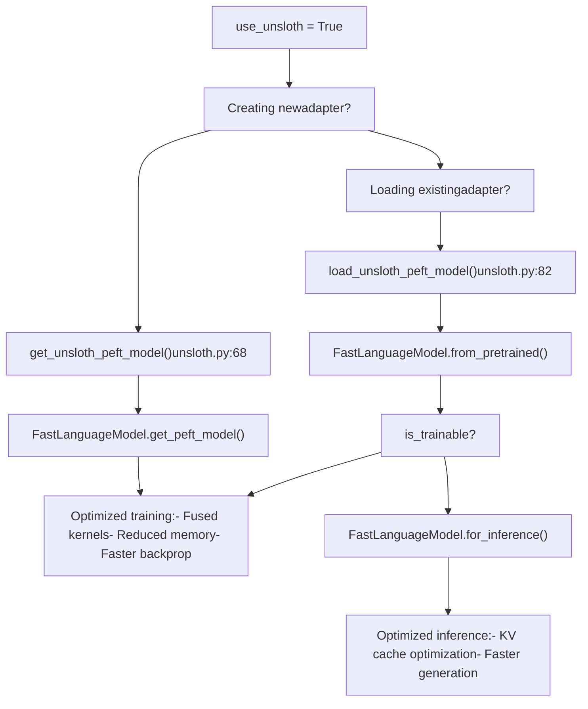
**Limitations:**

-   Only supports LoRA (not OFT) [adapter.py287-288](https://github.com/hiyouga/LlamaFactory/blob/355d5c5e/adapter.py#L287-L288)
-   Cannot merge multiple adapters [adapter.py174-175](https://github.com/hiyouga/LlamaFactory/blob/355d5c5e/adapter.py#L174-L175)
-   Only single adapter loading allowed [adapter.py174](https://github.com/hiyouga/LlamaFactory/blob/355d5c5e/adapter.py#L174-L174)

**Sources:** [src/llamafactory/model/adapter.py286-290](https://github.com/hiyouga/LlamaFactory/blob/355d5c5e/src/llamafactory/model/adapter.py#L286-L290) [src/llamafactory/model/model\_utils/unsloth.py51-103](https://github.com/hiyouga/LlamaFactory/blob/355d5c5e/src/llamafactory/model/model_utils/unsloth.py#L51-L103)

### KTransformers Integration

KTransformers enables CPU-GPU hybrid inference with optimized kernel scheduling.

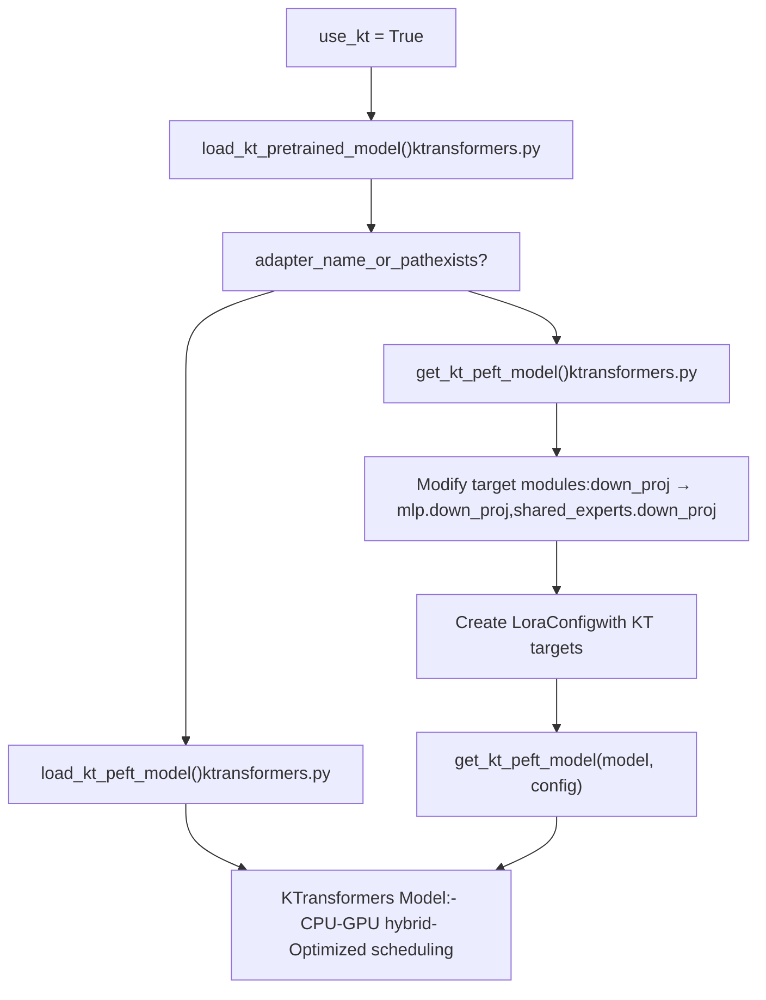
**Special Target Handling:**

For MoE models, KTransformers requires explicit prefixes:

-   `down_proj` → `mlp.down_proj`, `shared_experts.down_proj`
-   `up_proj` → `mlp.up_proj`, `shared_experts.up_proj`
-   `gate_proj` → `mlp.gate_proj`, `shared_experts.gate_proj`

**Sources:** [src/llamafactory/model/adapter.py220-228](https://github.com/hiyouga/LlamaFactory/blob/355d5c5e/src/llamafactory/model/adapter.py#L220-L228) [src/llamafactory/model/model\_utils/ktransformers.py](https://github.com/hiyouga/LlamaFactory/blob/355d5c5e/src/llamafactory/model/model_utils/ktransformers.py)

---

## Integration with Training System

All trainer classes integrate with the adapter system through the model loading pipeline.

### Trainer Integration Points

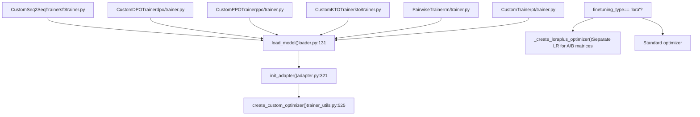
### LoRA+ Optimizer

When using LoRA, the training system can apply LoRA+ which assigns different learning rates to matrices A and B:

```
# LoRA+ configurationFinetuningArguments(    finetuning_type="lora",    loraplus_lr_ratio=16.0,  # lr_B = 16 * lr_A    loraplus_lr_embedding=1e-6  # Separate LR for embeddings)
```
The optimizer groups parameters as:

-   **lora\_a**: Base learning rate (e.g., 3e-4)
-   **lora\_b**: Scaled learning rate (e.g., 16 \* 3e-4 = 4.8e-3)
-   **lora\_b\_nodecay**: Scaled LR without weight decay
-   **embedding**: Fixed LR (1e-6)

**Sources:** [src/llamafactory/train/trainer\_utils.py370-407](https://github.com/hiyouga/LlamaFactory/blob/355d5c5e/src/llamafactory/train/trainer_utils.py#L370-L407)

### Validation and Constraints

The `FinetuningArguments.__post_init__()` method enforces critical constraints:

```
# Cannot mix LoRA with GaLore/APOLLO/BAdamif self.finetuning_type == "lora" and (self.use_galore or self.use_apollo or self.use_badam):    raise ValueError("Cannot use LoRA with GaLore, APOLLO or BAdam together.") # Quantization only works with LoRA/OFTif self.quantization_bit is not None and self.finetuning_type not in ["lora", "oft"]:    raise ValueError("Quantized models can only be used for LoRA or OFT tuning.") # PiSSA restrictionsif self.pissa_init and (self.stage in ["ppo", "kto"] or self.use_ref_model):    raise ValueError("Cannot use PiSSA for current training stage.")
```
**Sources:** [src/llamafactory/hparams/finetuning\_args.py561-568](https://github.com/hiyouga/LlamaFactory/blob/355d5c5e/src/llamafactory/hparams/finetuning_args.py#L561-L568) [src/llamafactory/model/adapter.py334-339](https://github.com/hiyouga/LlamaFactory/blob/355d5c5e/src/llamafactory/model/adapter.py#L334-L339)

---

## Configuration Reference

### Complete Example: QLoRA with Multiple Features

```
from llamafactory.hparams import ModelArguments, FinetuningArguments # Model configuration with quantizationmodel_args = ModelArguments(    model_name_or_path="meta-llama/Llama-2-7b-hf",    quantization_bit=4,    quantization_type="nf4",    double_quantization=True,    adapter_name_or_path="base_adapter,task_adapter",  # Merge base, train task    cache_dir="./cache") # Fine-tuning configurationfinetuning_args = FinetuningArguments(    # Adapter type    finetuning_type="lora",        # LoRA parameters    lora_rank=16,    lora_alpha=32,    lora_dropout=0.05,    lora_target="q_proj,v_proj,k_proj,o_proj,gate_proj,up_proj,down_proj",    additional_target="embed_tokens,lm_head",        # Advanced features    use_rslora=False,    use_dora=False,    pissa_init=False,        # Training stage    stage="sft",        # Optimization    loraplus_lr_ratio=16.0,    loraplus_lr_embedding=1e-6,        # Multi-modal settings    freeze_vision_tower=True,    freeze_multi_modal_projector=True,)
```
### Validation Checklist

| Configuration | Valid | Invalid Combinations |
| --- | --- | --- |
| QLoRA + LoRA | ✅ | ❌ QLoRA + Full/Freeze |
| QLoRA + OFT | ✅ | ❌ QLoRA + Full/Freeze |
| LoRA + GaLore | ❌ | Use one or the other |
| LoRA + BAdam | ❌ | Use one or the other |
| PiSSA + PPO | ❌ | PiSSA only for PT/SFT/RM/DPO |
| DoRA + Quantization | ❌ | DoRA requires BitsAndBytes quantization only |
| Multiple Adapters + Quantization | ✅ | But merging is skipped (last one resumed) |
| Unsloth + Multiple Adapters | ❌ | Unsloth supports single adapter only |
| Unsloth + OFT | ❌ | Unsloth only supports LoRA |

**Sources:** [src/llamafactory/hparams/finetuning\_args.py526-582](https://github.com/hiyouga/LlamaFactory/blob/355d5c5e/src/llamafactory/hparams/finetuning_args.py#L526-L582) [src/llamafactory/model/adapter.py159-367](https://github.com/hiyouga/LlamaFactory/blob/355d5c5e/src/llamafactory/model/adapter.py#L159-L367)

---

## File Reference

### Core Adapter Files

-   **[src/llamafactory/model/adapter.py](https://github.com/hiyouga/LlamaFactory/blob/355d5c5e/src/llamafactory/model/adapter.py)**: Main adapter initialization logic (`init_adapter`, `_setup_lora_tuning`, `_setup_freeze_tuning`, `_setup_full_tuning`)
-   **[src/llamafactory/hparams/finetuning\_args.py](https://github.com/hiyouga/LlamaFactory/blob/355d5c5e/src/llamafactory/hparams/finetuning_args.py)**: Adapter configuration dataclasses (`LoraArguments`, `OFTArguments`, `FreezeArguments`)
-   **[src/llamafactory/hparams/model\_args.py](https://github.com/hiyouga/LlamaFactory/blob/355d5c5e/src/llamafactory/hparams/model_args.py)**: Model loading arguments including adapter paths

### Integration Files

-   **[src/llamafactory/model/loader.py190](https://github.com/hiyouga/LlamaFactory/blob/355d5c5e/src/llamafactory/model/loader.py#L190-L190)**: Calls `init_adapter()` during model loading
-   **[src/llamafactory/model/patcher.py](https://github.com/hiyouga/LlamaFactory/blob/355d5c5e/src/llamafactory/model/patcher.py)**: Model patching before adapter initialization
-   **[src/llamafactory/train/trainer\_utils.py370-407](https://github.com/hiyouga/LlamaFactory/blob/355d5c5e/src/llamafactory/train/trainer_utils.py#L370-L407)**: LoRA+ optimizer creation
-   **[src/llamafactory/train/trainer\_utils.py525-547](https://github.com/hiyouga/LlamaFactory/blob/355d5c5e/src/llamafactory/train/trainer_utils.py#L525-L547)**: Custom optimizer factory

### Utility Files

-   **[src/llamafactory/model/model\_utils/misc.py](https://github.com/hiyouga/LlamaFactory/blob/355d5c5e/src/llamafactory/model/model_utils/misc.py)**: `find_all_linear_modules()`, `find_expanded_modules()`
-   **[src/llamafactory/model/model\_utils/visual.py113-124](https://github.com/hiyouga/LlamaFactory/blob/355d5c5e/src/llamafactory/model/model_utils/visual.py#L113-L124)**: `get_forbidden_modules()`, `patch_target_modules()`
-   **[src/llamafactory/model/model\_utils/unsloth.py](https://github.com/hiyouga/LlamaFactory/blob/355d5c5e/src/llamafactory/model/model_utils/unsloth.py)**: Unsloth-specific adapter handling
-   **[src/llamafactory/model/model\_utils/ktransformers.py](https://github.com/hiyouga/LlamaFactory/blob/355d5c5e/src/llamafactory/model/model_utils/ktransformers.py)**: KTransformers integration
-   **[src/llamafactory/model/model\_utils/quantization.py](https://github.com/hiyouga/LlamaFactory/blob/355d5c5e/src/llamafactory/model/model_utils/quantization.py)**: Quantization configuration for QLoRA
