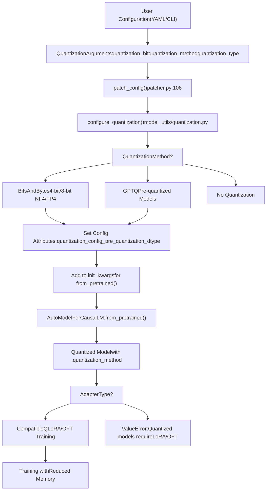
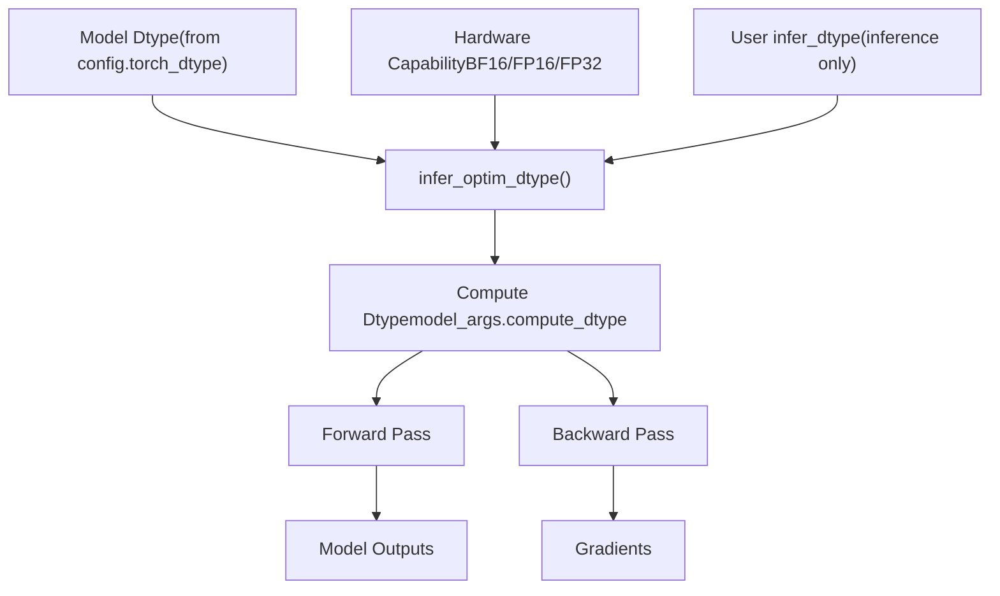
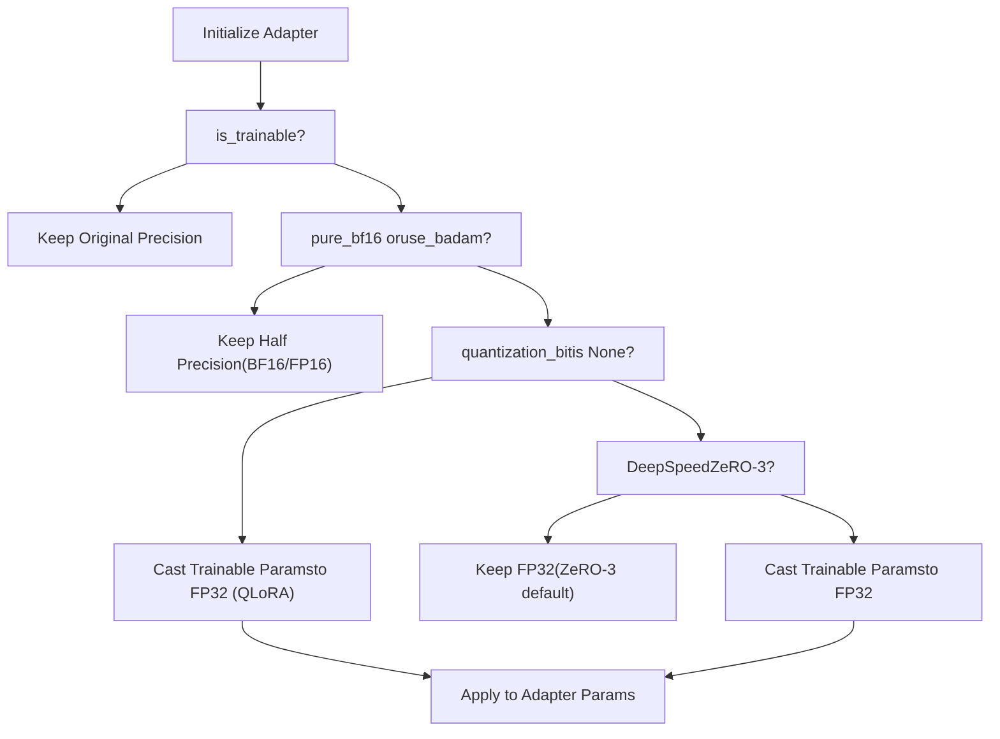

# Quantization and Precision

Relevant source files

-   [src/llamafactory/\_\_init\_\_.py](https://github.com/hiyouga/LlamaFactory/blob/355d5c5e/src/llamafactory/__init__.py)
-   [src/llamafactory/extras/misc.py](https://github.com/hiyouga/LlamaFactory/blob/355d5c5e/src/llamafactory/extras/misc.py)
-   [src/llamafactory/hparams/model\_args.py](https://github.com/hiyouga/LlamaFactory/blob/355d5c5e/src/llamafactory/hparams/model_args.py)
-   [src/llamafactory/model/adapter.py](https://github.com/hiyouga/LlamaFactory/blob/355d5c5e/src/llamafactory/model/adapter.py)
-   [src/llamafactory/model/loader.py](https://github.com/hiyouga/LlamaFactory/blob/355d5c5e/src/llamafactory/model/loader.py)
-   [src/llamafactory/model/model\_utils/longlora.py](https://github.com/hiyouga/LlamaFactory/blob/355d5c5e/src/llamafactory/model/model_utils/longlora.py)
-   [src/llamafactory/model/model\_utils/packing.py](https://github.com/hiyouga/LlamaFactory/blob/355d5c5e/src/llamafactory/model/model_utils/packing.py)
-   [src/llamafactory/model/model\_utils/unsloth.py](https://github.com/hiyouga/LlamaFactory/blob/355d5c5e/src/llamafactory/model/model_utils/unsloth.py)
-   [src/llamafactory/model/patcher.py](https://github.com/hiyouga/LlamaFactory/blob/355d5c5e/src/llamafactory/model/patcher.py)

## Purpose and Scope

This page documents LlamaFactory's quantization and precision systems, which enable efficient model loading and training with reduced memory footprint. It covers:

-   Quantization methods (4-bit, 8-bit) and their configuration
-   Precision modes (FP16, BF16, FP32) for training and inference
-   Automatic dtype selection and hardware compatibility
-   Compatibility constraints between quantization and fine-tuning methods

For information about adapter systems that work with quantized models, see [Adapter System](/hiyouga/LlamaFactory/5.2-adapter-system-(loraqloraoft)). For attention mechanism optimizations, see [Attention Mechanisms and Optimizations](/hiyouga/LlamaFactory/5.4-attention-mechanisms-and-optimizations).

---

## Overview

LlamaFactory supports two primary quantization approaches:

1.  **On-the-fly quantization** during model loading using BitsAndBytes or GPTQ
2.  **Post-training quantization** for model export

Quantization reduces model memory usage by representing weights in lower precision formats (4-bit or 8-bit instead of 16-bit or 32-bit). This enables training and inference of large language models on consumer hardware.

The system automatically selects appropriate compute precision based on hardware capabilities and user configuration, balancing performance with numerical stability.

**Sources:** [src/llamafactory/hparams/model\_args.py278-301](https://github.com/hiyouga/LlamaFactory/blob/355d5c5e/src/llamafactory/hparams/model_args.py#L278-L301) [src/llamafactory/extras/misc.py214-222](https://github.com/hiyouga/LlamaFactory/blob/355d5c5e/src/llamafactory/extras/misc.py#L214-L222)

---

## Quantization Configuration Flow

The following diagram illustrates how quantization settings flow through the model loading pipeline:


**Sources:** [src/llamafactory/model/patcher.py106-127](https://github.com/hiyouga/LlamaFactory/blob/355d5c5e/src/llamafactory/model/patcher.py#L106-L127) [src/llamafactory/model/adapter.py334-340](https://github.com/hiyouga/LlamaFactory/blob/355d5c5e/src/llamafactory/model/adapter.py#L334-L340) [src/llamafactory/model/loader.py131-142](https://github.com/hiyouga/LlamaFactory/blob/355d5c5e/src/llamafactory/model/loader.py#L131-L142)

---

## Quantization Methods

### BitsAndBytes (BNB)

BitsAndBytes is the default and most commonly used quantization method, providing dynamic quantization during model loading.

**Key Features:**

-   **4-bit quantization**: Reduces memory by ~75% compared to FP16
-   **8-bit quantization**: Reduces memory by ~50% with better precision
-   **NF4 vs FP4 data types**: NormalFloat4 (default) or Float4
-   **Double quantization**: Further compresses quantization constants

**Configuration:**

| Parameter | Type | Default | Description |
| --- | --- | --- | --- |
| `quantization_method` | `QuantizationMethod` | `BNB` | Quantization backend |
| `quantization_bit` | `int` | `None` | 4 or 8 for quantization |
| `quantization_type` | `str` | `"nf4"` | `"nf4"` or `"fp4"` |
| `double_quantization` | `bool` | `True` | Quantize quantization constants |
| `quantization_device_map` | `str` | `None` | Device map for 4-bit models |

**Example Configuration (YAML):**

```
model_name_or_path: meta-llama/Llama-2-7b-hfquantization_bit: 4quantization_type: nf4double_quantization: true
```
**Sources:** [src/llamafactory/hparams/model\_args.py278-301](https://github.com/hiyouga/LlamaFactory/blob/355d5c5e/src/llamafactory/hparams/model_args.py#L278-L301)

---

### GPTQ

GPTQ is a post-training quantization method for pre-quantized models. Unlike BNB, GPTQ quantization happens once during model preparation, not during loading.

**Usage:**

-   Load pre-quantized GPTQ models from Hugging Face Hub
-   Typically used for inference rather than training
-   Requires models already quantized with GPTQ

**Sources:** [src/llamafactory/hparams/model\_args.py281-283](https://github.com/hiyouga/LlamaFactory/blob/355d5c5e/src/llamafactory/hparams/model_args.py#L281-L283)

---

### Memory and Performance Impact

The following table shows approximate memory savings for a 7B parameter model:

| Precision | Memory Usage | Relative to FP16 | Training Speed |
| --- | --- | --- | --- |
| FP32 | ~28 GB | 2× | Slowest |
| FP16/BF16 | ~14 GB | 1× (baseline) | Fast |
| 8-bit | ~7 GB | 0.5× | Moderate |
| 4-bit NF4 | ~3.5 GB | 0.25× | Moderate |

**Note:** Training speeds depend on hardware acceleration support for quantized operations.

**Sources:** [src/llamafactory/extras/misc.py117-141](https://github.com/hiyouga/LlamaFactory/blob/355d5c5e/src/llamafactory/extras/misc.py#L117-L141)

---

## Precision Modes

### Data Type Selection

LlamaFactory distinguishes between three precision concepts:

1.  **Model dtype**: The precision of stored model weights
2.  **Compute dtype**: The precision used during forward/backward passes
3.  **Inference dtype**: The precision for inference-only operations


**Sources:** [src/llamafactory/model/patcher.py113-118](https://github.com/hiyouga/LlamaFactory/blob/355d5c5e/src/llamafactory/model/patcher.py#L113-L118) [src/llamafactory/extras/misc.py214-222](https://github.com/hiyouga/LlamaFactory/blob/355d5c5e/src/llamafactory/extras/misc.py#L214-L222)

---

### Automatic Dtype Inference

The `infer_optim_dtype()` function automatically selects the best precision based on hardware:

**Selection Priority:**

1.  **BFloat16** if:
    -   Hardware supports BF16 (modern NVIDIA GPUs, NPUs)
    -   Model is already in BF16 or dtype is unspecified
2.  **Float16** if:
    -   Hardware supports FP16 (CUDA, NPU)
    -   BF16 not available
3.  **Float32** as fallback

**Implementation:**

[src/llamafactory/extras/misc.py214-222](https://github.com/hiyouga/LlamaFactory/blob/355d5c5e/src/llamafactory/extras/misc.py#L214-L222)

```
def infer_optim_dtype(model_dtype: Optional["torch.dtype"]) -> "torch.dtype":    r"""Infer the optimal dtype according to the model_dtype and device compatibility."""    if _is_bf16_available and (model_dtype == torch.bfloat16 or model_dtype is None):        return torch.bfloat16    elif _is_fp16_available:        return torch.float16    else:        return torch.float32
```
**Hardware Detection:**

[src/llamafactory/extras/misc.py41-45](https://github.com/hiyouga/LlamaFactory/blob/355d5c5e/src/llamafactory/extras/misc.py#L41-L45)

```
_is_fp16_available = is_torch_npu_available() or is_torch_cuda_available()try:    _is_bf16_available = is_torch_bf16_gpu_available() or (is_torch_npu_available() and torch.npu.is_bf16_supported())except Exception:    _is_bf16_available = False
```
**Sources:** [src/llamafactory/extras/misc.py41-45](https://github.com/hiyouga/LlamaFactory/blob/355d5c5e/src/llamafactory/extras/misc.py#L41-L45) [src/llamafactory/extras/misc.py214-222](https://github.com/hiyouga/LlamaFactory/blob/355d5c5e/src/llamafactory/extras/misc.py#L214-L222)

---

### Inference Dtype Configuration

For inference-only scenarios, users can override the automatic selection:

| `infer_dtype` Value | Behavior |
| --- | --- |
| `"auto"` (default) | Uses `infer_optim_dtype()` logic |
| `"float16"` | Force FP16 precision |
| `"bfloat16"` | Force BF16 precision |
| `"float32"` | Force FP32 precision |

**Configuration Location:**

[src/llamafactory/model/patcher.py113-118](https://github.com/hiyouga/LlamaFactory/blob/355d5c5e/src/llamafactory/model/patcher.py#L113-L118)

```
if model_args.compute_dtype is None:  # priority: bf16 > fp16 > fp32    if model_args.infer_dtype != "auto" and not is_trainable:        model_args.compute_dtype = getattr(torch, model_args.infer_dtype)    else:        model_args.compute_dtype = infer_optim_dtype(model_dtype=getattr(config, "torch_dtype", None))
```
**Sources:** [src/llamafactory/hparams/model\_args.py180-183](https://github.com/hiyouga/LlamaFactory/blob/355d5c5e/src/llamafactory/hparams/model_args.py#L180-L183) [src/llamafactory/model/patcher.py113-118](https://github.com/hiyouga/LlamaFactory/blob/355d5c5e/src/llamafactory/model/patcher.py#L113-L118)

---

## Compatibility Constraints

### Quantization with Fine-Tuning Methods

Quantized models have strict compatibility requirements with fine-tuning methods:

**Compatibility Matrix:**

| Fine-Tuning Method | 4-bit Quantization | 8-bit Quantization | Notes |
| --- | --- | --- | --- |
| LoRA | ✅ Yes (QLoRA) | ✅ Yes | Recommended for quantized models |
| OFT | ✅ Yes | ✅ Yes | Supported |
| Freeze Tuning | ❌ No | ❌ No | Requires full precision |
| Full Fine-Tuning | ❌ No | ❌ No | Requires full precision |

**Validation Logic:**

[src/llamafactory/model/adapter.py334-340](https://github.com/hiyouga/LlamaFactory/blob/355d5c5e/src/llamafactory/model/adapter.py#L334-L340)

```
if is_trainable and getattr(model, "quantization_method", None) is not None:    if finetuning_args.finetuning_type not in ["lora", "oft"]:        raise ValueError("Quantized models can only be used for the LoRA or OFT tuning.")     if finetuning_args.pissa_init:        raise ValueError("Cannot initialize PiSSA adapter on quantized models.")
```
**Sources:** [src/llamafactory/model/adapter.py334-340](https://github.com/hiyouga/LlamaFactory/blob/355d5c5e/src/llamafactory/model/adapter.py#L334-L340)

---

### DoRA Compatibility

DoRA (Weight-Decomposed Low-Rank Adaptation) has additional constraints:

[src/llamafactory/model/adapter.py235-240](https://github.com/hiyouga/LlamaFactory/blob/355d5c5e/src/llamafactory/model/adapter.py#L235-L240)

```
if (    finetuning_args.use_dora    and getattr(model, "quantization_method", None) is not None    and getattr(model, "quantization_method", None) != QuantizationMethod.BNB):    raise ValueError("DoRA is not compatible with PTQ-quantized models.")
```
**Compatibility:**

-   ✅ DoRA + BitsAndBytes quantization
-   ❌ DoRA + GPTQ or other PTQ methods

**Sources:** [src/llamafactory/model/adapter.py235-240](https://github.com/hiyouga/LlamaFactory/blob/355d5c5e/src/llamafactory/model/adapter.py#L235-L240)

---

### Multi-Adapter Constraints

Quantized models have restrictions when using multiple adapters:

[src/llamafactory/model/adapter.py161-167](https://github.com/hiyouga/LlamaFactory/blob/355d5c5e/src/llamafactory/model/adapter.py#L161-L167)

```
if model_args.adapter_name_or_path is not None:    is_mergeable = True    if getattr(model, "quantization_method", None):  # merge lora in quantized model is unstable        assert len(model_args.adapter_name_or_path) == 1, "Quantized model only accepts a single adapter."        is_mergeable = False     if is_deepspeed_zero3_enabled():        assert len(model_args.adapter_name_or_path) == 1, "Cannot use multiple adapters in DeepSpeed ZeRO-3."        is_mergeable = False
```
**Restrictions:**

-   Only **one adapter** can be loaded with quantized models
-   Adapter merging is **disabled** for quantized models (unstable)
-   DeepSpeed ZeRO-3 also restricts to single adapter

**Sources:** [src/llamafactory/model/adapter.py161-172](https://github.com/hiyouga/LlamaFactory/blob/355d5c5e/src/llamafactory/model/adapter.py#L161-L172)

---

## Special Precision Handling

### Parameter Counting with Quantization

The system accounts for quantization when counting parameters:

[src/llamafactory/extras/misc.py126-136](https://github.com/hiyouga/LlamaFactory/blob/355d5c5e/src/llamafactory/extras/misc.py#L126-L136)

```
# Due to the design of 4bit linear layers from bitsandbytes, multiply the number of parameters by itemsizeif param.__class__.__name__ == "Params4bit":    if hasattr(param, "quant_storage") and hasattr(param.quant_storage, "itemsize"):        num_bytes = param.quant_storage.itemsize    elif hasattr(param, "element_size"):  # for older pytorch version        num_bytes = param.element_size()    else:        num_bytes = 1     num_params = num_params * 2 * num_bytes
```
**Purpose:** Accurately reports memory usage for 4-bit quantized parameters.

**Sources:** [src/llamafactory/extras/misc.py117-141](https://github.com/hiyouga/LlamaFactory/blob/355d5c5e/src/llamafactory/extras/misc.py#L117-L141)

---

### Trainable Parameter Casting

During training setup, the system may upcast trainable parameters to FP32 for numerical stability:


**Logic:**

[src/llamafactory/model/adapter.py341-353](https://github.com/hiyouga/LlamaFactory/blob/355d5c5e/src/llamafactory/model/adapter.py#L341-L353)

```
cast_trainable_params_to_fp32 = Falseif not is_trainable:    passelif finetuning_args.pure_bf16 or finetuning_args.use_badam:    logger.info_rank0("Pure bf16 / BAdam detected, remaining trainable params in half precision.")elif model_args.quantization_bit is None and is_deepspeed_zero3_enabled():    logger.info_rank0("DeepSpeed ZeRO3 detected, remaining trainable params in float32.")else:    logger.info_rank0("Upcasting trainable params to float32.")    cast_trainable_params_to_fp32 = True
```
**Rationale:** FP32 trainable parameters prevent gradient underflow during backpropagation, especially important for QLoRA where frozen weights are in 4-bit.

**Sources:** [src/llamafactory/model/adapter.py341-353](https://github.com/hiyouga/LlamaFactory/blob/355d5c5e/src/llamafactory/model/adapter.py#L341-L353) [src/llamafactory/model/adapter.py314-316](https://github.com/hiyouga/LlamaFactory/blob/355d5c5e/src/llamafactory/model/adapter.py#L314-L316)

---

## Implementation Reference

### Key Code Entities

| Component | Location | Purpose |
| --- | --- | --- |
| `QuantizationArguments` | [model\_args.py278-301](https://github.com/hiyouga/LlamaFactory/blob/355d5c5e/model_args.py#L278-L301) | Configuration dataclass for quantization |
| `infer_optim_dtype()` | [misc.py214-222](https://github.com/hiyouga/LlamaFactory/blob/355d5c5e/misc.py#L214-L222) | Automatic precision selection |
| `configure_quantization()` | [patcher.py122](https://github.com/hiyouga/LlamaFactory/blob/355d5c5e/patcher.py#L122-L122) | Applies quantization to model config |
| `patch_config()` | [patcher.py106-127](https://github.com/hiyouga/LlamaFactory/blob/355d5c5e/patcher.py#L106-L127) | Orchestrates all model patching |
| `count_parameters()` | [misc.py117-141](https://github.com/hiyouga/LlamaFactory/blob/355d5c5e/misc.py#L117-L141) | Accounts for quantized param sizes |
| Adapter validation | [adapter.py334-340](https://github.com/hiyouga/LlamaFactory/blob/355d5c5e/adapter.py#L334-L340) | Enforces compatibility constraints |

**Sources:** [src/llamafactory/hparams/model\_args.py278-301](https://github.com/hiyouga/LlamaFactory/blob/355d5c5e/src/llamafactory/hparams/model_args.py#L278-L301) [src/llamafactory/extras/misc.py214-222](https://github.com/hiyouga/LlamaFactory/blob/355d5c5e/src/llamafactory/extras/misc.py#L214-L222) [src/llamafactory/model/patcher.py106-127](https://github.com/hiyouga/LlamaFactory/blob/355d5c5e/src/llamafactory/model/patcher.py#L106-L127) [src/llamafactory/model/adapter.py334-340](https://github.com/hiyouga/LlamaFactory/blob/355d5c5e/src/llamafactory/model/adapter.py#L334-L340)

---

## Configuration Examples

### QLoRA Training (4-bit)

**YAML Configuration:**

```
model_name_or_path: meta-llama/Llama-2-7b-hfquantization_bit: 4quantization_type: nf4double_quantization: true # Must use LoRA or OFT with quantizationfinetuning_type: loralora_rank: 8lora_target: all
```
**CLI Equivalent:**

```
llamafactory-cli train \  --model_name_or_path meta-llama/Llama-2-7b-hf \  --quantization_bit 4 \  --quantization_type nf4 \  --double_quantization \  --finetuning_type lora \  --lora_rank 8 \  --lora_target all
```
**Sources:** [src/llamafactory/hparams/model\_args.py278-301](https://github.com/hiyouga/LlamaFactory/blob/355d5c5e/src/llamafactory/hparams/model_args.py#L278-L301)

---

### 8-bit Training

**YAML Configuration:**

```
model_name_or_path: meta-llama/Llama-2-13b-hfquantization_bit: 8 finetuning_type: loralora_rank: 16
```
**Note:** 8-bit quantization provides better precision than 4-bit at the cost of ~2× memory usage compared to 4-bit.

---

### Inference with Custom Precision

**YAML Configuration:**

```
model_name_or_path: meta-llama/Llama-2-7b-hfadapter_name_or_path: path/to/lora/adapterinfer_dtype: bfloat16
```
**Note:** `infer_dtype` only applies during inference (non-trainable mode). During training, precision is determined by hardware capabilities and training configuration.

**Sources:** [src/llamafactory/hparams/model\_args.py180-183](https://github.com/hiyouga/LlamaFactory/blob/355d5c5e/src/llamafactory/hparams/model_args.py#L180-L183)

---

## Best Practices

### Memory-Efficient Training

1.  **Use 4-bit quantization** for models >7B parameters on consumer GPUs
2.  **Enable double quantization** for additional 0.4GB savings per 7B parameters
3.  **Use NF4** (NormalFloat4) over FP4 for better quality
4.  **Combine with gradient checkpointing** for further memory reduction

### Precision Selection

1.  **BFloat16 is preferred** when available:

    -   Better numerical stability than FP16
    -   No loss scaling required
    -   Supported on A100, H100, NPUs
2.  **Use FP32 for debugging** to eliminate precision-related issues

3.  **Avoid mixing precisions manually** - let automatic selection work


### Compatibility

1.  **Always use LoRA or OFT** with quantized models
2.  **Avoid PiSSA initialization** with quantization
3.  **Load only one adapter** when using quantization
4.  **Do not merge adapters** with quantized base models

**Sources:** [src/llamafactory/model/adapter.py334-340](https://github.com/hiyouga/LlamaFactory/blob/355d5c5e/src/llamafactory/model/adapter.py#L334-L340) [src/llamafactory/extras/misc.py214-222](https://github.com/hiyouga/LlamaFactory/blob/355d5c5e/src/llamafactory/extras/misc.py#L214-L222)
