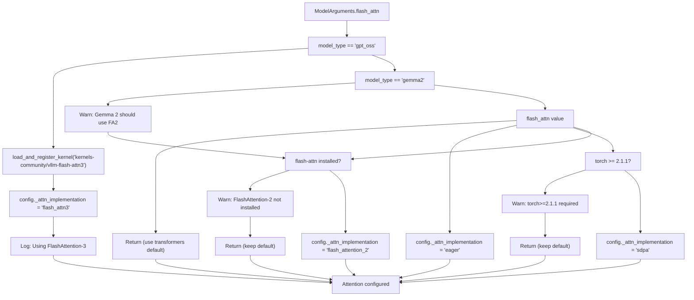
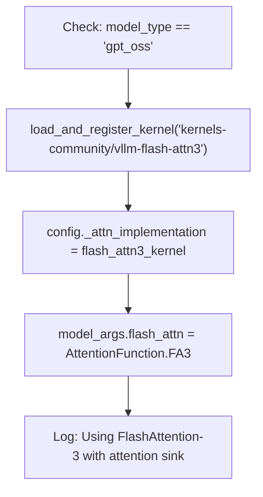
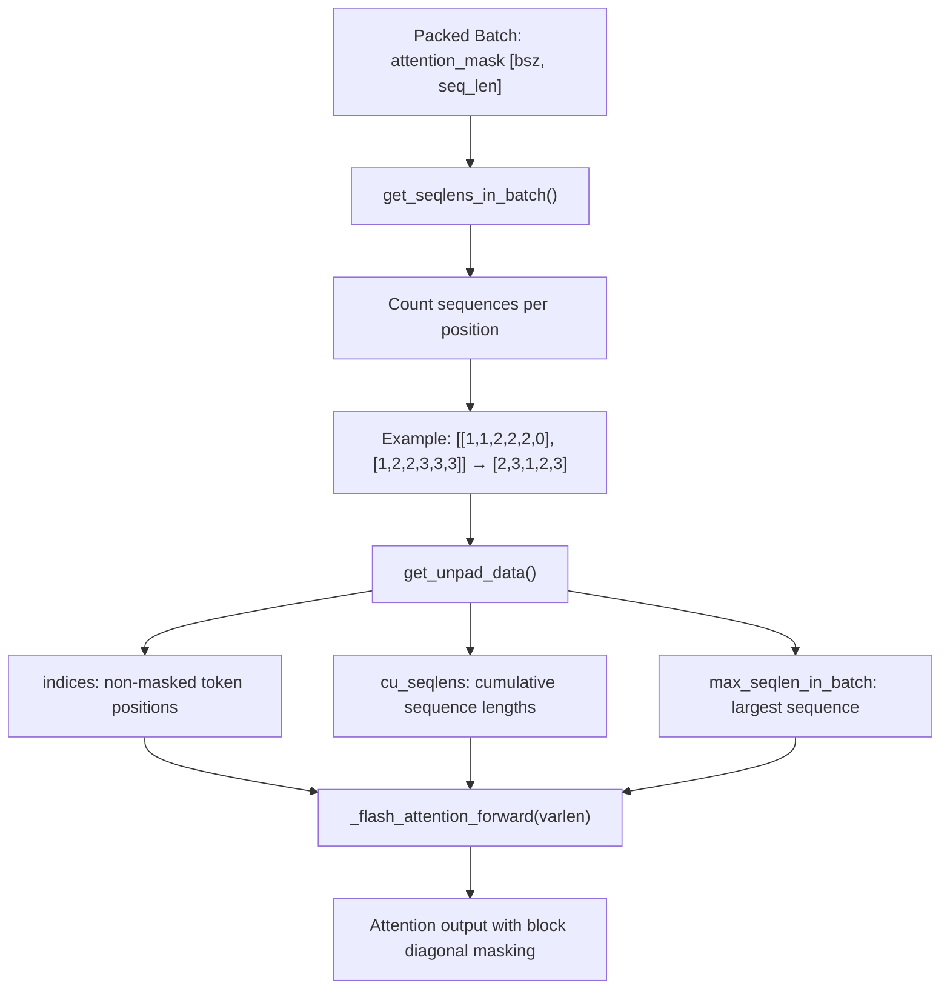
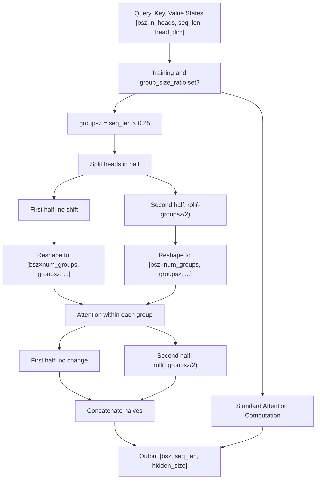
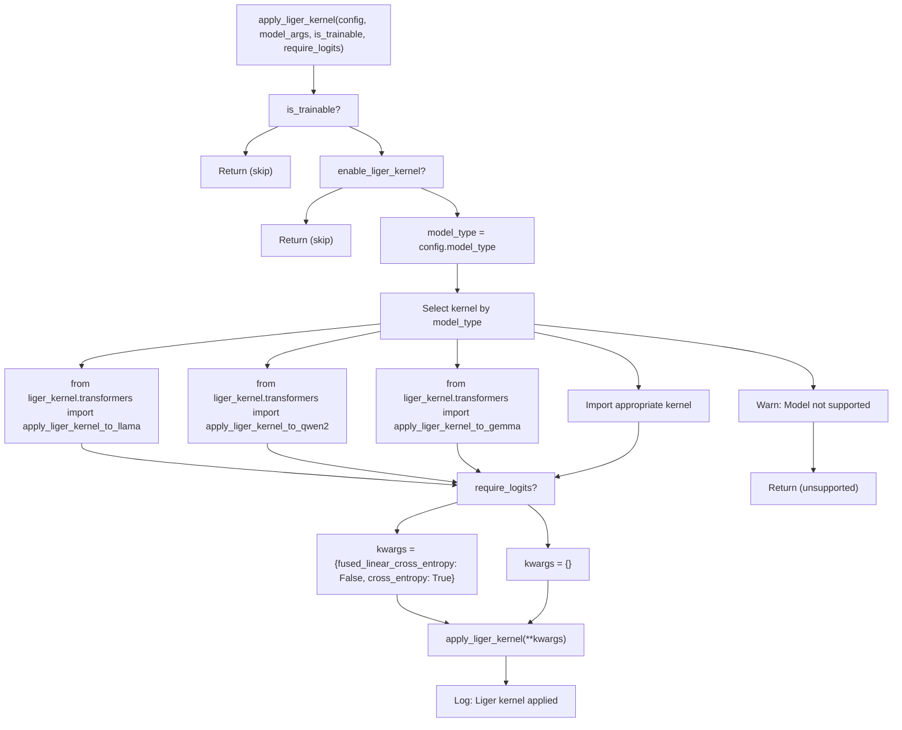
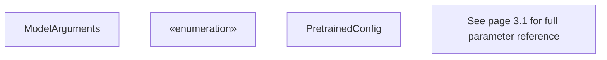

# Attention Mechanisms and Optimizations

Relevant source files

-   [src/llamafactory/\_\_init\_\_.py](https://github.com/hiyouga/LlamaFactory/blob/355d5c5e/src/llamafactory/__init__.py)
-   [src/llamafactory/extras/env.py](https://github.com/hiyouga/LlamaFactory/blob/355d5c5e/src/llamafactory/extras/env.py)
-   [src/llamafactory/extras/misc.py](https://github.com/hiyouga/LlamaFactory/blob/355d5c5e/src/llamafactory/extras/misc.py)
-   [src/llamafactory/extras/packages.py](https://github.com/hiyouga/LlamaFactory/blob/355d5c5e/src/llamafactory/extras/packages.py)
-   [src/llamafactory/model/model\_utils/attention.py](https://github.com/hiyouga/LlamaFactory/blob/355d5c5e/src/llamafactory/model/model_utils/attention.py)
-   [src/llamafactory/model/model\_utils/liger\_kernel.py](https://github.com/hiyouga/LlamaFactory/blob/355d5c5e/src/llamafactory/model/model_utils/liger_kernel.py)
-   [src/llamafactory/model/model\_utils/longlora.py](https://github.com/hiyouga/LlamaFactory/blob/355d5c5e/src/llamafactory/model/model_utils/longlora.py)
-   [src/llamafactory/model/model\_utils/moe.py](https://github.com/hiyouga/LlamaFactory/blob/355d5c5e/src/llamafactory/model/model_utils/moe.py)
-   [src/llamafactory/model/model\_utils/packing.py](https://github.com/hiyouga/LlamaFactory/blob/355d5c5e/src/llamafactory/model/model_utils/packing.py)
-   [src/llamafactory/model/model\_utils/valuehead.py](https://github.com/hiyouga/LlamaFactory/blob/355d5c5e/src/llamafactory/model/model_utils/valuehead.py)
-   [src/llamafactory/train/callbacks.py](https://github.com/hiyouga/LlamaFactory/blob/355d5c5e/src/llamafactory/train/callbacks.py)

## Purpose and Scope

This document describes LlamaFactory's attention mechanism implementations and performance optimizations for training and inference. It covers:

-   Attention backend selection (FlashAttention-2, SDPA, eager)
-   Sequence packing with block diagonal attention masks
-   LongLoRA's shift-short attention for extended context
-   Liger Kernel integration for memory-efficient operations

For model loading and adapter configuration, see [Model Loading Pipeline](/hiyouga/LlamaFactory/5.1-model-loading-pipeline). For quantization settings, see [Quantization and Precision](/hiyouga/LlamaFactory/5.3-quantization-and-precision). For performance techniques like gradient checkpointing, see [Performance Optimization](/hiyouga/LlamaFactory/9.3-performance-optimization).

---

## Attention Implementation Selection

LlamaFactory supports multiple attention backends to balance speed, memory efficiency, and compatibility. The `flash_attn` parameter in `ModelArguments` controls which implementation is used.

### Supported Attention Types

The `AttentionFunction` enum in `src/llamafactory/extras/constants.py` defines available implementations:

| Attention Type | Value | Description | Requirements |
| --- | --- | --- | --- |
| `AUTO` | `"auto"` | Let transformers auto-select | None |
| `DISABLED` | `"disabled"` | Force eager attention | None |
| `SDPA` | `"sdpa"` | PyTorch scaled dot-product attention | `torch>=2.1.1` |
| `FA2` | `"fa2"` | FlashAttention-2 | `flash-attn` package or NPU |
| `FA3` | `"fa3"` | FlashAttention-3 | GPT-OSS model only |

### Configuration Flow


**Sources:** [src/llamafactory/model/model\_utils/attention.py31-90](https://github.com/hiyouga/LlamaFactory/blob/355d5c5e/src/llamafactory/model/model_utils/attention.py#L31-L90)

### Implementation Details

The `configure_attn_implementation` function in `attention.py` handles attention backend selection:

1.  **Special Cases:**

    -   GPT-OSS models automatically use FlashAttention-3 with attention sink via Hub Kernels [src/llamafactory/model/model\_utils/attention.py34-44](https://github.com/hiyouga/LlamaFactory/blob/355d5c5e/src/llamafactory/model/model_utils/attention.py#L34-L44)
    -   Gemma-2 models require FlashAttention-2 for soft-capping attention support [src/llamafactory/model/model\_utils/attention.py46-58](https://github.com/hiyouga/LlamaFactory/blob/355d5c5e/src/llamafactory/model/model_utils/attention.py#L46-L58)
    -   InternLM2 models use custom `attn_implementation` config field [src/llamafactory/model/model\_utils/attention.py83-84](https://github.com/hiyouga/LlamaFactory/blob/355d5c5e/src/llamafactory/model/model_utils/attention.py#L83-L84)
2.  **Configuration Target:**

    -   Most models: Set `config._attn_implementation` [src/llamafactory/model/model\_utils/attention.py89](https://github.com/hiyouga/LlamaFactory/blob/355d5c5e/src/llamafactory/model/model_utils/attention.py#L89-L89)
    -   InternLM2: Set `config.attn_implementation` [src/llamafactory/model/model\_utils/attention.py84](https://github.com/hiyouga/LlamaFactory/blob/355d5c5e/src/llamafactory/model/model_utils/attention.py#L84-L84)
    -   Multimodal models: Set both vision and text configs [src/llamafactory/model/model\_utils/attention.py85-87](https://github.com/hiyouga/LlamaFactory/blob/355d5c5e/src/llamafactory/model/model_utils/attention.py#L85-L87)
3.  **Logging:**

    -   `print_attn_implementation` logs the selected backend after model loading [src/llamafactory/model/model\_utils/attention.py92-103](https://github.com/hiyouga/LlamaFactory/blob/355d5c5e/src/llamafactory/model/model_utils/attention.py#L92-L103)

**Sources:** [src/llamafactory/model/model\_utils/attention.py1-104](https://github.com/hiyouga/LlamaFactory/blob/355d5c5e/src/llamafactory/model/model_utils/attention.py#L1-L104)

---

## FlashAttention Support

FlashAttention is a fast and memory-efficient attention algorithm that provides significant speedups for training and inference.

### FlashAttention-2

FlashAttention-2 is the standard fast attention implementation supported across most model architectures.

**Requirements:**

-   Install `flash-attn` package: `pip install flash-attn`
-   OR use Ascend NPU (auto-detected)

**Usage:**

```
# In config YAMLmodel_name_or_path: meta-llama/Llama-3-8Bflash_attn: fa2
```
**Detection Logic:**

```
from transformers.utils import is_flash_attn_2_availablefrom transformers import is_torch_npu_available if is_flash_attn_2_available() or is_torch_npu_available():    # FlashAttention-2 available
```
**Sources:** [src/llamafactory/model/model\_utils/attention.py72-79](https://github.com/hiyouga/LlamaFactory/blob/355d5c5e/src/llamafactory/model/model_utils/attention.py#L72-L79)

### FlashAttention-3

FlashAttention-3 is automatically used for GPT-OSS models and includes attention sink optimization.

**Automatic Activation:**


**Sources:** [src/llamafactory/model/model\_utils/attention.py34-44](https://github.com/hiyouga/LlamaFactory/blob/355d5c5e/src/llamafactory/model/model_utils/attention.py#L34-L44)

### Model-Specific Considerations

**Gemma-2:**

-   Must use FlashAttention-2 for soft-capping attention
-   SDPA not supported (loses soft-capping)
-   Warning issued if SDPA is selected [src/llamafactory/model/model\_utils/attention.py46-58](https://github.com/hiyouga/LlamaFactory/blob/355d5c5e/src/llamafactory/model/model_utils/attention.py#L46-L58)

---

## SDPA (Scaled Dot-Product Attention)

PyTorch's built-in `torch.nn.functional.scaled_dot_product_attention` provides hardware-accelerated attention without external dependencies.

### Configuration

**Requirements:**

-   PyTorch >= 2.1.1

**Usage:**

```
model_name_or_path: meta-llama/Llama-3-8Bflash_attn: sdpa
```
**Implementation:**

```
# Validates PyTorch versionif not is_torch_version_greater_than("2.1.1"):    logger.warning_rank0("torch>=2.1.1 is required for SDPA attention.")    return requested_attn_implementation = "sdpa"setattr(config, "_attn_implementation", requested_attn_implementation)
```
**Benefits:**

-   No external dependencies (built into PyTorch)
-   Hardware-specific optimizations (CUDA, Metal, etc.)
-   Faster than eager attention

**Limitations:**

-   Does not support all attention variants (e.g., Gemma-2's soft-capping)

**Sources:** [src/llamafactory/model/model\_utils/attention.py66-71](https://github.com/hiyouga/LlamaFactory/blob/355d5c5e/src/llamafactory/model/model_utils/attention.py#L66-L71)

---

## Sequence Packing with Block Diagonal Attention

Sequence packing combines multiple training examples into a single sequence to maximize GPU utilization. Block diagonal attention ensures examples don't attend to each other.

### Overview

Traditional padding wastes computation on padding tokens. Sequence packing concatenates multiple sequences and uses 4D attention masks to prevent cross-sequence attention:

```
Traditional (wasteful):
[Example 1      PAD PAD PAD]
[Example 2          PAD PAD]

Packed (efficient):
[Example 1 Example 2 Example 3]
         ↑           ↑
    Block diagonal attention prevents cross-attention
```
### Configuration

Enable sequence packing with:

```
packing: trueblock_diag_attn: true  # Required for correct attention
```
**Warning:** Setting `packing: true` without `block_diag_attn: true` will cause examples to attend to each other incorrectly.

### Implementation

#### Attention Mask Processing

The packing system modifies how attention masks are processed by FlashAttention's variable-length functions:


**Sources:** [src/llamafactory/model/model\_utils/packing.py55-107](https://github.com/hiyouga/LlamaFactory/blob/355d5c5e/src/llamafactory/model/model_utils/packing.py#L55-L107)

#### Key Functions

**`get_seqlens_in_batch(attention_mask)`** [src/llamafactory/model/model\_utils/packing.py55-78](https://github.com/hiyouga/LlamaFactory/blob/355d5c5e/src/llamafactory/model/model_utils/packing.py#L55-L78)

Extracts sequence lengths from packed attention mask:

```
# Input attention_mask uses integers to mark different sequences:# [[1, 1, 2, 2, 2, 0],  # seq 1: length 2, seq 2: length 3#  [1, 2, 2, 3, 3, 3]]  # seq 1: length 1, seq 2: length 2, seq 3: length 3 # Output: [2, 3, 1, 2, 3]
```
**`get_unpad_data(attention_mask)`** [src/llamafactory/model/model\_utils/packing.py81-107](https://github.com/hiyouga/LlamaFactory/blob/355d5c5e/src/llamafactory/model/model_utils/packing.py#L81-L107)

Prepares data for FlashAttention's variable-length interface:

```
# Returns:# - indices: [0, 1, 2, 3, 4, 6, 7, 8, 9, 10, 11] (non-masked positions)# - cu_seqlens: [0, 2, 5, 6, 8, 11] (cumulative lengths)# - max_seqlen_in_batch: 3 (longest sequence)
```
#### Integration

The modified `get_unpad_data` function replaces the default implementation:

```
def configure_packing(model_args: "ModelArguments", is_trainable: bool) -> None:    if not is_trainable or not model_args.block_diag_attn:        return     import transformers.modeling_flash_attention_utils    transformers.modeling_flash_attention_utils._get_unpad_data = get_unpad_data    logger.info_rank0("Using block diagonal attention for sequence packing without cross-attention.")
```
**Sources:** [src/llamafactory/model/model\_utils/packing.py110-117](https://github.com/hiyouga/LlamaFactory/blob/355d5c5e/src/llamafactory/model/model_utils/packing.py#L110-L117)

### Data Collation

The data collator creates 4D attention masks when packing is enabled. See [Data Collation and Batching](/hiyouga/LlamaFactory/4.4-data-collation-and-batching) for details on how attention masks are constructed.

---

## LongLoRA / Shift-Short Attention

LongLoRA enables efficient fine-tuning on extended context lengths by using shift-short attention (S²-Attn), which reduces computational complexity during training.

### Concept

Shift-Short Attention splits attention heads into two groups and shifts half of them to enable efficient attention over long sequences:

```
Standard attention: O(n²) where n = sequence length

Shift-Short Attention:
1. Split sequence into groups (e.g., 4 groups of 2048 tokens each)
2. Half the heads attend within groups (complexity: O((n/4)²) per group)
3. Other half of heads are shifted and attend within groups
4. Shift back after attention to maintain information flow

Effective complexity: ~O(n²/4) during training
```
### Configuration

Enable LongLoRA with:

```
model_name_or_path: meta-llama/Llama-3-8Bshift_attn: truecutoff_len: 8192  # Extended context length
```
**Supported Models:** Only models in `SUPPORTED_CLASS_FOR_S2ATTN` constant (primarily LLaMA-family models) support this feature. [src/llamafactory/model/model\_utils/longlora.py365-370](https://github.com/hiyouga/LlamaFactory/blob/355d5c5e/src/llamafactory/model/model_utils/longlora.py#L365-L370)

### Implementation

#### Configuration

```
def configure_longlora(config: "PretrainedConfig", model_args: "ModelArguments", is_trainable: bool) -> None:    if not is_trainable or not model_args.shift_attn:        return        if getattr(config, "model_type", None) in SUPPORTED_CLASS_FOR_S2ATTN:        setattr(config, "group_size_ratio", 0.25)  # Use 1/4 of sequence as group size        _apply_llama_patch()
```
**Sources:** [src/llamafactory/model/model\_utils/longlora.py359-370](https://github.com/hiyouga/LlamaFactory/blob/355d5c5e/src/llamafactory/model/model_utils/longlora.py#L359-L370)

#### Shift-Short Attention Mechanism


**Sources:** [src/llamafactory/model/model\_utils/longlora.py91-136](https://github.com/hiyouga/LlamaFactory/blob/355d5c5e/src/llamafactory/model/model_utils/longlora.py#L91-L136)

#### Attention Forward Implementations

LongLoRA patches three attention implementations in LLaMA models:

**1\. Eager Attention** (`LlamaAttention.forward`) [src/llamafactory/model/model\_utils/longlora.py56-136](https://github.com/hiyouga/LlamaFactory/blob/355d5c5e/src/llamafactory/model/model_utils/longlora.py#L56-L136)

```
if getattr(self.config, "group_size_ratio", None) and self.training:    groupsz = int(q_len * getattr(self.config, "group_size_ratio"))    num_groups = q_len // groupsz        def shift(state):        state = state.transpose(1, 2)  # [bsz, seq_len, n_heads, head_dim]        state = torch.cat(            (state[:, :, :self.num_heads // 2],             state[:, :, self.num_heads // 2:].roll(-groupsz // 2, dims=1)),            dim=2        )        return state.reshape(bsz * num_groups, groupsz, self.num_heads, self.head_dim).transpose(1, 2)        query_states = shift(query_states)    key_states = shift(key_states)    value_states = shift(value_states)
```
**2\. FlashAttention-2** (`LlamaFlashAttention2.forward`) [src/llamafactory/model/model\_utils/longlora.py141-244](https://github.com/hiyouga/LlamaFactory/blob/355d5c5e/src/llamafactory/model/model_utils/longlora.py#L141-L244)

Similar shift logic adapted for FlashAttention's tensor layout requirements.

**3\. SDPA Attention** (`LlamaSdpaAttention.forward`) [src/llamafactory/model/model\_utils/longlora.py249-349](https://github.com/hiyouga/LlamaFactory/blob/355d5c5e/src/llamafactory/model/model_utils/longlora.py#L249-L349)

Similar shift logic adapted for PyTorch's `scaled_dot_product_attention`.

#### Patching Process

```
def _apply_llama_patch() -> None:    check_version("transformers>=4.45.0,<4.48.0", mandatory=True)    LlamaAttention.forward = llama_attention_forward    LlamaFlashAttention2.forward = llama_flash_attention_2_forward    LlamaSdpaAttention.forward = llama_sdpa_attention_forward
```
**Warning:** LongLoRA only works with specific Transformers versions (4.45.0 to 4.48.0) due to internal API dependencies. [src/llamafactory/model/model\_utils/longlora.py352-356](https://github.com/hiyouga/LlamaFactory/blob/355d5c5e/src/llamafactory/model/model_utils/longlora.py#L352-L356)

**Sources:** [src/llamafactory/model/model\_utils/longlora.py1-371](https://github.com/hiyouga/LlamaFactory/blob/355d5c5e/src/llamafactory/model/model_utils/longlora.py#L1-L371)

### Training Behavior

-   **Training mode:** Shift-short attention is active, reducing computation
-   **Inference mode:** Standard attention is used (full context visible)
-   **Group size:** Fixed at 1/4 of sequence length (`group_size_ratio=0.25`)

---

## Liger Kernel

Liger Kernel provides memory-efficient triton kernels for various transformer operations, significantly reducing peak VRAM usage during training.

### Supported Operations

Liger Kernel can optimize:

-   RMSNorm / LayerNorm
-   RoPE (Rotary Position Embeddings)
-   SwiGLU activation
-   Cross Entropy loss (fused with linear layer)
-   FusedLinearCrossEntropy (for final layer)

### Configuration

Enable Liger Kernel with:

```
model_name_or_path: meta-llama/Llama-3-8Benable_liger_kernel: true
```
**Requirements:**

-   Install `liger-kernel`: `pip install liger-kernel`

### Supported Models

Liger Kernel supports 25+ model architectures:

| Model Family | Apply Function |
| --- | --- |
| LLaMA | `apply_liger_kernel_to_llama` |
| Gemma / Gemma2 / Gemma3 | `apply_liger_kernel_to_gemma*` |
| Qwen2 / Qwen3 / Qwen2-VL | `apply_liger_kernel_to_qwen*` |
| Mistral / Mixtral | `apply_liger_kernel_to_mistral/mixtral` |
| GLM4 / GLM4V | `apply_liger_kernel_to_glm4*` |
| Phi3 | `apply_liger_kernel_to_phi3` |
| And more... | See full list in code |

**Sources:** [src/llamafactory/model/model\_utils/liger\_kernel.py39-86](https://github.com/hiyouga/LlamaFactory/blob/355d5c5e/src/llamafactory/model/model_utils/liger_kernel.py#L39-L86)

### Application Logic


**Sources:** [src/llamafactory/model/model\_utils/liger\_kernel.py30-97](https://github.com/hiyouga/LlamaFactory/blob/355d5c5e/src/llamafactory/model/model_utils/liger_kernel.py#L30-L97)

### Training Stage Compatibility

Some training stages (e.g., reward modeling, DPO) require logits for loss computation. Liger's fused linear cross-entropy cannot be used in these cases:

```
if require_logits and "fused_linear_cross_entropy" in inspect.signature(apply_liger_kernel).parameters:    logger.info_rank0("Current training stage does not support chunked cross entropy.")    kwargs = {"fused_linear_cross_entropy": False, "cross_entropy": True}else:    kwargs = {}
```
**Sources:** [src/llamafactory/model/model\_utils/liger\_kernel.py90-94](https://github.com/hiyouga/LlamaFactory/blob/355d5c5e/src/llamafactory/model/model_utils/liger_kernel.py#L90-L94)

### Memory Savings

Liger Kernel typically reduces peak VRAM by 20-30% during training by:

1.  Fusing operations to reduce intermediate activations
2.  Using triton kernels optimized for memory layout
3.  Avoiding materialization of large tensors

---

## Code Entity Reference

### Key Classes and Functions

| Entity | Location | Purpose |
| --- | --- | --- |
| `configure_attn_implementation` | [src/llamafactory/model/model\_utils/attention.py31](https://github.com/hiyouga/LlamaFactory/blob/355d5c5e/src/llamafactory/model/model_utils/attention.py#L31-L31) | Configures attention backend (FA2/SDPA/eager) |
| `print_attn_implementation` | [src/llamafactory/model/model\_utils/attention.py92](https://github.com/hiyouga/LlamaFactory/blob/355d5c5e/src/llamafactory/model/model_utils/attention.py#L92-L92) | Logs selected attention implementation |
| `configure_packing` | [src/llamafactory/model/model\_utils/packing.py110](https://github.com/hiyouga/LlamaFactory/blob/355d5c5e/src/llamafactory/model/model_utils/packing.py#L110-L110) | Enables block diagonal attention for packing |
| `get_seqlens_in_batch` | [src/llamafactory/model/model\_utils/packing.py55](https://github.com/hiyouga/LlamaFactory/blob/355d5c5e/src/llamafactory/model/model_utils/packing.py#L55-L55) | Extracts sequence lengths from packed mask |
| `get_unpad_data` | [src/llamafactory/model/model\_utils/packing.py81](https://github.com/hiyouga/LlamaFactory/blob/355d5c5e/src/llamafactory/model/model_utils/packing.py#L81-L81) | Prepares indices for FlashAttention varlen |
| `configure_longlora` | [src/llamafactory/model/model\_utils/longlora.py359](https://github.com/hiyouga/LlamaFactory/blob/355d5c5e/src/llamafactory/model/model_utils/longlora.py#L359-L359) | Enables shift-short attention |
| `llama_attention_forward` | [src/llamafactory/model/model\_utils/longlora.py56](https://github.com/hiyouga/LlamaFactory/blob/355d5c5e/src/llamafactory/model/model_utils/longlora.py#L56-L56) | Modified LLaMA attention with S²-Attn |
| `llama_flash_attention_2_forward` | [src/llamafactory/model/model\_utils/longlora.py141](https://github.com/hiyouga/LlamaFactory/blob/355d5c5e/src/llamafactory/model/model_utils/longlora.py#L141-L141) | Modified FA2 attention with S²-Attn |
| `llama_sdpa_attention_forward` | [src/llamafactory/model/model\_utils/longlora.py249](https://github.com/hiyouga/LlamaFactory/blob/355d5c5e/src/llamafactory/model/model_utils/longlora.py#L249-L249) | Modified SDPA attention with S²-Attn |
| `apply_liger_kernel` | [src/llamafactory/model/model\_utils/liger\_kernel.py30](https://github.com/hiyouga/LlamaFactory/blob/355d5c5e/src/llamafactory/model/model_utils/liger_kernel.py#L30-L30) | Applies Liger memory optimizations |

### Configuration Parameters


**Sources:** [src/llamafactory/model/model\_utils/attention.py](https://github.com/hiyouga/LlamaFactory/blob/355d5c5e/src/llamafactory/model/model_utils/attention.py) [src/llamafactory/model/model\_utils/packing.py](https://github.com/hiyouga/LlamaFactory/blob/355d5c5e/src/llamafactory/model/model_utils/packing.py) [src/llamafactory/model/model\_utils/longlora.py](https://github.com/hiyouga/LlamaFactory/blob/355d5c5e/src/llamafactory/model/model_utils/longlora.py) [src/llamafactory/model/model\_utils/liger\_kernel.py](https://github.com/hiyouga/LlamaFactory/blob/355d5c5e/src/llamafactory/model/model_utils/liger_kernel.py)

---

## Integration with Model Loading

Attention mechanisms are configured during the model loading pipeline:

> **[Mermaid sequence]**
> *(图表结构无法解析)*

**Sources:** [src/llamafactory/model/model\_utils/attention.py](https://github.com/hiyouga/LlamaFactory/blob/355d5c5e/src/llamafactory/model/model_utils/attention.py) [src/llamafactory/model/model\_utils/packing.py](https://github.com/hiyouga/LlamaFactory/blob/355d5c5e/src/llamafactory/model/model_utils/packing.py) [src/llamafactory/model/model\_utils/longlora.py](https://github.com/hiyouga/LlamaFactory/blob/355d5c5e/src/llamafactory/model/model_utils/longlora.py) [src/llamafactory/model/model\_utils/liger\_kernel.py](https://github.com/hiyouga/LlamaFactory/blob/355d5c5e/src/llamafactory/model/model_utils/liger_kernel.py)

---

## Performance Comparison

### Attention Backend Performance

Typical speedups over eager attention (varies by model and sequence length):

| Backend | Training Speed | Inference Speed | Memory Usage | Compatibility |
| --- | --- | --- | --- | --- |
| Eager | 1.0× (baseline) | 1.0× | 1.0× | Universal |
| SDPA | 1.5-2.0× | 1.5-2.0× | 0.9× | torch>=2.1.1 |
| FlashAttention-2 | 2.0-3.0× | 2.0-3.0× | 0.5-0.7× | Requires package |

### Optimization Techniques

| Technique | Primary Benefit | VRAM Reduction | Speed Impact |
| --- | --- | --- | --- |
| Sequence Packing | GPU utilization | N/A | Effective 2-4× speedup |
| LongLoRA | Extended context training | Minimal | ~4× faster than full attention |
| Liger Kernel | Memory efficiency | 20-30% | Minimal overhead |

**Sources:** Performance characteristics based on implementation details in [src/llamafactory/model/model\_utils/attention.py](https://github.com/hiyouga/LlamaFactory/blob/355d5c5e/src/llamafactory/model/model_utils/attention.py) [src/llamafactory/model/model\_utils/packing.py](https://github.com/hiyouga/LlamaFactory/blob/355d5c5e/src/llamafactory/model/model_utils/packing.py) [src/llamafactory/model/model\_utils/longlora.py](https://github.com/hiyouga/LlamaFactory/blob/355d5c5e/src/llamafactory/model/model_utils/longlora.py) [src/llamafactory/model/model\_utils/liger\_kernel.py](https://github.com/hiyouga/LlamaFactory/blob/355d5c5e/src/llamafactory/model/model_utils/liger_kernel.py)
