# Model Patching and Special Configurations

Relevant source files

-   [src/llamafactory/extras/env.py](https://github.com/hiyouga/LlamaFactory/blob/355d5c5e/src/llamafactory/extras/env.py)
-   [src/llamafactory/extras/packages.py](https://github.com/hiyouga/LlamaFactory/blob/355d5c5e/src/llamafactory/extras/packages.py)
-   [src/llamafactory/hparams/model\_args.py](https://github.com/hiyouga/LlamaFactory/blob/355d5c5e/src/llamafactory/hparams/model_args.py)
-   [src/llamafactory/model/adapter.py](https://github.com/hiyouga/LlamaFactory/blob/355d5c5e/src/llamafactory/model/adapter.py)
-   [src/llamafactory/model/loader.py](https://github.com/hiyouga/LlamaFactory/blob/355d5c5e/src/llamafactory/model/loader.py)
-   [src/llamafactory/model/model\_utils/attention.py](https://github.com/hiyouga/LlamaFactory/blob/355d5c5e/src/llamafactory/model/model_utils/attention.py)
-   [src/llamafactory/model/model\_utils/liger\_kernel.py](https://github.com/hiyouga/LlamaFactory/blob/355d5c5e/src/llamafactory/model/model_utils/liger_kernel.py)
-   [src/llamafactory/model/model\_utils/moe.py](https://github.com/hiyouga/LlamaFactory/blob/355d5c5e/src/llamafactory/model/model_utils/moe.py)
-   [src/llamafactory/model/model\_utils/unsloth.py](https://github.com/hiyouga/LlamaFactory/blob/355d5c5e/src/llamafactory/model/model_utils/unsloth.py)
-   [src/llamafactory/model/model\_utils/valuehead.py](https://github.com/hiyouga/LlamaFactory/blob/355d5c5e/src/llamafactory/model/model_utils/valuehead.py)
-   [src/llamafactory/model/patcher.py](https://github.com/hiyouga/LlamaFactory/blob/355d5c5e/src/llamafactory/model/patcher.py)
-   [src/llamafactory/train/callbacks.py](https://github.com/hiyouga/LlamaFactory/blob/355d5c5e/src/llamafactory/train/callbacks.py)

## Purpose and Scope

This document describes the model patching and special configuration system in LlamaFactory, which applies model-specific adjustments, performance optimizations, and compatibility fixes after loading base models. These patches ensure models work correctly with different training stages, hardware configurations, and optimization techniques.

For information about the initial model loading process, see [Model Loading Pipeline](/hiyouga/LlamaFactory/5.1-model-loading-pipeline). For adapter initialization (LoRA/QLoRA/OFT), see [Adapter System](/hiyouga/LlamaFactory/5.2-adapter-system-(loraqloraoft)). For quantization configuration, see [Quantization and Precision](/hiyouga/LlamaFactory/5.3-quantization-and-precision). For attention mechanisms, see [Attention Mechanisms and Optimizations](/hiyouga/LlamaFactory/5.4-attention-mechanisms-and-optimizations).

---

## Model Patching Pipeline Overview

The patching system operates in three sequential phases after base model loading:

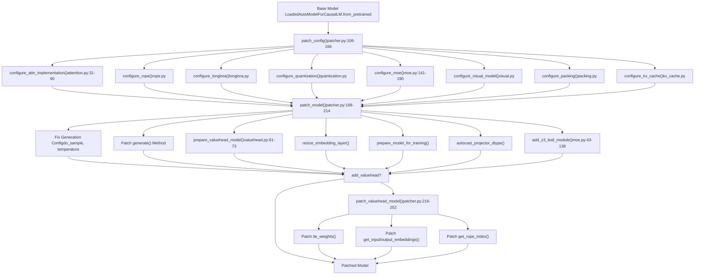
**Sources:** [src/llamafactory/model/patcher.py106-252](https://github.com/hiyouga/LlamaFactory/blob/355d5c5e/src/llamafactory/model/patcher.py#L106-L252) [src/llamafactory/model/loader.py131-189](https://github.com/hiyouga/LlamaFactory/blob/355d5c5e/src/llamafactory/model/loader.py#L131-L189)

---

## Configuration Patching

The `patch_config()` function applies model-specific configuration adjustments before model instantiation. This ensures compatibility with training frameworks, optimization techniques, and hardware configurations.

### Configuration Patching Entry Point

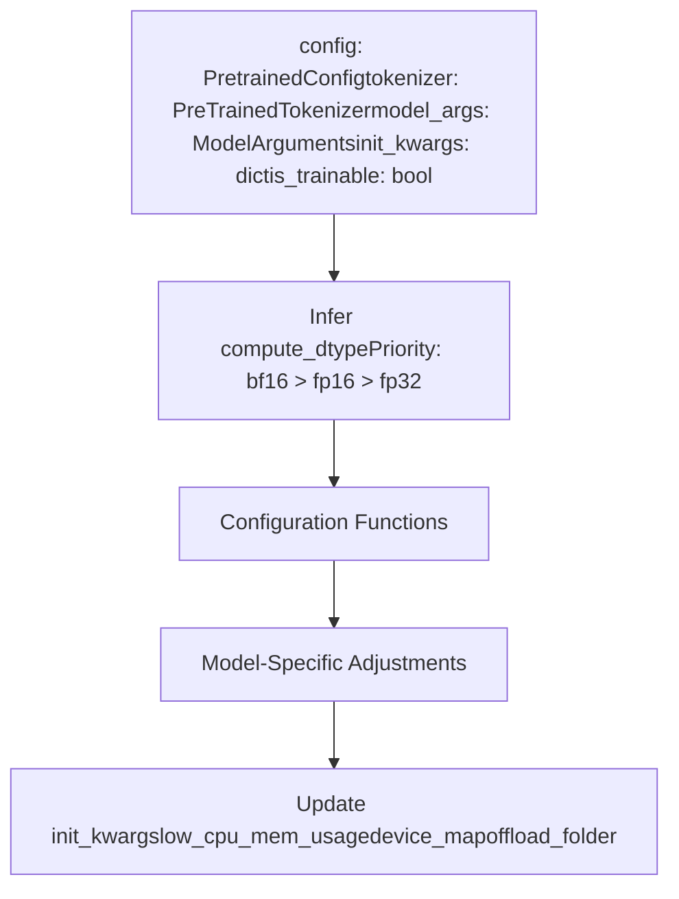
**Sources:** [src/llamafactory/model/patcher.py106-166](https://github.com/hiyouga/LlamaFactory/blob/355d5c5e/src/llamafactory/model/patcher.py#L106-L166)

### Attention Implementation Configuration

The `configure_attn_implementation()` function selects the attention backend based on `model_args.flash_attn`:

| flash\_attn Value | Result | Requirements |
| --- | --- | --- |
| `auto` | Default transformers behavior | None |
| `disabled` | Eager attention | None |
| `sdpa` | SDPA attention | PyTorch >= 2.1.1 |
| `fa2` | FlashAttention-2 | flash-attn package or NPU |
| `fa3` | FlashAttention-3 | For gpt\_oss model |

**Special Cases:**

-   **Gemma 2:** Requires FlashAttention-2 for soft-capping attention; SDPA is not compatible [src/llamafactory/model/model\_utils/attention.py46-58](https://github.com/hiyouga/LlamaFactory/blob/355d5c5e/src/llamafactory/model/model_utils/attention.py#L46-L58)
-   **GPT-OSS:** Uses FlashAttention-3 with attention sink via kernel hub [src/llamafactory/model/model\_utils/attention.py34-44](https://github.com/hiyouga/LlamaFactory/blob/355d5c5e/src/llamafactory/model/model_utils/attention.py#L34-L44)
-   **InternLM2:** Uses custom `attn_implementation` attribute [src/llamafactory/model/model\_utils/attention.py83-84](https://github.com/hiyouga/LlamaFactory/blob/355d5c5e/src/llamafactory/model/model_utils/attention.py#L83-L84)
-   **Kimi VL:** Patches both vision and text configs [src/llamafactory/model/model\_utils/attention.py85-87](https://github.com/hiyouga/LlamaFactory/blob/355d5c5e/src/llamafactory/model/model_utils/attention.py#L85-L87)

**Sources:** [src/llamafactory/model/model\_utils/attention.py31-104](https://github.com/hiyouga/LlamaFactory/blob/355d5c5e/src/llamafactory/model/model_utils/attention.py#L31-L104)

### MoE Configuration

The `configure_moe()` function enables router logit output and configures auxiliary loss for Mixture-of-Experts models:

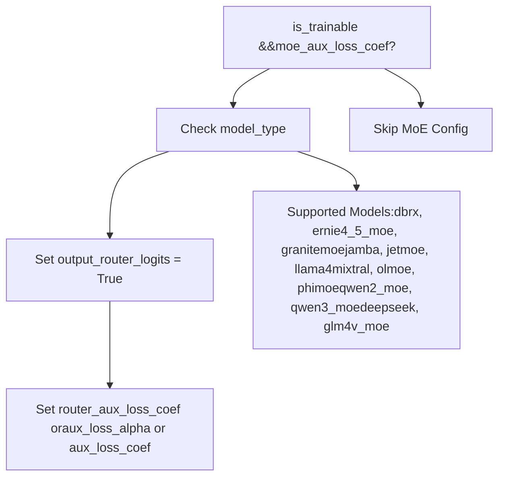
**Auxiliary Loss Coefficient Mapping:**

| Model Type | Config Attribute | Source |
| --- | --- | --- |
| Most MoE models | `router_aux_loss_coef` | [moe.py180](https://github.com/hiyouga/LlamaFactory/blob/355d5c5e/moe.py#L180-L180) |
| DeepSeek | `aux_loss_alpha` | [moe.py186](https://github.com/hiyouga/LlamaFactory/blob/355d5c5e/moe.py#L186-L186) |
| JetMoE | `aux_loss_coef` | [moe.py189](https://github.com/hiyouga/LlamaFactory/blob/355d5c5e/moe.py#L189-L189) |

**Sources:** [src/llamafactory/model/model\_utils/moe.py141-190](https://github.com/hiyouga/LlamaFactory/blob/355d5c5e/src/llamafactory/model/model_utils/moe.py#L141-L190)

### Special Model Configuration Adjustments

The `patch_config()` function applies model-specific adjustments:

| Model Type | Adjustment | Purpose |
| --- | --- | --- |
| `qwen` | Set `use_flash_attn`, `fp16`, `bf16`, `fp32` flags | Legacy Qwen compatibility |
| `minicpmo` | Set `init_audio=True`, `init_tts=False` | Enable audio, disable TTS |
| `kimi_vl` | Set `topk_method="greedy"` in training | Replace top-k gating method |
| `gemma3n` | Set `disable_gradient_checkpointing=True` | Gemma 3N incompatibility |
| `qwen3_omni_moe` | Patch `Qwen3OmniMoeThinkerTextSparseMoeBlock` | Fix DeepSpeed Zero2/FSDP2 issues |

**Error Checks:**

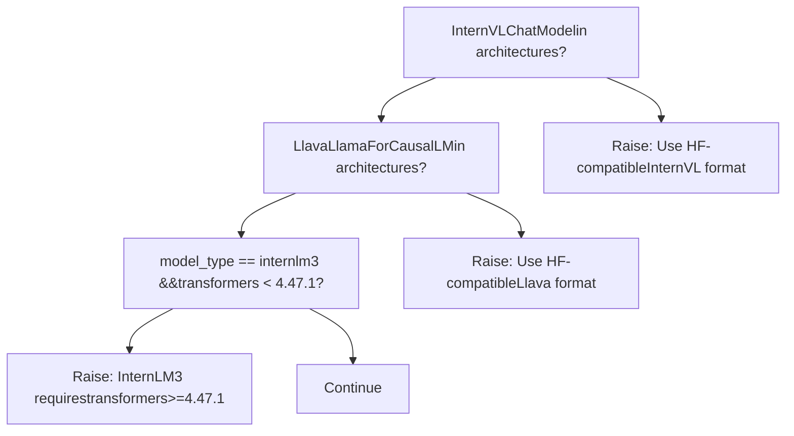
**Sources:** [src/llamafactory/model/patcher.py128-158](https://github.com/hiyouga/LlamaFactory/blob/355d5c5e/src/llamafactory/model/patcher.py#L128-L158)

### Device Map and Memory Configuration

The configuration patching adjusts initialization kwargs for memory efficiency:

```
# DeepSpeed Zero3 incompatible with low_cpu_mem_usageinit_kwargs["low_cpu_mem_usage"] = model_args.low_cpu_mem_usage and (not is_deepspeed_zero3_enabled()) # Device map requires low_cpu_mem_usage=Trueif not (is_deepspeed_zero3_enabled() or is_fsdp_enabled()) and init_kwargs["low_cpu_mem_usage"]:    if model_args.device_map:        init_kwargs["device_map"] = model_args.device_map    if init_kwargs.get("device_map", None) == "auto":        init_kwargs["offload_folder"] = model_args.offload_folder
```
**Sources:** [src/llamafactory/model/patcher.py156-165](https://github.com/hiyouga/LlamaFactory/blob/355d5c5e/src/llamafactory/model/patcher.py#L156-L165)

---

## Model Patching

The `patch_model()` function applies runtime patches after model instantiation but before training begins.

### Generation Config Fixes

LlamaFactory automatically fixes inconsistent generation configurations:

```
gen_config = model.generation_config # Fix: If do_sample=False but sampling parameters are set, enable samplingif not gen_config.do_sample and (    (gen_config.temperature is not None and gen_config.temperature != 1.0)    or (gen_config.top_p is not None and gen_config.top_p != 1.0)    or (gen_config.typical_p is not None and gen_config.typical_p != 1.0)):    gen_config.do_sample = True
```
**Sources:** [src/llamafactory/model/patcher.py175-181](https://github.com/hiyouga/LlamaFactory/blob/355d5c5e/src/llamafactory/model/patcher.py#L175-L181)

### Generate Method Patching

For most models (excluding MiniCPMV and MiniCPMo), the `generate()` method is patched to use the transformers `GenerationMixin` implementation:

```
if getattr(model.config, "model_type", None) not in ["minicpmv", "minicpmo"] and "GenerationMixin" not in str(    model.generate.__func__):    model.generate = MethodType(GenerationMixin.generate, model)
```
**Sources:** [src/llamafactory/model/patcher.py183-186](https://github.com/hiyouga/LlamaFactory/blob/355d5c5e/src/llamafactory/model/patcher.py#L183-L186)

### Vocabulary Resizing

When new tokens are added (`model_args.resize_vocab=True`), the embedding layers are resized with optional semantic initialization:

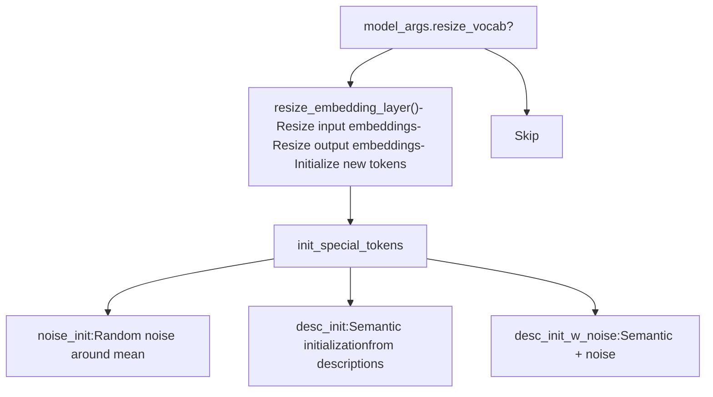
The `new_special_tokens_config` parameter allows semantic initialization using token descriptions loaded from YAML:

```
# Example: new_special_tokens.yaml"<task>": "A special token indicating the start of a task description""<answer>": "A special token marking the beginning of an answer"
```
**Sources:** [src/llamafactory/model/patcher.py191-197](https://github.com/hiyouga/LlamaFactory/blob/355d5c5e/src/llamafactory/model/patcher.py#L191-L197) [src/llamafactory/hparams/model\_args.py82-275](https://github.com/hiyouga/LlamaFactory/blob/355d5c5e/src/llamafactory/hparams/model_args.py#L82-L275)

### Training Preparation

For trainable models, several optimizations are applied:

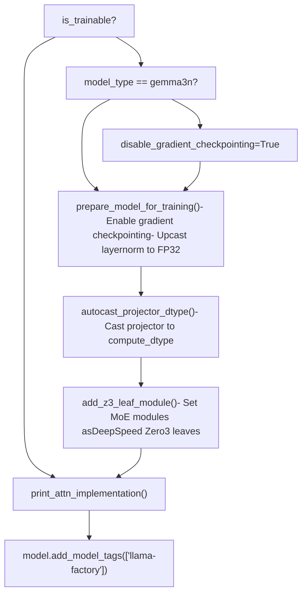
**Gradient Checkpointing:** Enabled by `prepare_model_for_training()` unless `disable_gradient_checkpointing=True` or the model doesn't support it (e.g., Gemma3N) [src/llamafactory/model/model\_utils/checkpointing.py](https://github.com/hiyouga/LlamaFactory/blob/355d5c5e/src/llamafactory/model/model_utils/checkpointing.py)

**Layernorm Upcasting:** If `upcast_layernorm=True`, all layernorm weights are cast to FP32 for numerical stability [src/llamafactory/model/model\_utils/checkpointing.py](https://github.com/hiyouga/LlamaFactory/blob/355d5c5e/src/llamafactory/model/model_utils/checkpointing.py)

**Sources:** [src/llamafactory/model/patcher.py199-213](https://github.com/hiyouga/LlamaFactory/blob/355d5c5e/src/llamafactory/model/patcher.py#L199-L213)

---

## Tokenizer and Processor Patching

### Tokenizer Patching

The `patch_tokenizer()` function applies three types of modifications:

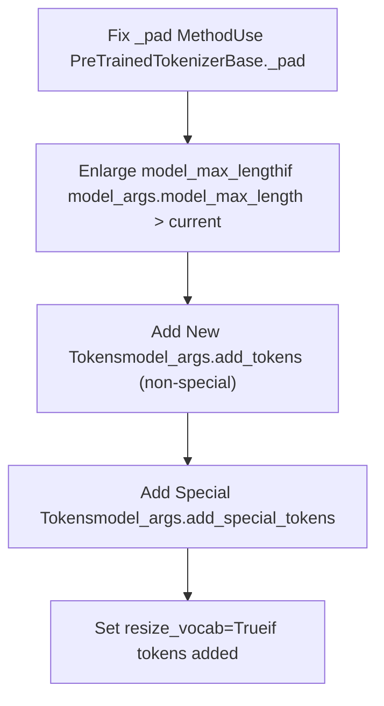
**Padding Method Fix:**

Some tokenizers override the `_pad()` method incorrectly. LlamaFactory restores the base implementation:

```
if "PreTrainedTokenizerBase" not in str(tokenizer._pad.__func__):    tokenizer._pad = MethodType(PreTrainedTokenizerBase._pad, tokenizer)
```
**Automatic Vocabulary Resizing:**

When tokens are added, `resize_vocab` is automatically set to `True` with a warning:

```
New tokens have been added, changed `resize_vocab` to True.
```
**Sources:** [src/llamafactory/model/patcher.py64-86](https://github.com/hiyouga/LlamaFactory/blob/355d5c5e/src/llamafactory/model/patcher.py#L64-L86)

### Processor Patching for Multimodal

For multimodal models, the processor is patched with image/video/audio parameters:

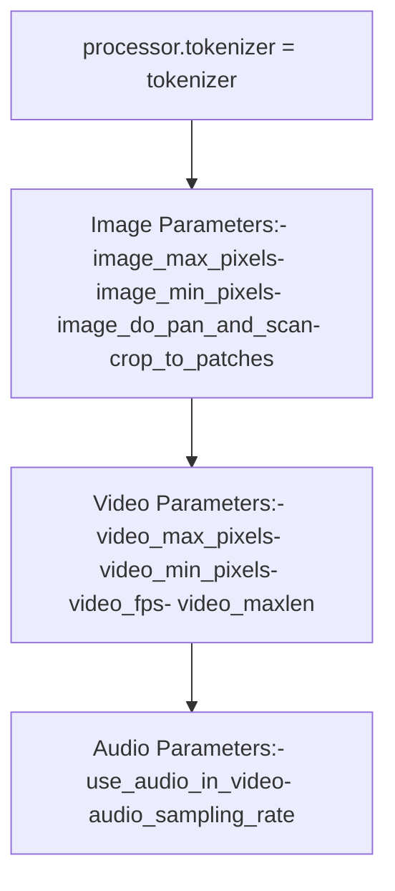
| Parameter | Purpose | Default |
| --- | --- | --- |
| `image_max_pixels` | Maximum image size | 768 × 768 |
| `image_min_pixels` | Minimum image size | 32 × 32 |
| `image_do_pan_and_scan` | Pan-and-scan for Gemma3 | False |
| `crop_to_patches` | Crop to patches for InternVL | False |
| `video_fps` | Video sampling rate | 2.0 FPS |
| `video_maxlen` | Maximum video frames | 128 |
| `use_audio_in_video` | Extract audio from video | False |

**Sources:** [src/llamafactory/model/patcher.py88-103](https://github.com/hiyouga/LlamaFactory/blob/355d5c5e/src/llamafactory/model/patcher.py#L88-L103) [src/llamafactory/hparams/model\_args.py307-346](https://github.com/hiyouga/LlamaFactory/blob/355d5c5e/src/llamafactory/hparams/model_args.py#L307-L346)

---

## MoE-Specific Handling

### DeepSpeed Zero3 Leaf Modules

For MoE models under DeepSpeed Zero3, certain modules must be marked as "leaf modules" to skip partitioning. The `add_z3_leaf_module()` function registers these modules:

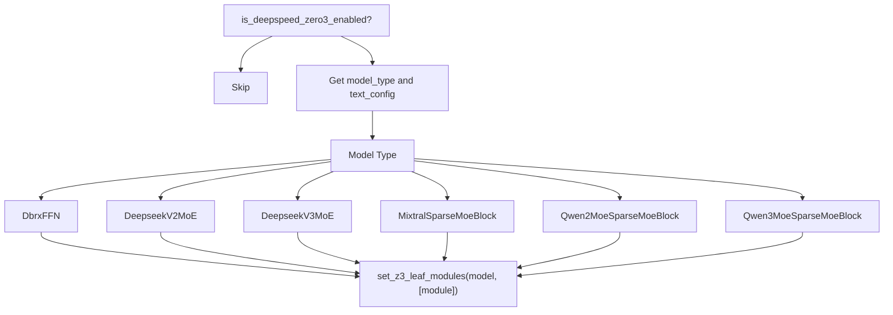
**Supported MoE Models:**

| Model Type | Leaf Module(s) |
| --- | --- |
| `dbrx` | `DbrxFFN` |
| `deepseek_v2` | `DeepseekV2MoE` |
| `deepseek_v3`, `kimi_vl` | `DeepseekV3MoE` |
| `ernie4_5_moe` | `Ernie4_5_MoeSparseMoeBlock` |
| `granitemoe` | `GraniteMoeMoE` |
| `glm4_moe` | `Glm4MoeMoE` |
| `glm4v_moe` | `Glm4vMoeTextMoE` |
| `gpt_oss` | `GptOssMLP` |
| `jamba` | `JambaSparseMoeBlock` |
| `jetmoe` | `JetMoeMoA`, `JetMoeMoE` |
| `llama4` | `Llama4TextMoe` |
| `mixtral` | `MixtralSparseMoeBlock` |
| `olmoe` | `OlmoeSparseMoeBlock` |
| `phimoe` | `PhimoeSparseMoeBlock` |
| `qwen2_moe` | `Qwen2MoeSparseMoeBlock` |
| `qwen3_moe` | `Qwen3MoeSparseMoeBlock` |
| `qwen3_vl_moe` | `Qwen3VLMoeTextSparseMoeBlock` |
| `qwen3_omni_moe` | `Qwen3OmniMoeThinkerTextSparseMoeBlock` |

**Sources:** [src/llamafactory/model/model\_utils/moe.py36-138](https://github.com/hiyouga/LlamaFactory/blob/355d5c5e/src/llamafactory/model/model_utils/moe.py#L36-L138)

### Custom MoE Implementation: Qwen3 Omni MoE

LlamaFactory provides a custom implementation of `Qwen3OmniMoeThinkerTextSparseMoeBlock` to fix issues with DeepSpeed Zero2 and FSDP2 in transformers 4.57.0-4.58.0:

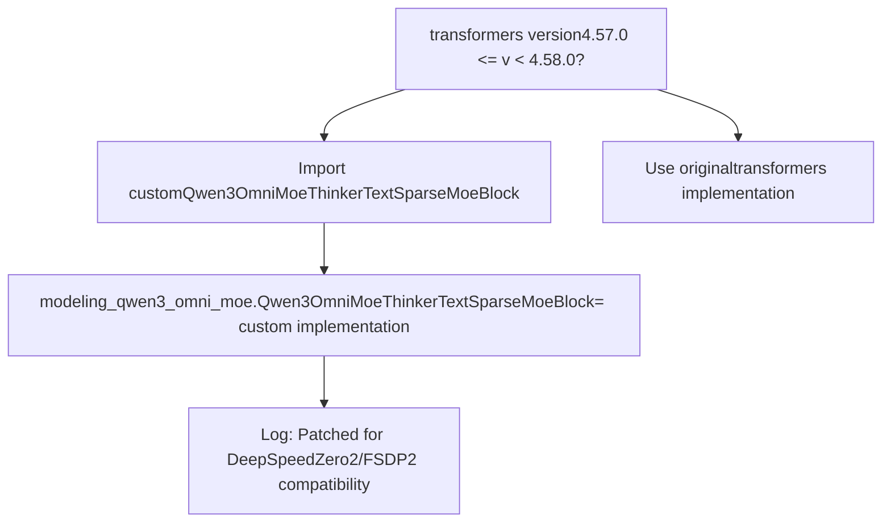
**Key Differences:**

The custom implementation routes all experts (not just top-k) through the computation with zero weights for non-selected experts. This ensures gradient computation compatibility with DeepSpeed Zero2 and FSDP2:

```
# All experts participate, inactive experts have weight=0for expert_idx in range(self.num_experts):    expert_weights = full_routing_weights[:, expert_idx, None]  # May be 0    current_hidden_states = expert_layer(hidden_states) * expert_weights    final_hidden_states += current_hidden_states
```
**Sources:** [src/llamafactory/model/patcher.py53-61](https://github.com/hiyouga/LlamaFactory/blob/355d5c5e/src/llamafactory/model/patcher.py#L53-L61) [src/llamafactory/model/model\_utils/moe.py192-252](https://github.com/hiyouga/LlamaFactory/blob/355d5c5e/src/llamafactory/model/model_utils/moe.py#L192-L252)

---

## Performance Optimizations

### Liger Kernel Application

The Liger Kernel provides fused operations for faster training. The `apply_liger_kernel()` function applies model-specific kernels:

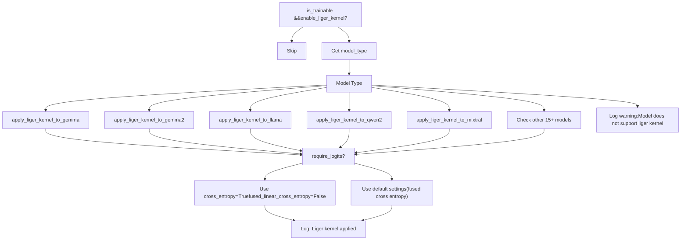
**Supported Models:** gemma, gemma2, gemma3, gemma3\_text, glm4, glm4v, granite, llama, llava, mistral, mixtral, mllama, olmo2, paligemma, phi3, qwen2, qwen2\_vl, qwen2\_5\_vl, qwen3, qwen3\_moe, gpt\_oss

**Cross Entropy Handling:**

For training stages that require logits (RM, PPO, DPO, KTO, ORPO), chunked cross entropy is disabled:

```
if require_logits and "fused_linear_cross_entropy" in inspect.signature(apply_liger_kernel).parameters:    logger.info_rank0("Current training stage does not support chunked cross entropy.")    kwargs = {"fused_linear_cross_entropy": False, "cross_entropy": True}
```
**Sources:** [src/llamafactory/model/model\_utils/liger\_kernel.py30-97](https://github.com/hiyouga/LlamaFactory/blob/355d5c5e/src/llamafactory/model/model_utils/liger_kernel.py#L30-L97) [src/llamafactory/model/loader.py142](https://github.com/hiyouga/LlamaFactory/blob/355d5c5e/src/llamafactory/model/loader.py#L142-L142)

---

## Value Head Models

Value head models are used in reinforcement learning stages (RM, PPO) to predict scalar rewards.

### Value Head Preparation

The `prepare_valuehead_model()` function sets up the language model head for value head wrapping:

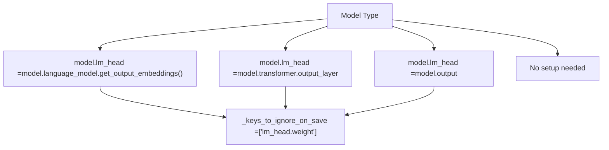
**Purpose:** These models have non-standard output layer access patterns. The patching provides a unified `lm_head` attribute for TRL's `AutoModelForCausalLMWithValueHead` wrapper.

**Sources:** [src/llamafactory/model/model\_utils/valuehead.py61-73](https://github.com/hiyouga/LlamaFactory/blob/355d5c5e/src/llamafactory/model/model_utils/valuehead.py#L61-L73) [src/llamafactory/model/patcher.py188-189](https://github.com/hiyouga/LlamaFactory/blob/355d5c5e/src/llamafactory/model/patcher.py#L188-L189)

### Value Head Model Patching

After wrapping with `AutoModelForCausalLMWithValueHead`, the `patch_valuehead_model()` function patches methods for correct behavior:

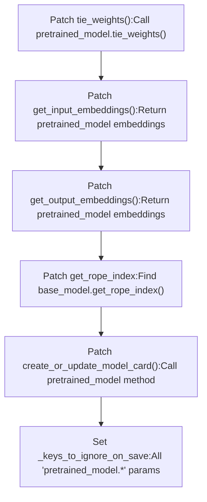
**Key Patches:**

1.  **`tie_weights()`**: Ensures weight tying is delegated to the underlying pretrained model [src/llamafactory/model/patcher.py217-219](https://github.com/hiyouga/LlamaFactory/blob/355d5c5e/src/llamafactory/model/patcher.py#L217-L219)

2.  **`get_input_embeddings()` / `get_output_embeddings()`**: Returns embeddings from the pretrained model, not the wrapper [src/llamafactory/model/patcher.py221-227](https://github.com/hiyouga/LlamaFactory/blob/355d5c5e/src/llamafactory/model/patcher.py#L221-L227)

3.  **`get_rope_index()`**: Locates the RoPE index function for models using RoPE embeddings (e.g., with sequence packing) [src/llamafactory/model/patcher.py233-244](https://github.com/hiyouga/LlamaFactory/blob/355d5c5e/src/llamafactory/model/patcher.py#L233-L244)

4.  **`create_or_update_model_card()`**: Delegates model card creation to PEFT model if using adapters [src/llamafactory/model/patcher.py229-231](https://github.com/hiyouga/LlamaFactory/blob/355d5c5e/src/llamafactory/model/patcher.py#L229-L231)

5.  **`_keys_to_ignore_on_save`**: Prevents saving the pretrained model parameters (only saves value head) [src/llamafactory/model/patcher.py246-247](https://github.com/hiyouga/LlamaFactory/blob/355d5c5e/src/llamafactory/model/patcher.py#L246-L247)


**Sources:** [src/llamafactory/model/patcher.py216-252](https://github.com/hiyouga/LlamaFactory/blob/355d5c5e/src/llamafactory/model/patcher.py#L216-L252)

---

## Model-Specific Configuration Reference

### Model Configuration Table

| Model Family | Key Adjustments | Files |
| --- | --- | --- |
| **Qwen** | Legacy flash attention flags, Qwen3 Omni MoE patching | [patcher.py128-154](https://github.com/hiyouga/LlamaFactory/blob/355d5c5e/patcher.py#L128-L154) |
| **Gemma** | Gemma 2: FA2 required for soft-capping; Gemma 3N: disable gradient checkpointing | [attention.py46-58](https://github.com/hiyouga/LlamaFactory/blob/355d5c5e/attention.py#L46-L58) [patcher.py200-201](https://github.com/hiyouga/LlamaFactory/blob/355d5c5e/patcher.py#L200-L201) |
| **MiniCPM Omni** | Enable audio init, disable TTS init | [patcher.py133-135](https://github.com/hiyouga/LlamaFactory/blob/355d5c5e/patcher.py#L133-L135) |
| **Kimi VL** | Greedy top-k gating, patch vision+text configs | [patcher.py138-139](https://github.com/hiyouga/LlamaFactory/blob/355d5c5e/patcher.py#L138-L139) [attention.py85-87](https://github.com/hiyouga/LlamaFactory/blob/355d5c5e/attention.py#L85-L87) |
| **InternVL** | Must use HF-compatible format, crop\_to\_patches option | [patcher.py141-145](https://github.com/hiyouga/LlamaFactory/blob/355d5c5e/patcher.py#L141-L145) |
| **Llava** | Must use HF-compatible format, value head preparation | [patcher.py147-148](https://github.com/hiyouga/LlamaFactory/blob/355d5c5e/patcher.py#L147-L148) [valuehead.py62-64](https://github.com/hiyouga/LlamaFactory/blob/355d5c5e/valuehead.py#L62-L64) |
| **InternLM** | Requires transformers >= 4.47.1, custom attention attribute | [patcher.py150-151](https://github.com/hiyouga/LlamaFactory/blob/355d5c5e/patcher.py#L150-L151) [attention.py83-84](https://github.com/hiyouga/LlamaFactory/blob/355d5c5e/attention.py#L83-L84) |
| **GPT-OSS** | FlashAttention-3 with attention sink | [attention.py34-44](https://github.com/hiyouga/LlamaFactory/blob/355d5c5e/attention.py#L34-L44) |
| **ChatGLM** | Custom output layer for value head | [valuehead.py66-68](https://github.com/hiyouga/LlamaFactory/blob/355d5c5e/valuehead.py#L66-L68) |
| **DeepSeek** | Custom MoE leaf modules, custom aux loss | [moe.py57-63](https://github.com/hiyouga/LlamaFactory/blob/355d5c5e/moe.py#L57-L63) |

**Sources:** [src/llamafactory/model/patcher.py128-154](https://github.com/hiyouga/LlamaFactory/blob/355d5c5e/src/llamafactory/model/patcher.py#L128-L154) [src/llamafactory/model/model\_utils/attention.py34-90](https://github.com/hiyouga/LlamaFactory/blob/355d5c5e/src/llamafactory/model/model_utils/attention.py#L34-L90) [src/llamafactory/model/model\_utils/valuehead.py61-73](https://github.com/hiyouga/LlamaFactory/blob/355d5c5e/src/llamafactory/model/model_utils/valuehead.py#L61-L73)

---

## Patching Execution Flow in Training

The following diagram shows how patching integrates into the full training pipeline:

> **[Mermaid sequence]**
> *(图表结构无法解析)*

**Sources:** [src/llamafactory/model/loader.py131-238](https://github.com/hiyouga/LlamaFactory/blob/355d5c5e/src/llamafactory/model/loader.py#L131-L238) [src/llamafactory/model/patcher.py106-252](https://github.com/hiyouga/LlamaFactory/blob/355d5c5e/src/llamafactory/model/patcher.py#L106-L252)
