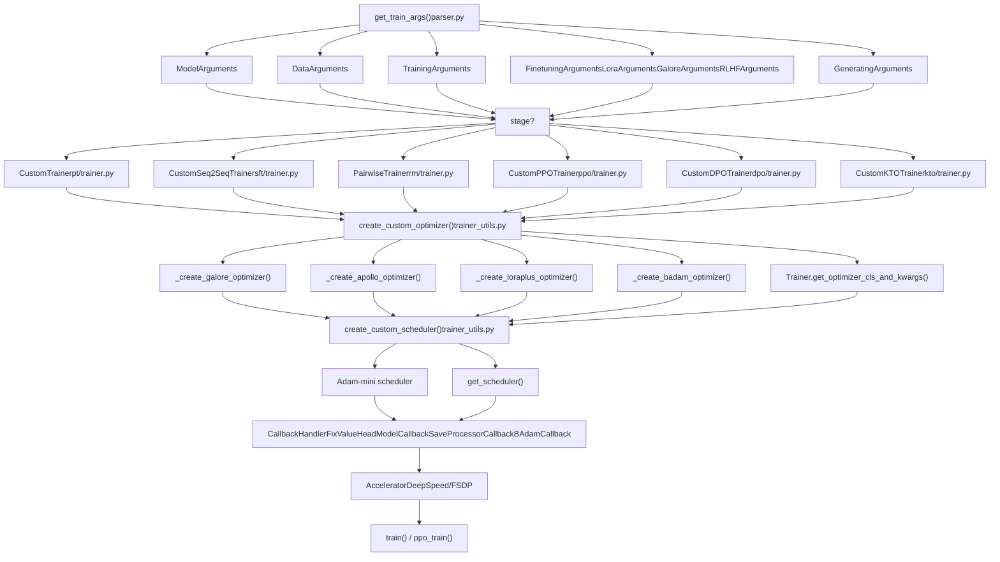
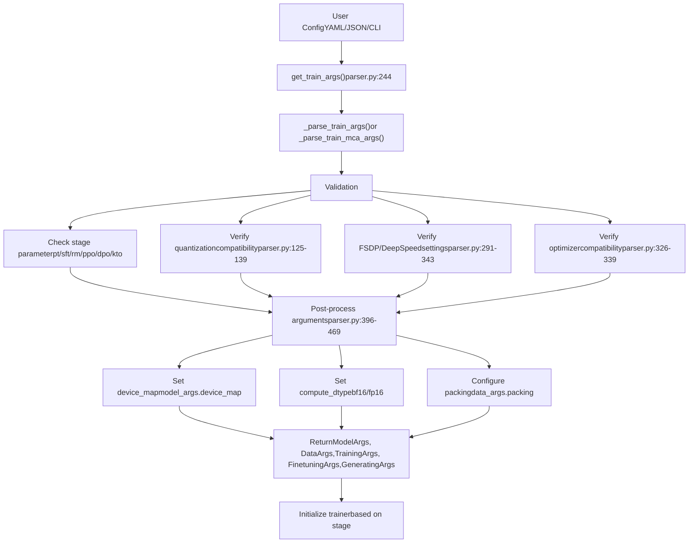
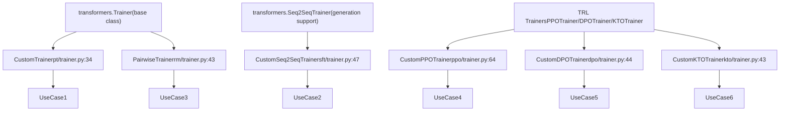
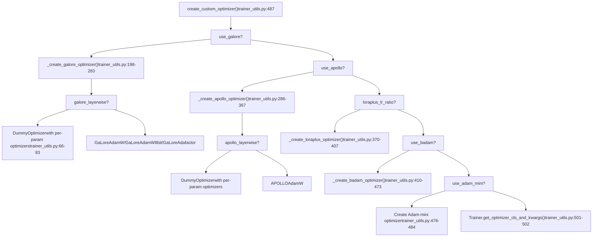
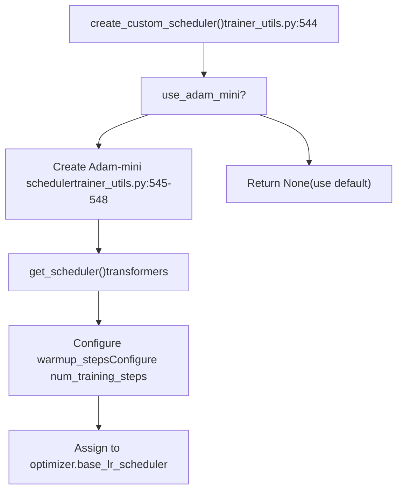
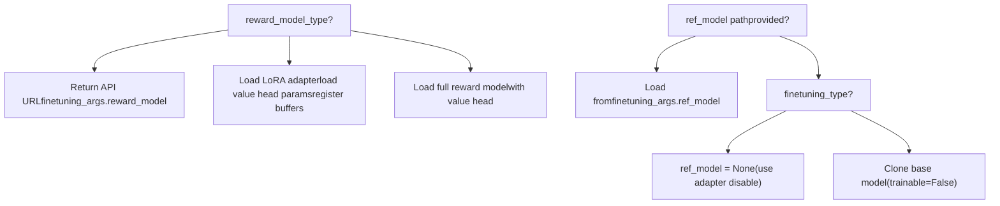
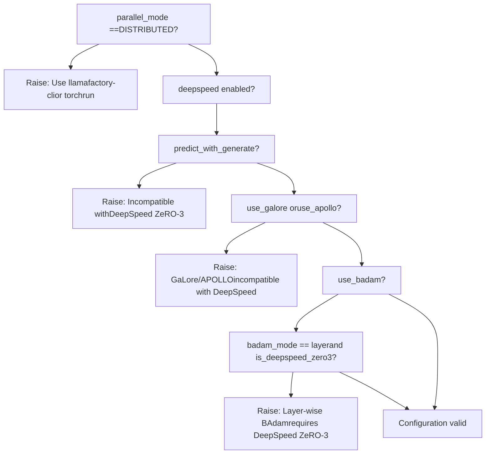
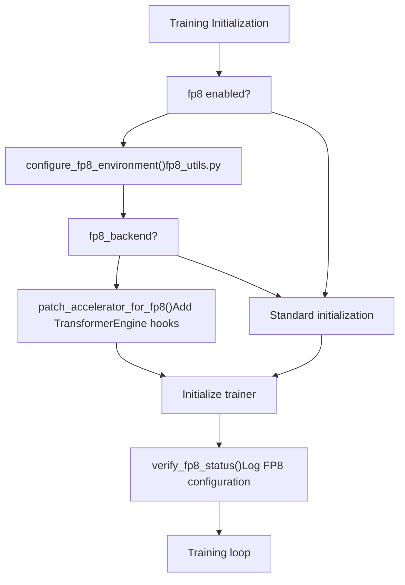

# Training System

Relevant source files

-   [README.md](https://github.com/hiyouga/LlamaFactory/blob/355d5c5e/README.md?plain=1)
-   [README\_zh.md](https://github.com/hiyouga/LlamaFactory/blob/355d5c5e/README_zh.md?plain=1)
-   [src/llamafactory/hparams/finetuning\_args.py](https://github.com/hiyouga/LlamaFactory/blob/355d5c5e/src/llamafactory/hparams/finetuning_args.py)
-   [src/llamafactory/hparams/parser.py](https://github.com/hiyouga/LlamaFactory/blob/355d5c5e/src/llamafactory/hparams/parser.py)
-   [src/llamafactory/train/dpo/trainer.py](https://github.com/hiyouga/LlamaFactory/blob/355d5c5e/src/llamafactory/train/dpo/trainer.py)
-   [src/llamafactory/train/kto/trainer.py](https://github.com/hiyouga/LlamaFactory/blob/355d5c5e/src/llamafactory/train/kto/trainer.py)
-   [src/llamafactory/train/ppo/trainer.py](https://github.com/hiyouga/LlamaFactory/blob/355d5c5e/src/llamafactory/train/ppo/trainer.py)
-   [src/llamafactory/train/pt/trainer.py](https://github.com/hiyouga/LlamaFactory/blob/355d5c5e/src/llamafactory/train/pt/trainer.py)
-   [src/llamafactory/train/rm/trainer.py](https://github.com/hiyouga/LlamaFactory/blob/355d5c5e/src/llamafactory/train/rm/trainer.py)
-   [src/llamafactory/train/sft/trainer.py](https://github.com/hiyouga/LlamaFactory/blob/355d5c5e/src/llamafactory/train/sft/trainer.py)
-   [src/llamafactory/train/trainer\_utils.py](https://github.com/hiyouga/LlamaFactory/blob/355d5c5e/src/llamafactory/train/trainer_utils.py)

The Training System provides the core infrastructure for training language models using various fine-tuning methods. It orchestrates model training through custom trainer implementations, optimizer configuration, callback management, and distributed training support. This system bridges the gap between validated configuration (from the [Configuration System](/hiyouga/LlamaFactory/3-configuration-system)) and actual model training execution.

For model loading and adapter configuration, see [Model Loading and Configuration](/hiyouga/LlamaFactory/5-model-loading-and-configuration). For inference after training, see [Inference and Deployment](/hiyouga/LlamaFactory/7-inference-and-deployment). For the web interface to training, see [Web UI (LLaMA Board)](/hiyouga/LlamaFactory/8-web-ui-(llama-board)).

---

## System Architecture

The training system is organized around five core components that work together to execute training jobs:


**Training System Component Flow**

The system follows a pipeline pattern where arguments are parsed, validated, and routed to the appropriate trainer class based on the `stage` parameter. Each trainer then creates custom optimizers and schedulers before entering the training loop.

Sources: [src/llamafactory/hparams/parser.py244-471](https://github.com/hiyouga/LlamaFactory/blob/355d5c5e/src/llamafactory/hparams/parser.py#L244-L471) [src/llamafactory/train/trainer\_utils.py85-471](https://github.com/hiyouga/LlamaFactory/blob/355d5c5e/src/llamafactory/train/trainer_utils.py#L85-L471)

---

## Training Configuration Flow


**Configuration Validation and Post-Processing**

The `get_train_args()` function performs extensive validation to ensure configuration compatibility before training begins. This prevents runtime errors that would waste compute resources.

Sources: [src/llamafactory/hparams/parser.py244-471](https://github.com/hiyouga/LlamaFactory/blob/355d5c5e/src/llamafactory/hparams/parser.py#L244-L471)

---

## Trainer Class Hierarchy


**Trainer Inheritance Structure**

All custom trainers override three key methods:

-   `create_optimizer()` - Integrates custom optimizer logic
-   `create_scheduler()` - Configures learning rate scheduling
-   `_get_train_sampler()` - Supports `disable_shuffling` option

Sources: [src/llamafactory/train/pt/trainer.py34-95](https://github.com/hiyouga/LlamaFactory/blob/355d5c5e/src/llamafactory/train/pt/trainer.py#L34-L95) [src/llamafactory/train/sft/trainer.py47-179](https://github.com/hiyouga/LlamaFactory/blob/355d5c5e/src/llamafactory/train/sft/trainer.py#L47-L179) [src/llamafactory/train/rm/trainer.py43-130](https://github.com/hiyouga/LlamaFactory/blob/355d5c5e/src/llamafactory/train/rm/trainer.py#L43-L130) [src/llamafactory/train/ppo/trainer.py64-453](https://github.com/hiyouga/LlamaFactory/blob/355d5c5e/src/llamafactory/train/ppo/trainer.py#L64-L453) [src/llamafactory/train/dpo/trainer.py44-324](https://github.com/hiyouga/LlamaFactory/blob/355d5c5e/src/llamafactory/train/dpo/trainer.py#L44-L324) [src/llamafactory/train/kto/trainer.py43-303](https://github.com/hiyouga/LlamaFactory/blob/355d5c5e/src/llamafactory/train/kto/trainer.py#L43-L303)

---

## Optimizer Creation Pipeline

The system supports multiple advanced optimization algorithms through a factory pattern:


**Custom Optimizer Selection Logic**

The optimizer creation follows a priority chain. GaLore and APOLLO implement gradient low-rank projection, LoRA+ uses different learning rates for LoRA matrices, and BAdam performs block-wise updates.

Sources: [src/llamafactory/train/trainer\_utils.py487-541](https://github.com/hiyouga/LlamaFactory/blob/355d5c5e/src/llamafactory/train/trainer_utils.py#L487-L541) [src/llamafactory/train/trainer\_utils.py198-367](https://github.com/hiyouga/LlamaFactory/blob/355d5c5e/src/llamafactory/train/trainer_utils.py#L198-L367)

---

## Optimizer Implementation Details

### GaLore Optimizer

GaLore (Gradient Low-Rank Projection) reduces memory usage by projecting gradients to a low-rank subspace:

| Parameter | Type | Default | Description |
| --- | --- | --- | --- |
| `galore_target` | str | "all" | Target modules for GaLore (comma-separated or "all" for all linear layers) |
| `galore_rank` | int | 16 | Rank of gradient projection |
| `galore_update_interval` | int | 200 | Steps between projection updates |
| `galore_scale` | float | 2.0 | Scaling coefficient |
| `galore_proj_type` | str | "std" | Projection type: std/reverse\_std/right/left/full |
| `galore_layerwise` | bool | False | Enable layer-wise updates (saves memory, disables grad accumulation) |

**Key Implementation Points:**

-   When `galore_layerwise=True`, creates a `DummyOptimizer` that delegates to per-parameter optimizers registered via `register_post_accumulate_grad_hook()`
-   Separates parameters into three groups: GaLore params, decay params, and no-decay params
-   Uses `GaLoreAdamW`, `GaLoreAdamW8bit`, or `GaLoreAdafactor` based on `optim` setting

Sources: [src/llamafactory/train/trainer\_utils.py198-283](https://github.com/hiyouga/LlamaFactory/blob/355d5c5e/src/llamafactory/train/trainer_utils.py#L198-L283) [src/llamafactory/hparams/finetuning\_args.py263-298](https://github.com/hiyouga/LlamaFactory/blob/355d5c5e/src/llamafactory/hparams/finetuning_args.py#L263-L298)

### APOLLO Optimizer

APOLLO is an adaptive low-rank projection optimizer:

| Parameter | Type | Default | Description |
| --- | --- | --- | --- |
| `apollo_target` | str | "all" | Target modules for APOLLO |
| `apollo_rank` | int | 16 | Rank of gradient projection |
| `apollo_update_interval` | int | 200 | Steps between projection updates |
| `apollo_scale` | float | 32.0 | Scaling coefficient |
| `apollo_proj` | str | "random" | Projection algorithm: svd/random |
| `apollo_proj_type` | str | "std" | Projection type: std/right/left |
| `apollo_scale_type` | str | "channel" | Scaling type: channel/tensor |
| `apollo_layerwise` | bool | False | Enable layer-wise updates |
| `apollo_scale_front` | bool | False | Use norm-growth limiter before scaling |

Sources: [src/llamafactory/train/trainer\_utils.py286-367](https://github.com/hiyouga/LlamaFactory/blob/355d5c5e/src/llamafactory/train/trainer_utils.py#L286-L367) [src/llamafactory/hparams/finetuning\_args.py302-349](https://github.com/hiyouga/LlamaFactory/blob/355d5c5e/src/llamafactory/hparams/finetuning_args.py#L302-L349)

### LoRA+ Optimizer

LoRA+ uses different learning rates for LoRA A and B matrices:

-   LoRA A matrices: `learning_rate` (base rate)
-   LoRA B matrices: `learning_rate * loraplus_lr_ratio`
-   LoRA embedding B: `loraplus_lr_embedding`
-   Applies weight decay selectively based on parameter names

Sources: [src/llamafactory/train/trainer\_utils.py370-407](https://github.com/hiyouga/LlamaFactory/blob/355d5c5e/src/llamafactory/train/trainer_utils.py#L370-L407) [src/llamafactory/hparams/finetuning\_args.py91-97](https://github.com/hiyouga/LlamaFactory/blob/355d5c5e/src/llamafactory/hparams/finetuning_args.py#L91-L97)

### BAdam Optimizer

BAdam (Block-wise Adam) performs block-wise parameter updates to reduce memory:

| Parameter | Type | Default | Description |
| --- | --- | --- | --- |
| `badam_mode` | str | "layer" | Update mode: layer/ratio |
| `badam_start_block` | int | None | Starting block index for layer-wise mode |
| `badam_switch_mode` | str | "ascending" | Block switching strategy: ascending/descending/random/fixed |
| `badam_switch_interval` | int | 50 | Steps between block switches (-1 to disable) |
| `badam_update_ratio` | float | 0.05 | Update ratio for ratio-wise mode |
| `badam_mask_mode` | str | "adjacent" | Mask mode: adjacent/scatter |
| `badam_verbose` | int | 0 | Verbosity level (0/1/2) |

**Implementation Notes:**

-   Layer-wise BAdam only supports DeepSpeed ZeRO-3
-   Uses `BAdamCallback` to manage block switching
-   Requires `clip_grad_norm_old_version` patch for gradient clipping

Sources: [src/llamafactory/train/trainer\_utils.py410-473](https://github.com/hiyouga/LlamaFactory/blob/355d5c5e/src/llamafactory/train/trainer_utils.py#L410-L473) [src/llamafactory/hparams/finetuning\_args.py353-400](https://github.com/hiyouga/LlamaFactory/blob/355d5c5e/src/llamafactory/hparams/finetuning_args.py#L353-L400)

---

## Scheduler Creation


**Learning Rate Scheduler Configuration**

The system primarily uses transformers' standard scheduler, except for Adam-mini which requires a specific scheduler configuration stored in `optimizer.base_lr_scheduler`.

Sources: [src/llamafactory/train/trainer\_utils.py544-558](https://github.com/hiyouga/LlamaFactory/blob/355d5c5e/src/llamafactory/train/trainer_utils.py#L544-L558)

---

## Reference and Reward Model Creation

For PPO and DPO training, the system creates separate reference and/or reward models:


**Reference and Reward Model Loading**

-   **Reference Model**: Used in DPO/KTO to compute reference log probabilities. When using LoRA, the reference is accessed by temporarily disabling the adapter.
-   **Reward Model**: Used in PPO to score generated responses. Can be an API endpoint, a LoRA adapter, or a full model.

**Key Implementation Details:**

-   Reference models are set to `evaluation_mode=True` and wrapped with `accelerator.prepare_model()`
-   For LoRA reward models, value head weights are registered as buffers: `reward_head_weight`, `reward_head_bias`, `default_head_weight`, `default_head_bias`
-   DeepSpeed preparation is handled specially for quantized models

Sources: [src/llamafactory/train/trainer\_utils.py114-189](https://github.com/hiyouga/LlamaFactory/blob/355d5c5e/src/llamafactory/train/trainer_utils.py#L114-L189)

---

## Callback System

Each trainer registers callbacks to handle specific training events:

| Callback | Used By | Purpose |
| --- | --- | --- |
| `FixValueHeadModelCallback` | PPO, RM | Ensures value head parameters are saved correctly |
| `SaveProcessorCallback` | All (when processor exists) | Saves multimodal processor with model checkpoints |
| `BAdamCallback` | All (when `use_badam=True`) | Manages BAdam block switching and updates |
| `SavePeftModelCallback` | All LoRA/OFT trainers | Handles adapter checkpoint saving |
| `LogCallback` | All | Standard training logging |

**Callback Registration Pattern:**

```
# In each custom trainer __init__:if processor is not None:    self.add_callback(SaveProcessorCallback(processor)) if finetuning_args.use_badam:    from badam import BAdamCallback, clip_grad_norm_old_version    self.accelerator.clip_grad_norm_ = MethodType(clip_grad_norm_old_version, self.accelerator)    self.add_callback(BAdamCallback)
```
Sources: [src/llamafactory/train/sft/trainer.py77-84](https://github.com/hiyouga/LlamaFactory/blob/355d5c5e/src/llamafactory/train/sft/trainer.py#L77-L84) [src/llamafactory/train/ppo/trainer.py189-198](https://github.com/hiyouga/LlamaFactory/blob/355d5c5e/src/llamafactory/train/ppo/trainer.py#L189-L198) [src/llamafactory/train/rm/trainer.py56-65](https://github.com/hiyouga/LlamaFactory/blob/355d5c5e/src/llamafactory/train/rm/trainer.py#L56-L65)

---

## Distributed Training Configuration

The training system supports three distributed strategies:

### Data Parallel (DDP)

-   Automatically enabled when `parallel_mode == ParallelMode.DISTRIBUTED`
-   Requires `FORCE_TORCHRUN=1` or launching via `llamafactory-cli`
-   Configuration: `ddp_find_unused_parameters` automatically set to `False` for LoRA training

### Fully Sharded Data Parallel (FSDP)

-   Enabled via `fsdp` argument in `TrainingArguments`
-   Supports FSDP+QLoRA for training 70B models on 2×24GB GPUs
-   Configuration file: `examples/fsdp_config.yaml`

### DeepSpeed ZeRO

-   Enabled via `deepspeed` argument pointing to config JSON
-   Supports ZeRO stages 1, 2, and 3
-   Special handling for MoE models and value head parameters

**Validation Logic:**

The system performs extensive validation to prevent incompatible configurations:


**Key Validation Rules:**

-   GaLore/APOLLO layerwise: Only single device (no distributed)
-   BAdam layer-wise: Requires DeepSpeed ZeRO-3
-   GaLore/APOLLO: Incompatible with DeepSpeed entirely
-   `predict_with_generate`: Incompatible with DeepSpeed ZeRO-3
-   Unsloth/KTransformers: Incompatible with DeepSpeed ZeRO-3

Sources: [src/llamafactory/hparams/parser.py288-354](https://github.com/hiyouga/LlamaFactory/blob/355d5c5e/src/llamafactory/hparams/parser.py#L288-L354)

---

## Training Loop Execution

### Standard Training (PT/SFT/RM/DPO/KTO)

These trainers use the standard Hugging Face `Trainer.train()` method:

> **[Mermaid sequence]**
> *(图表结构无法解析)*

Sources: [src/llamafactory/train/pt/trainer.py34-95](https://github.com/hiyouga/LlamaFactory/blob/355d5c5e/src/llamafactory/train/pt/trainer.py#L34-L95) [src/llamafactory/train/sft/trainer.py47-179](https://github.com/hiyouga/LlamaFactory/blob/355d5c5e/src/llamafactory/train/sft/trainer.py#L47-L179)

### PPO Training Loop

PPO uses a custom `ppo_train()` method with experience buffering:

> **[Mermaid sequence]**
> *(图表结构无法解析)*

**PPO Configuration Parameters:**

| Parameter | FinetuningArgs Field | Default | Description |
| --- | --- | --- | --- |
| `batch_size` | `per_device_train_batch_size * gradient_accumulation_steps * ppo_buffer_size` | \- | Total experience buffer size |
| `mini_batch_size` | `per_device_train_batch_size` | \- | Size of PPO update batches |
| `ppo_epochs` | `ppo_epochs` | 4 | Number of optimization epochs per buffer |
| `target` | `ppo_target` | 6.0 | Target KL for adaptive control |
| `use_score_norm` | `ppo_score_norm` | False | Normalize reward scores |
| `whiten_rewards` | `ppo_whiten_rewards` | False | Whiten rewards before advantage computation |

Sources: [src/llamafactory/train/ppo/trainer.py200-453](https://github.com/hiyouga/LlamaFactory/blob/355d5c5e/src/llamafactory/train/ppo/trainer.py#L200-L453)

---

## Loss Computation

Each trainer implements custom loss computation:

### SFT Trainer Loss

-   Standard causal language modeling loss
-   Masks prompt tokens when `train_on_prompt=False`
-   Supports `predict_with_generate` for evaluation

### Reward Model Loss

-   Pairwise ranking loss: `-log(sigmoid(chosen_score - rejected_score))`
-   Batch is split: first half are chosen examples, second half are rejected

### DPO/ORPO/SimPO Loss

```
# DPO Loss (simplified)policy_logratios = policy_chosen_logps - policy_rejected_logpsreference_logratios = reference_chosen_logps - reference_rejected_logpslogits = policy_logratios - reference_logratioslosses = -F.logsigmoid(beta * logits) # ORPO Losslog_odds = (chosen_logps - rejected_logps) - (    torch.log1p(-torch.exp(chosen_logps)) - torch.log1p(-torch.exp(rejected_logps)))odds_ratio_loss = -F.logsigmoid(log_odds)orpo_loss = sft_loss + beta * odds_ratio_loss # SimPO Losspi_logratios = chosen_logps - rejected_logpsgamma_logratios = simpo_gamma / betalogits = pi_logratios - gamma_logratiossimpo_loss = -F.logsigmoid(beta * logits)
```
Sources: [src/llamafactory/train/dpo/trainer.py143-209](https://github.com/hiyouga/LlamaFactory/blob/355d5c5e/src/llamafactory/train/dpo/trainer.py#L143-L209)

### KTO Loss

-   Computes separate losses for desirable and undesirable examples
-   Uses KL divergence for regularization
-   Applies `kto_chosen_weight` and `kto_rejected_weight`

### PPO Loss

-   Combines policy gradient loss, value loss, and KL penalty
-   Uses advantage estimation with optional reward whitening
-   Clips policy ratio for stable updates

Sources: [src/llamafactory/train/kto/trainer.py214-261](https://github.com/hiyouga/LlamaFactory/blob/355d5c5e/src/llamafactory/train/kto/trainer.py#L214-L261) [src/llamafactory/train/ppo/trainer.py200-453](https://github.com/hiyouga/LlamaFactory/blob/355d5c5e/src/llamafactory/train/ppo/trainer.py#L200-L453)

---

## FP8 Training Support

The training system includes FP8 (8-bit floating point) training support for faster training with reduced memory:


**FP8 Configuration:**

-   `fp8`: Enable FP8 training (requires compatible hardware)
-   `fp8_backend`: Backend selection ("te" for TransformerEngine, "ms" for Microsoft, "auto")
-   `fp8_enable_fsdp_float8_all_gather`: Enable FP8 all-gather in FSDP

Sources: [src/llamafactory/train/sft/trainer.py59-92](https://github.com/hiyouga/LlamaFactory/blob/355d5c5e/src/llamafactory/train/sft/trainer.py#L59-L92) [src/llamafactory/train/pt/trainer.py45-70](https://github.com/hiyouga/LlamaFactory/blob/355d5c5e/src/llamafactory/train/pt/trainer.py#L45-L70)

---

## Training Stages Summary

| Stage | Trainer Class | Training Method | Key Features |
| --- | --- | --- | --- |
| `pt` | `CustomTrainer` | Pre-training | Causal LM loss, supports packing |
| `sft` | `CustomSeq2SeqTrainer` | Supervised fine-tuning | Generation metrics, prompt masking |
| `rm` | `PairwiseTrainer` | Reward modeling | Pairwise ranking loss, value head |
| `ppo` | `CustomPPOTrainer` | RL with PPO | Experience buffer, KL penalty, reward model |
| `dpo` | `CustomDPOTrainer` | Direct preference | Reference model, multiple loss types |
| `kto` | `CustomKTOTrainer` | Kahneman-Tversky | Desirable/undesirable examples |

Each stage is selected via the `stage` parameter in `FinetuningArguments` and validated during argument parsing.

For detailed information about each training stage, see [Training Stages and Trainers](/hiyouga/LlamaFactory/6.1-training-stages-and-trainers). For custom optimizer implementations, see [Custom Optimizers](/hiyouga/LlamaFactory/6.2-custom-optimizers). For callback mechanisms and monitoring, see [Training Callbacks and Monitoring](/hiyouga/LlamaFactory/6.3-training-callbacks-and-monitoring). For distributed training configurations, see [Distributed Training](/hiyouga/LlamaFactory/6.4-distributed-training).

Sources: [src/llamafactory/hparams/finetuning\_args.py454-526](https://github.com/hiyouga/LlamaFactory/blob/355d5c5e/src/llamafactory/hparams/finetuning_args.py#L454-L526) [src/llamafactory/hparams/parser.py256-274](https://github.com/hiyouga/LlamaFactory/blob/355d5c5e/src/llamafactory/hparams/parser.py#L256-L274)
