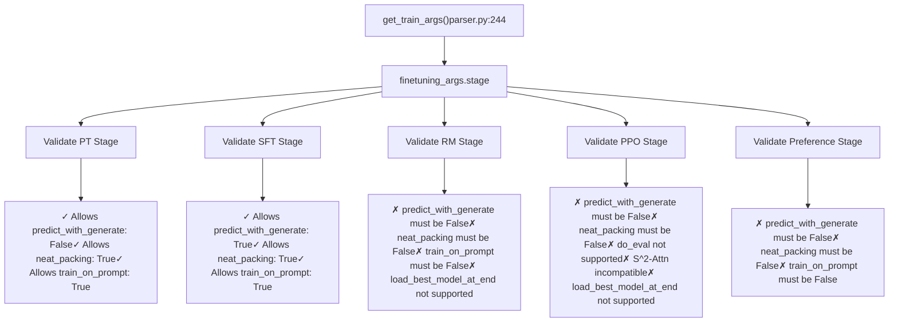
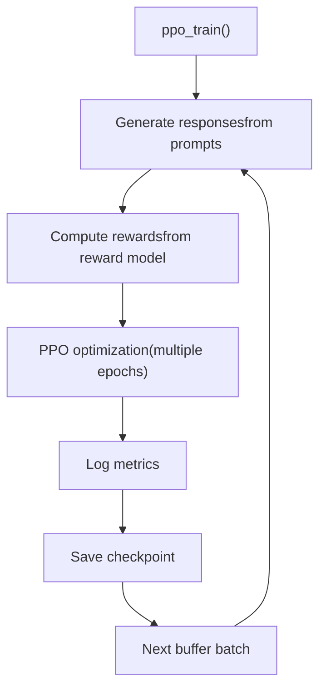
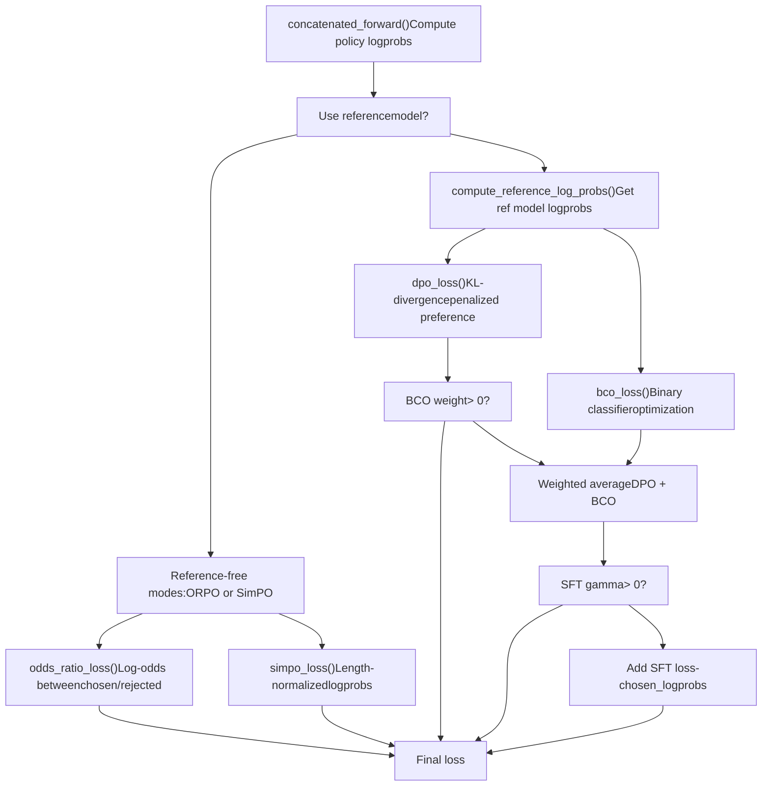
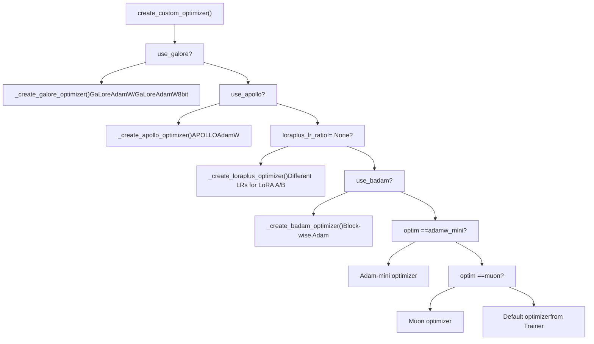
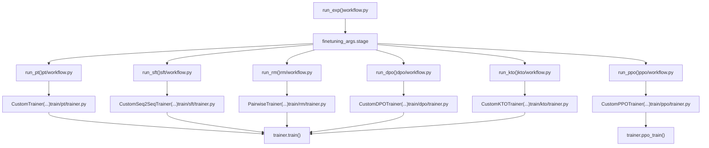

# Training Stages and Trainers

Relevant source files

-   [README.md](https://github.com/hiyouga/LlamaFactory/blob/355d5c5e/README.md?plain=1)
-   [README\_zh.md](https://github.com/hiyouga/LlamaFactory/blob/355d5c5e/README_zh.md?plain=1)
-   [src/llamafactory/hparams/finetuning\_args.py](https://github.com/hiyouga/LlamaFactory/blob/355d5c5e/src/llamafactory/hparams/finetuning_args.py)
-   [src/llamafactory/hparams/parser.py](https://github.com/hiyouga/LlamaFactory/blob/355d5c5e/src/llamafactory/hparams/parser.py)
-   [src/llamafactory/train/dpo/trainer.py](https://github.com/hiyouga/LlamaFactory/blob/355d5c5e/src/llamafactory/train/dpo/trainer.py)
-   [src/llamafactory/train/kto/trainer.py](https://github.com/hiyouga/LlamaFactory/blob/355d5c5e/src/llamafactory/train/kto/trainer.py)
-   [src/llamafactory/train/ppo/trainer.py](https://github.com/hiyouga/LlamaFactory/blob/355d5c5e/src/llamafactory/train/ppo/trainer.py)
-   [src/llamafactory/train/pt/trainer.py](https://github.com/hiyouga/LlamaFactory/blob/355d5c5e/src/llamafactory/train/pt/trainer.py)
-   [src/llamafactory/train/rm/trainer.py](https://github.com/hiyouga/LlamaFactory/blob/355d5c5e/src/llamafactory/train/rm/trainer.py)
-   [src/llamafactory/train/sft/trainer.py](https://github.com/hiyouga/LlamaFactory/blob/355d5c5e/src/llamafactory/train/sft/trainer.py)
-   [src/llamafactory/train/trainer\_utils.py](https://github.com/hiyouga/LlamaFactory/blob/355d5c5e/src/llamafactory/train/trainer_utils.py)

This document describes LlamaFactory's training stage system and the custom trainer implementations for each stage. It covers how to select training stages, the purpose of each stage, and the technical implementation of stage-specific trainers.

For information about configuring training arguments, see [Argument Types and Validation](/hiyouga/LlamaFactory/3.1-argument-types-and-validation). For details on custom optimizers like GaLore and BAdam, see [Custom Optimizers](/hiyouga/LlamaFactory/6.2-custom-optimizers).

---

## Overview of Training Stages

LlamaFactory supports eight distinct training stages, each implemented with a specialized trainer class. The stage is selected via the `stage` parameter in `FinetuningArguments` and determines the training objective, loss function, and data requirements.

### Supported Stages

| Stage | Trainer Class | Base Class | Purpose | Dataset Requirements |
| --- | --- | --- | --- | --- |
| `pt` | `CustomTrainer` | `transformers.Trainer` | Pre-training / Continued pre-training | Unsupervised text data |
| `sft` | `CustomSeq2SeqTrainer` | `transformers.Seq2SeqTrainer` | Supervised fine-tuning | Instruction-response pairs |
| `rm` | `PairwiseTrainer` | `transformers.Trainer` | Reward model training | Preference pairs (chosen/rejected) |
| `ppo` | `CustomPPOTrainer` | `trl.PPOTrainer` | Proximal Policy Optimization | Query prompts + reward model |
| `dpo` | `CustomDPOTrainer` | `trl.DPOTrainer` | Direct Preference Optimization | Preference pairs |
| `kto` | `CustomKTOTrainer` | `trl.KTOTrainer` | Kahneman-Tversky Optimization | Binary feedback (desirable/undesirable) |
| `orpo` | `CustomDPOTrainer` | `trl.DPOTrainer` | Odds Ratio Preference Optimization | Preference pairs |
| `simpo` | `CustomDPOTrainer` | `trl.DPOTrainer` | Simple Preference Optimization | Preference pairs |

**Sources:** [src/llamafactory/hparams/finetuning\_args.py453-498](https://github.com/hiyouga/LlamaFactory/blob/355d5c5e/src/llamafactory/hparams/finetuning_args.py#L453-L498) [README.md349-361](https://github.com/hiyouga/LlamaFactory/blob/355d5c5e/README.md?plain=1#L349-L361) [src/llamafactory/train/pt/trainer.py34-95](https://github.com/hiyouga/LlamaFactory/blob/355d5c5e/src/llamafactory/train/pt/trainer.py#L34-L95) [src/llamafactory/train/sft/trainer.py47-179](https://github.com/hiyouga/LlamaFactory/blob/355d5c5e/src/llamafactory/train/sft/trainer.py#L47-L179) [src/llamafactory/train/rm/trainer.py43-130](https://github.com/hiyouga/LlamaFactory/blob/355d5c5e/src/llamafactory/train/rm/trainer.py#L43-L130) [src/llamafactory/train/ppo/trainer.py64-199](https://github.com/hiyouga/LlamaFactory/blob/355d5c5e/src/llamafactory/train/ppo/trainer.py#L64-L199) [src/llamafactory/train/dpo/trainer.py44-301](https://github.com/hiyouga/LlamaFactory/blob/355d5c5e/src/llamafactory/train/dpo/trainer.py#L44-L301) [src/llamafactory/train/kto/trainer.py43-302](https://github.com/hiyouga/LlamaFactory/blob/355d5c5e/src/llamafactory/train/kto/trainer.py#L43-L302)

---

## Stage Selection and Validation

The training stage is specified in `FinetuningArguments.stage` and validated during argument parsing. The parser enforces compatibility rules between stages and other configuration options.

### Stage-Specific Validation Rules


**Key Validation Logic:**

-   **Non-SFT stages** cannot use `predict_with_generate`, `neat_packing`, or `train_on_prompt` ([parser.py256-264](https://github.com/hiyouga/LlamaFactory/blob/355d5c5e/parser.py#L256-L264))
-   **RM and PPO** stages do not support `load_best_model_at_end` ([parser.py269-270](https://github.com/hiyouga/LlamaFactory/blob/355d5c5e/parser.py#L269-L270))
-   **PPO stage** requires `do_train=True` and does not support evaluation ([parser.py273-274](https://github.com/hiyouga/LlamaFactory/blob/355d5c5e/parser.py#L273-L274))
-   **SFT stage** with `do_predict=True` must enable `predict_with_generate` ([parser.py266-267](https://github.com/hiyouga/LlamaFactory/blob/355d5c5e/parser.py#L266-L267))

**Sources:** [src/llamafactory/hparams/parser.py256-287](https://github.com/hiyouga/LlamaFactory/blob/355d5c5e/src/llamafactory/hparams/parser.py#L256-L287)

---

## Trainer Architecture

All custom trainers inherit from HuggingFace Transformers base classes and override key methods to inject LlamaFactory-specific behavior.

### Trainer Class Hierarchy

```mermaid
flowchart TD
    BaseTrainer["transformers.Trainer"]
    Seq2SeqTrainer["transformers.Seq2SeqTrainer"]
    PPOTrainer["trl.PPOTrainer"]
    DPOTrainer["trl.DPOTrainer"]
    KTOTrainer["trl.KTOTrainer"]
    CustomTrainer["CustomTrainertrain/pt/trainer.py"]
    CustomSeq2SeqTrainer["CustomSeq2SeqTrainertrain/sft/trainer.py"]
    PairwiseTrainer["PairwiseTrainertrain/rm/trainer.py"]
    CustomPPOTrainer["CustomPPOTrainertrain/ppo/trainer.py"]
    CustomDPOTrainer["CustomDPOTrainertrain/dpo/trainer.py"]
    CustomKTOTrainer["CustomKTOTrainertrain/kto/trainer.py"]

    BaseTrainer --> CustomTrainer
    Seq2SeqTrainer --> CustomSeq2SeqTrainer
    BaseTrainer --> PairwiseTrainer
    PPOTrainer --> CustomPPOTrainer
    BaseTrainer --> CustomPPOTrainer
    DPOTrainer --> CustomDPOTrainer
    BaseTrainer --> CustomDPOTrainer
    KTOTrainer --> CustomKTOTrainer
    BaseTrainer --> CustomKTOTrainer
```


### Common Override Methods

All custom trainers override these methods from the base `Trainer` class:

| Method | Purpose | Implemented In |
| --- | --- | --- |
| `create_optimizer()` | Create custom optimizers (GaLore, BAdam, LoRA+, etc.) | All trainers |
| `create_scheduler()` | Create custom learning rate schedulers | All trainers |
| `_get_train_sampler()` | Optionally disable shuffling via `disable_shuffling` flag | All trainers |
| `compute_loss()` | Stage-specific loss computation | RM, SFT, PT trainers |

**Sources:** [src/llamafactory/train/pt/trainer.py72-94](https://github.com/hiyouga/LlamaFactory/blob/355d5c5e/src/llamafactory/train/pt/trainer.py#L72-L94) [src/llamafactory/train/sft/trainer.py94-116](https://github.com/hiyouga/LlamaFactory/blob/355d5c5e/src/llamafactory/train/sft/trainer.py#L94-L116) [src/llamafactory/train/rm/trainer.py67-110](https://github.com/hiyouga/LlamaFactory/blob/355d5c5e/src/llamafactory/train/rm/trainer.py#L67-L110) [src/llamafactory/train/ppo/trainer.py64-199](https://github.com/hiyouga/LlamaFactory/blob/355d5c5e/src/llamafactory/train/ppo/trainer.py#L64-L199) [src/llamafactory/train/dpo/trainer.py118-141](https://github.com/hiyouga/LlamaFactory/blob/355d5c5e/src/llamafactory/train/dpo/trainer.py#L118-L141) [src/llamafactory/train/kto/trainer.py115-139](https://github.com/hiyouga/LlamaFactory/blob/355d5c5e/src/llamafactory/train/kto/trainer.py#L115-L139)

---

## Stage-Specific Trainer Implementations

### Pre-Training (PT): CustomTrainer

**File:** [src/llamafactory/train/pt/trainer.py](https://github.com/hiyouga/LlamaFactory/blob/355d5c5e/src/llamafactory/train/pt/trainer.py)

**Purpose:** Continued pre-training on unlabeled text data using causal language modeling.

**Key Features:**

-   Inherits from `transformers.Trainer`
-   Simplest trainer implementation (base training loop)
-   Supports FP8 training via `configure_fp8_environment()` ([trainer.py45-50](https://github.com/hiyouga/LlamaFactory/blob/355d5c5e/trainer.py#L45-L50))
-   Default packing enabled unless explicitly disabled ([parser.py460](https://github.com/hiyouga/LlamaFactory/blob/355d5c5e/parser.py#L460-L460))

**Constructor Parameters:**

```
CustomTrainer(    finetuning_args: FinetuningArguments,    processor: Optional[ProcessorMixin],  # For multimodal models    model_args: Optional[ModelArguments],    **kwargs  # Standard Trainer kwargs (model, args, train_dataset, etc.))
```
**Sources:** [src/llamafactory/train/pt/trainer.py34-95](https://github.com/hiyouga/LlamaFactory/blob/355d5c5e/src/llamafactory/train/pt/trainer.py#L34-L95)

---

### Supervised Fine-Tuning (SFT): CustomSeq2SeqTrainer

**File:** [src/llamafactory/train/sft/trainer.py](https://github.com/hiyouga/LlamaFactory/blob/355d5c5e/src/llamafactory/train/sft/trainer.py)

**Purpose:** Fine-tune models on instruction-response pairs with support for generative evaluation metrics.

**Key Features:**

-   Inherits from `transformers.Seq2SeqTrainer`
-   Supports `predict_with_generate` for BLEU/ROUGE metrics ([trainer.py119-143](https://github.com/hiyouga/LlamaFactory/blob/355d5c5e/trainer.py#L119-L143))
-   Saves generation predictions to `generated_predictions.jsonl` ([trainer.py145-178](https://github.com/hiyouga/LlamaFactory/blob/355d5c5e/trainer.py#L145-L178))
-   Removes prompt from generated tokens during prediction ([trainer.py140](https://github.com/hiyouga/LlamaFactory/blob/355d5c5e/trainer.py#L140-L140))
-   Optional DFT (Data Filtering Training) loss via `use_dft_loss` ([trainer.py86-89](https://github.com/hiyouga/LlamaFactory/blob/355d5c5e/trainer.py#L86-L89))

**Prediction Saving:**

```
def save_predictions(self, dataset, predict_results, skip_special_tokens=True):    # Saves JSONL with format: {"prompt": ..., "predict": ..., "label": ...}    output_file = os.path.join(self.args.output_dir, "generated_predictions.jsonl")
```
**Sources:** [src/llamafactory/train/sft/trainer.py47-179](https://github.com/hiyouga/LlamaFactory/blob/355d5c5e/src/llamafactory/train/sft/trainer.py#L47-L179)

---

### Reward Modeling (RM): PairwiseTrainer

**File:** [src/llamafactory/train/rm/trainer.py](https://github.com/hiyouga/LlamaFactory/blob/355d5c5e/src/llamafactory/train/rm/trainer.py)

**Purpose:** Train reward models by learning preference rankings from chosen/rejected pairs.

**Key Features:**

-   Inherits from `transformers.Trainer`
-   Requires models with value heads (e.g., `AutoModelForCausalLMWithValueHead`)
-   Uses `FixValueHeadModelCallback` to handle value head state ([trainer.py56](https://github.com/hiyouga/LlamaFactory/blob/355d5c5e/trainer.py#L56-L56))
-   Computes pairwise ranking loss using chosen vs. rejected scores

**Loss Computation:**

```
def compute_loss(self, model, inputs, return_outputs=False):    # Split batch into chosen (first n) and rejected (last n)    batch_size = inputs["input_ids"].size(0) // 2    chosen_masks, rejected_masks = torch.split(inputs["attention_mask"], batch_size, dim=0)        # Get reward scores at last token position    chosen_scores = chosen_rewards.gather(dim=-1, index=(chosen_masks.sum(dim=-1, keepdim=True) - 1))    rejected_scores = rejected_rewards.gather(dim=-1, index=(rejected_masks.sum(dim=-1, keepdim=True) - 1))        # Pairwise ranking loss    loss = -torch.nn.functional.logsigmoid(chosen_scores - rejected_scores).mean()
```
**Output Format:** Saves predictions to `generated_predictions.jsonl` with format:

```
{"chosen": 0.85, "rejected": -0.42}
```
**Sources:** [src/llamafactory/train/rm/trainer.py43-130](https://github.com/hiyouga/LlamaFactory/blob/355d5c5e/src/llamafactory/train/rm/trainer.py#L43-L130)

---

### PPO Training: CustomPPOTrainer

**File:** [src/llamafactory/train/ppo/trainer.py](https://github.com/hiyouga/LlamaFactory/blob/355d5c5e/src/llamafactory/train/ppo/trainer.py)

**Purpose:** Reinforcement learning from human feedback using Proximal Policy Optimization.

**Key Features:**

-   Inherits from **both** `trl.PPOTrainer` and `transformers.Trainer` ([trainer.py64](https://github.com/hiyouga/LlamaFactory/blob/355d5c5e/trainer.py#L64-L64))
-   Requires separate reward model (full model, LoRA adapter, or API) ([trainer.py149-157](https://github.com/hiyouga/LlamaFactory/blob/355d5c5e/trainer.py#L149-L157))
-   Implements custom training loop `ppo_train()` instead of using standard `train()` ([trainer.py200-372](https://github.com/hiyouga/LlamaFactory/blob/355d5c5e/trainer.py#L200-L372))
-   Supports three reward model types: `full`, `lora`, `api` ([trainer.py179-188](https://github.com/hiyouga/LlamaFactory/blob/355d5c5e/trainer.py#L179-L188))

**PPO-Specific Configuration:**

```
ppo_config = PPOConfig(    batch_size=backward_batch_size * finetuning_args.ppo_buffer_size,  # Experience buffer    ppo_epochs=finetuning_args.ppo_epochs,  # Optimization epochs per batch    target=finetuning_args.ppo_target,  # Target KL divergence    use_score_norm=finetuning_args.ppo_score_norm,    whiten_rewards=finetuning_args.ppo_whiten_rewards,)
```
**Training Loop Structure:**


**Reward Model Integration:**

-   **Full model:** Separate `AutoModelForCausalLMWithValueHead` instance ([trainer.py180-188](https://github.com/hiyouga/LlamaFactory/blob/355d5c5e/trainer.py#L180-L188))
-   **LoRA adapter:** Load as adapter named `"reward"` on policy model ([trainer.py158-172](https://github.com/hiyouga/LlamaFactory/blob/355d5c5e/trainer.py#L158-L172))
-   **API server:** HTTP endpoint for reward computation ([trainer.py154-156](https://github.com/hiyouga/LlamaFactory/blob/355d5c5e/trainer.py#L154-L156))

**Sources:** [src/llamafactory/train/ppo/trainer.py64-372](https://github.com/hiyouga/LlamaFactory/blob/355d5c5e/src/llamafactory/train/ppo/trainer.py#L64-L372)

---

### Preference Learning: DPO, ORPO, SimPO

**File:** [src/llamafactory/train/dpo/trainer.py](https://github.com/hiyouga/LlamaFactory/blob/355d5c5e/src/llamafactory/train/dpo/trainer.py)

**Trainer Class:** `CustomDPOTrainer`

**Purpose:** Learn from preference data without explicit reward models using various preference loss functions.

**Supported Loss Types:**

-   **DPO** (`sigmoid`): Direct Preference Optimization with KL penalty
-   **IPO** (`ipo`): Identity Preference Optimization
-   **ORPO** (`orpo`): Odds Ratio Preference Optimization (reference-free)
-   **SimPO** (`simpo`): Simple Preference Optimization (reference-free)
-   **Hinge Loss** (`hinge`): Hinge-based preference loss

**Key Features:**

-   Inherits from `trl.DPOTrainer` but overrides most logic
-   Optional reference model for KL divergence ([trainer.py94-102](https://github.com/hiyouga/LlamaFactory/blob/355d5c5e/trainer.py#L94-L102))
-   Reference-free modes for ORPO and SimPO ([trainer.py188-194](https://github.com/hiyouga/LlamaFactory/blob/355d5c5e/trainer.py#L188-L194))
-   Optional Binary Classifier Optimization (BCO) weighting ([trainer.py203-208](https://github.com/hiyouga/LlamaFactory/blob/355d5c5e/trainer.py#L203-L208))
-   Optional supervised fine-tuning (SFT) loss mixing ([trainer.py294-295](https://github.com/hiyouga/LlamaFactory/blob/355d5c5e/trainer.py#L294-L295))

**Loss Computation Flow:**


**ORPO Loss Implementation:**

```
def odds_ratio_loss(self, chosen_logps, rejected_logps):    log_odds = (chosen_logps - rejected_logps) - (        torch.log1p(-torch.exp(chosen_logps)) - torch.log1p(-torch.exp(rejected_logps))    )    sft_loss = -chosen_logps    odds_ratio_loss = -F.logsigmoid(log_odds)    return sft_loss + self.beta * odds_ratio_loss
```
**SimPO Loss Implementation:**

```
def simpo_loss(self, chosen_logps, rejected_logps):    pi_logratios = chosen_logps - rejected_logps    gamma_logratios = self.simpo_gamma / self.beta    logits = pi_logratios - gamma_logratios    return -F.logsigmoid(self.beta * logits)
```
**Configuration Parameters:**

-   `pref_beta`: Temperature parameter (default: 0.1)
-   `pref_loss`: Loss type selection
-   `pref_ftx`: SFT loss mixing coefficient
-   `pref_bco_weight`: BCO weighting coefficient
-   `dpo_label_smoothing`: Robust DPO smoothing
-   `simpo_gamma`: SimPO reward margin
-   `ld_alpha`: LD-DPO verbose token weighting

**Sources:** [src/llamafactory/train/dpo/trainer.py44-301](https://github.com/hiyouga/LlamaFactory/blob/355d5c5e/src/llamafactory/train/dpo/trainer.py#L44-L301) [src/llamafactory/hparams/finetuning\_args.py168-260](https://github.com/hiyouga/LlamaFactory/blob/355d5c5e/src/llamafactory/hparams/finetuning_args.py#L168-L260)

---

### Kahneman-Tversky Optimization (KTO): CustomKTOTrainer

**File:** [src/llamafactory/train/kto/trainer.py](https://github.com/hiyouga/LlamaFactory/blob/355d5c5e/src/llamafactory/train/kto/trainer.py)

**Purpose:** Learn from binary feedback (desirable/undesirable) without paired comparisons.

**Key Differences from DPO:**

-   Accepts unpaired examples with binary labels (`kto_tags`: True/False)
-   Uses separate loss computation for desirable vs. undesirable examples
-   Includes KL divergence term between current and reference policy

**Loss Computation:**

```
def kto_loss(    self,     policy_chosen_logps,     policy_rejected_logps,    policy_kl_logps,    reference_chosen_logps,     reference_rejected_logps,    reference_kl_logps):    # KL divergence: E[log(π(x|y)) - log(π_ref(x|y))]    kl = (policy_kl_logps - reference_kl_logps).mean()        # Chosen loss: -log(σ(β * (log π - log π_ref - KL)))    chosen_logratios = policy_chosen_logps - reference_chosen_logps    chosen_losses = -F.logsigmoid(self.beta * (chosen_logratios - kl))        # Rejected loss: -log(σ(β * (log π_ref - log π - KL)))    rejected_logratios = policy_rejected_logps - reference_rejected_logps    rejected_losses = -F.logsigmoid(self.beta * (rejected_logratios - kl))        # Weight by desirable/undesirable coefficients    return self.desirable_weight * chosen_losses + self.undesirable_weight * rejected_losses
```
**Data Format:** Unlike DPO which requires pairs, KTO accepts individual examples with tags:

-   `kto_tags`: Boolean tensor indicating desirable (True) or undesirable (False)
-   Input batches can have mixed desirable/undesirable examples

**Configuration Parameters:**

-   `pref_beta`: Temperature parameter
-   `kto_chosen_weight`: Weight for desirable examples (default: 1.0)
-   `kto_rejected_weight`: Weight for undesirable examples (default: 1.0)
-   `pref_ftx`: Optional SFT loss mixing

**Sources:** [src/llamafactory/train/kto/trainer.py43-302](https://github.com/hiyouga/LlamaFactory/blob/355d5c5e/src/llamafactory/train/kto/trainer.py#L43-L302) [src/llamafactory/hparams/finetuning\_args.py191-198](https://github.com/hiyouga/LlamaFactory/blob/355d5c5e/src/llamafactory/hparams/finetuning_args.py#L191-L198)

---

## Common Trainer Features

All custom trainers share these core capabilities implemented through inheritance and common utilities.

### Custom Optimizer Creation

**Function:** `create_custom_optimizer()` in [src/llamafactory/train/trainer\_utils.py198-408](https://github.com/hiyouga/LlamaFactory/blob/355d5c5e/src/llamafactory/train/trainer_utils.py#L198-L408)

**Supported Optimizers:**

| Optimizer | Condition | Implementation |
| --- | --- | --- |
| **GaLore** | `finetuning_args.use_galore == True` | `_create_galore_optimizer()` |
| **APOLLO** | `finetuning_args.use_apollo == True` | `_create_apollo_optimizer()` |
| **LoRA+** | `finetuning_args.loraplus_lr_ratio is not None` | `_create_loraplus_optimizer()` |
| **BAdam** | `finetuning_args.use_badam == True` | `_create_badam_optimizer()` |
| **Adam-mini** | `training_args.optim == "adamw_mini"` | Uses `adam_mini` package |
| **Muon** | `training_args.optim == "muon"` | Uses `muon` package |
| **Default** | None of above | `Trainer.get_optimizer_cls_and_kwargs()` |

**Optimizer Selection Flow:**


**GaLore Optimizer:**

-   Applies low-rank gradient projection to target modules ([trainer\_utils.py198-283](https://github.com/hiyouga/LlamaFactory/blob/355d5c5e/trainer_utils.py#L198-L283))
-   Supports layerwise optimization via `galore_layerwise` ([trainer\_utils.py246-270](https://github.com/hiyouga/LlamaFactory/blob/355d5c5e/trainer_utils.py#L246-L270))
-   Uses `DummyOptimizer` wrapper for layerwise mode ([trainer\_utils.py66-83](https://github.com/hiyouga/LlamaFactory/blob/355d5c5e/trainer_utils.py#L66-L83))

**LoRA+ Optimizer:**

-   Sets different learning rates for LoRA A and B matrices ([trainer\_utils.py370-407](https://github.com/hiyouga/LlamaFactory/blob/355d5c5e/trainer_utils.py#L370-L407))
-   Formula: `lr_B = lr_A * loraplus_lr_ratio`
-   Separate rate for embedding layers via `loraplus_lr_embedding`

**Sources:** [src/llamafactory/train/trainer\_utils.py198-408](https://github.com/hiyouga/LlamaFactory/blob/355d5c5e/src/llamafactory/train/trainer_utils.py#L198-L408)

---

### Custom Scheduler Creation

**Function:** `create_custom_scheduler()` in [src/llamafactory/train/trainer\_utils.py410-441](https://github.com/hiyouga/LlamaFactory/blob/355d5c5e/src/llamafactory/train/trainer_utils.py#L410-L441)

**Purpose:** Wraps BAdam scheduler if enabled, otherwise uses standard Transformers scheduler.

```
def create_custom_scheduler(args, num_training_steps, optimizer):    if args.use_badam:        from badam import BAdamScheduler, BlockOptimizerRatio        # Wrap scheduler for BAdam block switching        return BAdamScheduler(            optimizer=optimizer,            ...            base_scheduler=get_scheduler(...)        )    else:        # Standard scheduler creation delegated to Trainer        pass
```
**Sources:** [src/llamafactory/train/trainer\_utils.py410-441](https://github.com/hiyouga/LlamaFactory/blob/355d5c5e/src/llamafactory/train/trainer_utils.py#L410-L441)

---

### Callback System

All trainers support these callbacks:

| Callback | Purpose | When Added |
| --- | --- | --- |
| `SaveProcessorCallback` | Save multimodal processor with checkpoints | When `processor is not None` |
| `FixValueHeadModelCallback` | Fix value head state dict for RM/PPO | RM and PPO trainers |
| `BAdamCallback` | Handle BAdam block switching | When `use_badam == True` |

**SaveProcessorCallback Implementation:**

```
class SaveProcessorCallback(TrainerCallback):    def on_save(self, args, state, control, **kwargs):        # Save processor to checkpoint directory        processor.save_pretrained(            os.path.join(args.output_dir, f"checkpoint-{state.global_step}")        )
```
**Sources:** [src/llamafactory/train/callbacks.py](https://github.com/hiyouga/LlamaFactory/blob/355d5c5e/src/llamafactory/train/callbacks.py) [src/llamafactory/train/sft/trainer.py77-78](https://github.com/hiyouga/LlamaFactory/blob/355d5c5e/src/llamafactory/train/sft/trainer.py#L77-L78) [src/llamafactory/train/rm/trainer.py56-59](https://github.com/hiyouga/LlamaFactory/blob/355d5c5e/src/llamafactory/train/rm/trainer.py#L56-L59)

---

### Training Sampler Configuration

All trainers support disabling dataset shuffling via `finetuning_args.disable_shuffling`:

```
def _get_train_sampler(self, *args, **kwargs):    if self.finetuning_args.disable_shuffling:        return torch.utils.data.SequentialSampler(self.train_dataset)    return super()._get_train_sampler(*args, **kwargs)
```
This is useful for:

-   Curriculum learning
-   Debugging (reproducible batch order)
-   Resuming training from exact data position

**Sources:** [src/llamafactory/train/pt/trainer.py86-90](https://github.com/hiyouga/LlamaFactory/blob/355d5c5e/src/llamafactory/train/pt/trainer.py#L86-L90) [src/llamafactory/train/sft/trainer.py107-112](https://github.com/hiyouga/LlamaFactory/blob/355d5c5e/src/llamafactory/train/sft/trainer.py#L107-L112) [src/llamafactory/train/rm/trainer.py80-85](https://github.com/hiyouga/LlamaFactory/blob/355d5c5e/src/llamafactory/train/rm/trainer.py#L80-L85) [src/llamafactory/train/dpo/trainer.py132-136](https://github.com/hiyouga/LlamaFactory/blob/355d5c5e/src/llamafactory/train/dpo/trainer.py#L132-L136) [src/llamafactory/train/kto/trainer.py128-134](https://github.com/hiyouga/LlamaFactory/blob/355d5c5e/src/llamafactory/train/kto/trainer.py#L128-L134)

---

## Trainer Instantiation Flow

The workflow module determines which trainer to instantiate based on the `stage` parameter.

### Instantiation Decision Tree


### Example: SFT Workflow Instantiation

**File:** [src/llamafactory/train/sft/workflow.py](https://github.com/hiyouga/LlamaFactory/blob/355d5c5e/src/llamafactory/train/sft/workflow.py)

```
def run_sft(    model_args: ModelArguments,    data_args: DataArguments,    training_args: Seq2SeqTrainingArguments,    finetuning_args: FinetuningArguments,    generating_args: GeneratingArguments,    callbacks: Optional[list[TrainerCallback]] = None,):    # 1. Load tokenizer and dataset    tokenizer_module = load_tokenizer(model_args)    dataset_module = get_dataset(model_args, data_args, training_args, stage="sft", **tokenizer_module)        # 2. Load model    model = load_model(tokenizer_module["tokenizer"], model_args, finetuning_args, training_args.do_train)        # 3. Initialize data collator    data_collator = SFTDataCollatorWith4DAttentionMask(...)        # 4. Create trainer    trainer = CustomSeq2SeqTrainer(        model=model,        args=training_args,        finetuning_args=finetuning_args,        data_collator=data_collator,        callbacks=callbacks,        **dataset_module,        **tokenizer_module,    )        # 5. Train    if training_args.do_train:        train_result = trainer.train(resume_from_checkpoint=training_args.resume_from_checkpoint)        trainer.save_model()        trainer.log_metrics("train", train_result.metrics)        trainer.save_metrics("train", train_result.metrics)        trainer.save_state()
```
**Sources:** [src/llamafactory/train/sft/workflow.py](https://github.com/hiyouga/LlamaFactory/blob/355d5c5e/src/llamafactory/train/sft/workflow.py) [src/llamafactory/train/pt/workflow.py](https://github.com/hiyouga/LlamaFactory/blob/355d5c5e/src/llamafactory/train/pt/workflow.py) [src/llamafactory/train/rm/workflow.py](https://github.com/hiyouga/LlamaFactory/blob/355d5c5e/src/llamafactory/train/rm/workflow.py) [src/llamafactory/train/ppo/workflow.py](https://github.com/hiyouga/LlamaFactory/blob/355d5c5e/src/llamafactory/train/ppo/workflow.py) [src/llamafactory/train/dpo/workflow.py](https://github.com/hiyouga/LlamaFactory/blob/355d5c5e/src/llamafactory/train/dpo/workflow.py) [src/llamafactory/train/kto/workflow.py](https://github.com/hiyouga/LlamaFactory/blob/355d5c5e/src/llamafactory/train/kto/workflow.py)

---

## Stage Compatibility Matrix

This table summarizes feature compatibility across training stages:

| Feature | PT | SFT | RM | PPO | DPO | KTO | ORPO | SimPO |
| --- | --- | --- | --- | --- | --- | --- | --- | --- |
| Sequence packing | ✓ | ✓ | ✗ | ✗ | ✗ | ✗ | ✗ | ✗ |
| Neat packing | ✓ | ✓ | ✗ | ✗ | ✗ | ✗ | ✗ | ✗ |
| `predict_with_generate` | ✗ | ✓ | ✗ | ✗ | ✗ | ✗ | ✗ | ✗ |
| `train_on_prompt` | ✓ | ✓ | ✗ | ✗ | ✗ | ✗ | ✗ | ✗ |
| `mask_history` | ✓ | ✓ | ✗ | ✗ | ✗ | ✗ | ✗ | ✗ |
| Reference model | ✗ | ✗ | ✗ | ✗ | ✓ | ✓ | ✗ | ✗ |
| Reward model | ✗ | ✗ | ✗ | ✓ | ✗ | ✗ | ✗ | ✗ |
| Evaluation | ✓ | ✓ | ✓ | ✗ | ✓ | ✓ | ✓ | ✓ |
| `load_best_model_at_end` | ✓ | ✓ | ✗ | ✗ | ✓ | ✓ | ✓ | ✓ |
| Quantization | ✓ | ✓ | ✓ | ✓ | ✓ | ✓ | ✓ | ✓ |
| DeepSpeed ZeRO-3 | ✓ | ✓ | ✓ | ✓ | ✓ | ✓ | ✓ | ✓ |
| GaLore optimizer | ✓ | ✓ | ✓ | ✓ | ✓ | ✓ | ✓ | ✓ |
| BAdam optimizer | ✓ | ✓ | ✓ | ✓ | ✓ | ✓ | ✓ | ✓ |

**Sources:** [src/llamafactory/hparams/parser.py256-287](https://github.com/hiyouga/LlamaFactory/blob/355d5c5e/src/llamafactory/hparams/parser.py#L256-L287) [README.md349-361](https://github.com/hiyouga/LlamaFactory/blob/355d5c5e/README.md?plain=1#L349-L361)
