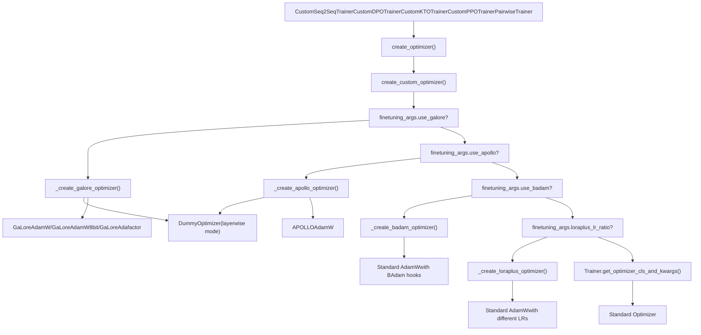
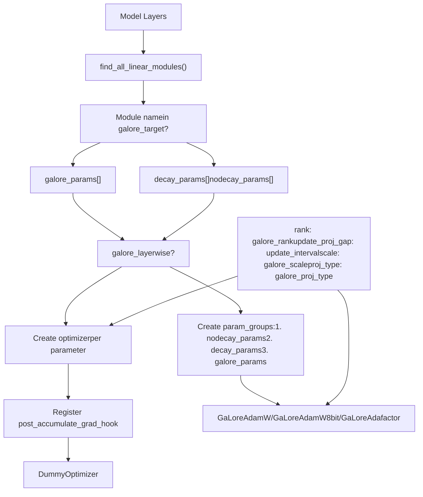
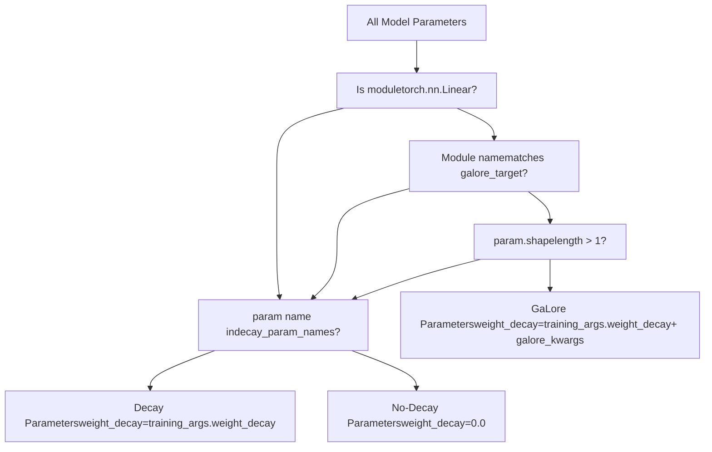
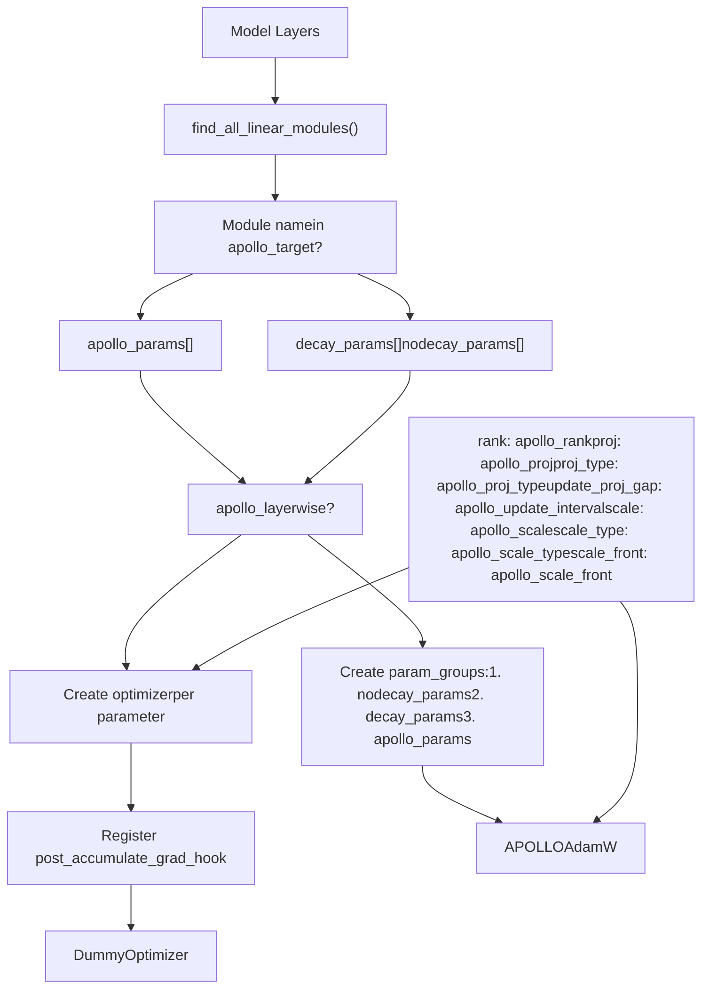
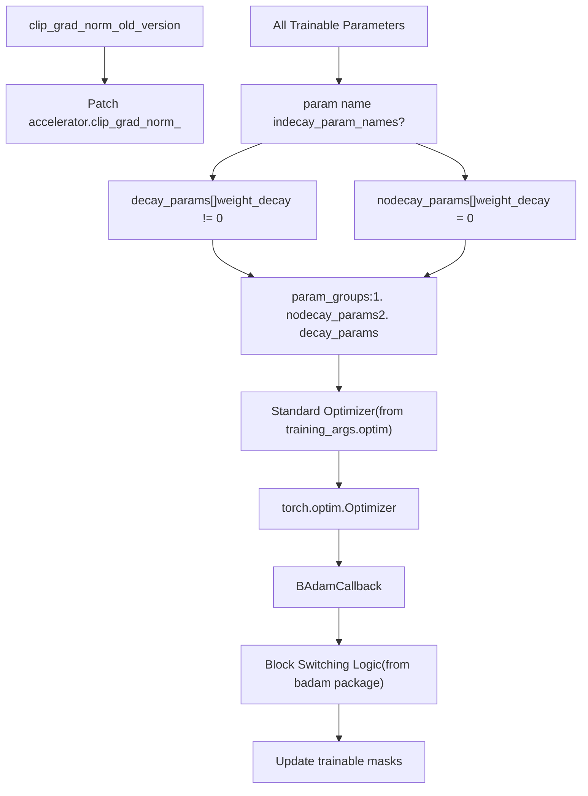
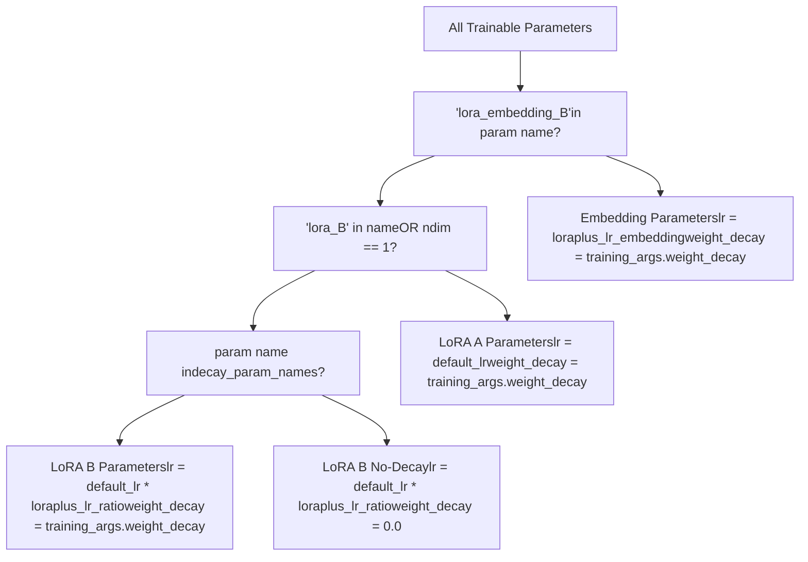
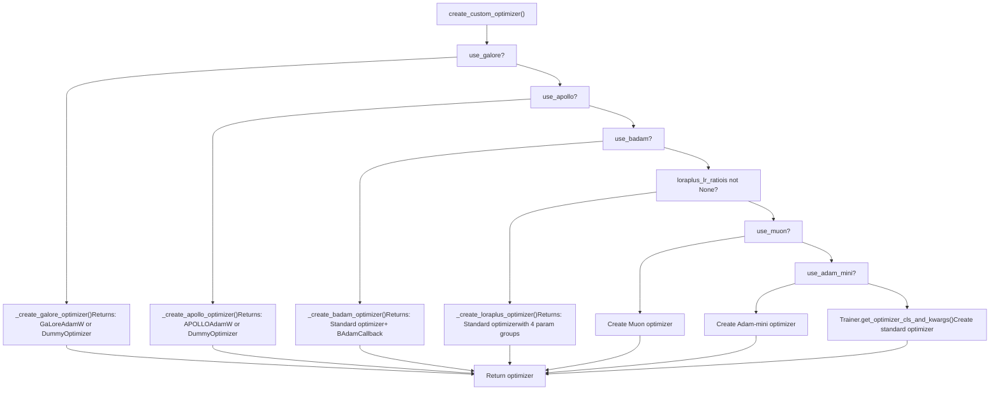

# Custom Optimizers

Relevant source files

-   [README.md](https://github.com/hiyouga/LlamaFactory/blob/355d5c5e/README.md?plain=1)
-   [README\_zh.md](https://github.com/hiyouga/LlamaFactory/blob/355d5c5e/README_zh.md?plain=1)
-   [src/llamafactory/hparams/finetuning\_args.py](https://github.com/hiyouga/LlamaFactory/blob/355d5c5e/src/llamafactory/hparams/finetuning_args.py)
-   [src/llamafactory/hparams/parser.py](https://github.com/hiyouga/LlamaFactory/blob/355d5c5e/src/llamafactory/hparams/parser.py)
-   [src/llamafactory/train/dpo/trainer.py](https://github.com/hiyouga/LlamaFactory/blob/355d5c5e/src/llamafactory/train/dpo/trainer.py)
-   [src/llamafactory/train/kto/trainer.py](https://github.com/hiyouga/LlamaFactory/blob/355d5c5e/src/llamafactory/train/kto/trainer.py)
-   [src/llamafactory/train/ppo/trainer.py](https://github.com/hiyouga/LlamaFactory/blob/355d5c5e/src/llamafactory/train/ppo/trainer.py)
-   [src/llamafactory/train/pt/trainer.py](https://github.com/hiyouga/LlamaFactory/blob/355d5c5e/src/llamafactory/train/pt/trainer.py)
-   [src/llamafactory/train/rm/trainer.py](https://github.com/hiyouga/LlamaFactory/blob/355d5c5e/src/llamafactory/train/rm/trainer.py)
-   [src/llamafactory/train/sft/trainer.py](https://github.com/hiyouga/LlamaFactory/blob/355d5c5e/src/llamafactory/train/sft/trainer.py)
-   [src/llamafactory/train/trainer\_utils.py](https://github.com/hiyouga/LlamaFactory/blob/355d5c5e/src/llamafactory/train/trainer_utils.py)

## Purpose and Scope

This page documents the custom optimizer implementations in LlamaFactory that enable memory-efficient training of large language models. These optimizers reduce memory consumption during training through techniques like gradient projection, block-wise updates, and adaptive learning rates. For information about training stages and overall training architecture, see [Training Stages and Trainers](/hiyouga/LlamaFactory/6.1-training-stages-and-trainers). For configuration of training arguments, see [Argument Types and Validation](/hiyouga/LlamaFactory/3.1-argument-types-and-validation).

## System Integration

Custom optimizers are created during trainer initialization and replace the standard optimizer from Hugging Face Transformers. The system supports six advanced optimization algorithms: GaLore, APOLLO, BAdam, LoRA+, Adam-mini, and Muon.


**Sources:** [src/llamafactory/train/trainer\_utils.py444-518](https://github.com/hiyouga/LlamaFactory/blob/355d5c5e/src/llamafactory/train/trainer_utils.py#L444-L518) [src/llamafactory/train/sft/trainer.py95-98](https://github.com/hiyouga/LlamaFactory/blob/355d5c5e/src/llamafactory/train/sft/trainer.py#L95-L98) [src/llamafactory/train/dpo/trainer.py119-122](https://github.com/hiyouga/LlamaFactory/blob/355d5c5e/src/llamafactory/train/dpo/trainer.py#L119-L122)

## Optimizer Overview

| Optimizer | Memory Reduction | Key Technique | Use Case |
| --- | --- | --- | --- |
| **GaLore** | ~60% | Low-rank gradient projection | Full-parameter training with limited memory |
| **APOLLO** | ~50% | Adaptive low-rank optimizer | Memory-efficient full-parameter training |
| **BAdam** | ~40% | Block-wise parameter updates | LoRA training with reduced memory |
| **LoRA+** | N/A | Differential learning rates | Improved LoRA convergence |
| **Adam-mini** | ~40% | Reduced optimizer states | Memory-efficient training |
| **Muon** | Variable | Momentum-based optimization | Specialized training scenarios |

**Sources:** [README.md98-99](https://github.com/hiyouga/LlamaFactory/blob/355d5c5e/README.md?plain=1#L98-L99) [src/llamafactory/hparams/finetuning\_args.py263-400](https://github.com/hiyouga/LlamaFactory/blob/355d5c5e/src/llamafactory/hparams/finetuning_args.py#L263-L400)

## GaLore (Gradient Low-Rank Projection)

### Overview

GaLore reduces memory consumption by projecting gradients into a low-rank subspace before applying optimizer updates. This allows full-parameter training with memory footprint comparable to LoRA.

### Architecture


**Sources:** [src/llamafactory/train/trainer\_utils.py198-283](https://github.com/hiyouga/LlamaFactory/blob/355d5c5e/src/llamafactory/train/trainer_utils.py#L198-L283)

### Configuration Parameters

The `GaloreArguments` dataclass defines the configuration:

-   **`use_galore`** (bool): Enable GaLore optimizer
-   **`galore_target`** (str): Target modules for GaLore projection (comma-separated or `"all"`)
-   **`galore_rank`** (int, default=16): Rank of gradient projection
-   **`galore_update_interval`** (int, default=200): Steps between projection matrix updates
-   **`galore_scale`** (float, default=2.0): Scaling coefficient for projected gradients
-   **`galore_proj_type`** (str, default="std"): Projection type (`std`, `reverse_std`, `right`, `left`, `full`)
-   **`galore_layerwise`** (bool): Enable layer-wise updates (incompatible with gradient accumulation and distributed training)

**Sources:** [src/llamafactory/hparams/finetuning\_args.py263-298](https://github.com/hiyouga/LlamaFactory/blob/355d5c5e/src/llamafactory/hparams/finetuning_args.py#L263-L298)

### Parameter Grouping Logic


**Sources:** [src/llamafactory/train/trainer\_utils.py191-233](https://github.com/hiyouga/LlamaFactory/blob/355d5c5e/src/llamafactory/train/trainer_utils.py#L191-L233)

### Layerwise Mode

When `galore_layerwise=True`, the system creates a separate optimizer instance for each parameter and uses gradient accumulation hooks:

> **[Mermaid sequence]**
> *(图表结构无法解析)*

**Sources:** [src/llamafactory/train/trainer\_utils.py246-270](https://github.com/hiyouga/LlamaFactory/blob/355d5c5e/src/llamafactory/train/trainer_utils.py#L246-L270)

### Constraints and Compatibility

The parser enforces the following constraints:

-   **Distributed training**: Layer-wise GaLore is incompatible with distributed training (`parallel_mode == DISTRIBUTED`)
-   **DeepSpeed**: GaLore is incompatible with DeepSpeed
-   **Gradient accumulation**: Layer-wise mode requires `gradient_accumulation_steps == 1`

**Sources:** [src/llamafactory/hparams/parser.py326-339](https://github.com/hiyouga/LlamaFactory/blob/355d5c5e/src/llamafactory/hparams/parser.py#L326-L339)

## APOLLO Optimizer

### Overview

APOLLO (Adaptive Projected Low-rank Optimization) is similar to GaLore but uses adaptive projection matrices and different scaling strategies. It provides more stable training with comparable memory savings.

### Architecture


**Sources:** [src/llamafactory/train/trainer\_utils.py286-367](https://github.com/hiyouga/LlamaFactory/blob/355d5c5e/src/llamafactory/train/trainer_utils.py#L286-L367)

### Configuration Parameters

The `ApolloArguments` dataclass defines the configuration:

-   **`use_apollo`** (bool): Enable APOLLO optimizer
-   **`apollo_target`** (str): Target modules for APOLLO projection (comma-separated or `"all"`)
-   **`apollo_rank`** (int, default=16): Rank of gradient projection
-   **`apollo_update_interval`** (int, default=200): Steps between projection matrix updates
-   **`apollo_scale`** (float, default=32.0): Scaling coefficient for projected gradients
-   **`apollo_proj`** (str, default="random"): Projection algorithm (`svd` or `random`)
-   **`apollo_proj_type`** (str, default="std"): Projection type (`std`, `right`, `left`)
-   **`apollo_scale_type`** (str, default="channel"): Scaling type (`channel` or `tensor`)
-   **`apollo_scale_front`** (bool): Use norm-growth limiter before scaling
-   **`apollo_layerwise`** (bool): Enable layer-wise updates

**Sources:** [src/llamafactory/hparams/finetuning\_args.py302-349](https://github.com/hiyouga/LlamaFactory/blob/355d5c5e/src/llamafactory/hparams/finetuning_args.py#L302-L349)

### Key Differences from GaLore

| Feature | GaLore | APOLLO |
| --- | --- | --- |
| Projection algorithm | SVD-based | SVD or random |
| Scaling | Fixed scale factor | Channel-wise or tensor-wise |
| Scale position | After projection | Before or after projection |
| Default scale | 2.0 | 32.0 |
| Optimizer base | AdamW, AdamW8bit, Adafactor | AdamW only |

**Sources:** [src/llamafactory/train/trainer\_utils.py198-367](https://github.com/hiyouga/LlamaFactory/blob/355d5c5e/src/llamafactory/train/trainer_utils.py#L198-L367)

## BAdam (Block-wise Adaptive Adam)

### Overview

BAdam reduces memory consumption during LoRA training by updating only a subset of parameters at each step. It switches between different parameter blocks according to a specified strategy.

### Architecture


**Sources:** [src/llamafactory/train/trainer\_utils.py410-441](https://github.com/hiyouga/LlamaFactory/blob/355d5c5e/src/llamafactory/train/trainer_utils.py#L410-L441) [src/llamafactory/train/sft/trainer.py80-84](https://github.com/hiyouga/LlamaFactory/blob/355d5c5e/src/llamafactory/train/sft/trainer.py#L80-L84)

### Configuration Parameters

The `BAdamArgument` dataclass defines the configuration:

-   **`use_badam`** (bool): Enable BAdam optimizer
-   **`badam_mode`** (str, default="layer"): Update mode (`layer` for layer-wise, `ratio` for ratio-wise)
-   **`badam_start_block`** (int, optional): Starting block index for layer-wise mode
-   **`badam_switch_mode`** (str, default="ascending"): Block switching strategy (`ascending`, `descending`, `random`, `fixed`)
-   **`badam_switch_interval`** (int, default=50): Steps between block switches (-1 to disable)
-   **`badam_update_ratio`** (float, default=0.05): Ratio of parameters to update in ratio-wise mode
-   **`badam_mask_mode`** (str, default="adjacent"): Mask mode (`adjacent` or `scatter`)
-   **`badam_verbose`** (int, default=0): Verbosity level (0=silent, 1=block prefix, 2=parameters)

**Sources:** [src/llamafactory/hparams/finetuning\_args.py353-400](https://github.com/hiyouga/LlamaFactory/blob/355d5c5e/src/llamafactory/hparams/finetuning_args.py#L353-L400)

### Integration Pattern

BAdam uses a callback-based architecture rather than a custom optimizer class. The integration involves:

1.  Create standard optimizer with parameter groups
2.  Patch `accelerator.clip_grad_norm_` with `clip_grad_norm_old_version`
3.  Register `BAdamCallback` which handles block switching

```
# From trainer initializationif finetuning_args.use_badam:    from badam import BAdamCallback, clip_grad_norm_old_version        self.accelerator.clip_grad_norm_ = MethodType(clip_grad_norm_old_version, self.accelerator)    self.add_callback(BAdamCallback)
```
**Sources:** [src/llamafactory/train/sft/trainer.py80-84](https://github.com/hiyouga/LlamaFactory/blob/355d5c5e/src/llamafactory/train/sft/trainer.py#L80-L84) [src/llamafactory/train/dpo/trainer.py107-111](https://github.com/hiyouga/LlamaFactory/blob/355d5c5e/src/llamafactory/train/dpo/trainer.py#L107-L111)

### Constraints and Compatibility

-   **Distributed training**: Ratio-based BAdam incompatible with distributed training; layer-wise requires DeepSpeed ZeRO-3
-   **Finetuning type**: Only works with LoRA training (`finetuning_type == "lora"`)

**Sources:** [src/llamafactory/hparams/parser.py332-336](https://github.com/hiyouga/LlamaFactory/blob/355d5c5e/src/llamafactory/hparams/parser.py#L332-L336)

## LoRA+ Learning Rate Strategy

### Overview

LoRA+ is not a separate optimizer but a learning rate assignment strategy that uses different learning rates for LoRA A and B matrices. This improves convergence speed and final performance.

### Parameter Grouping Logic


**Sources:** [src/llamafactory/train/trainer\_utils.py370-407](https://github.com/hiyouga/LlamaFactory/blob/355d5c5e/src/llamafactory/train/trainer_utils.py#L370-L407)

### Configuration Parameters

LoRA+ parameters are defined in `LoraArguments`:

-   **`loraplus_lr_ratio`** (float, optional): Learning rate ratio `lr_B / lr_A` (enables LoRA+ when set)
-   **`loraplus_lr_embedding`** (float, default=1e-6): Learning rate for LoRA embedding layers

**Sources:** [src/llamafactory/hparams/finetuning\_args.py91-97](https://github.com/hiyouga/LlamaFactory/blob/355d5c5e/src/llamafactory/hparams/finetuning_args.py#L91-L97)

### Learning Rate Assignment

| Parameter Type | Learning Rate | Weight Decay |
| --- | --- | --- |
| LoRA A matrices | `training_args.learning_rate` | `training_args.weight_decay` |
| LoRA B matrices (decay) | `learning_rate * loraplus_lr_ratio` | `training_args.weight_decay` |
| LoRA B matrices (no decay) | `learning_rate * loraplus_lr_ratio` | `0.0` |
| LoRA embedding B | `loraplus_lr_embedding` | `training_args.weight_decay` |

**Sources:** [src/llamafactory/train/trainer\_utils.py375-404](https://github.com/hiyouga/LlamaFactory/blob/355d5c5e/src/llamafactory/train/trainer_utils.py#L375-L404)

## Adam-mini and Muon

### Overview

Adam-mini and Muon are external optimizer implementations that LlamaFactory supports through dependency checks. These optimizers are not implemented in LlamaFactory's codebase but are integrated when the corresponding packages are installed.

### Adam-mini

Adam-mini reduces memory consumption by maintaining fewer optimizer states. It requires the `adam-mini` package:

```
pip install adam-mini
```
The system checks for Adam-mini availability when `use_adam_mini=True`:

**Sources:** [src/llamafactory/hparams/parser.py178-179](https://github.com/hiyouga/LlamaFactory/blob/355d5c5e/src/llamafactory/hparams/parser.py#L178-L179) [README.md194](https://github.com/hiyouga/LlamaFactory/blob/355d5c5e/README.md?plain=1#L194-L194)

### Muon

Muon is a momentum-based optimizer. It requires the appropriate Muon package:

The optimizer is mentioned in the README as a supported advanced algorithm but integration details are handled through standard optimizer selection mechanisms.

**Sources:** [README.md98](https://github.com/hiyouga/LlamaFactory/blob/355d5c5e/README.md?plain=1#L98-L98) [README.md152](https://github.com/hiyouga/LlamaFactory/blob/355d5c5e/README.md?plain=1#L152-L152)

## DummyOptimizer Class

### Purpose

The `DummyOptimizer` class is used in layer-wise optimization modes (GaLore and APOLLO) where each parameter has its own optimizer instance. The dummy optimizer serves as a placeholder that performs no operations.

```
class DummyOptimizer(torch.optim.Optimizer):    def __init__(self, lr: float = 1e-3, optimizer_dict: Optional[dict] = None):        dummy_tensor = torch.randn(1, 1)        self.optimizer_dict = optimizer_dict        super().__init__([dummy_tensor], {"lr": lr})        def zero_grad(self, set_to_none: bool = True) -> None:        pass        def step(self, closure: Optional[Callable] = None) -> Optional[float]:        pass
```
### Usage Pattern

In layer-wise mode, actual optimization happens in gradient accumulation hooks, and the trainer calls `DummyOptimizer.step()` which is a no-op:

> **[Mermaid sequence]**
> *(图表结构无法解析)*

**Sources:** [src/llamafactory/train/trainer\_utils.py66-82](https://github.com/hiyouga/LlamaFactory/blob/355d5c5e/src/llamafactory/train/trainer_utils.py#L66-L82)

## Configuration Examples

### GaLore Configuration

```
# Basic GaLoreuse_galore: truegalore_target: allgalore_rank: 16galore_update_interval: 200galore_scale: 2.0optim: adamw_torch # Layer-wise GaLore (no gradient accumulation)use_galore: truegalore_layerwise: truegradient_accumulation_steps: 1
```
### APOLLO Configuration

```
# Basic APOLLOuse_apollo: trueapollo_target: allapollo_rank: 16apollo_update_interval: 200apollo_scale: 32.0apollo_proj: randomapollo_scale_type: channeloptim: adamw_torch
```
### BAdam Configuration

```
# Layer-wise BAdam with DeepSpeeduse_badam: truebadam_mode: layerbadam_switch_mode: ascendingbadam_switch_interval: 50finetuning_type: loradeepspeed: ds_z3_config.json # Ratio-wise BAdam (single GPU only)use_badam: truebadam_mode: ratiobadam_update_ratio: 0.05badam_mask_mode: scatter
```
### LoRA+ Configuration

```
# LoRA+ with 16x higher LR for B matricesfinetuning_type: loraloraplus_lr_ratio: 16.0loraplus_lr_embedding: 1e-6learning_rate: 5e-4  # A matrix LR
```
**Sources:** [examples/README.md](https://github.com/hiyouga/LlamaFactory/blob/355d5c5e/examples/README.md?plain=1) [src/llamafactory/hparams/finetuning\_args.py263-400](https://github.com/hiyouga/LlamaFactory/blob/355d5c5e/src/llamafactory/hparams/finetuning_args.py#L263-L400)

## Optimizer Creation Flow

The complete optimizer creation flow with all decision points:


**Sources:** [src/llamafactory/train/trainer\_utils.py444-518](https://github.com/hiyouga/LlamaFactory/blob/355d5c5e/src/llamafactory/train/trainer_utils.py#L444-L518)

## Compatibility Matrix

| Optimizer | Quantization | DeepSpeed | FSDP | Distributed | Gradient Accumulation |
| --- | --- | --- | --- | --- | --- |
| **GaLore** | ❌ | ❌ | ✅ | ✅ (not layerwise) | ✅ (not layerwise) |
| **APOLLO** | ❌ | ❌ | ✅ | ✅ (not layerwise) | ✅ (not layerwise) |
| **BAdam (layer)** | ✅ | ✅ (ZeRO-3) | ✅ | ✅ (ZeRO-3 only) | ✅ |
| **BAdam (ratio)** | ✅ | ❌ | ❌ | ❌ | ✅ |
| **LoRA+** | ✅ | ✅ | ✅ | ✅ | ✅ |
| **Adam-mini** | ✅ | ✅ | ✅ | ✅ | ✅ |
| **Muon** | ✅ | ✅ | ✅ | ✅ | ✅ |

**Sources:** [src/llamafactory/hparams/parser.py326-342](https://github.com/hiyouga/LlamaFactory/blob/355d5c5e/src/llamafactory/hparams/parser.py#L326-L342)

## Implementation Notes

### Decay Parameter Detection

All custom optimizers use `_get_decay_parameter_names()` to identify parameters that should have weight decay:

```
def _get_decay_parameter_names(model: "PreTrainedModel") -> list[str]:    """Return names of parameters with weight decay (weights in non-layernorm layers)."""    decay_parameters = get_parameter_names(model, ALL_LAYERNORM_LAYERS)    decay_parameters = [name for name in decay_parameters if "bias" not in name]    return decay_parameters
```
This excludes:

-   LayerNorm parameters (from `ALL_LAYERNORM_LAYERS`)
-   Bias parameters (name contains "bias")

**Sources:** [src/llamafactory/train/trainer\_utils.py191-195](https://github.com/hiyouga/LlamaFactory/blob/355d5c5e/src/llamafactory/train/trainer_utils.py#L191-L195)

### Target Module Resolution

Both GaLore and APOLLO support `target="all"` to automatically find all linear modules:

```
if len(finetuning_args.galore_target) == 1 and finetuning_args.galore_target[0] == "all":    galore_targets = find_all_linear_modules(model, finetuning_args.freeze_vision_tower)else:    galore_targets = finetuning_args.galore_target
```
The `find_all_linear_modules()` function identifies all `torch.nn.Linear` layers in the model, optionally excluding vision tower layers.

**Sources:** [src/llamafactory/train/trainer\_utils.py203-206](https://github.com/hiyouga/LlamaFactory/blob/355d5c5e/src/llamafactory/train/trainer_utils.py#L203-L206) [src/llamafactory/model/model\_utils/misc.py](https://github.com/hiyouga/LlamaFactory/blob/355d5c5e/src/llamafactory/model/model_utils/misc.py)

### Gradient Accumulation Hook Pattern

Layer-wise optimizers use the `register_post_accumulate_grad_hook` pattern:

```
def optimizer_hook(param: torch.nn.Parameter):    if param.grad is not None:        optimizer_dict[param].step()        optimizer_dict[param].zero_grad() for param in trainable_params:    param.register_post_accumulate_grad_hook(optimizer_hook)
```
This hook fires after gradients have fully accumulated across all gradient accumulation steps, enabling per-parameter optimization without explicit loop coordination.

**Sources:** [src/llamafactory/train/trainer\_utils.py262-268](https://github.com/hiyouga/LlamaFactory/blob/355d5c5e/src/llamafactory/train/trainer_utils.py#L262-L268) [src/llamafactory/train/trainer\_utils.py349-355](https://github.com/hiyouga/LlamaFactory/blob/355d5c5e/src/llamafactory/train/trainer_utils.py#L349-L355)
