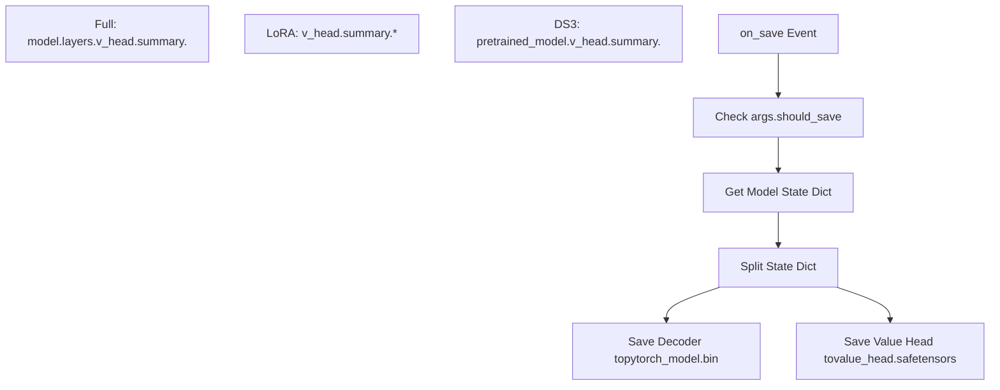
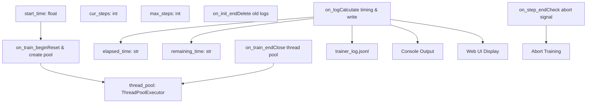
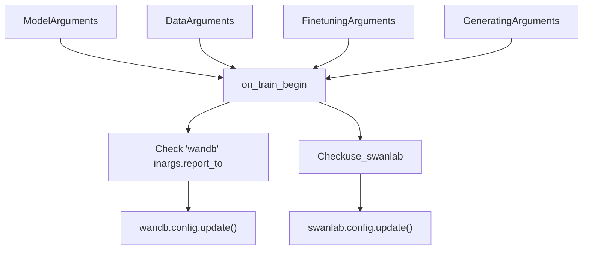
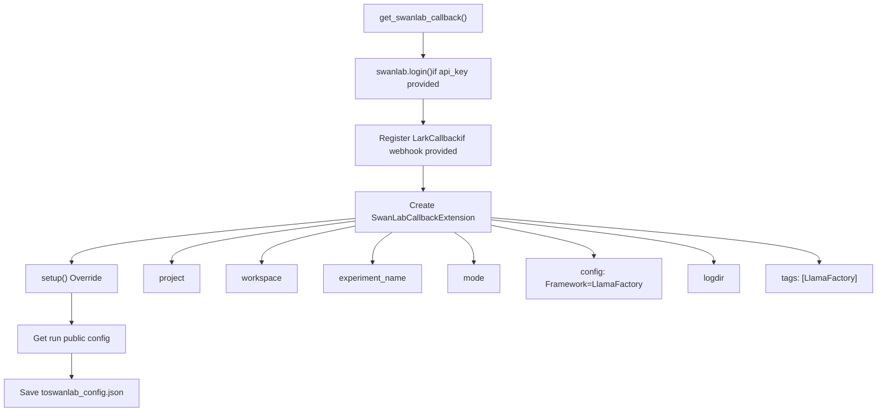

# Training Callbacks and Monitoring

Relevant source files

-   [src/llamafactory/extras/env.py](https://github.com/hiyouga/LlamaFactory/blob/355d5c5e/src/llamafactory/extras/env.py)
-   [src/llamafactory/extras/packages.py](https://github.com/hiyouga/LlamaFactory/blob/355d5c5e/src/llamafactory/extras/packages.py)
-   [src/llamafactory/hparams/finetuning\_args.py](https://github.com/hiyouga/LlamaFactory/blob/355d5c5e/src/llamafactory/hparams/finetuning_args.py)
-   [src/llamafactory/model/model\_utils/attention.py](https://github.com/hiyouga/LlamaFactory/blob/355d5c5e/src/llamafactory/model/model_utils/attention.py)
-   [src/llamafactory/model/model\_utils/liger\_kernel.py](https://github.com/hiyouga/LlamaFactory/blob/355d5c5e/src/llamafactory/model/model_utils/liger_kernel.py)
-   [src/llamafactory/model/model\_utils/moe.py](https://github.com/hiyouga/LlamaFactory/blob/355d5c5e/src/llamafactory/model/model_utils/moe.py)
-   [src/llamafactory/model/model\_utils/valuehead.py](https://github.com/hiyouga/LlamaFactory/blob/355d5c5e/src/llamafactory/model/model_utils/valuehead.py)
-   [src/llamafactory/train/callbacks.py](https://github.com/hiyouga/LlamaFactory/blob/355d5c5e/src/llamafactory/train/callbacks.py)
-   [src/llamafactory/train/dpo/trainer.py](https://github.com/hiyouga/LlamaFactory/blob/355d5c5e/src/llamafactory/train/dpo/trainer.py)
-   [src/llamafactory/train/kto/trainer.py](https://github.com/hiyouga/LlamaFactory/blob/355d5c5e/src/llamafactory/train/kto/trainer.py)
-   [src/llamafactory/train/ppo/trainer.py](https://github.com/hiyouga/LlamaFactory/blob/355d5c5e/src/llamafactory/train/ppo/trainer.py)
-   [src/llamafactory/train/pt/trainer.py](https://github.com/hiyouga/LlamaFactory/blob/355d5c5e/src/llamafactory/train/pt/trainer.py)
-   [src/llamafactory/train/rm/trainer.py](https://github.com/hiyouga/LlamaFactory/blob/355d5c5e/src/llamafactory/train/rm/trainer.py)
-   [src/llamafactory/train/sft/trainer.py](https://github.com/hiyouga/LlamaFactory/blob/355d5c5e/src/llamafactory/train/sft/trainer.py)
-   [src/llamafactory/train/trainer\_utils.py](https://github.com/hiyouga/LlamaFactory/blob/355d5c5e/src/llamafactory/train/trainer_utils.py)

This page explains the callback system used during training, including built-in callbacks for logging, checkpointing, and integration with external monitoring services like Weights & Biases (WandB) and SwanLab.

**Scope**: This page covers callback lifecycle, logging mechanisms, progress tracking, checkpoint management, and external monitoring integrations. For information about training stages and trainer implementations, see [Training Stages and Trainers](/hiyouga/LlamaFactory/6.1-training-stages-and-trainers). For distributed training configurations, see [Distributed Training](/hiyouga/LlamaFactory/6.4-distributed-training).

---

## Overview

LlamaFactory uses the HuggingFace Transformers callback system to inject custom behavior at specific points during training. Callbacks are registered with trainers and receive notifications at lifecycle events (e.g., `on_train_begin`, `on_step_end`, `on_save`).

### Callback Architecture

```mermaid
flowchart TD
    Trainer["Trainer (Base Class)"]
    CallbackHandler["CallbackHandler"]
    DefaultCallbacks["DEFAULT_CALLBACKS"]
    FixValueHead["FixValueHeadModelCallback"]
    SaveProcessor["SaveProcessorCallback"]
    PissaConvert["PissaConvertCallback"]
    LogCallback["LogCallback"]
    ReporterCallback["ReporterCallback"]
    SwanLabExt["SwanLabCallbackExtension"]
    WandBCallback["WandB Integration"]
    BAdamCallback["BAdamCallback"]
    OnInit["on_init_end"]
    OnTrainBegin["on_train_begin"]
    OnStepEnd["on_step_end"]
    OnLog["on_log"]
    OnSave["on_save"]
    OnTrainEnd["on_train_end"]

    Trainer --> CallbackHandler
    DefaultCallbacks --> CallbackHandler
    FixValueHead --> CallbackHandler
    SaveProcessor --> CallbackHandler
    PissaConvert --> CallbackHandler
    LogCallback --> CallbackHandler
    ReporterCallback --> CallbackHandler
    SwanLabExt --> CallbackHandler
    WandBCallback --> CallbackHandler
    BAdamCallback --> CallbackHandler
    CallbackHandler --> OnInit
    CallbackHandler --> OnTrainBegin
    CallbackHandler --> OnStepEnd
    CallbackHandler --> OnLog
    CallbackHandler --> OnSave
    CallbackHandler --> OnTrainEnd
```


**Sources**: [src/llamafactory/train/callbacks.py1-383](https://github.com/hiyouga/LlamaFactory/blob/355d5c5e/src/llamafactory/train/callbacks.py#L1-L383) [src/llamafactory/train/sft/trainer.py77-84](https://github.com/hiyouga/LlamaFactory/blob/355d5c5e/src/llamafactory/train/sft/trainer.py#L77-L84) [src/llamafactory/train/dpo/trainer.py104-111](https://github.com/hiyouga/LlamaFactory/blob/355d5c5e/src/llamafactory/train/dpo/trainer.py#L104-L111)

---

## Built-in Callbacks

### FixValueHeadModelCallback

Used in PPO and reward modeling stages to properly save checkpoints containing value head weights. The value head is a separate component that needs special handling during serialization.

**Key Functions**:

-   `fix_valuehead_checkpoint()` [src/llamafactory/train/callbacks.py53-95](https://github.com/hiyouga/LlamaFactory/blob/355d5c5e/src/llamafactory/train/callbacks.py#L53-L95): Splits state dict into decoder and value head components
-   Handles three cases: full tuning, LoRA tuning, and DeepSpeed Zero3
-   Saves value head weights to separate files: `value_head.safetensors` or `value_head.bin`


**Sources**: [src/llamafactory/train/callbacks.py53-108](https://github.com/hiyouga/LlamaFactory/blob/355d5c5e/src/llamafactory/train/callbacks.py#L53-L108)

---

### SaveProcessorCallback

Saves multimodal processors (image/audio/video) alongside model checkpoints. Required for models that process non-text inputs.

**Implementation**:

-   `on_save()` [src/llamafactory/train/callbacks.py117-120](https://github.com/hiyouga/LlamaFactory/blob/355d5c5e/src/llamafactory/train/callbacks.py#L117-L120): Saves processor at each checkpoint
-   `on_train_end()` [src/llamafactory/train/callbacks.py123-125](https://github.com/hiyouga/LlamaFactory/blob/355d5c5e/src/llamafactory/train/callbacks.py#L123-L125): Saves processor at final location

**Usage**: Automatically added when `processor` is not `None` in trainer initialization:

```
if processor is not None:    self.add_callback(SaveProcessorCallback(processor))
```
**Sources**: [src/llamafactory/train/callbacks.py110-126](https://github.com/hiyouga/LlamaFactory/blob/355d5c5e/src/llamafactory/train/callbacks.py#L110-L126) [src/llamafactory/train/sft/trainer.py77-78](https://github.com/hiyouga/LlamaFactory/blob/355d5c5e/src/llamafactory/train/sft/trainer.py#L77-L78)

---

### PissaConvertCallback

Handles conversion of PiSSA (Principal Singular values and Singular vectors Adaptation) adapters to normal LoRA adapters during training.

**Workflow**:

1.  `on_train_begin()` [src/llamafactory/train/callbacks.py132-141](https://github.com/hiyouga/LlamaFactory/blob/355d5c5e/src/llamafactory/train/callbacks.py#L132-L141): Saves initial PiSSA adapter to `pissa_init/`
2.  `on_train_end()` [src/llamafactory/train/callbacks.py144-167](https://github.com/hiyouga/LlamaFactory/blob/355d5c5e/src/llamafactory/train/callbacks.py#L144-L167): Creates three directories:
    -   `pissa_init/`: Original initialization
    -   `pissa_backup/`: Backup with `init_lora_weights=True`
    -   `pissa_converted/`: Converted LoRA adapter

**Sources**: [src/llamafactory/train/callbacks.py128-168](https://github.com/hiyouga/LlamaFactory/blob/355d5c5e/src/llamafactory/train/callbacks.py#L128-L168)

---

## LogCallback: Progress Tracking and Logging

The `LogCallback` class [src/llamafactory/train/callbacks.py170-337](https://github.com/hiyouga/LlamaFactory/blob/355d5c5e/src/llamafactory/train/callbacks.py#L170-L337) is the primary mechanism for tracking training progress and writing logs.

### Architecture


**Sources**: [src/llamafactory/train/callbacks.py170-337](https://github.com/hiyouga/LlamaFactory/blob/355d5c5e/src/llamafactory/train/callbacks.py#L170-L337)

### Logged Metrics

The `on_log()` method [src/llamafactory/train/callbacks.py268-306](https://github.com/hiyouga/LlamaFactory/blob/355d5c5e/src/llamafactory/train/callbacks.py#L268-L306) tracks and writes the following metrics:

| Metric | Description | Source |
| --- | --- | --- |
| `current_steps` | Current training step | `state.global_step` |
| `total_steps` | Maximum training steps | `state.max_steps` |
| `loss` | Training loss | `state.log_history[-1]` |
| `eval_loss` | Evaluation loss | `state.log_history[-1]` |
| `reward` | PPO reward | `state.log_history[-1]` |
| `accuracy` | Reward accuracy | `state.log_history[-1]['rewards/accuracies']` |
| `lr` | Learning rate | `state.log_history[-1]['learning_rate']` |
| `epoch` | Current epoch | `state.log_history[-1]['epoch']` |
| `percentage` | Progress percentage | `(cur_steps / max_steps) * 100` |
| `elapsed_time` | Time since start | Calculated from `start_time` |
| `remaining_time` | Estimated remaining | `(max_steps - cur_steps) * avg_time_per_step` |
| `throughput` | Tokens per second | `num_input_tokens_seen / elapsed_time` |
| `total_tokens` | Total tokens processed | `state.num_input_tokens_seen` |
| `vram_allocated` | GPU memory allocated (GB) | `get_peak_memory()[0]` if `RECORD_VRAM=1` |
| `vram_reserved` | GPU memory reserved (GB) | `get_peak_memory()[1]` if `RECORD_VRAM=1` |

**Log Format**: Each entry is a JSON line in `trainer_log.jsonl`:

```
{"current_steps": 100, "total_steps": 1000, "loss": 0.5432, "lr": 0.0001, "epoch": 0.5, "percentage": 10.0, "elapsed_time": "0:05:30", "remaining_time": "0:49:30"}
```
**Sources**: [src/llamafactory/train/callbacks.py268-306](https://github.com/hiyouga/LlamaFactory/blob/355d5c5e/src/llamafactory/train/callbacks.py#L268-L306)

### Web UI Integration

When `LLAMABOARD_ENABLED=1`, `LogCallback` integrates with the LLaMA Board web interface:

-   Registers signal handler for `SIGABRT` [src/llamafactory/train/callbacks.py187](https://github.com/hiyouga/LlamaFactory/blob/355d5c5e/src/llamafactory/train/callbacks.py#L187-L187) to allow abort via web UI
-   Creates `LoggerHandler` [src/llamafactory/train/callbacks.py188](https://github.com/hiyouga/LlamaFactory/blob/355d5c5e/src/llamafactory/train/callbacks.py#L188-L188) to capture logs
-   Formats console output [src/llamafactory/train/callbacks.py298-303](https://github.com/hiyouga/LlamaFactory/blob/355d5c5e/src/llamafactory/train/callbacks.py#L298-L303) with key metrics

**Sources**: [src/llamafactory/train/callbacks.py185-190](https://github.com/hiyouga/LlamaFactory/blob/355d5c5e/src/llamafactory/train/callbacks.py#L185-L190) [src/llamafactory/train/callbacks.py297-303](https://github.com/hiyouga/LlamaFactory/blob/355d5c5e/src/llamafactory/train/callbacks.py#L297-L303)

### Async Log Writing

Uses `ThreadPoolExecutor` [src/llamafactory/train/callbacks.py217](https://github.com/hiyouga/LlamaFactory/blob/355d5c5e/src/llamafactory/train/callbacks.py#L217-L217) to write logs asynchronously, preventing I/O from blocking training:

```
self.thread_pool = ThreadPoolExecutor(max_workers=1)self.thread_pool.submit(self._write_log, args.output_dir, logs)
```
**Sources**: [src/llamafactory/train/callbacks.py215-222](https://github.com/hiyouga/LlamaFactory/blob/355d5c5e/src/llamafactory/train/callbacks.py#L215-L222) [src/llamafactory/train/callbacks.py305-306](https://github.com/hiyouga/LlamaFactory/blob/355d5c5e/src/llamafactory/train/callbacks.py#L305-L306)

---

## External Monitoring Integration

### ReporterCallback

The `ReporterCallback` class [src/llamafactory/train/callbacks.py339-383](https://github.com/hiyouga/LlamaFactory/blob/355d5c5e/src/llamafactory/train/callbacks.py#L339-L383) integrates with external experiment tracking services.

**Supported Services**:

-   **WandB** (Weights & Biases): Configured via `TrainingArguments.report_to`
-   **SwanLab**: Configured via `FinetuningArguments.use_swanlab`


**Sources**: [src/llamafactory/train/callbacks.py339-383](https://github.com/hiyouga/LlamaFactory/blob/355d5c5e/src/llamafactory/train/callbacks.py#L339-L383)

**Implementation** [src/llamafactory/train/callbacks.py356-382](https://github.com/hiyouga/LlamaFactory/blob/355d5c5e/src/llamafactory/train/callbacks.py#L356-L382):

```
def on_train_begin(self, args, state, control, **kwargs):    if not state.is_world_process_zero:        return        if "wandb" in args.report_to:        import wandb        wandb.config.update({            "model_args": self.model_args.to_dict(),            "data_args": self.data_args.to_dict(),            # ...        })        if self.finetuning_args.use_swanlab:        import swanlab        swanlab.config.update({...})
```
---

### SwanLab Integration

SwanLab is configured through `SwanLabArguments` [src/llamafactory/hparams/finetuning\_args.py403-440](https://github.com/hiyouga/LlamaFactory/blob/355d5c5e/src/llamafactory/hparams/finetuning_args.py#L403-L440) and initialized via `get_swanlab_callback()` [src/llamafactory/train/trainer\_utils.py701-744](https://github.com/hiyouga/LlamaFactory/blob/355d5c5e/src/llamafactory/train/trainer_utils.py#L701-L744)

**Configuration Parameters**:

| Parameter | Type | Default | Description |
| --- | --- | --- | --- |
| `use_swanlab` | bool | False | Enable SwanLab tracking |
| `swanlab_project` | str | "llamafactory" | Project name |
| `swanlab_workspace` | str | None | Workspace name |
| `swanlab_run_name` | str | None | Experiment name |
| `swanlab_mode` | str | "cloud" | "cloud" or "local" |
| `swanlab_api_key` | str | None | API key for authentication |
| `swanlab_logdir` | str | None | Local log directory |
| `swanlab_lark_webhook_url` | str | None | Lark notification webhook |
| `swanlab_lark_secret` | str | None | Lark webhook secret |

**Sources**: [src/llamafactory/hparams/finetuning\_args.py403-440](https://github.com/hiyouga/LlamaFactory/blob/355d5c5e/src/llamafactory/hparams/finetuning_args.py#L403-L440)

### SwanLabCallbackExtension

The `get_swanlab_callback()` function creates a custom `SwanLabCallbackExtension` class [src/llamafactory/train/trainer\_utils.py718-743](https://github.com/hiyouga/LlamaFactory/blob/355d5c5e/src/llamafactory/train/trainer_utils.py#L718-L743) that extends the base SwanLab callback:


**Sources**: [src/llamafactory/train/trainer\_utils.py701-744](https://github.com/hiyouga/LlamaFactory/blob/355d5c5e/src/llamafactory/train/trainer_utils.py#L701-L744)

**Key Features**:

1.  **Authentication**: Login with API key if provided [src/llamafactory/train/trainer\_utils.py706-707](https://github.com/hiyouga/LlamaFactory/blob/355d5c5e/src/llamafactory/train/trainer_utils.py#L706-L707)
2.  **Lark Notifications**: Optional webhook for Lark (Feishu) notifications [src/llamafactory/train/trainer\_utils.py709-716](https://github.com/hiyouga/LlamaFactory/blob/355d5c5e/src/llamafactory/train/trainer_utils.py#L709-L716)
3.  **Config Persistence**: Saves SwanLab run config to `swanlab_config.json` [src/llamafactory/train/trainer\_utils.py732](https://github.com/hiyouga/LlamaFactory/blob/355d5c5e/src/llamafactory/train/trainer_utils.py#L732-L732)
4.  **Custom Tags**: Automatically tags experiments with "🦙LlamaFactory" [src/llamafactory/train/trainer\_utils.py742](https://github.com/hiyouga/LlamaFactory/blob/355d5c5e/src/llamafactory/train/trainer_utils.py#L742-L742)

---

## Checkpoint Management

### Checkpoint Saving Flow

> **[Mermaid sequence]**
> *(图表结构无法解析)*

**Sources**: [src/llamafactory/train/callbacks.py102-120](https://github.com/hiyouga/LlamaFactory/blob/355d5c5e/src/llamafactory/train/callbacks.py#L102-L120)

### Checkpoint Directory Structure

Standard checkpoint (SFT/DPO/KTO):

```
checkpoint-100/
├── adapter_config.json          # LoRA/OFT configuration
├── adapter_model.safetensors    # Adapter weights
├── trainer_state.json           # Training state
├── optimizer.pt                 # Optimizer state
└── scheduler.pt                 # Scheduler state
```
Value head checkpoint (PPO/RM):

```
checkpoint-100/
├── adapter_config.json
├── adapter_model.safetensors    # Decoder adapter weights
├── value_head.safetensors       # Value head weights (separate)
├── trainer_state.json
├── optimizer.pt
└── scheduler.pt
```
Multimodal checkpoint:

```
checkpoint-100/
├── adapter_config.json
├── adapter_model.safetensors
├── preprocessor_config.json     # Processor configuration
├── processor_config.json        # Additional processor settings
└── trainer_state.json
```
**Sources**: [src/llamafactory/train/callbacks.py53-95](https://github.com/hiyouga/LlamaFactory/blob/355d5c5e/src/llamafactory/train/callbacks.py#L53-L95) [src/llamafactory/train/callbacks.py117-120](https://github.com/hiyouga/LlamaFactory/blob/355d5c5e/src/llamafactory/train/callbacks.py#L117-L120)

---

## BAdam Callback Integration

The BAdam optimizer requires a special callback to handle gradient clipping. Each trainer conditionally adds `BAdamCallback`:

```
if finetuning_args.use_badam:    from badam import BAdamCallback, clip_grad_norm_old_version        self.accelerator.clip_grad_norm_ = MethodType(        clip_grad_norm_old_version, self.accelerator    )    self.add_callback(BAdamCallback)
```
**Locations**:

-   SFT: [src/llamafactory/train/sft/trainer.py80-84](https://github.com/hiyouga/LlamaFactory/blob/355d5c5e/src/llamafactory/train/sft/trainer.py#L80-L84)
-   DPO: [src/llamafactory/train/dpo/trainer.py107-111](https://github.com/hiyouga/LlamaFactory/blob/355d5c5e/src/llamafactory/train/dpo/trainer.py#L107-L111)
-   KTO: [src/llamafactory/train/kto/trainer.py109-113](https://github.com/hiyouga/LlamaFactory/blob/355d5c5e/src/llamafactory/train/kto/trainer.py#L109-L113)
-   PPO: [src/llamafactory/train/ppo/trainer.py194-198](https://github.com/hiyouga/LlamaFactory/blob/355d5c5e/src/llamafactory/train/ppo/trainer.py#L194-L198)
-   RM: [src/llamafactory/train/rm/trainer.py61-65](https://github.com/hiyouga/LlamaFactory/blob/355d5c5e/src/llamafactory/train/rm/trainer.py#L61-L65)
-   PT: [src/llamafactory/train/pt/trainer.py63-67](https://github.com/hiyouga/LlamaFactory/blob/355d5c5e/src/llamafactory/train/pt/trainer.py#L63-L67)

**Sources**: [src/llamafactory/train/sft/trainer.py80-84](https://github.com/hiyouga/LlamaFactory/blob/355d5c5e/src/llamafactory/train/sft/trainer.py#L80-L84) [src/llamafactory/train/dpo/trainer.py107-111](https://github.com/hiyouga/LlamaFactory/blob/355d5c5e/src/llamafactory/train/dpo/trainer.py#L107-L111)

---

## Environment Variables

The callback system responds to several environment variables:

| Variable | Effect | Default |
| --- | --- | --- |
| `LLAMABOARD_ENABLED` | Enable web UI integration in LogCallback | Not set |
| `LLAMABOARD_WORKDIR` | Directory for web UI logs | None |
| `RECORD_VRAM` | Track GPU memory in logs | Not set |
| `WANDB_PROJECT` | WandB project name | "llamafactory" |

**Sources**: [src/llamafactory/train/callbacks.py185-189](https://github.com/hiyouga/LlamaFactory/blob/355d5c5e/src/llamafactory/train/callbacks.py#L185-L189) [src/llamafactory/train/callbacks.py291-294](https://github.com/hiyouga/LlamaFactory/blob/355d5c5e/src/llamafactory/train/callbacks.py#L291-L294) [src/llamafactory/train/callbacks.py353](https://github.com/hiyouga/LlamaFactory/blob/355d5c5e/src/llamafactory/train/callbacks.py#L353-L353)

---

## Callback Lifecycle Summary

> **[Mermaid stateDiagram]**
> *(图表结构无法解析)*

**Key Callback Methods** (from `transformers.TrainerCallback`):

-   `on_init_end`: After trainer initialization
-   `on_train_begin`: Before first training step
-   `on_substep_end`: After gradient accumulation step
-   `on_step_end`: After optimizer step
-   `on_log`: When logging metrics
-   `on_save`: When saving checkpoint
-   `on_evaluate`: During evaluation
-   `on_train_end`: After training completes

**Sources**: [src/llamafactory/train/callbacks.py225-265](https://github.com/hiyouga/LlamaFactory/blob/355d5c5e/src/llamafactory/train/callbacks.py#L225-L265)
