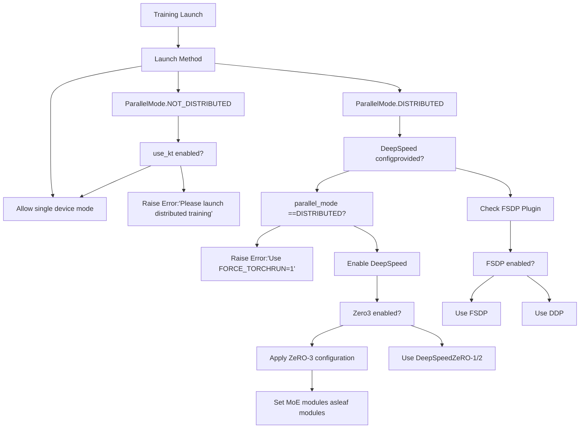
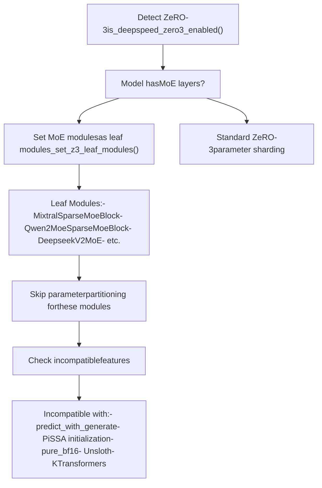
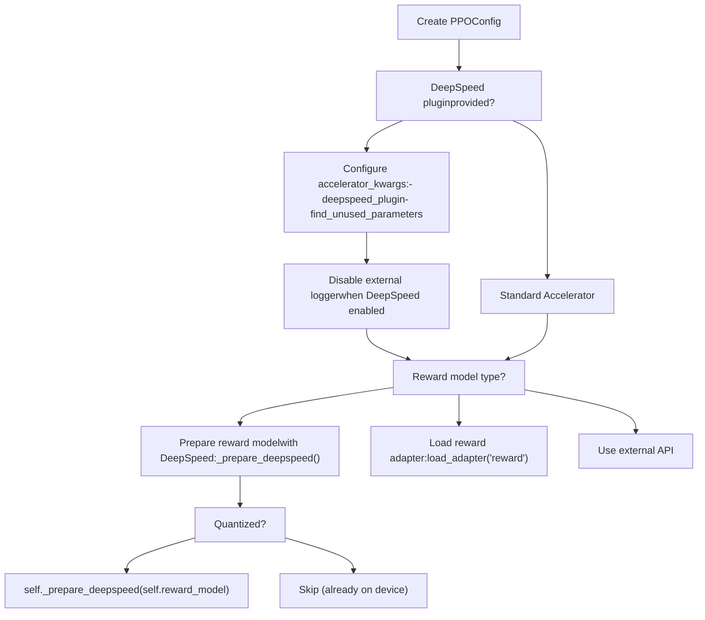
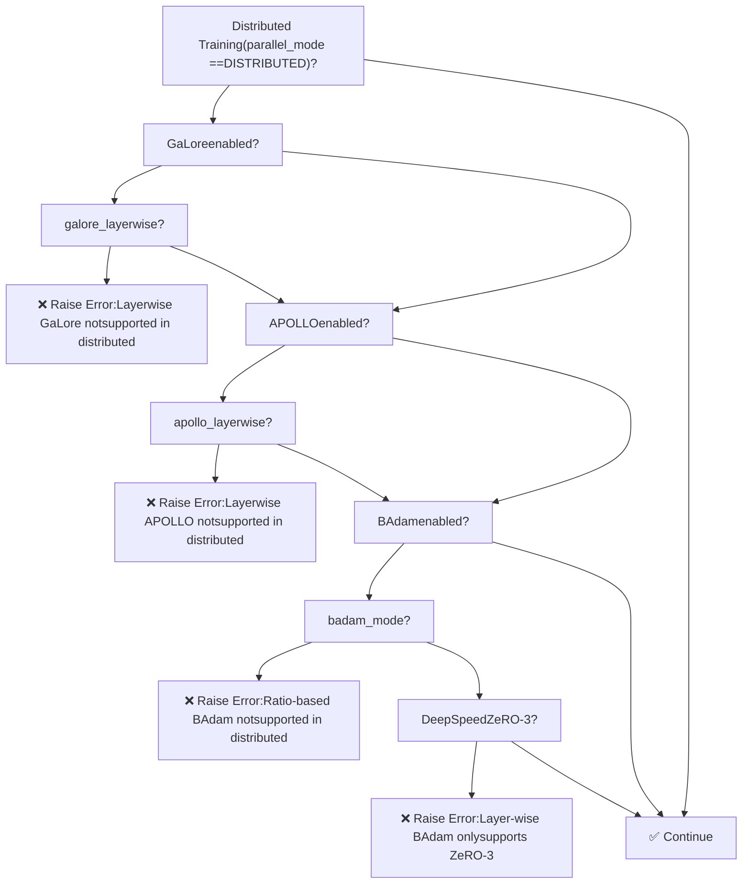

# Distributed Training

Relevant source files

-   [README.md](https://github.com/hiyouga/LlamaFactory/blob/355d5c5e/README.md?plain=1)
-   [README\_zh.md](https://github.com/hiyouga/LlamaFactory/blob/355d5c5e/README_zh.md?plain=1)
-   [src/llamafactory/extras/env.py](https://github.com/hiyouga/LlamaFactory/blob/355d5c5e/src/llamafactory/extras/env.py)
-   [src/llamafactory/extras/packages.py](https://github.com/hiyouga/LlamaFactory/blob/355d5c5e/src/llamafactory/extras/packages.py)
-   [src/llamafactory/hparams/finetuning\_args.py](https://github.com/hiyouga/LlamaFactory/blob/355d5c5e/src/llamafactory/hparams/finetuning_args.py)
-   [src/llamafactory/hparams/parser.py](https://github.com/hiyouga/LlamaFactory/blob/355d5c5e/src/llamafactory/hparams/parser.py)
-   [src/llamafactory/model/model\_utils/attention.py](https://github.com/hiyouga/LlamaFactory/blob/355d5c5e/src/llamafactory/model/model_utils/attention.py)
-   [src/llamafactory/model/model\_utils/liger\_kernel.py](https://github.com/hiyouga/LlamaFactory/blob/355d5c5e/src/llamafactory/model/model_utils/liger_kernel.py)
-   [src/llamafactory/model/model\_utils/moe.py](https://github.com/hiyouga/LlamaFactory/blob/355d5c5e/src/llamafactory/model/model_utils/moe.py)
-   [src/llamafactory/model/model\_utils/valuehead.py](https://github.com/hiyouga/LlamaFactory/blob/355d5c5e/src/llamafactory/model/model_utils/valuehead.py)
-   [src/llamafactory/train/callbacks.py](https://github.com/hiyouga/LlamaFactory/blob/355d5c5e/src/llamafactory/train/callbacks.py)
-   [src/llamafactory/train/dpo/trainer.py](https://github.com/hiyouga/LlamaFactory/blob/355d5c5e/src/llamafactory/train/dpo/trainer.py)
-   [src/llamafactory/train/kto/trainer.py](https://github.com/hiyouga/LlamaFactory/blob/355d5c5e/src/llamafactory/train/kto/trainer.py)
-   [src/llamafactory/train/ppo/trainer.py](https://github.com/hiyouga/LlamaFactory/blob/355d5c5e/src/llamafactory/train/ppo/trainer.py)
-   [src/llamafactory/train/pt/trainer.py](https://github.com/hiyouga/LlamaFactory/blob/355d5c5e/src/llamafactory/train/pt/trainer.py)
-   [src/llamafactory/train/rm/trainer.py](https://github.com/hiyouga/LlamaFactory/blob/355d5c5e/src/llamafactory/train/rm/trainer.py)
-   [src/llamafactory/train/sft/trainer.py](https://github.com/hiyouga/LlamaFactory/blob/355d5c5e/src/llamafactory/train/sft/trainer.py)
-   [src/llamafactory/train/trainer\_utils.py](https://github.com/hiyouga/LlamaFactory/blob/355d5c5e/src/llamafactory/train/trainer_utils.py)

## Purpose and Scope

This page covers LlamaFactory's distributed training infrastructure, including configuration and usage of three distributed strategies: **Data Distributed Parallel (DDP)**, **Fully Sharded Data Parallel (FSDP)**, and **DeepSpeed ZeRO**. It explains how to launch distributed training, configure each strategy, and navigate compatibility constraints with other features.

For information about training stages and trainer implementations, see [Training Stages and Trainers](/hiyouga/LlamaFactory/6.1-training-stages-and-trainers). For custom optimizer configuration in distributed settings, see [Custom Optimizers](/hiyouga/LlamaFactory/6.2-custom-optimizers).

---

## Overview of Distributed Strategies

LlamaFactory supports three primary distributed training strategies, each with different trade-offs between memory efficiency, communication overhead, and ease of use:

| Strategy | Memory Efficiency | Communication | Use Case |
| --- | --- | --- | --- |
| **DDP** | Low (full model replica per GPU) | Gradient synchronization only | Multi-GPU on single node, small models |
| **FSDP** | High (shards parameters, gradients, optimizer states) | Parameter gathering per layer | Large models across multiple GPUs |
| **DeepSpeed ZeRO** | Highest (configurable sharding levels) | Configurable based on ZeRO stage | Very large models, MoE architectures |

The system automatically detects the training mode based on launch method and configuration. All custom trainers inherit distributed training capabilities from `transformers.Trainer`.

**Sources:** [README.md224](https://github.com/hiyouga/LlamaFactory/blob/355d5c5e/README.md?plain=1#L224-L224) [src/llamafactory/hparams/parser.py29](https://github.com/hiyouga/LlamaFactory/blob/355d5c5e/src/llamafactory/hparams/parser.py#L29-L29)

---

## Distributed Training Detection


**Diagram: Distributed Strategy Detection Flow**

The system determines the distributed strategy through several checks:

1.  **Launch Detection**: The `ParallelMode` is set based on how training is launched [src/llamafactory/hparams/parser.py288-292](https://github.com/hiyouga/LlamaFactory/blob/355d5c5e/src/llamafactory/hparams/parser.py#L288-L292)
2.  **DeepSpeed Validation**: If DeepSpeed config is provided, requires `FORCE_TORCHRUN=1` environment variable [src/llamafactory/hparams/parser.py291-292](https://github.com/hiyouga/LlamaFactory/blob/355d5c5e/src/llamafactory/hparams/parser.py#L291-L292)
3.  **Strategy Selection**: Falls through from DeepSpeed → FSDP → DDP based on configuration

**Sources:** [src/llamafactory/hparams/parser.py288-292](https://github.com/hiyouga/LlamaFactory/blob/355d5c5e/src/llamafactory/hparams/parser.py#L288-L292) [src/llamafactory/hparams/parser.py409-414](https://github.com/hiyouga/LlamaFactory/blob/355d5c5e/src/llamafactory/hparams/parser.py#L409-L414)

---

## Launching Distributed Training

### Single-Node Multi-GPU (DDP)

Use `llamafactory-cli` which internally uses `torchrun`:

```
llamafactory-cli train config.yaml
```
Or manually with `torchrun`:

```
torchrun --nproc_per_node 4 --master_port 29500 \    src/llamafactory/cli.py train config.yaml
```
### Multi-Node Training

On each node, specify the master address and node rank:

```
# Node 0 (master)torchrun --nproc_per_node 8 \    --nnodes 2 \    --node_rank 0 \    --master_addr "192.168.1.1" \    --master_port 29500 \    src/llamafactory/cli.py train config.yaml # Node 1 (worker)torchrun --nproc_per_node 8 \    --nnodes 2 \    --node_rank 1 \    --master_addr "192.168.1.1" \    --master_port 29500 \    src/llamafactory/cli.py train config.yaml
```
### DeepSpeed Launch

```
FORCE_TORCHRUN=1 deepspeed --num_gpus 4 \    src/llamafactory/cli.py train config.yaml
```
The `FORCE_TORCHRUN=1` environment variable is required to pass validation [src/llamafactory/hparams/parser.py291-292](https://github.com/hiyouga/LlamaFactory/blob/355d5c5e/src/llamafactory/hparams/parser.py#L291-L292)

**Sources:** [src/llamafactory/hparams/parser.py291-292](https://github.com/hiyouga/LlamaFactory/blob/355d5c5e/src/llamafactory/hparams/parser.py#L291-L292)

---

## DeepSpeed Integration

### DeepSpeed Configuration

DeepSpeed is enabled by providing a DeepSpeed configuration file in `TrainingArguments`:

```
# config.yamldeepspeed: path/to/ds_config.json
```
The system validates that training is launched with `torchrun` or `deepspeed` launcher when DeepSpeed is enabled.

### ZeRO Stages

DeepSpeed ZeRO has three optimization stages:

| Stage | Sharded Components | Memory Savings | Communication |
| --- | --- | --- | --- |
| **ZeRO-1** | Optimizer states | ~4x | Low |
| **ZeRO-2** | Optimizer states + Gradients | ~8x | Medium |
| **ZeRO-3** | Optimizer states + Gradients + Parameters | ~Nx (N=GPUs) | High |

### ZeRO-3 Specific Handling

When ZeRO-3 is enabled (`is_deepspeed_zero3_enabled()`), the system applies special handling:


**Diagram: DeepSpeed ZeRO-3 Configuration Flow**

#### MoE Leaf Module Registration

For Mixture-of-Experts models, the system registers MoE blocks as "leaf modules" to prevent DeepSpeed from sharding them [src/llamafactory/model/model\_utils/moe.py43-139](https://github.com/hiyouga/LlamaFactory/blob/355d5c5e/src/llamafactory/model/model_utils/moe.py#L43-L139):

```
def add_z3_leaf_module(model: "PreTrainedModel") -> None:    """Set module as a leaf module to skip partitioning in deepspeed zero3."""    if not is_deepspeed_zero3_enabled():        return        model_type = getattr(model.config, "model_type", None)        # Examples:    if model_type == "mixtral":        from transformers.models.mixtral.modeling_mixtral import MixtralSparseMoeBlock        _set_z3_leaf_modules(model, [MixtralSparseMoeBlock])        if model_type == "qwen2_moe":        from transformers.models.qwen2_moe.modeling_qwen2_moe import Qwen2MoeSparseMoeBlock        _set_z3_leaf_modules(model, [Qwen2MoeSparseMoeBlock])        # ... more MoE architectures
```
This prevents communication overhead and numerical instability from sharding expert parameters across devices.

#### Reference Model Preparation

In preference learning (DPO, KTO), reference models are prepared for DeepSpeed separately [src/llamafactory/train/dpo/trainer.py94-102](https://github.com/hiyouga/LlamaFactory/blob/355d5c5e/src/llamafactory/train/dpo/trainer.py#L94-L102):

```
if ref_model is not None:    if self.is_deepspeed_enabled:        if not (            getattr(ref_model, "is_loaded_in_8bit", False)             or getattr(ref_model, "is_loaded_in_4bit", False)        ):  # quantized models already on correct device            self.ref_model = prepare_deepspeed(self.ref_model, self.accelerator)
```
**Sources:** [src/llamafactory/model/model\_utils/moe.py36-139](https://github.com/hiyouga/LlamaFactory/blob/355d5c5e/src/llamafactory/model/model_utils/moe.py#L36-L139) [src/llamafactory/train/dpo/trainer.py94-102](https://github.com/hiyouga/LlamaFactory/blob/355d5c5e/src/llamafactory/train/dpo/trainer.py#L94-L102) [src/llamafactory/hparams/parser.py306-323](https://github.com/hiyouga/LlamaFactory/blob/355d5c5e/src/llamafactory/hparams/parser.py#L306-L323)

---

## FSDP Integration

### FSDP Configuration

FSDP (Fully Sharded Data Parallel) is enabled through `TrainingArguments`:

```
# config.yamlfsdp: "full_shard auto_wrap"fsdp_config:  fsdp_transformer_layer_cls_to_wrap: "LlamaDecoderLayer"
```
### FSDP + QLoRA

LlamaFactory supports FSDP with QLoRA for training large models on limited GPU memory [README.md224](https://github.com/hiyouga/LlamaFactory/blob/355d5c5e/README.md?plain=1#L224-L224):

```
# Example: Fine-tune 70B model on 2x24GB GPUsmodel_name_or_path: meta-llama/Llama-2-70b-hfquantization_bit: 4finetuning_type: loralora_rank: 8lora_target: all # FSDP configurationfsdp: "full_shard auto_wrap"fsdp_config:  fsdp_transformer_layer_cls_to_wrap: "LlamaDecoderLayer"
```
The combination allows:

-   4-bit quantization reduces memory footprint
-   LoRA reduces trainable parameters
-   FSDP shards optimizer states and gradients

**Sources:** [README.md224](https://github.com/hiyouga/LlamaFactory/blob/355d5c5e/README.md?plain=1#L224-L224)

---

## PPO-Specific Distributed Configuration

PPO training has additional distributed configuration requirements due to the actor-critic architecture:


**Diagram: PPO Distributed Configuration**

Key PPO-specific handling [src/llamafactory/train/ppo/trainer.py119-187](https://github.com/hiyouga/LlamaFactory/blob/355d5c5e/src/llamafactory/train/ppo/trainer.py#L119-L187):

1.  **DeepSpeed Plugin Integration**: PPO config includes DeepSpeed plugin with `find_unused_parameters` setting
2.  **External Logger Disabled**: When DeepSpeed is enabled, PPO cannot use external loggers like WandB
3.  **Reward Model Preparation**: Full reward models are prepared with DeepSpeed, while LoRA reward models bypass preparation

**Sources:** [src/llamafactory/train/ppo/trainer.py119-187](https://github.com/hiyouga/LlamaFactory/blob/355d5c5e/src/llamafactory/train/ppo/trainer.py#L119-L187)

---

## Compatibility Matrix

### Distributed Training Constraints


**Diagram: Distributed Training Compatibility Checks**

### Complete Compatibility Table

| Feature | DDP | FSDP | DeepSpeed ZeRO-1/2 | DeepSpeed ZeRO-3 |
| --- | --- | --- | --- | --- |
| **Full Fine-tuning** | ✅ | ✅ | ✅ | ✅ |
| **LoRA** | ✅ | ✅ | ✅ | ✅ |
| **QLoRA** | ✅ | ✅ | ✅ | ✅ |
| **GaLore (non-layerwise)** | ✅ | ✅ | ❌ | ❌ |
| **GaLore (layerwise)** | ❌ | ❌ | ❌ | ❌ |
| **APOLLO (non-layerwise)** | ✅ | ✅ | ❌ | ❌ |
| **APOLLO (layerwise)** | ❌ | ❌ | ❌ | ❌ |
| **BAdam (ratio mode)** | ❌ | ❌ | ❌ | ❌ |
| **BAdam (layer mode)** | ❌ | ❌ | ❌ | ✅ |
| **Unsloth** | ✅ | ✅ | ✅ | ❌ |
| **KTransformers** | ❌ | ❌ | ❌ | ❌ |
| **predict\_with\_generate** | ✅ | ✅ | ✅ | ❌ |
| **PiSSA initialization** | ✅ | ✅ | ✅ | ❌ |
| **pure\_bf16** | ✅ | ✅ | ✅ | ❌ |

The validation logic is implemented in [src/llamafactory/hparams/parser.py325-355](https://github.com/hiyouga/LlamaFactory/blob/355d5c5e/src/llamafactory/hparams/parser.py#L325-L355):

```
if training_args.parallel_mode == ParallelMode.DISTRIBUTED:    if finetuning_args.use_galore and finetuning_args.galore_layerwise:        raise ValueError("Distributed training does not support layer-wise GaLore.")        if finetuning_args.use_apollo and finetuning_args.apollo_layerwise:        raise ValueError("Distributed training does not support layer-wise APOLLO.")        if finetuning_args.use_badam:        if finetuning_args.badam_mode == "ratio":            raise ValueError("Radio-based BAdam does not yet support distributed training, use layer-wise BAdam.")        elif not is_deepspeed_zero3_enabled():            raise ValueError("Layer-wise BAdam only supports DeepSpeed ZeRO-3 training.") if training_args.deepspeed is not None and (finetuning_args.use_galore or finetuning_args.use_apollo):    raise ValueError("GaLore and APOLLO are incompatible with DeepSpeed yet.")
```
**Sources:** [src/llamafactory/hparams/parser.py325-355](https://github.com/hiyouga/LlamaFactory/blob/355d5c5e/src/llamafactory/hparams/parser.py#L325-L355)

---

## LoRA-Specific Distributed Optimizations

### DDP Find Unused Parameters

When using LoRA with DDP, the system automatically sets `ddp_find_unused_parameters=False` to improve performance [src/llamafactory/hparams/parser.py408-414](https://github.com/hiyouga/LlamaFactory/blob/355d5c5e/src/llamafactory/hparams/parser.py#L408-L414):

```
if (    training_args.parallel_mode == ParallelMode.DISTRIBUTED    and training_args.ddp_find_unused_parameters is None    and finetuning_args.finetuning_type == "lora"):    logger.info_rank0("Set `ddp_find_unused_parameters` to False in DDP training since LoRA is enabled.")    training_args.ddp_find_unused_parameters = False
```
This optimization works because:

-   LoRA only updates adapter parameters (rank decomposition matrices)
-   Base model parameters are frozen and don't require gradient communication
-   Skipping unused parameter detection reduces overhead

**Sources:** [src/llamafactory/hparams/parser.py408-414](https://github.com/hiyouga/LlamaFactory/blob/355d5c5e/src/llamafactory/hparams/parser.py#L408-L414)

---

## Device Placement and Memory Management

### Device Assignment

The system assigns devices based on distributed configuration:

```
# Single device placement for trainingmodel_args.device_map = {"": get_current_device()}
```
This places the entire model on the current process's device. For quantized models in evaluation mode, `device_map="auto"` can be used [src/llamafactory/hparams/parser.py457-458](https://github.com/hiyouga/LlamaFactory/blob/355d5c5e/src/llamafactory/hparams/parser.py#L457-L458)

### Current Device Detection

The `get_current_device()` function returns the appropriate device based on hardware:

```
def get_current_device() -> torch.device:    if is_torch_npu_available():        return torch.device(f"npu:{os.environ.get('LOCAL_RANK', '0')}")    elif torch.cuda.is_available():        return torch.device(f"cuda:{os.environ.get('LOCAL_RANK', '0')}")    else:        return torch.device("cpu")
```
The `LOCAL_RANK` environment variable is set by the distributed launcher (`torchrun` or `deepspeed`).

**Sources:** [src/llamafactory/hparams/parser.py457-458](https://github.com/hiyouga/LlamaFactory/blob/355d5c5e/src/llamafactory/hparams/parser.py#L457-L458) [src/llamafactory/extras/misc.py](https://github.com/hiyouga/LlamaFactory/blob/355d5c5e/src/llamafactory/extras/misc.py)

---

## Configuration Examples

### Example 1: DDP Training (4 GPUs)

```
# config.yamlmodel_name_or_path: meta-llama/Llama-2-7b-hfdataset: alpaca_enfinetuning_type: lora # Training argumentsoutput_dir: ./outputnum_train_epochs: 3per_device_train_batch_size: 4gradient_accumulation_steps: 4learning_rate: 5e-5 # Launch: llamafactory-cli train config.yaml
```
### Example 2: FSDP + QLoRA (Large Model)

```
# config.yamlmodel_name_or_path: meta-llama/Llama-2-70b-hfdataset: alpaca_enfinetuning_type: loraquantization_bit: 4 # FSDP configurationfsdp: "full_shard auto_wrap"fsdp_config:  fsdp_transformer_layer_cls_to_wrap: "LlamaDecoderLayer" # Training argumentsoutput_dir: ./outputnum_train_epochs: 3per_device_train_batch_size: 1gradient_accumulation_steps: 16
```
### Example 3: DeepSpeed ZeRO-3 (Mixtral MoE)

```
# config.yamlmodel_name_or_path: mistralai/Mixtral-8x7B-v0.1dataset: alpaca_enfinetuning_type: lora # DeepSpeed configurationdeepspeed: ds_z3_config.json # Training argumentsoutput_dir: ./outputper_device_train_batch_size: 1gradient_accumulation_steps: 32bf16: true # Launch: FORCE_TORCHRUN=1 deepspeed --num_gpus 8 src/llamafactory/cli.py train config.yaml
```
**DeepSpeed Config (ds\_z3\_config.json):**

```
{  "train_micro_batch_size_per_gpu": "auto",  "gradient_accumulation_steps": "auto",  "gradient_clipping": "auto",  "zero_optimization": {    "stage": 3,    "offload_optimizer": {      "device": "cpu",      "pin_memory": true    },    "offload_param": {      "device": "cpu",      "pin_memory": true    },    "overlap_comm": true,    "contiguous_gradients": true,    "sub_group_size": 1e9,    "reduce_bucket_size": "auto",    "stage3_prefetch_bucket_size": "auto",    "stage3_param_persistence_threshold": "auto",    "stage3_max_live_parameters": 1e9,    "stage3_max_reuse_distance": 1e9,    "stage3_gather_16bit_weights_on_model_save": true  },  "bf16": {    "enabled": "auto"  }}
```
**Sources:** [README.md224](https://github.com/hiyouga/LlamaFactory/blob/355d5c5e/README.md?plain=1#L224-L224) [README.md242](https://github.com/hiyouga/LlamaFactory/blob/355d5c5e/README.md?plain=1#L242-L242)

---

## Troubleshooting

### Common Issues and Solutions

| Issue | Cause | Solution |
| --- | --- | --- |
| "Please launch distributed training with `llamafactory-cli` or `torchrun`" | Single process launch without KTransformers | Use `llamafactory-cli train` or `torchrun` |
| "Please use `FORCE_TORCHRUN=1` to launch DeepSpeed training" | DeepSpeed without distributed launcher | Set `FORCE_TORCHRUN=1` environment variable |
| "Distributed training does not support layer-wise GaLore" | Using `galore_layerwise: true` in distributed mode | Set `galore_layerwise: false` or use single GPU |
| "Layer-wise BAdam only supports DeepSpeed ZeRO-3 training" | Using `badam_mode: layer` without ZeRO-3 | Use `badam_mode: ratio` or enable DeepSpeed ZeRO-3 |
| OOM with MoE models in ZeRO-3 | MoE modules being partitioned | System automatically handles this via leaf modules |
| "Incompatible with DeepSpeed ZeRO-3" | Using Unsloth or KTransformers with ZeRO-3 | Disable these features or use different strategy |

### Debug Information

To check which distributed strategy is active, the system logs:

```
logger.info(    f"Process rank: {training_args.process_index}, "    f"world size: {training_args.world_size}, device: {training_args.device}, "    f"distributed training: {training_args.parallel_mode == ParallelMode.DISTRIBUTED}, "    f"compute dtype: {str(model_args.compute_dtype)}")
```
This appears in training logs at the start of training [src/llamafactory/hparams/parser.py463-468](https://github.com/hiyouga/LlamaFactory/blob/355d5c5e/src/llamafactory/hparams/parser.py#L463-L468)

**Sources:** [src/llamafactory/hparams/parser.py288-355](https://github.com/hiyouga/LlamaFactory/blob/355d5c5e/src/llamafactory/hparams/parser.py#L288-L355) [src/llamafactory/hparams/parser.py463-468](https://github.com/hiyouga/LlamaFactory/blob/355d5c5e/src/llamafactory/hparams/parser.py#L463-L468)
