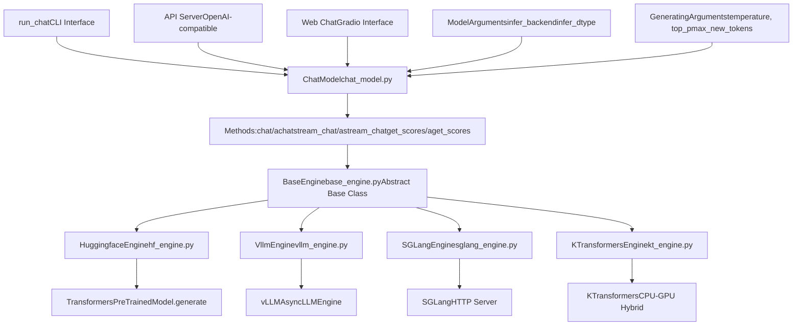
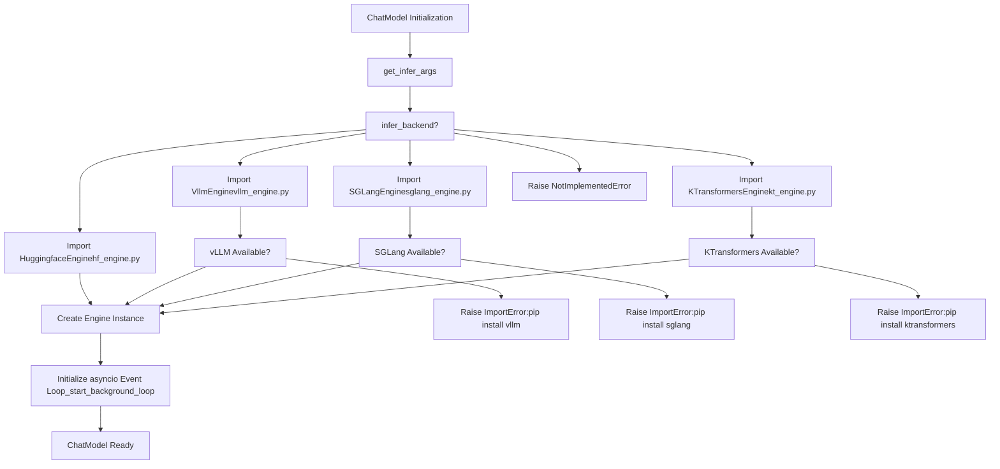
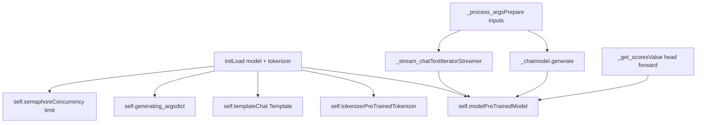
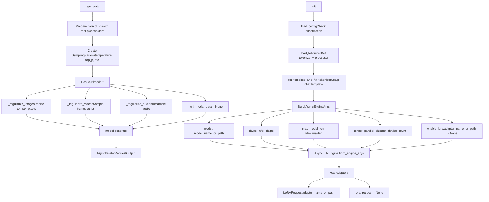
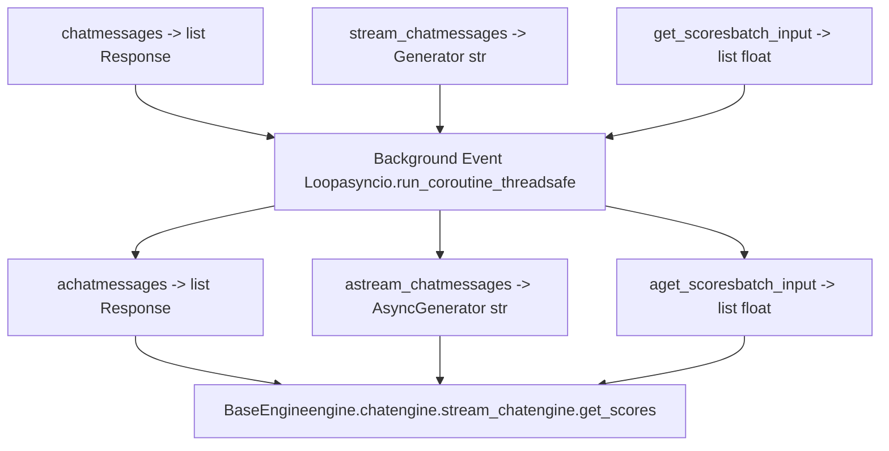
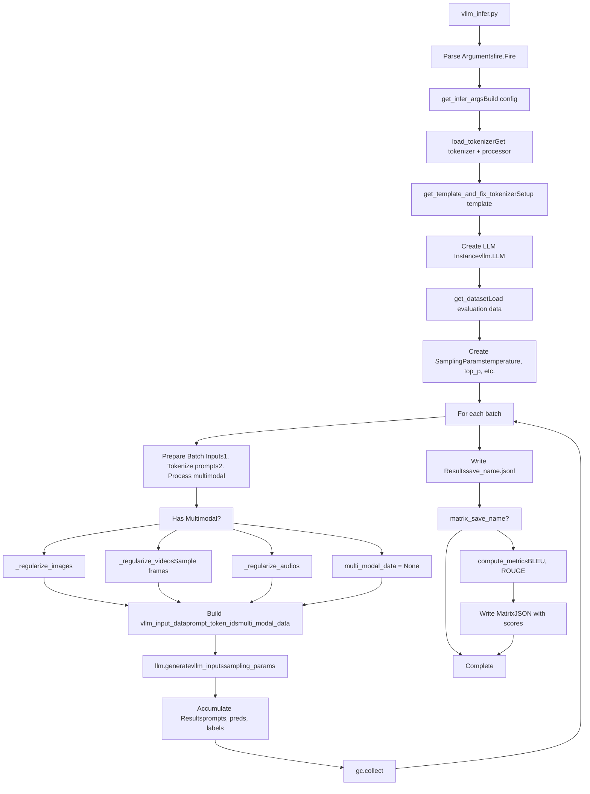

# Inference and Deployment

Relevant source files

-   [examples/README.md](https://github.com/hiyouga/LlamaFactory/blob/355d5c5e/examples/README.md?plain=1)
-   [examples/README\_zh.md](https://github.com/hiyouga/LlamaFactory/blob/355d5c5e/examples/README_zh.md?plain=1)
-   [scripts/vllm\_infer.py](https://github.com/hiyouga/LlamaFactory/blob/355d5c5e/scripts/vllm_infer.py)
-   [src/llamafactory/chat/base\_engine.py](https://github.com/hiyouga/LlamaFactory/blob/355d5c5e/src/llamafactory/chat/base_engine.py)
-   [src/llamafactory/chat/chat\_model.py](https://github.com/hiyouga/LlamaFactory/blob/355d5c5e/src/llamafactory/chat/chat_model.py)
-   [src/llamafactory/chat/hf\_engine.py](https://github.com/hiyouga/LlamaFactory/blob/355d5c5e/src/llamafactory/chat/hf_engine.py)
-   [src/llamafactory/chat/sglang\_engine.py](https://github.com/hiyouga/LlamaFactory/blob/355d5c5e/src/llamafactory/chat/sglang_engine.py)
-   [src/llamafactory/chat/vllm\_engine.py](https://github.com/hiyouga/LlamaFactory/blob/355d5c5e/src/llamafactory/chat/vllm_engine.py)
-   [src/llamafactory/cli.py](https://github.com/hiyouga/LlamaFactory/blob/355d5c5e/src/llamafactory/cli.py)
-   [src/llamafactory/hparams/generating\_args.py](https://github.com/hiyouga/LlamaFactory/blob/355d5c5e/src/llamafactory/hparams/generating_args.py)
-   [src/llamafactory/v1/launcher.py](https://github.com/hiyouga/LlamaFactory/blob/355d5c5e/src/llamafactory/v1/launcher.py)
-   [tests/e2e/test\_sglang.py](https://github.com/hiyouga/LlamaFactory/blob/355d5c5e/tests/e2e/test_sglang.py)

This document describes LlamaFactory's inference and deployment capabilities. It covers the inference engine architecture, available backends (HuggingFace, vLLM, SGLang, KTransformers), the unified `ChatModel` interface, and deployment options including CLI chat, API servers, and web interfaces.

For information about training models, see [Training System](/hiyouga/LlamaFactory/6-training-system). For model export and adapter merging, see [Model Export and Merging](/hiyouga/LlamaFactory/7.3-model-export-and-merging). For detailed backend comparisons and configuration, see [Inference Engines](/hiyouga/LlamaFactory/7.1-inference-engines).

## Architecture Overview

LlamaFactory provides a flexible inference system that supports multiple backends through a unified interface. The system decouples the inference API from the underlying engine implementation, allowing users to switch between backends without code changes.

### Inference System Components


**Sources:** [src/llamafactory/chat/chat\_model.py39-90](https://github.com/hiyouga/LlamaFactory/blob/355d5c5e/src/llamafactory/chat/chat_model.py#L39-L90) [src/llamafactory/chat/base\_engine.py39-99](https://github.com/hiyouga/LlamaFactory/blob/355d5c5e/src/llamafactory/chat/base_engine.py#L39-L99) [examples/README.md201-217](https://github.com/hiyouga/LlamaFactory/blob/355d5c5e/examples/README.md?plain=1#L201-L217)

### Engine Selection Process

The inference backend is selected during `ChatModel` initialization based on the `infer_backend` parameter in `ModelArguments`:


**Sources:** [src/llamafactory/chat/chat\_model.py47-86](https://github.com/hiyouga/LlamaFactory/blob/355d5c5e/src/llamafactory/chat/chat_model.py#L47-L86)

## Base Engine Interface

All inference engines implement the `BaseEngine` abstract class, which defines three core async methods:

| Method | Purpose | Return Type | Use Case |
| --- | --- | --- | --- |
| `chat()` | Generate complete response | `list[Response]` | Batch inference, single completion |
| `stream_chat()` | Generate token-by-token | `AsyncGenerator[str, None]` | Interactive chat, streaming responses |
| `get_scores()` | Score text sequences | `list[float]` | Reward modeling, ranking |

### Response Dataclass

Each engine returns `Response` objects containing:

```
@dataclassclass Response:    response_text: str           # Generated text    response_length: int         # Number of generated tokens    prompt_length: int          # Number of prompt tokens    finish_reason: Literal["stop", "length"]  # Why generation ended
```
**Sources:** [src/llamafactory/chat/base\_engine.py31-37](https://github.com/hiyouga/LlamaFactory/blob/355d5c5e/src/llamafactory/chat/base_engine.py#L31-L37) [src/llamafactory/chat/base\_engine.py39-99](https://github.com/hiyouga/LlamaFactory/blob/355d5c5e/src/llamafactory/chat/base_engine.py#L39-L99)

## Inference Engine Implementations

### HuggingFace Engine

The `HuggingfaceEngine` uses the standard Transformers library for inference. It loads the model with `load_model()` and uses `PreTrainedModel.generate()` for text generation.

#### Key Features

-   **Synchronous Generation**: Uses `torch.inference_mode()` decorator
-   **Streaming**: Implements `TextIteratorStreamer` in a separate thread
-   **Reward Scoring**: Supports value head models for reward modeling
-   **Multimodal**: Processes images, videos, and audio through `mm_plugin`
-   **Concurrency Control**: Uses `asyncio.Semaphore` to limit concurrent requests

#### Implementation Details


**Configuration Parameters:**

| Parameter | Default | Purpose |
| --- | --- | --- |
| `infer_backend` | `hf` | Select HuggingFace engine |
| `infer_dtype` | `auto` | Inference precision (float16/bfloat16) |
| `MAX_CONCURRENT` | `1` | Environment variable for concurrent requests |

**Sources:** [src/llamafactory/chat/hf\_engine.py44-69](https://github.com/hiyouga/LlamaFactory/blob/355d5c5e/src/llamafactory/chat/hf_engine.py#L44-L69) [src/llamafactory/chat/hf\_engine.py210-263](https://github.com/hiyouga/LlamaFactory/blob/355d5c5e/src/llamafactory/chat/hf_engine.py#L210-L263) [src/llamafactory/chat/hf\_engine.py265-310](https://github.com/hiyouga/LlamaFactory/blob/355d5c5e/src/llamafactory/chat/hf_engine.py#L265-L310)

### vLLM Engine

The `VllmEngine` uses vLLM's `AsyncLLMEngine` for high-throughput inference with advanced optimizations like PagedAttention and continuous batching.

#### Key Features

-   **High Throughput**: 270%+ speedup over HuggingFace
-   **Tensor Parallelism**: Automatic multi-GPU distribution
-   **LoRA Support**: Dynamic LoRA adapter loading
-   **Async Native**: Built on `AsyncLLMEngine`
-   **Multimodal**: Supports images, videos, and audio

#### Architecture


**Configuration Parameters:**

| Parameter | Default | Purpose |
| --- | --- | --- |
| `infer_backend` | `vllm` | Select vLLM engine |
| `vllm_maxlen` | Model default | Maximum sequence length |
| `vllm_gpu_util` | `0.9` | GPU memory utilization fraction |
| `vllm_enforce_eager` | `False` | Disable CUDA graph for debugging |
| `vllm_max_lora_rank` | `32` | Maximum LoRA rank |
| `vllm_config` | `{}` | Additional vLLM engine arguments |

**Sources:** [src/llamafactory/chat/vllm\_engine.py46-110](https://github.com/hiyouga/LlamaFactory/blob/355d5c5e/src/llamafactory/chat/vllm_engine.py#L46-L110) [src/llamafactory/chat/vllm\_engine.py111-216](https://github.com/hiyouga/LlamaFactory/blob/355d5c5e/src/llamafactory/chat/vllm_engine.py#L111-L216) [scripts/vllm\_infer.py47-145](https://github.com/hiyouga/LlamaFactory/blob/355d5c5e/scripts/vllm_infer.py#L47-L145)

### SGLang Engine

The `SGLangEngine` launches an SGLang HTTP server as a subprocess and communicates via REST API. This approach provides better isolation and resource management.

#### Key Features

-   **Server-Based**: Launches subprocess with `launch_server_cmd()`
-   **HTTP Communication**: All requests via REST API
-   **Automatic Cleanup**: Uses `atexit` to terminate server
-   **LoRA Backend**: Configurable LoRA backend (`lora_backend`)

#### Server Lifecycle

> **[Mermaid sequence]**
> *(图表结构无法解析)*

**Launch Command Structure:**

```
python3 -m sglang.launch_server \    --model-path {model_name_or_path} \    --dtype {infer_dtype} \    --context-length {sglang_maxlen} \    --mem-fraction-static {sglang_mem_fraction} \    --tp-size {sglang_tp_size} \    --download-dir {cache_dir} \    --log-level error
```
**Configuration Parameters:**

| Parameter | Default | Purpose |
| --- | --- | --- |
| `infer_backend` | `sglang` | Select SGLang engine |
| `sglang_maxlen` | `8192` | Maximum context length |
| `sglang_mem_fraction` | `0.9` | Memory fraction for static allocation |
| `sglang_tp_size` | `-1` | Tensor parallel size (auto = all GPUs) |
| `sglang_lora_backend` | `sgmv` | LoRA backend (sgmv/triton) |

**Sources:** [src/llamafactory/chat/sglang\_engine.py46-129](https://github.com/hiyouga/LlamaFactory/blob/355d5c5e/src/llamafactory/chat/sglang_engine.py#L46-L129) [src/llamafactory/chat/sglang\_engine.py140-229](https://github.com/hiyouga/LlamaFactory/blob/355d5c5e/src/llamafactory/chat/sglang_engine.py#L140-L229) [src/llamafactory/chat/sglang\_engine.py130-139](https://github.com/hiyouga/LlamaFactory/blob/355d5c5e/src/llamafactory/chat/sglang_engine.py#L130-L139)

### KTransformers Engine

The `KTransformersEngine` supports CPU-GPU hybrid inference for resource-constrained environments. It offloads layers between CPU and GPU dynamically.

**Note:** Implementation details not provided in source files, but the engine is referenced in `ChatModel` initialization.

**Sources:** [src/llamafactory/chat/chat\_model.py74-83](https://github.com/hiyouga/LlamaFactory/blob/355d5c5e/src/llamafactory/chat/chat_model.py#L74-L83)

## ChatModel Unified Interface

The `ChatModel` class provides a unified interface that abstracts engine differences. It supports both synchronous and asynchronous methods.

### Sync/Async Method Pairs


**Implementation Pattern:**

The synchronous methods use `asyncio.run_coroutine_threadsafe()` to bridge to async implementations:

```
def chat(self, messages, ...) -> list[Response]:    task = asyncio.run_coroutine_threadsafe(        self.achat(messages, ...),         self._loop    )    return task.result()
```
**Sources:** [src/llamafactory/chat/chat\_model.py91-105](https://github.com/hiyouga/LlamaFactory/blob/355d5c5e/src/llamafactory/chat/chat_model.py#L91-L105) [src/llamafactory/chat/chat\_model.py107-118](https://github.com/hiyouga/LlamaFactory/blob/355d5c5e/src/llamafactory/chat/chat_model.py#L107-L118) [src/llamafactory/chat/chat\_model.py120-153](https://github.com/hiyouga/LlamaFactory/blob/355d5c5e/src/llamafactory/chat/chat_model.py#L120-L153)

### Method Signatures

| Method | Parameters | Returns | Description |
| --- | --- | --- | --- |
| `chat()` / `achat()` | `messages`, `system`, `tools`, `images`, `videos`, `audios`, `**input_kwargs` | `list[Response]` | Generate complete response(s) |
| `stream_chat()` / `astream_chat()` | Same as above | `Generator[str]` / `AsyncGenerator[str]` | Stream tokens as generated |
| `get_scores()` / `aget_scores()` | `batch_input`, `**input_kwargs` | `list[float]` | Score text sequences (reward model) |

### Message Format

All chat methods accept messages in OpenAI format:

```
messages = [    {"role": "system", "content": "You are a helpful assistant."},    {"role": "user", "content": "What is the capital of France?"},    {"role": "assistant", "content": "The capital of France is Paris."},    {"role": "user", "content": "What is its population?"}]
```
**Multimodal Content:**

Images, videos, and audios are passed as separate parameters:

```
response = chat_model.chat(    messages=[{"role": "user", "content": "<image>Describe this image."}],    images=["/path/to/image.jpg"])
```
**Sources:** [src/llamafactory/chat/chat\_model.py91-118](https://github.com/hiyouga/LlamaFactory/blob/355d5c5e/src/llamafactory/chat/chat_model.py#L91-L118)

## Generation Configuration

Generation behavior is controlled by `GeneratingArguments`, which can be specified during initialization or overridden per request.

### GeneratingArguments Parameters

```mermaid
flowchart TD
    DoSample["do_sample: boolDefault: True"]
    Temp["temperature: floatDefault: 0.95Controls randomness"]
    TopP["top_p: floatDefault: 0.7Nucleus sampling"]
    TopK["top_k: intDefault: 50Top-k sampling"]
    MaxLen["max_length: intDefault: 1024Total sequence length"]
    MaxNew["max_new_tokens: intDefault: 1024New tokens only"]
    NumBeams["num_beams: intDefault: 1Beam search"]
    RepPen["repetition_penalty: floatDefault: 1.0Penalize repeats"]
    LenPen["length_penalty: floatDefault: 1.0Penalize length"]
    SkipSpecial["skip_special_tokens: boolDefault: TrueRemove special tokens"]
    Sampling["Sampling Mode"]
    Length["Length Limits"]
    Quality["Quality Control"]
    Output["Output Format"]

    DoSample --> Sampling
    Temp --> Sampling
    TopP --> Sampling
    TopK --> Sampling
    MaxLen --> Length
    MaxNew --> Length
    NumBeams --> Length
    RepPen --> Quality
    LenPen --> Quality
    SkipSpecial --> Output
```


**Parameter Priority:**

1.  Per-request `input_kwargs` override defaults
2.  `max_new_tokens` takes precedence over `max_length`
3.  If `temperature=0` or `do_sample=False`, uses greedy decoding

**Engine-Specific Notes:**

| Parameter | HuggingFace | vLLM | SGLang | Notes |
| --- | --- | --- | --- | --- |
| `length_penalty` | ✓ | ✗ | ✗ | Not supported by vLLM/SGLang |
| `stop` | ✗ | ✓ | ✓ | Custom stop strings |
| `num_return_sequences` | ✓ | ✓ | ✗ | SGLang only supports n=1 |

**Sources:** [src/llamafactory/hparams/generating\_args.py21-84](https://github.com/hiyouga/LlamaFactory/blob/355d5c5e/src/llamafactory/hparams/generating_args.py#L21-L84) [src/llamafactory/chat/hf\_engine.py121-174](https://github.com/hiyouga/LlamaFactory/blob/355d5c5e/src/llamafactory/chat/hf_engine.py#L121-L174) [src/llamafactory/chat/vllm\_engine.py138-181](https://github.com/hiyouga/LlamaFactory/blob/355d5c5e/src/llamafactory/chat/vllm_engine.py#L138-L181)

## Deployment Methods

LlamaFactory provides multiple deployment interfaces for different use cases.

### Deployment Options Comparison

| Method | Use Case | Command | Interface |
| --- | --- | --- | --- |
| CLI Chat | Interactive testing | `llamafactory-cli chat` | Terminal REPL |
| Web Chat | Demo/sharing | `llamafactory-cli webchat` | Gradio web UI |
| API Server | Production deployment | `llamafactory-cli api` | OpenAI-compatible REST API |
| Direct Integration | Custom applications | `from llamafactory.chat import ChatModel` | Python API |

### CLI Chat Interface

The `run_chat()` function provides an interactive REPL for testing models:

> **[Mermaid sequence]**
> *(图表结构无法解析)*

**Commands:**

-   `clear`: Remove conversation history and free GPU memory
-   `exit`: Exit the application

**Sources:** [src/llamafactory/chat/chat\_model.py173-211](https://github.com/hiyouga/LlamaFactory/blob/355d5c5e/src/llamafactory/chat/chat_model.py#L173-L211) [examples/README.md201-205](https://github.com/hiyouga/LlamaFactory/blob/355d5c5e/examples/README.md?plain=1#L201-L205)

### Configuration File Example

All deployment methods accept YAML configuration files:

```
# examples/inference/qwen3_lora_sft.yamlmodel_name_or_path: Qwen/Qwen3-4B-Instructadapter_name_or_path: saves/qwen3-4b/lora/sfttemplate: qwen3finetuning_type: lorainfer_backend: vllm  # or hf, sglang, ktinfer_dtype: float16 # Generation parameterstemperature: 0.95top_p: 0.7max_new_tokens: 1024
```
**Sources:** [examples/README.md202-217](https://github.com/hiyouga/LlamaFactory/blob/355d5c5e/examples/README.md?plain=1#L202-L217)

### API Server Deployment

The `llamafactory-cli api` command launches an OpenAI-compatible API server (implementation in separate module, not shown in provided files).

**Example Usage:**

```
# Launch serverllamafactory-cli api examples/inference/qwen3_lora_sft.yaml # Client request (OpenAI SDK)from openai import OpenAIclient = OpenAI(base_url="http://localhost:8000/v1", api_key="0")response = client.chat.completions.create(    model="qwen3",    messages=[{"role": "user", "content": "Hello"}])
```
**Sources:** [examples/README.md213-217](https://github.com/hiyouga/LlamaFactory/blob/355d5c5e/examples/README.md?plain=1#L213-L217)

## Batch Inference Script

For evaluation and large-scale inference, LlamaFactory provides `vllm_infer.py` for efficient batch processing.

### Batch Inference Pipeline


**Key Features:**

-   **Batch Processing**: Processes samples in configurable batch sizes to avoid file handle limits
-   **Multimodal Support**: Handles images, videos (with metadata for Qwen/GLM4V), and audio
-   **Metrics Computation**: Optional BLEU/ROUGE evaluation
-   **Performance Tracking**: Records preparation time, runtime, samples/steps per second

**Usage Example:**

```
python scripts/vllm_infer.py \    --model_name_or_path Qwen/Qwen3-4B-Instruct-2507 \    --template qwen3_nothink \    --dataset alpaca_en_demo \    --batch_size 1024 \    --save_name predictions.jsonl \    --matrix_save_name metrics.json
```
**Output Format:**

```
// predictions.jsonl (one per line){"prompt": "...", "predict": "...", "label": "..."} // metrics.json{    "predict_bleu-4": 4.35,    "predict_rouge-1": 21.87,    "predict_rouge-2": 4.14,    "predict_rouge-l": 10.84,    "predict_model_preparation_time": 0.0128,    "predict_runtime": 131.664,    "predict_samples_per_second": 0.076,    "predict_steps_per_second": 0.008}
```
**Sources:** [scripts/vllm\_infer.py47-279](https://github.com/hiyouga/LlamaFactory/blob/355d5c5e/scripts/vllm_infer.py#L47-L279)

## Performance Considerations

### Engine Selection Guidelines

| Scenario | Recommended Engine | Reasoning |
| --- | --- | --- |
| Development/debugging | `hf` | Easy debugging, full feature support |
| Production (high throughput) | `vllm` | 270%+ speedup, PagedAttention, batching |
| HTTP-based deployment | `sglang` | Server isolation, REST API |
| Resource-constrained | `kt` | CPU-GPU hybrid inference |
| Reward model scoring | `hf` | Only engine supporting value heads |

### Memory Optimization

**vLLM Configuration:**

```
vllm_gpu_util: 0.9        # Use 90% GPU memoryvllm_maxlen: 8192         # Reduce if OOMvllm_enforce_eager: false # Use CUDA graph for speed
```
**SGLang Configuration:**

```
sglang_mem_fraction: 0.9  # Static memory allocationsglang_maxlen: 8192       # Context window
```
### Throughput Optimization

**vLLM Advantages:**

-   PagedAttention reduces memory fragmentation
-   Continuous batching improves GPU utilization
-   Tensor parallelism scales across GPUs automatically

**Batch Size Tuning:**

-   HuggingFace: Limited by GPU memory
-   vLLM: Dynamic batching based on available memory
-   SGLang: Server handles batching internally

**Sources:** [src/llamafactory/chat/vllm\_engine.py72-84](https://github.com/hiyouga/LlamaFactory/blob/355d5c5e/src/llamafactory/chat/vllm_engine.py#L72-L84) [src/llamafactory/chat/sglang\_engine.py87-106](https://github.com/hiyouga/LlamaFactory/blob/355d5c5e/src/llamafactory/chat/sglang_engine.py#L87-L106)

## Error Handling

### Common Issues

**Import Errors:**

```
# vLLM not installedImportError: vLLM not install, you may need to run `pip install vllm`    or try to use HuggingFace backend: --infer_backend huggingface # SGLang not installed  ImportError: SGLang not install, you may need to run `pip install sglang[all]`    or try to use HuggingFace backend: --infer_backend huggingface # KTransformers not installedImportError: KTransformers not install, you may need to run `pip install ktransformers`    or try to use HuggingFace backend: --infer_backend huggingface
```
**Stage Mismatch:**

```
# Trying to generate with reward modelValueError: The current model does not support `chat`. # Trying to score with generative modelValueError: Cannot get scores using an auto-regressive model.
```
**Feature Not Supported:**

```
# vLLM does not support reward scoringNotImplementedError: vLLM engine does not support `get_scores`. # SGLang does not support n > 1NotImplementedError: SGLang only supports n=1.
```
**Sources:** [src/llamafactory/chat/chat\_model.py55-85](https://github.com/hiyouga/LlamaFactory/blob/355d5c5e/src/llamafactory/chat/chat_model.py#L55-L85) [src/llamafactory/chat/hf\_engine.py345-412](https://github.com/hiyouga/LlamaFactory/blob/355d5c5e/src/llamafactory/chat/hf_engine.py#L345-L412) [src/llamafactory/chat/vllm\_engine.py266-272](https://github.com/hiyouga/LlamaFactory/blob/355d5c5e/src/llamafactory/chat/vllm_engine.py#L266-L272)

## CLI Commands Summary

| Command | Purpose | Example |
| --- | --- | --- |
| `llamafactory-cli chat` | Interactive CLI chat | `llamafactory-cli chat config.yaml` |
| `llamafactory-cli webchat` | Launch Gradio web interface | `llamafactory-cli webchat config.yaml` |
| `llamafactory-cli api` | Launch OpenAI API server | `llamafactory-cli api config.yaml` |
| `python scripts/vllm_infer.py` | Batch inference with vLLM | `python scripts/vllm_infer.py --model_name_or_path ...` |

**Sources:** [examples/README.md201-217](https://github.com/hiyouga/LlamaFactory/blob/355d5c5e/examples/README.md?plain=1#L201-L217) [scripts/vllm\_infer.py47-73](https://github.com/hiyouga/LlamaFactory/blob/355d5c5e/scripts/vllm_infer.py#L47-L73) [src/llamafactory/cli.py16-25](https://github.com/hiyouga/LlamaFactory/blob/355d5c5e/src/llamafactory/cli.py#L16-L25)
