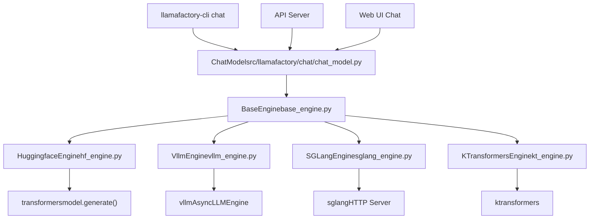
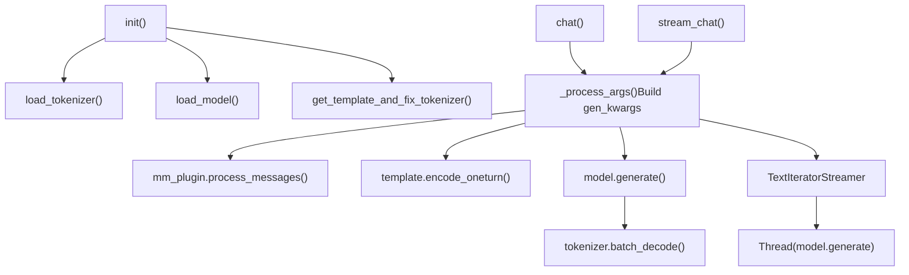
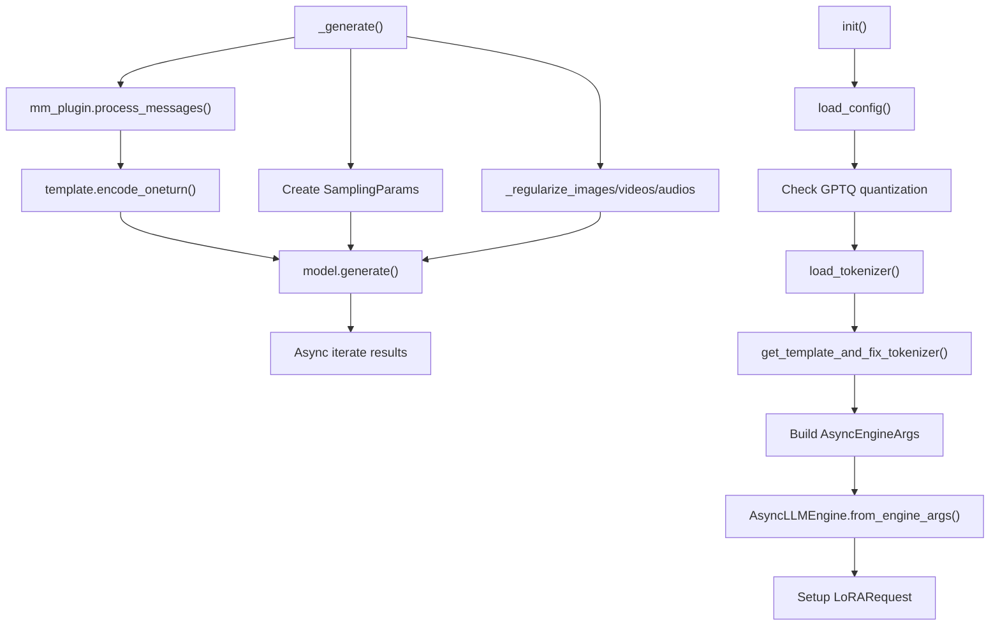
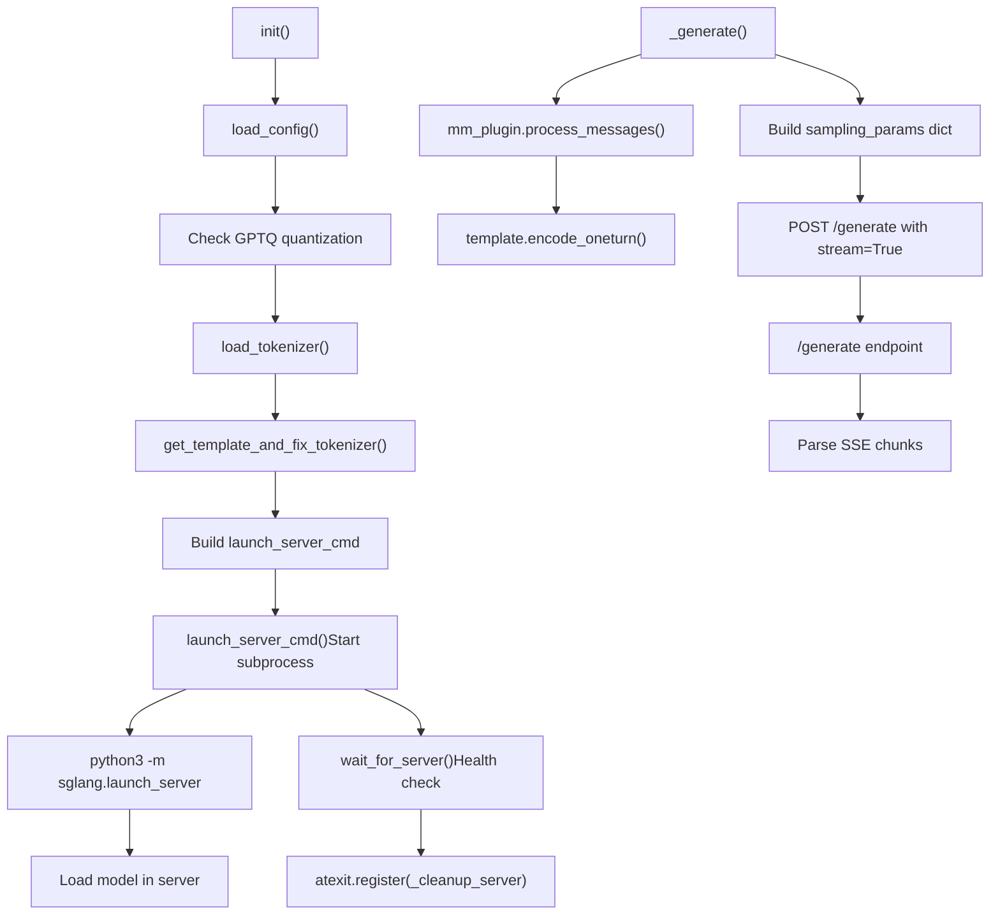
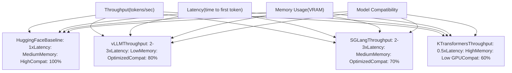

# Inference Engines

Relevant source files

-   [scripts/vllm\_infer.py](https://github.com/hiyouga/LlamaFactory/blob/355d5c5e/scripts/vllm_infer.py)
-   [src/llamafactory/chat/hf\_engine.py](https://github.com/hiyouga/LlamaFactory/blob/355d5c5e/src/llamafactory/chat/hf_engine.py)
-   [src/llamafactory/chat/sglang\_engine.py](https://github.com/hiyouga/LlamaFactory/blob/355d5c5e/src/llamafactory/chat/sglang_engine.py)
-   [src/llamafactory/chat/vllm\_engine.py](https://github.com/hiyouga/LlamaFactory/blob/355d5c5e/src/llamafactory/chat/vllm_engine.py)
-   [src/llamafactory/hparams/generating\_args.py](https://github.com/hiyouga/LlamaFactory/blob/355d5c5e/src/llamafactory/hparams/generating_args.py)
-   [tests/e2e/test\_sglang.py](https://github.com/hiyouga/LlamaFactory/blob/355d5c5e/tests/e2e/test_sglang.py)

## Purpose and Scope

This document describes the inference engine system in LlamaFactory, which provides multiple backends for model deployment and text generation. Inference engines handle model loading, prompt processing, and token generation with different optimization strategies. This page covers the architecture, available engines (HuggingFace, vLLM, SGLang, KTransformers), their trade-offs, and configuration options.

For information about the high-level chat interface that wraps these engines, see [Chat Interface and API](/hiyouga/LlamaFactory/7.2-chat-interface-and-api). For model loading and adapter configuration before inference, see [Model Loading Pipeline](/hiyouga/LlamaFactory/5.1-model-loading-pipeline) and [Adapter System](/hiyouga/LlamaFactory/5.2-adapter-system-(loraqloraoft)).

## Architecture Overview

All inference engines implement a common interface defined by `BaseEngine`, providing unified APIs regardless of the underlying implementation. The system selects an engine based on the `infer_backend` parameter and routes requests through the appropriate backend.


**Sources:** [src/llamafactory/chat/hf\_engine.py1-413](https://github.com/hiyouga/LlamaFactory/blob/355d5c5e/src/llamafactory/chat/hf_engine.py#L1-L413) [src/llamafactory/chat/vllm\_engine.py1-272](https://github.com/hiyouga/LlamaFactory/blob/355d5c5e/src/llamafactory/chat/vllm_engine.py#L1-L272) [src/llamafactory/chat/sglang\_engine.py1-290](https://github.com/hiyouga/LlamaFactory/blob/355d5c5e/src/llamafactory/chat/sglang_engine.py#L1-L290)

### BaseEngine Interface

All engines must implement four core methods:

| Method | Return Type | Purpose |
| --- | --- | --- |
| `chat()` | `list[Response]` | Synchronous generation, returns complete responses |
| `stream_chat()` | `AsyncGenerator[str, None]` | Asynchronous streaming, yields tokens incrementally |
| `get_scores()` | `list[float]` | Returns reward scores for inputs (reward models only) |
| `__init__()` | `None` | Initializes engine with model, data, finetuning, and generating args |

Each engine sets:

-   `self.name`: Engine identifier from `EngineName` enum
-   `self.can_generate`: Boolean indicating if generation is supported (only true for SFT models)
-   `self.tokenizer`: Loaded tokenizer instance
-   `self.processor`: Multimodal processor (if applicable)
-   `self.template`: Chat template for message formatting
-   `self.model`: The loaded model or engine instance

**Sources:** [src/llamafactory/chat/hf\_engine.py44-68](https://github.com/hiyouga/LlamaFactory/blob/355d5c5e/src/llamafactory/chat/hf_engine.py#L44-L68) [src/llamafactory/chat/vllm\_engine.py46-109](https://github.com/hiyouga/LlamaFactory/blob/355d5c5e/src/llamafactory/chat/vllm_engine.py#L46-L109)

## HuggingFace Engine

The `HuggingfaceEngine` uses the standard `transformers` library for inference. It loads the full model into memory and uses `model.generate()` for text generation. This is the default engine and supports all model architectures, quantization methods, and adapters.


**Sources:** [src/llamafactory/chat/hf\_engine.py44-68](https://github.com/hiyouga/LlamaFactory/blob/355d5c5e/src/llamafactory/chat/hf_engine.py#L44-L68) [src/llamafactory/chat/hf\_engine.py210-263](https://github.com/hiyouga/LlamaFactory/blob/355d5c5e/src/llamafactory/chat/hf_engine.py#L210-L263)

### Initialization

The engine initialization follows this sequence:

1.  **Load tokenizer and processor** - Uses `load_tokenizer()` to get tokenizer and optional multimodal processor [src/llamafactory/chat/hf\_engine.py54-56](https://github.com/hiyouga/LlamaFactory/blob/355d5c5e/src/llamafactory/chat/hf_engine.py#L54-L56)
2.  **Set padding side** - Left padding for generation, right padding for scoring [src/llamafactory/chat/hf\_engine.py57](https://github.com/hiyouga/LlamaFactory/blob/355d5c5e/src/llamafactory/chat/hf_engine.py#L57-L57)
3.  **Load template** - Applies chat template with `get_template_and_fix_tokenizer()` [src/llamafactory/chat/hf\_engine.py58](https://github.com/hiyouga/LlamaFactory/blob/355d5c5e/src/llamafactory/chat/hf_engine.py#L58-L58)
4.  **Load model** - Calls `load_model()` with adapters, quantization, and value head configuration [src/llamafactory/chat/hf\_engine.py59-61](https://github.com/hiyouga/LlamaFactory/blob/355d5c5e/src/llamafactory/chat/hf_engine.py#L59-L61)
5.  **Setup concurrency** - Creates asyncio semaphore to limit concurrent requests [src/llamafactory/chat/hf\_engine.py70](https://github.com/hiyouga/LlamaFactory/blob/355d5c5e/src/llamafactory/chat/hf_engine.py#L70-L70)

The `add_valuehead` parameter is set to `True` for reward models (when `can_generate=False`), adding the reward head to the model.

**Sources:** [src/llamafactory/chat/hf\_engine.py45-70](https://github.com/hiyouga/LlamaFactory/blob/355d5c5e/src/llamafactory/chat/hf_engine.py#L45-L70)

### Generation Process

The `_process_args()` static method [src/llamafactory/chat/hf\_engine.py72-208](https://github.com/hiyouga/LlamaFactory/blob/355d5c5e/src/llamafactory/chat/hf_engine.py#L72-L208) handles prompt processing:

1.  **Multimodal handling** - Injects placeholders (`<image>`, `<video>`, `<audio>`) if not present [src/llamafactory/chat/hf\_engine.py88-101](https://github.com/hiyouga/LlamaFactory/blob/355d5c5e/src/llamafactory/chat/hf_engine.py#L88-L101)
2.  **Message processing** - Uses `mm_plugin.process_messages()` to handle special tokens [src/llamafactory/chat/hf\_engine.py103-105](https://github.com/hiyouga/LlamaFactory/blob/355d5c5e/src/llamafactory/chat/hf_engine.py#L103-L105)
3.  **Token encoding** - Encodes messages with `template.encode_oneturn()` [src/llamafactory/chat/hf\_engine.py107](https://github.com/hiyouga/LlamaFactory/blob/355d5c5e/src/llamafactory/chat/hf_engine.py#L107-L107)
4.  **Token ID processing** - Processes multimodal token IDs with `mm_plugin.process_token_ids()` [src/llamafactory/chat/hf\_engine.py108-116](https://github.com/hiyouga/LlamaFactory/blob/355d5c5e/src/llamafactory/chat/hf_engine.py#L108-L116)
5.  **Parameter extraction** - Extracts generation parameters from kwargs and merges with defaults [src/llamafactory/chat/hf\_engine.py121-174](https://github.com/hiyouga/LlamaFactory/blob/355d5c5e/src/llamafactory/chat/hf_engine.py#L121-L174)
6.  **Multimodal inputs** - Converts images/videos/audios to tensors via `mm_plugin.get_mm_inputs()` [src/llamafactory/chat/hf\_engine.py181-198](https://github.com/hiyouga/LlamaFactory/blob/355d5c5e/src/llamafactory/chat/hf_engine.py#L181-L198)

The actual generation happens in `_chat()` [src/llamafactory/chat/hf\_engine.py210-263](https://github.com/hiyouga/LlamaFactory/blob/355d5c5e/src/llamafactory/chat/hf_engine.py#L210-L263):

```
generate_output = model.generate(**gen_kwargs)response_ids = generate_output[:, prompt_length:]response = tokenizer.batch_decode(response_ids, ...)
```
### Streaming Implementation

Streaming uses `TextIteratorStreamer` [src/llamafactory/chat/hf\_engine.py295-299](https://github.com/hiyouga/LlamaFactory/blob/355d5c5e/src/llamafactory/chat/hf_engine.py#L295-L299) which iterates over generated tokens in a background thread:

1.  Create streamer with `skip_prompt=True` to exclude input tokens
2.  Add streamer to generation kwargs
3.  Launch `model.generate()` in daemon thread [src/llamafactory/chat/hf\_engine.py301-302](https://github.com/hiyouga/LlamaFactory/blob/355d5c5e/src/llamafactory/chat/hf_engine.py#L301-L302)
4.  Yield tokens from streamer as they arrive [src/llamafactory/chat/hf\_engine.py304-308](https://github.com/hiyouga/LlamaFactory/blob/355d5c5e/src/llamafactory/chat/hf_engine.py#L304-L308)

The async wrapper [src/llamafactory/chat/hf\_engine.py393-399](https://github.com/hiyouga/LlamaFactory/blob/355d5c5e/src/llamafactory/chat/hf_engine.py#L393-L399) uses `asyncio.to_thread()` to run the synchronous streamer in a thread pool.

**Sources:** [src/llamafactory/chat/hf\_engine.py265-310](https://github.com/hiyouga/LlamaFactory/blob/355d5c5e/src/llamafactory/chat/hf_engine.py#L265-L310) [src/llamafactory/chat/hf\_engine.py365-399](https://github.com/hiyouga/LlamaFactory/blob/355d5c5e/src/llamafactory/chat/hf_engine.py#L365-L399)

### Reward Scoring

The `_get_scores()` method [src/llamafactory/chat/hf\_engine.py312-332](https://github.com/hiyouga/LlamaFactory/blob/355d5c5e/src/llamafactory/chat/hf_engine.py#L312-L332) is used for reward models:

1.  Tokenize batch inputs with padding and truncation
2.  Forward pass through model with value head: `values = model(**inputs)[-1]`
3.  Gather scores at the last non-padding position: `scores.gather(dim=-1, index=...)`

This only works when `can_generate=False`, enforced by the check in `get_scores()` [src/llamafactory/chat/hf\_engine.py407-408](https://github.com/hiyouga/LlamaFactory/blob/355d5c5e/src/llamafactory/chat/hf_engine.py#L407-L408)

**Sources:** [src/llamafactory/chat/hf\_engine.py312-332](https://github.com/hiyouga/LlamaFactory/blob/355d5c5e/src/llamafactory/chat/hf_engine.py#L312-L332) [src/llamafactory/chat/hf\_engine.py401-412](https://github.com/hiyouga/LlamaFactory/blob/355d5c5e/src/llamafactory/chat/hf_engine.py#L401-L412)

## vLLM Engine

The `VllmEngine` uses the vLLM library for high-throughput inference. vLLM implements PagedAttention to optimize memory usage and supports continuous batching for better GPU utilization. It can achieve 2-3x higher throughput compared to HuggingFace engine.


**Sources:** [src/llamafactory/chat/vllm\_engine.py46-109](https://github.com/hiyouga/LlamaFactory/blob/355d5c5e/src/llamafactory/chat/vllm_engine.py#L46-L109) [src/llamafactory/chat/vllm\_engine.py111-216](https://github.com/hiyouga/LlamaFactory/blob/355d5c5e/src/llamafactory/chat/vllm_engine.py#L111-L216)

### Initialization and Configuration

The engine initialization [src/llamafactory/chat/vllm\_engine.py47-109](https://github.com/hiyouga/LlamaFactory/blob/355d5c5e/src/llamafactory/chat/vllm_engine.py#L47-L109) follows these steps:

1.  **Load config and check quantization** - GPTQ models require `float16` dtype [src/llamafactory/chat/vllm\_engine.py56-61](https://github.com/hiyouga/LlamaFactory/blob/355d5c5e/src/llamafactory/chat/vllm_engine.py#L56-L61)
2.  **Setup tokenizer and template** - Loads tokenizer with left padding, template with `expand_mm_tokens=False` [src/llamafactory/chat/vllm\_engine.py64-69](https://github.com/hiyouga/LlamaFactory/blob/355d5c5e/src/llamafactory/chat/vllm_engine.py#L64-L69)
3.  **Build engine arguments** - Configures vLLM parameters [src/llamafactory/chat/vllm\_engine.py72-97](https://github.com/hiyouga/LlamaFactory/blob/355d5c5e/src/llamafactory/chat/vllm_engine.py#L72-L97):

| Parameter | Purpose | Default/Value |
| --- | --- | --- |
| `model` | Model path | `model_args.model_name_or_path` |
| `dtype` | Inference precision | `model_args.infer_dtype` |
| `max_model_len` | Maximum sequence length | `model_args.vllm_maxlen` |
| `tensor_parallel_size` | Number of GPUs for tensor parallelism | `get_device_count()` |
| `gpu_memory_utilization` | GPU memory fraction | `model_args.vllm_gpu_util` |
| `enforce_eager` | Disable CUDA graph optimization | `model_args.vllm_enforce_eager` |
| `enable_lora` | Enable LoRA adapters | True if adapters present |
| `max_lora_rank` | Maximum LoRA rank | `model_args.vllm_max_lora_rank` |

4.  **Configure multimodal limits** - Sets limits for images, videos, audios per prompt [src/llamafactory/chat/vllm\_engine.py93-94](https://github.com/hiyouga/LlamaFactory/blob/355d5c5e/src/llamafactory/chat/vllm_engine.py#L93-L94)
5.  **Apply custom config** - Merges user-provided `vllm_config` dict [src/llamafactory/chat/vllm\_engine.py96-97](https://github.com/hiyouga/LlamaFactory/blob/355d5c5e/src/llamafactory/chat/vllm_engine.py#L96-L97)
6.  **Create async engine** - Instantiates `AsyncLLMEngine.from_engine_args()` [src/llamafactory/chat/vllm\_engine.py105](https://github.com/hiyouga/LlamaFactory/blob/355d5c5e/src/llamafactory/chat/vllm_engine.py#L105-L105)
7.  **Setup LoRA request** - Creates `LoRARequest` if adapters specified [src/llamafactory/chat/vllm\_engine.py106-109](https://github.com/hiyouga/LlamaFactory/blob/355d5c5e/src/llamafactory/chat/vllm_engine.py#L106-L109)

**Special handling for Yi-VL models:** The engine patches the multimodal projector [src/llamafactory/chat/vllm\_engine.py99-103](https://github.com/hiyouga/LlamaFactory/blob/355d5c5e/src/llamafactory/chat/vllm_engine.py#L99-L103):

```
if getattr(config, "is_yi_vl_derived_model", None):    vllm.model_executor.models.llava.LlavaMultiModalProjector = LlavaMultiModalProjectorForYiVLForVLLM
```
**Sources:** [src/llamafactory/chat/vllm\_engine.py47-109](https://github.com/hiyouga/LlamaFactory/blob/355d5c5e/src/llamafactory/chat/vllm_engine.py#L47-L109)

### Generation Pipeline

The `_generate()` method [src/llamafactory/chat/vllm\_engine.py111-216](https://github.com/hiyouga/LlamaFactory/blob/355d5c5e/src/llamafactory/chat/vllm_engine.py#L111-L216) implements the core generation logic:

1.  **Generate request ID** - Creates unique ID: `f"chatcmpl-{uuid.uuid4().hex}"` [src/llamafactory/chat/vllm\_engine.py121](https://github.com/hiyouga/LlamaFactory/blob/355d5c5e/src/llamafactory/chat/vllm_engine.py#L121-L121)
2.  **Inject multimodal placeholders** - Prepends placeholders if not present in messages [src/llamafactory/chat/vllm\_engine.py122-129](https://github.com/hiyouga/LlamaFactory/blob/355d5c5e/src/llamafactory/chat/vllm_engine.py#L122-L129)
3.  **Process messages** - Uses `mm_plugin.process_messages()` to handle special tokens [src/llamafactory/chat/vllm\_engine.py131-133](https://github.com/hiyouga/LlamaFactory/blob/355d5c5e/src/llamafactory/chat/vllm_engine.py#L131-L133)
4.  **Encode prompt** - Encodes with assistant turn appended [src/llamafactory/chat/vllm\_engine.py134-136](https://github.com/hiyouga/LlamaFactory/blob/355d5c5e/src/llamafactory/chat/vllm_engine.py#L134-L136)
5.  **Extract generation parameters** - Pops parameters from kwargs with fallback to defaults [src/llamafactory/chat/vllm\_engine.py138-147](https://github.com/hiyouga/LlamaFactory/blob/355d5c5e/src/llamafactory/chat/vllm_engine.py#L138-L147)
6.  **Calculate max\_tokens** - Determines from `max_new_tokens`, `max_length`, or generating\_args [src/llamafactory/chat/vllm\_engine.py152-164](https://github.com/hiyouga/LlamaFactory/blob/355d5c5e/src/llamafactory/chat/vllm_engine.py#L152-L164)
7.  **Build SamplingParams** - Creates vLLM sampling configuration [src/llamafactory/chat/vllm\_engine.py166-181](https://github.com/hiyouga/LlamaFactory/blob/355d5c5e/src/llamafactory/chat/vllm_engine.py#L166-L181):

```
sampling_params = SamplingParams(    n=num_return_sequences,    repetition_penalty=repetition_penalty or 1.0,    temperature=temperature,    top_p=top_p or 1.0,    top_k=top_k or -1,    stop=stop,    stop_token_ids=self.template.get_stop_token_ids(self.tokenizer),    max_tokens=max_tokens,    skip_special_tokens=skip_special_tokens)
```
8.  **Regularize multimodal data** - Converts images/videos/audios to proper format [src/llamafactory/chat/vllm\_engine.py183-208](https://github.com/hiyouga/LlamaFactory/blob/355d5c5e/src/llamafactory/chat/vllm_engine.py#L183-L208):

    -   Images: `_regularize_images()` resizes to `image_max_pixels` and `image_min_pixels`
    -   Videos: `_regularize_videos()` samples frames based on `video_fps` and `video_maxlen`
    -   Audios: `_regularize_audios()` resamples to `audio_sampling_rate`
9.  **Generate** - Calls `model.generate()` with prompt token IDs and multimodal data [src/llamafactory/chat/vllm\_engine.py210-216](https://github.com/hiyouga/LlamaFactory/blob/355d5c5e/src/llamafactory/chat/vllm_engine.py#L210-L216)


**Sources:** [src/llamafactory/chat/vllm\_engine.py111-216](https://github.com/hiyouga/LlamaFactory/blob/355d5c5e/src/llamafactory/chat/vllm_engine.py#L111-L216)

### Chat and Streaming Responses

The `chat()` method [src/llamafactory/chat/vllm\_engine.py218-245](https://github.com/hiyouga/LlamaFactory/blob/355d5c5e/src/llamafactory/chat/vllm_engine.py#L218-L245) consumes the entire generator:

```
async for request_output in generator:    final_output = request_output for output in final_output.outputs:    results.append(Response(        response_text=output.text,        response_length=len(output.token_ids),        prompt_length=len(final_output.prompt_token_ids),        finish_reason=output.finish_reason,    ))
```
The `stream_chat()` method [src/llamafactory/chat/vllm\_engine.py247-263](https://github.com/hiyouga/LlamaFactory/blob/355d5c5e/src/llamafactory/chat/vllm_engine.py#L247-L263) yields incremental deltas:

```
generated_text = ""async for result in generator:    delta_text = result.outputs[0].text[len(generated_text):]    generated_text = result.outputs[0].text    yield delta_text
```
**Note:** vLLM does not support `get_scores()` - it raises `NotImplementedError` [src/llamafactory/chat/vllm\_engine.py265-271](https://github.com/hiyouga/LlamaFactory/blob/355d5c5e/src/llamafactory/chat/vllm_engine.py#L265-L271)

**Sources:** [src/llamafactory/chat/vllm\_engine.py218-271](https://github.com/hiyouga/LlamaFactory/blob/355d5c5e/src/llamafactory/chat/vllm_engine.py#L218-L271)

### Batch Inference Script

The `vllm_infer.py` script [scripts/vllm\_infer.py1-283](https://github.com/hiyouga/LlamaFactory/blob/355d5c5e/scripts/vllm_infer.py#L1-L283) provides batch inference capabilities:

1.  **Direct vLLM instantiation** - Creates `LLM` object directly (not `AsyncLLMEngine`) [scripts/vllm\_infer.py125](https://github.com/hiyouga/LlamaFactory/blob/355d5c5e/scripts/vllm_infer.py#L125-L125)
2.  **Batch processing** - Processes dataset in batches to avoid file handle limits [scripts/vllm\_infer.py152-225](https://github.com/hiyouga/LlamaFactory/blob/355d5c5e/scripts/vllm_infer.py#L152-L225)
3.  **Dataset loading** - Uses `get_dataset()` to load training data in PPO format [scripts/vllm\_infer.py128-129](https://github.com/hiyouga/LlamaFactory/blob/355d5c5e/scripts/vllm_infer.py#L128-L129)
4.  **Multimodal support** - Handles images, videos, audios with proper regularization [scripts/vllm\_infer.py157-207](https://github.com/hiyouga/LlamaFactory/blob/355d5c5e/scripts/vllm_infer.py#L157-L207)
5.  **Performance metrics** - Calculates BLEU/ROUGE scores and throughput [scripts/vllm\_infer.py252-278](https://github.com/hiyouga/LlamaFactory/blob/355d5c5e/scripts/vllm_infer.py#L252-L278)

Key configuration parameters:

| Parameter | Purpose | Default |
| --- | --- | --- |
| `batch_size` | Number of samples per batch | 1024 |
| `pipeline_parallel_size` | Pipeline parallelism degree | 1 |
| `temperature` | Sampling temperature | 0.95 |
| `max_new_tokens` | Maximum tokens to generate | 1024 |
| `image_max_pixels` | Maximum image resolution | 768×768 |
| `video_fps` | Video sampling frame rate | 2.0 |

**Sources:** [scripts/vllm\_infer.py47-283](https://github.com/hiyouga/LlamaFactory/blob/355d5c5e/scripts/vllm_infer.py#L47-L283)

## SGLang Engine

The `SGLangEngine` uses SGLang's HTTP server for inference. Unlike vLLM and HuggingFace engines which embed the model in the Python process, SGLang launches a separate server process and communicates via HTTP. This architecture enables better process isolation and easier deployment.


**Sources:** [src/llamafactory/chat/sglang\_engine.py46-129](https://github.com/hiyouga/LlamaFactory/blob/355d5c5e/src/llamafactory/chat/sglang_engine.py#L46-L129) [src/llamafactory/chat/sglang\_engine.py140-229](https://github.com/hiyouga/LlamaFactory/blob/355d5c5e/src/llamafactory/chat/sglang_engine.py#L140-L229)

### Initialization and Server Launch

The engine initialization [src/llamafactory/chat/sglang\_engine.py58-129](https://github.com/hiyouga/LlamaFactory/blob/355d5c5e/src/llamafactory/chat/sglang_engine.py#L58-L129) follows this process:

1.  **Load config and tokenizer** - Same as vLLM, checks GPTQ quantization [src/llamafactory/chat/sglang\_engine.py67-79](https://github.com/hiyouga/LlamaFactory/blob/355d5c5e/src/llamafactory/chat/sglang_engine.py#L67-L79)
2.  **Setup LoRA flag** - Sets boolean flag (not full LoRARequest object) [src/llamafactory/chat/sglang\_engine.py82-85](https://github.com/hiyouga/LlamaFactory/blob/355d5c5e/src/llamafactory/chat/sglang_engine.py#L82-L85)
3.  **Build launch command** - Constructs shell command to start SGLang server [src/llamafactory/chat/sglang\_engine.py87-106](https://github.com/hiyouga/LlamaFactory/blob/355d5c5e/src/llamafactory/chat/sglang_engine.py#L87-L106):

```
launch_cmd = [    "python3 -m sglang.launch_server",    f"--model-path {model_args.model_name_or_path}",    f"--dtype {model_args.infer_dtype}",    f"--context-length {model_args.sglang_maxlen}",    f"--mem-fraction-static {model_args.sglang_mem_fraction}",    f"--tp-size {model_args.sglang_tp_size or get_device_count()}",    f"--download-dir {model_args.cache_dir}",    "--log-level error",]
```
4.  **Add LoRA configuration** - If adapters present, adds LoRA-specific flags [src/llamafactory/chat/sglang\_engine.py98-105](https://github.com/hiyouga/LlamaFactory/blob/355d5c5e/src/llamafactory/chat/sglang_engine.py#L98-L105):

    -   `--max-loras-per-batch 1`
    -   `--lora-backend {sglang_lora_backend}`
    -   `--lora-paths lora0={adapter_path}`
    -   `--disable-radix-cache` (required for LoRA)
5.  **Launch server subprocess** - Calls `launch_server_cmd()` which returns process and port [src/llamafactory/chat/sglang\_engine.py109-110](https://github.com/hiyouga/LlamaFactory/blob/355d5c5e/src/llamafactory/chat/sglang_engine.py#L109-L110)

6.  **Wait for server readiness** - Uses `wait_for_server()` with 300s timeout [src/llamafactory/chat/sglang\_engine.py115](https://github.com/hiyouga/LlamaFactory/blob/355d5c5e/src/llamafactory/chat/sglang_engine.py#L115-L115)

7.  **Register cleanup handler** - Ensures server is killed on exit [src/llamafactory/chat/sglang\_engine.py112](https://github.com/hiyouga/LlamaFactory/blob/355d5c5e/src/llamafactory/chat/sglang_engine.py#L112-L112)

8.  **Verify server health** - Optional GET request to `/get_model_info` [src/llamafactory/chat/sglang\_engine.py117-123](https://github.com/hiyouga/LlamaFactory/blob/355d5c5e/src/llamafactory/chat/sglang_engine.py#L117-L123)


The cleanup handler [src/llamafactory/chat/sglang\_engine.py130-138](https://github.com/hiyouga/LlamaFactory/blob/355d5c5e/src/llamafactory/chat/sglang_engine.py#L130-L138) uses `terminate_process()` to kill the subprocess tree.

**Sources:** [src/llamafactory/chat/sglang\_engine.py58-138](https://github.com/hiyouga/LlamaFactory/blob/355d5c5e/src/llamafactory/chat/sglang_engine.py#L58-L138)

### HTTP-based Generation

The `_generate()` method [src/llamafactory/chat/sglang\_engine.py140-229](https://github.com/hiyouga/LlamaFactory/blob/355d5c5e/src/llamafactory/chat/sglang_engine.py#L140-L229) communicates with the server via HTTP:

1.  **Process messages and encode** - Same pipeline as other engines [src/llamafactory/chat/sglang\_engine.py150-164](https://github.com/hiyouga/LlamaFactory/blob/355d5c5e/src/llamafactory/chat/sglang_engine.py#L150-L164)
2.  **Build sampling parameters** - Creates dict with generation config [src/llamafactory/chat/sglang\_engine.py193-207](https://github.com/hiyouga/LlamaFactory/blob/355d5c5e/src/llamafactory/chat/sglang_engine.py#L193-L207):

```
sampling_params = {    "temperature": temperature,    "top_p": top_p or 1.0,    "top_k": top_k or -1,    "stop": stop,    "stop_token_ids": self.template.get_stop_token_ids(self.tokenizer),    "max_new_tokens": max_tokens,    "repetition_penalty": repetition_penalty or 1.0,    "skip_special_tokens": skip_special_tokens,}
```
3.  **Create HTTP request** - POST to `/generate` endpoint [src/llamafactory/chat/sglang\_engine.py209-217](https://github.com/hiyouga/LlamaFactory/blob/355d5c5e/src/llamafactory/chat/sglang_engine.py#L209-L217):

```
json_data = {    "input_ids": prompt_ids,    "sampling_params": sampling_params,    "stream": True,}if self.lora_request:    json_data["lora_request"] = ["lora0"] response = requests.post(f"{self.base_url}/generate", json=json_data, stream=True)
```
4.  **Parse SSE stream** - Iterates over Server-Sent Events [src/llamafactory/chat/sglang\_engine.py221-227](https://github.com/hiyouga/LlamaFactory/blob/355d5c5e/src/llamafactory/chat/sglang_engine.py#L221-L227):

```
for chunk in response.iter_lines(decode_unicode=False):    chunk = str(chunk.decode("utf-8"))    if chunk == "data: [DONE]":        break    if chunk and chunk.startswith("data:"):        yield json.loads(chunk[5:].strip("\n"))
```
The response format includes:

-   `text`: Generated text
-   `meta_info.completion_tokens`: Number of generated tokens
-   `meta_info.prompt_tokens`: Number of prompt tokens
-   `meta_info.finish_reason`: "stop" or other termination reason

**Limitation:** SGLang only supports `num_return_sequences=1` [src/llamafactory/chat/sglang\_engine.py176-177](https://github.com/hiyouga/LlamaFactory/blob/355d5c5e/src/llamafactory/chat/sglang_engine.py#L176-L177)

**Sources:** [src/llamafactory/chat/sglang\_engine.py140-229](https://github.com/hiyouga/LlamaFactory/blob/355d5c5e/src/llamafactory/chat/sglang_engine.py#L140-L229) [src/llamafactory/chat/sglang\_engine.py231-273](https://github.com/hiyouga/LlamaFactory/blob/355d5c5e/src/llamafactory/chat/sglang_engine.py#L231-L273)

## KTransformers Engine

The `KTransformersEngine` is designed for CPU-GPU hybrid inference, enabling efficient inference on systems with limited GPU memory by offloading parts of the model to CPU. This engine is not covered in the provided files but is mentioned in the architecture diagrams as part of the available backends.

Configuration is controlled via `infer_backend="kt"` parameter. This engine is particularly useful for:

-   Large models that don't fit entirely in GPU memory
-   Systems with high CPU memory but limited VRAM
-   Reducing inference costs by utilizing CPU resources

**Sources:** Architecture diagrams

## Engine Selection and Configuration

### Backend Selection

The inference backend is specified via the `infer_backend` parameter in `ModelArguments`:

| Backend Value | Engine Class | Use Case |
| --- | --- | --- |
| `"hf"` | `HuggingfaceEngine` | Default, maximum compatibility, development |
| `"vllm"` | `VllmEngine` | High throughput, production serving |
| `"sglang"` | `SGLangEngine` | Server-based deployment, process isolation |
| `"kt"` | `KTransformersEngine` | CPU-GPU hybrid, memory-constrained systems |

The engine is instantiated based on this parameter in the `ChatModel` initialization.

**Sources:** [src/llamafactory/chat/hf\_engine.py52](https://github.com/hiyouga/LlamaFactory/blob/355d5c5e/src/llamafactory/chat/hf_engine.py#L52-L52) [src/llamafactory/chat/vllm\_engine.py54](https://github.com/hiyouga/LlamaFactory/blob/355d5c5e/src/llamafactory/chat/vllm_engine.py#L54-L54) [src/llamafactory/chat/sglang\_engine.py65](https://github.com/hiyouga/LlamaFactory/blob/355d5c5e/src/llamafactory/chat/sglang_engine.py#L65-L65)

### Generation Parameters

All engines accept common generation parameters through `GeneratingArguments` [src/llamafactory/hparams/generating\_args.py21-83](https://github.com/hiyouga/LlamaFactory/blob/355d5c5e/src/llamafactory/hparams/generating_args.py#L21-L83):

| Parameter | Type | Default | Description |
| --- | --- | --- | --- |
| `do_sample` | bool | True | Use sampling vs greedy decoding |
| `temperature` | float | 0.95 | Sampling temperature (0 = greedy) |
| `top_p` | float | 0.7 | Nucleus sampling threshold |
| `top_k` | int | 50 | Top-k sampling vocabulary size |
| `max_new_tokens` | int | 1024 | Maximum tokens to generate |
| `max_length` | int | 1024 | Maximum total sequence length |
| `repetition_penalty` | float | 1.0 | Penalty for token repetition |
| `length_penalty` | float | 1.0 | Beam search length penalty |
| `skip_special_tokens` | bool | True | Remove special tokens from output |

These can be overridden per-request via kwargs to `chat()` or `stream_chat()`.

**Sources:** [src/llamafactory/hparams/generating\_args.py21-83](https://github.com/hiyouga/LlamaFactory/blob/355d5c5e/src/llamafactory/hparams/generating_args.py#L21-L83)

### Engine-Specific Configuration

#### vLLM Configuration

vLLM-specific parameters in `ModelArguments`:

| Parameter | Purpose | Default |
| --- | --- | --- |
| `vllm_maxlen` | Maximum sequence length | Model's max |
| `vllm_gpu_util` | GPU memory utilization (0-1) | 0.9 |
| `vllm_enforce_eager` | Disable CUDA graphs | False |
| `vllm_max_lora_rank` | Maximum LoRA rank | 32 |
| `vllm_config` | Custom vLLM engine args (dict) | {} |

Example custom config:

```
vllm_config = {    "max_num_seqs": 256,    "max_num_batched_tokens": 4096,    "enable_prefix_caching": True}
```
**Sources:** [src/llamafactory/chat/vllm\_engine.py72-97](https://github.com/hiyouga/LlamaFactory/blob/355d5c5e/src/llamafactory/chat/vllm_engine.py#L72-L97)

#### SGLang Configuration

SGLang-specific parameters:

| Parameter | Purpose | Default |
| --- | --- | --- |
| `sglang_maxlen` | Context length | Model's max |
| `sglang_mem_fraction` | Static memory fraction | 0.9 |
| `sglang_tp_size` | Tensor parallel size | Auto (GPU count) |
| `sglang_lora_backend` | LoRA implementation | "sglora" |

**Sources:** [src/llamafactory/chat/sglang\_engine.py87-105](https://github.com/hiyouga/LlamaFactory/blob/355d5c5e/src/llamafactory/chat/sglang_engine.py#L87-L105)

### Performance Characteristics


**Recommendation matrix:**

| Scenario | Recommended Engine | Reason |
| --- | --- | --- |
| Development/Testing | HuggingFace | Maximum compatibility, easier debugging |
| Production API (high QPS) | vLLM | Highest throughput, continuous batching |
| Production API (process isolation) | SGLang | Server-based, independent lifecycle |
| Large models (limited VRAM) | KTransformers | CPU-GPU hybrid offloading |
| Reward model scoring | HuggingFace | Only engine supporting `get_scores()` |
| Streaming responses | Any | All engines support streaming |
| Multi-GPU inference | vLLM or SGLang | Tensor parallelism support |

**Sources:** [src/llamafactory/chat/vllm\_engine.py1-272](https://github.com/hiyouga/LlamaFactory/blob/355d5c5e/src/llamafactory/chat/vllm_engine.py#L1-L272) [src/llamafactory/chat/sglang\_engine.py46-56](https://github.com/hiyouga/LlamaFactory/blob/355d5c5e/src/llamafactory/chat/sglang_engine.py#L46-L56) [scripts/vllm\_infer.py74-76](https://github.com/hiyouga/LlamaFactory/blob/355d5c5e/scripts/vllm_infer.py#L74-L76)

## Common Features Across Engines

### Multimodal Support

All engines support images, videos, and audio inputs:

1.  **Placeholder injection** - Automatically prepends `<image>`, `<video>`, `<audio>` tokens if not in messages [src/llamafactory/chat/vllm\_engine.py122-129](https://github.com/hiyouga/LlamaFactory/blob/355d5c5e/src/llamafactory/chat/vllm_engine.py#L122-L129)
2.  **Message processing** - `mm_plugin.process_messages()` handles special token placement [src/llamafactory/chat/vllm\_engine.py131-133](https://github.com/hiyouga/LlamaFactory/blob/355d5c5e/src/llamafactory/chat/vllm_engine.py#L131-L133)
3.  **Media regularization** - Converts raw inputs to processor-compatible format:
    -   Images: Resized based on `image_max_pixels` and `image_min_pixels`
    -   Videos: Frame sampling based on `video_fps` and `video_maxlen`
    -   Audios: Resampling to `audio_sampling_rate`

**Sources:** [src/llamafactory/chat/vllm\_engine.py122-208](https://github.com/hiyouga/LlamaFactory/blob/355d5c5e/src/llamafactory/chat/vllm_engine.py#L122-L208) [src/llamafactory/chat/hf\_engine.py88-116](https://github.com/hiyouga/LlamaFactory/blob/355d5c5e/src/llamafactory/chat/hf_engine.py#L88-L116)

### Template and Tokenization

All engines use the same template system:

1.  **Load template** - `get_template_and_fix_tokenizer()` applies model-specific format [src/llamafactory/chat/hf\_engine.py58](https://github.com/hiyouga/LlamaFactory/blob/355d5c5e/src/llamafactory/chat/hf_engine.py#L58-L58)
2.  **Encode messages** - `template.encode_oneturn()` converts messages to token IDs [src/llamafactory/chat/vllm\_engine.py135](https://github.com/hiyouga/LlamaFactory/blob/355d5c5e/src/llamafactory/chat/vllm_engine.py#L135-L135)
3.  **Stop tokens** - `template.get_stop_token_ids()` provides termination tokens [src/llamafactory/chat/vllm\_engine.py176](https://github.com/hiyouga/LlamaFactory/blob/355d5c5e/src/llamafactory/chat/vllm_engine.py#L176-L176)

For vLLM and SGLang, `expand_mm_tokens` is disabled to let the backend handle multimodal tokens [src/llamafactory/chat/vllm\_engine.py69](https://github.com/hiyouga/LlamaFactory/blob/355d5c5e/src/llamafactory/chat/vllm_engine.py#L69-L69)

**Sources:** [src/llamafactory/chat/hf\_engine.py58](https://github.com/hiyouga/LlamaFactory/blob/355d5c5e/src/llamafactory/chat/hf_engine.py#L58-L58) [src/llamafactory/chat/vllm\_engine.py68-69](https://github.com/hiyouga/LlamaFactory/blob/355d5c5e/src/llamafactory/chat/vllm_engine.py#L68-L69) [src/llamafactory/chat/sglang\_engine.py79-80](https://github.com/hiyouga/LlamaFactory/blob/355d5c5e/src/llamafactory/chat/sglang_engine.py#L79-L80)

### Adapter Support

LoRA adapters are supported differently by each engine:

| Engine | Adapter Loading | Limitations |
| --- | --- | --- |
| HuggingFace | Via `load_model()`, merged into base model | All adapter types supported |
| vLLM | Via `LoRARequest`, dynamically swappable | LoRA only, requires `enable_lora=True` |
| SGLang | Via `--lora-paths` flag, server-side loading | LoRA only, single adapter per batch |

For vLLM, the adapter is passed to each generation request [src/llamafactory/chat/vllm\_engine.py214](https://github.com/hiyouga/LlamaFactory/blob/355d5c5e/src/llamafactory/chat/vllm_engine.py#L214-L214):

```
self.model.generate(..., lora_request=self.lora_request)
```
For SGLang, the adapter name is included in the request JSON [src/llamafactory/chat/sglang\_engine.py215-216](https://github.com/hiyouga/LlamaFactory/blob/355d5c5e/src/llamafactory/chat/sglang_engine.py#L215-L216):

```
if self.lora_request:    json_data["lora_request"] = ["lora0"]
```
**Sources:** [src/llamafactory/chat/hf\_engine.py59-61](https://github.com/hiyouga/LlamaFactory/blob/355d5c5e/src/llamafactory/chat/hf_engine.py#L59-L61) [src/llamafactory/chat/vllm\_engine.py106-109](https://github.com/hiyouga/LlamaFactory/blob/355d5c5e/src/llamafactory/chat/vllm_engine.py#L106-L109) [src/llamafactory/chat/sglang\_engine.py82-105](https://github.com/hiyouga/LlamaFactory/blob/355d5c5e/src/llamafactory/chat/sglang_engine.py#L82-L105)

### Error Handling

Common error patterns:

1.  **Unsupported operations** - Engines raise `NotImplementedError` for unsupported methods:

    -   vLLM: `get_scores()` not supported [src/llamafactory/chat/vllm\_engine.py271](https://github.com/hiyouga/LlamaFactory/blob/355d5c5e/src/llamafactory/chat/vllm_engine.py#L271-L271)
    -   SGLang: `get_scores()` not supported [src/llamafactory/chat/sglang\_engine.py281](https://github.com/hiyouga/LlamaFactory/blob/355d5c5e/src/llamafactory/chat/sglang_engine.py#L281-L281)
    -   SGLang: `num_return_sequences > 1` not supported [src/llamafactory/chat/sglang\_engine.py176-177](https://github.com/hiyouga/LlamaFactory/blob/355d5c5e/src/llamafactory/chat/sglang_engine.py#L176-L177)
2.  **Generation validation** - HuggingFace checks `can_generate` before generation [src/llamafactory/chat/hf\_engine.py345-346](https://github.com/hiyouga/LlamaFactory/blob/355d5c5e/src/llamafactory/chat/hf_engine.py#L345-L346) [src/llamafactory/chat/hf\_engine.py376-377](https://github.com/hiyouga/LlamaFactory/blob/355d5c5e/src/llamafactory/chat/hf_engine.py#L376-L377)

3.  **Scoring validation** - HuggingFace checks `can_generate=False` before scoring [src/llamafactory/chat/hf\_engine.py407-408](https://github.com/hiyouga/LlamaFactory/blob/355d5c5e/src/llamafactory/chat/hf_engine.py#L407-L408)


**Sources:** [src/llamafactory/chat/hf\_engine.py345-346](https://github.com/hiyouga/LlamaFactory/blob/355d5c5e/src/llamafactory/chat/hf_engine.py#L345-L346) [src/llamafactory/chat/vllm\_engine.py265-271](https://github.com/hiyouga/LlamaFactory/blob/355d5c5e/src/llamafactory/chat/vllm_engine.py#L265-L271) [src/llamafactory/chat/sglang\_engine.py275-281](https://github.com/hiyouga/LlamaFactory/blob/355d5c5e/src/llamafactory/chat/sglang_engine.py#L275-L281)
