# Chat Interface and API

Relevant source files

-   [examples/README.md](https://github.com/hiyouga/LlamaFactory/blob/355d5c5e/examples/README.md?plain=1)
-   [examples/README\_zh.md](https://github.com/hiyouga/LlamaFactory/blob/355d5c5e/examples/README_zh.md?plain=1)
-   [scripts/vllm\_infer.py](https://github.com/hiyouga/LlamaFactory/blob/355d5c5e/scripts/vllm_infer.py)
-   [src/llamafactory/chat/base\_engine.py](https://github.com/hiyouga/LlamaFactory/blob/355d5c5e/src/llamafactory/chat/base_engine.py)
-   [src/llamafactory/chat/chat\_model.py](https://github.com/hiyouga/LlamaFactory/blob/355d5c5e/src/llamafactory/chat/chat_model.py)
-   [src/llamafactory/chat/hf\_engine.py](https://github.com/hiyouga/LlamaFactory/blob/355d5c5e/src/llamafactory/chat/hf_engine.py)
-   [src/llamafactory/chat/sglang\_engine.py](https://github.com/hiyouga/LlamaFactory/blob/355d5c5e/src/llamafactory/chat/sglang_engine.py)
-   [src/llamafactory/chat/vllm\_engine.py](https://github.com/hiyouga/LlamaFactory/blob/355d5c5e/src/llamafactory/chat/vllm_engine.py)
-   [src/llamafactory/cli.py](https://github.com/hiyouga/LlamaFactory/blob/355d5c5e/src/llamafactory/cli.py)
-   [src/llamafactory/hparams/generating\_args.py](https://github.com/hiyouga/LlamaFactory/blob/355d5c5e/src/llamafactory/hparams/generating_args.py)
-   [src/llamafactory/v1/launcher.py](https://github.com/hiyouga/LlamaFactory/blob/355d5c5e/src/llamafactory/v1/launcher.py)
-   [tests/e2e/test\_sglang.py](https://github.com/hiyouga/LlamaFactory/blob/355d5c5e/tests/e2e/test_sglang.py)

This page documents the chat interface and API system in LlamaFactory, which provides unified interfaces for model inference across multiple backend engines. The system supports synchronous and asynchronous inference, streaming generation, and reward model scoring.

For information about the inference engines themselves (HuggingFace, vLLM, SGLang, KTransformers), see [Inference Engines](/hiyouga/LlamaFactory/7.1-inference-engines). For model export and deployment configurations, see [Model Export and Merging](/hiyouga/LlamaFactory/7.3-model-export-and-merging).

---

## System Architecture

The chat interface system is built on a layered architecture with a unified frontend (`ChatModel`) and pluggable backend engines:

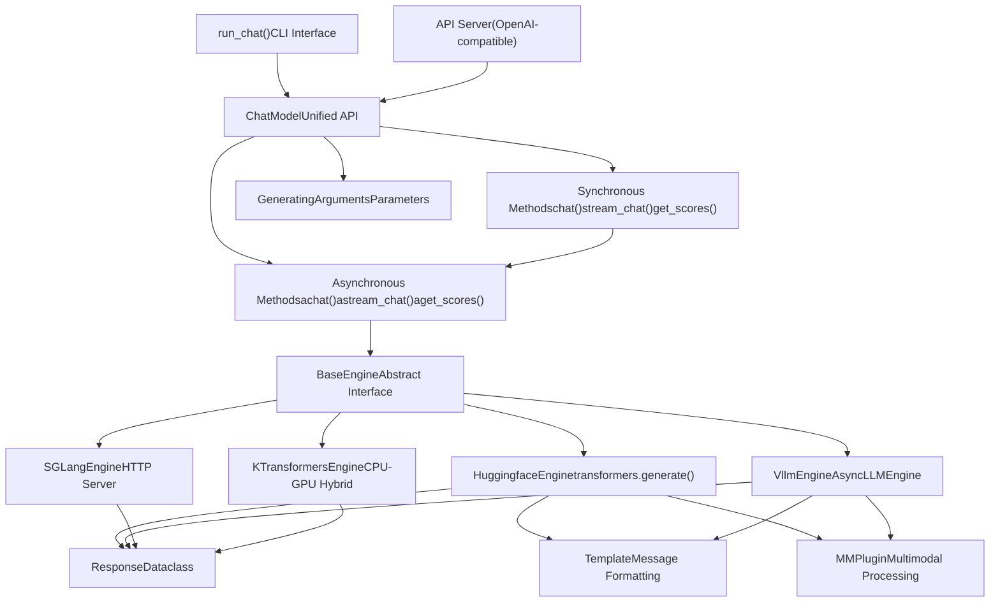
**Sources:** [src/llamafactory/chat/chat\_model.py39-89](https://github.com/hiyouga/LlamaFactory/blob/355d5c5e/src/llamafactory/chat/chat_model.py#L39-L89) [src/llamafactory/chat/base\_engine.py39-99](https://github.com/hiyouga/LlamaFactory/blob/355d5c5e/src/llamafactory/chat/base_engine.py#L39-L99)

---

## ChatModel: Unified Interface

The `ChatModel` class provides a unified interface for inference that abstracts away backend differences. It automatically selects and initializes the appropriate engine based on the `infer_backend` parameter.

### Initialization

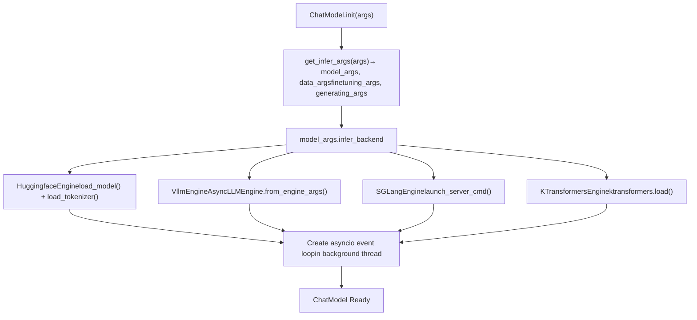
The initialization process:

1.  **Parse Arguments**: Converts input dictionary to typed argument objects using `get_infer_args()`
2.  **Select Engine**: Based on `model_args.infer_backend`, instantiates the appropriate engine class
3.  **Create Event Loop**: Spawns a background thread running an asyncio event loop to handle async operations

**Backend Selection:**

| Backend | Engine Class | Primary Use Case |
| --- | --- | --- |
| `hf` | `HuggingfaceEngine` | Development, debugging, multimodal support |
| `vllm` | `VllmEngine` | Production high-throughput inference |
| `sglang` | `SGLangEngine` | HTTP-based serving, advanced caching |
| `kt` | `KTransformersEngine` | CPU-GPU hybrid, resource-constrained environments |

**Sources:** [src/llamafactory/chat/chat\_model.py47-89](https://github.com/hiyouga/LlamaFactory/blob/355d5c5e/src/llamafactory/chat/chat_model.py#L47-L89) [src/llamafactory/hparams/\_\_init\_\_.py](https://github.com/hiyouga/LlamaFactory/blob/355d5c5e/src/llamafactory/hparams/__init__.py)

---

## API Methods

The `ChatModel` class exposes six public methods, with both synchronous and asynchronous versions of three core operations:

### Method Overview Table

| Synchronous | Asynchronous | Purpose | Returns |
| --- | --- | --- | --- |
| `chat()` | `achat()` | Single complete response | `list[Response]` |
| `stream_chat()` | `astream_chat()` | Streaming token-by-token response | `Generator[str]` / `AsyncGenerator[str]` |
| `get_scores()` | `aget_scores()` | Reward model scoring | `list[float]` |

### chat() - Complete Response

Generates a complete response for the given conversation history. Blocks until generation is complete.

**Signature:**

```
def chat(    self,    messages: list[dict[str, str]],    system: Optional[str] = None,    tools: Optional[str] = None,    images: Optional[list["ImageInput"]] = None,    videos: Optional[list["VideoInput"]] = None,    audios: Optional[list["AudioInput"]] = None,    **input_kwargs,) -> list["Response"]
```
**Parameters:**

-   `messages`: List of message dictionaries with `role` and `content` keys (OpenAI format)
-   `system`: Optional system prompt (overrides default)
-   `tools`: JSON string of tool definitions for function calling
-   `images`, `videos`, `audios`: Multimodal inputs (file paths or URLs)
-   `**input_kwargs`: Override generation parameters (e.g., `temperature`, `max_new_tokens`)

**Response Object:**

```
@dataclassclass Response:    response_text: str              # Generated text    response_length: int            # Number of generated tokens    prompt_length: int              # Number of prompt tokens    finish_reason: Literal["stop", "length"]  # Why generation stopped
```
**Sources:** [src/llamafactory/chat/chat\_model.py91-105](https://github.com/hiyouga/LlamaFactory/blob/355d5c5e/src/llamafactory/chat/chat_model.py#L91-L105) [src/llamafactory/chat/base\_engine.py31-37](https://github.com/hiyouga/LlamaFactory/blob/355d5c5e/src/llamafactory/chat/base_engine.py#L31-L37)

### stream\_chat() - Streaming Response

Generates response token-by-token, yielding each new token as it's produced. Useful for real-time UIs.

**Implementation Flow:**

> **[Mermaid sequence]**
> *(图表结构无法解析)*

**Sources:** [src/llamafactory/chat/chat\_model.py120-138](https://github.com/hiyouga/LlamaFactory/blob/355d5c5e/src/llamafactory/chat/chat_model.py#L120-L138)

### get\_scores() - Reward Model Scoring

Computes reward scores for a batch of text inputs. Only works with reward models (requires `stage != "sft"`).

**Usage Pattern:**

```
# HuggingfaceEngine only (vLLM/SGLang don't support scoring)scores = chat_model.get_scores([    "This is a good response.",    "This is a bad response."], max_length=512)# Returns: [2.34, -1.56] (example scores)
```
**Implementation:** Uses the model's value head to compute scalar scores from token representations.

**Sources:** [src/llamafactory/chat/chat\_model.py155-162](https://github.com/hiyouga/LlamaFactory/blob/355d5c5e/src/llamafactory/chat/chat_model.py#L155-L162) [src/llamafactory/chat/hf\_engine.py312-332](https://github.com/hiyouga/LlamaFactory/blob/355d5c5e/src/llamafactory/chat/hf_engine.py#L312-L332)

---

## Synchronous vs. Asynchronous APIs

The sync methods (`chat`, `stream_chat`, `get_scores`) are implemented as wrappers around async methods:

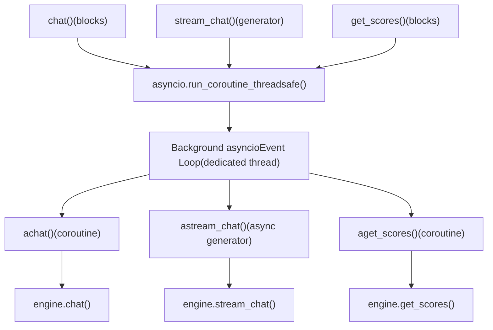
**Why Both APIs?**

-   **Sync API**: Easier to use in scripts and notebooks
-   **Async API**: Better for concurrent requests in servers (e.g., FastAPI)

**Sources:** [src/llamafactory/chat/chat\_model.py34-89](https://github.com/hiyouga/LlamaFactory/blob/355d5c5e/src/llamafactory/chat/chat_model.py#L34-L89)

---

## Generation Parameters

Generation behavior is controlled by `GeneratingArguments` and can be overridden per-request via `**input_kwargs`:

### Parameter Configuration

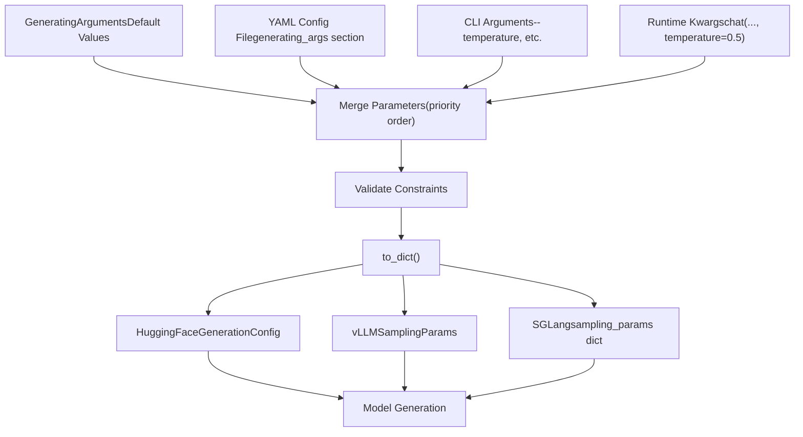
### Key Parameters

| Parameter | Type | Default | Description |
| --- | --- | --- | --- |
| `do_sample` | bool | `True` | Enable sampling (vs. greedy) |
| `temperature` | float | `0.95` | Sampling temperature (0=greedy, >1=more random) |
| `top_p` | float | `0.7` | Nucleus sampling threshold |
| `top_k` | int | `50` | Top-k sampling cutoff |
| `max_length` | int | `1024` | Max total tokens (prompt + generation) |
| `max_new_tokens` | int | `1024` | Max generated tokens (overrides max\_length) |
| `repetition_penalty` | float | `1.0` | Penalty for repeating tokens (1.0=none) |
| `length_penalty` | float | `1.0` | Exponential penalty for length (beam search) |
| `num_beams` | int | `1` | Beam search width (1=no beam search) |
| `skip_special_tokens` | bool | `True` | Remove special tokens from output |
| `stop` | str/list | `None` | Custom stop sequences |

### Parameter Overriding

```
# Default parameters from initializationchat_model = ChatModel({    "model_name_or_path": "meta-llama/Llama-2-7b-hf",    "temperature": 0.95,    "max_new_tokens": 1024,}) # Override at runtimeresponses = chat_model.chat(    messages=[{"role": "user", "content": "Hello"}],    temperature=0.1,      # Override: more deterministic    max_new_tokens=50,    # Override: shorter response    top_p=0.9,           # Override: different nucleus sampling)
```
**Sources:** [src/llamafactory/hparams/generating\_args.py21-84](https://github.com/hiyouga/LlamaFactory/blob/355d5c5e/src/llamafactory/hparams/generating_args.py#L21-L84) [src/llamafactory/chat/hf\_engine.py121-174](https://github.com/hiyouga/LlamaFactory/blob/355d5c5e/src/llamafactory/chat/hf_engine.py#L121-L174)

---

## Message Format and Multimodal Inputs

### Message Structure

Messages follow the OpenAI chat format:

```
messages = [    {"role": "system", "content": "You are a helpful assistant."},  # Optional    {"role": "user", "content": "What's in this image? <image>"},    {"role": "assistant", "content": "I see a cat."},    {"role": "user", "content": "What breed?"},]
```
**Roles:**

-   `system`: Sets the assistant's behavior (can also use `system` parameter)
-   `user`: User messages
-   `assistant`: Assistant responses (for multi-turn)

### Multimodal Input Handling

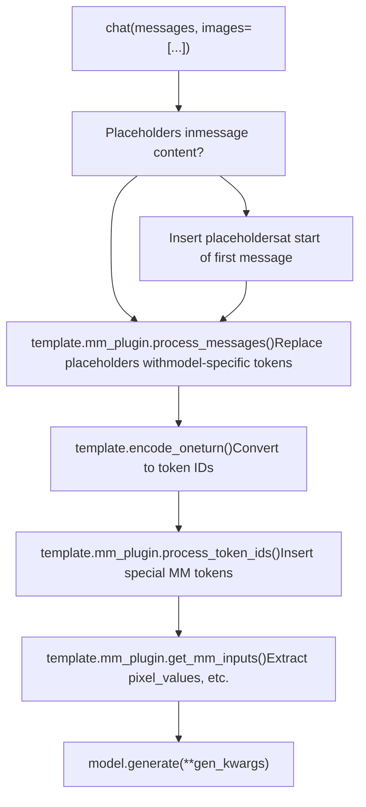
**Placeholder Tokens:**

-   `<image>`: Image placeholder
-   `<video>`: Video placeholder
-   `<audio>`: Audio placeholder

**Input Types:**

```
# Image inputs (file paths or PIL Images)images = [    "/path/to/image.jpg",    "https://example.com/image.png",    PIL.Image.open("image.jpg")] # Video inputs (file paths)videos = ["/path/to/video.mp4"] # Audio inputs (file paths)audios = ["/path/to/audio.wav"]
```
**Automatic Placeholder Insertion:**

If multimodal inputs are provided but no placeholders exist in messages, the system automatically prepends them:

```
# Before (user input)messages = [{"role": "user", "content": "Describe this."}]images = ["image.jpg"] # After automatic insertionmessages = [{"role": "user", "content": "<image>Describe this."}]
```
**Sources:** [src/llamafactory/chat/hf\_engine.py86-117](https://github.com/hiyouga/LlamaFactory/blob/355d5c5e/src/llamafactory/chat/hf_engine.py#L86-L117) [src/llamafactory/chat/vllm\_engine.py122-133](https://github.com/hiyouga/LlamaFactory/blob/355d5c5e/src/llamafactory/chat/vllm_engine.py#L122-L133)

---

## CLI Chat Interface

The `run_chat()` function provides an interactive command-line chat interface.

### Usage

```
# Basic usagellamafactory-cli chat examples/inference/qwen3_lora_sft.yaml # Or with explicit parametersllamafactory-cli chat \    --model_name_or_path meta-llama/Llama-2-7b-hf \    --template llama2 \    --finetuning_type lora \    --adapter_name_or_path ./output
```
### Implementation

> **[Mermaid stateDiagram]**
> *(图表结构无法解析)*

**Special Commands:**

-   `exit`: Quit the application
-   `clear`: Clear conversation history and free GPU memory

**Example Session:**

```
Welcome to the CLI application, use `clear` to remove the history, use `exit` to exit the application.

User: Hello!
Assistant: Hi! How can I help you today?

User: What's 2+2?
Assistant: 2 + 2 equals 4.

User: clear
History has been removed.

User: exit
```
**Sources:** [src/llamafactory/chat/chat\_model.py173-211](https://github.com/hiyouga/LlamaFactory/blob/355d5c5e/src/llamafactory/chat/chat_model.py#L173-L211)

---

## OpenAI-Style API Server

LlamaFactory can launch an OpenAI-compatible API server for production deployment.

### Launching the Server

```
# Basic launchllamafactory-cli api examples/inference/qwen3_lora_sft.yaml # With custom configurationllamafactory-cli api \    --model_name_or_path meta-llama/Llama-2-7b-hf \    --template llama2 \    --infer_backend vllm \    --vllm_gpu_util 0.9
```
### API Endpoints

The server implements OpenAI-compatible endpoints:

| Endpoint | Method | Purpose |
| --- | --- | --- |
| `/v1/chat/completions` | POST | Chat completion (streaming/non-streaming) |
| `/v1/models` | GET | List available models |
| `/v1/completions` | POST | Text completion |
| `/health` | GET | Health check |

### Request Format

```
import requests # Non-streaming requestresponse = requests.post(    "http://localhost:8000/v1/chat/completions",    json={        "model": "llama-2-7b",        "messages": [            {"role": "user", "content": "Hello!"}        ],        "temperature": 0.7,        "max_tokens": 100,        "stream": False    }) # Streaming requestresponse = requests.post(    "http://localhost:8000/v1/chat/completions",    json={        "model": "llama-2-7b",        "messages": [{"role": "user", "content": "Count to 10"}],        "stream": True    },    stream=True) for line in response.iter_lines():    if line:        print(line.decode('utf-8'))
```
### Python Client Usage

```
from openai import OpenAI # Initialize clientclient = OpenAI(    base_url="http://localhost:8000/v1",    api_key="dummy"  # Not used but required by OpenAI SDK) # Non-streamingresponse = client.chat.completions.create(    model="llama-2-7b",    messages=[{"role": "user", "content": "Hello!"}],    temperature=0.7)print(response.choices[0].message.content) # Streamingstream = client.chat.completions.create(    model="llama-2-7b",    messages=[{"role": "user", "content": "Count to 10"}],    stream=True)for chunk in stream:    if chunk.choices[0].delta.content:        print(chunk.choices[0].delta.content, end="")
```
**Sources:** [examples/README.md213-217](https://github.com/hiyouga/LlamaFactory/blob/355d5c5e/examples/README.md?plain=1#L213-L217) [examples/README\_zh.md214-217](https://github.com/hiyouga/LlamaFactory/blob/355d5c5e/examples/README_zh.md?plain=1#L214-L217)

---

## Engine-Specific Features

### HuggingFaceEngine

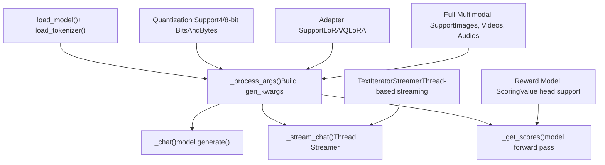
**Key Features:**

-   Full control over generation with `transformers.GenerationConfig`
-   Supports all model architectures in transformers
-   Can run reward models for scoring
-   Flexible multimodal processing

**Limitations:**

-   Slower than vLLM for batch inference
-   Higher memory usage per request
-   Limited throughput

**Sources:** [src/llamafactory/chat/hf\_engine.py44-413](https://github.com/hiyouga/LlamaFactory/blob/355d5c5e/src/llamafactory/chat/hf_engine.py#L44-L413)

### VllmEngine

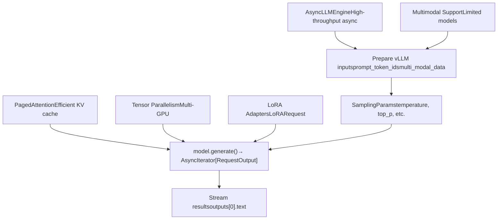
**Key Features:**

-   2-3x faster than HuggingFace for batch inference
-   PagedAttention reduces memory usage
-   Automatic tensor parallelism across GPUs
-   Efficient continuous batching

**Limitations:**

-   No reward model scoring support
-   Limited multimodal model support
-   Requires CUDA (no CPU fallback)

**Configuration:**

```
# vLLM-specific configurationchat_model = ChatModel({    "model_name_or_path": "meta-llama/Llama-2-7b-hf",    "infer_backend": "vllm",    "vllm_maxlen": 4096,           # Context length    "vllm_gpu_util": 0.9,          # GPU memory utilization    "vllm_enforce_eager": False,   # Use CUDA graphs    "vllm_max_lora_rank": 64,      # Max LoRA rank    "vllm_config": {               # Additional vLLM args        "enable_chunked_prefill": True,    }})
```
**Sources:** [src/llamafactory/chat/vllm\_engine.py46-272](https://github.com/hiyouga/LlamaFactory/blob/355d5c5e/src/llamafactory/chat/vllm_engine.py#L46-L272) [scripts/vllm\_infer.py47-279](https://github.com/hiyouga/LlamaFactory/blob/355d5c5e/scripts/vllm_infer.py#L47-L279)

### SGLangEngine

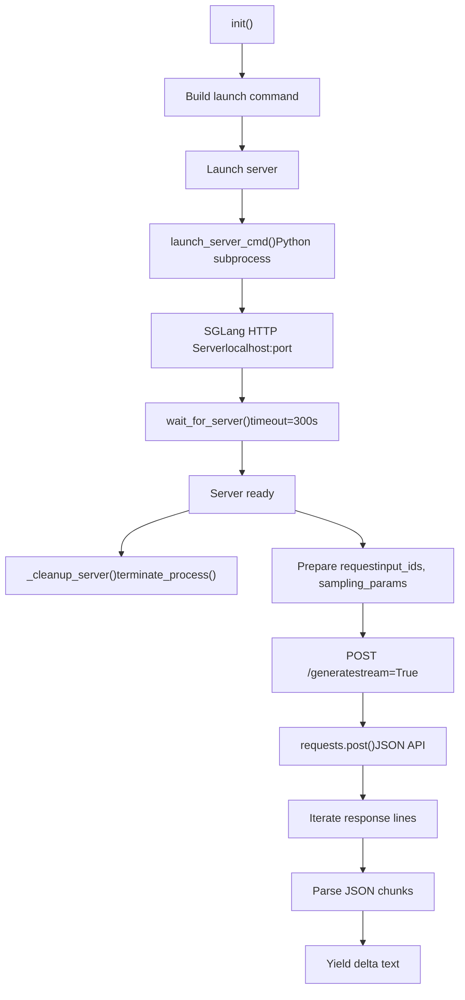
**Key Features:**

-   HTTP-based serving (better for production)
-   Advanced RadixAttention caching
-   LoRA support with `lora_backend` option
-   Automatic server process management

**Server Lifecycle:**

-   Server launched on first request
-   Registered with `atexit` for cleanup
-   Automatically terminated on exit

**Configuration:**

```
chat_model = ChatModel({    "model_name_or_path": "meta-llama/Llama-2-7b-hf",    "infer_backend": "sglang",    "sglang_maxlen": 4096,              # Context length    "sglang_mem_fraction": 0.9,         # Memory fraction    "sglang_tp_size": 1,                # Tensor parallelism    "sglang_lora_backend": "punica",    # LoRA backend})
```
**Sources:** [src/llamafactory/chat/sglang\_engine.py46-290](https://github.com/hiyouga/LlamaFactory/blob/355d5c5e/src/llamafactory/chat/sglang_engine.py#L46-L290)

---

## Concurrency Control

The `HuggingfaceEngine` uses a semaphore to control concurrent requests:

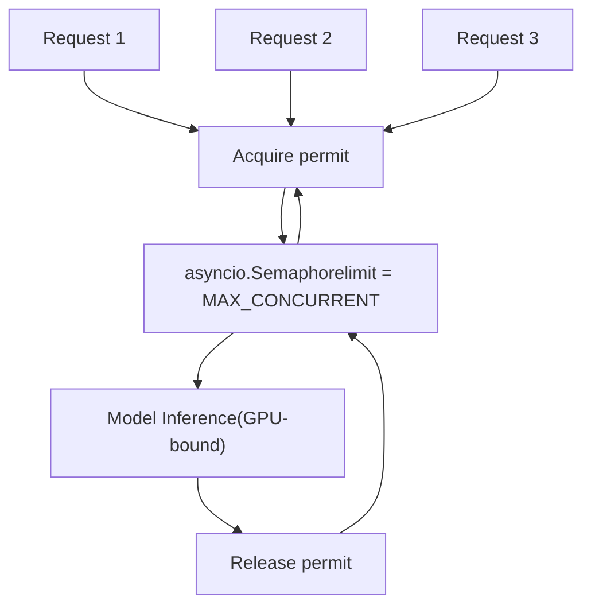
**Configuration:**

```
# Set maximum concurrent requestsexport MAX_CONCURRENT=4 # Default is 1 (sequential processing)
```
**When to Adjust:**

-   **GPU Memory Available**: Increase for better throughput
-   **Out of Memory Errors**: Decrease to reduce memory pressure
-   **vLLM/SGLang**: Use their built-in batching instead

**Sources:** [src/llamafactory/chat/hf\_engine.py70](https://github.com/hiyouga/LlamaFactory/blob/355d5c5e/src/llamafactory/chat/hf_engine.py#L70-L70)

---

## Usage Examples

### Basic Chat

```
from llamafactory.chat import ChatModel # Initialize modelchat_model = ChatModel({    "model_name_or_path": "meta-llama/Llama-2-7b-hf",    "template": "llama2",}) # Single-turn chatmessages = [{"role": "user", "content": "What is 2+2?"}]responses = chat_model.chat(messages)print(responses[0].response_text)  # "2 + 2 equals 4." # Multi-turn conversationmessages = [    {"role": "user", "content": "My name is Alice."},]responses = chat_model.chat(messages)messages.append({"role": "assistant", "content": responses[0].response_text}) messages.append({"role": "user", "content": "What's my name?"})responses = chat_model.chat(messages)print(responses[0].response_text)  # "Your name is Alice."
```
### Streaming Chat

```
messages = [{"role": "user", "content": "Count from 1 to 5."}] print("Assistant: ", end="", flush=True)for token in chat_model.stream_chat(messages):    print(token, end="", flush=True)print()  # Newline after completion
```
### Multimodal Chat

```
# Image understandingmessages = [{"role": "user", "content": "<image>What's in this image?"}]images = ["/path/to/image.jpg"]responses = chat_model.chat(messages, images=images) # Multiple imagesmessages = [{"role": "user", "content": "<image><image>Compare these images."}]images = ["image1.jpg", "image2.jpg"]responses = chat_model.chat(messages, images=images) # Video understandingmessages = [{"role": "user", "content": "<video>Describe this video."}]videos = ["/path/to/video.mp4"]responses = chat_model.chat(messages, videos=videos)
```
### Parameter Overriding

```
# Deterministic generationresponses = chat_model.chat(    messages,    temperature=0.0,  # Greedy decoding    do_sample=False,) # Creative generationresponses = chat_model.chat(    messages,    temperature=1.5,    # Higher randomness    top_p=0.95,        # Nucleus sampling    repetition_penalty=1.2,  # Penalize repetition) # Length controlresponses = chat_model.chat(    messages,    max_new_tokens=50,  # Short response)
```
### Reward Model Scoring

```
# Load reward modelchat_model = ChatModel({    "model_name_or_path": "weqweasdas/RM-Gemma-2B",    "template": "gemma",    "stage": "rm",  # Reward modeling stage}) # Score multiple responsescandidates = [    "This is a helpful and detailed answer.",    "This is a brief answer.",    "This response is off-topic.",]scores = chat_model.get_scores(candidates)print(scores)  # [2.45, 1.23, -0.89] (example) # Select best responsebest_idx = scores.index(max(scores))best_response = candidates[best_idx]
```
### vLLM Batch Inference Script

```
# Using vllm_infer.py for evaluation# See scripts/vllm_infer.py for full implementation python scripts/vllm_infer.py \    --model_name_or_path Qwen/Qwen2.5-7B-Instruct \    --template qwen \    --dataset alpaca_en_demo \    --batch_size 256 \    --max_new_tokens 512 \    --temperature 0.0 \    --save_name predictions.jsonl \    --matrix_save_name metrics.json
```
**Sources:** [src/llamafactory/chat/chat\_model.py91-211](https://github.com/hiyouga/LlamaFactory/blob/355d5c5e/src/llamafactory/chat/chat_model.py#L91-L211) [scripts/vllm\_infer.py47-283](https://github.com/hiyouga/LlamaFactory/blob/355d5c5e/scripts/vllm_infer.py#L47-L283)

---

## Error Handling

### Common Errors and Solutions

| Error | Cause | Solution |
| --- | --- | --- |
| `ValueError: The current model does not support chat` | Reward model used for generation | Load with `stage="sft"` or use `get_scores()` |
| `ImportError: vLLM not install` | vLLM backend selected but not installed | `pip install vllm` or use `infer_backend="huggingface"` |
| `RuntimeError: SGLang server initialization failed` | Server failed to start | Check GPU availability and logs |
| `ValueError: Cannot get scores using an auto-regressive model` | Tried scoring with generative model | Load reward model with `stage="rm"` |
| `CUDA out of memory` | Batch too large or context too long | Reduce `batch_size`, `max_length`, or use `vllm_gpu_util=0.8` |

### Validation Flow

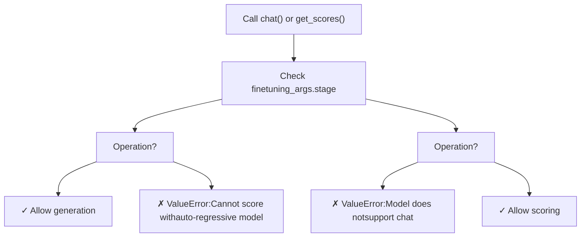
**Sources:** [src/llamafactory/chat/hf\_engine.py345-408](https://github.com/hiyouga/LlamaFactory/blob/355d5c5e/src/llamafactory/chat/hf_engine.py#L345-L408)

---

## Performance Considerations

### Engine Selection Guide

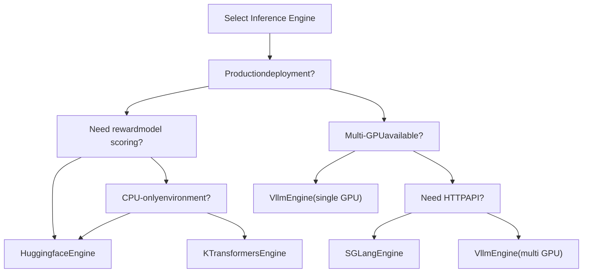
### Throughput Comparison

| Engine | Single Request | Batch (32) | Multi-GPU | Memory Efficiency |
| --- | --- | --- | --- | --- |
| HuggingFace | Baseline (1x) | 1x | Manual DDP | Baseline |
| vLLM | 0.9x | 2.5-3x | Automatic | 2x better (PagedAttention) |
| SGLang | 0.9x | 2.5-3x | Automatic | 2x better (RadixAttention) |
| KTransformers | 0.5x (CPU) | 0.5x | No | 3x better (CPU offload) |

**Optimization Tips:**

1.  **Use vLLM/SGLang for production**: 2-3x throughput improvement
2.  **Enable continuous batching**: Automatic in vLLM/SGLang
3.  **Tune `vllm_gpu_util`**: Balance between throughput and OOM risk
4.  **Use FlashAttention**: Enabled by default when available
5.  **Quantization**: 4/8-bit reduces memory, slight speed penalty

**Sources:** [src/llamafactory/chat/vllm\_engine.py46-54](https://github.com/hiyouga/LlamaFactory/blob/355d5c5e/src/llamafactory/chat/vllm_engine.py#L46-L54) [src/llamafactory/chat/sglang\_engine.py46-56](https://github.com/hiyouga/LlamaFactory/blob/355d5c5e/src/llamafactory/chat/sglang_engine.py#L46-L56)

---

## Summary

The LlamaFactory chat interface provides:

-   **Unified API**: `ChatModel` abstracts engine differences
-   **Multiple Backends**: HuggingFace, vLLM, SGLang, KTransformers
-   **Flexible APIs**: Sync/async, streaming/non-streaming, scoring
-   **Multimodal Support**: Images, videos, audios with automatic placeholder handling
-   **Production Ready**: OpenAI-compatible API server
-   **Easy to Use**: Simple CLI chat interface

**Key Classes:**

-   `ChatModel` [src/llamafactory/chat/chat\_model.py39](https://github.com/hiyouga/LlamaFactory/blob/355d5c5e/src/llamafactory/chat/chat_model.py#L39-L39)
-   `BaseEngine` [src/llamafactory/chat/base\_engine.py39](https://github.com/hiyouga/LlamaFactory/blob/355d5c5e/src/llamafactory/chat/base_engine.py#L39-L39)
-   `HuggingfaceEngine` [src/llamafactory/chat/hf\_engine.py44](https://github.com/hiyouga/LlamaFactory/blob/355d5c5e/src/llamafactory/chat/hf_engine.py#L44-L44)
-   `VllmEngine` [src/llamafactory/chat/vllm\_engine.py46](https://github.com/hiyouga/LlamaFactory/blob/355d5c5e/src/llamafactory/chat/vllm_engine.py#L46-L46)
-   `SGLangEngine` [src/llamafactory/chat/sglang\_engine.py46](https://github.com/hiyouga/LlamaFactory/blob/355d5c5e/src/llamafactory/chat/sglang_engine.py#L46-L46)
-   `Response` [src/llamafactory/chat/base\_engine.py31](https://github.com/hiyouga/LlamaFactory/blob/355d5c5e/src/llamafactory/chat/base_engine.py#L31-L31)
-   `GeneratingArguments` [src/llamafactory/hparams/generating\_args.py22](https://github.com/hiyouga/LlamaFactory/blob/355d5c5e/src/llamafactory/hparams/generating_args.py#L22-L22)
