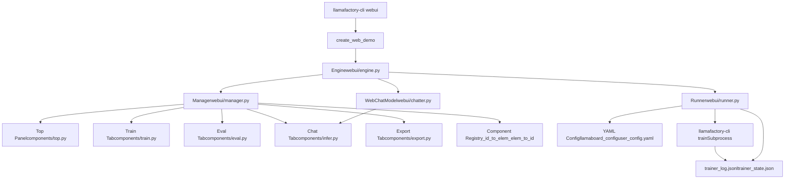
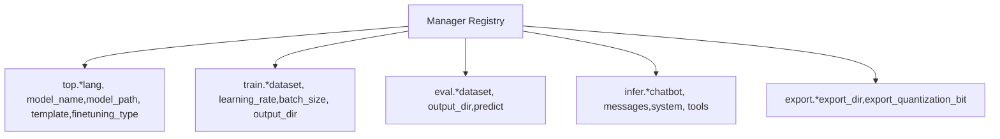
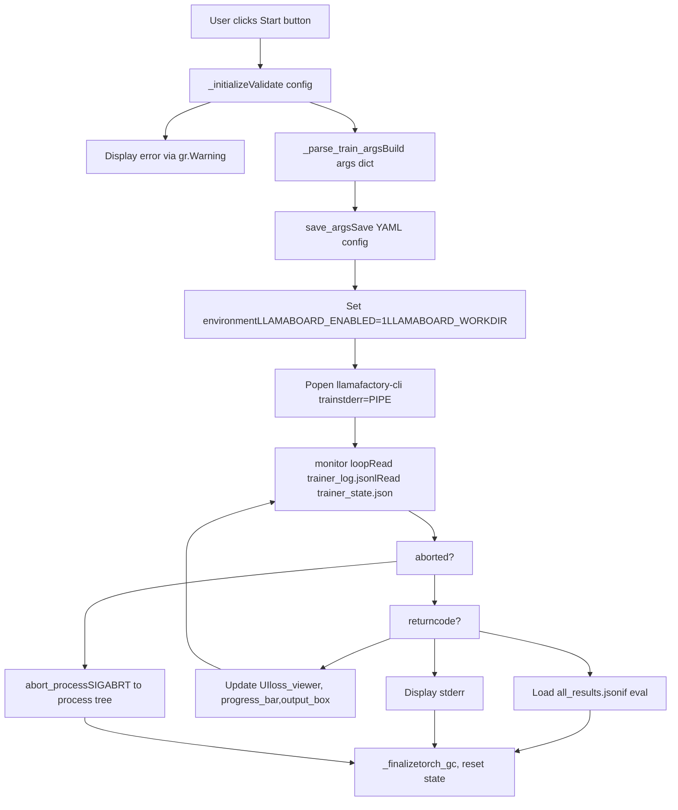
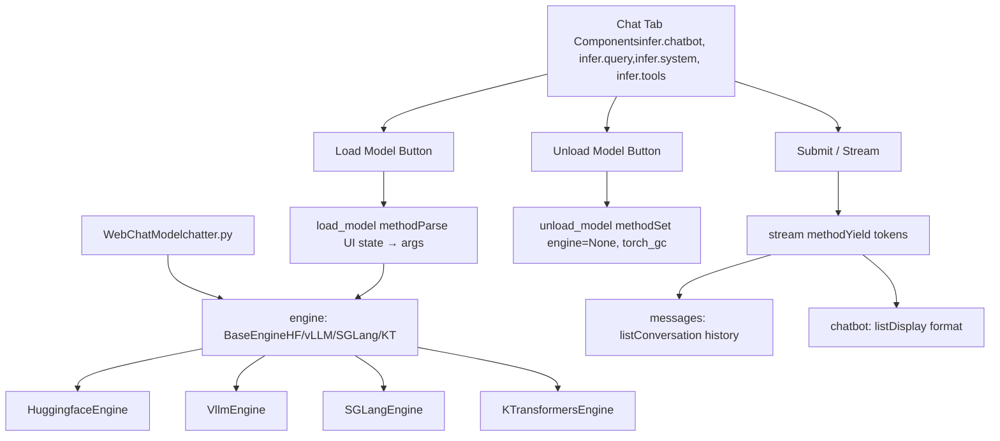
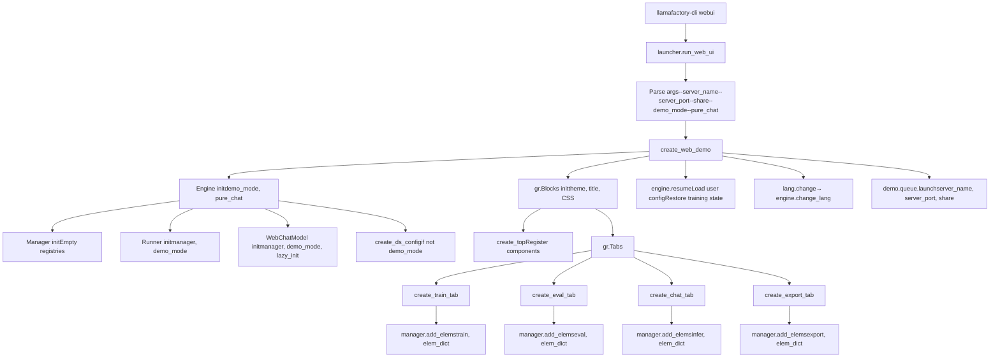

# Web UI (LLaMA Board)

Relevant source files

-   [examples/README.md](https://github.com/hiyouga/LlamaFactory/blob/355d5c5e/examples/README.md?plain=1)
-   [examples/README\_zh.md](https://github.com/hiyouga/LlamaFactory/blob/355d5c5e/examples/README_zh.md?plain=1)
-   [src/llamafactory/chat/base\_engine.py](https://github.com/hiyouga/LlamaFactory/blob/355d5c5e/src/llamafactory/chat/base_engine.py)
-   [src/llamafactory/chat/chat\_model.py](https://github.com/hiyouga/LlamaFactory/blob/355d5c5e/src/llamafactory/chat/chat_model.py)
-   [src/llamafactory/cli.py](https://github.com/hiyouga/LlamaFactory/blob/355d5c5e/src/llamafactory/cli.py)
-   [src/llamafactory/v1/launcher.py](https://github.com/hiyouga/LlamaFactory/blob/355d5c5e/src/llamafactory/v1/launcher.py)
-   [src/llamafactory/webui/chatter.py](https://github.com/hiyouga/LlamaFactory/blob/355d5c5e/src/llamafactory/webui/chatter.py)
-   [src/llamafactory/webui/common.py](https://github.com/hiyouga/LlamaFactory/blob/355d5c5e/src/llamafactory/webui/common.py)
-   [src/llamafactory/webui/components/export.py](https://github.com/hiyouga/LlamaFactory/blob/355d5c5e/src/llamafactory/webui/components/export.py)
-   [src/llamafactory/webui/components/top.py](https://github.com/hiyouga/LlamaFactory/blob/355d5c5e/src/llamafactory/webui/components/top.py)
-   [src/llamafactory/webui/components/train.py](https://github.com/hiyouga/LlamaFactory/blob/355d5c5e/src/llamafactory/webui/components/train.py)
-   [src/llamafactory/webui/engine.py](https://github.com/hiyouga/LlamaFactory/blob/355d5c5e/src/llamafactory/webui/engine.py)
-   [src/llamafactory/webui/locales.py](https://github.com/hiyouga/LlamaFactory/blob/355d5c5e/src/llamafactory/webui/locales.py)
-   [src/llamafactory/webui/manager.py](https://github.com/hiyouga/LlamaFactory/blob/355d5c5e/src/llamafactory/webui/manager.py)
-   [src/llamafactory/webui/runner.py](https://github.com/hiyouga/LlamaFactory/blob/355d5c5e/src/llamafactory/webui/runner.py)

## Purpose and Scope

The Web UI (LLaMA Board) provides a Gradio-based graphical interface for training, evaluating, chatting with, and exporting LLM models. It wraps the CLI functionality in an accessible browser interface, allowing users to configure training jobs, monitor progress, test models interactively, and export trained adapters without writing command-line arguments.

This page covers the Web UI architecture, component management, training orchestration, and chat interface. For underlying training mechanics, see [Training System](/hiyouga/LlamaFactory/6-training-system). For inference engine details, see [Inference Engines](/hiyouga/LlamaFactory/7.1-inference-engines). For command-line usage, see [CLI Commands and Usage](/hiyouga/LlamaFactory/2.2-cli-commands-and-usage).

---

## Architecture Overview

### System Components

The Web UI consists of four primary classes that coordinate to provide full functionality:

**High-Level Web UI Architecture**


**Sources:** [src/llamafactory/webui/engine.py1-84](https://github.com/hiyouga/LlamaFactory/blob/355d5c5e/src/llamafactory/webui/engine.py#L1-L84) [src/llamafactory/webui/manager.py1-71](https://github.com/hiyouga/LlamaFactory/blob/355d5c5e/src/llamafactory/webui/manager.py#L1-L71) [src/llamafactory/webui/runner.py1-506](https://github.com/hiyouga/LlamaFactory/blob/355d5c5e/src/llamafactory/webui/runner.py#L1-L506) [src/llamafactory/webui/chatter.py1-247](https://github.com/hiyouga/LlamaFactory/blob/355d5c5e/src/llamafactory/webui/chatter.py#L1-L247)

| Class | File | Purpose |
| --- | --- | --- |
| `Engine` | [webui/engine.py](https://github.com/hiyouga/LlamaFactory/blob/355d5c5e/webui/engine.py) | Central controller that instantiates Manager, Runner, and WebChatModel; coordinates initialization and language changes |
| `Manager` | [webui/manager.py](https://github.com/hiyouga/LlamaFactory/blob/355d5c5e/webui/manager.py) | Component registry maintaining bidirectional mappings between element IDs (e.g., `"top.model_name"`) and Gradio components |
| `Runner` | [webui/runner.py](https://github.com/hiyouga/LlamaFactory/blob/355d5c5e/webui/runner.py) | Training orchestrator that validates arguments, spawns `llamafactory-cli train` subprocesses, and monitors progress |
| `WebChatModel` | [webui/chatter.py](https://github.com/hiyouga/LlamaFactory/blob/355d5c5e/webui/chatter.py) | Inference manager that loads models on-demand and provides streaming chat interface |

---

## Component Management System

### Manager Registry

The `Manager` class maintains a centralized registry of all Gradio components, enabling other classes to access UI elements by hierarchical string IDs.

**Component ID Structure**


**Sources:** [src/llamafactory/webui/manager.py23-71](https://github.com/hiyouga/LlamaFactory/blob/355d5c5e/src/llamafactory/webui/manager.py#L23-L71)

The Manager provides four key methods:

| Method | Purpose | Example |
| --- | --- | --- |
| `add_elems(tab_name, elem_dict)` | Register components with namespaced IDs | `add_elems("train", {"dataset": gr.Dropdown(...)})` creates `"train.dataset"` |
| `get_elem_by_id(elem_id)` | Retrieve component by ID | `get_elem_by_id("top.model_name")` returns the model name dropdown |
| `get_id_by_elem(elem)` | Reverse lookup from component to ID | Used in Runner to build config dictionaries |
| `get_base_elems()` | Return commonly-used top panel elements | Returns set of `top.*` elements for reuse across tabs |

**Implementation Details:**

[src/llamafactory/webui/manager.py26-36](https://github.com/hiyouga/LlamaFactory/blob/355d5c5e/src/llamafactory/webui/manager.py#L26-L36) - The `add_elems` method constructs IDs by concatenating tab name and element name: `elem_id = f"{tab_name}.{elem_name}"`, then maintains bidirectional mappings in `_id_to_elem` and `_elem_to_id` dictionaries.

[src/llamafactory/webui/manager.py46-55](https://github.com/hiyouga/LlamaFactory/blob/355d5c5e/src/llamafactory/webui/manager.py#L46-L55) - Lookup methods provide O(1) access to components by ID or reverse lookup by component reference.

---

## Training Workflow

### Process Orchestration

The `Runner` class manages the complete training lifecycle: validation → argument building → subprocess spawning → log monitoring → completion handling.

**Training Execution Flow**


**Sources:** [src/llamafactory/webui/runner.py357-461](https://github.com/hiyouga/LlamaFactory/blob/355d5c5e/src/llamafactory/webui/runner.py#L357-L461)

### Argument Building

The Runner constructs training arguments by extracting values from Gradio components via the Manager:

**Argument Construction Pattern (Training)**

[src/llamafactory/webui/runner.py126-290](https://github.com/hiyouga/LlamaFactory/blob/355d5c5e/src/llamafactory/webui/runner.py#L126-L290) - The `_parse_train_args` method:

1.  **Extracts UI values** using `get = lambda elem_id: data[self.manager.get_elem_by_id(elem_id)]`
2.  **Builds base args dict** with stage, model path, dataset, hyperparameters
3.  **Conditionally adds configs** based on finetuning type:
    -   **LoRA configs** [lines 202-218](https://github.com/hiyouga/LlamaFactory/blob/355d5c5e/lines 202-218): `lora_rank`, `lora_alpha`, `lora_dropout`, `lora_target`
    -   **Freeze configs** [lines 196-200](https://github.com/hiyouga/LlamaFactory/blob/355d5c5e/lines 196-200): `freeze_trainable_layers`, `freeze_trainable_modules`
    -   **RLHF configs** [lines 219-236](https://github.com/hiyouga/LlamaFactory/blob/355d5c5e/lines 219-236): reward model path for PPO, `pref_beta` for DPO/KTO
    -   **Multimodal configs** [lines 238-246](https://github.com/hiyouga/LlamaFactory/blob/355d5c5e/lines 238-246): vision tower freezing, image/video pixel ranges
    -   **Optimizer configs** [lines 248-267](https://github.com/hiyouga/LlamaFactory/blob/355d5c5e/lines 248-267): GaLore, APOLLO, BAdam parameters
4.  **Merges extra\_args** JSON [line 179](https://github.com/hiyouga/LlamaFactory/blob/355d5c5e/line 179)
5.  **Adds DeepSpeed config path** if enabled [lines 284-288](https://github.com/hiyouga/LlamaFactory/blob/355d5c5e/lines 284-288)

### Subprocess Management

**Subprocess Lifecycle**

[src/llamafactory/webui/runner.py376-379](https://github.com/hiyouga/LlamaFactory/blob/355d5c5e/src/llamafactory/webui/runner.py#L376-L379) - Training launches via:

```
self.trainer = Popen(    ["llamafactory-cli", "train", save_cmd(args)],    env=env,    stderr=PIPE,    text=True)
```
The subprocess runs with special environment variables:

-   `LLAMABOARD_ENABLED=1` - Signals training code to write logs to specific files
-   `LLAMABOARD_WORKDIR` - Specifies where to write `trainer_log.jsonl` and `trainer_state.json`
-   `FORCE_TORCHRUN=1` - If DeepSpeed is enabled, forces torchrun wrapper

**Log Monitoring Pattern**

[src/llamafactory/webui/runner.py404-460](https://github.com/hiyouga/LlamaFactory/blob/355d5c5e/src/llamafactory/webui/runner.py#L404-L460) - The `monitor` method:

1.  **Polls subprocess** with 2-second timeout [lines 441-445](https://github.com/hiyouga/LlamaFactory/blob/355d5c5e/lines 441-445)
2.  **Reads logs via control.get\_trainer\_info()** [line 428](https://github.com/hiyouga/LlamaFactory/blob/355d5c5e/line 428) which parses:
    -   `trainer_log.jsonl` for loss values and log messages
    -   `trainer_state.json` for progress (current epoch, global step)
    -   Memory usage from system metrics
3.  **Updates UI components**:
    -   `output_box` - Running log text [line 430](https://github.com/hiyouga/LlamaFactory/blob/355d5c5e/line 430)
    -   `progress_bar` - Training progress percentage [line 431](https://github.com/hiyouga/LlamaFactory/blob/355d5c5e/line 431)
    -   `loss_viewer` - Loss curve plot [line 434](https://github.com/hiyouga/LlamaFactory/blob/355d5c5e/line 434)
    -   `swanlab_link` - External monitoring link if SwanLab enabled [line 437](https://github.com/hiyouga/LlamaFactory/blob/355d5c5e/line 437)
4.  **Yields updates** to Gradio for streaming display [line 439](https://github.com/hiyouga/LlamaFactory/blob/355d5c5e/line 439)

### Abort Handling

[src/llamafactory/webui/runner.py69-72](https://github.com/hiyouga/LlamaFactory/blob/355d5c5e/src/llamafactory/webui/runner.py#L69-L72) - The `set_abort` method sets `self.aborted = True` and calls `abort_process(self.trainer.pid)`.

[src/llamafactory/webui/common.py46-56](https://github.com/hiyouga/LlamaFactory/blob/355d5c5e/src/llamafactory/webui/common.py#L46-L56) - `abort_process` recursively kills child processes bottom-up using `SIGABRT`, ensuring distributed training jobs (torchrun with multiple processes) are fully terminated.

---

## Configuration Persistence

### YAML Configuration System

The Web UI supports saving and loading training configurations as YAML files, enabling reproducibility and sharing.

**Configuration Flow**

**Sources:** [src/llamafactory/webui/runner.py381-390](https://github.com/hiyouga/LlamaFactory/blob/355d5c5e/src/llamafactory/webui/runner.py#L381-L390) [src/llamafactory/webui/runner.py462-490](https://github.com/hiyouga/LlamaFactory/blob/355d5c5e/src/llamafactory/webui/runner.py#L462-L490) [src/llamafactory/webui/common.py154-167](https://github.com/hiyouga/LlamaFactory/blob/355d5c5e/src/llamafactory/webui/common.py#L154-L167)

**Save Operations:**

[src/llamafactory/webui/runner.py462-476](https://github.com/hiyouga/LlamaFactory/blob/355d5c5e/src/llamafactory/webui/runner.py#L462-L476) - `save_args` method:

-   Validates configuration first
-   Saves to `llamaboard_config/<config_path>.yaml` (user-specified name)
-   Skips `top.lang`, `top.model_path`, `train.output_dir`, `train.config_path` [line 384](https://github.com/hiyouga/LlamaFactory/blob/355d5c5e/line 384)

[src/llamafactory/webui/runner.py368-369](https://github.com/hiyouga/LlamaFactory/blob/355d5c5e/src/llamafactory/webui/runner.py#L368-L369) - During training launch, also saves config to output directory as `llamaboard_config.yaml` for auto-restore on resume.

**Load Operations:**

[src/llamafactory/webui/runner.py478-490](https://github.com/hiyouga/LlamaFactory/blob/355d5c5e/src/llamafactory/webui/runner.py#L478-L490) - `load_args` method:

-   Reads YAML from `llamaboard_config/` directory
-   Iterates over config dict and updates components via `manager.get_elem_by_id(elem_id)`
-   Returns dict mapping components to new values for Gradio update

[src/llamafactory/webui/runner.py492-505](https://github.com/hiyouga/LlamaFactory/blob/355d5c5e/src/llamafactory/webui/runner.py#L492-L505) - `check_output_dir` method auto-restores if resuming:

-   Checks if output directory exists
-   If found, loads `llamaboard_config.yaml` from that directory
-   Populates UI with previous training configuration

---

## Chat Interface

### WebChatModel Architecture

The `WebChatModel` class extends `ChatModel` [src/llamafactory/chat/chat\_model.py39-211](https://github.com/hiyouga/LlamaFactory/blob/355d5c5e/src/llamafactory/chat/chat_model.py#L39-L211) to provide Web UI-specific model loading and inference.

**Chat System Components**


**Sources:** [src/llamafactory/webui/chatter.py80-247](https://github.com/hiyouga/LlamaFactory/blob/355d5c5e/src/llamafactory/webui/chatter.py#L80-L247) [src/llamafactory/chat/chat\_model.py39-89](https://github.com/hiyouga/LlamaFactory/blob/355d5c5e/src/llamafactory/chat/chat_model.py#L39-L89)

### Model Loading Workflow

[src/llamafactory/webui/chatter.py101-159](https://github.com/hiyouga/LlamaFactory/blob/355d5c5e/src/llamafactory/webui/chatter.py#L101-L159) - The `load_model` method:

1.  **Validates state:**

    -   Checks if model already loaded [line 108](https://github.com/hiyouga/LlamaFactory/blob/355d5c5e/line 108)
    -   Validates required fields (model\_name, model\_path) [lines 110-113](https://github.com/hiyouga/LlamaFactory/blob/355d5c5e/lines 110-113)
    -   Blocks loading in demo mode [line 114-115](https://github.com/hiyouga/LlamaFactory/blob/355d5c5e/line 114-115)
    -   Validates extra\_args JSON [lines 117-120](https://github.com/hiyouga/LlamaFactory/blob/355d5c5e/lines 117-120)
2.  **Builds args dict** similar to training [lines 128-140](https://github.com/hiyouga/LlamaFactory/blob/355d5c5e/lines 128-140):

    -   Model path and cache directory
    -   Template, RoPE scaling, attention booster
    -   Inference backend (`infer_backend`) and dtype (`infer_dtype`)
    -   Merges extra\_args JSON
3.  **Handles checkpoints and quantization** [lines 143-156](https://github.com/hiyouga/LlamaFactory/blob/355d5c5e/lines 143-156):

    -   For PEFT methods: joins adapter paths with commas
    -   For full models: replaces base path with checkpoint path
    -   Adds quantization config if specified
4.  **Calls parent ChatModel.**init**** [line 158](https://github.com/hiyouga/LlamaFactory/blob/355d5c5e/line 158) which:

    -   Loads model via appropriate engine backend
    -   Initializes tokenizer and template
    -   Sets up async loop for streaming
5.  **Yields status messages** [lines 127, 159](https://github.com/hiyouga/LlamaFactory/blob/355d5c5e/lines 127, 159) to update UI during load


### Streaming Chat Implementation

[src/llamafactory/webui/chatter.py193-246](https://github.com/hiyouga/LlamaFactory/blob/355d5c5e/src/llamafactory/webui/chatter.py#L193-L246) - The `stream` method:

**Streaming Chat Flow**

> **[Mermaid sequence]**
> *(图表结构无法解析)*

**Sources:** [src/llamafactory/webui/chatter.py193-246](https://github.com/hiyouga/LlamaFactory/blob/355d5c5e/src/llamafactory/webui/chatter.py#L193-L246)

**Key features:**

-   **Thinking mode support** [line 215](https://github.com/hiyouga/LlamaFactory/blob/355d5c5e/line 215): Temporarily overrides `engine.template.enable_thinking` using context manager
-   **Tool call detection** [lines 231-239](https://github.com/hiyouga/LlamaFactory/blob/355d5c5e/lines 231-239): If tools provided, extracts function calls and formats as JSON
-   **Response formatting** [lines 46-69](https://github.com/hiyouga/LlamaFactory/blob/355d5c5e/lines 46-69): Handles thinking tokens (e.g., DeepSeek-R1) by wrapping in collapsible HTML details tags
-   **Message tracking** [lines 239, 242](https://github.com/hiyouga/LlamaFactory/blob/355d5c5e/lines 239, 242): Maintains both display format (chatbot) and API format (messages) lists

### Multimodal Support

[src/llamafactory/webui/chatter.py218-229](https://github.com/hiyouga/LlamaFactory/blob/355d5c5e/src/llamafactory/webui/chatter.py#L218-L229) - The `stream_chat` call passes media inputs:

-   `images=[image] if image else None`
-   `videos=[video] if video else None`
-   `audios=[audio] if audio else None`

The UI exposes image/video/audio upload components when multimodal models are detected [src/llamafactory/webui/components/infer.py](https://github.com/hiyouga/LlamaFactory/blob/355d5c5e/src/llamafactory/webui/components/infer.py)

---

## Evaluation Tab

The Evaluation tab provides a separate workflow for running model evaluation without full training.

**Evaluation Argument Building**

[src/llamafactory/webui/runner.py292-344](https://github.com/hiyouga/LlamaFactory/blob/355d5c5e/src/llamafactory/webui/runner.py#L292-L344) - The `_parse_eval_args` method:

-   Sets `stage="sft"` [line 299](https://github.com/hiyouga/LlamaFactory/blob/355d5c5e/line 299) regardless of training stage
-   Includes either `do_eval=True` or `do_predict=True` [lines 324-327](https://github.com/hiyouga/LlamaFactory/blob/355d5c5e/lines 324-327)
-   Uses `eval_dataset` instead of `dataset` [line 310](https://github.com/hiyouga/LlamaFactory/blob/355d5c5e/line 310)
-   Adds generation parameters: `max_new_tokens`, `top_p`, `temperature` [lines 316-318](https://github.com/hiyouga/LlamaFactory/blob/355d5c5e/lines 316-318)
-   Enables `predict_with_generate=True` [line 314](https://github.com/hiyouga/LlamaFactory/blob/355d5c5e/line 314) for text generation during evaluation

**Result Display**

[src/llamafactory/webui/runner.py452](https://github.com/hiyouga/LlamaFactory/blob/355d5c5e/src/llamafactory/webui/runner.py#L452-L452) - After evaluation completes, loads `all_results.json` via `load_eval_results` which formats metrics (BLEU, ROUGE, accuracy) as formatted JSON for display.

**Sources:** [src/llamafactory/webui/runner.py292-344](https://github.com/hiyouga/LlamaFactory/blob/355d5c5e/src/llamafactory/webui/runner.py#L292-L344) [src/llamafactory/webui/runner.py447-452](https://github.com/hiyouga/LlamaFactory/blob/355d5c5e/src/llamafactory/webui/runner.py#L447-L452) [src/llamafactory/webui/common.py212-217](https://github.com/hiyouga/LlamaFactory/blob/355d5c5e/src/llamafactory/webui/common.py#L212-L217)

---

## Export Tab

The Export tab handles LoRA adapter merging, model quantization, and hub upload.

**Export Workflow**

[src/llamafactory/webui/components/export.py47-115](https://github.com/hiyouga/LlamaFactory/blob/355d5c5e/src/llamafactory/webui/components/export.py#L47-L115) - The `save_model` function:

1.  **Validation** [lines 64-76](https://github.com/hiyouga/LlamaFactory/blob/355d5c5e/lines 64-76):

    -   Requires model path and export directory
    -   For GPTQ quantization: requires calibration dataset
    -   For non-quantized export: requires checkpoint path
    -   Blocks GPTQ + multi-adapter scenarios
2.  **Builds args** [lines 88-102](https://github.com/hiyouga/LlamaFactory/blob/355d5c5e/lines 88-102):

    -   `export_dir` - Output directory
    -   `export_size` - Maximum shard size in GB
    -   `export_quantization_bit` - Target bit width (2/3/4/8)
    -   `export_quantization_dataset` - Calibration data for GPTQ
    -   `export_device` - CPU or auto (GPU)
    -   `export_legacy_format` - Use old safetensors format
    -   `export_hub_model_id` - Optional HuggingFace Hub upload
3.  **Calls export\_model** [line 113](https://github.com/hiyouga/LlamaFactory/blob/355d5c5e/line 113) which:

    -   Loads base model and adapters
    -   Merges LoRA weights into base model (if applicable)
    -   Applies GPTQ quantization (if specified)
    -   Saves merged model to export directory
    -   Uploads to Hub (if model ID provided)

**Quantization Options**

[src/llamafactory/webui/components/export.py37-44](https://github.com/hiyouga/LlamaFactory/blob/355d5c5e/src/llamafactory/webui/components/export.py#L37-L44) - The `can_quantize` function disables quantization dropdown when multiple adapters are selected, since GPTQ quantization only works with single merged models.

**Sources:** [src/llamafactory/webui/components/export.py1-170](https://github.com/hiyouga/LlamaFactory/blob/355d5c5e/src/llamafactory/webui/components/export.py#L1-L170) [src/llamafactory/train/tuner.py](https://github.com/hiyouga/LlamaFactory/blob/355d5c5e/src/llamafactory/train/tuner.py) (export\_model implementation)

---

## UI Component Structure

### Top Panel (Shared Configuration)

The top panel appears across all tabs and contains model selection and shared configuration:

**Top Panel Components**

[src/llamafactory/webui/components/top.py33-82](https://github.com/hiyouga/LlamaFactory/blob/355d5c5e/src/llamafactory/webui/components/top.py#L33-L82):

| Component | ID | Type | Purpose |
| --- | --- | --- | --- |
| Language | `top.lang` | Dropdown | UI language (en/ru/zh/ko/ja) |
| Model Name | `top.model_name` | Dropdown | Predefined models + "Custom" |
| Model Path | `top.model_path` | Textbox | Path or HF identifier |
| Hub Name | `top.hub_name` | Dropdown | Download source (HF/ModelScope/OpenMind) |
| Finetuning Type | `top.finetuning_type` | Dropdown | lora/freeze/full |
| Checkpoint Path | `top.checkpoint_path` | Dropdown | Adapter paths (multiselect) |
| Quantization Bit | `top.quantization_bit` | Dropdown | none/8/4 |
| Quantization Method | `top.quantization_method` | Dropdown | bnb/hqq/eetq |
| Template | `top.template` | Dropdown | Chat template |
| RoPE Scaling | `top.rope_scaling` | Dropdown | Context length extension |
| Booster | `top.booster` | Dropdown | Attention optimization |

**Dynamic Updates:**

[src/llamafactory/webui/components/top.py53-68](https://github.com/hiyouga/LlamaFactory/blob/355d5c5e/src/llamafactory/webui/components/top.py#L53-L68) - Components trigger cascading updates:

-   `model_name` change → Updates `model_path`, `template`, `checkpoint_path` list
-   `finetuning_type` change → Enables/disables `quantization_bit`, updates `checkpoint_path` list
-   `hub_name` change → Switches download source, updates `model_path`

### Train Tab Layout

[src/llamafactory/webui/components/train.py37-447](https://github.com/hiyouga/LlamaFactory/blob/355d5c5e/src/llamafactory/webui/components/train.py#L37-L447) - The train tab organizes controls into sections:

**Main Configuration** [lines 41-85](https://github.com/hiyouga/LlamaFactory/blob/355d5c5e/lines 41-85):

-   Row 1: `training_stage`, `dataset_dir`, `dataset`, data preview
-   Row 2: `learning_rate`, `num_train_epochs`, `max_grad_norm`, `max_samples`, `compute_type`
-   Row 3: `cutoff_len`, `batch_size`, `gradient_accumulation_steps`, `val_size`, `lr_scheduler_type`

**Collapsible Accordions:**

-   **Extra configurations** [lines 87-150](https://github.com/hiyouga/LlamaFactory/blob/355d5c5e/lines 87-150): Logging, saving, warmup, NEFTune, packing, training flags
-   **Freeze tuning** [lines 152-166](https://github.com/hiyouga/LlamaFactory/blob/355d5c5e/lines 152-166): Trainable layers/modules configuration
-   **LoRA configurations** [lines 168-211](https://github.com/hiyouga/LlamaFactory/blob/355d5c5e/lines 168-211): Rank, alpha, dropout, target modules, RSLoRA, DoRA, PiSSA
-   **RLHF configurations** [lines 213-234](https://github.com/hiyouga/LlamaFactory/blob/355d5c5e/lines 213-234): Preference learning parameters, reward model selection
-   **Multimodal** [lines 236-270](https://github.com/hiyouga/LlamaFactory/blob/355d5c5e/lines 236-270): Vision tower freezing, pixel ranges
-   **GaLore** [lines 272-290](https://github.com/hiyouga/LlamaFactory/blob/355d5c5e/lines 272-290): Memory-efficient optimizer settings
-   **APOLLO** [lines 292-310](https://github.com/hiyouga/LlamaFactory/blob/355d5c5e/lines 292-310): Alternative memory optimizer
-   **BAdam** [lines 312-330](https://github.com/hiyouga/LlamaFactory/blob/355d5c5e/lines 312-330): Block Adam optimizer
-   **SwanLab** [lines 332-364](https://github.com/hiyouga/LlamaFactory/blob/355d5c5e/lines 332-364): External monitoring integration

**Control Buttons** [lines 366-393](https://github.com/hiyouga/LlamaFactory/blob/355d5c5e/lines 366-393):

-   `cmd_preview_btn` - Preview CLI command
-   `arg_save_btn` - Save config to YAML
-   `arg_load_btn` - Load config from YAML
-   `start_btn` - Launch training
-   `stop_btn` - Abort training

**Output Display** [lines 374-393](https://github.com/hiyouga/LlamaFactory/blob/355d5c5e/lines 374-393):

-   `output_box` - Training logs (Markdown)
-   `loss_viewer` - Real-time loss plot (Plotly)
-   `progress_bar` - Training progress slider
-   `swanlab_link` - External monitoring link

**Sources:** [src/llamafactory/webui/components/train.py1-448](https://github.com/hiyouga/LlamaFactory/blob/355d5c5e/src/llamafactory/webui/components/train.py#L1-L448)

---

## Internationalization

The Web UI supports five languages through the `LOCALES` dictionary.

**Locale System**

[src/llamafactory/webui/locales.py15-2000](https://github.com/hiyouga/LlamaFactory/blob/355d5c5e/src/llamafactory/webui/locales.py#L15-L2000) - Defines translations for all UI elements:

```
LOCALES = {    "title": {        "en": {"value": "<h1>...LLaMA Factory...</h1>"},        "zh": {"value": "<h1>...一站式大模型高效微调平台...</h1>"},        # ... other languages    },    "model_name": {        "en": {"label": "Model name", "info": "..."},        "zh": {"label": "模型名称", "info": "..."},        # ...    },    # ... hundreds more keys}
```
**Language Switching**

[src/llamafactory/webui/engine.py77-83](https://github.com/hiyouga/LlamaFactory/blob/355d5c5e/src/llamafactory/webui/engine.py#L77-L83) - The `change_lang` method:

1.  Iterates through all registered components
2.  Looks up corresponding locale key
3.  Returns dict mapping component → new properties (label, info, value)
4.  Gradio applies updates to render translated UI

---

## Launch and Initialization

### Application Startup

**Launch Sequence**


**Sources:** [src/llamafactory/launcher.py](https://github.com/hiyouga/LlamaFactory/blob/355d5c5e/src/llamafactory/launcher.py) [src/llamafactory/webui/interface.py](https://github.com/hiyouga/LlamaFactory/blob/355d5c5e/src/llamafactory/webui/interface.py) (not shown but implied), [src/llamafactory/webui/engine.py31-38](https://github.com/hiyouga/LlamaFactory/blob/355d5c5e/src/llamafactory/webui/engine.py#L31-L38)

### Resume Functionality

[src/llamafactory/webui/engine.py49-75](https://github.com/hiyouga/LlamaFactory/blob/355d5c5e/src/llamafactory/webui/engine.py#L49-L75) - The `resume` method restores state on page load:

1.  **Loads user config** [line 51](https://github.com/hiyouga/LlamaFactory/blob/355d5c5e/line 51):

    -   Language preference
    -   Hub name (HF/ModelScope/OpenMind)
    -   Last used model name
    -   Custom model paths
2.  **Sets initial values** [lines 52-66](https://github.com/hiyouga/LlamaFactory/blob/355d5c5e/lines 52-66):

    -   Populates language dropdown
    -   Sets hub name, model name from config
    -   Generates timestamp-based output directory names
    -   Hides multimodal box initially (shown only for vision models)
3.  **Restores running training** [lines 70-75](https://github.com/hiyouga/LlamaFactory/blob/355d5c5e/lines 70-75):

    -   If `runner.running == True`, repopulates all inputs from `runner.running_data`
    -   Checks `runner.do_train` to determine train vs. eval tab
    -   Sets `resume_btn` to trigger monitoring loop restart

This enables the Web UI to survive server restarts while training continues in background subprocesses.

---

## File-Based Process Monitoring

### Log File Format

Training subprocesses write structured logs that the Runner reads to update the UI.

**Training Log Files**

| File | Location | Format | Contents |
| --- | --- | --- | --- |
| `trainer_log.jsonl` | `{output_dir}/` | JSONL | Per-step logs: loss, learning\_rate, epoch, step |
| `trainer_state.json` | `{output_dir}/` | JSON | State snapshot: global\_step, epoch, max\_steps |
| `all_results.json` | `{output_dir}/` | JSON | Final evaluation metrics |

**Log Parsing**

[src/llamafactory/webui/control.py](https://github.com/hiyouga/LlamaFactory/blob/355d5c5e/src/llamafactory/webui/control.py) - The `get_trainer_info` function:

1.  **Reads trainer\_log.jsonl** line-by-line:

    -   Parses JSON logs
    -   Extracts loss values for plotting
    -   Accumulates log messages for display
    -   Tracks memory usage
2.  **Reads trainer\_state.json**:

    -   Calculates progress: `global_step / max_steps`
    -   Determines current epoch
3.  **Constructs return values**:

    -   `running_log` - Formatted text log
    -   `running_progress` - Progress bar value (0-100)
    -   `running_info` - Dict with `loss_viewer` plot and optional `swanlab_link`

This file-based approach allows the Web UI process to monitor training without IPC mechanisms, surviving restarts.

**Sources:** [src/llamafactory/webui/control.py](https://github.com/hiyouga/LlamaFactory/blob/355d5c5e/src/llamafactory/webui/control.py) [src/llamafactory/webui/runner.py404-460](https://github.com/hiyouga/LlamaFactory/blob/355d5c5e/src/llamafactory/webui/runner.py#L404-L460)

---

## Demo Mode and Pure Chat Mode

The Web UI supports two restricted modes:

### Demo Mode

[src/llamafactory/webui/engine.py31](https://github.com/hiyouga/LlamaFactory/blob/355d5c5e/src/llamafactory/webui/engine.py#L31-L31) - Enabled via `--demo_mode` flag:

-   **Prevents destructive operations**: Blocks training, model loading, export [src/llamafactory/webui/runner.py92-93](https://github.com/hiyouga/LlamaFactory/blob/355d5c5e/src/llamafactory/webui/runner.py#L92-L93) [src/llamafactory/webui/chatter.py114-115](https://github.com/hiyouga/LlamaFactory/blob/355d5c5e/src/llamafactory/webui/chatter.py#L114-L115)
-   **Pre-loads demo model**: If `DEMO_MODEL` and `DEMO_TEMPLATE` environment variables set [src/llamafactory/webui/chatter.py89-95](https://github.com/hiyouga/LlamaFactory/blob/355d5c5e/src/llamafactory/webui/chatter.py#L89-L95)
-   **Useful for public demos**: Allows UI exploration without allowing resource-intensive operations

### Pure Chat Mode

[src/llamafactory/webui/engine.py31](https://github.com/hiyouga/LlamaFactory/blob/355d5c5e/src/llamafactory/webui/engine.py#L31-L31) - Enabled via `--pure_chat` flag:

-   **Hides training/eval/export tabs**: Only shows chat interface
-   **Eager model loading**: Sets `lazy_init=False` in WebChatModel [line 36](https://github.com/hiyouga/LlamaFactory/blob/355d5c5e/line 36) causing model to load from CLI args immediately
-   **Useful for inference-only deployment**: Lightweight interface for serving a single model

**Sources:** [src/llamafactory/webui/engine.py31-38](https://github.com/hiyouga/LlamaFactory/blob/355d5c5e/src/llamafactory/webui/engine.py#L31-L38) [src/llamafactory/webui/chatter.py81-95](https://github.com/hiyouga/LlamaFactory/blob/355d5c5e/src/llamafactory/webui/chatter.py#L81-L95)

---

## Key Design Patterns

### Centralized Component Registry

The Manager's bidirectional mapping enables type-safe component access without hardcoding references. Methods like `_parse_train_args` access UI values via string IDs (`"top.model_name"`), decoupling argument building from UI structure.

### Subprocess Isolation

Spawning `llamafactory-cli train` as a subprocess provides:

-   **Process isolation**: Training crash doesn't kill Web UI
-   **Distributed training support**: `torchrun` can spawn multiple workers
-   **Progress monitoring**: File-based logs enable real-time updates
-   **Abort capability**: Process tree termination via `abort_process`

### Gradio Generator Pattern

Many Runner methods (`preview_train`, `run_train`, `monitor`) are generators that yield dicts mapping components to updated values. This enables Gradio to stream updates to the UI incrementally, showing progress during long operations.

### Component Property Updates

Instead of directly modifying component values, methods return dicts like `{component: gr.Dropdown(value="new_value")}`. Gradio interprets these as component property updates, allowing changes to value, visibility, interactivity, etc.

---

## Summary Table: Key Classes

| Class | File | Lines | Key Responsibilities |
| --- | --- | --- | --- |
| `Engine` | engine.py | 28-84 | Instantiates Manager/Runner/Chatter; coordinates initialization and language changes |
| `Manager` | manager.py | 23-71 | Maintains component registry with bidirectional ID↔element mapping |
| `Runner` | runner.py | 54-506 | Validates args, spawns training subprocess, monitors logs, handles abort |
| `WebChatModel` | chatter.py | 80-247 | Loads models on-demand, provides streaming chat with thinking mode support |
| `create_train_tab` | components/train.py | 37-447 | Constructs train tab UI with all hyperparameter controls |
| `create_eval_tab` | components/eval.py | \- | Constructs evaluation tab with prediction settings |
| `create_chat_tab` | components/infer.py | \- | Constructs chat tab with message history and media upload |
| `create_export_tab` | components/export.py | 118-169 | Constructs export tab with merge/quantization controls |
| `create_top` | components/top.py | 33-82 | Constructs shared top panel with model selection |

**Sources:** All files in [src/llamafactory/webui/](https://github.com/hiyouga/LlamaFactory/blob/355d5c5e/src/llamafactory/webui/)
