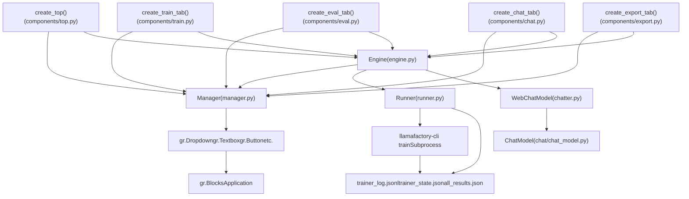
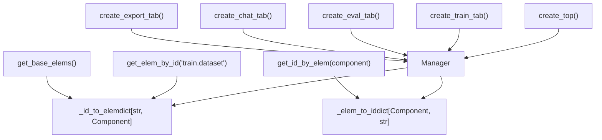
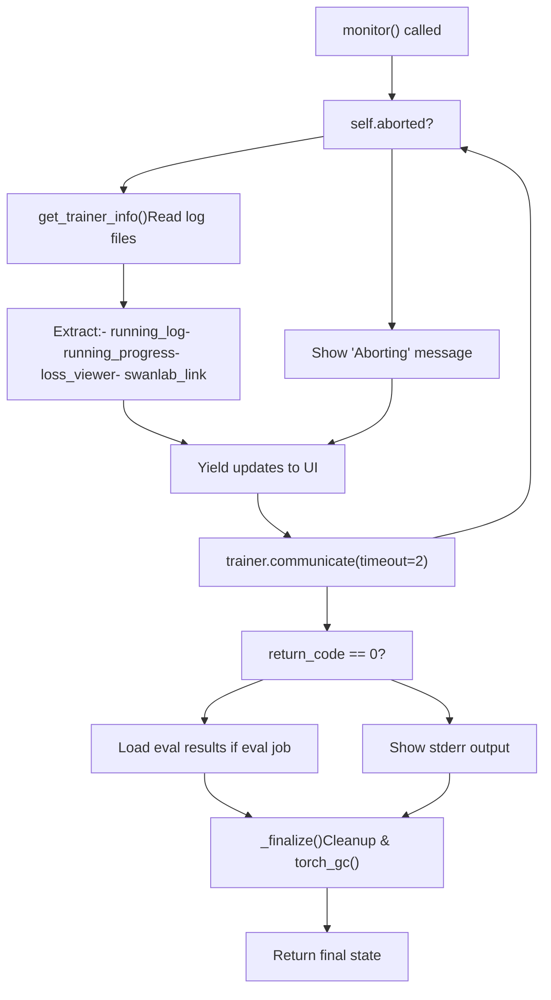
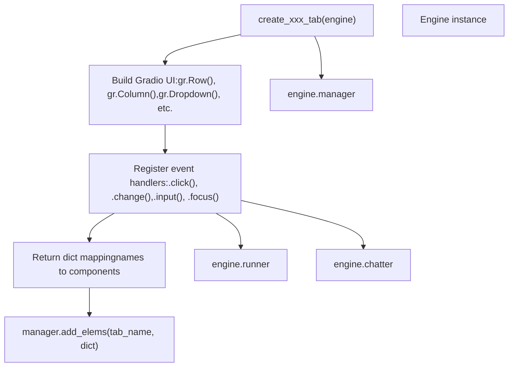
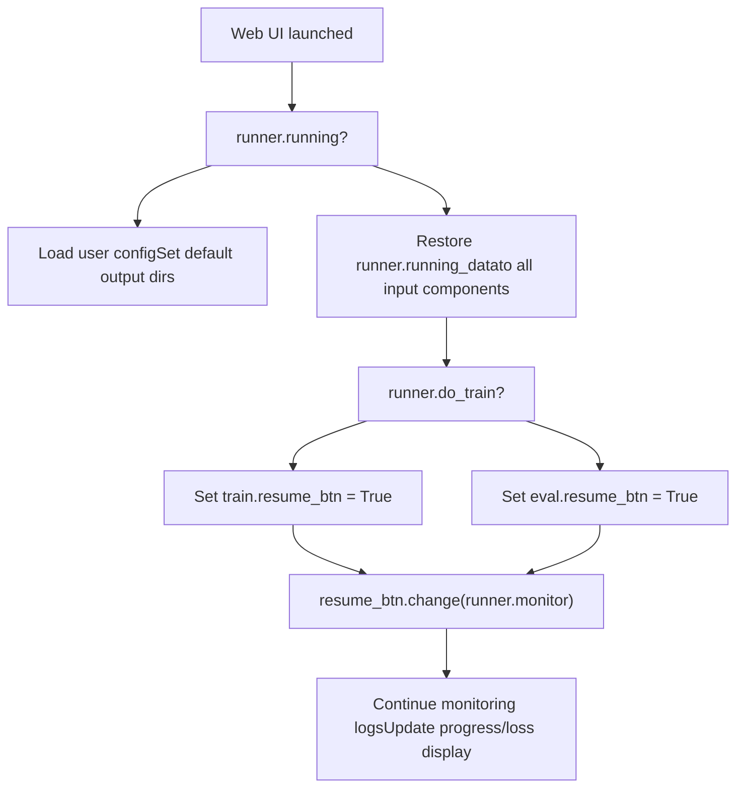

# Web UI Architecture

Relevant source files

-   [src/llamafactory/webui/chatter.py](https://github.com/hiyouga/LlamaFactory/blob/355d5c5e/src/llamafactory/webui/chatter.py)
-   [src/llamafactory/webui/common.py](https://github.com/hiyouga/LlamaFactory/blob/355d5c5e/src/llamafactory/webui/common.py)
-   [src/llamafactory/webui/components/export.py](https://github.com/hiyouga/LlamaFactory/blob/355d5c5e/src/llamafactory/webui/components/export.py)
-   [src/llamafactory/webui/components/top.py](https://github.com/hiyouga/LlamaFactory/blob/355d5c5e/src/llamafactory/webui/components/top.py)
-   [src/llamafactory/webui/components/train.py](https://github.com/hiyouga/LlamaFactory/blob/355d5c5e/src/llamafactory/webui/components/train.py)
-   [src/llamafactory/webui/engine.py](https://github.com/hiyouga/LlamaFactory/blob/355d5c5e/src/llamafactory/webui/engine.py)
-   [src/llamafactory/webui/locales.py](https://github.com/hiyouga/LlamaFactory/blob/355d5c5e/src/llamafactory/webui/locales.py)
-   [src/llamafactory/webui/manager.py](https://github.com/hiyouga/LlamaFactory/blob/355d5c5e/src/llamafactory/webui/manager.py)
-   [src/llamafactory/webui/runner.py](https://github.com/hiyouga/LlamaFactory/blob/355d5c5e/src/llamafactory/webui/runner.py)

The Web UI (LLaMA Board) provides a Gradio-based interface for training, evaluation, chat, and model export. This document explains the architecture of the web interface, including its core components, state management, process orchestration, and how UI components interact with the training/inference systems.

For information about using the Web UI for training workflows, see [Training via Web UI](/hiyouga/LlamaFactory/8.2-training-via-web-ui). For chat and evaluation usage, see [Chat and Evaluation via Web UI](/hiyouga/LlamaFactory/8.3-chat-and-evaluation-via-web-ui).

---

## Overview

The Web UI is built on four core classes that work together to provide a complete interface:


**Sources:** [src/llamafactory/webui/engine.py28-84](https://github.com/hiyouga/LlamaFactory/blob/355d5c5e/src/llamafactory/webui/engine.py#L28-L84) [src/llamafactory/webui/manager.py23-71](https://github.com/hiyouga/LlamaFactory/blob/355d5c5e/src/llamafactory/webui/manager.py#L23-L71) [src/llamafactory/webui/runner.py54-68](https://github.com/hiyouga/LlamaFactory/blob/355d5c5e/src/llamafactory/webui/runner.py#L54-L68) [src/llamafactory/webui/chatter.py80-96](https://github.com/hiyouga/LlamaFactory/blob/355d5c5e/src/llamafactory/webui/chatter.py#L80-L96)

---

## Engine: The Central Controller

The `Engine` class ([src/llamafactory/webui/engine.py28-84](https://github.com/hiyouga/LlamaFactory/blob/355d5c5e/src/llamafactory/webui/engine.py#L28-L84)) serves as the central controller that instantiates and coordinates all other components.

### Engine Structure

| Component | Type | Purpose |
| --- | --- | --- |
| `manager` | `Manager` | Maintains component registry and provides ID-based lookups |
| `runner` | `Runner` | Orchestrates training/evaluation subprocess execution |
| `chatter` | `WebChatModel` | Manages chat inference model loading and streaming |
| `demo_mode` | `bool` | Disables write operations and uses demo model if configured |
| `pure_chat` | `bool` | Enables chat-only mode without training tabs |

### Key Methods

**`resume()`** ([src/llamafactory/webui/engine.py49-76](https://github.com/hiyouga/LlamaFactory/blob/355d5c5e/src/llamafactory/webui/engine.py#L49-L76)): Initializes UI state on startup

-   Loads user configuration from `llamaboard_cache/user_config.yaml`
-   Sets language, hub selection, and last model used
-   Generates default output directories with timestamps
-   Restores training state if a job was interrupted

**`change_lang(lang: str)`** ([src/llamafactory/webui/engine.py77-83](https://github.com/hiyouga/LlamaFactory/blob/355d5c5e/src/llamafactory/webui/engine.py#L77-L83)): Updates all UI text

-   Iterates through all registered components
-   Applies localized strings from `LOCALES` dictionary
-   Returns dictionary mapping components to updated versions

**Sources:** [src/llamafactory/webui/engine.py28-84](https://github.com/hiyouga/LlamaFactory/blob/355d5c5e/src/llamafactory/webui/engine.py#L28-L84) [src/llamafactory/webui/common.py74-100](https://github.com/hiyouga/LlamaFactory/blob/355d5c5e/src/llamafactory/webui/common.py#L74-L100)

---

## Manager: Component Registry

The `Manager` class ([src/llamafactory/webui/manager.py23-71](https://github.com/hiyouga/LlamaFactory/blob/355d5c5e/src/llamafactory/webui/manager.py#L23-L71)) maintains bidirectional mappings between string IDs and Gradio components, enabling global state access.

### Component ID System

Components are registered with hierarchical IDs: `{tab_name}.{elem_name}`

**Examples:**

-   `top.model_name` - Model selection dropdown in top panel
-   `train.output_dir` - Output directory field in train tab
-   `infer.chatbot` - Chat history display in inference tab


### Core Methods

| Method | Purpose | Return Type |
| --- | --- | --- |
| `add_elems(tab_name, elem_dict)` | Register components from a tab | `None` |
| `get_elem_by_id(elem_id)` | Retrieve component by ID string | `Component` |
| `get_id_by_elem(elem)` | Get ID string for a component | `str` |
| `get_base_elems()` | Return commonly used top panel elements | `set[Component]` |
| `get_elem_list()` | All components as list | `list[Component]` |
| `get_elem_iter()` | Iterator over (name, component) pairs | `Generator` |

**Sources:** [src/llamafactory/webui/manager.py23-71](https://github.com/hiyouga/LlamaFactory/blob/355d5c5e/src/llamafactory/webui/manager.py#L23-L71) [src/llamafactory/webui/components/top.py33-83](https://github.com/hiyouga/LlamaFactory/blob/355d5c5e/src/llamafactory/webui/components/top.py#L33-L83) [src/llamafactory/webui/components/train.py37-447](https://github.com/hiyouga/LlamaFactory/blob/355d5c5e/src/llamafactory/webui/components/train.py#L37-L447)

---

## Runner: Training Process Orchestration

The `Runner` class ([src/llamafactory/webui/runner.py54-506](https://github.com/hiyouga/LlamaFactory/blob/355d5c5e/src/llamafactory/webui/runner.py#L54-L506)) manages the lifecycle of training and evaluation jobs by spawning subprocesses and monitoring their progress through log files.

### Runner State Machine

> **[Mermaid stateDiagram]**
> *(图表结构无法解析)*

### Key Components

**Subprocess Creation** ([src/llamafactory/webui/runner.py357-379](https://github.com/hiyouga/LlamaFactory/blob/355d5c5e/src/llamafactory/webui/runner.py#L357-L379)):

```
# Builds arguments from UI stateargs = self._parse_train_args(data) # Sets environment variablesenv["LLAMABOARD_ENABLED"] = "1"env["LLAMABOARD_WORKDIR"] = args["output_dir"]env["FORCE_TORCHRUN"] = "1"  # if DeepSpeed # Spawns subprocessself.trainer = Popen(    ["llamafactory-cli", "train", save_cmd(args)],    env=env,    stderr=PIPE,    text=True)
```
**Monitoring Loop** ([src/llamafactory/webui/runner.py404-460](https://github.com/hiyouga/LlamaFactory/blob/355d5c5e/src/llamafactory/webui/runner.py#L404-L460)):


### Argument Parsing

The `_parse_train_args()` method ([src/llamafactory/webui/runner.py126-290](https://github.com/hiyouga/LlamaFactory/blob/355d5c5e/src/llamafactory/webui/runner.py#L126-L290)) builds a complete argument dictionary from UI state:

**Base Configuration:**

-   Model path, template, finetuning type
-   Dataset directory and dataset list
-   Training hyperparameters (LR, epochs, batch size)
-   Compute type (fp16/bf16/fp32/pure\_bf16)

**Conditional Configuration:**

-   **Checkpoints**: Adapters (comma-separated list) or full model path
-   **Quantization**: Bit level, method, double quantization
-   **Freeze Tuning**: Trainable layers, modules, extra modules
-   **LoRA**: Rank, alpha, dropout, target modules, DoRA, PiSSA, etc.
-   **RLHF**: PPO reward model, DPO/KTO preference loss
-   **Multimodal**: Vision tower/projector/LM freeze, pixel sizes
-   **Optimizers**: GaLore, APOLLO, BAdam configurations
-   **DeepSpeed**: Stage, offload, config file path

**Sources:** [src/llamafactory/webui/runner.py54-506](https://github.com/hiyouga/LlamaFactory/blob/355d5c5e/src/llamafactory/webui/runner.py#L54-L506) [src/llamafactory/webui/control.py1-300](https://github.com/hiyouga/LlamaFactory/blob/355d5c5e/src/llamafactory/webui/control.py#L1-L300)

---

## WebChatModel: Inference Management

`WebChatModel` ([src/llamafactory/webui/chatter.py80-247](https://github.com/hiyouga/LlamaFactory/blob/355d5c5e/src/llamafactory/webui/chatter.py#L80-L247)) extends `ChatModel` to provide web-specific inference capabilities with lazy loading.

### Model Lifecycle

> **[Mermaid sequence]**
> *(图表结构无法解析)*

### Streaming with Thinking Mode

The `stream()` method ([src/llamafactory/webui/chatter.py193-246](https://github.com/hiyouga/LlamaFactory/blob/355d5c5e/src/llamafactory/webui/chatter.py#L193-L246)) handles special formatting for reasoning models:

**Standard Response:**

```
User query → stream_chat() → tokens → display as markdown
```
**Thinking Mode Response:**

```
final answer
↓
Formatted as:
<details><summary>Thinking Process</summary>
reasoning process
</details>
final answer
```
The `_format_response()` helper ([src/llamafactory/webui/chatter.py46-69](https://github.com/hiyouga/LlamaFactory/blob/355d5c5e/src/llamafactory/webui/chatter.py#L46-L69)) detects thinking tags and wraps them in expandable `<details>` elements.

**Sources:** [src/llamafactory/webui/chatter.py80-247](https://github.com/hiyouga/LlamaFactory/blob/355d5c5e/src/llamafactory/webui/chatter.py#L80-L247) [src/llamafactory/chat/chat\_model.py1-300](https://github.com/hiyouga/LlamaFactory/blob/355d5c5e/src/llamafactory/chat/chat_model.py#L1-L300)

---

## Component System

Each UI tab is created by a function that returns a dictionary mapping element names to Gradio components. These dictionaries are registered with the `Manager`.

### Component Creation Pattern


### Top Panel Components

The top panel ([src/llamafactory/webui/components/top.py33-83](https://github.com/hiyouga/LlamaFactory/blob/355d5c5e/src/llamafactory/webui/components/top.py#L33-L83)) contains globally shared settings:

| Component | ID | Purpose |
| --- | --- | --- |
| `lang` | `top.lang` | Language selection (en/ru/zh/ko/ja) |
| `model_name` | `top.model_name` | Model selection from 100+ supported models |
| `model_path` | `top.model_path` | Local path or HF identifier |
| `hub_name` | `top.hub_name` | Download source (HF/ModelScope/OpenMind) |
| `finetuning_type` | `top.finetuning_type` | Method (lora/freeze/full) |
| `checkpoint_path` | `top.checkpoint_path` | Adapter checkpoints to load |
| `quantization_bit` | `top.quantization_bit` | Quantization level (none/4/8) |
| `quantization_method` | `top.quantization_method` | Algorithm (bnb/hqq/eetq) |
| `template` | `top.template` | Chat template selection |
| `rope_scaling` | `top.rope_scaling` | RoPE interpolation method |
| `booster` | `top.booster` | Acceleration (flashattn2/unsloth/liger\_kernel) |

### Train Tab Components

The train tab ([src/llamafactory/webui/components/train.py37-447](https://github.com/hiyouga/LlamaFactory/blob/355d5c5e/src/llamafactory/webui/components/train.py#L37-L447)) provides extensive training configuration:

**Main Settings:**

-   `training_stage`: PT/SFT/RM/PPO/DPO/KTO/ORPO/SimPO
-   `dataset_dir`, `dataset`: Dataset location and selection
-   `learning_rate`, `num_train_epochs`, `batch_size`, etc.
-   `cutoff_len`: Maximum sequence length
-   `compute_type`: fp16/bf16/fp32/pure\_bf16

**Accordions (collapsed by default):**

-   `extra_tab`: Logging, saving, warmup, packing, NEFTune
-   `freeze_tab`: Freeze tuning parameters
-   `lora_tab`: LoRA rank, alpha, dropout, targets
-   `rlhf_tab`: PPO/DPO/KTO preference learning settings
-   `mm_tab`: Multimodal vision/projector/LM freeze settings
-   `galore_tab`, `apollo_tab`, `badam_tab`: Optimizer configs
-   `swanlab_tab`: SwanLab monitoring integration

**Control Elements:**

-   `cmd_preview_btn`: Preview command without execution
-   `arg_save_btn`, `arg_load_btn`: Save/load configurations to YAML
-   `start_btn`: Launch training
-   `stop_btn`: Abort training
-   `output_box`: Log display
-   `progress_bar`: Training progress
-   `loss_viewer`: Real-time loss plot

**Sources:** [src/llamafactory/webui/components/top.py33-83](https://github.com/hiyouga/LlamaFactory/blob/355d5c5e/src/llamafactory/webui/components/top.py#L33-L83) [src/llamafactory/webui/components/train.py37-447](https://github.com/hiyouga/LlamaFactory/blob/355d5c5e/src/llamafactory/webui/components/train.py#L37-L447)

---

## Process Management and Monitoring

### Configuration Persistence

Training configurations can be saved and loaded via YAML files stored in `llamaboard_config/`.

**Save Flow** ([src/llamafactory/webui/runner.py462-476](https://github.com/hiyouga/LlamaFactory/blob/355d5c5e/src/llamafactory/webui/runner.py#L462-L476)):

```
def save_args(self, data):    # Build config dict from UI state    config_dict = self._build_config_dict(data)        # Save to llamaboard_config/{config_path}    save_path = os.path.join(DEFAULT_CONFIG_DIR, config_path)    save_args(save_path, config_dict)
```
**Load Flow** ([src/llamafactory/webui/runner.py478-490](https://github.com/hiyouga/LlamaFactory/blob/355d5c5e/src/llamafactory/webui/runner.py#L478-L490)):

```
def load_args(self, lang: str, config_path: str):    config_dict = load_args(os.path.join(DEFAULT_CONFIG_DIR, config_path))        # Map config values back to components    output_dict = {}    for elem_id, value in config_dict.items():        output_dict[self.manager.get_elem_by_id(elem_id)] = value        return output_dict
```
### Training State Restoration

If training is interrupted (e.g., browser refresh), the `Engine.resume()` method ([src/llamafactory/webui/engine.py49-76](https://github.com/hiyouga/LlamaFactory/blob/355d5c5e/src/llamafactory/webui/engine.py#L49-L76)) restores state:


### Log File Monitoring

The `get_trainer_info()` function ([src/llamafactory/webui/control.py200-300](https://github.com/hiyouga/LlamaFactory/blob/355d5c5e/src/llamafactory/webui/control.py#L200-L300)) parses trainer output:

**Files Read:**

1.  `trainer_log.jsonl`: Line-by-line training logs
    -   Loss values, learning rate, epoch, step
    -   Parsed to generate loss plot
2.  `trainer_state.json`: Trainer internal state
    -   Total steps, epochs, global step
    -   Used to calculate progress percentage
3.  `all_results.json`: Evaluation results (eval jobs only)

**Return Values:**

-   `running_log`: Formatted log text
-   `running_progress`: Progress bar value (0-100)
-   `running_info`: Dictionary with optional keys:
    -   `loss_viewer`: Plotly figure of training loss
    -   `swanlab_link`: Markdown link to SwanLab dashboard

**Sources:** [src/llamafactory/webui/runner.py404-460](https://github.com/hiyouga/LlamaFactory/blob/355d5c5e/src/llamafactory/webui/runner.py#L404-L460) [src/llamafactory/webui/control.py200-300](https://github.com/hiyouga/LlamaFactory/blob/355d5c5e/src/llamafactory/webui/control.py#L200-L300) [src/llamafactory/webui/common.py154-226](https://github.com/hiyouga/LlamaFactory/blob/355d5c5e/src/llamafactory/webui/common.py#L154-L226)

---

## State Management

### User Configuration Persistence

User preferences are stored in `llamaboard_cache/user_config.yaml`:

```
lang: "en"hub_name: "huggingface"last_model: "LLaMA3-8B-Chat"path_dict:  LLaMA3-8B-Chat: "/path/to/model"  Qwen2-7B: "/path/to/qwen2"cache_dir: "/custom/cache/dir"
```
**Functions:**

-   `load_config()` ([src/llamafactory/webui/common.py74-80](https://github.com/hiyouga/LlamaFactory/blob/355d5c5e/src/llamafactory/webui/common.py#L74-L80)): Loads YAML or returns defaults
-   `save_config(lang, hub_name, model_name, model_path)` ([src/llamafactory/webui/common.py83-100](https://github.com/hiyouga/LlamaFactory/blob/355d5c5e/src/llamafactory/webui/common.py#L83-L100)): Updates and persists config

### Training Configuration Persistence

Training jobs save their configuration in the output directory:

**At Launch** ([src/llamafactory/webui/runner.py368-369](https://github.com/hiyouga/LlamaFactory/blob/355d5c5e/src/llamafactory/webui/runner.py#L368-L369)):

```
save_args(    os.path.join(args["output_dir"], LLAMABOARD_CONFIG),    self._build_config_dict(data))
```
This enables:

1.  **Reproducibility**: Exact UI state saved with checkpoint
2.  **Resume**: Loading previous job settings when browsing output dirs
3.  **Audit**: Track what parameters produced each checkpoint

### Directory Structure

```
llamaboard_cache/         # Temporary files
├── user_config.yaml      # User preferences
├── ds_z2_config.json     # DeepSpeed ZeRO-2 config
├── ds_z2_offload_config.json
├── ds_z3_config.json
└── ds_z3_offload_config.json

llamaboard_config/        # Saved configurations
├── experiment1.yaml
├── experiment2.yaml
└── ...

saves/                    # Model outputs
└── {model_name}/
    └── {finetuning_type}/
        └── {output_dir}/
            ├── llamaboard.yaml    # UI config snapshot
            ├── training_args.yaml # CLI args used
            ├── trainer_log.jsonl  # Training logs
            ├── trainer_state.json # Trainer state
            ├── checkpoint-100/
            ├── checkpoint-200/
            └── ...
```
**Sources:** [src/llamafactory/webui/common.py39-287](https://github.com/hiyouga/LlamaFactory/blob/355d5c5e/src/llamafactory/webui/common.py#L39-L287) [src/llamafactory/webui/runner.py368-369](https://github.com/hiyouga/LlamaFactory/blob/355d5c5e/src/llamafactory/webui/runner.py#L368-L369)

---

## Interaction Flows

### Training Job Lifecycle

> **[Mermaid sequence]**
> *(图表结构无法解析)*

### Chat Inference Flow

> **[Mermaid sequence]**
> *(图表结构无法解析)*

**Sources:** [src/llamafactory/webui/runner.py357-460](https://github.com/hiyouga/LlamaFactory/blob/355d5c5e/src/llamafactory/webui/runner.py#L357-L460) [src/llamafactory/webui/chatter.py101-246](https://github.com/hiyouga/LlamaFactory/blob/355d5c5e/src/llamafactory/webui/chatter.py#L101-L246)

---

## Demo Mode

Demo mode ([src/llamafactory/webui/engine.py31-38](https://github.com/hiyouga/LlamaFactory/blob/355d5c5e/src/llamafactory/webui/engine.py#L31-L38)) restricts certain operations for public deployments:

**Restrictions:**

-   Training/evaluation cannot be started
-   Model loading/unloading disabled
-   Configuration saving disabled

**Demo Model Loading:** If environment variables are set, a model is pre-loaded:

```
if demo_mode and os.getenv("DEMO_MODEL"):    model_name_or_path = os.getenv("DEMO_MODEL")    template = os.getenv("DEMO_TEMPLATE")    infer_backend = os.getenv("DEMO_BACKEND", "huggingface")    super().__init__(dict(        model_name_or_path=model_name_or_path,        template=template,        infer_backend=infer_backend    ))
```
**Sources:** [src/llamafactory/webui/engine.py31-38](https://github.com/hiyouga/LlamaFactory/blob/355d5c5e/src/llamafactory/webui/engine.py#L31-L38) [src/llamafactory/webui/chatter.py86-95](https://github.com/hiyouga/LlamaFactory/blob/355d5c5e/src/llamafactory/webui/chatter.py#L86-L95)

---

## Summary

The Web UI architecture is organized around four collaborating components:

| Component | File | Responsibility |
| --- | --- | --- |
| **Engine** | `engine.py` | Orchestrates all components, handles initialization and language changes |
| **Manager** | `manager.py` | Maintains component registry with bidirectional ID ↔ component mappings |
| **Runner** | `runner.py` | Spawns training subprocesses, monitors logs, manages lifecycle |
| **WebChatModel** | `chatter.py` | Extends ChatModel for web-based inference with lazy loading |

The system uses a **file-based monitoring** pattern where the Runner subprocess writes logs and state to JSON files, which the web UI continuously reads to display progress. This design enables robust monitoring even if the web server restarts.

Component modules (`top.py`, `train.py`, etc.) follow a consistent pattern: create Gradio UI elements, register event handlers, and return a dictionary that gets registered with the Manager for global access.

**Sources:** [src/llamafactory/webui/engine.py28-84](https://github.com/hiyouga/LlamaFactory/blob/355d5c5e/src/llamafactory/webui/engine.py#L28-L84) [src/llamafactory/webui/manager.py23-71](https://github.com/hiyouga/LlamaFactory/blob/355d5c5e/src/llamafactory/webui/manager.py#L23-L71) [src/llamafactory/webui/runner.py54-506](https://github.com/hiyouga/LlamaFactory/blob/355d5c5e/src/llamafactory/webui/runner.py#L54-L506) [src/llamafactory/webui/chatter.py80-247](https://github.com/hiyouga/LlamaFactory/blob/355d5c5e/src/llamafactory/webui/chatter.py#L80-L247)
