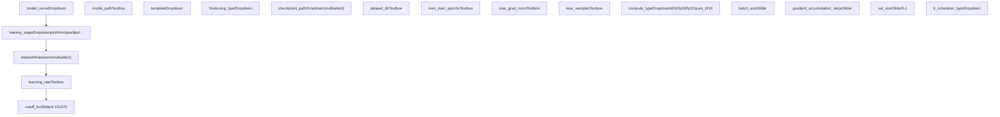
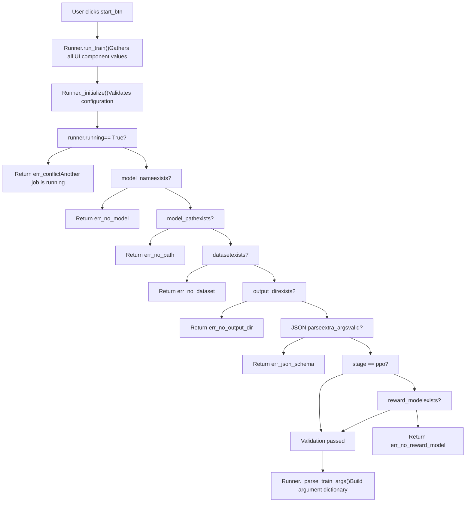
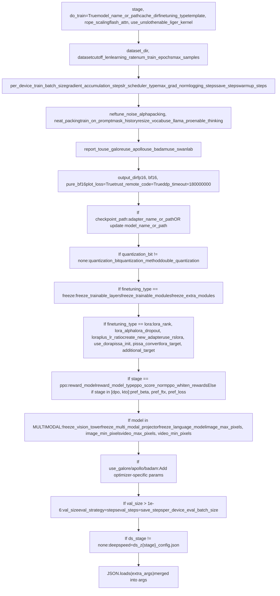
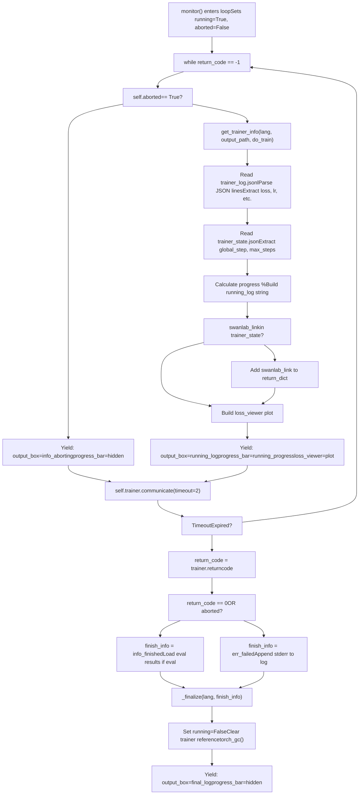
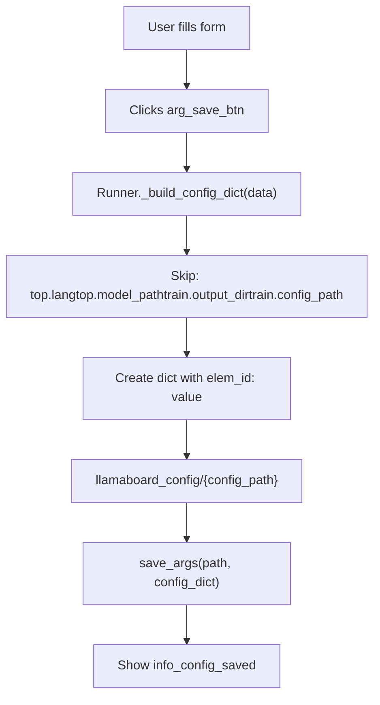
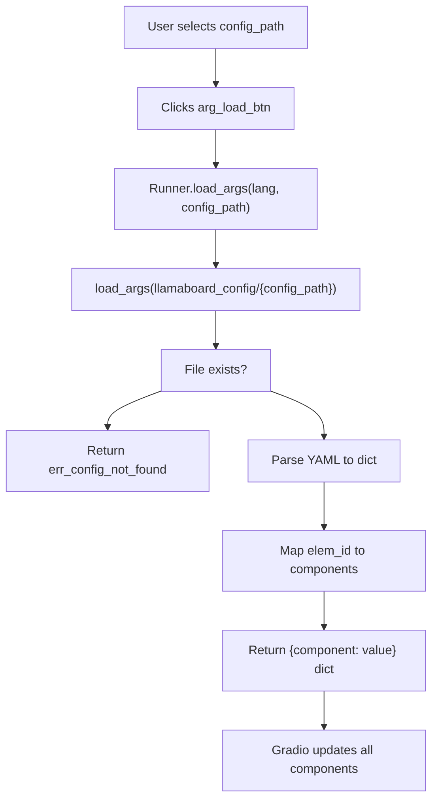
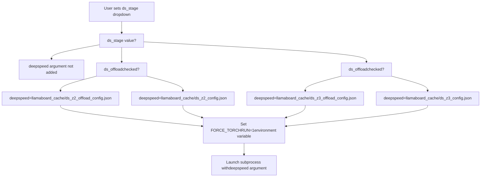

# Training via Web UI

Relevant source files

-   [src/llamafactory/webui/chatter.py](https://github.com/hiyouga/LlamaFactory/blob/355d5c5e/src/llamafactory/webui/chatter.py)
-   [src/llamafactory/webui/common.py](https://github.com/hiyouga/LlamaFactory/blob/355d5c5e/src/llamafactory/webui/common.py)
-   [src/llamafactory/webui/components/export.py](https://github.com/hiyouga/LlamaFactory/blob/355d5c5e/src/llamafactory/webui/components/export.py)
-   [src/llamafactory/webui/components/top.py](https://github.com/hiyouga/LlamaFactory/blob/355d5c5e/src/llamafactory/webui/components/top.py)
-   [src/llamafactory/webui/components/train.py](https://github.com/hiyouga/LlamaFactory/blob/355d5c5e/src/llamafactory/webui/components/train.py)
-   [src/llamafactory/webui/engine.py](https://github.com/hiyouga/LlamaFactory/blob/355d5c5e/src/llamafactory/webui/engine.py)
-   [src/llamafactory/webui/locales.py](https://github.com/hiyouga/LlamaFactory/blob/355d5c5e/src/llamafactory/webui/locales.py)
-   [src/llamafactory/webui/manager.py](https://github.com/hiyouga/LlamaFactory/blob/355d5c5e/src/llamafactory/webui/manager.py)
-   [src/llamafactory/webui/runner.py](https://github.com/hiyouga/LlamaFactory/blob/355d5c5e/src/llamafactory/webui/runner.py)

This document describes how to configure and execute training jobs through the LLaMA Board web interface. It covers the training tab UI components, parameter configuration, process management, and monitoring capabilities.

For information about the overall web UI architecture, see [Web UI Architecture](/hiyouga/LlamaFactory/8.1-web-ui-architecture). For chat and evaluation workflows, see [Chat and Evaluation via Web UI](/hiyouga/LlamaFactory/8.3-chat-and-evaluation-via-web-ui).

---

## Purpose and Scope

The training interface provides a graphical method to configure and launch fine-tuning jobs without writing command-line arguments or YAML files. The `Runner` class manages subprocess execution, monitors training progress through log files, and provides real-time feedback including loss curves and resource usage. The system supports all training stages (PT, SFT, RM, PPO, DPO, KTO, ORPO, SimPO) and fine-tuning methods (LoRA, full, freeze).

---

## Training Tab UI Components

The training tab is constructed in [src/llamafactory/webui/components/train.py](https://github.com/hiyouga/LlamaFactory/blob/355d5c5e/src/llamafactory/webui/components/train.py) using Gradio components organized into collapsible accordions. The `create_train_tab` function [src/llamafactory/webui/components/train.py37-447](https://github.com/hiyouga/LlamaFactory/blob/355d5c5e/src/llamafactory/webui/components/train.py#L37-L447) builds the complete interface.

### Main Configuration Panel


**Key Components:**

-   **training\_stage** [src/llamafactory/webui/components/train.py43](https://github.com/hiyouga/LlamaFactory/blob/355d5c5e/src/llamafactory/webui/components/train.py#L43-L43): Selects training objective (PT, SFT, RM, PPO, DPO, KTO, ORPO, SimPO)
-   **dataset\_dir** [src/llamafactory/webui/components/train.py44](https://github.com/hiyouga/LlamaFactory/blob/355d5c5e/src/llamafactory/webui/components/train.py#L44-L44): Path to `dataset_info.json` directory (default: `data`)
-   **dataset** [src/llamafactory/webui/components/train.py45](https://github.com/hiyouga/LlamaFactory/blob/355d5c5e/src/llamafactory/webui/components/train.py#L45-L45): Multiselect dropdown populated via `list_datasets()` function
-   **learning\_rate** [src/llamafactory/webui/components/train.py52](https://github.com/hiyouga/LlamaFactory/blob/355d5c5e/src/llamafactory/webui/components/train.py#L52-L52): Initial LR for AdamW (default: `5e-5`)
-   **num\_train\_epochs** [src/llamafactory/webui/components/train.py53](https://github.com/hiyouga/LlamaFactory/blob/355d5c5e/src/llamafactory/webui/components/train.py#L53-L53): Training epochs (default: `3.0`)
-   **cutoff\_len** [src/llamafactory/webui/components/train.py70](https://github.com/hiyouga/LlamaFactory/blob/355d5c5e/src/llamafactory/webui/components/train.py#L70-L70): Maximum sequence length after tokenization
-   **batch\_size** [src/llamafactory/webui/components/train.py71](https://github.com/hiyouga/LlamaFactory/blob/355d5c5e/src/llamafactory/webui/components/train.py#L71-L71): Per-device batch size
-   **gradient\_accumulation\_steps** [src/llamafactory/webui/components/train.py72](https://github.com/hiyouga/LlamaFactory/blob/355d5c5e/src/llamafactory/webui/components/train.py#L72-L72): Steps before optimizer update

**Sources:** [src/llamafactory/webui/components/train.py41-85](https://github.com/hiyouga/LlamaFactory/blob/355d5c5e/src/llamafactory/webui/components/train.py#L41-L85)

---

### Advanced Configuration Accordions

The UI includes six collapsible accordions for specialized settings:

#### 1\. Extra Configurations Accordion

```mermaid
flowchart TD
    ExtraTab["extra_tabAccordion"]
    LoggingSteps["logging_stepsSlider"]
    SaveSteps["save_stepsSlider"]
    WarmupSteps["warmup_stepsSlider"]
    NeftuneAlpha["neftune_alphaSlider"]
    ExtraArgs["extra_argsTextbox(JSON)"]
    Packing["packingCheckbox"]
    NeatPacking["neat_packingCheckbox"]
    TrainOnPrompt["train_on_promptCheckbox"]
    MaskHistory["mask_historyCheckbox"]
    ResizeVocab["resize_vocabCheckbox"]
    UseLlamaPro["use_llama_proCheckbox"]
    EnableThinking["enable_thinkingCheckbox"]
    ReportTo["report_toDropdown"]

    ExtraTab --> LoggingSteps
    ExtraTab --> SaveSteps
    ExtraTab --> WarmupSteps
    ExtraTab --> NeftuneAlpha
    ExtraTab --> ExtraArgs
    ExtraTab --> Packing
    ExtraTab --> NeatPacking
    ExtraTab --> TrainOnPrompt
    ExtraTab --> MaskHistory
    ExtraTab --> ResizeVocab
    ExtraTab --> UseLlamaPro
    ExtraTab --> EnableThinking
    ExtraTab --> ReportTo
```


**Key Parameters:**

-   **logging\_steps** [src/llamafactory/webui/components/train.py89](https://github.com/hiyouga/LlamaFactory/blob/355d5c5e/src/llamafactory/webui/components/train.py#L89-L89): Log interval (default: 5)
-   **save\_steps** [src/llamafactory/webui/components/train.py90](https://github.com/hiyouga/LlamaFactory/blob/355d5c5e/src/llamafactory/webui/components/train.py#L90-L90): Checkpoint interval (default: 100)
-   **extra\_args** [src/llamafactory/webui/components/train.py93](https://github.com/hiyouga/LlamaFactory/blob/355d5c5e/src/llamafactory/webui/components/train.py#L93-L93): JSON object for additional arguments (e.g., `{"optim": "adamw_torch"}`)
-   **packing** [src/llamafactory/webui/components/train.py97](https://github.com/hiyouga/LlamaFactory/blob/355d5c5e/src/llamafactory/webui/components/train.py#L97-L97): Enable sequence packing
-   **neat\_packing** [src/llamafactory/webui/components/train.py98](https://github.com/hiyouga/LlamaFactory/blob/355d5c5e/src/llamafactory/webui/components/train.py#L98-L98): Use block-diagonal attention masks to prevent cross-attention
-   **train\_on\_prompt** [src/llamafactory/webui/components/train.py101](https://github.com/hiyouga/LlamaFactory/blob/355d5c5e/src/llamafactory/webui/components/train.py#L101-L101): Disable label masking on prompts (SFT only)
-   **mask\_history** [src/llamafactory/webui/components/train.py102](https://github.com/hiyouga/LlamaFactory/blob/355d5c5e/src/llamafactory/webui/components/train.py#L102-L102): Train only on last turn of multi-turn conversations
-   **report\_to** [src/llamafactory/webui/components/train.py110-114](https://github.com/hiyouga/LlamaFactory/blob/355d5c5e/src/llamafactory/webui/components/train.py#L110-L114): External logging (none/wandb/tensorboard/mlflow/neptune)

**Sources:** [src/llamafactory/webui/components/train.py87-150](https://github.com/hiyouga/LlamaFactory/blob/355d5c5e/src/llamafactory/webui/components/train.py#L87-L150)

#### 2\. Freeze Tuning Configurations

For `finetuning_type="freeze"`, this accordion controls which layers/modules are trainable:

| Component | Type | Purpose | Default |
| --- | --- | --- | --- |
| `freeze_trainable_layers` | Slider (-128 to 128) | Number of trainable layers from last (+) or first (-) | 2 |
| `freeze_trainable_modules` | Textbox | Module names to train (comma-separated) | "all" |
| `freeze_extra_modules` | Textbox | Additional modules beyond hidden layers | "" |

**Sources:** [src/llamafactory/webui/components/train.py152-166](https://github.com/hiyouga/LlamaFactory/blob/355d5c5e/src/llamafactory/webui/components/train.py#L152-L166)

#### 3\. LoRA Configurations

For `finetuning_type="lora"`, this accordion exposes PEFT parameters:

| Component | Type | Range/Choices | Default |
| --- | --- | --- | --- |
| `lora_rank` | Slider | 1-1024 | 8 |
| `lora_alpha` | Slider | 1-2048 | 16 |
| `lora_dropout` | Slider | 0-1 | 0 |
| `loraplus_lr_ratio` | Slider | 0-64 | 0 |
| `create_new_adapter` | Checkbox | Initialize new adapter vs. resume | False |
| `use_rslora` | Checkbox | Rank-stabilized LoRA | False |
| `use_dora` | Checkbox | Weight-decomposed LoRA | False |
| `use_pissa` | Checkbox | Principal Singular values and Singular vectors Adaptation | False |
| `lora_target` | Textbox | Target modules (e.g., "q\_proj,v\_proj") | "" |
| `additional_target` | Textbox | Extra modules to add adapters | "" |

**Sources:** [src/llamafactory/webui/components/train.py168-211](https://github.com/hiyouga/LlamaFactory/blob/355d5c5e/src/llamafactory/webui/components/train.py#L168-L211)

#### 4\. RLHF Configurations

For preference learning stages (DPO, KTO, ORPO, SimPO) and PPO:

| Component | Type | Purpose | Default |
| --- | --- | --- | --- |
| `pref_beta` | Slider (0-1) | Beta parameter for preference loss | 0.1 |
| `pref_ftx` | Slider (0-10) | Supervised fine-tuning loss weight | 0 |
| `pref_loss` | Dropdown | Loss type (sigmoid/hinge/ipo/kto\_pair/orpo/simpo) | "sigmoid" |
| `reward_model` | Dropdown (multiselect) | Reward model checkpoint(s) for PPO | \[\] |
| `ppo_score_norm` | Checkbox | Normalize PPO scores | False |
| `ppo_whiten_rewards` | Checkbox | Whiten PPO rewards | False |

**Sources:** [src/llamafactory/webui/components/train.py213-234](https://github.com/hiyouga/LlamaFactory/blob/355d5c5e/src/llamafactory/webui/components/train.py#L213-L234)

#### 5\. Multimodal Configurations

For vision-language models in `MULTIMODAL_SUPPORTED_MODELS`:

```mermaid
flowchart TD
    MMTab["mm_tab Accordion"]
    FreezeVisionTower["freeze_vision_towerCheckbox(default=True)"]
    FreezeProjector["freeze_multi_modal_projectorCheckbox(default=True)"]
    FreezeLM["freeze_language_modelCheckbox(default=False)"]
    ImageMaxPixels["image_max_pixelsTextbox(768*768)"]
    ImageMinPixels["image_min_pixelsTextbox(32*32)"]
    VideoMaxPixels["video_max_pixelsTextbox(256*256)"]
    VideoMinPixels["video_min_pixelsTextbox(16*16)"]

    MMTab --> FreezeVisionTower
    MMTab --> FreezeProjector
    MMTab --> FreezeLM
    MMTab --> ImageMaxPixels
    MMTab --> ImageMinPixels
    MMTab --> VideoMaxPixels
    MMTab --> VideoMinPixels
```


The pixel values are parsed by `calculate_pixels()` [src/llamafactory/webui/common.py220-225](https://github.com/hiyouga/LlamaFactory/blob/355d5c5e/src/llamafactory/webui/common.py#L220-L225) which evaluates expressions like `"768*768"` to integers.

**Sources:** [src/llamafactory/webui/components/train.py236-270](https://github.com/hiyouga/LlamaFactory/blob/355d5c5e/src/llamafactory/webui/components/train.py#L236-L270)

#### 6\. Optimizer Accordions (GaLore, APOLLO, BAdam, SwanLab)

Three accordions for advanced optimizers [src/llamafactory/webui/components/train.py272-330](https://github.com/hiyouga/LlamaFactory/blob/355d5c5e/src/llamafactory/webui/components/train.py#L272-L330) and one for SwanLab monitoring [src/llamafactory/webui/components/train.py332-364](https://github.com/hiyouga/LlamaFactory/blob/355d5c5e/src/llamafactory/webui/components/train.py#L332-L364)

---

### Control Buttons and Output Panel

```mermaid
flowchart TD
    PreviewBtn["cmd_preview_btnPreview Command"]
    SaveBtn["arg_save_btnSave Config"]
    LoadBtn["arg_load_btnLoad Config"]
    StartBtn["start_btnStart Training(variant=primary)"]
    StopBtn["stop_btnStop Training(variant=stop)"]
    OutputDir["output_dirDropdown"]
    ConfigPath["config_pathDropdown"]
    DeviceCount["device_countTextbox(readonly)"]
    DSStage["ds_stageDropdown(none/2/3)"]
    DSOffload["ds_offloadCheckbox"]
    ProgressBar["progress_barSlider(readonly)"]
    OutputBox["output_boxMarkdown"]
    LossViewer["loss_viewerPlot"]

    PreviewBtn --> OutputBox
    StartBtn --> ProgressBar
    StartBtn --> OutputBox
    StartBtn --> LossViewer
    StopBtn --> OutputBox
```


**Key Components:**

-   **cmd\_preview\_btn** [src/llamafactory/webui/components/train.py367](https://github.com/hiyouga/LlamaFactory/blob/355d5c5e/src/llamafactory/webui/components/train.py#L367-L367): Generates CLI command via `gen_cmd()` without executing
-   **arg\_save\_btn** [src/llamafactory/webui/components/train.py368](https://github.com/hiyouga/LlamaFactory/blob/355d5c5e/src/llamafactory/webui/components/train.py#L368-L368): Saves current configuration to `llamaboard_config/{config_path}`
-   **arg\_load\_btn** [src/llamafactory/webui/components/train.py369](https://github.com/hiyouga/LlamaFactory/blob/355d5c5e/src/llamafactory/webui/components/train.py#L369-L369): Restores configuration from saved YAML
-   **start\_btn** [src/llamafactory/webui/components/train.py370](https://github.com/hiyouga/LlamaFactory/blob/355d5c5e/src/llamafactory/webui/components/train.py#L370-L370): Launches training subprocess
-   **stop\_btn** [src/llamafactory/webui/components/train.py371](https://github.com/hiyouga/LlamaFactory/blob/355d5c5e/src/llamafactory/webui/components/train.py#L371-L371): Aborts running training process
-   **output\_dir** [src/llamafactory/webui/components/train.py377](https://github.com/hiyouga/LlamaFactory/blob/355d5c5e/src/llamafactory/webui/components/train.py#L377-L377): Checkpoint save directory (auto-populated via `list_output_dirs()`)
-   **config\_path** [src/llamafactory/webui/components/train.py378](https://github.com/hiyouga/LlamaFactory/blob/355d5c5e/src/llamafactory/webui/components/train.py#L378-L378): YAML config filename
-   **ds\_stage** [src/llamafactory/webui/components/train.py382](https://github.com/hiyouga/LlamaFactory/blob/355d5c5e/src/llamafactory/webui/components/train.py#L382-L382): DeepSpeed ZeRO stage (none/2/3)
-   **ds\_offload** [src/llamafactory/webui/components/train.py383](https://github.com/hiyouga/LlamaFactory/blob/355d5c5e/src/llamafactory/webui/components/train.py#L383-L383): Enable CPU offloading
-   **progress\_bar** [src/llamafactory/webui/components/train.py387](https://github.com/hiyouga/LlamaFactory/blob/355d5c5e/src/llamafactory/webui/components/train.py#L387-L387): Training progress (0-100%)
-   **output\_box** [src/llamafactory/webui/components/train.py390](https://github.com/hiyouga/LlamaFactory/blob/355d5c5e/src/llamafactory/webui/components/train.py#L390-L390): Markdown-formatted logs and status
-   **loss\_viewer** [src/llamafactory/webui/components/train.py393](https://github.com/hiyouga/LlamaFactory/blob/355d5c5e/src/llamafactory/webui/components/train.py#L393-L393): Live training/validation loss plot

**Sources:** [src/llamafactory/webui/components/train.py366-414](https://github.com/hiyouga/LlamaFactory/blob/355d5c5e/src/llamafactory/webui/components/train.py#L366-L414)

---

## Training Execution Flow

The `Runner` class [src/llamafactory/webui/runner.py54-506](https://github.com/hiyouga/LlamaFactory/blob/355d5c5e/src/llamafactory/webui/runner.py#L54-L506) manages the complete training lifecycle.

### Initialization and Validation


**Validation Logic** [src/llamafactory/webui/runner.py74-114](https://github.com/hiyouga/LlamaFactory/blob/355d5c5e/src/llamafactory/webui/runner.py#L74-L114):

1.  Checks if another training job is running (`self.running` flag)
2.  Ensures model name and path are specified
3.  Verifies dataset is selected
4.  Validates output directory is specified
5.  Parses `extra_args` JSON for syntax errors
6.  For PPO stage, requires `reward_model` checkpoint

**Sources:** [src/llamafactory/webui/runner.py74-114](https://github.com/hiyouga/LlamaFactory/blob/355d5c5e/src/llamafactory/webui/runner.py#L74-L114) [src/llamafactory/webui/runner.py357-379](https://github.com/hiyouga/LlamaFactory/blob/355d5c5e/src/llamafactory/webui/runner.py#L357-L379)

### Argument Construction

The `_parse_train_args()` method [src/llamafactory/webui/runner.py126-290](https://github.com/hiyouga/LlamaFactory/blob/355d5c5e/src/llamafactory/webui/runner.py#L126-L290) builds a dictionary mapping CLI argument names to values:


**Key Logic Blocks:**

1.  **Checkpoint Handling** [src/llamafactory/webui/runner.py182-188](https://github.com/hiyouga/LlamaFactory/blob/355d5c5e/src/llamafactory/webui/runner.py#L182-L188): For PEFT methods, joins multiple adapter paths with commas. For full tuning, replaces `model_name_or_path`.

2.  **Quantization** [src/llamafactory/webui/runner.py191-194](https://github.com/hiyouga/LlamaFactory/blob/355d5c5e/src/llamafactory/webui/runner.py#L191-L194): Converts string to integer bit value, sets method, enables double quantization (except on NPU).

3.  **LoRA Configuration** [src/llamafactory/webui/runner.py203-217](https://github.com/hiyouga/LlamaFactory/blob/355d5c5e/src/llamafactory/webui/runner.py#L203-L217): Sets rank, alpha, dropout, LoRA+ ratio, RS-LoRA, DoRA, PiSSA flags, target modules. If `use_llama_pro=True`, also sets `freeze_trainable_layers`.

4.  **RLHF Stage-Specific** [src/llamafactory/webui/runner.py220-236](https://github.com/hiyouga/LlamaFactory/blob/355d5c5e/src/llamafactory/webui/runner.py#L220-L236):

    -   PPO: Resolves reward model paths, sets `reward_model_type`, configures score normalization/whitening, sets `top_k=0` and `top_p=0.9`
    -   DPO/KTO: Sets `pref_beta`, `pref_ftx`, `pref_loss`
5.  **DeepSpeed** [src/llamafactory/webui/runner.py285-288](https://github.com/hiyouga/LlamaFactory/blob/355d5c5e/src/llamafactory/webui/runner.py#L285-L288): If enabled, points to pre-generated config files in `llamaboard_cache/` (created by `create_ds_config()` [src/llamafactory/webui/common.py228-286](https://github.com/hiyouga/LlamaFactory/blob/355d5c5e/src/llamafactory/webui/common.py#L228-L286)).

6.  **Extra Args Merge** [src/llamafactory/webui/runner.py179](https://github.com/hiyouga/LlamaFactory/blob/355d5c5e/src/llamafactory/webui/runner.py#L179-L179): User-provided JSON is parsed and merged, allowing override of any parameter.


**Sources:** [src/llamafactory/webui/runner.py126-290](https://github.com/hiyouga/LlamaFactory/blob/355d5c5e/src/llamafactory/webui/runner.py#L126-L290)

### Subprocess Launch

> **[Mermaid sequence]**
> *(图表结构无法解析)*

**Key Steps** [src/llamafactory/webui/runner.py357-379](https://github.com/hiyouga/LlamaFactory/blob/355d5c5e/src/llamafactory/webui/runner.py#L357-L379):

1.  **Create Output Directory** [src/llamafactory/webui/runner.py368](https://github.com/hiyouga/LlamaFactory/blob/355d5c5e/src/llamafactory/webui/runner.py#L368-L368): Ensures checkpoint directory exists
2.  **Save UI State** [src/llamafactory/webui/runner.py369](https://github.com/hiyouga/LlamaFactory/blob/355d5c5e/src/llamafactory/webui/runner.py#L369-L369): Calls `save_args()` with `LLAMABOARD_CONFIG` to preserve configuration for potential resumption
3.  **Environment Setup** [src/llamafactory/webui/runner.py371-375](https://github.com/hiyouga/LlamaFactory/blob/355d5c5e/src/llamafactory/webui/runner.py#L371-L375):
    -   `LLAMABOARD_ENABLED=1`: Signals training process to write logs in compatible format
    -   `LLAMABOARD_WORKDIR=output_dir`: Tells trainer where to write log files
    -   `FORCE_TORCHRUN=1`: For DeepSpeed, forces use of `torchrun` launcher
4.  **Save Training Arguments** [src/llamafactory/webui/runner.py378](https://github.com/hiyouga/LlamaFactory/blob/355d5c5e/src/llamafactory/webui/runner.py#L378-L378): `save_cmd()` [src/llamafactory/webui/common.py202-209](https://github.com/hiyouga/LlamaFactory/blob/355d5c5e/src/llamafactory/webui/common.py#L202-L209) writes cleaned args to `output_dir/training_args.yaml`
5.  **Spawn Process** [src/llamafactory/webui/runner.py378](https://github.com/hiyouga/LlamaFactory/blob/355d5c5e/src/llamafactory/webui/runner.py#L378-L378): Uses `Popen` with `shell=False` to avoid security risks, captures `stderr=PIPE` for error messages
6.  **Enter Monitor Loop** [src/llamafactory/webui/runner.py379](https://github.com/hiyouga/LlamaFactory/blob/355d5c5e/src/llamafactory/webui/runner.py#L379-L379): Yields from `monitor()` generator

**Sources:** [src/llamafactory/webui/runner.py357-379](https://github.com/hiyouga/LlamaFactory/blob/355d5c5e/src/llamafactory/webui/runner.py#L357-L379) [src/llamafactory/webui/common.py202-209](https://github.com/hiyouga/LlamaFactory/blob/355d5c5e/src/llamafactory/webui/common.py#L202-L209)

---

## Training Monitoring

The `monitor()` method [src/llamafactory/webui/runner.py404-460](https://github.com/hiyouga/LlamaFactory/blob/355d5c5e/src/llamafactory/webui/runner.py#L404-L460) continuously reads training logs and updates the UI.

### Log File Monitoring Flow


**Key Components:**

1.  **get\_trainer\_info()** [src/llamafactory/webui/control.py](https://github.com/hiyouga/LlamaFactory/blob/355d5c5e/src/llamafactory/webui/control.py) (external function):

    -   Reads `trainer_log.jsonl` line-by-line, parsing JSON objects
    -   Extracts metrics: `loss`, `learning_rate`, `epoch`, `percentage`, `elapsed_time`, `remaining_time`
    -   Reads `trainer_state.json` for `global_step`, `max_steps`, `log_history`
    -   Builds Plotly figure for `loss_viewer` with train/eval loss curves
    -   Detects SwanLab links from trainer state
    -   Returns `(running_log, running_progress, running_info)` tuple
2.  **Progress Bar** [src/llamafactory/webui/runner.py431](https://github.com/hiyouga/LlamaFactory/blob/355d5c5e/src/llamafactory/webui/runner.py#L431-L431): `gr.Slider` component updated with percentage (0-100) and visibility

3.  **Output Box** [src/llamafactory/webui/runner.py430](https://github.com/hiyouga/LlamaFactory/blob/355d5c5e/src/llamafactory/webui/runner.py#L430-L430): Markdown-formatted text showing:

    -   Current loss, learning rate, epoch
    -   Elapsed and remaining time estimates
    -   Memory usage (if available)
    -   Error messages or completion status
4.  **Loss Viewer** [src/llamafactory/webui/runner.py434](https://github.com/hiyouga/LlamaFactory/blob/355d5c5e/src/llamafactory/webui/runner.py#L434-L434): Plotly line chart with separate traces for training and validation loss

5.  **Process Communication** [src/llamafactory/webui/runner.py442-445](https://github.com/hiyouga/LlamaFactory/blob/355d5c5e/src/llamafactory/webui/runner.py#L442-L445): Calls `communicate(timeout=2)` every 2 seconds. If process exits, `return_code` becomes non-negative. If timeout expires, `TimeoutExpired` exception continues loop.


**Sources:** [src/llamafactory/webui/runner.py404-460](https://github.com/hiyouga/LlamaFactory/blob/355d5c5e/src/llamafactory/webui/runner.py#L404-L460)

### Training State Persistence

The web UI maintains state across page refreshes through configuration files:

| File | Location | Purpose | Format |
| --- | --- | --- | --- |
| `llamaboard_config.yaml` | `{output_dir}/` | UI component values at training start | YAML |
| `training_args.yaml` | `{output_dir}/` | CLI arguments passed to trainer | YAML |
| `trainer_log.jsonl` | `{output_dir}/` | Real-time training logs | JSONL |
| `trainer_state.json` | `{output_dir}/` | Training state snapshots | JSON |

**Resumption Flow** [src/llamafactory/webui/runner.py492-505](https://github.com/hiyouga/LlamaFactory/blob/355d5c5e/src/llamafactory/webui/runner.py#L492-L505):

> **[Mermaid sequence]**
> *(图表结构无法解析)*

**Sources:** [src/llamafactory/webui/runner.py492-505](https://github.com/hiyouga/LlamaFactory/blob/355d5c5e/src/llamafactory/webui/runner.py#L492-L505)

---

## Stopping and Aborting

### Abort Mechanism

> **[Mermaid sequence]**
> *(图表结构无法解析)*

**abort\_process()** [src/llamafactory/webui/common.py46-56](https://github.com/hiyouga/LlamaFactory/blob/355d5c5e/src/llamafactory/webui/common.py#L46-L56):

-   Recursively finds all child processes using `psutil.Process(pid).children()`
-   Aborts children first (bottom-up) to prevent orphaned processes
-   Sends `SIGABRT` signal to terminate gracefully
-   Wrapped in try-except to handle already-terminated processes

**set\_abort()** [src/llamafactory/webui/runner.py69-72](https://github.com/hiyouga/LlamaFactory/blob/355d5c5e/src/llamafactory/webui/runner.py#L69-L72):

-   Sets `self.aborted = True` flag
-   Calls `abort_process(self.trainer.pid)` if trainer exists
-   The `monitor()` loop detects `self.aborted` and displays "Aborting..." message

**Sources:** [src/llamafactory/webui/runner.py69-72](https://github.com/hiyouga/LlamaFactory/blob/355d5c5e/src/llamafactory/webui/runner.py#L69-L72) [src/llamafactory/webui/common.py46-56](https://github.com/hiyouga/LlamaFactory/blob/355d5c5e/src/llamafactory/webui/common.py#L46-L56)

---

## Configuration Management

### Saving Configurations


**\_build\_config\_dict()** [src/llamafactory/webui/runner.py381-390](https://github.com/hiyouga/LlamaFactory/blob/355d5c5e/src/llamafactory/webui/runner.py#L381-L390):

-   Iterates over all UI component `(elem, value)` pairs
-   Skips certain fields that shouldn't be saved (lang, paths, current output/config names)
-   Maps element IDs (e.g., `"train.learning_rate"`) to current values
-   Returns dictionary ready for YAML serialization

**save\_args()** [src/llamafactory/webui/common.py163-166](https://github.com/hiyouga/LlamaFactory/blob/355d5c5e/src/llamafactory/webui/common.py#L163-L166):

-   Writes dictionary to YAML file using `yaml.safe_dump()`
-   Saved to `llamaboard_config/{config_path}.yaml`

**Sources:** [src/llamafactory/webui/runner.py381-390](https://github.com/hiyouga/LlamaFactory/blob/355d5c5e/src/llamafactory/webui/runner.py#L381-L390) [src/llamafactory/webui/runner.py462-476](https://github.com/hiyouga/LlamaFactory/blob/355d5c5e/src/llamafactory/webui/runner.py#L462-L476) [src/llamafactory/webui/common.py163-166](https://github.com/hiyouga/LlamaFactory/blob/355d5c5e/src/llamafactory/webui/common.py#L163-L166)

### Loading Configurations


**load\_args()** [src/llamafactory/webui/runner.py478-490](https://github.com/hiyouga/LlamaFactory/blob/355d5c5e/src/llamafactory/webui/runner.py#L478-L490):

-   Reads YAML file from `llamaboard_config/{config_path}`
-   Maps element IDs back to component references via `manager.get_elem_by_id()`
-   Returns dictionary of `{Component: value}` that Gradio uses to update UI
-   If file doesn't exist, shows warning and returns error message

**Sources:** [src/llamafactory/webui/runner.py478-490](https://github.com/hiyouga/LlamaFactory/blob/355d5c5e/src/llamafactory/webui/runner.py#L478-L490) [src/llamafactory/webui/common.py154-160](https://github.com/hiyouga/LlamaFactory/blob/355d5c5e/src/llamafactory/webui/common.py#L154-L160)

---

## DeepSpeed Integration

### Configuration File Generation

The system pre-generates DeepSpeed configurations during engine initialization [src/llamafactory/webui/engine.py37-38](https://github.com/hiyouga/LlamaFactory/blob/355d5c5e/src/llamafactory/webui/engine.py#L37-L38)

**create\_ds\_config()** [src/llamafactory/webui/common.py228-286](https://github.com/hiyouga/LlamaFactory/blob/355d5c5e/src/llamafactory/webui/common.py#L228-L286) creates four files:

| File | ZeRO Stage | CPU Offload | Description |
| --- | --- | --- | --- |
| `ds_z2_config.json` | 2 | No | Optimizer state partitioning |
| `ds_z2_offload_config.json` | 2 | Yes | \+ Optimizer offload to CPU |
| `ds_z3_config.json` | 3 | No | Full parameter + optimizer partitioning |
| `ds_z3_offload_config.json` | 3 | Yes | \+ Parameter & optimizer offload |

**Base Configuration:**

```
{  "train_batch_size": "auto",  "train_micro_batch_size_per_gpu": "auto",  "gradient_accumulation_steps": "auto",  "gradient_clipping": "auto",  "zero_allow_untested_optimizer": true,  "fp16": {"enabled": "auto", ...},  "bf16": {"enabled": "auto"}}
```
**ZeRO-2 Specific** [src/llamafactory/webui/common.py251-260](https://github.com/hiyouga/LlamaFactory/blob/355d5c5e/src/llamafactory/webui/common.py#L251-L260):

```
{  "zero_optimization": {    "stage": 2,    "allgather_partitions": true,    "allgather_bucket_size": 5e8,    "overlap_comm": false,    "reduce_scatter": true,    "reduce_bucket_size": 5e8,    "contiguous_gradients": true,    "round_robin_gradients": true  }}
```
**ZeRO-3 Specific** [src/llamafactory/webui/common.py268-279](https://github.com/hiyouga/LlamaFactory/blob/355d5c5e/src/llamafactory/webui/common.py#L268-L279):

```
{  "zero_optimization": {    "stage": 3,    "overlap_comm": false,    "contiguous_gradients": true,    "sub_group_size": 1e9,    "stage3_prefetch_bucket_size": "auto",    "stage3_param_persistence_threshold": "auto",    "stage3_max_live_parameters": 1e9,    "stage3_max_reuse_distance": 1e9,    "stage3_gather_16bit_weights_on_model_save": true  }}
```
**Sources:** [src/llamafactory/webui/common.py228-286](https://github.com/hiyouga/LlamaFactory/blob/355d5c5e/src/llamafactory/webui/common.py#L228-L286) [src/llamafactory/webui/engine.py37-38](https://github.com/hiyouga/LlamaFactory/blob/355d5c5e/src/llamafactory/webui/engine.py#L37-L38)

### Runtime Selection


**Implementation** [src/llamafactory/webui/runner.py285-288](https://github.com/hiyouga/LlamaFactory/blob/355d5c5e/src/llamafactory/webui/runner.py#L285-L288):

```
if get("train.ds_stage") != "none":    ds_stage = get("train.ds_stage")    ds_offload = "offload_" if get("train.ds_offload") else ""    args["deepspeed"] = os.path.join(DEFAULT_CACHE_DIR, f"ds_z{ds_stage}_{ds_offload}config.json")
```
When DeepSpeed is enabled, the environment variable `FORCE_TORCHRUN=1` [src/llamafactory/webui/runner.py375](https://github.com/hiyouga/LlamaFactory/blob/355d5c5e/src/llamafactory/webui/runner.py#L375-L375) signals the training script to use `torchrun` launcher instead of direct Python execution.

**Sources:** [src/llamafactory/webui/runner.py285-288](https://github.com/hiyouga/LlamaFactory/blob/355d5c5e/src/llamafactory/webui/runner.py#L285-L288) [src/llamafactory/webui/runner.py374-375](https://github.com/hiyouga/LlamaFactory/blob/355d5c5e/src/llamafactory/webui/runner.py#L374-L375)

---

## Component Interactions

### Event Handlers

The training tab registers numerous event handlers [src/llamafactory/webui/components/train.py417-445](https://github.com/hiyouga/LlamaFactory/blob/355d5c5e/src/llamafactory/webui/components/train.py#L417-L445):

| Trigger | Function | Inputs | Outputs | Purpose |
| --- | --- | --- | --- | --- |
| `cmd_preview_btn.click` | `runner.preview_train` | All input elements | `output_box`, `progress_bar`, `loss_viewer` | Generate CLI command without execution |
| `start_btn.click` | `runner.run_train` | All input elements | Same | Launch training subprocess |
| `stop_btn.click` | `runner.set_abort` | None | None | Abort running training |
| `resume_btn.change` | `runner.monitor` | None | Output elements | Resume monitoring (for page refresh) |
| `arg_save_btn.click` | `runner.save_args` | All input elements | Output elements | Save config to YAML |
| `arg_load_btn.click` | `runner.load_args` | `lang`, `config_path` | All inputs + `output_box` | Load config from YAML |
| `dataset.focus` | `list_datasets` | `dataset_dir`, `training_stage` | `dataset` | Populate dataset choices |
| `training_stage.change` | `change_stage` | `training_stage` | `dataset`, `packing` | Adjust defaults for stage |
| `reward_model.focus` | `list_checkpoints` | `model_name`, `finetuning_type` | `reward_model` | List available checkpoints |
| `output_dir.input` | `runner.check_output_dir` | `lang`, `model_name`, `finetuning_type`, `output_dir` | All inputs + `output_box` | Restore config if dir exists |

**Dynamic Updates:**

-   **dataset dropdown** [src/llamafactory/webui/components/train.py431](https://github.com/hiyouga/LlamaFactory/blob/355d5c5e/src/llamafactory/webui/components/train.py#L431-L431): When focused, calls `list_datasets()` which reads `dataset_info.json` and filters by stage (e.g., only supervised datasets for SFT)

-   **training\_stage dropdown** [src/llamafactory/webui/components/train.py432](https://github.com/hiyouga/LlamaFactory/blob/355d5c5e/src/llamafactory/webui/components/train.py#L432-L432): When changed, calls `change_stage()` which may enable/disable `packing` checkbox based on stage requirements

-   **output\_dir** [src/llamafactory/webui/components/train.py434-444](https://github.com/hiyouga/LlamaFactory/blob/355d5c5e/src/llamafactory/webui/components/train.py#L434-L444):

    -   On change: Updates dropdown choices via `list_output_dirs()` (lists existing checkpoint directories)
    -   On input: Calls `check_output_dir()` [src/llamafactory/webui/runner.py492-505](https://github.com/hiyouga/LlamaFactory/blob/355d5c5e/src/llamafactory/webui/runner.py#L492-L505) which attempts to restore configuration if directory contains `llamaboard_config.yaml`

**Sources:** [src/llamafactory/webui/components/train.py417-445](https://github.com/hiyouga/LlamaFactory/blob/355d5c5e/src/llamafactory/webui/components/train.py#L417-L445)

---

## Example Workflow

### Complete Training Session

> **[Mermaid sequence]**
> *(图表结构无法解析)*

**Sources:** Complete workflow using components from [src/llamafactory/webui/runner.py](https://github.com/hiyouga/LlamaFactory/blob/355d5c5e/src/llamafactory/webui/runner.py) [src/llamafactory/webui/components/train.py](https://github.com/hiyouga/LlamaFactory/blob/355d5c5e/src/llamafactory/webui/components/train.py)

---

## Summary

The training interface provides comprehensive control over fine-tuning jobs through:

1.  **Structured Configuration**: Six collapsible accordions organize 70+ parameters by category (base training, freeze, LoRA, RLHF, multimodal, optimizers)

2.  **Process Management**: The `Runner` class orchestrates subprocess execution using `Popen`, environment variable injection, and signal-based abortion

3.  **Real-time Monitoring**: File-based log parsing (`trainer_log.jsonl`, `trainer_state.json`) enables live updates of progress, loss curves, and metrics without inter-process communication overhead

4.  **State Persistence**: YAML-based configuration files enable saving/loading presets and resuming interrupted training sessions

5.  **DeepSpeed Integration**: Pre-generated ZeRO-2/3 configurations with optional CPU offload, automatically selected via dropdown

6.  **Validation & Safety**: Multi-stage validation prevents invalid configurations, and recursive process termination ensures clean shutdowns


The system achieves separation of concerns: UI rendering (Gradio components), business logic (Runner methods), and training execution (subprocess) operate independently, communicating through files and standardized interfaces.
