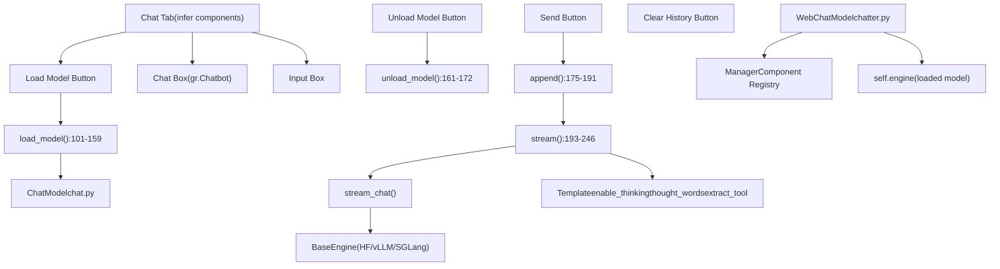
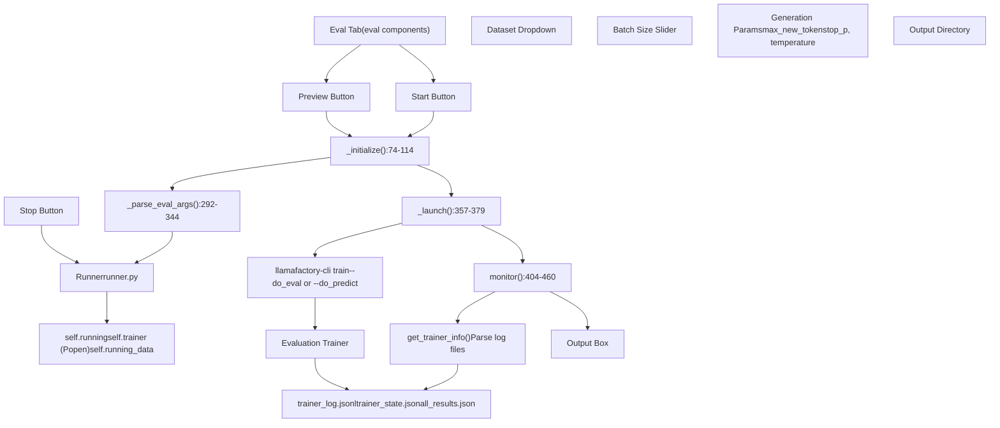
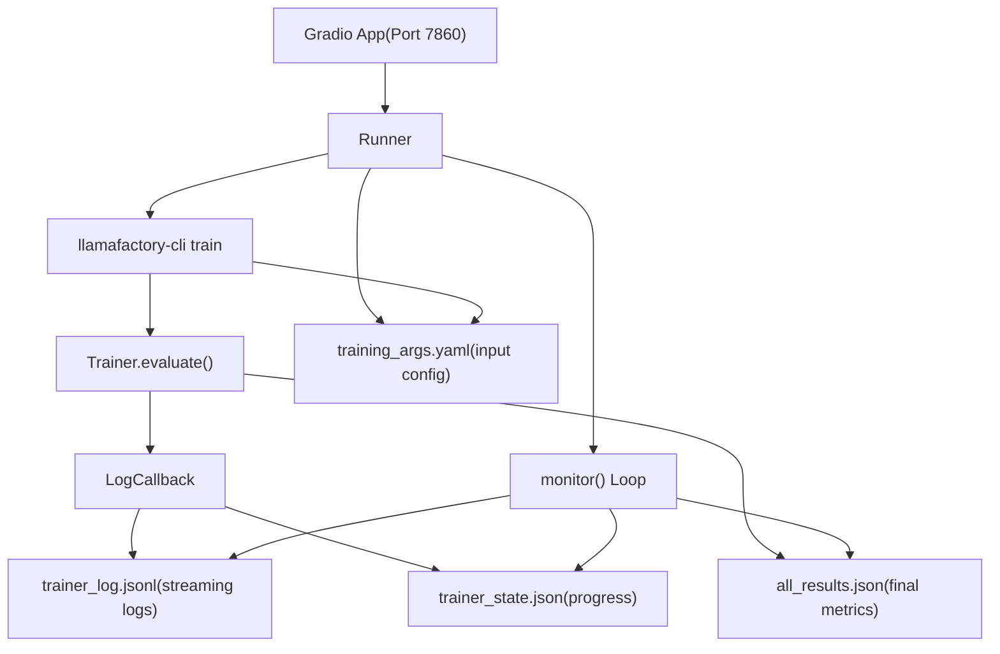

# Chat and Evaluation via Web UI

Relevant source files

-   [src/llamafactory/webui/chatter.py](https://github.com/hiyouga/LlamaFactory/blob/355d5c5e/src/llamafactory/webui/chatter.py)
-   [src/llamafactory/webui/common.py](https://github.com/hiyouga/LlamaFactory/blob/355d5c5e/src/llamafactory/webui/common.py)
-   [src/llamafactory/webui/components/export.py](https://github.com/hiyouga/LlamaFactory/blob/355d5c5e/src/llamafactory/webui/components/export.py)
-   [src/llamafactory/webui/components/top.py](https://github.com/hiyouga/LlamaFactory/blob/355d5c5e/src/llamafactory/webui/components/top.py)
-   [src/llamafactory/webui/components/train.py](https://github.com/hiyouga/LlamaFactory/blob/355d5c5e/src/llamafactory/webui/components/train.py)
-   [src/llamafactory/webui/engine.py](https://github.com/hiyouga/LlamaFactory/blob/355d5c5e/src/llamafactory/webui/engine.py)
-   [src/llamafactory/webui/locales.py](https://github.com/hiyouga/LlamaFactory/blob/355d5c5e/src/llamafactory/webui/locales.py)
-   [src/llamafactory/webui/manager.py](https://github.com/hiyouga/LlamaFactory/blob/355d5c5e/src/llamafactory/webui/manager.py)
-   [src/llamafactory/webui/runner.py](https://github.com/hiyouga/LlamaFactory/blob/355d5c5e/src/llamafactory/webui/runner.py)

This page documents how to use the LLaMA Board web interface for interactive chat testing and model evaluation. For information about training models via the web UI, see [Training via Web UI](/hiyouga/LlamaFactory/8.2-training-via-web-ui). For the overall web UI architecture, see [Web UI Architecture](/hiyouga/LlamaFactory/8.1-web-ui-architecture).

## Overview

The web interface provides two primary capabilities for working with trained or fine-tuned models:

1.  **Chat Interface**: Load a model and interact with it conversationally, supporting both text-only and multimodal inputs (images, videos, audio)
2.  **Evaluation Interface**: Run automated evaluation tasks on datasets to measure model performance with metrics

Both features operate independently from training. The chat interface loads models in-process for immediate interaction, while evaluation spawns isolated subprocesses similar to training.

---

## Chat Interface Architecture

The chat functionality is implemented through the `WebChatModel` class, which wraps the core `ChatModel` inference engine with web-specific state management and UI integration.


**Key Components**

| Component | File Location | Purpose |
| --- | --- | --- |
| `WebChatModel` | [src/llamafactory/webui/chatter.py80-246](https://github.com/hiyouga/LlamaFactory/blob/355d5c5e/src/llamafactory/webui/chatter.py#L80-L246) | Main chat controller, manages model lifecycle and inference |
| `load_model()` | [src/llamafactory/webui/chatter.py101-159](https://github.com/hiyouga/LlamaFactory/blob/355d5c5e/src/llamafactory/webui/chatter.py#L101-L159) | Initializes inference engine from UI configuration |
| `stream()` | [src/llamafactory/webui/chatter.py193-246](https://github.com/hiyouga/LlamaFactory/blob/355d5c5e/src/llamafactory/webui/chatter.py#L193-L246) | Generates responses token-by-token with streaming |
| `append()` | [src/llamafactory/webui/chatter.py175-191](https://github.com/hiyouga/LlamaFactory/blob/355d5c5e/src/llamafactory/webui/chatter.py#L175-L191) | Adds user messages to conversation history |
| `unload_model()` | [src/llamafactory/webui/chatter.py161-172](https://github.com/hiyouga/LlamaFactory/blob/355d5c5e/src/llamafactory/webui/chatter.py#L161-L172) | Releases model from memory |

**Sources**: [src/llamafactory/webui/chatter.py1-247](https://github.com/hiyouga/LlamaFactory/blob/355d5c5e/src/llamafactory/webui/chatter.py#L1-L247)

---

## Chat Workflow

### Model Loading

Before chatting, users must load a model into memory. The loading process validates configuration and initializes the inference engine.

> **[Mermaid sequence]**
> *(图表结构无法解析)*

**Load Model Process**

The `load_model()` method [src/llamafactory/webui/chatter.py101-159](https://github.com/hiyouga/LlamaFactory/blob/355d5c5e/src/llamafactory/webui/chatter.py#L101-L159) performs the following steps:

1.  **Extract Configuration**: Retrieve values from UI components via the `Manager` registry

    -   Model path: `get("top.model_path")`
    -   Template: `get("top.template")`
    -   Inference backend: `get("infer.infer_backend")`
    -   Checkpoint path: `get("top.checkpoint_path")`
2.  **Validation**: Check for common errors

    -   Model already loaded: `if self.loaded` [line 108](https://github.com/hiyouga/LlamaFactory/blob/355d5c5e/line 108)
    -   Missing model name or path [lines 110-113](https://github.com/hiyouga/LlamaFactory/blob/355d5c5e/lines 110-113)
    -   Invalid JSON in extra arguments [lines 117-120](https://github.com/hiyouga/LlamaFactory/blob/355d5c5e/lines 117-120)
3.  **Build Arguments Dictionary**: Construct the arguments for `ChatModel` initialization [lines 128-140](https://github.com/hiyouga/LlamaFactory/blob/355d5c5e/lines 128-140)

    ```
    args = dict(    model_name_or_path=model_path,    finetuning_type=finetuning_type,    template=get("top.template"),    infer_backend=get("infer.infer_backend"),    infer_dtype=get("infer.infer_dtype"),    ...)
    ```

4.  **Handle Checkpoints**: Add adapter paths for PEFT methods or update model path for full fine-tuning [lines 144-150](https://github.com/hiyouga/LlamaFactory/blob/355d5c5e/lines 144-150)

5.  **Handle Quantization**: Add quantization parameters if enabled [lines 153-156](https://github.com/hiyouga/LlamaFactory/blob/355d5c5e/lines 153-156)

6.  **Initialize Base ChatModel**: Call `super().__init__(args)` [line 158](https://github.com/hiyouga/LlamaFactory/blob/355d5c5e/line 158) which loads the model using the selected inference backend


**Configuration Parameters**

| Parameter | UI Element | Purpose | Default |
| --- | --- | --- | --- |
| `model_name_or_path` | top.model\_path | Path to base model | Required |
| `finetuning_type` | top.finetuning\_type | Adapter type (lora/full/freeze/oft) | lora |
| `adapter_name_or_path` | top.checkpoint\_path | Path(s) to adapter checkpoints | None |
| `template` | top.template | Chat template name | default |
| `infer_backend` | infer.infer\_backend | Engine (huggingface/vllm/sglang) | huggingface |
| `infer_dtype` | infer.infer\_dtype | Inference precision (auto/float16/bfloat16) | auto |
| `quantization_bit` | top.quantization\_bit | Quantization level (4/8 bit) | None |
| `flash_attn` | top.booster | Flash attention setting | auto |

**Sources**: [src/llamafactory/webui/chatter.py101-159](https://github.com/hiyouga/LlamaFactory/blob/355d5c5e/src/llamafactory/webui/chatter.py#L101-L159)

---

### Sending Messages and Streaming Responses

Once a model is loaded, users can send messages and receive streaming responses.

> **[Mermaid sequence]**
> *(图表结构无法解析)*

**Message Appending**

The static method `append()` [src/llamafactory/webui/chatter.py175-191](https://github.com/hiyouga/LlamaFactory/blob/355d5c5e/src/llamafactory/webui/chatter.py#L175-L191) adds user input to the conversation:

-   **Inputs**: Current chatbot display, message history, role, user query, HTML escaping flag
-   **Process**:
    -   Escapes HTML if `escape_html=True` using `_escape_html()` [lines 41-43](https://github.com/hiyouga/LlamaFactory/blob/355d5c5e/lines 41-43)
    -   Adds `{"role": "user", "content": query}` to chatbot for display
    -   Adds `{"role": role, "content": query}` to messages for model input
-   **Outputs**: Updated chatbot, updated messages, empty query string

**Streaming Inference**

The `stream()` method [src/llamafactory/webui/chatter.py193-246](https://github.com/hiyouga/LlamaFactory/blob/355d5c5e/src/llamafactory/webui/chatter.py#L193-L246) generates responses incrementally:

1.  **Enable Thinking Mode**: Temporarily sets `self.engine.template.enable_thinking` if reasoning model [line 215](https://github.com/hiyouga/LlamaFactory/blob/355d5c5e/line 215)

2.  **Initialize Response**: Append empty assistant message to chatbot [line 216](https://github.com/hiyouga/LlamaFactory/blob/355d5c5e/line 216)

3.  **Call Base Stream Chat**: Invoke `self.stream_chat()` with conversation parameters [lines 218-229](https://github.com/hiyouga/LlamaFactory/blob/355d5c5e/lines 218-229)

    -   `messages`: Full conversation history
    -   `system`: System prompt
    -   `tools`: Tool definitions (JSON string)
    -   `images`, `videos`, `audios`: Multimodal inputs
    -   `max_new_tokens`, `top_p`, `temperature`: Generation parameters
4.  **Process Each Token**:

    -   Accumulate token into `response` [line 230](https://github.com/hiyouga/LlamaFactory/blob/355d5c5e/line 230)
    -   If tools are provided, try to extract tool calls using `template.extract_tool()` [line 232](https://github.com/hiyouga/LlamaFactory/blob/355d5c5e/line 232)
    -   If tool calls detected, format as JSON [lines 236-239](https://github.com/hiyouga/LlamaFactory/blob/355d5c5e/lines 236-239)
    -   Otherwise, format response with thinking extraction [line 243](https://github.com/hiyouga/LlamaFactory/blob/355d5c5e/line 243)
5.  **Update Display**: Update the last message in chatbot and yield [lines 245-246](https://github.com/hiyouga/LlamaFactory/blob/355d5c5e/lines 245-246)


**Response Formatting with Thinking Mode**

The `_format_response()` helper [src/llamafactory/webui/chatter.py46-69](https://github.com/hiyouga/LlamaFactory/blob/355d5c5e/src/llamafactory/webui/chatter.py#L46-L69) handles reasoning models that produce "thinking" tokens:

-   Checks if response contains opening thought marker (`thought_words[0]`)
-   Splits response on closing thought marker (`thought_words[1]`)
-   Wraps thinking content in an expandable `<details>` HTML element
-   Displays only the final answer by default, with thinking available on click

**Sources**: [src/llamafactory/webui/chatter.py175-246](https://github.com/hiyouga/LlamaFactory/blob/355d5c5e/src/llamafactory/webui/chatter.py#L175-L246) [src/llamafactory/webui/chatter.py46-69](https://github.com/hiyouga/LlamaFactory/blob/355d5c5e/src/llamafactory/webui/chatter.py#L46-L69)

---

### Multimodal Support

The chat interface supports images, videos, and audio inputs when using compatible multimodal models.

**Multimodal Input Flow**

| Media Type | UI Component | Processing | Model Input |
| --- | --- | --- | --- |
| Image | `infer.image` (gr.Image) | Passed as list to `images` parameter | Pixel values via processor |
| Video | `infer.video` (gr.Video) | Passed as list to `videos` parameter | Frame tensors via processor |
| Audio | `infer.audio` (gr.Audio) | Passed as list to `audios` parameter | Waveform tensors via processor |

The `stream()` method passes media files to the base `stream_chat()` [lines 222-224](https://github.com/hiyouga/LlamaFactory/blob/355d5c5e/lines 222-224):

```
images=[image] if image else None,videos=[video] if video else None,audios=[audio] if audio else None,
```
The base `ChatModel` handles media processing through the multimodal plugin system (see [Multimodal Data Processing](/hiyouga/LlamaFactory/4.3-multimodal-data-processing) for details).

**Sources**: [src/llamafactory/webui/chatter.py193-246](https://github.com/hiyouga/LlamaFactory/blob/355d5c5e/src/llamafactory/webui/chatter.py#L193-L246)

---

### Model Unloading

To free GPU memory, users can unload the model without closing the web interface.

**Unload Process**

The `unload_model()` method [src/llamafactory/webui/chatter.py161-172](https://github.com/hiyouga/LlamaFactory/blob/355d5c5e/src/llamafactory/webui/chatter.py#L161-L172) performs cleanup:

1.  Check if demo mode (unloading disabled in demo) [lines 164-167](https://github.com/hiyouga/LlamaFactory/blob/355d5c5e/lines 164-167)
2.  Yield "Unloading..." status message
3.  Set `self.engine = None` [line 170](https://github.com/hiyouga/LlamaFactory/blob/355d5c5e/line 170) - releases model reference
4.  Call `torch_gc()` [line 171](https://github.com/hiyouga/LlamaFactory/blob/355d5c5e/line 171) to free GPU memory (runs garbage collection and CUDA cache clearing)
5.  Yield "Unloaded" status message

After unloading, users must reload the model to resume chatting.

**Sources**: [src/llamafactory/webui/chatter.py161-172](https://github.com/hiyouga/LlamaFactory/blob/355d5c5e/src/llamafactory/webui/chatter.py#L161-L172)

---

## Evaluation Interface Architecture

The evaluation functionality reuses the training infrastructure but runs evaluation-specific tasks. Evaluation jobs execute in isolated subprocesses to prevent interference with the web server.


**Key Components**

| Component | File Location | Purpose |
| --- | --- | --- |
| `Runner` | [src/llamafactory/webui/runner.py54-506](https://github.com/hiyouga/LlamaFactory/blob/355d5c5e/src/llamafactory/webui/runner.py#L54-L506) | Manages evaluation job lifecycle |
| `_parse_eval_args()` | [src/llamafactory/webui/runner.py292-344](https://github.com/hiyouga/LlamaFactory/blob/355d5c5e/src/llamafactory/webui/runner.py#L292-L344) | Builds evaluation arguments from UI state |
| `_initialize()` | [src/llamafactory/webui/runner.py74-114](https://github.com/hiyouga/LlamaFactory/blob/355d5c5e/src/llamafactory/webui/runner.py#L74-L114) | Validates configuration before launch |
| `_launch()` | [src/llamafactory/webui/runner.py357-379](https://github.com/hiyouga/LlamaFactory/blob/355d5c5e/src/llamafactory/webui/runner.py#L357-L379) | Spawns evaluation subprocess |
| `monitor()` | [src/llamafactory/webui/runner.py404-460](https://github.com/hiyouga/LlamaFactory/blob/355d5c5e/src/llamafactory/webui/runner.py#L404-L460) | Tracks progress and displays results |

**Sources**: [src/llamafactory/webui/runner.py1-506](https://github.com/hiyouga/LlamaFactory/blob/355d5c5e/src/llamafactory/webui/runner.py#L1-L506)

---

## Evaluation Workflow

### Configuring Evaluation

Users configure evaluation through the Eval tab, which shares the top panel configuration (model, checkpoints, template) with other tabs.

**Evaluation-Specific Configuration**

The `_parse_eval_args()` method [src/llamafactory/webui/runner.py292-344](https://github.com/hiyouga/LlamaFactory/blob/355d5c5e/src/llamafactory/webui/runner.py#L292-L344) builds the evaluation arguments dictionary:

```
args = dict(    stage="sft",                          # Always SFT stage for eval    model_name_or_path=get("top.model_path"),    finetuning_type=finetuning_type,    template=get("top.template"),    eval_dataset=",".join(get("eval.dataset")),  # Join multiple datasets    cutoff_len=get("eval.cutoff_len"),    per_device_eval_batch_size=get("eval.batch_size"),    predict_with_generate=True,           # Generate sequences instead of loss-only    max_new_tokens=get("eval.max_new_tokens"),    top_p=get("eval.top_p"),    temperature=get("eval.temperature"),    output_dir=get_save_dir(...),    ...)
```
**Evaluation vs. Prediction Mode**

The system supports two evaluation modes [lines 324-327](https://github.com/hiyouga/LlamaFactory/blob/355d5c5e/lines 324-327):

-   **Evaluation Mode** (`do_eval=True`): Compute metrics on labeled data (e.g., perplexity, BLEU)
-   **Prediction Mode** (`do_predict=True`): Generate outputs without computing metrics

The mode is controlled by the `eval.predict` checkbox in the UI.

**Parameter Summary**

| Parameter | UI Element | Purpose | Default |
| --- | --- | --- | --- |
| `eval_dataset` | eval.dataset | Dataset(s) to evaluate on | Required |
| `cutoff_len` | eval.cutoff\_len | Maximum sequence length | 2048 |
| `batch_size` | eval.batch\_size | Samples per device | 2 |
| `max_new_tokens` | eval.max\_new\_tokens | Maximum tokens to generate | 512 |
| `top_p` | eval.top\_p | Nucleus sampling threshold | 0.9 |
| `temperature` | eval.temperature | Sampling temperature | 1.0 |
| `output_dir` | eval.output\_dir | Where to save results | Required |

**Sources**: [src/llamafactory/webui/runner.py292-344](https://github.com/hiyouga/LlamaFactory/blob/355d5c5e/src/llamafactory/webui/runner.py#L292-L344)

---

### Starting and Monitoring Evaluation

Evaluation runs in a subprocess to isolate it from the web server process.

> **[Mermaid sequence]**
> *(图表结构无法解析)*

**Subprocess Launch**

The `_launch()` method [src/llamafactory/webui/runner.py357-379](https://github.com/hiyouga/LlamaFactory/blob/355d5c5e/src/llamafactory/webui/runner.py#L357-L379) spawns the evaluation process:

1.  **Validate**: Call `_initialize()` to check configuration [line 360](https://github.com/hiyouga/LlamaFactory/blob/355d5c5e/line 360)

2.  **Build Arguments**: Call `_parse_eval_args()` [line 366](https://github.com/hiyouga/LlamaFactory/blob/355d5c5e/line 366)

3.  **Save Configuration**: Write YAML config to output directory [line 369](https://github.com/hiyouga/LlamaFactory/blob/355d5c5e/line 369)

    ```
    save_args(os.path.join(args["output_dir"], LLAMABOARD_CONFIG),           self._build_config_dict(data))
    ```

4.  **Set Environment Variables** [lines 371-375](https://github.com/hiyouga/LlamaFactory/blob/355d5c5e/lines 371-375):

    -   `LLAMABOARD_ENABLED=1`: Signal that this is a web UI job
    -   `LLAMABOARD_WORKDIR`: Output directory for monitoring
5.  **Spawn Process** [line 378](https://github.com/hiyouga/LlamaFactory/blob/355d5c5e/line 378):

    ```
    self.trainer = Popen(["llamafactory-cli", "train", save_cmd(args)],                      env=env, stderr=PIPE, text=True)
    ```

    Note: Uses `train` command even for evaluation because the CLI dispatches based on `do_eval`/`do_predict` flags

6.  **Start Monitoring**: Yield from `monitor()` generator [line 379](https://github.com/hiyouga/LlamaFactory/blob/355d5c5e/line 379)


**Sources**: [src/llamafactory/webui/runner.py357-379](https://github.com/hiyouga/LlamaFactory/blob/355d5c5e/src/llamafactory/webui/runner.py#L357-L379)

---

### Progress Monitoring

The `monitor()` method [src/llamafactory/webui/runner.py404-460](https://github.com/hiyouga/LlamaFactory/blob/355d5c5e/src/llamafactory/webui/runner.py#L404-L460) tracks evaluation progress by reading log files written by the subprocess.

**Monitoring Loop**

```
while return_code == -1:    running_log, running_progress, running_info = get_trainer_info(lang, output_path, self.do_train)    return_dict = {        output_box: running_log,        progress_bar: running_progress,    }    yield return_dict        try:        stderr = self.trainer.communicate(timeout=2)[1]        return_code = self.trainer.returncode    except TimeoutExpired:        continue
```
**Key Monitoring Functions**

1.  **`get_trainer_info()`** [src/llamafactory/webui/control.py](https://github.com/hiyouga/LlamaFactory/blob/355d5c5e/src/llamafactory/webui/control.py) - Parses log files to extract:

    -   Running log messages from `trainer_log.jsonl`
    -   Progress percentage from `trainer_state.json`
    -   Loss curves for visualization (training mode only)
2.  **Process Communication**: Attempts to communicate with subprocess every 2 seconds [line 442](https://github.com/hiyouga/LlamaFactory/blob/355d5c5e/line 442)

    -   `timeout=2`: Non-blocking check
    -   If subprocess exits, capture `return_code` and `stderr`
    -   If timeout, continue monitoring loop
3.  **Abort Handling**: If user clicks "Stop", `set_abort()` is called [lines 69-72](https://github.com/hiyouga/LlamaFactory/blob/355d5c5e/lines 69-72):

    ```
    def set_abort(self) -> None:    self.aborted = True    if self.trainer is not None:        abort_process(self.trainer.pid)  # Recursively kill child processes
    ```


**Sources**: [src/llamafactory/webui/runner.py404-460](https://github.com/hiyouga/LlamaFactory/blob/355d5c5e/src/llamafactory/webui/runner.py#L404-L460)

---

### Viewing Results

When evaluation completes successfully, results are displayed in the output box.

**Result Loading**

For evaluation mode (not prediction), the system loads metrics from `all_results.json` [lines 447-452](https://github.com/hiyouga/LlamaFactory/blob/355d5c5e/lines 447-452):

```
if return_code == 0 or self.aborted:    if self.do_train:        finish_log = ALERTS["info_finished"][lang] + "\n\n" + running_log    else:        finish_log = load_eval_results(os.path.join(output_path, "all_results.json")) + "\n\n" + running_log
```
The `load_eval_results()` function [src/llamafactory/webui/common.py212-217](https://github.com/hiyouga/LlamaFactory/blob/355d5c5e/src/llamafactory/webui/common.py#L212-L217) formats the JSON metrics:

```
def load_eval_results(path: os.PathLike) -> str:    with open(path, encoding="utf-8") as f:        result = json.dumps(json.load(f), indent=4)    return f"```json\n{result}\n```\n"
```
**Typical Evaluation Metrics**

The `all_results.json` file contains metrics computed by the trainer, which may include:

-   `eval_loss`: Cross-entropy loss on evaluation set
-   `eval_runtime`: Total evaluation time
-   `eval_samples_per_second`: Throughput
-   `eval_steps_per_second`: Step throughput
-   Task-specific metrics (BLEU, ROUGE, accuracy, etc.) if custom compute\_metrics is defined

**Prediction Outputs**

For prediction mode, generated sequences are saved to `generated_predictions.jsonl` in the output directory. Each line contains:

-   `input`: Original input text
-   `output`: Model-generated text
-   `label` (if available): Ground truth for comparison

**Sources**: [src/llamafactory/webui/runner.py447-460](https://github.com/hiyouga/LlamaFactory/blob/355d5c5e/src/llamafactory/webui/runner.py#L447-L460) [src/llamafactory/webui/common.py212-217](https://github.com/hiyouga/LlamaFactory/blob/355d5c5e/src/llamafactory/webui/common.py#L212-L217)

---

## Implementation Details

### State Management via Manager

The `Manager` class [src/llamafactory/webui/manager.py23-71](https://github.com/hiyouga/LlamaFactory/blob/355d5c5e/src/llamafactory/webui/manager.py#L23-L71) maintains a bidirectional mapping between UI components and string identifiers.

**Component Registry**

```
class Manager:    def __init__(self) -> None:        self._id_to_elem: dict[str, Component] = {}        self._elem_to_id: dict[Component, str] = {}
```
Components are registered with hierarchical IDs like `"top.model_name"`, `"eval.dataset"`, `"infer.chatbot"`.

**Usage in Chat and Evaluation**

Both `WebChatModel` and `Runner` receive a `Manager` instance and use it to access UI state:

```
get = lambda elem_id: data[self.manager.get_elem_by_id(elem_id)]model_path = get("top.model_path")dataset = get("eval.dataset")
```
This pattern enables:

-   **Type Safety**: Components accessed by string ID, preventing typos
-   **Modularity**: UI layout changes don't break logic if IDs remain consistent
-   **State Persistence**: All UI state captured in `data` dictionary for saving/loading configurations

**Sources**: [src/llamafactory/webui/manager.py23-71](https://github.com/hiyouga/LlamaFactory/blob/355d5c5e/src/llamafactory/webui/manager.py#L23-L71) [src/llamafactory/webui/chatter.py102](https://github.com/hiyouga/LlamaFactory/blob/355d5c5e/src/llamafactory/webui/chatter.py#L102-L102) [src/llamafactory/webui/runner.py294](https://github.com/hiyouga/LlamaFactory/blob/355d5c5e/src/llamafactory/webui/runner.py#L294-L294)

---

### Process Isolation and Communication

Evaluation runs in a subprocess to provide isolation and enable concurrent web UI access during long-running jobs.

**Subprocess Architecture**


**Communication Pattern**

1.  **Input**: Web UI writes configuration to YAML file [src/llamafactory/webui/common.py202-209](https://github.com/hiyouga/LlamaFactory/blob/355d5c5e/src/llamafactory/webui/common.py#L202-L209)
2.  **Launch**: Spawn subprocess with `LLAMABOARD_ENABLED` environment variable
3.  **Monitoring**: Web UI polls log files every 2 seconds
4.  **Output**: Subprocess writes metrics to JSON files
5.  **Completion**: Process exits, UI reads final results

This file-based IPC pattern provides:

-   **Robustness**: Web server restart doesn't lose evaluation state
-   **Debuggability**: Log files available for inspection
-   **Simplicity**: No need for pipes, sockets, or shared memory

**Abort Mechanism**

To stop evaluation, the UI calls `abort_process()` [src/llamafactory/webui/common.py46-56](https://github.com/hiyouga/LlamaFactory/blob/355d5c5e/src/llamafactory/webui/common.py#L46-L56):

```
def abort_process(pid: int) -> None:    try:        children = Process(pid).children()        if children:            for child in children:                abort_process(child.pid)  # Recursive bottom-up        os.kill(pid, signal.SIGABRT)    except Exception:        pass
```
This recursively terminates all child processes (e.g., distributed training workers) before killing the parent.

**Sources**: [src/llamafactory/webui/runner.py357-460](https://github.com/hiyouga/LlamaFactory/blob/355d5c5e/src/llamafactory/webui/runner.py#L357-L460) [src/llamafactory/webui/common.py46-56](https://github.com/hiyouga/LlamaFactory/blob/355d5c5e/src/llamafactory/webui/common.py#L46-L56) [src/llamafactory/webui/common.py202-209](https://github.com/hiyouga/LlamaFactory/blob/355d5c5e/src/llamafactory/webui/common.py#L202-L209)

---

## Configuration Persistence

Both chat and evaluation configurations can be saved and loaded for reproducibility.

**Saving Configurations**

The `Runner.save_args()` method [src/llamafactory/webui/runner.py462-476](https://github.com/hiyouga/LlamaFactory/blob/355d5c5e/src/llamafactory/webui/runner.py#L462-L476) saves current UI state to a YAML file:

```
def save_args(self, data):    config_path = data[self.manager.get_elem_by_id("train.config_path")]    save_path = os.path.join(DEFAULT_CONFIG_DIR, config_path)    save_args(save_path, self._build_config_dict(data))
```
The configuration excludes runtime-specific fields like `top.lang`, `top.model_path`, `train.output_dir` [line 384](https://github.com/hiyouga/LlamaFactory/blob/355d5c5e/line 384)

**Loading Configurations**

The `Runner.load_args()` method [src/llamafactory/webui/runner.py478-490](https://github.com/hiyouga/LlamaFactory/blob/355d5c5e/src/llamafactory/webui/runner.py#L478-L490) restores UI state:

```
def load_args(self, lang: str, config_path: str):    config_dict = load_args(os.path.join(DEFAULT_CONFIG_DIR, config_path))    output_dict: dict[Component, Any] = {}    for elem_id, value in config_dict.items():        output_dict[self.manager.get_elem_by_id(elem_id)] = value    return output_dict
```
This returns a dictionary mapping UI components to their saved values, which Gradio automatically applies.

**Automatic Checkpoint Restoration**

When a user inputs an existing output directory, `check_output_dir()` [src/llamafactory/webui/runner.py492-505](https://github.com/hiyouga/LlamaFactory/blob/355d5c5e/src/llamafactory/webui/runner.py#L492-L505) automatically loads the configuration from `llamaboard_config.yaml` in that directory:

```
if os.path.isdir(get_save_dir(model_name, finetuning_type, output_dir)):    output_dir = get_save_dir(model_name, finetuning_type, output_dir)    config_dict = load_args(os.path.join(output_dir, LLAMABOARD_CONFIG))    for elem_id, value in config_dict.items():        output_dict[self.manager.get_elem_by_id(elem_id)] = value
```
This enables resuming evaluations or replicating previous configurations.

**Sources**: [src/llamafactory/webui/runner.py462-505](https://github.com/hiyouga/LlamaFactory/blob/355d5c5e/src/llamafactory/webui/runner.py#L462-L505) [src/llamafactory/webui/common.py154-166](https://github.com/hiyouga/LlamaFactory/blob/355d5c5e/src/llamafactory/webui/common.py#L154-L166)
