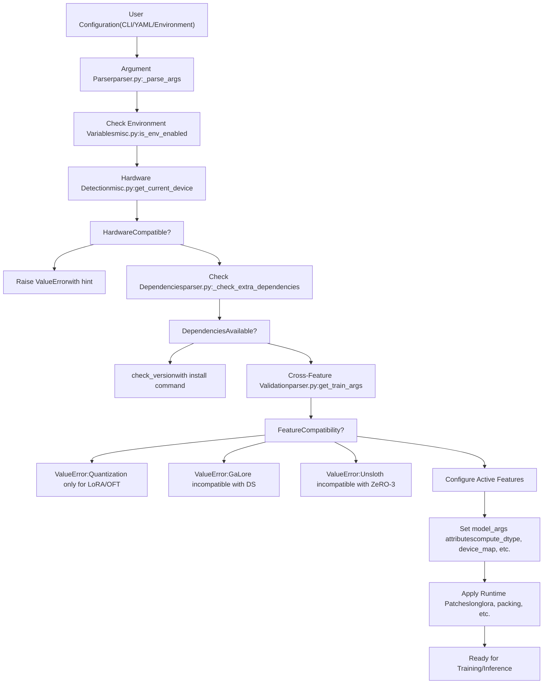
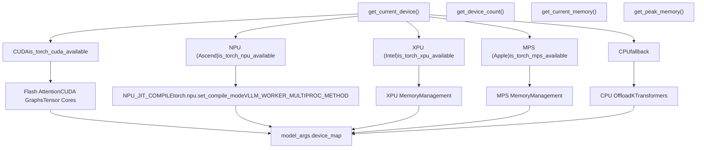
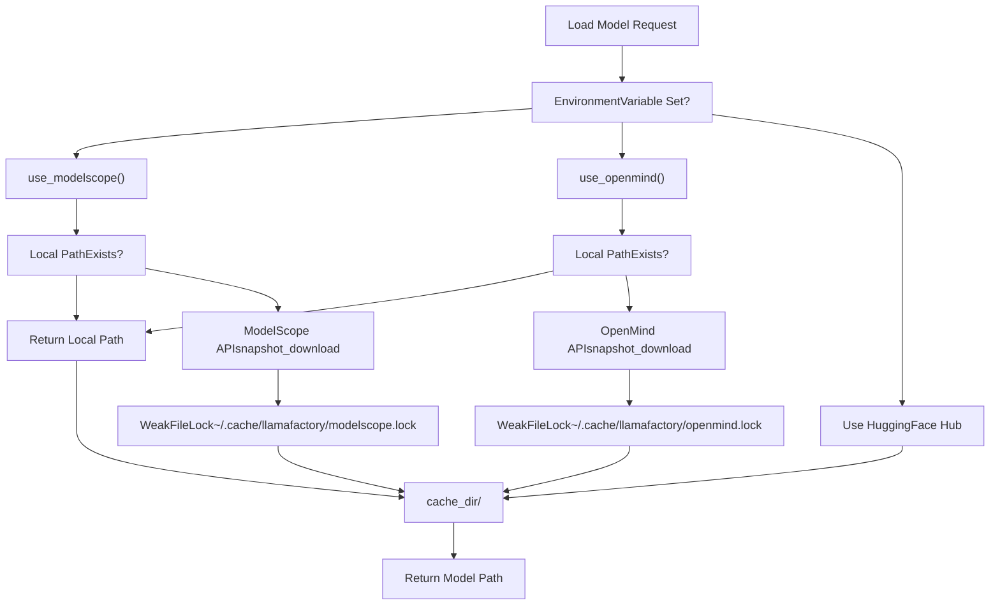
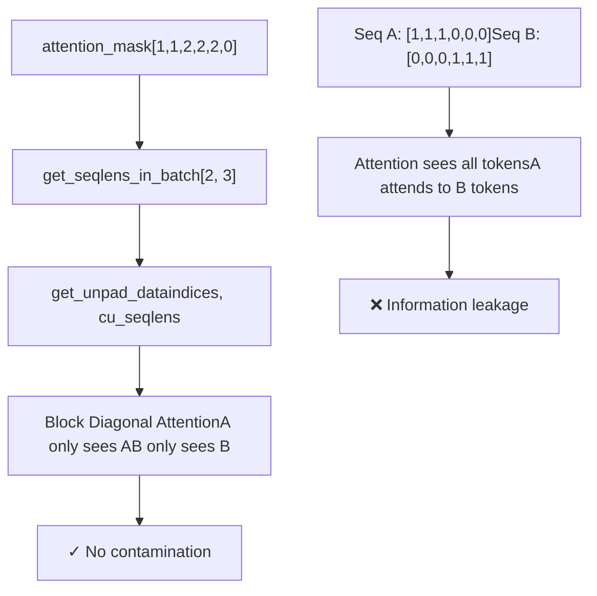
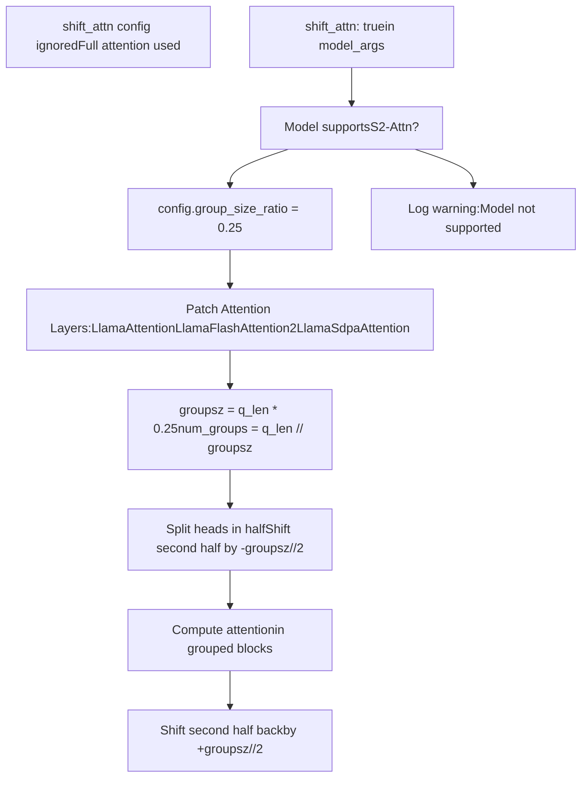
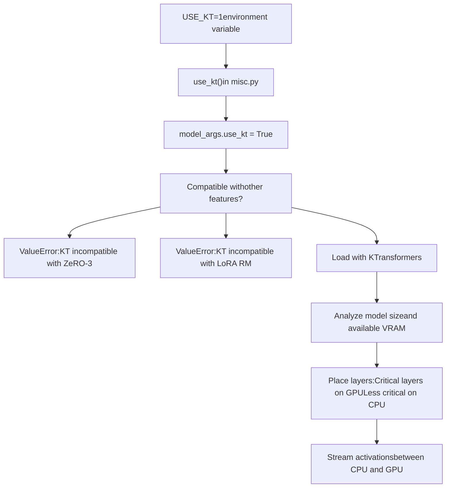
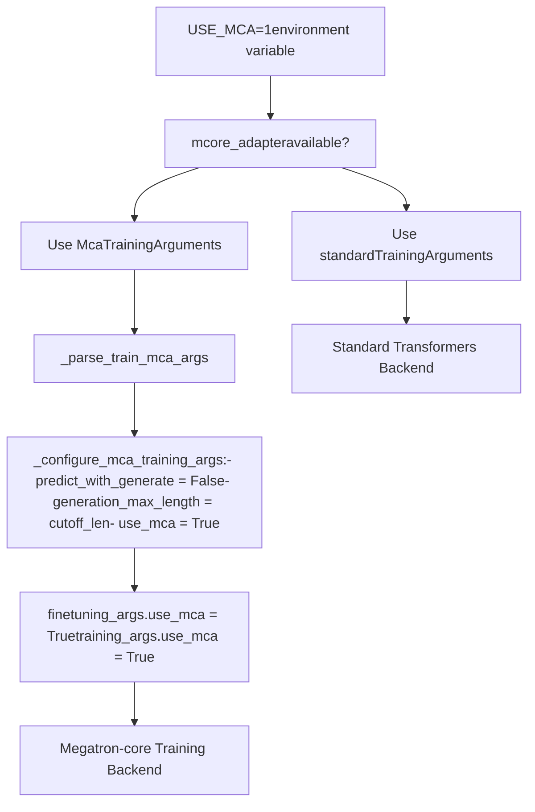
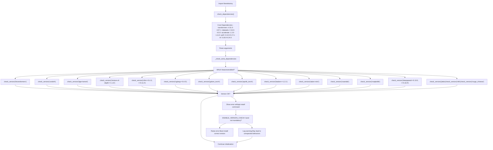

# Advanced Topics

Relevant source files

-   [README.md](https://github.com/hiyouga/LlamaFactory/blob/355d5c5e/README.md?plain=1)
-   [README\_zh.md](https://github.com/hiyouga/LlamaFactory/blob/355d5c5e/README_zh.md?plain=1)
-   [src/llamafactory/\_\_init\_\_.py](https://github.com/hiyouga/LlamaFactory/blob/355d5c5e/src/llamafactory/__init__.py)
-   [src/llamafactory/extras/misc.py](https://github.com/hiyouga/LlamaFactory/blob/355d5c5e/src/llamafactory/extras/misc.py)
-   [src/llamafactory/hparams/parser.py](https://github.com/hiyouga/LlamaFactory/blob/355d5c5e/src/llamafactory/hparams/parser.py)
-   [src/llamafactory/model/model\_utils/longlora.py](https://github.com/hiyouga/LlamaFactory/blob/355d5c5e/src/llamafactory/model/model_utils/longlora.py)
-   [src/llamafactory/model/model\_utils/packing.py](https://github.com/hiyouga/LlamaFactory/blob/355d5c5e/src/llamafactory/model/model_utils/packing.py)

This document provides an overview of LlamaFactory's advanced features, specialized configurations, and optimization techniques. These topics extend beyond standard fine-tuning workflows and enable cutting-edge research, hardware-specific optimizations, and production-grade deployments.

**Scope**: This page covers the architecture and integration points for advanced features. For detailed configuration and usage:

-   Hardware-specific setup and optimizations: see [Hardware Support](/hiyouga/LlamaFactory/9.1-hardware-support)
-   Complete environment variable reference: see [Environment Variables and Configuration](/hiyouga/LlamaFactory/9.2-environment-variables-and-configuration)
-   Performance tuning and acceleration techniques: see [Performance Optimization](/hiyouga/LlamaFactory/9.3-performance-optimization)
-   MoE model training and deployment: see [Mixture-of-Experts Models](/hiyouga/LlamaFactory/9.4-mixture-of-experts-(moe)-models)

For basic training configuration and standard workflows, see [Configuration System](/hiyouga/LlamaFactory/3-configuration-system) and [Training System](/hiyouga/LlamaFactory/6-training-system).

---

## System Architecture for Advanced Features

LlamaFactory implements a modular architecture where advanced features are conditionally activated based on configuration, environment variables, and runtime checks. The system performs early validation during argument parsing to ensure compatibility and prevent expensive failures during training.

### Feature Detection and Validation Flow

**Sources**: [src/llamafactory/hparams/parser.py85-471](https://github.com/hiyouga/LlamaFactory/blob/355d5c5e/src/llamafactory/hparams/parser.py#L85-L471)

### Hardware Abstraction Layer

The system implements a unified interface for different hardware accelerators, automatically detecting available devices and configuring appropriate memory management and computation strategies.

**Sources**: [src/llamafactory/extras/misc.py144-206](https://github.com/hiyouga/LlamaFactory/blob/355d5c5e/src/llamafactory/extras/misc.py#L144-L206) [src/llamafactory/hparams/parser.py109-115](https://github.com/hiyouga/LlamaFactory/blob/355d5c5e/src/llamafactory/hparams/parser.py#L109-L115)

---

## Environment Variable Configuration System

LlamaFactory uses environment variables to control system behavior without modifying code or configuration files. This enables runtime feature toggling, debugging, and platform-specific optimizations.

### Environment Variable Categories

| Category | Variables | Purpose |
| --- | --- | --- |
| **Hub Selection** | `USE_MODELSCOPE_HUB`
`USE_OPENMIND_HUB` | Select model/dataset download source (HuggingFace, ModelScope, OpenMind) |
| **Hardware Control** | `NPU_JIT_COMPILE`
`VLLM_WORKER_MULTIPROC_METHOD`
`LOCAL_RANK` | Hardware-specific optimizations and device assignment |
| **Debugging** | `DISABLE_VERSION_CHECK`
`LLAMAFACTORY_VERBOSITY`
`RECORD_VRAM`
`FORCE_CHECK_IMPORTS` | Control logging, validation, and monitoring |
| **Training Backend** | `USE_MCA`
`FORCE_TORCHRUN`
`ALLOW_EXTRA_ARGS` | Select training backend (standard, Megatron-core) and distributed launch |
| **Feature Flags** | `USE_RAY`
`USE_KT` | Enable experimental features (Ray, KTransformers) |

### Hub Selection Pattern

**Sources**: [src/llamafactory/extras/misc.py267-310](https://github.com/hiyouga/LlamaFactory/blob/355d5c5e/src/llamafactory/extras/misc.py#L267-L310) [src/llamafactory/\_\_init\_\_.py15-26](https://github.com/hiyouga/LlamaFactory/blob/355d5c5e/src/llamafactory/__init__.py#L15-L26)

---

## Performance Optimization Framework

LlamaFactory integrates multiple performance optimization techniques that can be combined based on hardware capabilities and model characteristics. The system validates compatibility and applies optimizations during model initialization.

### Optimization Categories and Integration Points

```mermaid
flowchart TD
    FlashAttn["FlashAttention-2flash_attn: fa2_is_bf16_available"]
    Unsloth["Unslothuse_unsloth: truecheck_version('unsloth')"]
    Liger["Liger Kernelenable_liger_kernel: truecheck_version('liger-kernel')"]
    Quantization["Quantizationquantization_bit: 4/8BitsAndBytes/GPTQ/AWQ"]
    GradChk["Gradient Checkpointinggradient_checkpointing: trueReduced VRAM"]
    Packing["Sequence Packingpacking: trueblock_diag_attn: true"]
    ShiftAttn["Shift Attention (S^2-Attn)shift_attn: trueLongLoRA extension"]
    RopeScaling["RoPE Scalingrope_scaling: linear/dynamicContext extension"]
    MoD["Mixture-of-Depthsmixture_of_depths: stringSelective computation"]
    GaLore["GaLoreuse_galore: trueLow-rank gradient projection"]
    BAdam["BAdamuse_badam: trueBlock-wise Adam"]
    Apollo["APOLLOuse_apollo: trueAdaptive optimizer"]
    AdamMini["Adam-miniuse_adam_mini: trueReduced memory Adam"]
    Muon["Muonuse_muon: trueMomentum-based optimizer"]
    FP8["FP8 Trainingfp8: truefp8_enable_fsdp_float8_all_gather"]
    PureBF16["Pure BF16pure_bf16: trueNo FP32 master weights"]
    NEFTune["NEFTuneneftune_noise_alpha: 5Noise injection"]
    ValidateArgs["parser.py:get_train_argsCross-validation"]
    ApplyPatches["Apply Runtime Patches"]
    ModelInit["Model Initialization"]

    ValidateArgs --> FlashAttn
    ValidateArgs --> Unsloth
    ValidateArgs --> Liger
    ValidateArgs --> Quantization
    ValidateArgs --> GradChk
    ValidateArgs --> Packing
    ValidateArgs --> ShiftAttn
    ValidateArgs --> RopeScaling
    ValidateArgs --> MoD
    ValidateArgs --> GaLore
    ValidateArgs --> BAdam
    ValidateArgs --> Apollo
    ValidateArgs --> AdamMini
    ValidateArgs --> Muon
    ValidateArgs --> FP8
    ValidateArgs --> PureBF16
    ValidateArgs --> NEFTune
    FlashAttn --> ApplyPatches
    Unsloth --> ApplyPatches
    Liger --> ApplyPatches
    ShiftAttn --> ApplyPatches
    Packing --> ApplyPatches
    ApplyPatches --> ModelInit
```

**Sources**: [README.md93-102](https://github.com/hiyouga/LlamaFactory/blob/355d5c5e/README.md?plain=1#L93-L102) [src/llamafactory/hparams/parser.py145-196](https://github.com/hiyouga/LlamaFactory/blob/355d5c5e/src/llamafactory/hparams/parser.py#L145-L196)

### Compatibility Matrix

The system enforces strict compatibility rules to prevent invalid configurations:

| Feature A | Feature B | Compatible | Reason |
| --- | --- | --- | --- |
| Quantization (4/8-bit) | LoRA/OFT | ✓ | QLoRA designed for this |
| Quantization | Full/Freeze tuning | ✗ | Quantized weights not trainable |
| GaLore/APOLLO | DeepSpeed | ✗ | Optimizer state management conflict |
| Unsloth | DeepSpeed ZeRO-3 | ✗ | Memory layout incompatibility |
| KTransformers | DeepSpeed ZeRO-3 | ✗ | CPU-GPU hybrid incompatible |
| Layer-wise BAdam | DeepSpeed ZeRO-3 | ✓ | Requires ZeRO-3 for efficiency |
| FP8 Training | Quantization | ✗ | Conflicting precision modes |
| Neat Packing | transformers>=4.53.0 | ✗ | API changes broke compatibility |
| predict\_with\_generate | DeepSpeed ZeRO-3 | ✗ | Generation incompatible with ZeRO-3 |

**Sources**: [src/llamafactory/hparams/parser.py122-354](https://github.com/hiyouga/LlamaFactory/blob/355d5c5e/src/llamafactory/hparams/parser.py#L122-L354)

---

## Advanced Training Techniques

### Sequence Packing with Block Diagonal Attention

Sequence packing concatenates multiple training sequences into a single batch to maximize GPU utilization. The `neat_packing` feature prevents cross-contamination between sequences using block diagonal attention masks.

The implementation in [src/llamafactory/model/model\_utils/packing.py55-117](https://github.com/hiyouga/LlamaFactory/blob/355d5c5e/src/llamafactory/model/model_utils/packing.py#L55-L117) provides three key functions:

-   **`get_seqlens_in_batch`**: Extracts individual sequence lengths from packed attention masks
-   **`get_unpad_data`**: Computes indices and cumulative sequence lengths for flash attention
-   **`configure_packing`**: Patches transformers' `_get_unpad_data` to use block diagonal logic

This is activated with `neat_packing: true` and `data_args.packing: true`.

**Sources**: [src/llamafactory/model/model\_utils/packing.py1-118](https://github.com/hiyouga/LlamaFactory/blob/355d5c5e/src/llamafactory/model/model_utils/packing.py#L1-L118) [src/llamafactory/hparams/parser.py460](https://github.com/hiyouga/LlamaFactory/blob/355d5c5e/src/llamafactory/hparams/parser.py#L460-L460)

### Shift Attention (LongLoRA)

LongLoRA's Shift Attention (S²-Attn) enables efficient long-context training by shifting attention patterns during training while maintaining full attention during inference.

The implementation modifies attention computation by:

1.  Dividing sequence into groups (default: 1/4 of sequence length)
2.  Splitting attention heads into two halves
3.  Shifting the second half by half a group size
4.  Computing attention within groups (preventing full sequence attention)
5.  Shifting back after computation

This reduces attention complexity from O(n²) to O(n·g) where g is group size, enabling training on longer contexts.

**Sources**: [src/llamafactory/model/model\_utils/longlora.py1-371](https://github.com/hiyouga/LlamaFactory/blob/355d5c5e/src/llamafactory/model/model_utils/longlora.py#L1-L371) [README.md248-249](https://github.com/hiyouga/LlamaFactory/blob/355d5c5e/README.md?plain=1#L248-L249)

---

## Specialized Model Support

### KTransformers: Hybrid CPU-GPU Inference

KTransformers enables inference on models larger than GPU VRAM by strategically placing layers on CPU and GPU. This is activated via `USE_KT=1` environment variable.

KTransformers is particularly useful for:

-   Fine-tuning 1000B+ parameter models on consumer GPUs (e.g., 2x4090 + CPU)
-   Inference on models that don't fit in GPU VRAM
-   Development/testing with large models before cloud deployment

**Restrictions**:

-   Cannot be used with DeepSpeed ZeRO-3 (incompatible memory management)
-   Cannot be used with LoRA reward models in PPO training
-   Requires single-device setup (not compatible with DDP)

**Sources**: [src/llamafactory/hparams/parser.py150-351](https://github.com/hiyouga/LlamaFactory/blob/355d5c5e/src/llamafactory/hparams/parser.py#L150-L351) [src/llamafactory/extras/misc.py316-318](https://github.com/hiyouga/LlamaFactory/blob/355d5c5e/src/llamafactory/extras/misc.py#L316-L318) [README.md118-119](https://github.com/hiyouga/LlamaFactory/blob/355d5c5e/README.md?plain=1#L118-L119)

---

## Megatron-Core Integration

LlamaFactory supports Megatron-core as an alternative training backend via the `mcore_adapter` package. This enables tensor parallelism, pipeline parallelism, and other advanced distributed training features.

### Activation and Configuration

When `USE_MCA=1` is set:

1.  Parser imports `McaTrainingArguments` from `mcore_adapter` package
2.  Argument parsing uses MCA-specific argument classes
3.  Training arguments are patched to disable incompatible features
4.  Both `finetuning_args` and `training_args` have `use_mca` flag set to `True`
5.  Training system uses Megatron-core's distributed training primitives

**Sources**: [src/llamafactory/hparams/parser.py56-250](https://github.com/hiyouga/LlamaFactory/blob/355d5c5e/src/llamafactory/hparams/parser.py#L56-L250) [README.md138-139](https://github.com/hiyouga/LlamaFactory/blob/355d5c5e/README.md?plain=1#L138-L139)

---

## Version and Dependency Management

LlamaFactory implements strict version checking to ensure compatibility across its complex dependency stack. This prevents runtime errors and provides clear guidance for fixing version conflicts.

### Dependency Checking Flow

The `check_version` function in [src/llamafactory/extras/misc.py76-92](https://github.com/hiyouga/LlamaFactory/blob/355d5c5e/src/llamafactory/extras/misc.py#L76-L92) provides:

-   Mandatory vs. optional checking (controlled by `mandatory` parameter)
-   Special handling for packages requiring `--no-build-isolation` (gptmodel, autoawq)
-   Clear error messages with exact `pip install` commands
-   Ability to bypass checks with `DISABLE_VERSION_CHECK=1` (for optional dependencies only)

**Sources**: [src/llamafactory/extras/misc.py76-102](https://github.com/hiyouga/LlamaFactory/blob/355d5c5e/src/llamafactory/extras/misc.py#L76-L102) [src/llamafactory/hparams/parser.py145-197](https://github.com/hiyouga/LlamaFactory/blob/355d5c5e/src/llamafactory/hparams/parser.py#L145-L197)

---

## Feature Interaction Summary

The following table summarizes how advanced features interact with core training components:

| Feature | Modifies | Compatible With | Incompatible With | Activation |
| --- | --- | --- | --- | --- |
| **FlashAttention-2** | Attention kernel | All LoRA variants, quantization | None | `flash_attn: fa2` |
| **Unsloth** | LoRA implementation | LoRA, QLoRA | DeepSpeed ZeRO-3, LoRA reward models | `use_unsloth: true` |
| **Liger Kernel** | Optimizer kernels | All training stages | None | `enable_liger_kernel: true` |
| **Shift Attention** | Attention pattern | Full/Freeze/LoRA training | PPO training | `shift_attn: true` |
| **Sequence Packing** | Data collation | SFT stage only | transformers>=4.53.0 | `neat_packing: true` |
| **GaLore** | Optimizer | All finetuning types | DeepSpeed, DDP (layerwise) | `use_galore: true` |
| **BAdam** | Optimizer | DeepSpeed ZeRO-3 (layerwise) | DDP (ratio mode) | `use_badam: true` |
| **APOLLO** | Optimizer | All finetuning types | DeepSpeed, DDP (layerwise) | `use_apollo: true` |
| **KTransformers** | Memory management | Single-device training | DeepSpeed ZeRO-3, DDP, LoRA RM | `USE_KT=1` |
| **Quantization** | Model precision | LoRA, OFT only | Full/Freeze tuning, device\_map='auto' | `quantization_bit: 4/8` |
| **FP8 Training** | Precision | FSDP | Quantization | `fp8: true` |
| **Pure BF16** | Precision | All stages | DeepSpeed ZeRO-3 | `pure_bf16: true` |

**Sources**: [src/llamafactory/hparams/parser.py244-471](https://github.com/hiyouga/LlamaFactory/blob/355d5c5e/src/llamafactory/hparams/parser.py#L244-L471)

---

## Next Steps

This overview provides the architectural foundation for LlamaFactory's advanced features. For implementation details and configuration:

-   **Hardware-specific optimizations**: [Hardware Support](/hiyouga/LlamaFactory/9.1-hardware-support) covers CUDA, NPU, ROCm, MPS, and hardware-specific performance tuning
-   **Complete environment variable reference**: [Environment Variables and Configuration](/hiyouga/LlamaFactory/9.2-environment-variables-and-configuration) lists all environment variables with descriptions and effects
-   **Performance tuning guide**: [Performance Optimization](/hiyouga/LlamaFactory/9.3-performance-optimization) provides benchmarks, best practices, and configuration recipes
-   **MoE model training**: [Mixture-of-Experts Models](/hiyouga/LlamaFactory/9.4-mixture-of-experts-(moe)-models) covers DeepSpeed Zero3 integration, MoE-specific configurations, and load balancing

For configuration fundamentals, see [Configuration System](/hiyouga/LlamaFactory/3-configuration-system). For training workflows, see [Training System](/hiyouga/LlamaFactory/6-training-system).
