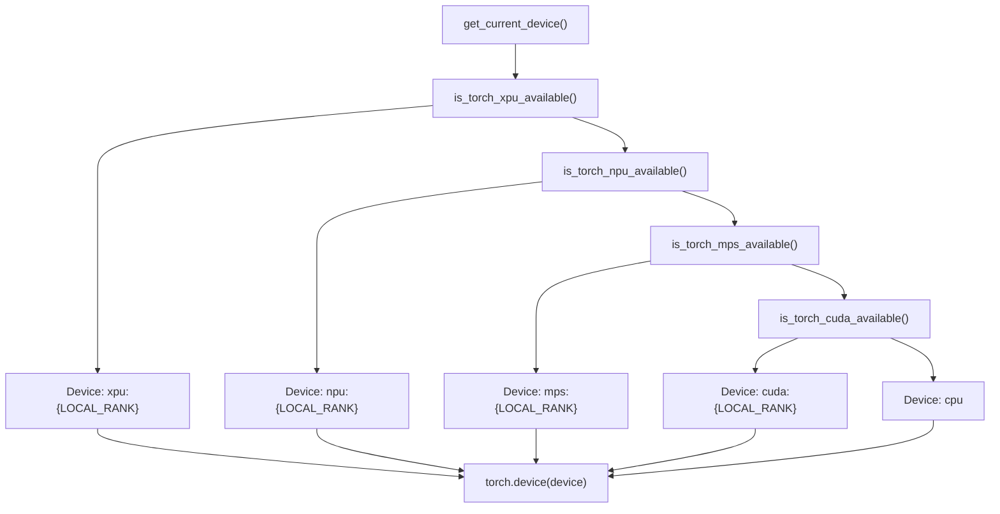
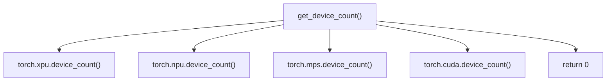
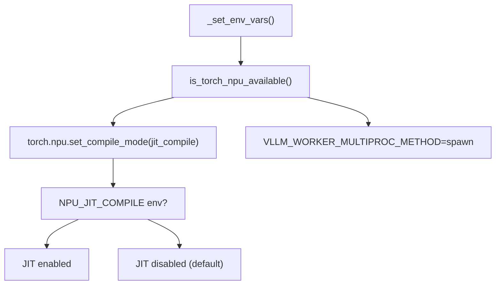
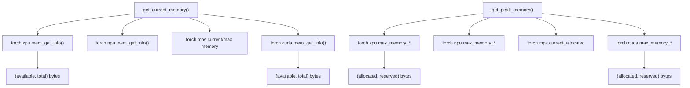
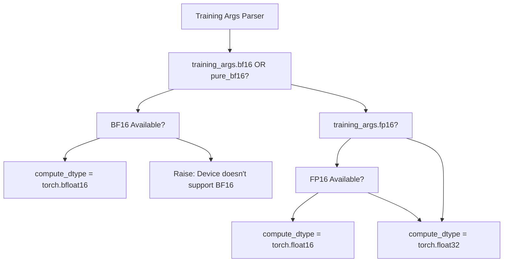
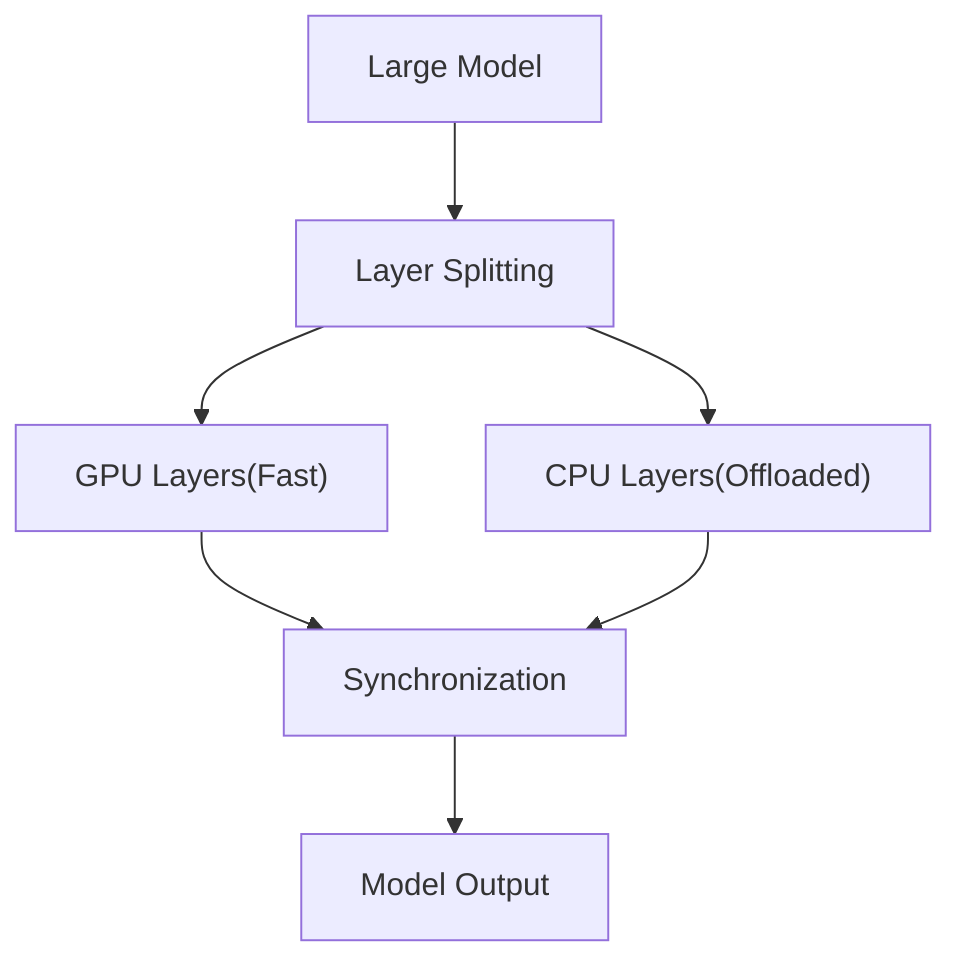
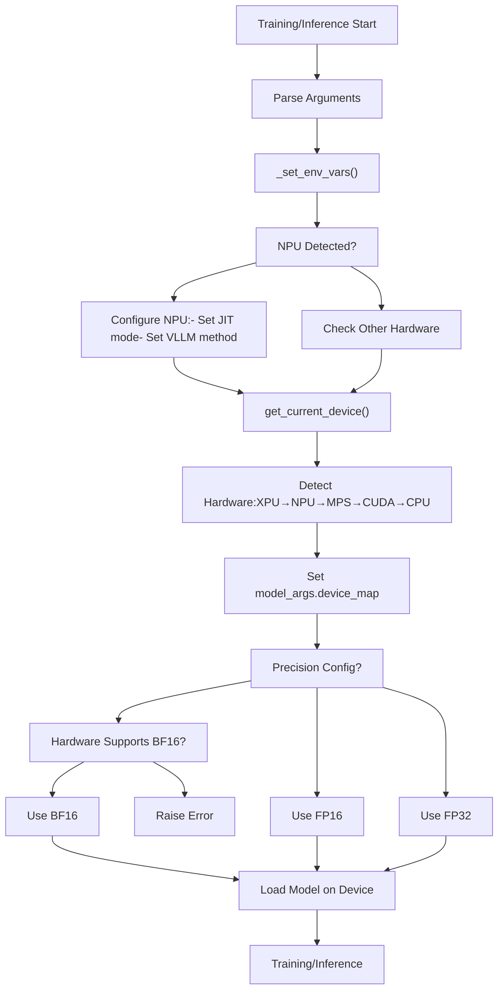

# Hardware Support

Relevant source files

-   [README.md](https://github.com/hiyouga/LlamaFactory/blob/355d5c5e/README.md?plain=1)
-   [README\_zh.md](https://github.com/hiyouga/LlamaFactory/blob/355d5c5e/README_zh.md?plain=1)
-   [src/llamafactory/\_\_init\_\_.py](https://github.com/hiyouga/LlamaFactory/blob/355d5c5e/src/llamafactory/__init__.py)
-   [src/llamafactory/extras/misc.py](https://github.com/hiyouga/LlamaFactory/blob/355d5c5e/src/llamafactory/extras/misc.py)
-   [src/llamafactory/hparams/parser.py](https://github.com/hiyouga/LlamaFactory/blob/355d5c5e/src/llamafactory/hparams/parser.py)
-   [src/llamafactory/model/model\_utils/longlora.py](https://github.com/hiyouga/LlamaFactory/blob/355d5c5e/src/llamafactory/model/model_utils/longlora.py)
-   [src/llamafactory/model/model\_utils/packing.py](https://github.com/hiyouga/LlamaFactory/blob/355d5c5e/src/llamafactory/model/model_utils/packing.py)

## Purpose and Scope

This page documents LlamaFactory's support for diverse hardware platforms including NVIDIA GPUs (CUDA), Huawei NPUs (Ascend), AMD GPUs (ROCm), Apple Silicon (MPS), Intel GPUs (XPU), and CPU. It covers device detection, configuration, memory management, and platform-specific optimizations.

For information about distributed training across multiple devices, see [Distributed Training](/hiyouga/LlamaFactory/6.4-distributed-training). For hardware-accelerated attention mechanisms, see [Attention Mechanisms and Optimizations](/hiyouga/LlamaFactory/5.4-attention-mechanisms-and-optimizations). For performance optimization techniques, see [Performance Optimization](/hiyouga/LlamaFactory/9.3-performance-optimization).

---

## Overview of Supported Hardware Platforms

LlamaFactory provides unified abstractions that enable training and inference across multiple hardware platforms with minimal configuration changes. The framework automatically detects available hardware and configures appropriate backends.

### Supported Platforms

| Platform | Device Type | Primary Use Case | Precision Support | Status |
| --- | --- | --- | --- | --- |
| **CUDA** | NVIDIA GPUs | Training & Inference | FP32, FP16, BF16, INT8, INT4 | Full Support |
| **NPU** | Huawei Ascend | Training & Inference | FP32, FP16, BF16 | Full Support |
| **ROCm** | AMD GPUs | Training & Inference | FP32, FP16, BF16 | Full Support |
| **MPS** | Apple Silicon | Inference (Limited Training) | FP32, FP16 | Experimental |
| **XPU** | Intel GPUs | Training & Inference | FP32, FP16, BF16 | Experimental |
| **CPU** | x86/ARM CPUs | Inference (Slow Training) | FP32, BF16 (AVX512) | Fallback |

**Sources:** [README.md208-210](https://github.com/hiyouga/LlamaFactory/blob/355d5c5e/README.md?plain=1#L208-L210) [README.md60](https://github.com/hiyouga/LlamaFactory/blob/355d5c5e/README.md?plain=1#L60-L60) [README.md99](https://github.com/hiyouga/LlamaFactory/blob/355d5c5e/README.md?plain=1#L99-L99) [src/llamafactory/extras/misc.py29-35](https://github.com/hiyouga/LlamaFactory/blob/355d5c5e/src/llamafactory/extras/misc.py#L29-L35)

---

## Hardware Detection and Device Selection

LlamaFactory implements automatic hardware detection through platform-agnostic device management functions. The system queries PyTorch's hardware availability utilities and selects the most capable device automatically.

### Device Detection Flow


**Device Detection Priority:** XPU → NPU → MPS → CUDA → CPU

The `get_current_device()` function in [src/llamafactory/extras/misc.py144-157](https://github.com/hiyouga/LlamaFactory/blob/355d5c5e/src/llamafactory/extras/misc.py#L144-L157) implements this detection logic. The function checks hardware availability in priority order and returns a `torch.device` object with the appropriate device index from the `LOCAL_RANK` environment variable (defaults to 0).

```
# Simplified device detection logicdef get_current_device() -> torch.device:    if is_torch_xpu_available():        device = "xpu:{}".format(os.getenv("LOCAL_RANK", "0"))    elif is_torch_npu_available():        device = "npu:{}".format(os.getenv("LOCAL_RANK", "0"))    elif is_torch_mps_available():        device = "mps:{}".format(os.getenv("LOCAL_RANK", "0"))    elif is_torch_cuda_available():        device = "cuda:{}".format(os.getenv("LOCAL_RANK", "0"))    else:        device = "cpu"    return torch.device(device)
```
### Device Count and Availability

The framework provides `get_device_count()` to enumerate available devices for distributed training:


**Sources:** [src/llamafactory/extras/misc.py160-171](https://github.com/hiyouga/LlamaFactory/blob/355d5c5e/src/llamafactory/extras/misc.py#L160-L171)

### Model Device Map Configuration

During model initialization, LlamaFactory sets `model_args.device_map` to pin the model to the current device:

```
# Set in parser.py during argument post-processingmodel_args.device_map = {"": get_current_device()}
```
This configuration ensures the model loads on the appropriate hardware backend and prevents PyTorch from attempting automatic multi-GPU distribution (which is handled separately by DDP/FSDP).

**Sources:** [src/llamafactory/hparams/parser.py457](https://github.com/hiyouga/LlamaFactory/blob/355d5c5e/src/llamafactory/hparams/parser.py#L457-L457)

---

## Hardware-Specific Configurations

### CUDA (NVIDIA GPUs)

CUDA is the primary and most mature backend with full support for all training methods and optimizations.

**Supported Features:**

-   All quantization methods (INT4, INT8 via bitsandbytes/GPTQ/AWQ)
-   FlashAttention-2 for efficient attention computation
-   Mixed precision training (FP16, BF16)
-   All distributed training strategies (DDP, FSDP, DeepSpeed)
-   vLLM and SGLang inference engines

**Configuration:** No special configuration required. CUDA is automatically detected and used when available.

**Sources:** [README.md252](https://github.com/hiyouga/LlamaFactory/blob/355d5c5e/README.md?plain=1#L252-L252) [README.md230](https://github.com/hiyouga/LlamaFactory/blob/355d5c5e/README.md?plain=1#L230-L230)

---

### NPU (Huawei Ascend)

Ascend NPUs are fully supported for both training and inference with platform-specific optimizations.

#### NPU-Specific Settings

The framework applies NPU-specific configurations during initialization:


**JIT Compilation:** By default, JIT compilation is disabled on NPU devices to avoid compatibility issues. Users can enable it by setting the `NPU_JIT_COMPILE` environment variable:

```
export NPU_JIT_COMPILE=1
```
**vLLM Worker Configuration:** The framework sets `VLLM_WORKER_MULTIPROC_METHOD=spawn` for NPU devices to prevent fork-related issues specific to Ascend hardware.

**Precision Support:**

-   FP16: Native support via `torch.npu`
-   BF16: Conditional support verified with `torch.npu.is_bf16_supported()`

```
# BF16 availability check (from misc.py)_is_bf16_available = is_torch_bf16_gpu_available() or \    (is_torch_npu_available() and torch.npu.is_bf16_supported())
```
**Sources:** [src/llamafactory/hparams/parser.py110-114](https://github.com/hiyouga/LlamaFactory/blob/355d5c5e/src/llamafactory/hparams/parser.py#L110-L114) [src/llamafactory/extras/misc.py41-45](https://github.com/hiyouga/LlamaFactory/blob/355d5c5e/src/llamafactory/extras/misc.py#L41-L45) [src/llamafactory/hparams/parser.py319](https://github.com/hiyouga/LlamaFactory/blob/355d5c5e/src/llamafactory/hparams/parser.py#L319-L319)

#### NPU Community and Documentation

Official documentation for NPU training is available at:

-   Ascend documentation: [Ascend NPU Documentation](https://ascend.github.io/docs/sources/llamafactory/)
-   NPU user group: Available through WeChat (see README)

**Sources:** [README\_zh.md62](https://github.com/hiyouga/LlamaFactory/blob/355d5c5e/README_zh.md?plain=1#L62-L62) [README\_zh.md41](https://github.com/hiyouga/LlamaFactory/blob/355d5c5e/README_zh.md?plain=1#L41-L41)

---

### ROCm (AMD GPUs)

AMD GPUs are supported through the ROCm platform with documentation provided by AMD.

**Supported Features:**

-   Mixed precision training (FP16, BF16)
-   Basic distributed training
-   Standard PyTorch operations

**Documentation:** Official AMD documentation: [ROCm AI Developer Hub - LLaMA Factory Guide](https://rocm.docs.amd.com/projects/ai-developer-hub/en/latest/notebooks/fine_tune/llama_factory_llama3.html)

**Limitations:**

-   FlashAttention-2 support varies by ROCm version
-   Some CUDA-specific optimizations (e.g., Unsloth) are not available
-   vLLM support depends on ROCm version

**Sources:** [README.md60](https://github.com/hiyouga/LlamaFactory/blob/355d5c5e/README.md?plain=1#L60-L60)

---

### MPS (Apple Silicon)

Apple's Metal Performance Shaders backend enables GPU acceleration on M-series chips.

**Supported Features:**

-   Inference (full support)
-   Training (experimental)
-   FP16 and FP32 precision

**Limitations:**

-   BF16 not natively supported
-   Distributed training not available
-   Limited to single-device operation
-   Some advanced optimizations unavailable

**Detection:**

```
if is_torch_mps_available():    device = "mps:{}".format(os.getenv("LOCAL_RANK", "0"))
```
**Sources:** [src/llamafactory/extras/misc.py150-151](https://github.com/hiyouga/LlamaFactory/blob/355d5c5e/src/llamafactory/extras/misc.py#L150-L151)

---

### XPU (Intel GPUs)

Intel's XPU backend provides experimental support for Intel Arc and Data Center GPUs.

**Supported Features:**

-   Basic training and inference
-   Mixed precision (FP16, BF16)
-   Multi-device training

**Status:** Experimental - not widely tested in production

**Sources:** [src/llamafactory/extras/misc.py146-147](https://github.com/hiyouga/LlamaFactory/blob/355d5c5e/src/llamafactory/extras/misc.py#L146-L147)

---

## Memory Management Across Hardware

LlamaFactory provides unified memory management APIs that work across all hardware platforms.

### Memory Information APIs


### get\_current\_memory()

Returns available and total memory for the current device in bytes:

```
def get_current_memory() -> tuple[int, int]:    """Returns: (available_bytes, total_bytes)"""    if is_torch_xpu_available():        return torch.xpu.mem_get_info()    elif is_torch_npu_available():        return torch.npu.mem_get_info()    elif is_torch_mps_available():        return torch.mps.current_allocated_memory(), \               torch.mps.recommended_max_memory()    elif is_torch_cuda_available():        return torch.cuda.mem_get_info()    else:        return 0, -1  # CPU: no memory tracking
```
**Sources:** [src/llamafactory/extras/misc.py181-192](https://github.com/hiyouga/LlamaFactory/blob/355d5c5e/src/llamafactory/extras/misc.py#L181-L192)

### get\_peak\_memory()

Returns peak memory usage (allocated and reserved) for the current device:

```
def get_peak_memory() -> tuple[int, int]:    """Returns: (peak_allocated_bytes, peak_reserved_bytes)"""    if is_torch_xpu_available():        return torch.xpu.max_memory_allocated(), \               torch.xpu.max_memory_reserved()    elif is_torch_npu_available():        return torch.npu.max_memory_allocated(), \               torch.npu.max_memory_reserved()    elif is_torch_mps_available():        return torch.mps.current_allocated_memory(), -1    elif is_torch_cuda_available():        return torch.cuda.max_memory_allocated(), \               torch.cuda.max_memory_reserved()    else:        return 0, -1
```
**Use Case:** These functions are used for logging memory statistics during training and detecting out-of-memory conditions.

**Sources:** [src/llamafactory/extras/misc.py195-206](https://github.com/hiyouga/LlamaFactory/blob/355d5c5e/src/llamafactory/extras/misc.py#L195-L206)

### torch\_gc()

Platform-agnostic garbage collection to free device memory:

```
def torch_gc() -> None:    """Collect garbage and clear device memory cache."""    gc.collect()    if is_torch_xpu_available():        torch.xpu.empty_cache()    elif is_torch_npu_available():        torch.npu.empty_cache()    elif is_torch_mps_available():        torch.mps.empty_cache()    elif is_torch_cuda_available():        torch.cuda.empty_cache()
```
This function is called after model export, adapter merging, and other memory-intensive operations to reclaim unused memory.

**Sources:** [src/llamafactory/extras/misc.py254-264](https://github.com/hiyouga/LlamaFactory/blob/355d5c5e/src/llamafactory/extras/misc.py#L254-L264)

---

## Precision Support by Platform

Different hardware platforms have varying support for mixed precision training.

### Precision Detection and Configuration


### Precision Availability Checks

```
# From misc.py:41-45_is_fp16_available = is_torch_npu_available() or is_torch_cuda_available() try:    _is_bf16_available = is_torch_bf16_gpu_available() or \        (is_torch_npu_available() and torch.npu.is_bf16_supported())except Exception:    _is_bf16_available = False
```
**FP16 Availability:** NPU and CUDA platforms support FP16 training natively.

**BF16 Availability:** Checked dynamically based on:

-   `is_torch_bf16_gpu_available()` for CUDA (requires Ampere or newer)
-   `torch.npu.is_bf16_supported()` for NPU (model-dependent)

### Precision Configuration During Training Setup

The parser sets `model_args.compute_dtype` based on training arguments:

```
# From parser.py:452-455if training_args.bf16 or finetuning_args.pure_bf16:    model_args.compute_dtype = torch.bfloat16elif training_args.fp16:    model_args.compute_dtype = torch.float16
```
**Pure BF16 Mode:** When `pure_bf16=True`, the framework verifies hardware support:

```
# From parser.py:318-320if finetuning_args.pure_bf16:    if not (is_torch_bf16_gpu_available() or             (is_torch_npu_available() and torch.npu.is_bf16_supported())):        raise ValueError("This device does not support `pure_bf16`.")
```
**Sources:** [src/llamafactory/extras/misc.py41-45](https://github.com/hiyouga/LlamaFactory/blob/355d5c5e/src/llamafactory/extras/misc.py#L41-L45) [src/llamafactory/hparams/parser.py318-320](https://github.com/hiyouga/LlamaFactory/blob/355d5c5e/src/llamafactory/hparams/parser.py#L318-L320) [src/llamafactory/hparams/parser.py452-455](https://github.com/hiyouga/LlamaFactory/blob/355d5c5e/src/llamafactory/hparams/parser.py#L452-L455)

---

## Hardware-Specific Optimizations

### FlashAttention-2 (CUDA Only)

FlashAttention-2 provides significant speed improvements for attention computation on NVIDIA GPUs with compute capability ≥ 8.0 (Ampere, Ada, Hopper architectures).

**Supported GPUs:** RTX 4090, A100, H100, L40S

**Activation:**

```
llamafactory-cli train \    --flash_attn fa2 \    ... other args ...
```
**Performance:** FlashAttention-2 reduces memory usage and improves throughput for long sequences.

**Sources:** [README.md252](https://github.com/hiyouga/LlamaFactory/blob/355d5c5e/README.md?plain=1#L252-L252)

---

### Unsloth (CUDA Only)

Unsloth provides optimized kernels for LoRA training on LLaMA, Mistral, and Yi models.

**Supported Hardware:** NVIDIA GPUs with CUDA

**Benefits:**

-   170% training speed improvement
-   50% memory reduction compared to FlashAttention-2
-   Supports long-sequence training (e.g., LLaMA-2-7B-56k on 24GB)

**Activation:**

```
llamafactory-cli train \    --use_unsloth true \    ... other args ...
```
**Limitations:**

-   CUDA only (incompatible with NPU, ROCm, MPS)
-   Incompatible with DeepSpeed ZeRO-3
-   Incompatible with LoRA reward models in PPO

**Sources:** [README.md218](https://github.com/hiyouga/LlamaFactory/blob/355d5c5e/README.md?plain=1#L218-L218) [README.md240](https://github.com/hiyouga/LlamaFactory/blob/355d5c5e/README.md?plain=1#L240-L240) [src/llamafactory/hparams/parser.py282-283](https://github.com/hiyouga/LlamaFactory/blob/355d5c5e/src/llamafactory/hparams/parser.py#L282-L283) [src/llamafactory/hparams/parser.py347-348](https://github.com/hiyouga/LlamaFactory/blob/355d5c5e/src/llamafactory/hparams/parser.py#L347-L348)

---

### Liger Kernel

Liger Kernel provides efficient Triton-based implementations of common operations.

**Supported Hardware:** CUDA, ROCm (with Triton support)

**Activation:**

```
llamafactory-cli train \    --enable_liger_kernel true \    ... other args ...
```
**Sources:** [README.md192](https://github.com/hiyouga/LlamaFactory/blob/355d5c5e/README.md?plain=1#L192-L192) [README\_zh.md194](https://github.com/hiyouga/LlamaFactory/blob/355d5c5e/README_zh.md?plain=1#L194-L194)

---

### KTransformers (CPU-GPU Hybrid)

KTransformers enables training and inference of extremely large models (1T+ parameters) using CPU-GPU hybrid execution.

**Architecture:**


**Use Case:** Fine-tuning 1000B models with 2×4090 GPUs + CPU memory

**Activation:**

```
export USE_KT=1llamafactory-cli train \    --use_kt true \    ... other args ...
```
**Limitations:**

-   Incompatible with DeepSpeed ZeRO-3
-   Incompatible with LoRA reward models in PPO
-   Single-device training only (no DDP/FSDP)

**Sources:** [README.md99](https://github.com/hiyouga/LlamaFactory/blob/355d5c5e/README.md?plain=1#L99-L99) [README\_zh.md101](https://github.com/hiyouga/LlamaFactory/blob/355d5c5e/README_zh.md?plain=1#L101-L101) [README.md118](https://github.com/hiyouga/LlamaFactory/blob/355d5c5e/README.md?plain=1#L118-L118) [src/llamafactory/hparams/parser.py279-280](https://github.com/hiyouga/LlamaFactory/blob/355d5c5e/src/llamafactory/hparams/parser.py#L279-L280) [src/llamafactory/hparams/parser.py350-351](https://github.com/hiyouga/LlamaFactory/blob/355d5c5e/src/llamafactory/hparams/parser.py#L350-L351)

---

## Environment Variables

### Hardware Selection and Configuration

| Variable | Purpose | Values | Default |
| --- | --- | --- | --- |
| `LOCAL_RANK` | Device index for distributed training | `0`, `1`, ... | `0` |
| `CUDA_VISIBLE_DEVICES` | Restrict visible CUDA devices | `0`, `0,1`, etc. | All devices |
| `NPU_JIT_COMPILE` | Enable JIT compilation on NPU | `1`, `0` | `0` (disabled) |
| `USE_KT` | Enable KTransformers | `1`, `0` | `0` |
| `FORCE_TORCHRUN` | Force torchrun for distributed launch | `1`, `0` | `0` |

### Usage Examples

**Restrict Training to Specific GPUs:**

```
export CUDA_VISIBLE_DEVICES=0,1llamafactory-cli train ...
```
**Enable NPU JIT Compilation:**

```
export NPU_JIT_COMPILE=1llamafactory-cli train ...
```
**Enable KTransformers for Large Models:**

```
export USE_KT=1llamafactory-cli train \    --use_kt true \    --model_name_or_path /path/to/large/model \    ... other args ...
```
**Sources:** [src/llamafactory/extras/misc.py147-155](https://github.com/hiyouga/LlamaFactory/blob/355d5c5e/src/llamafactory/extras/misc.py#L147-L155) [src/llamafactory/hparams/parser.py112](https://github.com/hiyouga/LlamaFactory/blob/355d5c5e/src/llamafactory/hparams/parser.py#L112-L112) [src/llamafactory/extras/misc.py316-317](https://github.com/hiyouga/LlamaFactory/blob/355d5c5e/src/llamafactory/extras/misc.py#L316-L317)

---

## Hardware Detection in Action

### Complete Hardware Setup Flow


**Key Functions:**

-   `_set_env_vars()`: [src/llamafactory/hparams/parser.py109-114](https://github.com/hiyouga/LlamaFactory/blob/355d5c5e/src/llamafactory/hparams/parser.py#L109-L114)
-   `get_current_device()`: [src/llamafactory/extras/misc.py144-157](https://github.com/hiyouga/LlamaFactory/blob/355d5c5e/src/llamafactory/extras/misc.py#L144-L157)
-   Device map setup: [src/llamafactory/hparams/parser.py457](https://github.com/hiyouga/LlamaFactory/blob/355d5c5e/src/llamafactory/hparams/parser.py#L457-L457)
-   Precision configuration: [src/llamafactory/hparams/parser.py452-455](https://github.com/hiyouga/LlamaFactory/blob/355d5c5e/src/llamafactory/hparams/parser.py#L452-L455)

**Sources:** [src/llamafactory/hparams/parser.py109-114](https://github.com/hiyouga/LlamaFactory/blob/355d5c5e/src/llamafactory/hparams/parser.py#L109-L114) [src/llamafactory/hparams/parser.py244-471](https://github.com/hiyouga/LlamaFactory/blob/355d5c5e/src/llamafactory/hparams/parser.py#L244-L471)

---

## Platform Compatibility Matrix

### Training Features by Platform

| Feature | CUDA | NPU | ROCm | MPS | XPU | CPU |
| --- | --- | --- | --- | --- | --- | --- |
| **Full Precision (FP32)** | ✓ | ✓ | ✓ | ✓ | ✓ | ✓ |
| **FP16 Training** | ✓ | ✓ | ✓ | ✓ | ✓ | ✗ |
| **BF16 Training** | ✓\* | ✓\* | ✓\* | ✗ | ✓ | ✓\* |
| **INT8 Quantization** | ✓ | ✗ | ✓ | ✗ | ✗ | ✗ |
| **INT4 Quantization** | ✓ | ✗ | ✓ | ✗ | ✗ | ✗ |
| **LoRA/QLoRA** | ✓ | ✓ | ✓ | ✓ | ✓ | ✓ |
| **Full Fine-tuning** | ✓ | ✓ | ✓ | ✓ | ✓ | ✓ |
| **DDP** | ✓ | ✓ | ✓ | ✗ | ✓ | ✓ |
| **FSDP** | ✓ | ✓ | ✓ | ✗ | ✓ | ✗ |
| **DeepSpeed** | ✓ | ✓ | ✓ | ✗ | ✗ | ✗ |
| **FlashAttention-2** | ✓ | ✗ | ✓\* | ✗ | ✗ | ✗ |
| **Unsloth** | ✓ | ✗ | ✗ | ✗ | ✗ | ✗ |
| **vLLM** | ✓ | ✓ | ✓\* | ✗ | ✗ | ✗ |
| **KTransformers** | ✓ | ✗ | ✗ | ✗ | ✗ | ✓ |

\* Hardware-dependent or requires specific versions

### Inference Backends by Platform

| Backend | CUDA | NPU | ROCm | MPS | XPU | CPU |
| --- | --- | --- | --- | --- | --- | --- |
| **HuggingFace** | ✓ | ✓ | ✓ | ✓ | ✓ | ✓ |
| **vLLM** | ✓ | ✓ | ✓\* | ✗ | ✗ | ✗ |
| **SGLang** | ✓ | ✗ | ✓\* | ✗ | ✗ | ✗ |
| **KTransformers** | ✓ | ✗ | ✗ | ✗ | ✗ | ✓ |

**Sources:** [README.md95-102](https://github.com/hiyouga/LlamaFactory/blob/355d5c5e/README.md?plain=1#L95-L102) [src/llamafactory/hparams/parser.py481-492](https://github.com/hiyouga/LlamaFactory/blob/355d5c5e/src/llamafactory/hparams/parser.py#L481-L492)

---

## Troubleshooting Hardware Issues

### Common Issues and Solutions

**Issue: "This device does not support `pure_bf16`"**

-   **Cause:** BF16 training requested but hardware doesn't support it
-   **Solution:** Check GPU architecture (CUDA: Ampere+, NPU: model-dependent)
-   **Workaround:** Use FP16 instead: `--fp16 true --bf16 false`

**Issue: NPU training fails with compilation errors**

-   **Cause:** JIT compilation issues on NPU
-   **Solution:** Disable JIT: ensure `NPU_JIT_COMPILE` is not set (default)
-   **Alternative:** Try enabling JIT: `export NPU_JIT_COMPILE=1`

**Issue: Out of memory errors**

-   **Solution 1:** Reduce batch size: `--per_device_train_batch_size 1`
-   **Solution 2:** Enable gradient checkpointing: `--gradient_checkpointing true`
-   **Solution 3:** Use QLoRA: `--quantization_bit 4`
-   **Solution 4:** Check memory: Call `get_current_memory()` to verify available VRAM

**Issue: FlashAttention-2 not working**

-   **Cause:** Incompatible GPU architecture
-   **Solution:** Verify GPU has compute capability ≥ 8.0 (Ampere or newer)
-   **Workaround:** Use SDPA attention: `--flash_attn sdpa`

**Issue: Distributed training not starting**

-   **Cause:** Not using proper launch method
-   **Solution:** Use `llamafactory-cli` or `torchrun`:

    ```
    FORCE_TORCHRUN=1 llamafactory-cli train ...# ortorchrun --nproc_per_node 4 src/train.py ...
    ```


**Sources:** [src/llamafactory/hparams/parser.py318-323](https://github.com/hiyouga/LlamaFactory/blob/355d5c5e/src/llamafactory/hparams/parser.py#L318-L323) [src/llamafactory/hparams/parser.py288-292](https://github.com/hiyouga/LlamaFactory/blob/355d5c5e/src/llamafactory/hparams/parser.py#L288-L292)

---

## Best Practices by Platform

### CUDA (NVIDIA GPUs)

**Recommended Configuration:**

```
llamafactory-cli train \    --model_name_or_path meta-llama/Llama-2-7b-hf \    --flash_attn fa2 \    --bf16 true \    --use_unsloth true \    --quantization_bit 4 \    ... other args ...
```
**For Production:**

-   Use BF16 on Ampere+ GPUs (A100, RTX 4090, H100)
-   Enable FlashAttention-2 for long sequences
-   Consider Unsloth for LoRA training
-   Use vLLM for deployment

---

### NPU (Huawei Ascend)

**Recommended Configuration:**

```
export NPU_JIT_COMPILE=0  # Disable JIT by defaultllamafactory-cli train \    --model_name_or_path Qwen/Qwen-7B \    --bf16 true \    ... other args ...
```
**For Production:**

-   Test JIT compilation (may improve or degrade performance)
-   Use BF16 if supported by your NPU model
-   Avoid vLLM/SGLang (use HuggingFace backend)
-   Monitor NPU memory with `torch.npu.mem_get_info()`

---

### ROCm (AMD GPUs)

**Recommended Configuration:**

```
llamafactory-cli train \    --model_name_or_path meta-llama/Llama-2-7b-hf \    --bf16 true \    --flash_attn sdpa \    ... other args ...
```
**For Production:**

-   Use SDPA attention (FlashAttention-2 support varies)
-   BF16 typically supported on MI200+ series
-   Test vLLM compatibility with your ROCm version
-   Follow AMD's official documentation

---

### CPU (Fallback)

**Recommended Configuration:**

```
export USE_KT=1llamafactory-cli train \    --use_kt true \    --model_name_or_path large_model \    --per_device_train_batch_size 1 \    --gradient_accumulation_steps 16 \    ... other args ...
```
**For Production:**

-   CPU-only training is very slow; use for testing only
-   KTransformers enables CPU+GPU hybrid for large models
-   Consider using quantization to reduce memory
-   Inference is practical for small models

**Sources:** [README.md118](https://github.com/hiyouga/LlamaFactory/blob/355d5c5e/README.md?plain=1#L118-L118) [README\_zh.md120](https://github.com/hiyouga/LlamaFactory/blob/355d5c5e/README_zh.md?plain=1#L120-L120)
