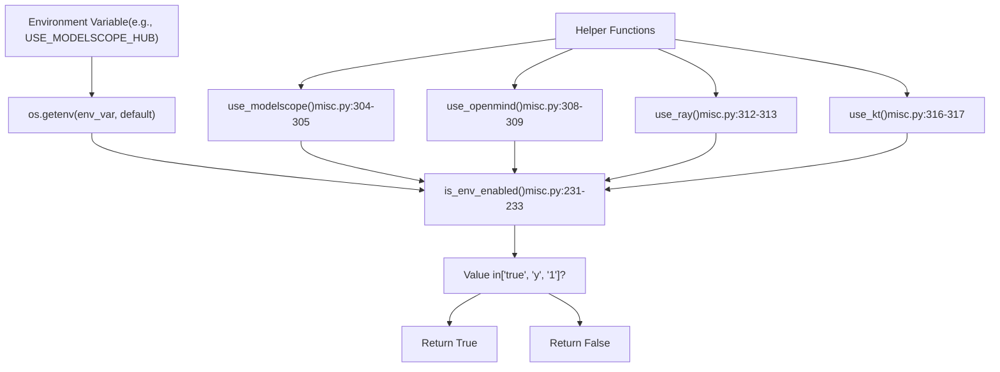
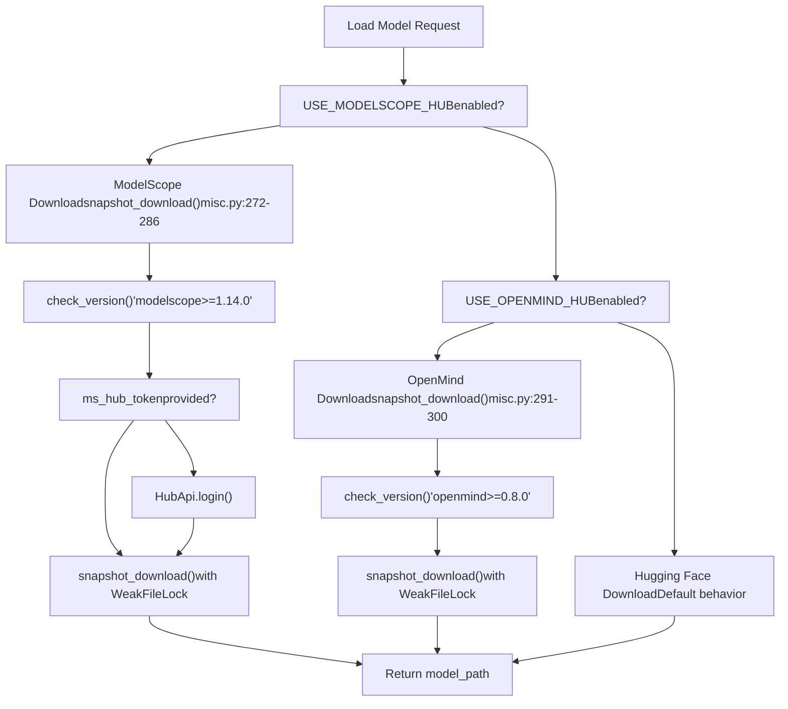
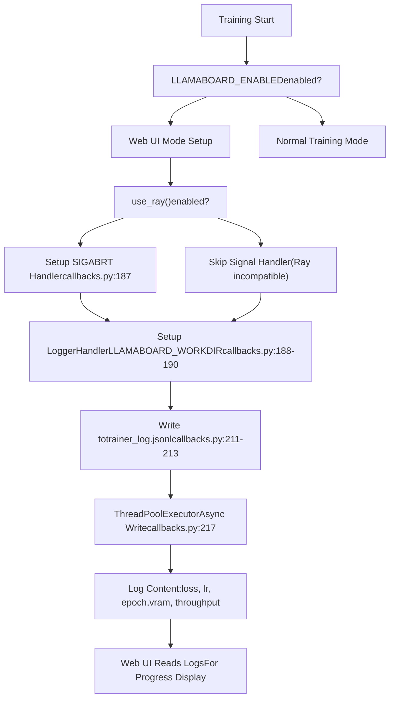
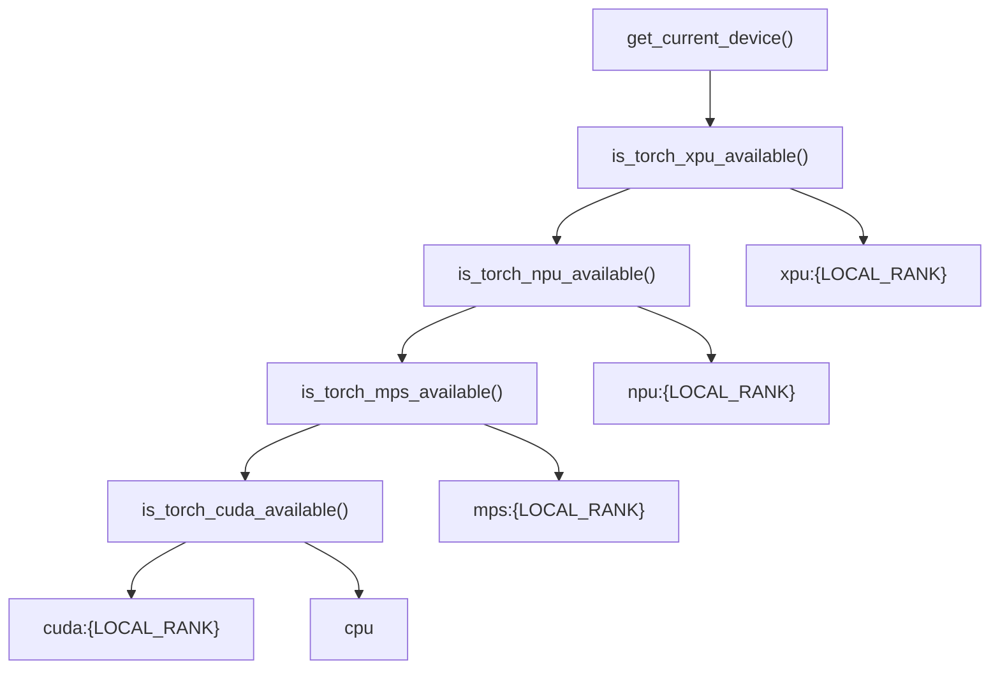
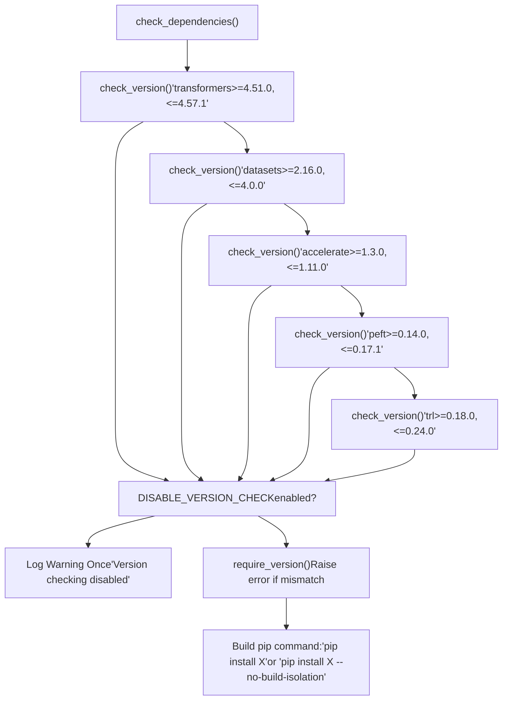
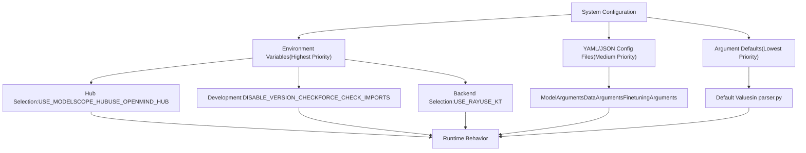
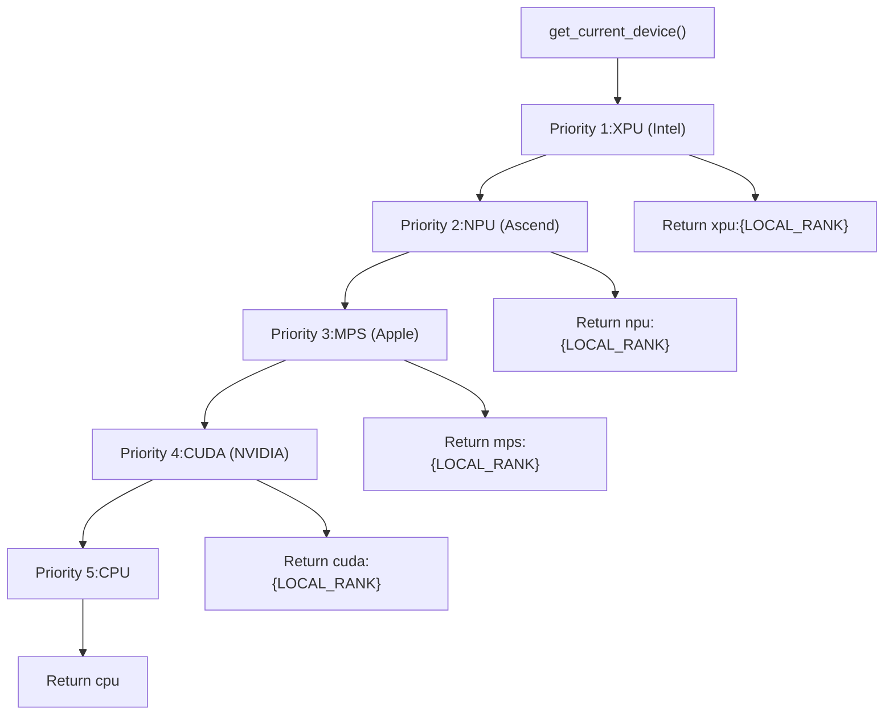

# Environment Variables and Configuration

Relevant source files

-   [src/llamafactory/\_\_init\_\_.py](https://github.com/hiyouga/LlamaFactory/blob/355d5c5e/src/llamafactory/__init__.py)
-   [src/llamafactory/extras/env.py](https://github.com/hiyouga/LlamaFactory/blob/355d5c5e/src/llamafactory/extras/env.py)
-   [src/llamafactory/extras/misc.py](https://github.com/hiyouga/LlamaFactory/blob/355d5c5e/src/llamafactory/extras/misc.py)
-   [src/llamafactory/extras/packages.py](https://github.com/hiyouga/LlamaFactory/blob/355d5c5e/src/llamafactory/extras/packages.py)
-   [src/llamafactory/model/model\_utils/attention.py](https://github.com/hiyouga/LlamaFactory/blob/355d5c5e/src/llamafactory/model/model_utils/attention.py)
-   [src/llamafactory/model/model\_utils/liger\_kernel.py](https://github.com/hiyouga/LlamaFactory/blob/355d5c5e/src/llamafactory/model/model_utils/liger_kernel.py)
-   [src/llamafactory/model/model\_utils/longlora.py](https://github.com/hiyouga/LlamaFactory/blob/355d5c5e/src/llamafactory/model/model_utils/longlora.py)
-   [src/llamafactory/model/model\_utils/moe.py](https://github.com/hiyouga/LlamaFactory/blob/355d5c5e/src/llamafactory/model/model_utils/moe.py)
-   [src/llamafactory/model/model\_utils/packing.py](https://github.com/hiyouga/LlamaFactory/blob/355d5c5e/src/llamafactory/model/model_utils/packing.py)
-   [src/llamafactory/model/model\_utils/valuehead.py](https://github.com/hiyouga/LlamaFactory/blob/355d5c5e/src/llamafactory/model/model_utils/valuehead.py)
-   [src/llamafactory/train/callbacks.py](https://github.com/hiyouga/LlamaFactory/blob/355d5c5e/src/llamafactory/train/callbacks.py)

This document provides a comprehensive reference for environment variables used throughout LlamaFactory and explains how they control system behavior. These variables offer runtime configuration without modifying code or configuration files, enabling flexible deployment across different environments and use cases.

For argument-based configuration (ModelArguments, DataArguments, etc.), see [Configuration System](/hiyouga/LlamaFactory/3-configuration-system). For hardware-specific settings beyond environment variables, see [Hardware Support](/hiyouga/LlamaFactory/9.1-hardware-support).

---

## Overview of Environment Variable System

LlamaFactory uses environment variables to control optional features, hub selection, logging behavior, hardware acceleration, and development settings. These variables are checked at runtime using the `is_env_enabled()` function and dedicated helper functions.

### Environment Variable Checking Mechanism


**Sources:** [src/llamafactory/extras/misc.py231-233](https://github.com/hiyouga/LlamaFactory/blob/355d5c5e/src/llamafactory/extras/misc.py#L231-L233) [src/llamafactory/extras/misc.py304-317](https://github.com/hiyouga/LlamaFactory/blob/355d5c5e/src/llamafactory/extras/misc.py#L304-L317)

---

## Core Environment Variables

### System-Wide Variables

| Variable | Default | Purpose | Code Reference |
| --- | --- | --- | --- |
| `DISABLE_VERSION_CHECK` | `0` | Skip dependency version validation | [misc.py78-80](https://github.com/hiyouga/LlamaFactory/blob/355d5c5e/misc.py#L78-L80) |
| `LLAMAFACTORY_VERBOSITY` | `INFO` | Set logging verbosity level | [\_\_init\_\_.py23](https://github.com/hiyouga/LlamaFactory/blob/355d5c5e/__init__.py#L23-L23) |
| `FORCE_TORCHRUN` | `0` | Force using torchrun for execution | [\_\_init\_\_.py22](https://github.com/hiyouga/LlamaFactory/blob/355d5c5e/__init__.py#L22-L22) |
| `FORCE_CHECK_IMPORTS` | `0` | Force import checking in custom models | [misc.py250-251](https://github.com/hiyouga/LlamaFactory/blob/355d5c5e/misc.py#L250-L251) |

The `DISABLE_VERSION_CHECK` variable is particularly useful in containerized environments where version mismatches are known and acceptable. When enabled, the system logs a warning but proceeds:

```
# From misc.py:78-80if is_env_enabled("DISABLE_VERSION_CHECK") and not mandatory:    logger.warning_rank0_once("Version checking has been disabled, may lead to unexpected behaviors.")    return
```
**Sources:** [src/llamafactory/extras/misc.py76-92](https://github.com/hiyouga/LlamaFactory/blob/355d5c5e/src/llamafactory/extras/misc.py#L76-L92) [src/llamafactory/\_\_init\_\_.py20-26](https://github.com/hiyouga/LlamaFactory/blob/355d5c5e/src/llamafactory/__init__.py#L20-L26)

---

## Hub Selection Variables

LlamaFactory supports three model hubs: Hugging Face (default), ModelScope, and OpenMind. These variables control which hub to use for downloading models and datasets.

### Hub Configuration

| Variable | Default | Purpose | Checked By |
| --- | --- | --- | --- |
| `USE_MODELSCOPE_HUB` | `0` | Use ModelScope hub (China-based) | `use_modelscope()` |
| `USE_OPENMIND_HUB` | `0` | Use OpenMind hub (China-based) | `use_openmind()` |

### Hub Selection Flow


**Implementation Details:**

When `USE_MODELSCOPE_HUB=1`, the system:

1.  Checks for `modelscope>=1.14.0` installation
2.  Uses `WeakFileLock` to prevent concurrent downloads: `~/.cache/llamafactory/modelscope.lock`
3.  Converts `main` revision to `master` for ModelScope compatibility
4.  Supports authentication via `ms_hub_token` in ModelArguments

When `USE_OPENMIND_HUB=1`, the system:

1.  Checks for `openmind>=0.8.0` installation
2.  Uses `WeakFileLock`: `~/.cache/llamafactory/openmind.lock`
3.  No revision conversion needed

**Sources:** [src/llamafactory/extras/misc.py267-302](https://github.com/hiyouga/LlamaFactory/blob/355d5c5e/src/llamafactory/extras/misc.py#L267-L302) [src/llamafactory/extras/misc.py304-309](https://github.com/hiyouga/LlamaFactory/blob/355d5c5e/src/llamafactory/extras/misc.py#L304-L309)

---

## Training and Inference Variables

### Backend Selection

| Variable | Default | Purpose | Affects |
| --- | --- | --- | --- |
| `USE_RAY` | `0` | Enable Ray distributed training | Training launcher |
| `USE_KT` | `0` | Enable KTransformers inference backend | Inference engine selection |

The `USE_RAY` variable enables distributed training via Ray, which provides more flexible resource allocation than standard DDP/FSDP. The `USE_KT` variable enables the KTransformers backend for CPU-GPU hybrid inference.

**Sources:** [src/llamafactory/extras/misc.py312-317](https://github.com/hiyouga/LlamaFactory/blob/355d5c5e/src/llamafactory/extras/misc.py#L312-L317)

### Performance Monitoring

| Variable | Default | Purpose | Code Location |
| --- | --- | --- | --- |
| `RECORD_VRAM` | `0` | Record VRAM usage in training logs | [callbacks.py291-294](https://github.com/hiyouga/LlamaFactory/blob/355d5c5e/callbacks.py#L291-L294) |

When `RECORD_VRAM=1`, the training callback records peak memory statistics:

```
# From callbacks.py:291-294if is_env_enabled("RECORD_VRAM"):    vram_allocated, vram_reserved = get_peak_memory()    logs["vram_allocated"] = round(vram_allocated / (1024**3), 2)    logs["vram_reserved"] = round(vram_reserved / (1024**3), 2)
```
This uses `get_peak_memory()` which supports CUDA, NPU, MPS, and XPU devices.

**Sources:** [src/llamafactory/train/callbacks.py291-294](https://github.com/hiyouga/LlamaFactory/blob/355d5c5e/src/llamafactory/train/callbacks.py#L291-L294) [src/llamafactory/extras/misc.py195-206](https://github.com/hiyouga/LlamaFactory/blob/355d5c5e/src/llamafactory/extras/misc.py#L195-L206)

---

## Web UI and Monitoring Variables

### LLaMA Board Configuration

| Variable | Default | Purpose | Usage |
| --- | --- | --- | --- |
| `LLAMABOARD_ENABLED` | `0` | Enable web UI mode | Controls callback behavior |
| `LLAMABOARD_WORKDIR` | \- | Working directory for UI logs | Log file location |
| `WANDB_PROJECT` | `llamafactory` | WandB project name | External monitoring |

### Web UI Integration Flow


The web UI mode enables special logging behavior:

-   Signal handler for abort functionality (unless Ray is used)
-   Custom logger handler that writes to `LLAMABOARD_WORKDIR`
-   Thread-pooled async log writing to `trainer_log.jsonl`
-   Simplified console output with key metrics

**Sources:** [src/llamafactory/train/callbacks.py185-190](https://github.com/hiyouga/LlamaFactory/blob/355d5c5e/src/llamafactory/train/callbacks.py#L185-L190) [src/llamafactory/train/callbacks.py211-306](https://github.com/hiyouga/LlamaFactory/blob/355d5c5e/src/llamafactory/train/callbacks.py#L211-L306)

### WandB Integration

The `WANDB_PROJECT` variable sets the default project name for Weights & Biases integration:

```
# From callbacks.py:353os.environ["WANDB_PROJECT"] = os.getenv("WANDB_PROJECT", "llamafactory")
```
This is used when `report_to` includes `"wandb"` in TrainingArguments.

**Sources:** [src/llamafactory/train/callbacks.py353-370](https://github.com/hiyouga/LlamaFactory/blob/355d5c5e/src/llamafactory/train/callbacks.py#L353-L370)

---

## Hardware and Device Variables

### Device Selection

| Variable | Default | Purpose | Device Type |
| --- | --- | --- | --- |
| `LOCAL_RANK` | `0` | Device index in distributed training | All accelerators |

The `LOCAL_RANK` variable is standard in distributed training and determines which GPU/NPU/XPU to use:


**Sources:** [src/llamafactory/extras/misc.py144-157](https://github.com/hiyouga/LlamaFactory/blob/355d5c5e/src/llamafactory/extras/misc.py#L144-L157)

### Network Configuration

| Variable | Purpose | Default Behavior |
| --- | --- | --- |
| `no_proxy` | Exclude localhost from proxy | Set to `localhost,127.0.0.1,0.0.0.0` |
| `http_proxy`, `HTTP_PROXY` | HTTP proxy settings | Cleared if IPv6 enabled |
| `https_proxy`, `HTTPS_PROXY` | HTTPS proxy settings | Cleared if IPv6 enabled |
| `all_proxy`, `ALL_PROXY` | All-protocol proxy | Cleared if IPv6 enabled |

The `fix_proxy()` function handles proxy configuration for Gradio UI:

```
# From misc.py:329-338def fix_proxy(ipv6_enabled: bool = False) -> None:    os.environ["no_proxy"] = "localhost,127.0.0.1,0.0.0.0"    if ipv6_enabled:        os.environ.pop("http_proxy", None)        os.environ.pop("HTTP_PROXY", None)        # ... removes all proxy settings
```
**Sources:** [src/llamafactory/extras/misc.py329-338](https://github.com/hiyouga/LlamaFactory/blob/355d5c5e/src/llamafactory/extras/misc.py#L329-L338)

---

## Development and Debugging Variables

### Version Control and Validation


**Version Checking Behavior:**

-   Non-mandatory checks: Can be skipped with `DISABLE_VERSION_CHECK=1`
-   Mandatory checks: Cannot be skipped (e.g., for ModelScope/OpenMind dependencies)
-   Special handling: `gptmodel` and `autoawq` use `--no-build-isolation` flag

**Sources:** [src/llamafactory/extras/misc.py76-102](https://github.com/hiyouga/LlamaFactory/blob/355d5c5e/src/llamafactory/extras/misc.py#L76-L102)

### Import Validation

| Variable | Default | Purpose | Affects |
| --- | --- | --- | --- |
| `FORCE_CHECK_IMPORTS` | `0` | Force import checking in custom models | Flash Attention imports |

The `skip_check_imports()` function modifies Transformers' dynamic module behavior:

```
# From misc.py:248-251def skip_check_imports() -> None:    if not is_env_enabled("FORCE_CHECK_IMPORTS"):        transformers.dynamic_module_utils.check_imports = get_relative_imports
```
This avoids errors when custom model files reference Flash Attention but it's not installed.

**Sources:** [src/llamafactory/extras/misc.py248-251](https://github.com/hiyouga/LlamaFactory/blob/355d5c5e/src/llamafactory/extras/misc.py#L248-L251)

---

## Environment Variable Usage Patterns

### Configuration Precedence


**Key Principles:**

1.  Environment variables cannot be overridden by config files
2.  Used for deployment-specific settings (hubs, backends, debugging)
3.  Checked at runtime, allowing dynamic behavior without code changes
4.  Boolean variables use string values: `"true"`, `"y"`, `"1"` (case-insensitive)

**Sources:** [src/llamafactory/extras/misc.py231-233](https://github.com/hiyouga/LlamaFactory/blob/355d5c5e/src/llamafactory/extras/misc.py#L231-L233)

### Common Usage Scenarios

| Scenario | Variables | Purpose |
| --- | --- | --- |
| China Deployment | `USE_MODELSCOPE_HUB=1` | Use domestic model hub |
| Production Inference | `USE_KT=1` | Enable CPU-GPU hybrid inference |
| Debugging Training | `RECORD_VRAM=1`
`LLAMAFACTORY_VERBOSITY=DEBUG` | Monitor memory usage |
| Web UI Development | `LLAMABOARD_ENABLED=1`
`LLAMABOARD_WORKDIR=/tmp` | Test UI integration |
| Container Deployment | `DISABLE_VERSION_CHECK=1` | Skip version validation |
| Distributed Training | `LOCAL_RANK=0-N` | Set by torchrun automatically |

---

## Complete Environment Variable Reference Table

| Variable | Type | Default | Valid Values | Primary Use Case |
| --- | --- | --- | --- | --- |
| `DISABLE_VERSION_CHECK` | Boolean | `0` | `0`, `1`, `true`, `y` | Skip dependency validation |
| `RECORD_VRAM` | Boolean | `0` | `0`, `1`, `true`, `y` | Log VRAM usage |
| `FORCE_TORCHRUN` | Boolean | `0` | `0`, `1`, `true`, `y` | Force distributed launcher |
| `LLAMAFACTORY_VERBOSITY` | String | `INFO` | `DEBUG`, `INFO`, `WARN`, `ERROR` | Set log level |
| `USE_MODELSCOPE_HUB` | Boolean | `0` | `0`, `1`, `true`, `y` | ModelScope hub access |
| `USE_OPENMIND_HUB` | Boolean | `0` | `0`, `1`, `true`, `y` | OpenMind hub access |
| `USE_RAY` | Boolean | `0` | `0`, `1`, `true`, `y` | Ray distributed training |
| `USE_KT` | Boolean | `0` | `0`, `1`, `true`, `y` | KTransformers backend |
| `FORCE_CHECK_IMPORTS` | Boolean | `0` | `0`, `1`, `true`, `y` | Validate custom imports |
| `LLAMABOARD_ENABLED` | Boolean | `0` | `0`, `1`, `true`, `y` | Enable web UI mode |
| `LLAMABOARD_WORKDIR` | Path | \- | Any valid path | Web UI log directory |
| `WANDB_PROJECT` | String | `llamafactory` | Any string | WandB project name |
| `LOCAL_RANK` | Integer | `0` | `0-N` | Device rank (set by launcher) |
| `no_proxy` | String | \- | Comma-separated hosts | Proxy bypass list |
| `http_proxy` | String | \- | URL | HTTP proxy address |
| `https_proxy` | String | \- | URL | HTTPS proxy address |

**Sources:** [src/llamafactory/extras/misc.py](https://github.com/hiyouga/LlamaFactory/blob/355d5c5e/src/llamafactory/extras/misc.py) [src/llamafactory/train/callbacks.py](https://github.com/hiyouga/LlamaFactory/blob/355d5c5e/src/llamafactory/train/callbacks.py) [src/llamafactory/\_\_init\_\_.py](https://github.com/hiyouga/LlamaFactory/blob/355d5c5e/src/llamafactory/__init__.py)

---

## Setting Environment Variables

### Shell (Linux/macOS)

```
# Single commandDISABLE_VERSION_CHECK=1 llamafactory-cli train config.yaml # Session-wideexport USE_MODELSCOPE_HUB=1export RECORD_VRAM=1llamafactory-cli train config.yaml # Multiple variablesLLAMABOARD_ENABLED=1 LLAMABOARD_WORKDIR=/tmp llamafactory-cli webui
```
### Docker

```
ENV USE_MODELSCOPE_HUB=1ENV DISABLE_VERSION_CHECK=1ENV RECORD_VRAM=1
```
### Python Script

```
import os os.environ["USE_MODELSCOPE_HUB"] = "1"os.environ["RECORD_VRAM"] = "1" from llamafactory.train import run_exprun_exp()
```
### Distributed Training

```
# torchrun sets LOCAL_RANK automaticallytorchrun --nproc_per_node 4 \    -m llamafactory.cli train config.yaml
```
The `LOCAL_RANK` variable is automatically set by PyTorch's distributed launcher and should not be manually configured.

---

## Implementation Details

### is\_env\_enabled() Function

The core function for checking boolean environment variables:

```
# From misc.py:231-233def is_env_enabled(env_var: str, default: str = "0") -> bool:    return os.getenv(env_var, default).lower() in ["true", "y", "1"]
```
**Behavior:**

-   Case-insensitive matching
-   Default value is `"0"` (disabled)
-   Accepts: `"true"`, `"TRUE"`, `"y"`, `"Y"`, `"1"`
-   All other values treated as false

**Sources:** [src/llamafactory/extras/misc.py231-233](https://github.com/hiyouga/LlamaFactory/blob/355d5c5e/src/llamafactory/extras/misc.py#L231-L233)

### Device Detection Hierarchy


The device selection uses a fixed priority order, checking hardware availability in sequence. The `LOCAL_RANK` environment variable is read to determine which device index to use.

**Sources:** [src/llamafactory/extras/misc.py144-157](https://github.com/hiyouga/LlamaFactory/blob/355d5c5e/src/llamafactory/extras/misc.py#L144-L157) [src/llamafactory/extras/misc.py160-171](https://github.com/hiyouga/LlamaFactory/blob/355d5c5e/src/llamafactory/extras/misc.py#L160-L171)
