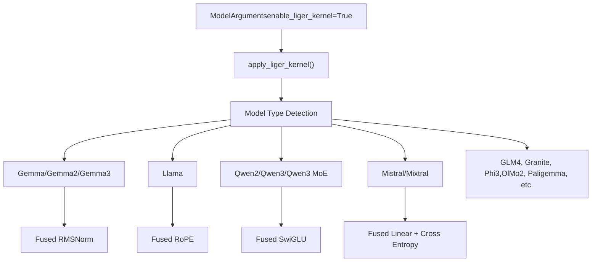
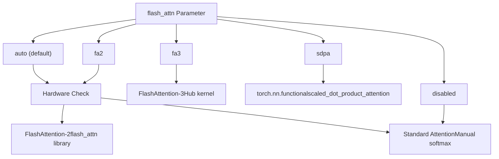
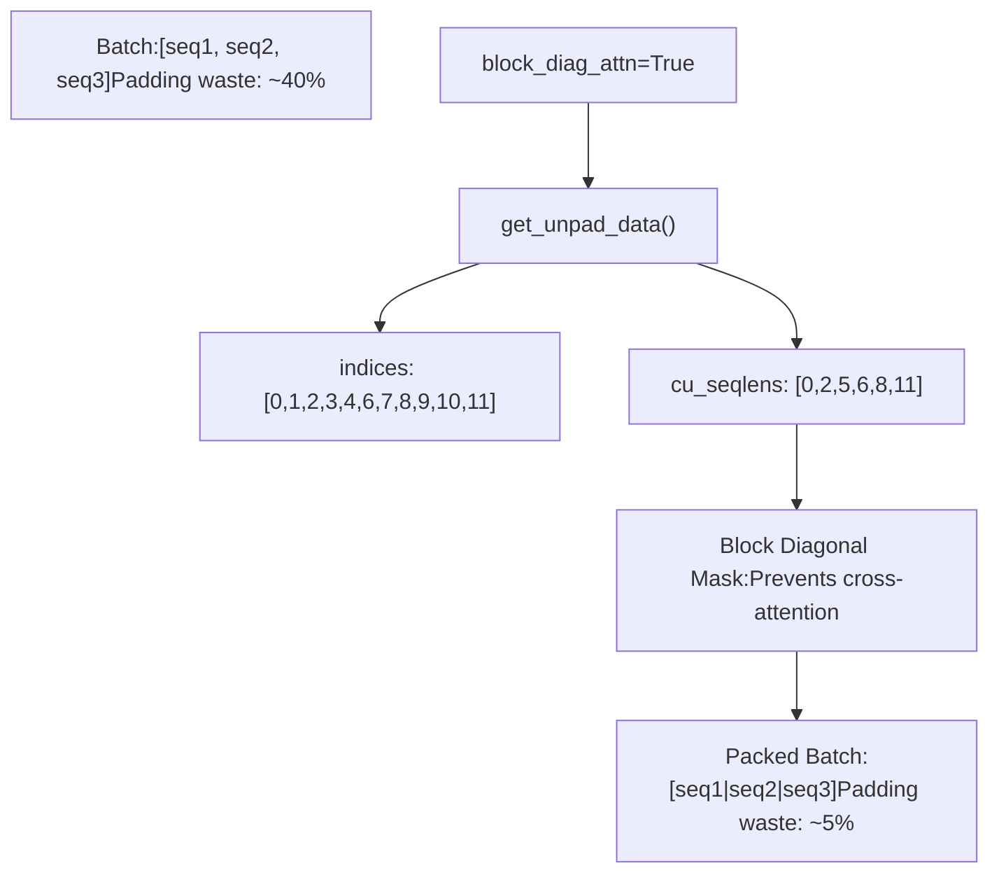
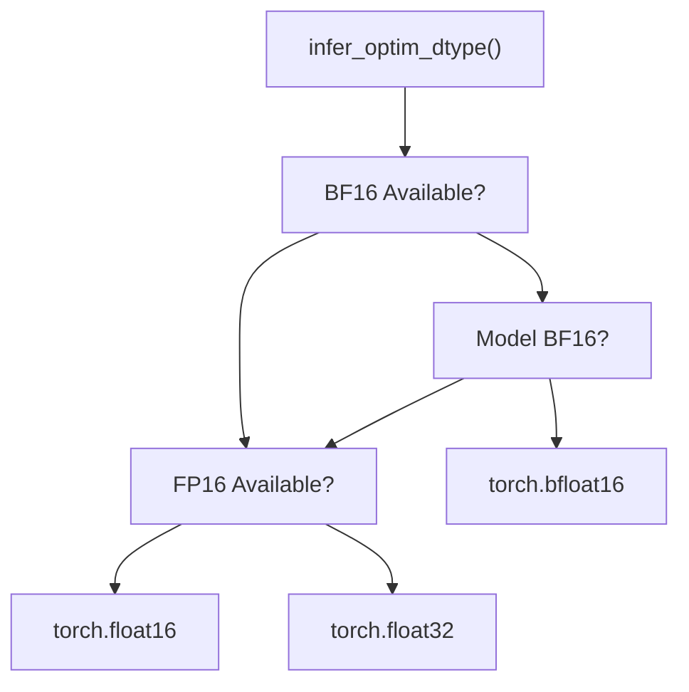
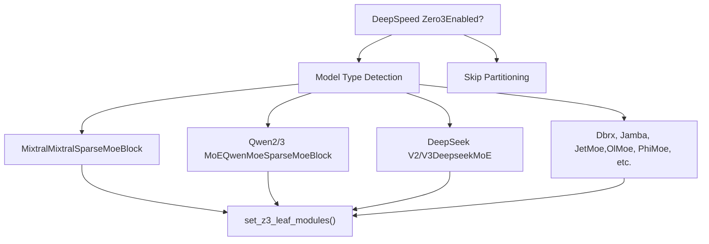

# Performance Optimization

Relevant source files

-   [src/llamafactory/\_\_init\_\_.py](https://github.com/hiyouga/LlamaFactory/blob/355d5c5e/src/llamafactory/__init__.py)
-   [src/llamafactory/extras/env.py](https://github.com/hiyouga/LlamaFactory/blob/355d5c5e/src/llamafactory/extras/env.py)
-   [src/llamafactory/extras/misc.py](https://github.com/hiyouga/LlamaFactory/blob/355d5c5e/src/llamafactory/extras/misc.py)
-   [src/llamafactory/extras/packages.py](https://github.com/hiyouga/LlamaFactory/blob/355d5c5e/src/llamafactory/extras/packages.py)
-   [src/llamafactory/model/model\_utils/attention.py](https://github.com/hiyouga/LlamaFactory/blob/355d5c5e/src/llamafactory/model/model_utils/attention.py)
-   [src/llamafactory/model/model\_utils/liger\_kernel.py](https://github.com/hiyouga/LlamaFactory/blob/355d5c5e/src/llamafactory/model/model_utils/liger_kernel.py)
-   [src/llamafactory/model/model\_utils/longlora.py](https://github.com/hiyouga/LlamaFactory/blob/355d5c5e/src/llamafactory/model/model_utils/longlora.py)
-   [src/llamafactory/model/model\_utils/moe.py](https://github.com/hiyouga/LlamaFactory/blob/355d5c5e/src/llamafactory/model/model_utils/moe.py)
-   [src/llamafactory/model/model\_utils/packing.py](https://github.com/hiyouga/LlamaFactory/blob/355d5c5e/src/llamafactory/model/model_utils/packing.py)
-   [src/llamafactory/model/model\_utils/valuehead.py](https://github.com/hiyouga/LlamaFactory/blob/355d5c5e/src/llamafactory/model/model_utils/valuehead.py)
-   [src/llamafactory/train/callbacks.py](https://github.com/hiyouga/LlamaFactory/blob/355d5c5e/src/llamafactory/train/callbacks.py)

This document covers performance optimization techniques available in LlamaFactory for accelerating training and reducing memory usage. These techniques include kernel optimizations, attention mechanisms, precision control, memory-efficient training strategies, and hardware-specific optimizations.

For hardware-specific configurations (CUDA, NPU, ROCm), see [Hardware Support](/hiyouga/LlamaFactory/9.1-hardware-support). For distributed training strategies (DDP, FSDP, DeepSpeed), see [Distributed Training](/hiyouga/LlamaFactory/6.4-distributed-training). For MoE-specific configurations, see [Mixture-of-Experts Models](/hiyouga/LlamaFactory/9.4-mixture-of-experts-(moe)-models).

---

## Overview

LlamaFactory provides multiple layers of performance optimization:

| Optimization Layer | Primary Benefit | Configuration |
| --- | --- | --- |
| **Kernel Optimizations** | Faster computation, reduced memory | Liger kernel, custom CUDA kernels |
| **Attention Mechanisms** | 2-5x speedup on long sequences | FlashAttention-2/3, SDPA |
| **Precision Control** | Reduced memory, faster training | FP16, BF16, FP8 |
| **Memory Techniques** | Lower VRAM usage | Gradient checkpointing, sequence packing |
| **Specialized Strategies** | Context-specific gains | LongLoRA, MoE leaf modules |

Performance optimizations are configured through `ModelArguments` and `TrainingArguments`, with most features auto-detecting hardware capabilities.

**Sources:** [src/llamafactory/model/model\_utils/liger\_kernel.py1-98](https://github.com/hiyouga/LlamaFactory/blob/355d5c5e/src/llamafactory/model/model_utils/liger_kernel.py#L1-L98) [src/llamafactory/model/model\_utils/attention.py1-104](https://github.com/hiyouga/LlamaFactory/blob/355d5c5e/src/llamafactory/model/model_utils/attention.py#L1-L104)

---

## Kernel Optimizations

### Liger Kernel

Liger kernel is a collection of fused CUDA kernels that optimize transformer operations by combining multiple operations into single GPU kernels. This reduces memory bandwidth requirements and accelerates training.


**Liger Kernel Application Flow**

#### Enabling Liger Kernel

Set `enable_liger_kernel=True` in model arguments:

```
# config.yamlmodel_name_or_path: meta-llama/Llama-3-8Benable_liger_kernel: true
```
The `apply_liger_kernel()` function [src/llamafactory/model/model\_utils/liger\_kernel.py30-98](https://github.com/hiyouga/LlamaFactory/blob/355d5c5e/src/llamafactory/model/model_utils/liger_kernel.py#L30-L98) automatically detects the model type and applies appropriate optimizations. Supported models include:

-   Gemma family: `gemma`, `gemma2`, `gemma3`, `gemma3_text`
-   Llama family: `llama`, `llava`, `mllama`
-   Qwen family: `qwen2`, `qwen2_vl`, `qwen2_5_vl`, `qwen3`, `qwen3_moe`
-   Mistral family: `mistral`, `mixtral`
-   Other models: GLM4/GLM4v, Granite, Phi3, OlMo2, Paligemma

#### Fused Cross-Entropy Handling

For training stages that require logits (e.g., reward modeling, PPO), Liger automatically disables fused linear cross-entropy:

```
if require_logits and "fused_linear_cross_entropy" in inspect.signature(apply_liger_kernel).parameters:    kwargs = {"fused_linear_cross_entropy": False, "cross_entropy": True}
```
[src/llamafactory/model/model\_utils/liger\_kernel.py90-94](https://github.com/hiyouga/LlamaFactory/blob/355d5c5e/src/llamafactory/model/model_utils/liger_kernel.py#L90-L94)

This ensures compatibility across all training stages while maximizing optimization when possible.

**Sources:** [src/llamafactory/model/model\_utils/liger\_kernel.py30-98](https://github.com/hiyouga/LlamaFactory/blob/355d5c5e/src/llamafactory/model/model_utils/liger_kernel.py#L30-L98)

---

## Attention Mechanism Optimizations

### FlashAttention and SDPA

LlamaFactory supports multiple attention implementations with different performance characteristics:

| Implementation | Speed | Memory | Use Case |
| --- | --- | --- | --- |
| **FlashAttention-2** | Fastest | Lowest | Training long sequences (requires GPU) |
| **FlashAttention-3** | Ultra-fast | Ultra-low | GPT-OSS models only |
| **SDPA** | Fast | Low | General purpose, no extra dependencies |
| **Eager** | Baseline | High | Debugging, compatibility |


**Attention Implementation Selection**

#### Configuration

Set the `flash_attn` parameter in `ModelArguments`:

```
# config.yamlmodel_name_or_path: meta-llama/Llama-3-8Bflash_attn: fa2  # auto | fa2 | sdpa | disabled
```
The `configure_attn_implementation()` function [src/llamafactory/model/model\_utils/attention.py31-90](https://github.com/hiyouga/LlamaFactory/blob/355d5c5e/src/llamafactory/model/model_utils/attention.py#L31-L90) handles:

1.  **Auto mode**: Automatically selects the best available implementation
2.  **FlashAttention-2**: Requires `flash-attn` library and compatible GPU
3.  **SDPA**: Requires PyTorch >= 2.1.1
4.  **Eager**: Always available fallback

#### Special Cases

**Gemma 2 Models**: Must use FlashAttention-2 for soft-capping attention:

```
if model_type == "gemma2":    if model_args.flash_attn == AttentionFunction.AUTO or model_args.flash_attn == AttentionFunction.FA2:        if is_flash_attn_2_available():            model_args.flash_attn = AttentionFunction.FA2
```
[src/llamafactory/model/model\_utils/attention.py46-54](https://github.com/hiyouga/LlamaFactory/blob/355d5c5e/src/llamafactory/model/model_utils/attention.py#L46-L54)

**GPT-OSS Models**: Automatically use FlashAttention-3 with attention sink:

```
if model_type == "gpt_oss":    flash_attn3_kernel = "kernels-community/vllm-flash-attn3"    load_and_register_kernel(flash_attn3_kernel)    setattr(config, "_attn_implementation", flash_attn3_kernel)
```
[src/llamafactory/model/model\_utils/attention.py34-44](https://github.com/hiyouga/LlamaFactory/blob/355d5c5e/src/llamafactory/model/model_utils/attention.py#L34-L44)

**Sources:** [src/llamafactory/model/model\_utils/attention.py31-104](https://github.com/hiyouga/LlamaFactory/blob/355d5c5e/src/llamafactory/model/model_utils/attention.py#L31-L104)

### Sequence Packing with Block Diagonal Attention

Sequence packing concatenates multiple sequences into a single batch to maximize GPU utilization. Block diagonal attention masks prevent cross-contamination between sequences.


**Sequence Packing Architecture**

#### Enabling Sequence Packing

Set `block_diag_attn=True` in model arguments:

```
# config.yamlmodel_name_or_path: meta-llama/Llama-3-8Bblock_diag_attn: true
```
The `configure_packing()` function [src/llamafactory/model/model\_utils/packing.py110-118](https://github.com/hiyouga/LlamaFactory/blob/355d5c5e/src/llamafactory/model/model_utils/packing.py#L110-L118) monkey-patches `transformers.modeling_flash_attention_utils._get_unpad_data` to compute proper attention indices.

#### Block Diagonal Attention Mechanics

The `get_unpad_data()` function [src/llamafactory/model/model\_utils/packing.py81-107](https://github.com/hiyouga/LlamaFactory/blob/355d5c5e/src/llamafactory/model/model_utils/packing.py#L81-L107) computes:

1.  **Indices**: Non-masked token positions from flattened sequences
2.  **Cumulative sequence lengths**: Starting positions of each sequence
3.  **Max sequence length**: For buffer allocation

Example for attention mask `[[1,1,2,2,2,0], [1,2,2,3,3,3]]`:

```
indices = [0, 1, 2, 3, 4, 6, 7, 8, 9, 10, 11]  # Non-zero positionscu_seqlens = [0, 2, 5, 6, 8, 11]  # Cumulative lengthsmax_seqlen = 3  # Longest individual sequence
```
This ensures FlashAttention's varlen functions process each sequence independently while maintaining efficiency.

**Sources:** [src/llamafactory/model/model\_utils/packing.py55-118](https://github.com/hiyouga/LlamaFactory/blob/355d5c5e/src/llamafactory/model/model_utils/packing.py#L55-L118)

### LongLoRA: Shifted Sparse Attention

LongLoRA enables efficient training on long contexts by using shifted sparse attention patterns. This reduces computational complexity from O(n²) to O(n√n) for sequence length n.

#### Enabling LongLoRA

Set `shift_attn=True` in model arguments:

```
# config.yamlmodel_name_or_path: meta-llama/Llama-3-8Bshift_attn: true
```
The `configure_longlora()` function [src/llamafactory/model/model\_utils/longlora.py359-371](https://github.com/hiyouga/LlamaFactory/blob/355d5c5e/src/llamafactory/model/model_utils/longlora.py#L359-L371) patches attention implementations for supported models (Llama, Mistral, Qwen, etc.).

#### Shift Attention Mechanism

LongLoRA divides sequences into groups and shifts attention heads:

1.  **Group division**: Sequence split into groups of size `q_len * 0.25`
2.  **Head shifting**: Half the attention heads shifted by `-groupsz // 2`
3.  **Attention computation**: Standard attention within groups
4.  **Shift restoration**: Reverse shift to reconstruct full sequence

```
if getattr(self.config, "group_size_ratio", None) and self.training:    groupsz = int(q_len * getattr(self.config, "group_size_ratio"))    num_groups = q_len // groupsz        # Shift half the heads    state = torch.cat(        (state[:, :, :self.num_heads // 2],          state[:, :, self.num_heads // 2:].roll(-groupsz // 2, dims=1)),        dim=2    )
```
[src/llamafactory/model/model\_utils/longlora.py96-104](https://github.com/hiyouga/LlamaFactory/blob/355d5c5e/src/llamafactory/model/model_utils/longlora.py#L96-L104)

This pattern is implemented for standard attention [src/llamafactory/model/model\_utils/longlora.py56-136](https://github.com/hiyouga/LlamaFactory/blob/355d5c5e/src/llamafactory/model/model_utils/longlora.py#L56-L136) FlashAttention-2 [src/llamafactory/model/model\_utils/longlora.py141-244](https://github.com/hiyouga/LlamaFactory/blob/355d5c5e/src/llamafactory/model/model_utils/longlora.py#L141-L244) and SDPA [src/llamafactory/model/model\_utils/longlora.py249-349](https://github.com/hiyouga/LlamaFactory/blob/355d5c5e/src/llamafactory/model/model_utils/longlora.py#L249-L349)

**Sources:** [src/llamafactory/model/model\_utils/longlora.py359-371](https://github.com/hiyouga/LlamaFactory/blob/355d5c5e/src/llamafactory/model/model_utils/longlora.py#L359-L371) [src/llamafactory/model/model\_utils/longlora.py56-349](https://github.com/hiyouga/LlamaFactory/blob/355d5c5e/src/llamafactory/model/model_utils/longlora.py#L56-L349)

---

## Memory Optimization Techniques

### Gradient Checkpointing

Gradient checkpointing trades computation for memory by recomputing activations during backward pass instead of storing them. This is configured through `TrainingArguments`:

```
# config.yamlgradient_checkpointing: truegradient_checkpointing_kwargs:  use_reentrant: false  # Recommended for PyTorch >= 2.0
```
Gradient checkpointing can reduce memory usage by 30-50% with a 10-20% training time increase.

### Mixed Precision Training

LlamaFactory automatically selects optimal precision based on hardware capabilities:


**Precision Selection Logic**

The `infer_optim_dtype()` function [src/llamafactory/extras/misc.py214-222](https://github.com/hiyouga/LlamaFactory/blob/355d5c5e/src/llamafactory/extras/misc.py#L214-L222) prioritizes:

1.  **BF16**: If available and model is BF16 or unspecified
2.  **FP16**: If GPU/NPU available but no BF16
3.  **FP32**: Fallback for CPU or incompatible hardware

Hardware availability is checked at module initialization:

```
_is_fp16_available = is_torch_npu_available() or is_torch_cuda_available()_is_bf16_available = is_torch_bf16_gpu_available() or (is_torch_npu_available() and torch.npu.is_bf16_supported())
```
[src/llamafactory/extras/misc.py41-45](https://github.com/hiyouga/LlamaFactory/blob/355d5c5e/src/llamafactory/extras/misc.py#L41-L45)

**Sources:** [src/llamafactory/extras/misc.py214-222](https://github.com/hiyouga/LlamaFactory/blob/355d5c5e/src/llamafactory/extras/misc.py#L214-L222) [src/llamafactory/extras/misc.py41-45](https://github.com/hiyouga/LlamaFactory/blob/355d5c5e/src/llamafactory/extras/misc.py#L41-L45)

### Memory Monitoring

LlamaFactory provides real-time VRAM tracking through the callback system.

#### Enabling VRAM Recording

Set the `RECORD_VRAM` environment variable:

```
export RECORD_VRAM=1llamafactory-cli train config.yaml
```
The `LogCallback` [src/llamafactory/train/callbacks.py170-337](https://github.com/hiyouga/LlamaFactory/blob/355d5c5e/src/llamafactory/train/callbacks.py#L170-L337) logs peak memory usage when enabled:

```
if is_env_enabled("RECORD_VRAM"):    vram_allocated, vram_reserved = get_peak_memory()    logs["vram_allocated"] = round(vram_allocated / (1024**3), 2)    logs["vram_reserved"] = round(vram_reserved / (1024**3), 2)
```
[src/llamafactory/train/callbacks.py291-294](https://github.com/hiyouga/LlamaFactory/blob/355d5c5e/src/llamafactory/train/callbacks.py#L291-L294)

#### Memory Utility Functions

| Function | Purpose | Returns |
| --- | --- | --- |
| `get_current_memory()` | Available and total memory | `(available_bytes, total_bytes)` |
| `get_peak_memory()` | Peak allocated and reserved memory | `(allocated_bytes, reserved_bytes)` |
| `torch_gc()` | Force garbage collection and cache clearing | None |

These functions [src/llamafactory/extras/misc.py181-265](https://github.com/hiyouga/LlamaFactory/blob/355d5c5e/src/llamafactory/extras/misc.py#L181-L265) support multiple hardware backends (CUDA, NPU, MPS, XPU).

**Sources:** [src/llamafactory/train/callbacks.py291-294](https://github.com/hiyouga/LlamaFactory/blob/355d5c5e/src/llamafactory/train/callbacks.py#L291-L294) [src/llamafactory/extras/misc.py181-265](https://github.com/hiyouga/LlamaFactory/blob/355d5c5e/src/llamafactory/extras/misc.py#L181-L265)

---

## MoE-Specific Optimizations

Mixture-of-Experts models require special handling for DeepSpeed Zero3 to prevent expert fragmentation.

### DeepSpeed Zero3 Leaf Modules


**MoE Leaf Module Configuration**

The `add_z3_leaf_module()` function [src/llamafactory/model/model\_utils/moe.py43-139](https://github.com/hiyouga/LlamaFactory/blob/355d5c5e/src/llamafactory/model/model_utils/moe.py#L43-L139) marks MoE blocks as leaf modules, preventing DeepSpeed from partitioning experts across GPUs. This is critical because:

1.  Experts have unique parameters that shouldn't be sharded
2.  Router logic requires all experts on the same device
3.  Communication overhead would negate MoE efficiency

Supported MoE architectures:

-   Mixtral, Phimoe: `SparseMoeBlock`
-   Qwen2/3 MoE: `Qwen[2|3]MoeSparseMoeBlock`
-   DeepSeek V2/V3: Custom `DeepseekV[2|3]MoE`
-   Llama 4: `Llama4TextMoe`
-   Specialized: Dbrx, Jamba, JetMoe, OlMoe, Granitemoe, etc.

### MoE Auxiliary Loss

Configure router auxiliary loss for load balancing:

```
# config.yamlmodel_name_or_path: mistralai/Mixtral-8x7B-v0.1moe_aux_loss_coef: 0.01  # Typical range: 0.001 - 0.1
```
The `configure_moe()` function [src/llamafactory/model/model\_utils/moe.py141-190](https://github.com/hiyouga/LlamaFactory/blob/355d5c5e/src/llamafactory/model/model_utils/moe.py#L141-L190) sets model-specific configuration:

```
if model_type in ["mixtral", "qwen2_moe", "llama4", ...]:    setattr(config, "output_router_logits", True)    setattr(config, "router_aux_loss_coef", model_args.moe_aux_loss_coef)
```
Different models use different parameter names (`router_aux_loss_coef`, `aux_loss_alpha`, `aux_loss_coef`), which are handled automatically.

**Sources:** [src/llamafactory/model/model\_utils/moe.py43-190](https://github.com/hiyouga/LlamaFactory/blob/355d5c5e/src/llamafactory/model/model_utils/moe.py#L43-L190)

---

## Performance Monitoring

### Tokens Per Second (TPS)

LlamaFactory tracks effective throughput accounting for data packing and distributed training:

```
def calculate_tps(dataset, metrics, stage):    effective_token_num = 0    for data in dataset:        if stage == "sft":            effective_token_num += len(data["input_ids"])        elif stage == "rm":            effective_token_num += len(data["chosen_input_ids"]) + len(data["rejected_input_ids"])        result = effective_token_num * metrics["epoch"] / metrics["train_runtime"]    return result / dist.get_world_size() if dist.is_initialized() else result
```
[src/llamafactory/extras/misc.py104-114](https://github.com/hiyouga/LlamaFactory/blob/355d5c5e/src/llamafactory/extras/misc.py#L104-L114)

This provides per-GPU throughput, useful for comparing efficiency across configurations.

### Training Metrics Logging

The `LogCallback` [src/llamafactory/train/callbacks.py268-306](https://github.com/hiyouga/LlamaFactory/blob/355d5c5e/src/llamafactory/train/callbacks.py#L268-L306) tracks:

| Metric | Description | Formula |
| --- | --- | --- |
| `throughput` | Tokens per second | `total_tokens / elapsed_time` |
| `vram_allocated` | Peak allocated VRAM (GB) | From `get_peak_memory()` |
| `vram_reserved` | Peak reserved VRAM (GB) | From `get_peak_memory()` |
| `percentage` | Training progress | `current_steps / total_steps * 100` |
| `remaining_time` | Estimated time to completion | Based on average step time |

Metrics are written to `trainer_log.jsonl` in the output directory for post-training analysis.

**Sources:** [src/llamafactory/train/callbacks.py268-306](https://github.com/hiyouga/LlamaFactory/blob/355d5c5e/src/llamafactory/train/callbacks.py#L268-L306) [src/llamafactory/extras/misc.py104-114](https://github.com/hiyouga/LlamaFactory/blob/355d5c5e/src/llamafactory/extras/misc.py#L104-L114)

---

## Environment Variables for Performance

| Variable | Effect | Default | Use Case |
| --- | --- | --- | --- |
| `DISABLE_VERSION_CHECK` | Skip dependency version validation | `0` | Experimental setups |
| `RECORD_VRAM` | Enable VRAM usage tracking | `0` | Memory profiling |
| `FORCE_TORCHRUN` | Force distributed launcher | `0` | Multi-GPU debugging |
| `FORCE_CHECK_IMPORTS` | Strict import validation | `0` | Custom model compatibility |
| `LLAMAFACTORY_VERBOSITY` | Logging level | `INFO` | Debugging |

Set in shell or configuration:

```
# Enable multiple optimizationsexport RECORD_VRAM=1export DISABLE_VERSION_CHECK=1llamafactory-cli train config.yaml
```
Or programmatically:

```
import osos.environ["RECORD_VRAM"] = "1"
```
The `is_env_enabled()` helper [src/llamafactory/extras/misc.py231-233](https://github.com/hiyouga/LlamaFactory/blob/355d5c5e/src/llamafactory/extras/misc.py#L231-L233) checks boolean environment variables, accepting `"true"`, `"y"`, or `"1"` (case-insensitive).

**Sources:** [src/llamafactory/extras/misc.py231-233](https://github.com/hiyouga/LlamaFactory/blob/355d5c5e/src/llamafactory/extras/misc.py#L231-L233) [src/llamafactory/\_\_init\_\_.py20-26](https://github.com/hiyouga/LlamaFactory/blob/355d5c5e/src/llamafactory/__init__.py#L20-L26)

---

## Performance Configuration Examples

### Maximum Speed Configuration

```
# Optimize for training speed on A100 GPUmodel_name_or_path: meta-llama/Llama-3-8Benable_liger_kernel: trueflash_attn: fa2block_diag_attn: true # Training argumentsbf16: truegradient_checkpointing: falseper_device_train_batch_size: 8gradient_accumulation_steps: 4
```
### Minimum VRAM Configuration

```
# Optimize for memory efficiency on consumer GPUmodel_name_or_path: meta-llama/Llama-3-8Bquantization_bit: 4  # QLoRAenable_liger_kernel: trueflash_attn: fa2 # Training argumentsgradient_checkpointing: truegradient_checkpointing_kwargs:  use_reentrant: falseper_device_train_batch_size: 1gradient_accumulation_steps: 16
```
### Long Context Configuration

```
# Optimize for sequences > 4K tokensmodel_name_or_path: meta-llama/Llama-3-8Bshift_attn: true  # LongLoRAflash_attn: fa2block_diag_attn: true # Training argumentscutoff_len: 8192bf16: truegradient_checkpointing: true
```
---

## Performance Tuning Checklist

When optimizing training performance, follow this checklist:

1.  ✅ **Enable appropriate attention**: FlashAttention-2 for most models, FA3 for GPT-OSS
2.  ✅ **Apply Liger kernel**: If model is supported
3.  ✅ **Use sequence packing**: For datasets with variable lengths
4.  ✅ **Select optimal precision**: BF16 on modern GPUs, FP16 on older hardware
5.  ✅ **Configure gradient checkpointing**: Trade compute for memory when needed
6.  ✅ **Set MoE leaf modules**: For MoE models with DeepSpeed Zero3
7.  ✅ **Monitor VRAM usage**: Use `RECORD_VRAM=1` to identify bottlenecks
8.  ✅ **Tune batch size**: Maximize GPU utilization without OOM
9.  ✅ **Consider LongLoRA**: For training on long sequences
10.  ✅ **Profile throughput**: Use TPS metrics to compare configurations

**Sources:** [src/llamafactory/model/model\_utils/liger\_kernel.py30-98](https://github.com/hiyouga/LlamaFactory/blob/355d5c5e/src/llamafactory/model/model_utils/liger_kernel.py#L30-L98) [src/llamafactory/model/model\_utils/attention.py31-104](https://github.com/hiyouga/LlamaFactory/blob/355d5c5e/src/llamafactory/model/model_utils/attention.py#L31-L104) [src/llamafactory/model/model\_utils/packing.py110-118](https://github.com/hiyouga/LlamaFactory/blob/355d5c5e/src/llamafactory/model/model_utils/packing.py#L110-L118)
