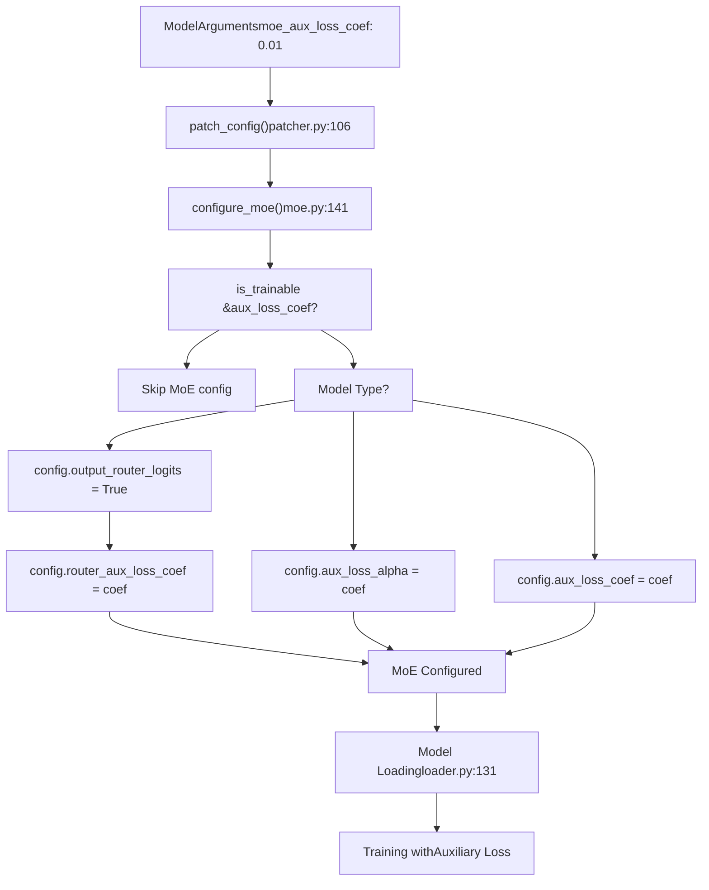
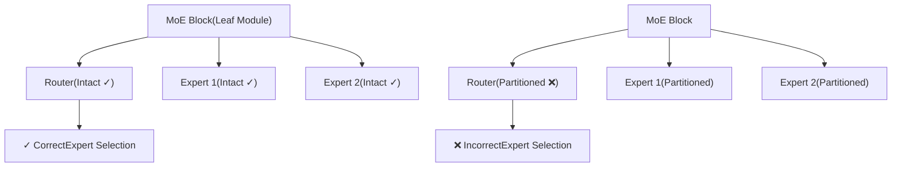
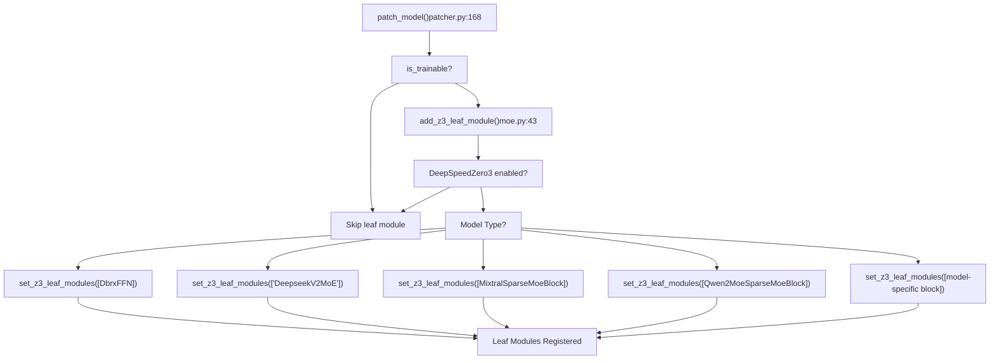
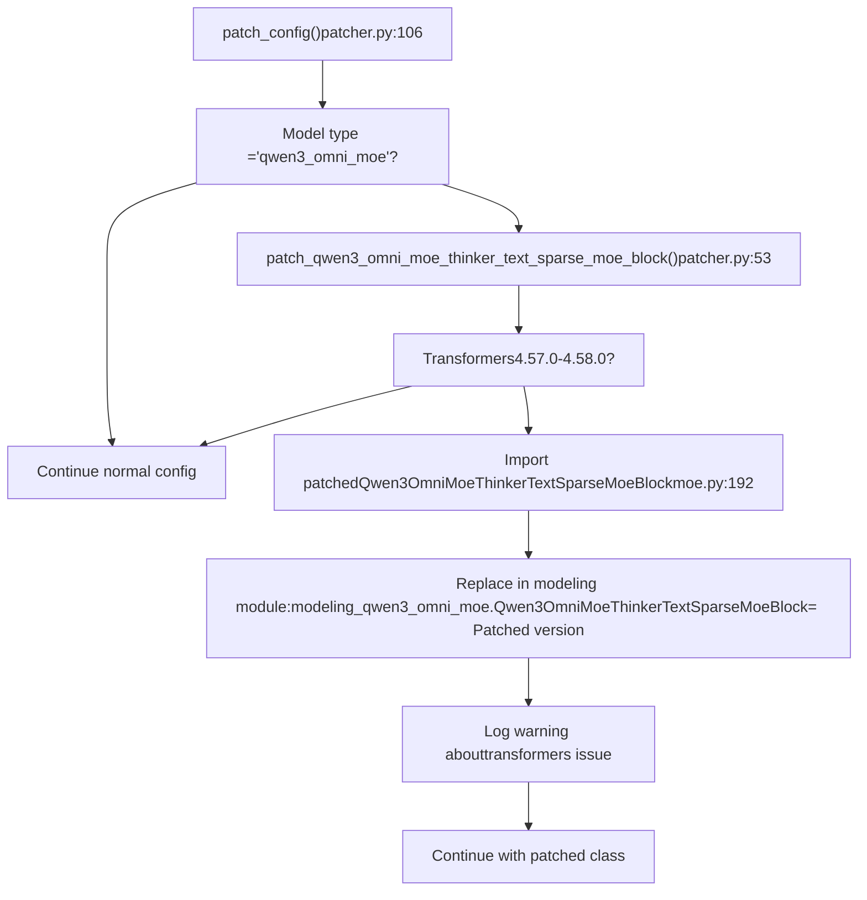

# Mixture-of-Experts (MoE) Models

Relevant source files

-   [src/llamafactory/extras/env.py](https://github.com/hiyouga/LlamaFactory/blob/355d5c5e/src/llamafactory/extras/env.py)
-   [src/llamafactory/extras/packages.py](https://github.com/hiyouga/LlamaFactory/blob/355d5c5e/src/llamafactory/extras/packages.py)
-   [src/llamafactory/hparams/model\_args.py](https://github.com/hiyouga/LlamaFactory/blob/355d5c5e/src/llamafactory/hparams/model_args.py)
-   [src/llamafactory/model/adapter.py](https://github.com/hiyouga/LlamaFactory/blob/355d5c5e/src/llamafactory/model/adapter.py)
-   [src/llamafactory/model/loader.py](https://github.com/hiyouga/LlamaFactory/blob/355d5c5e/src/llamafactory/model/loader.py)
-   [src/llamafactory/model/model\_utils/attention.py](https://github.com/hiyouga/LlamaFactory/blob/355d5c5e/src/llamafactory/model/model_utils/attention.py)
-   [src/llamafactory/model/model\_utils/liger\_kernel.py](https://github.com/hiyouga/LlamaFactory/blob/355d5c5e/src/llamafactory/model/model_utils/liger_kernel.py)
-   [src/llamafactory/model/model\_utils/moe.py](https://github.com/hiyouga/LlamaFactory/blob/355d5c5e/src/llamafactory/model/model_utils/moe.py)
-   [src/llamafactory/model/model\_utils/unsloth.py](https://github.com/hiyouga/LlamaFactory/blob/355d5c5e/src/llamafactory/model/model_utils/unsloth.py)
-   [src/llamafactory/model/model\_utils/valuehead.py](https://github.com/hiyouga/LlamaFactory/blob/355d5c5e/src/llamafactory/model/model_utils/valuehead.py)
-   [src/llamafactory/model/patcher.py](https://github.com/hiyouga/LlamaFactory/blob/355d5c5e/src/llamafactory/model/patcher.py)
-   [src/llamafactory/train/callbacks.py](https://github.com/hiyouga/LlamaFactory/blob/355d5c5e/src/llamafactory/train/callbacks.py)

## Purpose and Scope

This document covers LlamaFactory's specialized support for Mixture-of-Experts (MoE) architectures. MoE models use multiple expert sub-networks with a routing mechanism, requiring special handling during training for proper distributed training integration and auxiliary loss computation.

For general model loading and configuration, see [Model Loading and Configuration](/hiyouga/LlamaFactory/5-model-loading-and-configuration). For distributed training strategies, see [Distributed Training](/hiyouga/LlamaFactory/6.4-distributed-training). For performance optimization techniques applicable to MoE models, see [Performance Optimization](/hiyouga/LlamaFactory/9.3-performance-optimization).

---

## Overview of MoE Support

LlamaFactory provides comprehensive support for MoE models through three main mechanisms:

| Feature | Purpose | Key Function |
| --- | --- | --- |
| **Auxiliary Loss Configuration** | Enable and configure router load balancing loss | `configure_moe()` |
| **DeepSpeed Zero3 Integration** | Register MoE blocks as leaf modules to prevent partitioning | `add_z3_leaf_module()` |
| **Model-Specific Patches** | Fix compatibility issues in certain MoE implementations | `patch_qwen3_omni_moe_thinker_text_sparse_moe_block()` |

**Sources:** [src/llamafactory/model/model\_utils/moe.py1-253](https://github.com/hiyouga/LlamaFactory/blob/355d5c5e/src/llamafactory/model/model_utils/moe.py#L1-L253)

---

## Supported MoE Architectures

LlamaFactory supports 20+ MoE model families. The following table lists all supported architectures:

| Model Type | Router Logits | Aux Loss Parameter | DeepSpeed Zero3 Support | Notes |
| --- | --- | --- | --- | --- |
| `dbrx` | ✓ | `router_aux_loss_coef` | ✓ `DbrxFFN` | Standard MoE |
| `deepseek` | ✗ | `aux_loss_alpha` | ✗ | Custom loss naming |
| `deepseek_v2` | ✗ | ✗ | ✓ `DeepseekV2MoE` | Custom implementation |
| `deepseek_v3` | ✗ | ✗ | ✓ `DeepseekV3MoE` | Custom implementation |
| `ernie4_5_moe` | ✓ | `router_aux_loss_coef` | ✓ `Ernie4_5_MoeSparseMoeBlock` |  |
| `granitemoe` | ✓ | `router_aux_loss_coef` | ✓ `GraniteMoeMoE` |  |
| `glm4_moe` | ✗ | ✗ | ✓ `Glm4MoeMoE` |  |
| `glm4v_moe` | ✗ | ✗ | ✓ `Glm4vMoeTextMoE` | Multimodal |
| `gpt_oss` | ✗ | ✗ | ✓ `GptOssMLP` |  |
| `jamba` | ✓ | `router_aux_loss_coef` | ✓ `JambaSparseMoeBlock` | Hybrid SSM-MoE |
| `jetmoe` | ✗ | `aux_loss_coef` | ✓ `JetMoeMoA`, `JetMoeMoE` | MoA + MoE |
| `kimi_vl` | ✗ | ✗ | ✓ `DeepseekV3MoE` | Multimodal |
| `llama4` | ✓ | `router_aux_loss_coef` | ✓ `Llama4TextMoe` |  |
| `mixtral` | ✓ | `router_aux_loss_coef` | ✓ `MixtralSparseMoeBlock` |  |
| `olmoe` | ✓ | `router_aux_loss_coef` | ✓ `OlmoeSparseMoeBlock` |  |
| `phimoe` | ✓ | `router_aux_loss_coef` | ✓ `PhimoeSparseMoeBlock` |  |
| `qwen2_moe` | ✓ | `router_aux_loss_coef` | ✓ `Qwen2MoeSparseMoeBlock` |  |
| `qwen3_moe` | ✓ | `router_aux_loss_coef` | ✓ `Qwen3MoeSparseMoeBlock` | Also in InternVL 3.5 |
| `qwen3_vl_moe` | ✗ | ✗ | ✓ `Qwen3VLMoeTextSparseMoeBlock` | Multimodal |
| `qwen3_omni_moe` | ✗ | ✗ | ✓ `Qwen3OmniMoeThinkerTextSparseMoeBlock` | Multimodal, patched |

**Sources:** [src/llamafactory/model/model\_utils/moe.py36-253](https://github.com/hiyouga/LlamaFactory/blob/355d5c5e/src/llamafactory/model/model_utils/moe.py#L36-L253)

---

## MoE Configuration System

### Configuration Parameter

MoE models use an auxiliary loss to balance expert utilization. This is configured via the `moe_aux_loss_coef` parameter:

```
# Example YAML configurationmodel_name_or_path: mistralai/Mixtral-8x7B-v0.1finetuning_type: loramoe_aux_loss_coef: 0.01  # Coefficient for router auxiliary loss
```
**Parameter Details:**

-   **Type:** `float | None`
-   **Default:** `None` (auxiliary loss disabled)
-   **Typical Range:** 0.001 to 0.1
-   **Effect:** Higher values encourage more balanced expert utilization but may reduce model capacity

**Sources:** [src/llamafactory/hparams/model\_args.py140-143](https://github.com/hiyouga/LlamaFactory/blob/355d5c5e/src/llamafactory/hparams/model_args.py#L140-L143)

### Configuration Flow


**Sources:** [src/llamafactory/model/patcher.py106-126](https://github.com/hiyouga/LlamaFactory/blob/355d5c5e/src/llamafactory/model/patcher.py#L106-L126) [src/llamafactory/model/model\_utils/moe.py141-190](https://github.com/hiyouga/LlamaFactory/blob/355d5c5e/src/llamafactory/model/model_utils/moe.py#L141-L190)

### Model-Specific Configuration Logic

The `configure_moe()` function handles three configuration patterns:

**Pattern 1: Standard Models (output\_router\_logits + router\_aux\_loss\_coef)**

```
# Models: dbrx, ernie4_5_moe, granitemoe, jamba, llama4, mixtral, #         olmoe, phimoe, qwen2_moe, qwen3_moeconfig.output_router_logits = Trueconfig.router_aux_loss_coef = model_args.moe_aux_loss_coef
```
**Pattern 2: DeepSeek Models (aux\_loss\_alpha)**

```
# Models: deepseek (v1)config.aux_loss_alpha = model_args.moe_aux_loss_coef
```
**Pattern 3: JetMoE (aux\_loss\_coef)**

```
# Models: jetmoeconfig.aux_loss_coef = model_args.moe_aux_loss_coef
```
**Multimodal Models:** For composite models (e.g., InternVL 3.5 with Qwen3 MoE text backbone), configuration is applied to the `text_config`:

```
text_config.output_router_logits = Truetext_config.router_aux_loss_coef = model_args.moe_aux_loss_coef
```
**Sources:** [src/llamafactory/model/model\_utils/moe.py141-190](https://github.com/hiyouga/LlamaFactory/blob/355d5c5e/src/llamafactory/model/model_utils/moe.py#L141-L190)

---

## DeepSpeed Zero3 Integration

### Why Leaf Modules Are Required

DeepSpeed Zero3 partitions model parameters across GPUs to reduce memory usage. However, MoE blocks contain routing logic that must remain intact on each device. Registering MoE blocks as "leaf modules" prevents DeepSpeed from partitioning them, ensuring correct routing behavior.


### Leaf Module Registration Process


**Sources:** [src/llamafactory/model/patcher.py168-205](https://github.com/hiyouga/LlamaFactory/blob/355d5c5e/src/llamafactory/model/patcher.py#L168-L205) [src/llamafactory/model/model\_utils/moe.py36-139](https://github.com/hiyouga/LlamaFactory/blob/355d5c5e/src/llamafactory/model/model_utils/moe.py#L36-L139)

### Model-Specific Leaf Module Mappings

The following table shows the exact leaf module class registered for each MoE model type:

| Model Type | Leaf Module Class(es) | String or Import |
| --- | --- | --- |
| `dbrx` | `DbrxFFN` | Import from transformers |
| `deepseek_v2` | `DeepseekV2MoE` | String (custom code) |
| `deepseek_v3` | `DeepseekV3MoE` | String (custom code) |
| `ernie4_5_moe` | `Ernie4_5_MoeSparseMoeBlock` | Import from transformers |
| `granitemoe` | `GraniteMoeMoE` | Import from transformers |
| `glm4_moe` | `Glm4MoeMoE` | Import from transformers |
| `glm4v_moe` | `Glm4vMoeTextMoE` | Import from transformers |
| `gpt_oss` | `GptOssMLP` | Import from transformers |
| `jamba` | `JambaSparseMoeBlock` | Import from transformers |
| `jetmoe` | `JetMoeMoA`, `JetMoeMoE` | Import from transformers |
| `kimi_vl` | `DeepseekV3MoE` | String (custom code) |
| `llama4` | `Llama4TextMoe` | Import from transformers |
| `mixtral` | `MixtralSparseMoeBlock` | Import from transformers |
| `olmoe` | `OlmoeSparseMoeBlock` | Import from transformers |
| `phimoe` | `PhimoeSparseMoeBlock` | Import from transformers |
| `qwen2_moe` | `Qwen2MoeSparseMoeBlock` | Import from transformers |
| `qwen3_moe` | `Qwen3MoeSparseMoeBlock` | Import from transformers |
| `qwen3_vl_moe` | `Qwen3VLMoeTextSparseMoeBlock` | Import from transformers |
| `qwen3_omni_moe` | `Qwen3OmniMoeThinkerTextSparseMoeBlock` | Import from transformers |

**Note:** String-based registration (e.g., `'DeepseekV2MoE'`) is used for models with custom implementations not following standard transformers patterns.

**Sources:** [src/llamafactory/model/model\_utils/moe.py36-139](https://github.com/hiyouga/LlamaFactory/blob/355d5c5e/src/llamafactory/model/model_utils/moe.py#L36-L139)

---

## Special Handling: Qwen3 Omni MoE Patching

### The Issue

Transformers versions 4.57.0 to 4.58.0 contain a bug in `Qwen3OmniMoeThinkerTextSparseMoeBlock` that causes failures with DeepSpeed Zero2 and FSDP2 training. LlamaFactory provides a patched implementation to resolve this issue.

### Patching Process


**Sources:** [src/llamafactory/model/patcher.py53-61](https://github.com/hiyouga/LlamaFactory/blob/355d5c5e/src/llamafactory/model/patcher.py#L53-L61) [src/llamafactory/model/model\_utils/moe.py192-253](https://github.com/hiyouga/LlamaFactory/blob/355d5c5e/src/llamafactory/model/model_utils/moe.py#L192-L253)

### Patched Implementation Details

The patched `Qwen3OmniMoeThinkerTextSparseMoeBlock` addresses routing weight calculation issues. Key differences from the buggy implementation:

**Original Issue:** Sparse expert selection could cause gradient computation errors in distributed training.

**Patched Solution:** The implementation ensures full routing weights are computed for all experts (with zero weights for non-selected experts) rather than only computing weights for top-k experts:

```
# Compute routing weights for ALL expertsrouting_weights = F.softmax(router_logits, dim=1, dtype=torch.float) # Retain top_k expert weights, reset others to 0top_k_weights, top_k_indices = torch.topk(routing_weights, self.top_k, dim=-1)full_routing_weights = torch.zeros_like(routing_weights)full_routing_weights.scatter_(1, top_k_indices, top_k_weights) # Iterate through ALL experts (not just top-k)for expert_idx in range(self.num_experts):    expert_weights = full_routing_weights[:, expert_idx, None]    current_hidden_states = expert_layer(hidden_states) * expert_weights    final_hidden_states += current_hidden_states
```
This ensures gradient graphs remain consistent across distributed training strategies.

**Sources:** [src/llamafactory/model/model\_utils/moe.py192-253](https://github.com/hiyouga/LlamaFactory/blob/355d5c5e/src/llamafactory/model/model_utils/moe.py#L192-L253)

---

## Training MoE Models

### Basic Configuration Example

```
# examples/train_lora/mixtral_lora_sft.yamlmodel_name_or_path: mistralai/Mixtral-8x7B-v0.1stage: sftdo_train: truefinetuning_type: loralora_target: all # MoE-specific configurationmoe_aux_loss_coef: 0.01 # Training argumentsper_device_train_batch_size: 2gradient_accumulation_steps: 8learning_rate: 5.0e-5num_train_epochs: 3lr_scheduler_type: cosinewarmup_ratio: 0.1 # Memory optimization for MoEgradient_checkpointing: truebf16: true # DeepSpeed Zero3 recommended for large MoE modelsdeepspeed: examples/deepspeed/ds_z3_config.json
```
### Loss Computation

When `moe_aux_loss_coef` is set, the training loss includes an auxiliary term:

```
total_loss = language_modeling_loss + moe_aux_loss_coef * routing_aux_loss
```
Where:

-   **language\_modeling\_loss**: Standard cross-entropy loss for next-token prediction
-   **routing\_aux\_loss**: Load balancing loss encouraging uniform expert utilization
-   **moe\_aux\_loss\_coef**: Weighting coefficient (typically 0.001-0.1)

The routing auxiliary loss is automatically computed by the model when `output_router_logits=True` and returned in the model outputs.

**Sources:** [src/llamafactory/model/model\_utils/moe.py141-190](https://github.com/hiyouga/LlamaFactory/blob/355d5c5e/src/llamafactory/model/model_utils/moe.py#L141-L190)

### DeepSpeed Zero3 Configuration

For MoE models with DeepSpeed Zero3, ensure the following in your DeepSpeed config:

```
{  "zero_optimization": {    "stage": 3,    "stage3_gather_16bit_weights_on_model_save": true  },  "bf16": {    "enabled": true  }}
```
The `stage3_gather_16bit_weights_on_model_save` option is particularly important for MoE models to ensure checkpoints are saved correctly.

**Sources:** [src/llamafactory/model/model\_utils/moe.py36-40](https://github.com/hiyouga/LlamaFactory/blob/355d5c5e/src/llamafactory/model/model_utils/moe.py#L36-L40)

### LoRA with MoE Models

LoRA can be applied to MoE models, with typical target modules:

```
# Target all linear layers (recommended for MoE)lora_target: all # Or target specific componentslora_target: q_proj,k_proj,v_proj,o_proj,gate_proj,up_proj,down_proj
```
For MoE models, applying LoRA to all linear layers often yields better results since each expert has its own set of FFN parameters.

**Sources:** [src/llamafactory/model/adapter.py214-233](https://github.com/hiyouga/LlamaFactory/blob/355d5c5e/src/llamafactory/model/adapter.py#L214-L233)

### Best Practices

| Practice | Recommendation | Rationale |
| --- | --- | --- |
| **Auxiliary Loss Coefficient** | Start with 0.01, tune in \[0.001, 0.1\] | Balance between expert utilization and model capacity |
| **Distributed Strategy** | Use DeepSpeed Zero3 for models >30B | MoE models have many parameters; Zero3 provides best memory efficiency |
| **Batch Size** | Keep per-device batch size small (1-4) | MoE models already have high capacity; large batches may not be necessary |
| **LoRA Targets** | Use `lora_target: all` | Ensures all experts benefit from adaptation |
| **Gradient Checkpointing** | Always enable for MoE >7B | Essential for memory management with many experts |
| **Mixed Precision** | Use `bf16: true` | Better numerical stability for routing logits than fp16 |
| **Transformers Version** | Use ≥4.58.0 if using Qwen3 Omni MoE | Avoid the patched code path by using fixed transformers |

---

## Liger Kernel Support

Some MoE models support Liger Kernel for optimized training:

| Model Type | Liger Support | Notes |
| --- | --- | --- |
| `mixtral` | ✓ | `apply_liger_kernel_to_mixtral` |
| `qwen3_moe` | ✓ | `apply_liger_kernel_to_qwen3_moe` |
| Others | ✗ | Use standard kernels |

Enable with:

```
enable_liger_kernel: truemoe_aux_loss_coef: 0.01
```
**Note:** When using stages that require logits (e.g., DPO, KTO), Liger's chunked cross-entropy is automatically disabled to ensure compatibility.

**Sources:** [src/llamafactory/model/model\_utils/liger\_kernel.py30-97](https://github.com/hiyouga/LlamaFactory/blob/355d5c5e/src/llamafactory/model/model_utils/liger_kernel.py#L30-L97)

---

## Troubleshooting

### Common Issues

| Issue | Symptom | Solution |
| --- | --- | --- |
| **DeepSpeed Zero3 failure** | Error during forward pass with MoE routing | Ensure you're using transformers version with proper DeepSpeed support. LlamaFactory automatically registers leaf modules. |
| **Qwen3 Omni MoE training failure** | Error with FSDP2/DeepSpeed Zero2 | Use transformers ≥4.58.0 or rely on LlamaFactory's automatic patching |
| **High memory usage** | OOM errors during training | Enable gradient checkpointing, reduce batch size, or use DeepSpeed Zero3 |
| **Poor expert utilization** | Some experts rarely activated | Increase `moe_aux_loss_coef` to encourage load balancing |
| **Training instability** | Loss spikes or NaN | Reduce learning rate, use bf16 instead of fp16, or adjust auxiliary loss coefficient |

### Verification

To verify MoE configuration is applied correctly:

```
# Check if auxiliary loss is configuredllamafactory-cli train config.yaml --print_param_status true 2>&1 | grep -i "aux_loss" # Check if leaf modules are registered (DeepSpeed Zero3 only)# Look for log messages like "Set z3 leaf modules: [...]"
```
**Sources:** [src/llamafactory/hparams/model\_args.py196-199](https://github.com/hiyouga/LlamaFactory/blob/355d5c5e/src/llamafactory/hparams/model_args.py#L196-L199)

---

## Summary

MoE model support in LlamaFactory involves:

1.  **Configuration:** Set `moe_aux_loss_coef` to enable load-balancing auxiliary loss
2.  **DeepSpeed Integration:** Automatic registration of MoE blocks as leaf modules for Zero3
3.  **Model Patching:** Automatic fixes for known compatibility issues (e.g., Qwen3 Omni MoE)
4.  **Training:** Standard training workflows with automatic loss computation

The implementation transparently handles 20+ MoE architectures with model-specific optimizations while maintaining a simple user interface.

**Sources:** [src/llamafactory/model/model\_utils/moe.py1-253](https://github.com/hiyouga/LlamaFactory/blob/355d5c5e/src/llamafactory/model/model_utils/moe.py#L1-L253) [src/llamafactory/model/patcher.py1-253](https://github.com/hiyouga/LlamaFactory/blob/355d5c5e/src/llamafactory/model/patcher.py#L1-L253)
